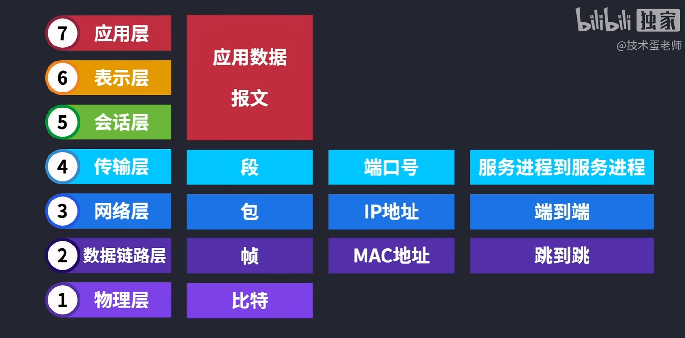

# 互联网数据传输原理 ｜ OSI七层网络参考模型

> [!TIP]
> `@todo` 本篇为速记, 之后可能会迁移位置.

[计算机基础知识点总结（操作系统+计算机网络）](https://cuterwrite.top/p/interview-help/)

## 一、各层职责

1. **物理层** 真正的数据 比特。

    设备: 中继器、集线器。因为需要媒介(光、电、其他形式电磁波) 传输信号。因此需要设备(中继器、集线器)

2. **数据链路层** 信号定向到 目标设备 帧 === MAC地址(物理地址) + 比特 === `帧`。
    
    设备: 交换机。为了通过 MAC地址 对不同设备进行数据传输。

3. **网络层** 地址管理、路由转发 `包`

    设备: 路由器 MAC 很难作为快速定位。IP寻址、路由选择快速找到。实现`端对端`

4. **传输层** TCP、UDP 数据传输 `段`

    服务进程到服务进行

5. **会话层** 网站登录状态、看电影看一半, 断电了, 再次登录还能接着看

6. **表示层** 编码、解码, 数据加密( https (ssl / tls))、文件瘦身(压缩)

7. **应用层** http, 应用如何沟通