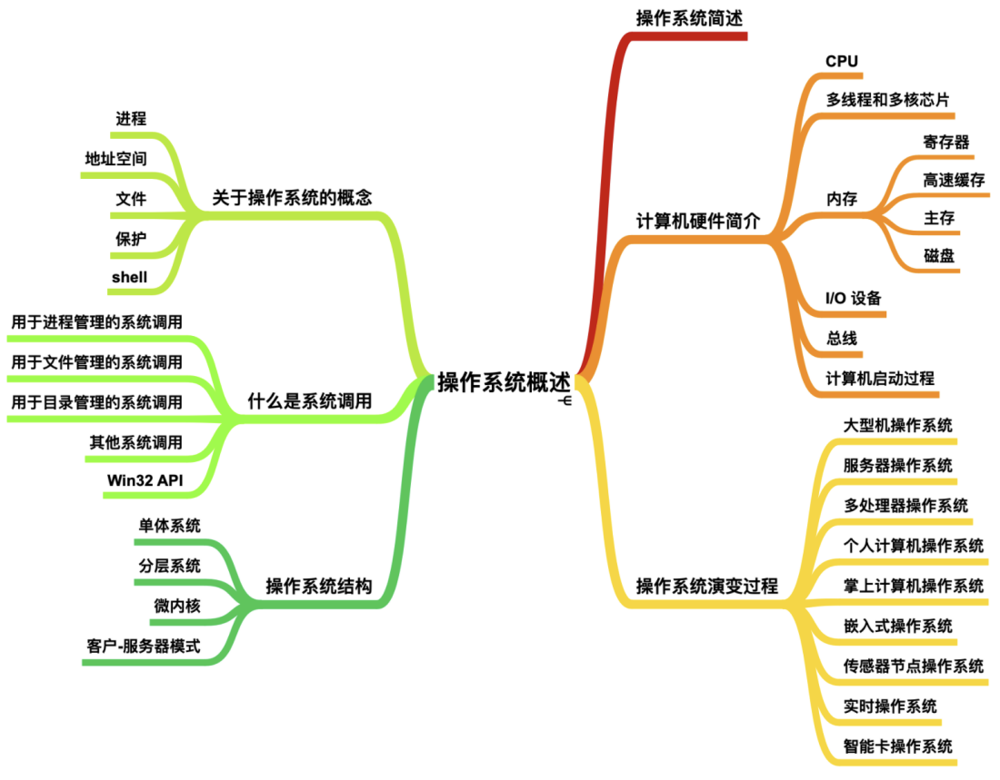
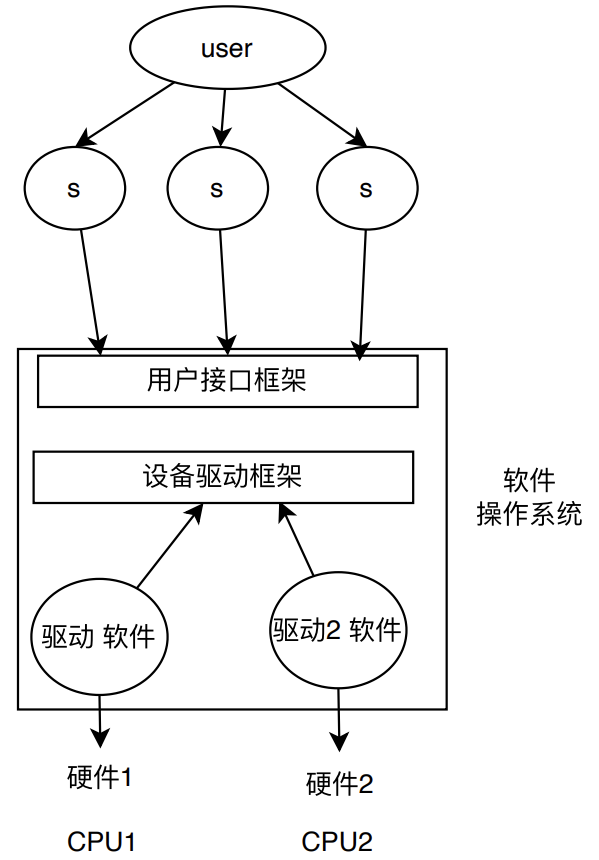
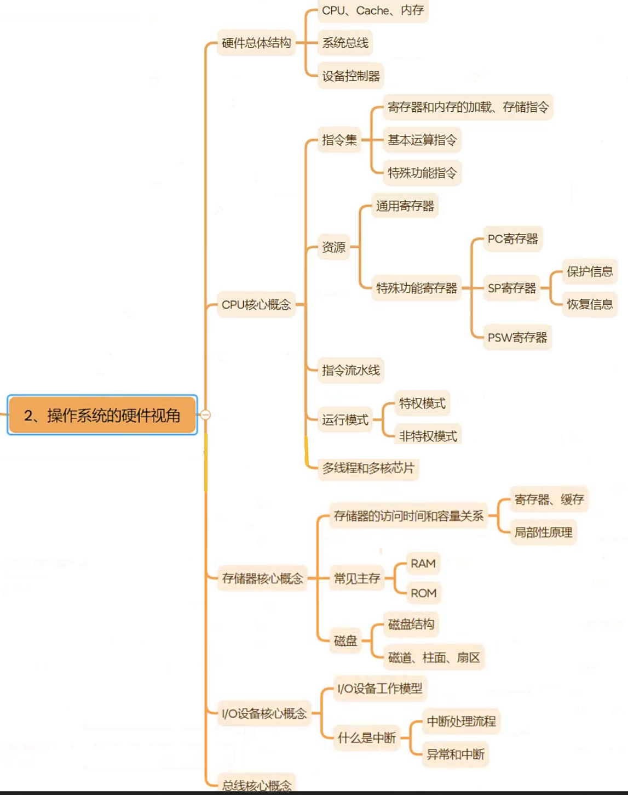

# 操作系统概述 01
## 1. 课程说明
1. 操作系统原理，遇到问题，问题解决方案
2. 硬件知识，汇编（RISC）ARM，C语⾔（内核 模块）
3. 概念 理解 Linux Ubuntu 22.04 vmware
4. 章节 理论 实验 常见面试试题（面试题 + 考研题）
linux  freeRTOS
5. CSAPP 教材: 操作系统导论

| ##container## |
|:--:|
||

## 2. 什么是操作系统
- 操作系统(Operating System)是一组控制和管理计算机`硬件`和`软件`资源

- 合理地对各类作业进行`调度`，方便用户使用计算机的`程序集合`

- 操作系统的核心目标是，使系统资源的`利用率高`，系统的`吞吐量大`。

| ##container## |
|:--:|
||

## 3. 从程序角度来看OS
### 3.1 提出问题
- **示例程序**: `hello world`
  - **文件**: `hello.c`
    - **存储与读取**: 文件系统
    - **转化为指令**: 从 `.c` 到二进制（如 `11010110`）

- 基于OS的程序设计与裸机程序

- 软件 运行多次 同时运⾏ CPU如何管理多个任务

- `int a; int b;` 存放内存 内存如何进⾏管理

#### 操作系统管理任务
- **CPU管理**
- **内存管理**
- **磁盘管理**
- **IO管理**

#### 关键概念
- 进程与线程 (业务程序员必熟悉)
- 内存管理机制 (业务程序员必熟悉)
- 文件系统
- IO设备管理
- 调度与同步机制

### 3.2 编译器角色与流程
- **平台**: Linux / Windows (MinGW)
- **编译器**: `gcc`（解决CPU指令集差异）

#### 编译过程
1. **编译**: 
   - `cc1 hello.c -o /tmp/cceVNE1I.s`
   - **命令**: `gcc -S`
   
2. **汇编**: 
   - `as -o /tmp/cc8ATX9H.o /tmp/cceVNE1I.s`
   - **命令**: `gcc -c`
   
3. **链接**: 
   - `ld -o build /tmp/cc8ATX9H.o .../*.o -lc`
   - **命令**: `gcc`

#### 编译选项
- `-nostdinc`: 不使用标准头文件
- `-nostdlib`: 不使用标准库

## 4. 硬件视角

| ##container## |
|:--:|
||
