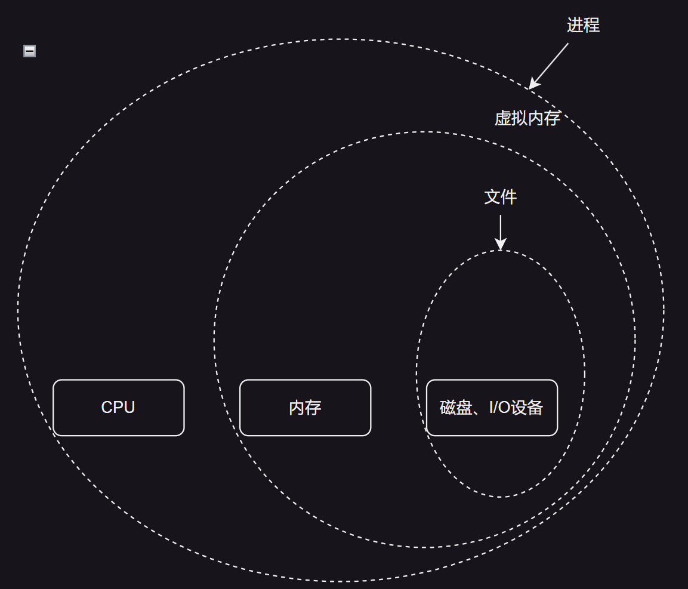
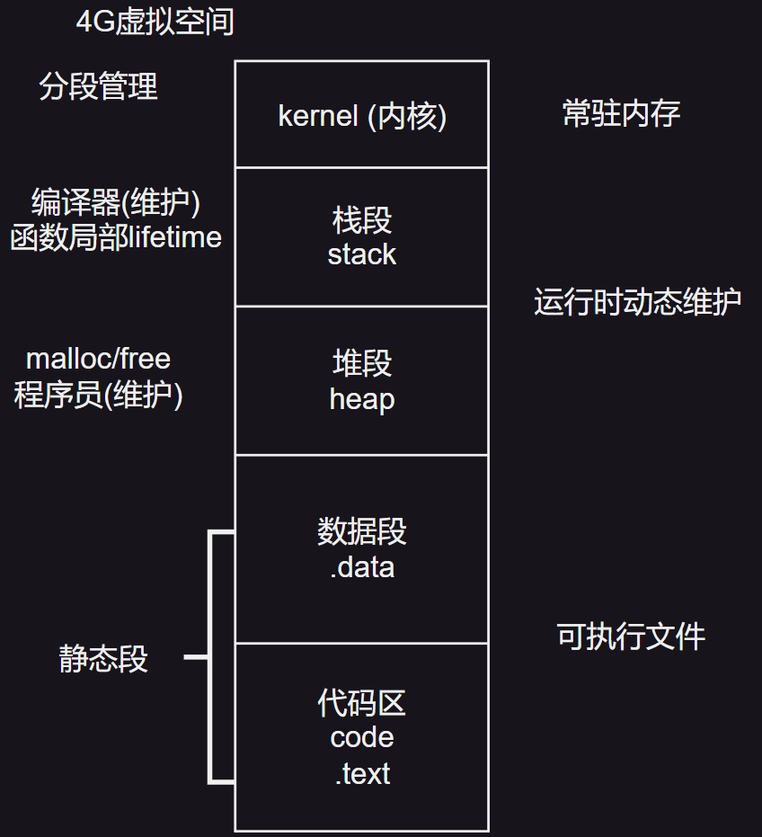
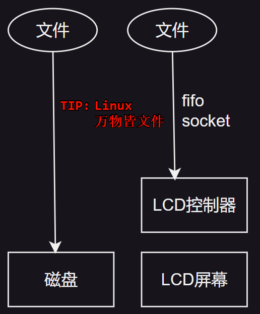
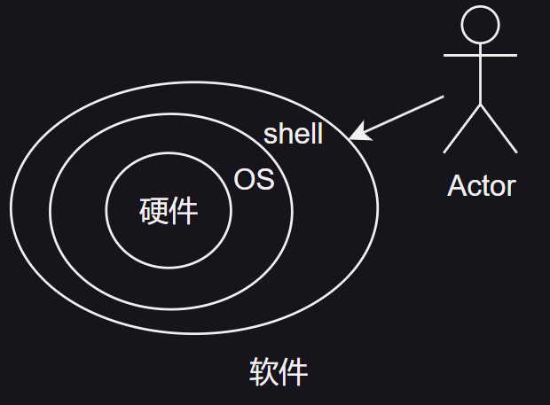
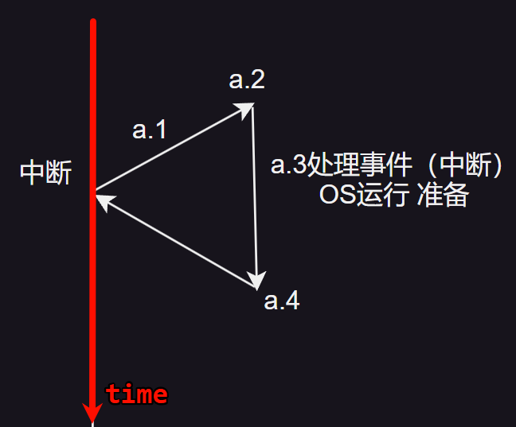
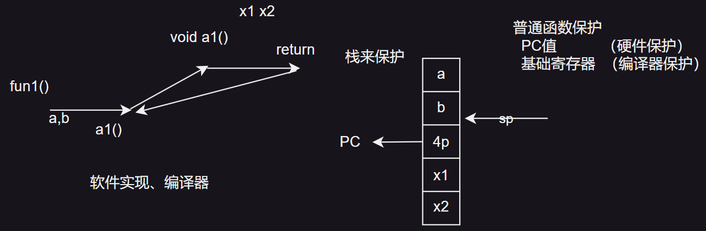
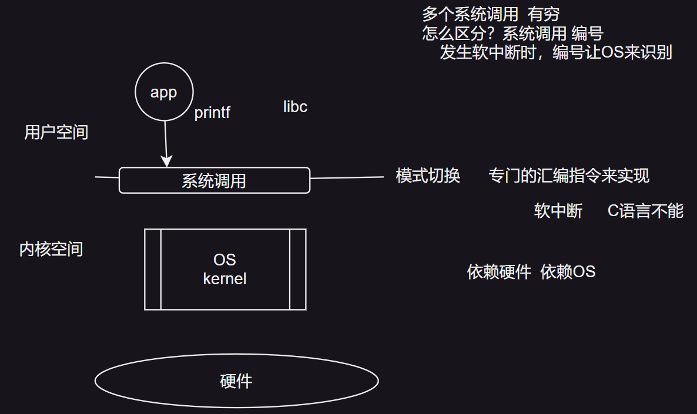

# 软件视角和系统调用
## 硬件支持系统 系统管理硬件
操作系统的核心功能可归结为两大方面：一是作为守护者，防止硬件资源被滥用，特别是防止失控程序（如含有错误的代码）对系统造成损害；二是作为协调者，通过一套简洁高效的机制，将复杂多变的硬件资源适配给多样化的应用程序，实现软件与硬件之间的无缝对接。

当我们从宏观视角审视计算机系统时，可以将其大致划分为软件与硬件两大层次。软件层面涵盖了应用程序与操作系统，而硬件则包括处理器、主存储器以及各类I/O设备。为了更有效地管理这些硬件资源，系统设计者引入了抽象的概念，其中最为核心的三大抽象便是进程、虚拟内存与文件。

- 文件：作为I/O设备的抽象，文件为应用程序提供了一种统一且高效的方式来访问和存储数据，无论这些数据是存储在硬盘、闪存还是其他类型的存储介质上。

- 虚拟内存：这一抽象不仅涵盖了主存储器，还扩展到了磁盘I/O设备。它允许操作系统以一种灵活且高效的方式管理内存资源，为应用程序提供远大于物理内存限制的虚拟地址空间。

- 进程：作为处理器、主存及I/O设备的综合抽象，进程是操作系统进行资源分配和调度的基本单位。每个进程都拥有独立的运行环境，包括程序代码、数据以及系统资源的使用权限，从而实现了多任务并发执行的目标。

文件是对于I/O设备的抽象。虚拟内存是对主存和磁盘I/O设备的抽象。进程是对于处理器、主存和I/O设备的抽象。

| ##container## |
|:--:|
||

通过这些抽象，操作系统不仅能够保护硬件资源免受损坏，还能简化应用程序开发者的工作，使他们无需深入了解底层硬件细节即可编写高效的应用程序。

## 进程

- 进程的管理: 进程树

- 进程间通信

## 线程

颗粒度更细, 开销更小, 资源共享.

## 地址空间

每台计算机的核心组件之一是其主存储器，它负责存储当前正在执行或待执行的程序指令与数据。

在基础而简单的操作系统环境下，主存被设计为仅支持单一应用程序的运行。若需启动第二个应用程序，系统必须先将当前运行的应用完全从内存中移除，为新应用腾出空间，这种方式极大地限制了多任务处理的能力。

随着操作系统的复杂化，一种更为高效的管理模式应运而生，即允许多个应用程序同时加载至内存并并行执行。为确保这些应用之间以及它们与操作系统本身互不干扰，引入了先进的保护机制。尽管这一机制的实现依赖于底层硬件的支持，但其具体的配置与调控则完全掌握在操作系统手中。通过精心设计的权限与隔离策略，系统能够确保每个应用仅访问其被授权的资源区域。

除了对主存资源的直接管理外，进程地址空间的管理也是操作系统内存管理中的关键一环。每个进程被分配了一个专属的地址集合，这些地址通常从0开始连续编号，直至达到一个预设的最大值。值得注意的是，尽管进程的地址空间理论上可以非常庞大，但实际上，其最大值往往小于物理主存的容量。

这意味着，在多数情况下，即使进程耗尽其内部地址空间，物理内存仍有剩余空间可供其他进程或系统服务使用。

然而，在现代32位或64位架构的计算机中，进程的地址空间规模可分别达到惊人的2^32或2^64字节，远远超出了普通计算机物理内存的容量。面对这种情况，若某个进程试图访问一个超出物理内存限制的地址空间，早期的计算机系统将束手无策。但幸运的是，随着技术的进步，特别是虚拟内存技术的出现，这一问题得到了有效解决。

虚拟内存技术允许操作系统将进程的一部分数据页保留在磁盘上，而将另一部分数据页装入主存。

当进程需要访问磁盘上的数据页时，操作系统会将该页从磁盘调入主存，并将主存中的某一页换出到磁盘上，以腾出空间。这种机制使得进程可以使用比实际主存更大的地址空间，从而提高了内存的利用率，并允许更多的进程同时运行。

## 虚拟内存
当我们深入探讨程序执行的细节时，不难发现，程序的加载与执行是一个精密且复杂的过程。具体来说，程序从磁盘这一持久化存储介质中被读取，其编码形式的指令和数据首先被加载到内存中，以便快速访问。随后，这些数据和指令进一步被转移到CPU的寄存器中，寄存器作为CPU的直接工作空间，存放着用于计算的各种地址和数据。

然而，在实际操作环境中，直接允许程序访问物理内存是极其危险且低效的。这是因为直接暴露物理内存给程序控制，会带来一系列严重的问题和挑战：

1. **安全风险增加**：进程直接访问物理地址可能破坏系统稳定性，导致数据泄露、错误覆盖或其他不可预估的灾难性后果，从而对整个系统的安全构成巨大威胁。

2. **资源利用效率低下**：物理内存作为有限的硬件资源，其高效管理至关重要。若任由进程直接操作，不仅会引发资源浪费，还可能因无序访问导致物理内存碎片化，影响系统整体性能。

3. **内存管理复杂性提升**：当程序尝试直接管理物理内存时，内存分配与回收将变得极为复杂，特别是连续内存分配的需求往往导致大量难以再利用的内存碎片产生，进而加剧内存管理难度。

为解决上述问题，虚拟内存技术应运而生。虚拟内存作为物理内存与进程之间的一个抽象层，其核心价值在于为进程提供了一个独立的、看似无限大的内存空间，即虚拟内存空间。通过这个机制，每个进程都以为自己独占了整个内存，而实际上它只是在访问一个由操作系统精心管理的虚拟地址空间。这样，每个进程看到的内存视图都是一致的，且它们操作的都是虚拟内存地址，而非真实的物理内存地址。这种方式不仅提高了系统的安全性和资源利用率，还极大地简化了内存管理的复杂性。

在32位系统下, C语言我们学过`4G虚拟空间`:

| ##container## |
|:--:|
||

## 文件
每个进程都拥有一个工作目录（working directory），作为相对路径的基准点。当路径不以斜杠开头时，系统将在工作目录下进行搜索。通过改变工作目录，进程可以灵活地访问不同位置的文件，这一操作通过系统调用实现。

在文件操作之前，必须进行打开操作并验证访问权限。一旦权限获准，系统将分配一个文件描述符（file descriptor），这是一个非负整数，用于后续的文件读写操作。若访问被拒绝，系统则返回错误代码。

在Unix/Linux系统中，另一个重要的概念是特殊文件（Special File）。特殊文件的设计是为了让I/O设备看起来像普通文件一样。这样，I/O设备可以通过与普通文件相同的系统调用来进行读写操作。

特殊文件有两种类型：块特殊文件（Block Special File）和字符特殊文件（Character Special File）。块特殊文件适用于那些由可随机访问的块组成的设备，如磁盘。例如，打开一个块特殊文件并读取第4块时，程序可以直接访问设备的第4块，而无需关心文件系统结构。字符特殊文件则用于打印机、调制解调器等设备，这些设备处理的是字符流。按照惯例，特殊文件通常保存在 /dev 目录中。例如， /dev/lp0 表示打印机。

| ##container## |
|:--:|
||

还有一种与进程和文件相关的特性是管道（Pipe）。管道是一种特殊的文件，用于在两个进程之间建立通信连接。

管道本质上是一种特殊的虚拟文件，它并非存储在磁盘上的实体，而是存在于内存中的一段空间，专门用于实现进程间的数据传输。

如果进程A和进程B希望通过管道进行通信，它们必须首先创建一个管道。当进程A需要向进程B发送数据时，它将数据写入管道，就如同写入一个普通的输出文件一样。进程B则可以从管道中读取数据，就如同从一个输入文件中读取数据一样。在UNIX中，这种进程间的通信机制非常类似于普通文件的读写操作，使得开发人员可以使用熟悉的文件操作接口来进行进程间通信。

## 保护
计算机系统中存储着海量的信息，这些信息种类繁多且价值不一，其中包括敏感的电子邮件、机密的商业计划等。用户对这些信息中既有用又重要的部分有着强烈的保护需求，以确保其不被未经授权的访问所侵害。这种信息管理的安全性，在很大程度上，是依赖于操作系统的强大保护机制来实现的。

以UNIX操作系统为例，它采用了一种精细且高效的文件保护机制。具体而言，UNIX为系统中的每个文件分配了一个独特的9位二进制保护代码，这一机制为文件安全提供了坚实的基石。这9位保护代码被精心划分为三个子段，每个子段对应着不同类别的用户权限：第一段针对文件的所有者，第二段针对与所有者同组（即系统管理员根据特定规则划分的用户组）的成员，而第三段则针对除前两者之外的其他所有用户。

每个子段内包含三位，分别用于控制读（r）、写（w）和执行（x）三种访问权限。这些权限位共同构成了广为人知的“rwx位”，它们以直观的方式展示了不同用户群体对文件的操作权限。

举例来说，若一个文件的保护代码被设置为 rwxr-x--x ，这意味着：
- 文件的所有者（owner）拥有完全的权限，即可以读取（r）、写入（w）或执行（x）该文件。
- 与所有者同组的成员（group）则受到一定的限制，他们只能读取（r）或执行（x）该文件，但无法对其进行修改（即不能写w）。

- 而对于其他所有用户（others），他们的权限更为有限，仅能执行（x）该文件，既无法读取（r）也无法写入（w）其内容。

通过这样的权限控制机制，UNIX操作系统有效地保障了系统中信息的安全性和隐私性，使得用户能够根据自己的需求，灵活设置文件的访问权限。([Linux权限的介绍](../../../../004-DevOps与版本控制/001-Linux/002-Linux基础篇/003-组与权限/002-Linux权限的介绍/index.md))

## shell

### 操作系统与 Shell 的关系

操作系统是底层系统软件的核心，负责执行系统调用，成为程序与硬件交互的桥梁。尽管编辑器、编译器、汇编器、链接器以及用户级应用程序在软件开发中扮演着重要角色，但它们并不直接构成操作系统的核心部分。此时，我们深入探讨 UNIX 环境下的一个关键组件——Shell。

### Shell 的功能与作用

Shell 是用户与操作系统之间的交互界面，提供命令行接口，使用户能够执行命令、管理文件和目录。在 UNIX 系统中存在多种 Shell 实现，如 sh、csh、ksh 和广泛使用的 bash 等，其中 sh（Bourne Shell）是这一领域的先驱。

### Shell 的工作机制

当用户登录到 UNIX 系统时，系统通常会启动一个 Shell 进程，该进程以用户的终端作为标准输入和输出设备。启动后，Shell 会显示一个提示符（如 $ ），标志着它已准备好接收用户输入的命令。用户输入的每个命令（如 `date`），Shell 都会为其创建一个新的子进程执行，期间 Shell 会暂停其他活动，等待子进程完成，然后再次显示提示符。

### 重定向功能

Shell 提供强大的重定向功能，允许用户改变命令的标准输入（stdin）和标准输出（stdout）的来源和去向。例如，使用 `>` 操作符可以将 `date` 命令的输出重定向到文件中，而 `<` 操作符则可以将文件内容作为输入重定向给某个命令，如 `sort file2`。

### 管道功能

更进一步，Shell 支持管道（pipe）功能，允许用户将一个命令的输出直接作为另一个命令的输入，实现命令间的无缝连接。例如，命令 `cat file1 file2 file3 | sort > /dev/lp` 首先使用 `cat` 合并三个文件的内容，然后通过管道传递给 `sort` 命令进行排序，最后将 `sort` 的输出重定向到 `/dev/lp`，通常用于发送到打印机。这种灵活的组合方式极大地增强了 UNIX 系统的功能性和易用性。

| ##container## |
|:--:|
||
|shell与OS的关系|

## [重点]: 异常处理

| ##container## |
|:--:|
||
|异常处理过程|

> 被动发生: 外部中断

<pre>
<span style="color:red">a.1 保护现场</span>
  PC值    （CPU保护）
  PSW寄存器（OS保护）
  基础寄存器（OS保护）

<span style="color:red">a.2 中断入口在哪里</span>
   CPU来提供
   中断表 OS来准备

<span style="color:red">a.3 中断处理函数</span>
  操作系统来准备

<span style="color:red">a.4 中断返回</span>
普通函数的返回
特定的汇编语言, 不是return
   硬件可以实现
   OS也可以实现
</pre>

- 对比:

| ##container## |
|:--:|
||
|普通函数调用过程|

## 系统调用

| ##container## |
|:--:|
||

查看系统调用: (Linux)

```sh
strace <程序>
```
