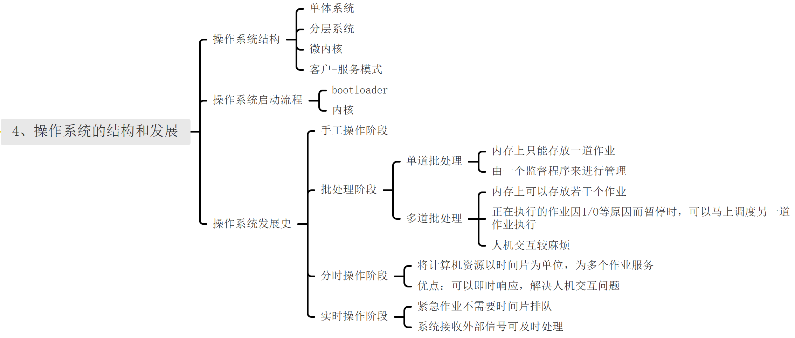
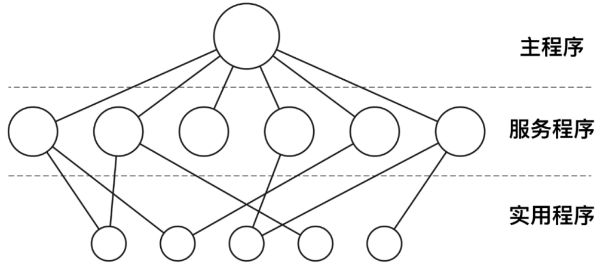
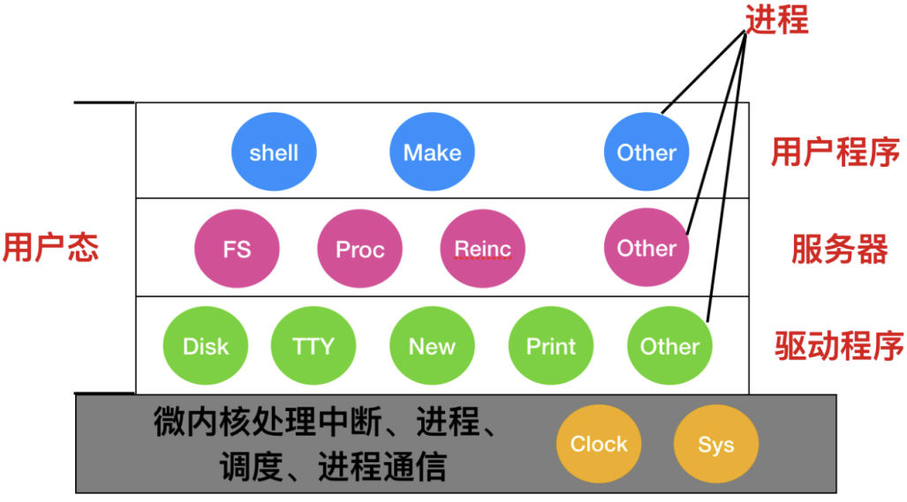
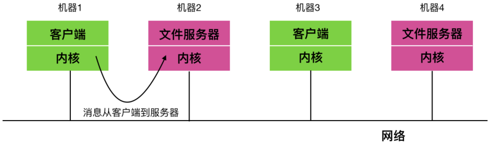
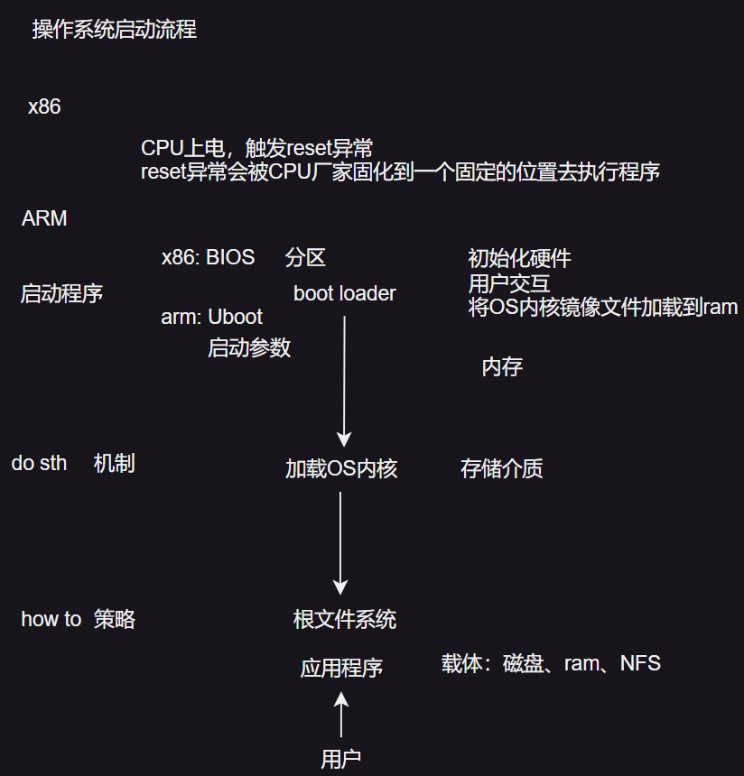

# 操作系统发展史
## 0. 总览
| ##container## |
|:--:|
||

## 1. 操作系统结构
### 1.1 单体系统
在现代计算机体系结构中, 尽管存在多种操作系统架构, 但传统上, 许多系统采用单体内核
(Monolithic Kernel)设计, 即整个操作系统作为一个大型、单一的二进制程序在内核态运行。这种设计将操作系统的各个组件(如进程管理、内存管理、文件系统、设备驱动等)紧密集成, 通过编译和链接成一个单独的可执行文件来实现。

单体内核的优势在于, 由于所有组件都位于同一地址空间内, 进程间调用(或系统内部组件间的交互)非常高效, 减少了上下文切换的开销。然而, 这种设计也带来了显著的弊端: 首先, 系统规模庞大, 复杂性高, 使得维护和调试变得困难；其次, 单体内核的“一荣俱荣, 一损俱损”特性意味着一旦内核中的任何部分出现问题, 整个系统都可能受到影响, 导致系统崩溃或服务中断, 这是极其危险的。

在单体系统的开发过程中, 通常遵循以下原则: 
1. 主程序: 作为系统的入口点, 负责初始化系统并调度其他服务程序。
2. 服务过程: 直接处理系统调用, 是内核与用户空间交互的桥梁。
3. 辅助服务程序: 为服务过程提供支持, 如数据处理、资源管理等, 形成层次化的服务架构。

为了管理这种复杂性, 开发者们倾向于将系统划分为逻辑上的层次或模块, 尽管物理上它们仍然紧密集成。这种划分有助于理解和维护, 但并未从根本上解决单体系统的固有问题。

| ##container## |
|:--:|
||

为了增强系统的模块性和可扩展性, 现代操作系统引入了模块化和动态加载的机制。例如, 在UNIX和类UNIX系统中, 可以通过加载共享库(Shared Library)来动态扩展系统功能, 而在Windows系统中, 则采用动态链接库(Dynamic Link Library, DLL)来实现类似的功能。这些库文件包含了可重用的代码和数据, 能够在程序运行时根据需要加载, 既提高了系统的灵活性, 又减少了初始加载时的内存占用。值得注意的是, 由于这些库文件在系统运行中扮演着重要角色, 因此用户应避免随意删除或修改, 以免引发系统问题。

### 1.2 分层系统
分层系统设计是一种组织软件架构的方法, 它通过层级来隔离不同的功能模块。每一层仅与其相邻的上层和下层进行通信, 并利用下层提供的服务来实现自身的功能。层间的通信通过预定义的接口进行, 这些接口提供了标准化的服务。

```C++
              Layer
              |   ^
              v   |
              Layer
              |   ^
              v   |
              Layer
```

分层系统的一个著名实例是由 E.W. Dijkstra 及其学生在荷兰技术学院(现代尔夫特理工大学)开发的 THE 系统。THE 系统采用了一种层次结构, 将复杂的操作系统功能分解为多个简单的层次。

将单一的整体系统设计进一步抽象化, 可以发展成为一个层次化的操作系统架构。THE 系统就是一个典型的六层结构, 各层的功能如下: 


|层号|功能|
|:-:|:-:|
|5|操作员|
|4|用户程序|
|3|输入/输出管理|
|2|操作员-进程通信|
|1|存储器和磁鼓管理|
|0|处理器分配和多道程序编程|

第 0 层包含了处理器分配机制, 当发生中断或定时器超时时, 该层负责进行进程切换。在第 0 层之上, 系统由一系列相互协作的进程构成, 这些进程无需关心底层的多道程序运行细节。第 1 层负责内存管理, 包括为主存中的进程分配空间, 并确保当进程需要访问某页面时, 该页面已存在于内存中, 并在不再需要时将其移出。

第 2 层专注于实现进程与操作员控制台之间的通信。第 3 层则管理输入/输出设备及其相关的缓冲区。第 4 层是用户程序所在的层, 这里的程序无需关心进程管理、内存分配、控制台交互或 I/O 设备管理等问题。最高层, 即第 5 层, 提供了系统操作员与系统交互的界面。

通过这样的分层设计, THE 系统不仅提高了模块化程度, 还增强了系统的可维护性和扩展性。

### 1.3 微内核
在分层设计方法中, 设计者需要明确界定`内核-用户`边界的划分。传统上, 所有的层都被置于内核中, 但这并非必要, 且可能不是最佳实践。实际上, 减少内核中的功能以达到最小化内核的目标可能是更优的选择。因为内核中的错误难以处理, 一旦出现错误, 可能导致整个系统的崩溃。

为了提高可靠性和灵活性, 将操作系统划分为小型、功能明确的模块是非常有益的。在这些模块中, 只有一个模块——即微内核——运行在特权模式(内核态), 而其他的模块则作为普通用户进程运行。这意味着, 设备驱动程序和文件系统等组件作为用户进程运行, 即使这些模块出现故障导致崩溃, 也不会影响整个系统的稳定性。

MINIX 3 是微内核的代表作, 它的具体结构如下:

| ##container## |
|:--:|
||
|MINIX 3 系统结构|

在微内核之外, 系统的结构可以分为三层, 全部运行在用户态下。最底层是设备驱动程序, 由于它们运行在用户态, 因此无法直接访问 I/O 端口或直接发送 I/O 命令。为了与硬件交互, 驱动程序需要构造一个结构来指定哪些参数应写入哪些 I/O 端口, 并发起一个系统调用, 从而间接地与硬件进行交互。

设备驱动程序之上是一层被称为“服务器”的组件, 其中包括执行操作系统主要工作的各个服务器。

文件系统由一个或多个文件服务器管理, 进程管理则由进程管理器负责, 它创建、销毁和管理进程。此外, 还有一个特殊的服务器称为“重生服务器”(reincarnation server), 其职责是检测和修复服务器及驱动程序的故障, 无需用户干预即可自动恢复服务, 从而增强系统的恢复能力和可靠性。

微内核的设计还体现了机制与策略分离的原则。例如, 在进程调度方面, 内核可能实现一个简单的调度算法, 如根据进程的优先级来选择下一个要执行的进程。在这里, 内核的机制就是选择最高优先级的进程并运行它, 而策略(即如何分配优先级)则由用户态下的进程管理器决定。通过这种方式, 策略与机制得以分离, 从而使得内核更加精简, 并且易于维护和扩展。

### 1.4 客户-服务器模式
微内核思想的策略是把进程划分为两类: `服务器`, 每个服务器用来提供服务；`客户端`, 使用这些服务。这个模式就是所谓的`客户-服务器`模式。

客户-服务器模式会有两种载体, 一种情况是一台计算机既是客户又是服务器, 在这种方式下, 操作系统会有某种优化；但是普遍情况下是客户端和服务器在不同的机器上, 它们通过局域网或广域网连接。

| ##container## |
|:--:|
||

客户通过发送消息与服务器通信, 客户端并不需要知道这些消息是在本地机器上处理, 还是通过网络被送到远程机器上处理。对于客户端而言, 这两种情形是一样的: 都是发送请求并得到回应。

越来越多的系统, 包括家里的 PC, 都成为客户端, 而在某地运行的大型机器则成为服务器。许多web 就是以这种方式运行的。一台 PC 向某个服务器请求一个 Web 页面, 服务器把 Web 页面返回给客户端, 这就是典型的客服-服务器模式

## 2. 操作系统的启动流程

| ##container## |
|:--:|
||

不同的架构的启动是有区别的.

### 2.1 x86 启动
那么有了上面一些硬件再加上操作系统的支持, 我们的计算机就可以开始工作了, 那么计算机的启动过程是怎样的呢？下面只是一个简要版的启动过程

在每台计算机上有一块双亲板, 也就是母板, 母板也就是主板, 它是计算机最基本也就是最重要的部件之一。主板一般为矩形电路板, 上面安装了组成计算机的主要电路系统, 一般有 BIOS 芯片、I/O控制芯片、键盘和面板控制开关接口、指示灯插接件、扩充插槽、主板及插卡的直流电源供电接插件等元件。

在母板上有一个称为`基本输入输出系统(Basic Input Output System, BIOS)`的程序。在 BIOS内有底层 I/O 软件, 包括读键盘、写屏幕、磁盘I/O 以及其他过程。如今, 它被保存在闪存中, 它是非易失性的, 但是当BIOS 中发现错误时, 可以由操作系统进行更新。

在计算机`启动(booted)`时, BIOS 开启, 它会首先检查所安装的 RAM 的数量, 键盘和其他基础设备是否已安装并且正常响应。接着, 它开始扫描 PCIe 和 PCI 总线并找出连在上面的所有设备。即插即用的设备也会被记录下来。如果现有的设备和系统上一次启动时的设备不同, 则新的设备将被重新配置。

蓝后, BIOS 通过尝试存储在`CMOS`存储器中的设备清单尝试启动设备

> CMOS是`Complementary Metal Oxide Semiconductor(互补金属氧化物半导体)`的缩写。它是指制造大规模集成电路芯片用的一种技术或用这种技术制造出来的芯片, 是电脑主板上的一块可读写的 RAM 芯片。因为可读写的特性, 所以在电脑主板上用来保存 BIOS 设置完电脑硬件参数后的数据, 这个芯片仅仅是用来存放数据的。
>
> 而对 BIOS 中各项参数的设定要通过专门的程序。BIOS 设置程序一般都被厂商整合在芯片中, 在开机时通过特定的按键就可进入 BIOS 设置程序, 方便地对系统进行设置。因此 BIOS 设置有时也被叫做 CMOS 设置。

用户可以在系统启动后进入一个 BIOS 配置程序, 对设备清单进行修改。然后, 判断是否能够从外部`CD-ROM`和 USB 驱动程序启动, 如果启动失败的话(也就是没有), 系统将从硬盘启动, boots 设备中的第一个扇区被读入内存并执行。该扇区包含一个程序, 该程序通常在引导扇区末尾检查分区表以确定哪个分区处于活动状态。然后从该分区读入第二个启动加载程序, 该加载器从活动分区中读取操作系统并启动它。

然后操作系统会询问 BIOS 获取配置信息。对于每个设备来说, 会检查是否有设备驱动程序。如果没有, 则会向用户询问是否需要插入`CD-ROM`驱动(由设备制造商提供)或者从 Internet 上下载。一旦有了设备驱动程序, 操作系统会把它们加载到内核中, 然后初始化表, 创建所需的后台进程, 并启动登录程序或GUI。