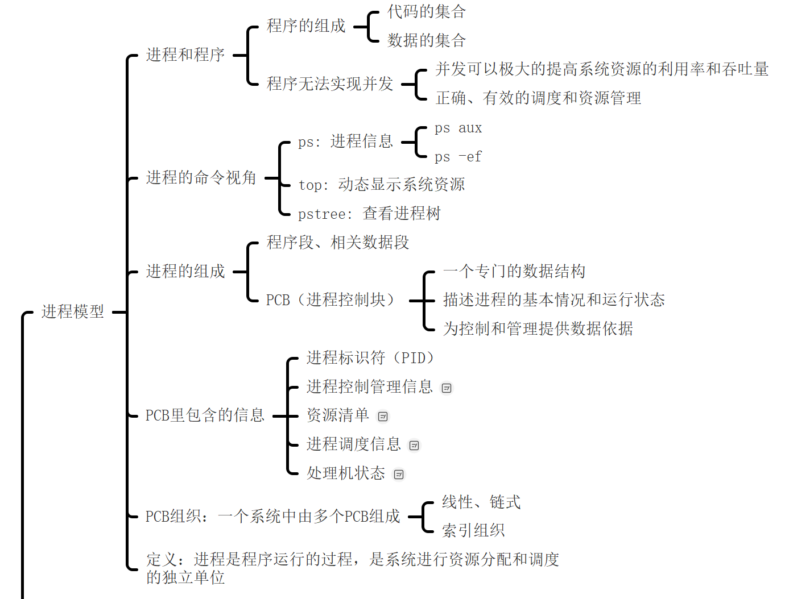
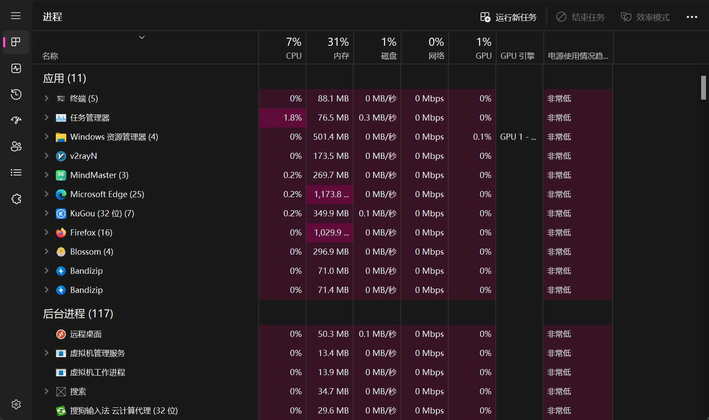
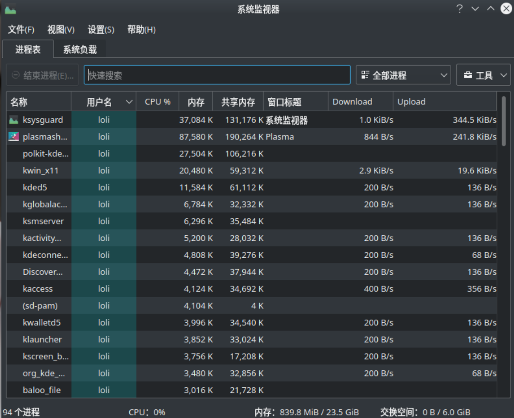
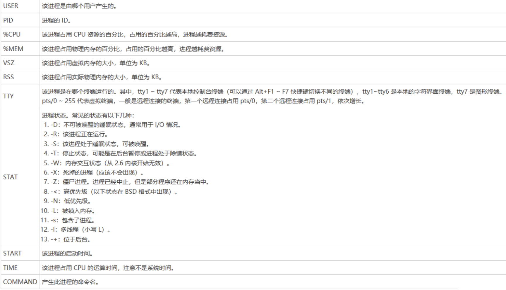
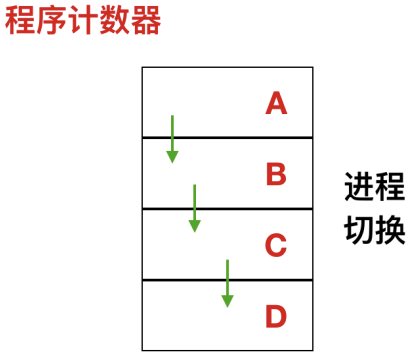
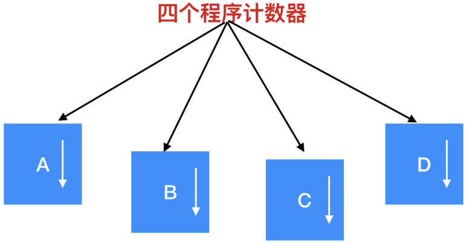
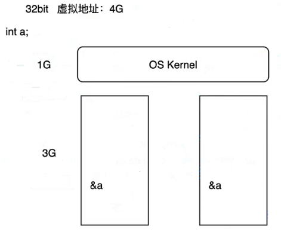

# 进程简介及进程编程模型

| ##container## |
|:--:|
||

## 1. 进程是个嘛?

| ##container## |
|:--:|
||
|win11的进程|
||
|Linux的进程|

### 1.1 进程与程序

我们先区分一下`进程与程序`, 可以简单的理解为: $$进程 ≈ 程序的运行过程$$ 有点类似于`类`和`类实例化出来的对象`.

你想想, 我们是不是可以运行同一个程序多次(比如运行`浏览器`这个程序, 但是启动多个(进程))? ~

需要很多资源来管理运行的这些过程, 数据结构: 进程控制块`PCB`

我们知道, Linux中, `sys`文件夹很重要. 那么你是否了解过: `proc`?

```sh
loli@HengXin-ROG-PRIME:/proc$ ls
1     1292  307  353  527  81         cmdline      fs           kpagecount  pagetypeinfo  tty
1046  1294  310  354  533  816        config.gz    interrupts   kpageflags  partitions    uptime
1056  1373  312  370  542  817        consoles     iomem        loadavg     schedstat     version
1060  1698  314  390  550  833        cpuinfo      ioports      locks       self          vmallocinfo
1086  2     316  406  551  84         crypto       irq          mdstat      softirqs      vmstat
1104  271   323  426  555  854        devices      kallsyms     meminfo     stat          zoneinfo
1150  275   325  427  600  9          diskstats    kcore        misc        swaps
1187  281   330  459  601  acpi       dma          key-users    modules     sys
1217  290   339  467  602  buddyinfo  driver       keys         mounts      sysvipc
1242  294   345  506  603  bus        execdomains  kmsg         mtrr        thread-self
1287  297   351  524  61   cgroups    filesystems  kpagecgroup  net         timer_list

loli@HengXin-ROG-PRIME:/proc$ ps
    PID TTY          TIME CMD
    602 pts/0    00:00:00 bash
   1700 pts/0    00:00:00 ps
```

我们可以看到这个目录下好多数字命名的文件夹, 而这些数字不是别的, 而是进程的`pid`, 里面存储了很多进程的数据:

```sh
loli@HengXin-ROG-PRIME:/proc/602$ ls
arch_status  coredump_filter  gid_map    mountinfo   oom_score_adj  sessionid     status          wchan
attr         cpuset           io         mounts      pagemap        setgroups     syscall
auxv         cwd              limits     mountstats  personality    smaps         task
cgroup       environ          loginuid   net         projid_map     smaps_rollup  timens_offsets
clear_refs   exe              map_files  ns          root           stack         timers
cmdline      fd               maps       oom_adj     sched          stat          timerslack_ns
comm         fdinfo           mem        oom_score   schedstat      statm         uid_map
```

这里有不少我们熟悉的:

```sh
loli@HengXin-ROG-PRIME:/proc/602/fd$ ls
0  1  2  255
loli@HengXin-ROG-PRIME:/proc/602/fd$ echo "Nb Os!" > 1
Nb Os!
```

发现真的在终端打印了! 因为我们是向输出流缓冲区写入数据...

### 1.2 查看进程: 从命令来体验

```sh
loli@HengXin-ROG-PRIME:~$ ps # 显示当前连接的前台进程
    PID TTY          TIME CMD
    602 pts/0    00:00:00 bash
   1688 pts/0    00:00:00 ps
```

```sh
loli@HengXin-ROG-PRIME:~$ ps aux # 将以简单的列表形式显示出进程信息
USER         PID %CPU %MEM    VSZ   RSS TTY      STAT START   TIME COMMAND
root           1  0.0  0.0 170800 13832 ?        Ss   22:34   0:00 /sbin/init
root           2  0.0  0.0   2616  1440 ?        Sl   22:34   0:00 /init
root           9  0.0  0.0   2628   140 ?        Sl   22:34   0:00 plan9 --control-socket 6 --log-level 4
root          61  0.0  0.0  52292 16664 ?        S<s  22:34   0:00 /lib/systemd/systemd-journald
root          81  0.0  0.0  22956  7316 ?        Ss   22:34   0:00 /lib/systemd/systemd-udevd
systemd+      84  0.0  0.0  19088  7704 ?        Ss   22:34   0:00 /lib/systemd/systemd-networkd
root         271  0.0  0.0 151124   924 ?        Ssl  22:34   0:00 snapfuse /var/lib/snapd/snaps/core20_1
root         275  0.0  0.0 520328  7344 ?        Ssl  22:34   0:00 snapfuse /var/lib/snapd/snaps/core20_2
root         281  0.0  0.0 298860   224 ?        Ssl  22:34   0:00 snapfuse /var/lib/snapd/snaps/lxd_2406
root         290  0.0  0.0 151256   492 ?        Ssl  22:34   0:00 snapfuse /var/lib/snapd/snaps/lxd_2961
root         294  0.0  0.0 151124   192 ?        Ssl  22:34   0:00 snapfuse /var/lib/snapd/snaps/snapd_19
root         297  0.0  0.0 298724  5372 ?        Ssl  22:34   0:00 snapfuse /var/lib/snapd/snaps/snapd_21
systemd+     307  0.0  0.0  24768 12096 ?        Ss   22:34   0:00 /lib/systemd/systemd-resolved
root         310  0.0  0.0 237952  8156 ?        Ssl  22:34   0:00 /usr/lib/accountsservice/accounts-daem
avahi        312  0.0  0.0   8540  3516 ?        Ss   22:34   0:00 avahi-daemon: running [HengXin-ROG-PRI
message+     314  0.0  0.0   9784  6144 ?        Ss   22:34   0:00 /usr/bin/dbus-daemon --system --addres
root         316  0.0  0.0 260852 18488 ?        Ssl  22:34   0:00 /usr/sbin/NetworkManager --no-daemon
root         323  0.0  0.0  37252 20248 ?        Ss   22:34   0:00 /usr/bin/python3 /usr/bin/networkd-dis
root         325  0.0  0.0 240692 10708 ?        Ssl  22:34   0:00 /usr/lib/policykit-1/polkitd --no-debu
syslog       330  0.0  0.0 224352  6316 ?        Ssl  22:34   0:00 /usr/sbin/rsyslogd -n -iNONE
root         339  0.0  0.1 1911820 41148 ?       Ssl  22:34   0:00 /usr/lib/snapd/snapd
root         345  0.0  0.0 234748  5876 ?        Ssl  22:34   0:00 /usr/libexec/switcheroo-control
root         351  0.0  0.0  17496  7660 ?        Ss   22:34   0:00 /lib/systemd/systemd-logind
root         353  0.0  0.0 393344 12328 ?        Ssl  22:34   0:00 /usr/lib/udisks2/udisksd
root         354  0.0  0.0  13700  4760 ?        Ss   22:34   0:00 /sbin/wpa_supplicant -u -s -O /run/wpa
avahi        370  0.0  0.0   8348   324 ?        S    22:34   0:00 avahi-daemon: chroot helper
root         390  0.0  0.0 176368 12488 ?        Ssl  22:34   0:00 /usr/sbin/cups-browsed
root         406  0.0  0.0 315104 11336 ?        Ssl  22:34   0:00 /usr/sbin/ModemManager
root         426  0.0  0.0 115788 22536 ?        Ssl  22:34   0:00 /usr/bin/python3 /usr/share/unattended
root         427  0.0  0.0  10352  2360 ?        S    22:34   0:00 /usr/sbin/xrdp-sesman
root         459  0.0  0.0  32040  8412 ?        Ss   22:34   0:00 /usr/sbin/cupsd -l
xrdp         467  0.0  0.0  10468   608 ?        S    22:34   0:00 /usr/sbin/xrdp
root         506  0.0  0.0   8548  2852 ?        Ss   22:34   0:00 /usr/sbin/cron -f
whoopsie     524  0.0  0.0 175284 13988 ?        Ssl  22:34   0:00 /usr/bin/whoopsie -f
daemon       527  0.0  0.0   3804  2072 ?        Ss   22:34   0:00 /usr/sbin/atd -f
kernoops     533  0.0  0.0  11272   448 ?        Ss   22:34   0:00 /usr/sbin/kerneloops --test
kernoops     542  0.0  0.0  11272   448 ?        Ss   22:34   0:00 /usr/sbin/kerneloops
root         550  0.0  0.0 305892  7600 ?        SLsl 22:34   0:00 /usr/sbin/lightdm
root         551  0.0  0.0   7360  2348 hvc0     Ss+  22:34   0:00 /sbin/agetty -o -p -- \u --noclear --k
root         555  0.0  0.0   5836  1824 tty1     Ss+  22:34   0:00 /sbin/agetty -o -p -- \u --noclear tty
root         600  0.0  0.0   2624   120 ?        Ss   22:34   0:00 /init
root         601  0.0  0.0   2624   128 ?        D    22:34   0:00 /init
loli         602  0.0  0.0  10724  5668 pts/0    Ss   22:34   0:00 -bash
root         603  0.0  0.0   5756  4364 pts/1    Ss   22:34   0:00 /bin/login -f
loli         816  0.0  0.0  19268  9840 ?        Ss   22:34   0:00 /lib/systemd/systemd --user
loli         817  0.0  0.0 172212  4212 ?        S    22:34   0:00 (sd-pam)
loli         833  0.0  0.0  10684  5508 pts/1    S+   22:34   0:00 -bash
rtkit        854  0.0  0.0 152936  4972 ?        SNsl 22:34   0:00 /usr/libexec/rtkit-daemon
root        1046  0.0  0.0 251240  9604 ?        Ssl  22:35   0:00 /usr/lib/upower/upowerd
colord      1056  0.0  0.0 245380 14320 ?        Ssl  22:35   0:00 /usr/libexec/colord
root        1060  0.0  0.0 160128  8876 ?        Sl   22:35   0:00 lightdm --session-child 17 22
loli        1086  0.0  0.0 125540 11436 ?        Ssl  22:35   0:00 /usr/bin/startplasma-x11
loli        1104  0.0  0.0   7520  4756 ?        Ss   22:35   0:00 /usr/bin/dbus-daemon --session --addre
loli        1150  0.0  0.0   6044   452 ?        Ss   22:35   0:00 /usr/bin/ssh-agent /usr/bin/im-launch
loli        1187  0.0  0.0 156112  5372 ?        Sl   22:35   0:00 /usr/libexec/dconf-service
loli        1217  0.0  0.0 235404 23512 ?        Sl   22:35   0:00 /usr/bin/plasma_session
loli        1242  0.0  0.1 268665040 26788 ?     SNl  22:35   0:00 /usr/bin/baloo_file
loli        1287  0.0  0.0 305380  6556 ?        Sl   22:35   0:00 /usr/libexec/at-spi-bus-launcher --lau
loli        1292  0.0  0.0 236060  6368 ?        Sl   22:35   0:00 /usr/libexec/geoclue-2.0/demos/agent
loli        1294  0.0  0.0   7116  3944 ?        S    22:35   0:00 /usr/bin/dbus-daemon --config-file=/us
loli        1373  0.0  0.0  43996  6556 ?        Ss   22:36   0:00 /usr/lib/bluetooth/obexd
loli        1689  0.0  0.0  10624  3356 pts/0    R+   23:07   0:00 ps aux
```

| ##container## |
|:--:|
||

还有
- `ps -elf`命令，将以长格式显示系统的进程信息, 并包含更丰富的内容

- top

- pgrep

- pstree 以进程树的方式列出

```sh
loli@HengXin-ROG-PRIME:~$ pstree
systemd─┬─ModemManager───2*[{ModemManager}]
        ├─NetworkManager───2*[{NetworkManager}]
        ├─accounts-daemon───2*[{accounts-daemon}]
        ├─agent───2*[{agent}]
        ├─2*[agetty]
        ├─at-spi-bus-laun─┬─dbus-daemon
        │                 └─3*[{at-spi-bus-laun}]
        ├─atd
        ├─avahi-daemon───avahi-daemon
        ├─baloo_file───{baloo_file}
        ├─colord───2*[{colord}]
        ├─cron
        ├─cups-browsed───2*[{cups-browsed}]
        ├─cupsd
        ├─dbus-daemon
        ├─init-systemd(Ub─┬─SessionLeader───Relay(602)───bash───pstree
        │                 ├─init───{init}
        │                 ├─login───bash
        │                 └─{init-systemd(Ub}
        ├─2*[kerneloops]
        ├─lightdm─┬─lightdm─┬─startplasma-x11─┬─plasma_session───{plasma_session}
        │         │         │                 ├─ssh-agent
        │         │         │                 └─{startplasma-x11}
        │         │         └─2*[{lightdm}]
        │         └─2*[{lightdm}]
        ├─networkd-dispat
        ├─polkitd───2*[{polkitd}]
        ├─rsyslogd───3*[{rsyslogd}]
        ├─rtkit-daemon───2*[{rtkit-daemon}]
        ├─snapd───16*[{snapd}]
        ├─3*[snapfuse───2*[{snapfuse}]]
        ├─snapfuse───7*[{snapfuse}]
        ├─2*[snapfuse───4*[{snapfuse}]]
        ├─switcheroo-cont───2*[{switcheroo-cont}]
        ├─systemd─┬─(sd-pam)
        │         ├─dbus-daemon
        │         ├─dconf-service───2*[{dconf-service}]
        │         └─obexd
        ├─systemd-journal
        ├─systemd-logind
        ├─systemd-network
        ├─systemd-resolve
        ├─systemd-udevd
        ├─udisksd───4*[{udisksd}]
        ├─unattended-upgr───{unattended-upgr}
        ├─upowerd───2*[{upowerd}]
        ├─whoopsie───2*[{whoopsie}]
        ├─wpa_supplicant
        ├─xrdp
        └─xrdp-sesman
```
现代计算机系统在设计上具备高度并行化能力，这一特性远超出了早期单CPU计算机用户的想象范畴。

首先，以Web服务器为例，其处理来自Web页面的请求展现了显著的并发处理能力。每当一个请求抵达，服务器首先检查本地缓存以快速响应。若缓存未命中，则转而处理磁盘请求以检索所需数据，这一过程相对耗时较长。值得注意的是，在等待磁盘响应期间，服务器能够继续接受并处理其他请求，有效利用了等待时间。若服务器配备多个磁盘，则能进一步通过并行处理机制，在首个磁盘请求处理完成前，对其他磁盘发起请求，显著提升了整体处理效率。此场景生动体现了并发执行的需求及其控制的重要性。

接下来，转向个人计算机（PC）环境，即便是在单用户场景下，系统启动及日常使用中同样伴随着复杂的后台进程管理。这些进程，如电子邮件同步、病毒扫描等，往往在用户不知情的情况下自动运行，确保了系统功能的全面性与安全性。此外，用户进程如打印文件、刻录CD等，也需得到有效调度与管理，以确保资源的高效利用与系统稳定性。因此，一个支持多进程并发执行的多道程序系统成为了现代PC不可或缺的基础架构。

在多道程序系统中，CPU通过快速地在不同进程间切换，实现了对每个程序片段的短暂执行（通常为几十至几百毫秒）。虽然从严格意义上讲，任一时刻CPU仅能专注于一个进程，但在宏观时间尺度（如一秒内）观察，CPU仿佛同时在处理多个进程，这种现象被称为伪并行或并发执行。这一概念与真正的并行处理（即多处理器系统中多个CPU同时执行不同任务）相区分，有助于我们更准确地理解现代计算机系统的运作机制。

> [!TIP]
> 再来详细解释一下伪并行:
>
> - `伪并行`是指单核或多核处理器同时执行多个进程，从而使程序更快。通过以非常有限的时间间隔在程序之间快速切换CPU，因此会产生并行感。缺点是 CPU 时间可能分配给下一个进程，也可能不分配给下一个进程。

鉴于CPU执行速度的高效性，以及进程间切换的极端迅速性，直接追踪多个并行运行的进程变得极为困难。为了应对这一挑战，操作系统的设计者们历经多年努力，创造性地提出了一种概念模型——顺序进程（Sequential Process Model），旨在以一种简化和易于理解的方式描述并行性。此模型不仅促进了并行计算的理解深度，还极大地简化了分析过程。我们本节即聚焦于这一模型的深入探讨，旨在揭示其如何成为解析并行计算行为的关键工具。下面我们就来探讨一下进程模型.

## 2. 进程模型
在进程模型的架构下，计算机上运行的所有软件，广泛涵盖操作系统本身，均被逻辑地组织成一系列称为“顺序进程”（Sequential Processes），简称“进程”（Processes）的实体。一个进程实质上代表了某个正在执行中的程序的一个具体实例，它不仅包含了程序的代码，还涵盖了程序计数器、寄存器的当前状态以及程序中变量的即时值。尽管从抽象层面看，每个进程似乎都配备了专属的虚拟CPU以支持其独立执行，但物理层面上，CPU是通过时间分片机制在多个进程间进行快速切换，从而实现并发执行的假象。

| ##container## |
|:--:|
||

这是一个具有 4 个程序的多道处理程序，在进程不断切换的过程中，程序计数器也在
不同的变化

| ##container## |
|:--:|
||

在图示的情境中，这四个程序被抽象化为四个独立的进程，每个进程都拥有其专属的控制流程，具体表现为各自独立的逻辑程序计数器。这意味着每个程序在执行时都遵循其特定的执行路径。然而，值得注意的是，在物理层面上，计算机仅配备了一个物理程序计数器。因此，当任一程序需要运行时，其逻辑程序计数器的当前值会被加载至物理程序计数器中，以指导CPU执行相应的指令序列。一旦程序执行完毕，物理程序计数器的状态（即程序执行完毕时的状态）会被记录，并随后被复制回对应进程的逻辑程序计数器中，以便该进程能够维护其执行状态的完整性和独立性。这样的机制确保了多个程序能够在单个物理CPU上实现逻辑上的并行执行。

从下图我们可以看到，在观察足够长的一段时间后，所有的进程都运行了，**但在任何一个给定的瞬间仅有一个进程真正运行**。

| ##container## |
|:--:|
||

因此，严格来说，一个CPU核心在任一时刻仅能执行一个线程的任务，即便是系统配置有双核心（或更多CPU）时，**每个核心也是独立地且一次仅执行一个线程**。

由于CPU采用多任务处理机制，在多个进程间频繁而快速地切换执行，这导致每个进程实际占用CPU的具体时长成为不确定因素。同样地，当某个进程再次获得CPU执行权时，其在CPU内部的实际运行时间亦非固定不变。进程与程序之间的界限虽微妙却至关重要。

这里的关键思想是认识到一个进程所需的要素: 进程是一组特定活动的集合，它包含了程序、输入输出以及状态信息。值得注意的是，单处理器环境下，多个进程通过共享CPU资源并利用调度算法高效切换，以实现并行处理的错觉。此外，即便程序代码相同，每个进程实例的执行均被视为独立且唯一的，因此，同一程序若启动两次，则视为创建了两个不同的进程。那么我们了解到进程模型后，那么进程是如何创建的呢?

### 2.3 进程间通信

| ##container## |
|:--:|
||

32位系统, 一般虚拟内存分配如上. 如果进程间需要通信, 显然就是通过操作系统了!

## 3. 进程的创建
### 3.1 进程编程模型

首先, 我们需要认识一下`fork()`函数, 在Linux下, 它可以创建一个和当前进程状态一模一样的子进程 (0 ~ 3G 完全"复制").

```C++
pid_t res = fork();
```

- 在父进程中，fork返回新创建子进程的进程ID；

- 在子进程中，fork返回0；

- 如果出现错误，fork返回一个负值；

示例1:

```C++
#include <stdio.h>
#include <stdlib.h>
#include <sys/types.h>
#include <unistd.h>

int main() {
    printf("fork test...\n");
    pid_t pid;

    pid = fork();
    if (pid < 0) {
        perror("fork");
        exit(2);
    }
    // 此时 系统有两个进程和CPU进行抢，后面代码父 子 进程都要执行
    switch (pid) {
        case 0:        // 此时在子进程中
            printf("子进程 %d\n", getpid());
            break;
        default:    // pid为大于0的数，表示进程号，父进程生成子进程的ID号
            printf("父进程 %d\n", getpid());
            break;
    }
    return 0;
}
```
运行:

```C++
fork test...
父进程 1433
子进程 1434
```

现在我们来深刻理解一下(fork的完全复制)

示例2: (听说是腾讯的面试题)

```C++
#include <stdio.h>
#include <stdlib.h>
#include <sys/types.h>
#include <unistd.h>

int main() {
    printf("fork test..."); // 仅仅只是去掉了'\n'
    pid_t pid;

    pid = fork();
    if (pid < 0) {
        perror("fork");
        exit(2);
    }
    // 此时 系统有两个进程和CPU进行抢，后面代码父 子 进程都要执行
    switch (pid) {
        case 0:        // 此时在子进程中
            printf("子进程 %d\n", getpid());
            break;
        default:    // pid为大于0的数，表示进程号，父进程生成子进程的ID号
            printf("父进程 %d\n", getpid());
            break;
    }
    return 0;
}
```

输出:

```C++
fork test...父进程 1433
fork test...子进程 1434
```

为什么会输出前面的?

> 因为没有`\n`不会刷新输出缓冲区到终端, 因此`fork test...`在`fork()`时候还在缓冲区.
>
> 因为是完全"复制", 所以把缓冲区也复制了!

---

示例3: (理解全量复制..)

```C++
#include <stdio.h>
#include <stdlib.h>
#include <sys/types.h>
#include <unistd.h>

/* 独立占用0-3G的虚拟空间 */
int abc = 100;

void child() {
    abc = 200;
    printf("in child process %d...%d\n", getpid(), abc);
    sleep(2);
}

void parent() {
    sleep(1);
    printf("in parent process %d...%d\n", getpid(), abc);
}

int main() {
    printf("fork test...\n");
    pid_t pid;

    pid = fork();
    if (pid < 0) {
        perror("fork");
        exit(2);
    }
    // 此时 系统有两个进程和CPU进行抢，后面代码父 子 进程都要执行
    switch (pid) {
        case 0:        // 此时在子进程中
            child();
            break;
        default:    // pid为大于0的数，表示进程号，父进程生成子进程的ID号
            parent();
            break;
    }
    return 0;
}
```

示例4: (正确的创建子进程的用法)

```C++
#include <stdio.h>
#include <stdlib.h>
#include <sys/types.h>
#include <unistd.h>
#include <sys/wait.h>

int main() {
    printf("fork test...\n");
    pid_t pid;
    int ret;

    pid = fork();
    if (pid < 0) {
        perror("fork");
        exit(2);
    }
    // 此时 系统有两个进程和CPU进行抢，后面代码父 子 进程都要执行
    switch (pid) {
        case 0:        // 此时在子进程中
            // 替换当前父进程的上下文，替换成新的进程静态数据区
            ret = execlp("ls", "ls", "-l", NULL);
            if (ret < 0) {
                perror("execlp");
                exit(-1);
            }
            printf("==========================\n"); // 根本不会执行到这里, 因为进程上下文被替换了
            break;
        default:    // pid为大于0的数，表示进程号，父进程生成子进程的ID号
            // 父进程的回收子进程的资源
            getchar();        // 注意, 如果我们没有输入, 那么此时子进程执行完的话, 那么子进程就是僵尸进程了!
            wait(NULL);        // 阻塞接口，等待一个事件发生
            break;
    }

    return 0;
}
```
> 步骤:
>
> fork调用 ---> 新进程诞生，此时是父进程一个副本
> 
> exec系列函数调用 ---> 替换静态区
> 
> exit系统函数调用 ---> 结束，变成一具僵户，基础数据结构
> 
> wait系统函数调用 ---> 回收资源，已经变为僵尸态的子进程的资源

实际上, 在shell脚本中, 我们的每一行`cd`/`ls`/`echo`...都是一个子进程.

那这样不会很慢吗? 每次都要全复制?

实际上不然, UNIX中是用到才复制, 而Linux是COW (写时拷贝, 读是不拷贝的) | (总之就是不用担心浪费资源的问题 =-=)