# 进程切换

| ##container## |
|:--:|
|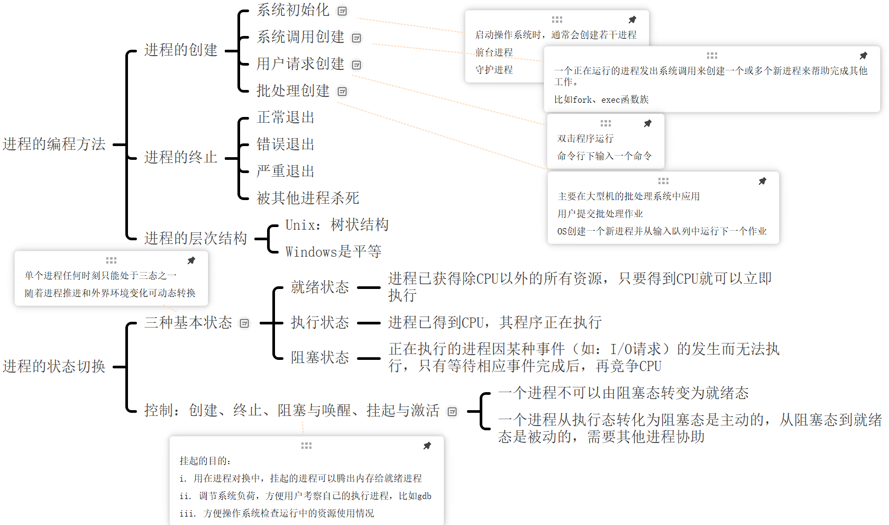|

## 1. 进程的终止
进程在创建之后, 它就开始运行并做完成任务。然而, 没有什么事儿是永不停歇的, 包括进程也一样。进程早晚会发生终止, 但是通常是由于以下情况触发的

- 正常退出(自愿的)
- 错误退出(自愿的)
- 严重错误(非自愿的)
- 被其他进程杀死(非自愿的)

### 1.1 正常退出

首先我们知道, `echo $?`是可以查看上一条命令的进程退出的返回值的.

```sh
╰─ cd ~

╭─    ~                                                                                              ✔  23:11:23 
╰─ echo $?
0
```

比如在Linux中, 返回`0`就是正常退出.

### 1.2 错误退出

```sh
╰─ cd 1
cd: no such file or directory: 1

╭─    ~                                                                                            1 ✘  23:11:31 
╰─ echo $?
1
```

错误退出, 是进程捕获了错误, 回显后才调用`exit(1)`退出的, 是进程主动退出, 是自愿的.

### 1.3 严重错误
进程终止的第三个主要原因源于程序内部错误, 这些错误通常由编程疏忽、逻辑错误或运行时异常引起。这些错误能够导致进程的运行状态变得不稳定或不可预测, 进而可能触发终止过程。具体实例包括执行非法指令、尝试访问不存在的内存地址, 以及执行除数为零的运算等。

```C++
void test() {
    char *str = "1234";
    str[0] = 'a'; // 严重错误, 不能修改常量区! 直接被OS杀死
}
```

在像UNIX这样的操作系统中, 为了增强程序的健壮性和灵活性, 提供了一种机制允许进程对特定类型的错误进行捕获和处理, 而不是直接终止。这种机制通过 **信号(signal)** 来实现, 信号可以被视为一种软中断, 它通知进程发生了某个特定事件。

当进程接收到一个信号时, 它可以根据信号的类型和自身的设置来决定如何响应。对于某些类型的信号, 进程可以选择忽略它们(如果系统允许的话), 或者通过提供一个 **信号处理程序(signal handler)** 来定制对信号的响应。例如, 当进程尝试访问一个非法内存地址时, 操作系统会向该进程发送一个 **段错误(segmentation fault)** 信号(通常是SIGSEGV)。如果进程没有为该信号提供处理程序, 那么它将被默认行为终止；但如果进程已经注册了一个信号处理程序, 那么它可以在处理程序内部执行一些清理工作, 然后安全地终止, 或者尝试恢复到一个稳定的状态并继续执行。

通过信号机制, UNIX系统为进程提供了一种强大的错误处理手段, 使得进程能够在面对错误时做出更加灵活和适当的响应。

### 1.4 被其他进程杀死
第四个导致进程终止的原因是, 当某个进程(通常具有相应的权限)主动执行一个特定的操作来请求操作系统结束另一个进程的执行。在UNIX操作系统中, 这一操作通过`kill`系统调用来实现。`kill`系统调用允许进程向另一个进程发送一个信号, 而该信号可以被接收进程解释为终止执行的指令。例如, 如果进程A希望结束进程B的运行, 它可以通过`kill`系统调用发送一个 **SIGTERM(软件终止信号)** 给进程B, 进程B在接收到此信号后通常会进行清理工作并退出。

而在Windows操作系统中, 虽然没有直接等同于UNIX中`kill`系统调用的系统级接口, 但提供了`TerminateProcess`函数来实现类似的功能。值得注意的是, `TerminateProcess`函数并非一个系统调用, 而是Win32 API的一部分, 它直接由Windows的应用程序接口层提供。该函数允许一个进程立即终止另一个进程的执行, 而不给目标进程任何清理资源或保存状态的机会。因此, 使用`TerminateProcess`时需要格外小心, 因为它可能导致数据丢失或其他不期望的副作用。

举例来说, 在UNIX环境下, 如果用户想要终止一个名为`example_process`的进程, 他们可能会首先使用`ps`命令查找该进程的进程`ID(PID)`, 然后执行`kill [PID]`命令来发送终止信号。而在Windows中, 如果有一个类似的需求, 用户可能需要使用任务管理器或通过编程方式调用`TerminateProcess`函数, 并传入目标进程的句柄或PID作为参数来实现进程的终止。然而, 由于`TerminateProcess`的潜在风险, 更推荐的做法是使用更温和的终止方法, 如发送`WM_CLOSE`消息给应用程序窗口, 以便应用程序有机会进行有序的关闭过程。

## 2. 进程状态 & 进程切换

尽管每个进程在操作系统中被视为一个独立的执行实体, 拥有其专属的程序计数器以追踪指令执行位置及内部状态以管理资源, 但进程间的协作与依赖是不可或缺的。

```sh
cat chapter1 chapter2 chapter3 | grep tree
```

在此例中, `cat`进程作为第一个进程, 负责读取并连续输出`chapter1` 、`chapter2`和`chapter3`这三个文件的内容。而`grep`进程则作为第二个进程, 其任务是从接收到的输入中筛选出包含特定关键字(如 "tree")的行。

由于进程的执行速度受其内部逻辑复杂度、系统资源分配(特别是 CPU 时间片)等多种因素影响, 因此这两个进程的运行速度可能并不一致。具体而言, 可能会出现`grep`进程已经准备就绪, 准备开始处理输入数据, 但此时`cat`进程尚未完成所有文件的读取与输出。在这种情况下, 为了防止数据丢失或处理错误, 操作系统会采取同步机制, 使`grep`进程进入阻塞状态, 即暂停执行, 直到`cat`进程完成其输出并将数据完全传递给`grep`进程。这种机制确保了数据流的完整性和处理顺序的正确性。

尽管进程间保持独立, 但它们通过如管道这样的机制实现高效的数据交换与协作, 共同完成任务, 而进程间的同步与阻塞控制则是确保这一过程顺利进行的关键。

当一个进程开始运行时, 它可能会经历下面这几种状态

### 2.1 三态模型

| ##container## |
|:--:|
|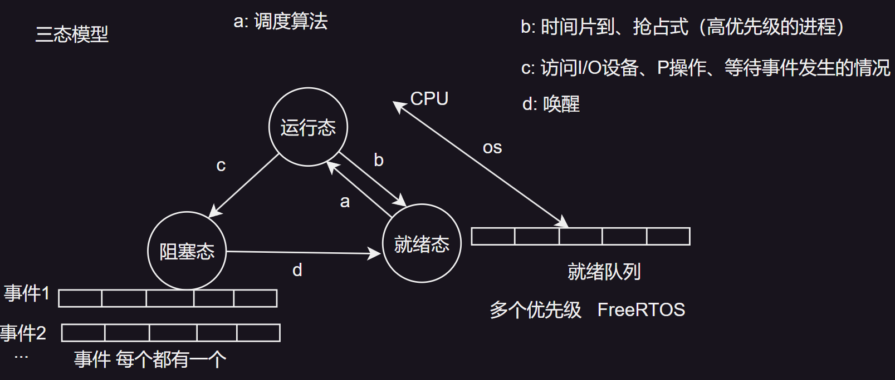|
|进程间的状态切换图|

在探讨进程的状态转换时, 我们主要关注三种核心状态及其相互转换机制, 这些状态共同构成了进程生命周期中的关键阶段: 

1. **运行态(Running State)**:   
   此状态表明进程当前正实际占用CPU的时间片进行执行。例如, 当一个文本编辑器进程正在处理用户的键盘输入并实时显示在屏幕上时, 它就处于运行态。

2. **就绪态(Ready State)**:   
   就绪态的进程已准备好执行, 但由于CPU资源正被其他进程占用, 因此它暂时处于等待CPU时间片的状态。这类似于多个运动员在起跑线上等待发令枪响, 都已做好起跑准备, 但尚未开始比赛。

3. **阻塞态(Blocked State)**:   
   阻塞态的进程因等待某个外部事件(如I/O操作完成、信号量释放等)而无法继续执行。除非该事件发生, 否则即使CPU空闲, 该进程也无法运行。比如, 一个进程尝试从网络读取数据, 但数据尚未到达, 此时该进程就会进入阻塞态。

逻辑上, 运行态和就绪态在“可运行性”上相似, 主要区别在于是否实际获得了CPU时间。而阻塞态则与前两者显著不同, 因为它在外部条件未满足时无法执行, 即使CPU空闲亦然。

> **程序调度**是操作系统中至关重要的功能, 它决定了哪个进程优先获得CPU资源以及运行多久。为了平衡系统整体效率和各个进程间的公平性, 已经发展出多种调度算法, 如轮转调度(Round-Robin)、优先级调度(Priority Scheduling)等。

对于上图的`d: 唤醒`, 请问是谁唤醒? CPU在运行态处, 怎么还会理会阻塞态的呢?

我们以`scanf()`的运行过程来理解一下:

| ##container## |
|:--:|
|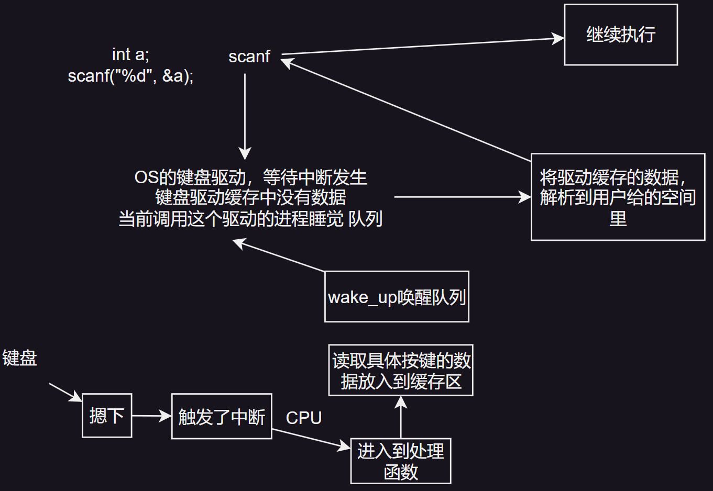|

说白了就是中断~~, 然后回调~~

### 2.2 五态模型

| ##container## |
|:--:|
|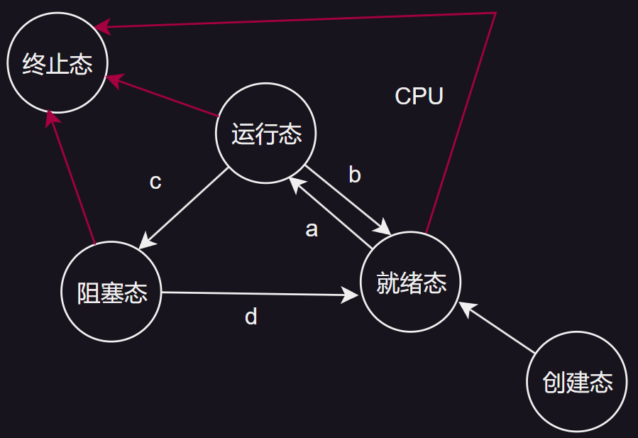|
|五态模型|

### 2.3 七态模型
实际上就是多了`挂起阻塞`和`挂起就绪`态.

| ##container## |
|:--:|
|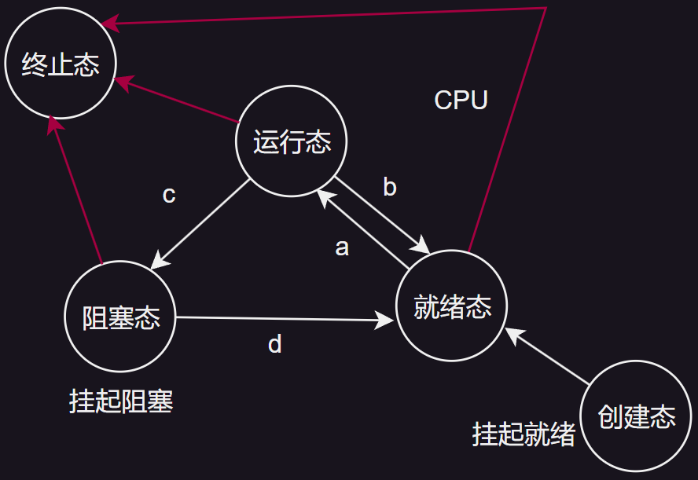|
|七态模型|

注意区分:
- 挂起: 将数据结构从内存 搬移到 磁盘
- 阻塞、睡眠: 等待 事件发生 任务在内存
- 运行: CPU、单核CPU运行程序
- 就绪: ~ 多个

# 线程调度

| ##container## |
|:--:|
|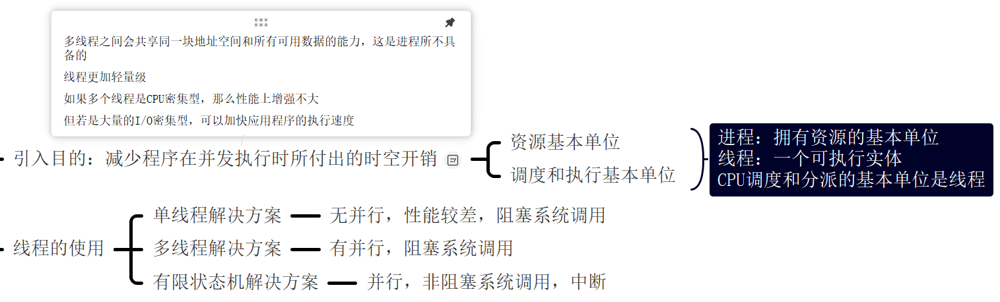|

在传统的操作系统设计中, 进程是资源分配的基本单位, 每个进程都拥有独立的地址空间和至少一个控制线程。然而, 随着并发编程需求的增加, 人们发现单一进程内运行多个控制流(即线程)能够带来诸多优势。这些线程虽然彼此独立执行, 但它们共享同一进程的地址空间及其中的所有数据, 这种模式为多线程编程提供了基础。

## 1. 线程的使用
要理解为何在进程基础上引入线程的概念, 我们可以从以下几个方面探讨进程模型和线程模型: 

1. **资源共享**:   
   线程之间的主要优势在于它们能够共享同一块地址空间。这意味着线程可以直接访问进程中的全局变量、静态变量以及通过指针或引用访问的内存区域, 而无需进行进程间通信(IPC)的复杂操作。  
   例如, 在一个文本编辑器中, 多个线程可以同时访问并修改文档的同一部分, 因为它们共享文档的内存表示。

2. **轻量级与高效性**:   
   相比进程, 线程是更加轻量级的执行单元。线程的创建和销毁通常比进程快得多, 因为线程不需要为每个实例分配独立的地址空间和其他系统资源。在许多现代操作系统中, 创建一个新线程的速度可以比创建一个新进程快10到100倍。这种高效性使得线程成为处理高并发任务时的理想选择。

3. **性能提升**:   
   在涉及大量计算和I/O处理的场景中, 多线程编程能够显著提升应用程序的性能。当CPU密集型任务与I/O密集型任务交替执行时, 多线程允许这些任务重叠进行, 从而减少了CPU的空闲时间。  
   例如, 在Web服务器中, 一个线程可以处理客户端的连接请求, 而另一个线程则负责从磁盘读取数据并准备响应。这种并行处理方式提高了服务器的吞吐量和响应速度。

总结: 线程作为进程内的一种轻量级执行单元, 通过共享地址空间和高效性, 为并发编程提供了强大的支持。在现代软件开发中, 多线程编程已经成为一种普遍采用的技术手段, 用于提高应用程序的并发性和性能。

### 1.1 多线程解决方案
在探讨线程应用的实例时, 我们可以聚焦于万维网服务器的工作机制。在这样的场景中, 客户端向服务器发送对特定页面的请求, 而服务器则负责将这些请求的页面返回给客户端。值得注意的是, 在多数Web站点上, 访问频率呈现出显著差异, 即比如某些页面(如XX公司的主页)相较于其他页面(如一些产品介绍的详情页)会接收到更多的访问请求。

为了优化性能和响应速度, Web服务器采用了一种高效策略: 将那些访问量极高的页面集合预先加载并保存在内存中, 这一过程减少了每当这些热门页面被请求时从磁盘读取的需要。这种存储高访问率页面以加速访问的技术所依赖的存储空间, 我们称之为“高速缓存”(cache)。

高速缓存的概念不仅局限于Web服务器领域, 它在多个技术领域中均有着广泛的应用。以CPU为例, 现代CPU内部集成了多层缓存结构(如L1、L2、L3缓存), 旨在通过减少对主存的直接访问次数来显著提升数据访问速度和整体计算性能。在这些场景下, 高速缓存同样扮演着至关重要的角色, 通过存储近期可能被频繁访问的数据和指令, 显著降低了延迟, 提高了系统效率。

| ##container## |
|:--:|
|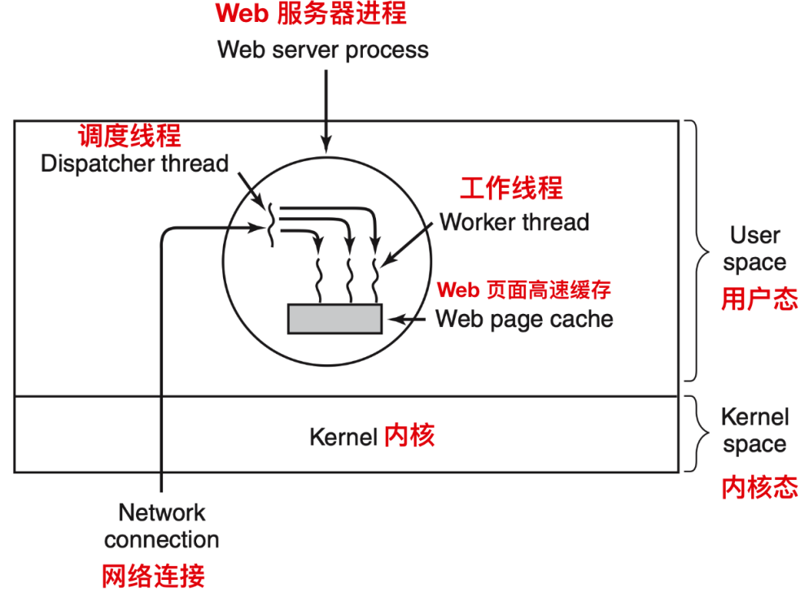|
|一个多线程的Web服务器|

在Web服务器的架构中, 存在一种特定的组织方式, 其核心是一个名为“调度线程(dispatcher thread)”的组件。该线程负责从网络接收工作请求, 并作为中央调度器运作。一旦调度线程接收到请求并完成初步检查, 它会智能地选择一个当前处于空闲(或阻塞)状态的工作线程来处理该请求。这一选择过程通常涉及将指向请求消息的指针写入到每个工作线程相关联的特定数据结构(如队列或特殊字)中。随后, 调度线程会唤醒处于休眠状态的工作线程, 将其状态从阻塞态转变为就绪态, 以便其能够开始处理请求。

被唤醒的工作线程启动后, 首先会检查请求所需的Web页面是否已存在于一个共享的高速缓存中。这个高速缓存对所有工作线程都是可访问的, 它用于存储频繁访问的页面, 以减少对磁盘的访问次数。例如, 如果客户端请求的是网站的首页, 而该页面恰好位于高速缓存中, 那么工作线程就能迅速地从缓存中检索并返回该页面, 而无需进行磁盘I/O操作。

然而, 如果请求的Web页面不在高速缓存中, 工作线程将不得不执行一个`read`操作, 从磁盘中读取该页面。由于磁盘I/O操作通常耗时较长, 这会导致工作线程进入阻塞状态, 等待磁盘操作完成。在此期间, 为了最大化服务器的资源利用率和吞吐量, 调度线程会灵活地选择其他就绪的工作线程来执行, 或者从等待队列中挑选新的工作线程来运行, 从而确保服务器能够持续处理新的请求。

这种模型巧妙地利用了线程间的协作与调度, 将服务器构建为一组顺序执行的线程集合。调度线程通过一个包含死循环的程序不断获取新的工作请求, 并将它们分派给合适的工作线程。每个工作线程则专注于处理分派给它的请求, 首先检查高速缓存, 然后根据情况从磁盘加载页面, 并最终将页面返回给客户端。在完成一次请求处理后, 工作线程会再次进入阻塞状态, 等待下一个新请求的到来, 从而形成一个高效、循环的工作流程。

### 1.2 单线程解决方案
在没有多线程的环境下设计Web服务器时, 我们通常会面临单线程处理的局限性。这种设计意味着服务器的主循环会连续不断地获取客户端的请求, 并依次处理它们, 但在处理每个请求的过程中, 如果涉及到磁盘I/O等耗时操作, 服务器将不得不等待这些操作完成, 期间无法响应新的请求。这种“空转”状态显著降低了服务器的处理效率, 每秒能够处理的请求数量非常有限, 从而凸显了多线程对于提升程序并行性和整体性能的重要性。

### 1.3 状态机解决方案
为了克服单线程与多线程方案的不足, 我们引入了一种称为“状态机解决方案”的设计思路。该方案特别适用于那些仅能提供非阻塞系统调用(如非阻塞`read`)的环境。

> 非阻塞系统调用, 如非阻塞 read , 在Linux系统编程中是一种常见的IO模型, 用于提高程序在处理IO时的效率。
> 
> 非阻塞系统调用通常用于那些希望立即返回结果, 而不愿意等待IO操作完成的场景。在Linux中, 通过特定的方式设置文件描述符为非阻塞模式, 可以实现非阻塞的 read 、 write 等系统调用。当文件描述符被设置为非阻塞模式后, 如果IO操作不能立即完成(例如, 从网络读取数据但当前没有数据到达), 系统调用会立即返回一个错误码(如EAGAIN或EWOULDBLOCK), 而不是让调用线程进入休眠状态等待。
> 
> 假设我们有一个程序需要从一个网络连接中读取数据, 但我们不希望程序在等待数据时阻塞。此时, 我们可以将网络连接的文件描述符设置为非阻塞模式, 并使用非阻塞的 read 调用。
> 
> 非阻塞系统调用(如非阻塞 read )在需要处理多个IO源或希望提高程序响应速度的场景中非常有用。通过将文件描述符设置为非阻塞模式, 并使用适当的错误处理逻辑, 程序可以在IO操作无法立即完成时继续执行其他任务, 而不是阻塞等待。这有助于提高程序的并发性和整体性能。

其工作流程如下:

当请求到达服务器时, 负责接收请求的单一线程会立即检查是否能够立即从内存中的高速缓存满足该请求。如果可以, 则立即返回响应, 无需任何等待。若缓存中不存在所需数据, 则启动一个非阻塞的磁盘读取操作, 并将该请求的状态(如请求标识符、预期的数据位置等)记录在服务器的内部状态表中。

随后, 服务器进入一个事件循环, 不断监听和响应两类事件: 新的工作请求到达和先前磁盘操作的完成(通常通过信号中断机制通知)。每当有新请求到来时, 服务器检查其状态, 如果处于可立即处理状态, 则开始处理；若需等待磁盘响应, 则跳过处理, 继续监听。一旦收到磁盘操作的完成通知, 服务器从状态表中检索对应的请求状态, 并根据获取的数据完成响应的准备工作, 最终将响应发送给客户端。

这种设计实际上体现了有限状态机(Finite-State Machine, FSM)的核心思想。在FSM中, 每个计算或请求都被视为一个具有有限数量状态的系统, 系统根据外部事件(如新请求到达、磁盘操作完成)从一个状态转移到另一个状态。每个状态转移都伴随着状态的保存和恢复, 以确保系统能够正确地继续执行或响应。

有限状态机在计算机科学中有着广泛的应用, 不仅限于Web服务器设计。它提供了一种强大而灵活的方式来建模和控制系统行为, 尤其是在需要处理并发和异步事件时。然而, 使用FSM也增加了编程的复杂度, 因为开发者需要显式地管理状态转移和状态信息的保存与恢复。

单线程、多线程和状态机解决方案各有利弊。多线程方案通过并行处理提高了性能, 但增加了复杂性和潜在的线程安全问题；单线程方案简单但性能受限；而状态机方案则通过非阻塞调用和中断机制实现了高性能的并行处理, 尽管编程难度较高。在实际应用中, 选择哪种方案取决于具体需求、系统资源以及开发团队的技能与偏好。

|模型|特性|
|:-:|:-:|
|单线程|无并行性, 性能较差, 阻塞系统调用|
|多线程|有并行性, 阻塞系统调用|
|有限状态机|并行性, 非阻塞系统调用、中断|

## 2. 经典的线程模型
从另一个维度审视进程, 可以理解为一种高效整合并管理相关资源的方式。进程不仅承载着程序的主体代码(即程序正文)与数据, 还汇聚了诸如已打开文件句柄、派生的子进程、待触发的定时器、特定的信号处理机制、以及用户账号信息等多元化资源。将这些资源统一封装在进程内部, 极大地简化了资源的组织与访问流程。

与此同时, 进程内部的核心执行单元是线程, 这一术语常被简称为“线程(thread)”。每个线程都配备了关键的执行状态组件: 程序计数器, 负责精确追踪即将执行的指令位置；寄存器集合, 用于暂存线程当前操作所依赖的变量值；以及堆栈, 它记录着方法调用与返回的路径, 是程序执行流程的重要映射。值得注意的是, 尽管线程的运行依托于进程, 但进程与线程在概念上是截然分开的实体, 各自承载着不同的职责与特性, 并允许独立处理。简而言之, 进程是资源的容器, 而线程则是CPU直接调度的执行单位。

线程概念的引入, 为进程模型增添了新的维度——即在同一进程内部, 允许多个线程以较高程度的独立性并行运行, 彼此间互不干扰。这种架构类似于在单一计算机上同时运行多个独立进程的场景, 但区别在于, 线程间的资源共享更为紧密, 它们共同访问同一地址空间及其他进程资源。相比之下, 不同进程间虽也共享物理内存、磁盘、外设等资源, 但资源的访问与隔离机制更为复杂。

鉴于线程在继承进程资源的同时, 保持了较轻量的执行上下文, 因此常被形象地称为“轻量级进程(lightweight processes)”。而“多线程(multithreading)”这一术语, 则特指在单个进程内部, 多个线程并行执行、共享资源并协同工作的模式。这种模式极大地提高了程序的响应速度与处理能力, 是现代操作系统与应用程序设计中不可或缺的重要特性。

下图我们可以看到三个传统的进程, 每个进程有自己的地址空间和单个控制线程。每个线程都在不同的地址空间中运行

| ##container## |
|:--:|
|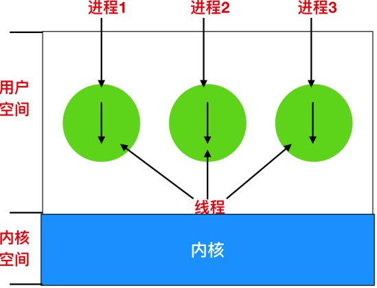|

下图中, 我们可以看到有一个进程三个线程的情况。每个线程都在相同的地址空间中运行。

| ##container## |
|:--:|
|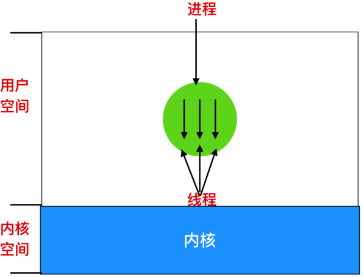|

线程与进程在独立性方面存在显著差异。具体来说, 线程并不具备进程所拥有的那种强独立性。在同一个进程内, 所有线程共享一个共同的地址空间, 这一特性意味着它们不仅能够访问相同的程序代码和数据段, 还共享着包括全局变量在内的所有进程资源。

由于这种共享机制, 每个线程都被赋予了访问进程地址空间内任意内存地址的能力。然而, 这一能力也带来了潜在的冲突和复杂性。具体来说, 一个线程不仅能读取或修改自身的局部变量和堆栈内容, 在理论上, 它还可以访问并修改同一进程中其他线程的堆栈或全局变量。**例如, 一个线程错误地写入了一个被其他线程用作控制流程的变量, 或者覆盖了一个线程栈上的关键返回值, 都可能导致难以预料的行为, 甚至是程序崩溃。**

因此, 尽管线程间的资源共享提高了程序的执行效率和响应速度, 但也要求开发者在设计和实现多线程程序时, 必须采取额外的同步和协调机制, 以确保线程间的正确交互和数据一致性。这包括但不限于使用互斥锁(mutexes)、信号量(semaphores)、条件变量(condition variables)等同步原语, 以及合理的线程调度策略, 来避免数据竞争(race conditions)和其他并发问题。

线程之间除了共享同一内存空间外, 还具有如下不同的内容

| ##container## |
|:--:|
|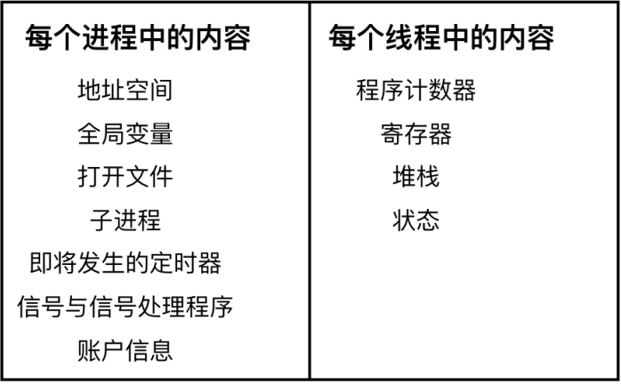|

线程, 作为操作系统调度的基本单位, 其生命周期可以划分为多个状态。这些状态与进程的状态类似, 但更侧重于CPU的调度与执行。线程可以处于以下几种状态: **运行中**、**阻塞**、**就绪**, 以及虽然进程图中未明确画出但理论上存在的**终止**状态。

1. **运行中(Running)**:   
   当线程获得CPU的时间片时, 它便进入运行状态, 此时线程正在执行其任务。CPU时间片是操作系统分配给线程用于执行的时间段, 时间片结束后, 线程可能需要让出CPU给其他线程使用。

2. **阻塞(Blocked)**:   
   线程在执行过程中, 可能会因为某些原因而暂停执行, 进入阻塞状态。这些原因通常涉及等待外部事件或资源的就绪。例如, 当线程执行一个从键盘读取数据的系统调用时, 它会等待用户输入, 直到有数据可读为止, 此时线程便处于阻塞状态。  
   其他常见的阻塞原因还包括等待文件I/O操作完成、等待网络响应等。线程通常会保持阻塞状态, 直到它所等待的事件发生或资源变得可用, 或者由其他线程通过某种机制(如信号或条件变量)来唤醒它。

3. **就绪(Ready)**:   
   线程已准备好执行, 但由于CPU资源被其他线程占用, 它暂时无法运行。处于就绪状态的线程已经完成了所有必要的准备工作, 只需等待CPU时间片的分配即可继续执行。

4. **终止(Terminated)**:   
   线程完成了其执行任务, 或者因为某种原因(如错误、异常或程序逻辑)而被终止。虽然进程图中可能未明确展示终止状态, 但它是线程生命周期中的一个重要阶段, 标志着线程执行的结束。

值得注意的是, **线程之间的状态转换与进程之间的状态转换在本质上是相似的**, 都遵循着相似的规则和逻辑。

例如, 一个正在运行的线程可能因为等待I/O操作而进入阻塞状态, 当I/O操作完成后, 它可能再次进入就绪状态, 等待CPU时间片的分配；或者, 一个处于就绪状态的线程在获得CPU时间片后将开始执行, 进入运行状态。这些状态转换共同构成了线程和进程在操作系统中的动态行为。

每个线程都会有自己的堆栈, 正如图所示。

| ##container## |
|:--:|
|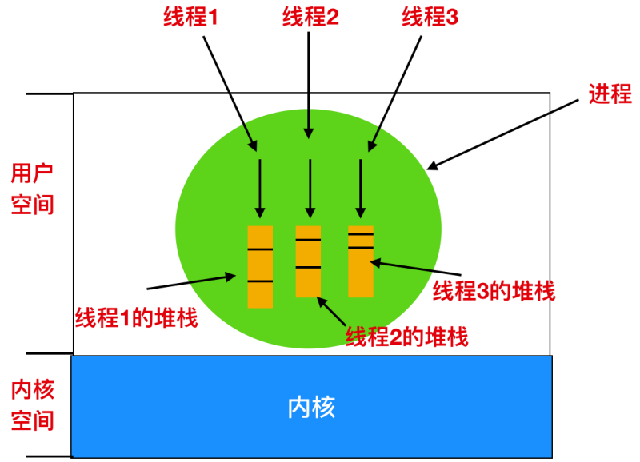|
