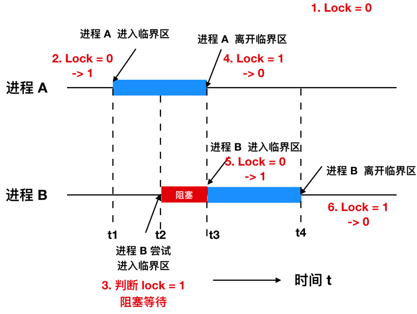

# 同步互斥机制和编程方法

| ##container## |
|:--:|
||

## 1. 竞争态条件

| ##container## |
|:--:|
||

## 2. 临界区
在深入讨论如何有效管理共享资源以避免竞态条件时，我们首先要明确的是，不仅是共享资源，共享文件和共享内存同样是竞态条件发生的常见场景。为了有效规避这一问题，核心策略在于**确保一个或多个进程不会在同一时间对同一共享资源（包括但不限于共享内存、共享文件等）进行读写操作**。这要求实现一种称为 **互斥（Mutual Exclusion）** 的机制，即当一个进程正在使用某共享资源时，其他进程必须被阻止访问该资源。

问题的核心在于，必须防止如进程A尚未完成对共享资源的操作前，进程B便已开始访问该资源的情况。在操作系统的设计中，选择适当的同步原语（如锁、信号量等）来实现互斥操作是一个至关重要的决策点。

为了更具体地描述这一过程，我们将进程中对共享资源进行操作的代码段定义为`临界区域（Critical Region）`或`临界区（Critical Section）`。这是因为在这些区域内，进程可能执行对共享资源的读写操作，从而引发竞态条件。因此，确保在任何时刻，只有一个进程能够进入并执行其临界区内的代码，是避免竞态条件的关键。

然而，仅仅实现互斥访问还不足以构成一个完美的并发控制策略。为了确保并发访问的效率和正确性，我们还需要考虑以下四个重要条件:

- **互斥条件**：在任何时候，两个或多个进程不能同时处于其临界区内。这是避免竞态条件的基本要求。

- **前进条件（无假设条件）**：不应假设CPU的速度或数量，即系统应能在任何CPU配置下都能正常工作。这意味着并发控制机制应当是通用的，不依赖于特定的硬件条件。

- **有限等待条件**：位于临界区外的进程不应被无限期地阻塞等待进入临界区。这要求有一种机制来确保进程在合理的时间内能够进入其临界区，避免死锁或饥饿现象的发生。

- **无忙等条件**：进程在临界区外等待时，不应占用CPU进行无意义的循环检查（即“忙等”）。这可以通过使用如信号量、条件变量等高效的同步机制来实现，以减少CPU资源的浪费。

举个例子，假设有两个进程A和B，它们都需要修改同一个共享变量。为了实现互斥访问，我们可以使用互斥锁。进程A在尝试修改共享变量前，会先尝试获取锁。如果锁已被进程B持有，则进程A会被阻塞，直到进程B释放锁。这样，进程A和B就不会同时进入临界区，从而避免了竞态条件的发生。同时，通过合理设计锁的实现和释放机制，我们可以确保满足上述四个条件，以保证并发访问的效率和正确性。

| ##container## |
|:--:|
||
|使用临界区的互斥|

在进程间共享资源的访问控制中，我们期望进程的行为遵循互斥原则，以确保数据的一致性和完整性。如图示所示，这一过程可以详细阐述为:

在时间点t1，进程A首先请求访问共享资源的临界区，并成功进入。这标志着进程A开始独占该临界区内的资源，进行必要的操作。

随后，在时间点t2，进程B也尝试进入该临界区。然而，由于此时进程A仍在临界区内操作，尚未释放对该区域的控制权，因此进程B的访问请求被系统暂时拒绝，导致进程B进入阻塞状态，等待进程A的释放。

这一过程持续了一段时间，直到时间点t3，进程A完成了对临界区内资源的操作，并主动离开临界区，释放了对该区域的锁定。此时，系统检测到进程B的等待请求，并允许进程B进入临界区，开始其对共享资源的操作。

最后，在时间点t4，进程B也完成了其操作，并离开临界区，恢复到正常执行状态。此时，系统恢复到没有进程处于临界区的原始状态，等待下一个可能的访问请求。

这个过程中，进程A和进程B通过遵循临界区的互斥访问规则，有效避免了同时访问共享资源可能导致的冲突和数据不一致问题。例如，在进程A正在更新共享文件内容时，如果进程B能够同时访问该文件，就可能造成文件内容的损坏或不一致。而通过互斥访问，我们确保了每次只有一个进程能够修改共享资源，从而维护了数据的完整性和一致性。

## 3. 忙等互斥
下面我们会继续探讨实现互斥的各种设计，在这些方案中，当一个进程正忙于更新其关键区域的共享内存时，没有其他进程会进入其关键区域，也不会造成影响。

### 3.1 屏蔽中断
在探讨单处理器系统上处理临界区访问的策略时，我们首先需要明确一点：虽然理论上可以通过屏蔽所有中断来防止进程切换，从而确保进程在临界区内的独占访问权，但这种做法在实际应用中存在显著的局限性和风险。

在单处理器系统中，一种简化的思路是让进程在进入临界区之前屏蔽所有中断，并在离开临界区后重新启用它们。这样做的目的是防止CPU在处理中断时发生进程切换，从而确保当前进程能够独占访问共享资源。然而，这种方法存在以下几个关键问题:

1. **系统稳定性风险**：如果某个进程在临界区内因某种原因（如死循环或长时间计算）未能及时离开，那么中断将被长时间屏蔽，这可能导致系统无法响应其他重要中断（如时钟中断、外设中断等），进而影响系统稳定性和响应性，甚至可能导致系统“挂起”或崩溃。

2. **多处理器系统的无效性**：在多处理器系统中，屏蔽中断仅对执行 disable 指令的CPU有效，其他CPU仍然可以正常运行并访问共享内存，因此这种方法无法在多处理器环境下提供有效的互斥保护。

3. **权限与责任问题**：虽然内核在执行某些关键操作时（如更新系统变量或列表）屏蔽中断是合理的，因为这有助于避免竞态条件，但将这种机制直接应用于用户线程是不切实际的。用户线程不应该也不应该被允许直接控制中断的启用与禁用，因为这涉及到系统级权限和稳定性问题。

鉴于上述局限性，现代操作系统通常采用更为复杂但更为安全和有效的同步机制来管理临界区访问，如互斥锁（Mutexes）、信号量（Semaphores）等。这些机制通过软件层面的同步原语来实现进程间的互斥访问，而无需依赖中断屏蔽这种可能危及系统稳定性的方法。

例如，当多个进程需要访问同一共享资源时，它们会先尝试获取与该资源相关联的互斥锁。如果锁已被其他进程持有，则当前进程将被阻塞，直到锁被释放。这样，无论系统是单处理器还是多处理器，都可以有效地防止竞态条件的发生，同时保证系统的稳定性和响应性。

### 3.2 锁变量
为了实现多线程环境下对共享资源的互斥访问，我们可以采用一种软件层面的解决方案，该方案依赖于一个共享的锁变量。这个锁变量被初始化为0，代表没有任何线程正在使用关键区域（临界区）。

具体过程如下: 当一个线程（如线程A）需要访问关键区域时，它首先会检查锁变量的值。如果锁变量为0（即无线程占用），则线程A会将锁变量设置为1，表示它已获取了访问权，并随后进入关键区域执行其任务。如果线程A发现锁变量为1（即已有线程占用），则它会进入等待状态，直到锁变量的值重新变回0。

举个例子，假设有线程A和线程B两个进程，它们都试图访问同一关键区域。首先，线程A成功检查到锁变量为0，将其设为1后进入关键区域执行。在此期间，如果线程B也尝试进入关键区域，它会发现锁变量为1，因此会等待。直到线程A完成操作并离开关键区域，将锁变量重新设置为0后，线程B才能继续检查锁变量，如果此时锁变量仍为0，则线程B可以进入关键区域执行其任务。我们对上图修改后，如下所示:

| ##container## |
|:--:|
||

- 下面是一个`自旋锁`的伪代码:

> [!TIP]
> 用于忙等待的锁，称为`自旋锁(spinlock)`
```C++
int lock = 0;
// 临界区代码段
extern void critical_region();
// 非临界区的代码段
extern void noncritical_region();

void process0() {
    while (1) {
        // 进入临界区
        // 判断是否有锁，如果没有锁，死循环等待锁被释放
        while ( lock )
            ;
        // 加锁
        lock = 1;
        critical_region();
        
        // 释放锁
        lock = 0;

        noncritical_region();
    }
}

void process1() {
    while (1) {
        // 进入临界区
        // 判断是否有锁，如果没有锁，死循环等待锁被释放
        while ( lock )
            ;
        // 加锁
        lock = 1;
        critical_region();
        
        // 释放锁
        lock = 0;
        
        noncritical_region();
    }
}

// 上面代码依旧线程不安全哦!
```

- 这种设计方式是否正确呢？是否存在纰漏呢？

这种设计方式存在显著的纰漏，因为它没有有效地解决并发环境下的竞态条件问题。具体来说，当一个进程（或线程）读取到锁变量为0并计划将其设置为1以进入临界区时，如果在这个间隙内另一个进程被调度运行并同样读取到锁变量为0且将其设置为1，那么两个进程都可能错误地认为自己是唯一进入临界区的进程，从而导致临界区域内同时有两个或更多进程运行，违反了互斥原则。

| ##container## |
|:--:|
||

有人可能会提出，在进入临界区前检查一次锁变量，并在离开临界区前再次检查锁变量，以此来解决问题。然而，这种方法并不能有效防止竞态条件的发生。原因在于，即使进行了两次检查，两次检查之间的操作（如设置锁变量、执行临界区代码等）仍然不是原子性的。也就是说，在这两次检查之间，其他进程仍然有可能修改锁变量的值，导致竞态条件依然存在。

> 原子性（Atomicity）是计算机科学中的一个重要概念，尤其在并发编程和数据库事务处理中扮演着关键角色。
>
> 原子性指的是一个操作（或一组操作）在执行过程中，要么全部完成，要么完全不执行，不会停留在中间某个状态。换句话说，这个操作是不可分割的，其执行结果具有“全或无”的特性。
>
> 特性
> 1. **不可分割性**：原子操作在执行过程中不会被中断或分割成多个部分执行。一旦开始执行，就必须完整地执行完毕，或者由于某种原因（如错误）而完全不执行。
>
> 2. **一致性保证**：原子性操作能够确保数据的一致性和正确性。在多线程或并发环境中，原子操作可以防止数据竞争和竞态条件的发生，从而保护共享资源免受并发访问的干扰。
>
> 3. **可见性**：在某些情况下，原子操作还伴随着可见性保证，即一个线程对共享资源的原子性修改对其他线程是可见的。这有助于确保线程间通信的正确性和及时性。

为了解决这个问题，我们需要确保对锁变量的检查和设置操作是原子的，即这两个操作要么完全执行，要么完全不执行，中间不会被其他进程的操作打断。这通常通过硬件提供的原子指令或操作系统提供的同步原语来实现，如测试并设置（Test-and-Set）、比较并交换（Compare-and-Swap）等。

> 在计算机科学中，原语（Primitive）是一个非常重要的概念，它源于英文“primitive”或“instruction”，意为“原始的”或“基本的指令”。在计算机系统中，原语通常指的是一种基本的、不可分割的操作或程序段，这些操作或程序段在执行过程中具有原子性，即要么全部执行成功，要么全部执行失败，不会出现中间状态。
> 
> 1. **不可分割性**：原语在执行过程中是不可被中断的，一旦开始执行就必须连续执行到完成，否则会导致系统状态的不确定性。
> 
> 2. **原子性**：由于原语的不可分割性，它保证了操作的原子性，即操作要么完全执行，要么完全不执行，避免了操作过程中的部分执行状态。
> 
> 3. **由硬件或软件提供**：原语可以由硬件直接提供，如处理器提供的test-and-set、compare-and-swap等操作；也可以由软件通过特定的算法和机制实现，如操作系统中的进程控制原语。

以测试并设置（Test-and-Set）为例，当一个进程想要进入临界区时，它会使用测试并设置原语来同时检查锁变量的值并将其设置为1。如果锁变量原本为0，则测试并设置操作会成功地将锁变量设置为1，并允许该进程进入临界区。如果锁变量已经为1，则测试并设置操作会失败，并通知该进程等待。通过这种方式，我们可以确保在任何时刻只有一个进程能够成功进入临界区，从而避免了竞态条件的发生。

因此，对于并发环境下的共享资源访问，我们必须采用适当的同步机制来确保操作的原子性和互斥性，以防止竞态条件的发生。

### 3.3 严格轮询法
对于第三种互斥的方式，首先通过一个C语言示例来阐述，这是因为C语言以其强大、高效、可预测性和底层控制能力，成为操作系统开发的首选语言。尽管现代软件开发中Java等高级语言广泛应用，但操作系统内核常因性能需求和直接硬件访问的需求而采用C或C++。Java虽通过`native`关键字支持本地代码（多为C/C++编写），但其自动内存管理机制（如垃圾回收）在操作系统层面可能引发不可预测的行为，如内存耗尽时的暂停执行，这与操作系统对实时性和稳定性的严格要求不符。

以下是两个简单进程的C语言代码示例，它们通过共享变量`turn`来尝试实现互斥访问临界区:

```C++
int turn;                // 表示当前允许进入临界区的进程号
// 临界区代码段
extern void critical_region();
// 非临界区的代码段
extern void noncritical_region();

void process0() {
    while (1) {
        // 准备进入临界区，轮询判断当前进程能否进入
        while (turn == 0) {
            // 执行临界区
            critical_region();
            turn = 1;            // 标记当前可以进入临界区的是进程1
            noncritical_region();
        }
    }
}

void process1() {
    while (1) {
        // 准备进入临界区，轮询判断当前进程能否进入
        while (turn == 1) {
            // 执行临界区
            critical_region();
            turn = 0;            // 标记当前可以进入临界区的是进程0
            noncritical_region();
        }
    }
}
```

在上述代码中，共享变量`turn`被初始化为0，其作用是标记哪个进程有权进入临界区。当系统启动时，`turn`的值为0，意味着进程0首先检查到这一点并随即进入临界区执行。与此同时，进程1也检测到`turn`为0，因此它进入一个等待循环（即忙等待），不断检查`turn`的值，直到它变为1，这表示进程0已经完成了临界区的操作并允许进程1进入。用于忙等待的锁，称为`自旋锁(spinlock)`。

这种通过不断轮询（polling）或称为`忙等待(busy waiting)`的方式检查变量状态的方法，尽管在某些情况下可能快速响应，但它会无谓地占用CPU资源，因为CPU在等待期间无法执行其他有用的工作。因此，除非等待时间极短且可以预测，否则通常应避免使用忙等待。在需要实现快速响应但又不希望浪费CPU资源的场景中，可以使用`自旋锁(spinlock)`，它是一种特殊类型的忙等待锁，适用于**等待时间非常短**的场景。

当进程0完成临界区的操作后，它会将`turn`设置为1，以此通知进程1可以进入临界区。如果进程1迅速完成了其临界区的操作，并将`turn`重置为0，此时两个进程都位于临界区之外。然而，如果进程0在进程1还未将`turn`改回0之前就已经完成了其非临界区的操作并再次尝试进入临界区，它将发现`turn`仍为1，因此不得不继续等待，即使此时进程1可能还在执行非临界区的任务。

这种情形揭示了一个问题：当进程执行速度差异显著时，简单的轮转和忙等待机制可能导致不公平的等待时间，甚至可能违反互斥原则中的一个重要原则——**位于临界区外的进程不应当被其他非临界区的进程阻塞**。在本例中，进程0被进程1（尽管进程1并未在临界区内）间接阻塞，这违反了上述原则，因此该方案在多数情况下并不是一个高效的互斥实现方式。

### 3.4 Peterson 解法
荷兰数学家`T.Dekker`首先提出了一种创新的软件互斥算法，该算法巧妙地结合了锁变量与警告变量的概念，旨在实现无需严格轮换的互斥访问。随后，`G.L.Peterson`在此基础上提出了一种更为简洁的互斥算法，其设计思路如下:

```C++
#define FALSE    0
#define TRUE    1

// 临界区代码段
extern void critical_region();
// 非临界区的代码段
extern void noncritical_region();

int turn;          // 记录当前“轮到”哪个进程进入临界区
int interested[2]; // 记录每个进程是否愿意进入临界区

/* A B 
 */
void enter_region(int process) {
    int other = 1 - process;            // 进程编号就是0 或 1

    interested[process] = TRUE;            // 标记本进程希望进入临界区
    turn = other;                        // 尝试将turn设置为另一个进程的编号

    // 等待条件：检查对方是否也想使用，且最后一次是谦让的
    while (interested[other] == TRUE && turn == other)
        ;
}

void leave_region(int process) {
    // 标记本进程已离开临界区
    interested[process] = FALSE;
}

void process0() {
    do {
        enter_region(0);
        critical_region();
        leave_region(0);
        noncritical_region();
    } while (TRUE);
}

void process1() {
    do {
        enter_region(1);
        critical_region();
        leave_region(1);
        noncritical_region();
    } while (TRUE);
}
```

该算法的工作原理如下：在访问共享资源（即进入临界区）之前，每个进程通过调用`enter_region`函数并传入其进程号（0或1）来尝试获取访问权限。函数内部，进程首先表明其进入临界区的意愿，并尝试将`turn`变量设置为自身的进程号。然而，如果此时另一个进程已经抢先设置了`turn`，则当前进程必须等待，直到该进程完成临界区操作并调用`leave_region`函数，从而释放其对`interested`数组中对应元素的锁定，并可能触发当前进程的继续执行。

> 说白了, 誰最后对`turn`赋值, 就是誰执行!

这种情况揭示了一个关键的问题：原始的`Peterson`算法（如上所述）在没有额外的同步机制（如原子操作或内存屏障）来确保`interested`和`turn`更新的原子性时，可能会受到竞争条件的影响，导致死锁或活锁。为了避免这种情况，现代的多线程编程库和操作系统通常提供更强大的同步原语，如`互斥锁（mutexes）`、`信号量（semaphores）`或`原子操作`，这些机制能够更可靠地管理对共享资源的访问。

值得注意的是，尽管这里描述的问题看起来是严重的，但在某些特定条件下（如进程执行速度差异极大，或者存在显式的同步点来确保进程不会完全同时进入竞争状态），原始的`Peterson`算法仍然可以在实际应用中发挥作用。然而，在设计并发系统时，了解并避免此类潜在的并发错误是至关重要的。

### 3.5 TSL 指令
在探讨并发控制与同步机制时，硬件支持的方案提供了一种高效且可靠的手段来管理对共享资源的访问。对于设计为多处理器的计算机系统而言，`测试并加锁（Test and Set Lock, TSL）`指令是一种重要的硬件级同步机制。该指令:

```arm
TSL RX, LOCK
```

`TSL RX, LOCK`指令是一种原子操作，其执行过程不可分割，确保了数据的一致性和线程安全。当执行此指令时，它会完成以下两个主要步骤:

1. **读取与锁定**：首先，指令从指定的内存地址（`LOCK`）读取当前的值，并将这个值加载到寄存器`RX`中。紧接着，它会在该内存地址上存储一个非零值（通常是1），作为加锁的标志。

2.  **总线锁定**：在执行`TSL`指令的过程中，发起该指令的CPU会锁定内存总线，这意味着其他CPU在这段时间内将无法访问内存总线，从而防止了它们对`LOCK`内存地址或任何其他内存地址的读写操作。这种锁定机制确保了当前CPU对内存的独占访问权。

`TSL`指令通过锁定内存总线来实现同步，这与简单地禁用中断有着本质的区别。禁用中断仅影响当前处理器的中断处理机制，而无法阻止其他处理器对内存的访问。例如，处理器1禁用中断，并不会影响处理器2对内存的读写操作。因此，在需要确保多个处理器间对共享资源的互斥访问时，仅依赖禁用中断是不足够的。

为了利用 TSL 指令实现并发控制，通常会定义一个共享变量`lock`作为锁的标志。当`lock`的值为0时，表示共享资源当前未被占用，任何需要访问该资源的进程都可以尝试执行`TSL`指令来加锁。如果`TSL`指令成功地将`lock`的值从0修改为1，则表明当前进程成功获得了对共享资源的访问权；如果`TSL`执行后发现`lock`的值已非0，则说明有其他进程正在使用该资源，当前进程需要等待或采取其他措施。

在完成对共享资源的操作后，进程应负责将`lock`的值重新设置为0，以释放锁并允许其他进程访问该资源。这一步骤通常通过简单的`move`指令或其他赋值操作完成。

这条指令如何防止两个进程同时进入临界区呢？这条指令集通过一种简单的锁机制有效防止了两个或多个进程同时进入临界区，其解决方案的核心思想在于利用原子操作和对锁状态的持续检查。

为了防止进程冲突地访问临界区，我们设计了一对函数`enter_region`和`leave_region`，它们分别用于在进入和离开临界区时管理锁的状态。

```arm
; 假设这是全局的锁变量
LOCK: DB 0                ; 初始化为0，表示临界区空闲

; 进入临界区的“函数”
enter_region:
    ; 原子加锁
    TSL REGISTER, LOCK    ; 原子操作，复制LOCK到REGISTER并设置LOCK为1

    ; 检查锁状态
    CMP REGISTER, #0      ; 比较REGISTER中的值（LOCK的旧值）与0

    ; 循环等待
    JNE enter_region      ; 如果REGISTER中的值不为0，循环等待

    ; 进入临界区
    ; 这里执行临界区代码
    ; ...（临界区代码）
    
    RET                    ; 返回，进入临界区后结束

; 离开临界区的“函数”
leave_region:
    ; 释放锁
    MOVE LOCK, #0         ; 将LOCK设置为0，表示临界区当前空闲

    ; 返回
    RET                    ; 返回调用者
```
假设有两个进程 P1 和 P2 几乎同时尝试进入临界区。当 P1 执行到`TSL REGISTER, LOCK`时，如果`LOCK`初始为 0，则 P1 将`LOCK`设置为 1 并继续执行。此时，如果 P2 也尝试进入临界区并执行到`TSL`指令，它将发现`LOCK`已被 P1 设置为 1，因此 P2 的`REGISTER`中存储的值不为 0，导致 P2 跳转回`enter_region`重新尝试。只有当 P1 完成临界区操作并调用`leave_region`将`LOCK`设置为 0 后，P2 才有机会成功进入临界区。

我们可以看到这个解决方案的思想与 Peterson 算法的思想很相似。与 Peterson 算法等更复杂的同步机制相比，这种基于忙等待的锁机制虽然简单，但在高并发场景下可能会导致性能问题。然而，它清晰地展示了如何通过原子操作和锁状态检查来防止临界区冲突的基本原理。进程必须确保在正确的时间调用`enter_region`和`leave_region`，以确保解法的有效性。

在同步原语中，除了 `TSL`（Test and Set Lock）指令外，`XCHG`（Exchange）指令也是一种常用的选择，用于原子性地交换两个位置的内容，通常是一个寄存器与一个内存位置。这种机制特别适用于实现锁操作，以防止多个进程或线程同时进入临界区。

以下是使用 `XCHG` 指令来实现临界区保护的示例代码:
```arm
; 进入临界区的代码段
enter_region:
    ; 尝试设置锁的值
    MOV REGISTER, #1      ; 将立即数1加载到REGISTER寄存器中

    ; 原子性地交换REGISTER和LOCK的内容
    XCHG REGISTER, LOCK   ; 交换REGISTER和LOCK内存位置的内容

    ; 检查交换后REGISTER的值
    CMP REGISTER, #0      ; 比较REGISTER中的值与0

    ; 循环等待，直到能够获取锁
    JNE enter_region      ; 如果REGISTER不等于0，跳回enter_region继续尝试

    ; 成功获取锁，返回调用者，进入临界区执行代码
    RET                    ; 返回调用者

; 离开临界区的代码段
leave_region:
    ; 释放锁
    MOV LOCK, #0          ; 将立即数0移动到LOCK内存位置中

    ; 返回调用者，结束离开临界区的操作
    RET                    ; 返回调用者

```
在上述代码中，`XCHG`指令的使用与 `TSL`指令在功能上是相似的，都是用来实现锁机制的一部分。`XCHG`直接交换了寄存器和内存位置的值，而`TSL`则可能涉及到更复杂的操作，具体取决于其实现方式。然而，在大多数现代处理器上，`XCHG`指令被设计为原子操作，这意味着它在执行过程中不会被中断，从而保证了锁机制的正确性。

虽然`XCHG`和`TSL`都能用于实现锁机制，但在实际编程中，选择哪种指令往往取决于具体的硬件架构、性能要求以及编程习惯。在 Intel x86 架构中，`XCHG`指令因其简单性和广泛的支持而被广泛应用于底层同步操作中。