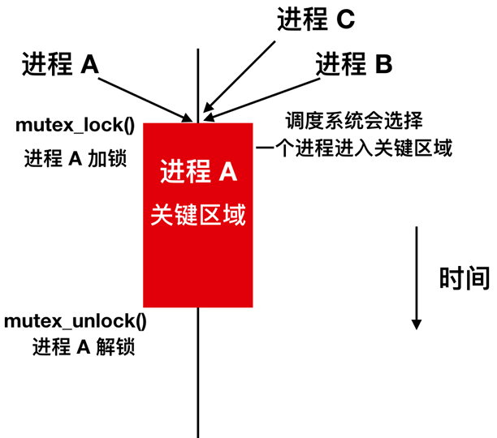
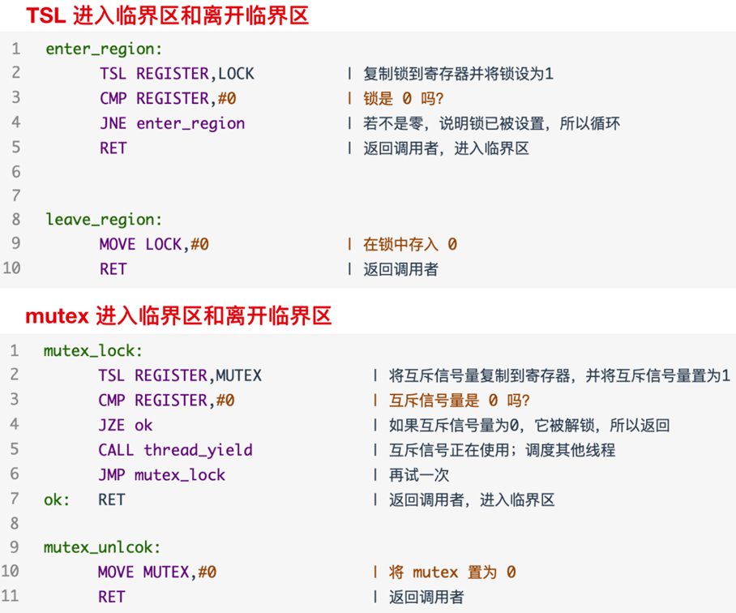

# 信号量机制与生产者消费者问题
## 1. 生产者-消费者问题
在讨论进程间同步与通信的私有原语应用时，一个经典的案例是“生产者-消费者（Producer-Consumer）”问题，也常被称为“有界缓冲区（Bounded-Buffer）”问题。此问题涉及两个角色：一个或多个生产者进程，负责向共享缓冲区中放入数据；以及一个或多个消费者进程，负责从缓冲区中取出数据。为了简化讨论，我们聚焦于单一生产者和单一消费者的场景。

在这个场景中，所有参与者共享一个固定大小的缓冲区，用于存储数据项。当生产者试图向已满的缓冲区中添加新数据时，会遇到阻塞情况，此时生产者应当暂停执行（即进入睡眠状态），直到缓冲区中有空间可用，并由某个机制（如消费者取出数据后）唤醒它。相反地，当消费者尝试从空缓冲区中取出数据时，也会遇到阻塞，需等待生产者填充数据并触发唤醒机制。

为了实现这种同步机制，我们需要一个“监视”变量（例如命名为 `count`），用于跟踪缓冲区中当前的数据项数量。假设缓冲区最多能存放 `N` 个数据项，生产者在每次尝试写入前会检查 `count` 是否已达上限，若未达上限，则执行写入操作并递增 `count`。消费者的行为类似，它在尝试读取前会检查 `count` 是否为 0，若缓冲区非空，则执行读取操作并递减 `count`。

此外，为了有效管理阻塞与唤醒，每个进程在操作过程中还需检查是否有可能唤醒对方。例如，生产者在添加数据后，若之前缓冲区为空（即 `count` 从 0 变为 1），则可能需要唤醒一个等待的消费者。同样地，消费者在移除数据后，若之前缓冲区已满（即 `count` 从 `N` 变为 `N-1`），则可能需要唤醒一个等待的生产者。

通过这种方式，生产者-消费者问题不仅展示了进程间同步与通信的必要性，还体现了使用适当同步机制（如信号量、条件变量等）来避免竞态条件、死锁及提高系统效率的重要性。

下面是生产者消费者的代码示例:

```C++
#include <stdbool.h> // 引入布尔类型支持  

/* 缓冲区 slot 槽的数量 */  
#define N 100  

/* 缓冲区数据的数量，使用 volatile 关键字防止编译器优化掉不必要的读取 */  
volatile int count = 0;  

// 模拟生成数据项的函数（示例） 
int produce_item(void) {  
    // 这里应该实现生成数据项的逻辑，这里简单返回静态值作为示例  
    static int item = 0;  
    return ++item;  
}  

// 模拟消费数据项的函数（示例）  
void consumer_item(int item) {  
    // 这里应该实现消费数据项的逻辑，这里仅打印作为示例  
    printf("Consumed: %d\n", item);  
}  

// 假设的插入数据项到缓冲区的函数（需具体实现）  
void insert_item(int item) {  
    // 这里应实现将数据项放入缓冲区的逻辑  
    // 注意：实际实现中可能需要考虑缓冲区同步和互斥访问  
}  

// 假设的从缓冲区移除数据项的函数（需具体实现）  
int remove_item(void) {  
    // 这里应实现从缓冲区取出数据项的逻辑  
    // 注意：实际实现中同样需要考虑同步和互斥  
    return 0; // 示例返回  
}  

// 模拟系统调用 sleep，这里使用忙等待（实际应使用系统提供的阻塞机制）  
void sleep(void) {  
    // 这里仅为示例，实际应使用系统提供的 sleep 函数  
    // 在这里，我们简单地让出 CPU 时间片，但这不是真正的 sleep  
    // 实际应用中，应使用如 POSIX 的 sleep() 或 Windows 的 Sleep()  
}  

// 模拟系统调用 wakeup，这里假设有某种机制可以唤醒其他线程或进程  
void wakeup(void (*func)(void)) {  
    // 这里仅为示例，实际应使用如 POSIX 的 pthread_cond_signal 或 Windows 的 SetEvent 
    // 这里我们不做任何操作，因为真正的唤醒机制依赖于操作系统  
}  

// 生产者  
void producer(void) {  
    int item;  

    // 无限循环  
    while (true) {  
        // 生成下一项数据  
        item = produce_item();  

        // 如果缓冲区是满的，就阻塞（这里用忙等待模拟）  
        while (count == N) {  
            sleep(); // 假设这是真正的系统调用 sleep  
        }  

        // 把当前数据放在缓冲区中  
        insert_item(item);  

        // 增加缓冲区 count 的数量  
        count++;  

        // 如果缓冲区之前为空，唤醒消费者  
        if (count == 1) {  
            wakeup(consumer); // 假设可以唤醒消费者线程或进程  
        }  
    }  
}  

// 消费者  
void consumer(void) {  
    int item;  

    // 无限循环  
    while (true) {  
        // 如果缓冲区是空的，就阻塞（这里用忙等待模拟）  
        while (count == 0) {  
            sleep(); // 假设这是真正的系统调用 sleep  
        }  

        // 从缓冲区中取出一个数据  
        item = remove_item();  

        // 将缓冲区的 count 数量减一  
        count--;  

        // 如果缓冲区之前是满的，唤醒生产者  
        if (count == N - 1) {  
            wakeup(producer); // 假设可以唤醒生产者线程或进程  
        }  

        // 打印数据项  
        consumer_item(item);  
    }  
}  

// 注意：上述代码中的 sleep 和 wakeup 函数仅为示例，实际实现应依赖具体的操作系统提供的机制。 
// 同时，缓冲区的管理（insert_item 和 remove_item）也需要实现具体的同步和互斥逻辑，以避免数据竞争。
```

现在，让我们深入探讨生产者-消费者问题中遇到的竞争条件问题。在上述代码中，由于 `count` 变量是全局共享的，且没有适当的同步机制保护，因此存在潜在的竞争条件。这种情况可能具体表现为：

假设缓冲区当前为空，消费者线程读取到 `count` 的值为 0，并据此判断缓冲区无数据可消费。然而，就在此时，操作系统的调度器决定暂停消费者线程的执行，转而运行生产者线程。生产者线程随后生产了一个数据项，将其放入缓冲区，并更新 `count` 为 1。由于生产者认为消费者可能因缓冲区空而处于等待状态，它尝试通过 `wakeup` 信号唤醒消费者。

但关键在于，消费者线程在接收到 `wakeup` 信号之前，其执行流程并未到达睡眠状态，因此这个 `wakeup` 信号实际上并未被消费者线程捕获，即发生了所谓的“唤醒丢失”。

当消费者线程最终再次被调度执行时，它基于之前读取的 `count` 值（仍为 0）判断缓冲区为空，并错误地进入睡眠状态。与此同时，生产者线程可能继续生产数据，直至缓冲区满并因此阻塞。此时，消费者和生产者都进入了等待状态，形成了一个死锁，双方都将无限期地等待对方采取行动，尽管实际上数据已经在缓冲区中可用或缓冲区已满。

**问题的核心在于**：唤醒操作可能发生在目标线程实际进入等待状态之前，导致唤醒信号被忽略。

**解决方案之一**: 是引入`唤醒等待标志（Wakeup Flag）`。这个标志用于指示是否有未处理的唤醒信号。当生产者尝试唤醒消费者但消费者尚未进入睡眠时，唤醒等待标志被设置。随后，当消费者准备进入睡眠状态时，它会检查这个标志。如果标志被设置，消费者将清除标志并继续执行，而不是真正进入睡眠状态。这样，即使唤醒信号在消费者实际睡眠前到达，也能确保消费者能够继续执行。

然而，对于多生产者-多消费者场景，仅仅增加唤醒等待位的数量并不能从根本上解决问题，因为这种方法仍然依赖于精确的时序和复杂的同步逻辑来避免潜在的竞争条件和死锁。更健壮的解决方案通常涉及使用更高级的同步机制，如信号量（semaphores）、互斥锁（mutexes）和条件变量（condition variables），这些机制能够更有效地管理线程间的同步和通信，从而避免唤醒丢失和其他并发问题。

## 2. 信号量

信号量，这一由`E.W.Dijkstra`在 1965 年提出的创新方法，旨在通过一个整型变量来累积并管理唤醒次数，从而为多进程或多线程环境下的同步与互斥提供强有力的支持。Dijkstra 引入了一个全新的变量类型——信号量（semaphore），其取值范围非负，0 代表无需进行任何唤醒操作，而任意正数则表示待处理的唤醒次数。

信号量的核心在于其定义的两个基本操作：
- **down**（通常也称作 **sleep**）
- **up**（亦称 **signal** 或 **V 操作**，类似 **wakeup**）

`down` 操作（或 `wait` 或 `P` 操作）执行时，首先检查信号量的值是否大于 0。若是，表示有资源可用，于是将信号量值减 1，允许进程继续执行；若信号量值为 0，则表示当前无资源可用，进程将被挂起（即进入睡眠状态），等待资源释放。重要的是，这一系列检查、修改及可能的睡眠操作构成一个原子操作（atomic action），意味着这些操作要么全部完成，要么完全不执行，从而避免了任何中间状态被其他进程所见，确保了操作的完整性和系统的稳定性。

另一方面，`up` 操作则是当资源被释放时执行，它简单地将信号量的值加 1。若存在因资源不足而在信号量上等待的进程，系统会选择其中一个（或多个，具体取决于系统实现）进行唤醒，允许其继续执行其未完成的 `down` 操作。值得注意的是，即便是在多个进程可能因资源竞争而等待的情况下，`up` 操作及随之而来的唤醒过程也保持原子性，确保了每次 `up` 操作都能有效减少等待队列中的进程数，且此过程本身不会导致任何进程的阻塞。

这种设计机制有效地解决了同步问题，避免了竞争条件的产生。

### 2.1 用信号量解决生产者 - 消费者问题
使用信号量（semaphores）是一种有效的方式来避免诸如“丢失的wakeup”这样的并发问题。代码如下

```C++
/* 定义缓冲区槽的数量 */  
#define N 100  

/* 信号量类型定义，通常在实际应用中会使用更复杂的结构体来确保原子操作 */  
typedef int semaphore;  

/* 初始化信号量，控制对关键区域的访问 */  
semaphore mutex = 1;   // 初始化为 1，表示互斥锁未被占用  
semaphore empty = N;    // 初始化为 N，表示缓冲区开始时有 N 个空槽  
semaphore full = 0;     // 初始化为 0，表示缓冲区开始时没有满槽  

/* 生产者函数 */  
void producer(void) {  
    int item;  

    /* 无限循环生产数据 */  
    while (1) {  
        /* 生产一个数据项 */  
        item = producer_item();  // 假设这是一个返回新生产数据项的函数  

        /* 等待缓冲区有空槽 */  
        down(&empty);  // 如果 empty 为 0，则生产者将阻塞，直到有消费者释放空槽  

        /* 进入临界区，保护对缓冲区的访问 */  
        down(&mutex);  // 确保没有其他生产者或消费者同时访问缓冲区  

        /* 将数据项放入缓冲区 */  
        insert_item(item);  // 假设这是将数据项放入缓冲区的函数  

        /* 离开临界区 */  
        up(&mutex);  // 释放互斥锁，允许其他生产者或消费者访问缓冲区  

        /* 增加缓冲区满槽的数量 */  
        up(&full);   // 表示缓冲区中多了一个满槽  
    }  
}  

/* 消费者函数 */  
void consumer(void) {  
    int item;  

    /* 无限循环消费数据 */  
    while (1) {  
        /* 等待缓冲区有数据可消费 */  
        down(&full);  // 如果 full 为 0，则消费者将阻塞，直到有生产者放入数据  

        /* 进入临界区 */  
        down(&mutex);  // 确保没有其他生产者或消费者同时访问缓冲区  

        /* 从缓冲区取出数据项 */  
        item = remove_item();  // 假设这是从缓冲区取出数据项的函数  

        /* 离开临界区 */  
        up(&mutex);  // 释放互斥锁  

        /* 增加缓冲区空槽的数量 */  
        up(&empty);  // 表示缓冲区中多了一个空槽  

        /* 处理取出的数据项 */  
        consume_item(item);  // 假设这是处理数据项的函数  
    }  
}  

/* 注意：  
   - down(&semaphore) 操作会检查信号量的值，如果为 0 则阻塞调用者，否则将其减 1。  
   - up(&semaphore) 操作会将信号量的值加 1，并可能唤醒一个或多个在该信号量上等待的进程。  
   - 这里假设 producer_item(), insert_item(), remove_item(), consume_item() 等函数  
     已经正确定义并实现了相应的功能。  
*/
```

为了确保信号量机制能够准确无误地运作，关键在于实现它们的操作时需保证操作的不可分割性。通常，这通过将 `up` 和 `down` 操作封装为系统调用来达成，系统调用在执行其核心步骤——即检查信号量值、更新信号量值以及在必要时挂起进程——时会暂时禁用中断。由于这些步骤极为简短，通常只需几条指令即可完成，因此在此期间禁用中断不会对系统性能造成显著影响。

在多处理器环境下，为了避免多个 CPU 同时修改同一信号量而导致的数据不一致问题，需要采取额外的锁定机制。这通常通过利用测试并设置锁（TSL）或交换（XCHG）等原子指令来实现，确保在任何给定时刻，只有一个 CPU 能够执行对信号量的修改操作。

值得注意的是，使用 TSL 或 XCHG 指令来确保信号量的独占访问，与生产者或消费者采用忙等待策略来等待缓冲区空间释放或填充的情况有着本质区别。前者是一种高效的锁定机制，其操作时间通常以微秒或毫秒计；而后者则可能因等待条件满足而耗费任意长的时间，这可能导致资源的低效利用和响应时间的延长。

在解决生产者-消费者问题时，上述策略通过引入三种信号量来协调生产与消费活动：
- `full` 信号量用于追踪已填满的缓冲区槽数。
- `empty` 信号量记录空槽数。
- `mutex` 信号量则确保在任何时刻，缓冲区都不会同时被生产者和消费者访问。

具体地：
- `full` 初始化为 0，表示初始时没有填满的槽；
- `empty` 初始化为缓冲区容量，即初始时所有槽均为空；
- `mutex` 初始化为 1，代表互斥锁在初始时是开放的，允许一个进程进入关键区。

这里提到的 `mutex` 信号量，其实是一个二进制信号量（binary semaphore）的实例，它特别用于控制对共享资源的互斥访问。当每个进程在访问关键区域之前执行 `down(mutex)` 操作，并在访问完成后执行 `up(mutex)` 操作时，就建立了一个互斥锁，确保了任意时刻只有一个进程能够进入并操作关键区域。这种机制对于维护数据一致性和避免竞争条件至关重要。

在探讨进程间同步与通信的坚实基础上，我们进一步审视中断处理的顺序性保障，这对于确保系统稳定性和高效性至关重要。以下是中断处理流程的一个严谨且正确的描述，其中穿插了信号量机制在中断处理中的应用实例：

1. **硬件自动保存上下文**：当中断发生时，硬件会立即将当前执行的程序计数器（PC）、状态寄存器等关键上下文信息压入堆栈中，以便之后能够恢复执行。
  
2. **硬件跳转到中断处理程序**：根据中断类型，硬件从中断向量表中读取相应的中断服务例程（ISR）地址，并更新程序计数器以跳转到该地址开始执行中断处理程序。
  
3. **汇编语言中断处理程序初始化**：中断处理程序首先以汇编语言编写，用于快速保存当前进程的其他重要寄存器值到堆栈或特定内存区域，以确保上下文完整性。
  
4. **设置新的堆栈（可选）**：根据中断类型和系统需求，中断处理程序可能会设置一个新的堆栈空间，用于中断处理过程中的局部变量和函数调用。
  
5. **C语言中断服务器执行**：随后，中断处理流程可能进入 C 语言编写的中断服务器，执行具体的中断服务逻辑，如读取 I/O 设备数据或向缓存写入数据。在采用信号量的系统中，此步骤可能包括在信号量上执行 `up` 操作，以通知等待该 I/O 操作完成的进程。例如，当磁盘 I/O 完成时，中断服务器会在对应的信号量上执行 `up`，从而唤醒可能因等待数据而阻塞的进程。
  
6. **调度决策**：中断处理完毕后，控制权交还给操作系统，此时调度器会根据当前系统的状态（如进程优先级、就绪队列等）决定接下来应该运行哪个进程。如果有多个进程就绪，调度算法（如轮转调度、优先级调度等）将决定执行顺序。
  
7. **C到汇编的过渡**：在选定下一个要运行的进程后，可能需要通过 C 语言调用汇编代码来准备进程切换，包括恢复进程的上下文（如寄存器值、程序计数器等）。
  
8. **汇编语言过程切换进程**：最终，汇编语言代码负责将控制权转移给新的当前进程，通过恢复其保存的上下文信息，使该进程能够从中断发生前的状态继续执行。

在采用信号量机制来管理 I/O 设备的系统中，确保中断处理的平滑与高效至关重要。为此，每个 I/O 设备被分配一个初始值为 0 的信号量，这一设计巧妙地隐藏了中断的复杂性。以下是该过程严谨且正确的描述，并辅以实例说明：

当 I/O 设备被启动执行某项任务（如读取磁盘数据）时，由于该任务尚未完成，相应的信号量保持为 0 状态。此时，若有进程尝试访问该 I/O 设备的输出或结果，它会在尝试对该信号量执行 `down` 操作时受阻，因为信号量的值为 0，不满足 `down` 操作的条件，因此进程会被阻塞，进入等待状态。

随后，当 I/O 操作完成并触发中断时，中断处理程序会接管控制权。作为中断处理流程的一部分，处理程序会对之前因等待该 I/O 操作而阻塞的信号量执行 `up` 操作。`up` 操作将信号量的值增加 1，若此时有进程正等待在该信号量上（即之前被阻塞的进程），则这些进程中的一个或多个（取决于信号量的计数和等待队列中的进程数）将被唤醒并继续执行。

在您提到的中断处理步骤中，特别是第 5 步“C 中断服务器运行”，这一阶段正是中断处理程序执行 `up` 操作的时机。通过这一操作，中断处理程序不仅标记了 I/O 操作的完成，还间接地促进了等待该操作的进程的继续执行。需要注意的是，这里的“C 中断服务器运行”并不直接执行设备驱动程序，而是设备驱动程序（或其部分功能）作为中断服务例程的一部分被调用，以响应中断并处理相关的硬件操作。

至于第 6 步，操作系统通常会在中断处理完毕后，根据当前系统的状态（包括就绪队列中的进程、进程优先级等）来决定下一个要运行的进程。如果存在多个就绪进程，调度器将依据其调度算法（如优先级调度、轮转调度等）来做出选择。这里提到的“更重要的进程”是相对于调度算法中的评估标准而言的，具体哪些因素被认定为“更重要”则取决于调度策略的设计。

综上所述，信号量在 I/O 中断处理中扮演着关键角色，通过巧妙地管理进程的阻塞与唤醒，确保了系统资源的有效利用和进程间的有序执行。

上述代码示例巧妙地展示了信号量的两种不同应用方式，这两种方式各自承载着重要的角色，并且它们之间的区别对于理解并发编程中的同步与互斥机制至关重要。

首先，`mutex`（互斥锁）信号量被专门用于实现互斥访问。互斥是一种同步机制，旨在确保在任何给定时刻，只有一个进程（或线程）能够访问特定的共享资源（如缓冲区及其相关变量）。这种机制是避免数据竞争和条件竞争、维护数据一致性和系统稳定性的必要手段。例如，在生产者-消费者问题中，多个生产者进程和消费者进程可能同时尝试访问同一个缓冲区来存放或取出数据。如果没有适当的互斥机制，就可能导致数据损坏或不一致。通过

使用 `mutex` 信号量，我们可以确保在任何时刻，只有一个进程能够进入临界区（即访问缓冲区的代码段），从而保护缓冲区免受并发访问的干扰。

另一方面，`full` 和 `empty` 信号量则用于实现同步控制。同步关注的是不同进程（或线程）之间的事件顺序和相互依赖关系。在这个例子中，`full` 信号量用于记录缓冲区中已填满的槽位数量，当缓冲区满时，它会阻止生产者继续生产数据（即生产者会在这个信号量上等待，直到有空槽位可用）。相反，`empty` 信号量用于记录缓冲区中空槽位的数量，当缓冲区为空时，它会阻止消费者继续消费数据（即消费者会在这个信号量上等待，直到有数据可供消费）。这两个信号量的协作确保了生产者和消费者之间的有序合作，避免了资源的浪费和进程的无效等待。

`mutex` 信号量侧重于互斥访问，确保资源在同一时间只被一个进程使用；而 `full` 和 `empty` 信号量则侧重于同步控制，确保进程之间的协作和依赖关系得到正确维护。这两种信号量的使用方式截然不同，但共同构成了并发编程中不可或缺的同步与互斥机制。

## 3. 互斥量
在并发编程中，当不需要信号量的复杂计数功能时，一个更为简洁而有效的选择是 **mutex**（互斥量）。 

mutex 的核心优势在于它能够确保对共享资源或代码段的互斥访问，即同一时间只有一个线程（或进程）能够访问这些资源或执行该段代码。这种简单而高效的实现方式，使得 mutex 在构建用户空间线程库时显得尤为重要和实用。

互斥量是一个共享变量，其状态仅有两个：
- **unlocked**（解锁）
- **locked**（加锁）

尽管从逻辑上讲，互斥量的状态可以用一个二进制位来表示（0 代表解锁，1 代表加锁），但在实际实现中，为了处理递归锁定等复杂情况，通常会使用一个整数（integer）来存储状态。在这个整数中，0 仍然表示解锁状态，而任何非零值则表示加锁状态，其中大于 1 的值可能用于记录锁定的次数（即支持递归锁定），尽管这并非所有 mutex 实现的必需特性。

mutex 的操作主要围绕两个过程进行：
1. **mutex_lock**：当一个线程需要访问被 mutex 保护的共享资源或代码段（即关键区域）时，它会首先调用 `mutex_lock`。如果 mutex 处于解锁状态，表示关键区域当前未被占用，关键区域将执行相关操作。

2. **mutex_unlock**：在完成关键区域的操作后，线程会调用 `mutex_unlock` 来释放锁。

值得注意的是，如果存在多个线程在 mutex 已经被其他线程锁定的情况下尝试加锁，尝试加锁的线程将被阻塞，直到持有锁的线程完成关键区域的访问并调用 `mutex_unlock`。解锁操作通常会唤醒其中一个等待线程，但具体选择哪个线程则可能依赖于操作系统的调度策略和 mutex 的具体实现，这一过程可能不是完全确定的。

通过这样的机制，mutex 有效地防止了多个线程同时访问共享资源或执行关键代码段，从而避免了数据竞争和条件竞争等并发问题。

| ##container## |
|:--:|
||

由于 mutex 互斥量非常简单，所以只要有 TSL 或者是 XCHG 指令，就可以很容易地在用户空间实现它们。用于用户级线程包的 `mutex_lock` 和 `mutex_unlock` 代码如下，XCHG 的本质也一样。

```arm
mutex_lock:
    | 将互斥信号量复制到寄存器，并将互斥信号量置为 1
    TSL REGISTER, MUTEX
    
    | 互斥信号量是 0 吗?
    CMP REGISTER, #0 
    
    | 如果互斥信号量为 0，它被解锁，所以返回
    JZE ok  
    
    | 互斥信号正在使用；调度其他线程
    CALL thread_yield
    
    | 再试一次
    JMP mutex_lock  
    
    | 返回调用者，进入临界区
ok:     
    RET

mutex_unlock:
    | 将 mutex 置为 0 
    MOVE MUTEX, #0   
    
    | 返回调用者
    RET
```

mutex_lock 的代码和上面 enter_region 的代码很相似，我们可以对比着看一下:

| ##container## |
|:--:|
||

在上面的代码中，最大的区别在于对 `mutex` 和 `TSL` 的处理逻辑。在使用 `TSL` 的情况下，如果没有进入临界区的进程会无限循环尝试获取锁，这样可能导致资源的浪费和性能问题。

而在处理 `mutex` 时，如果它已经被其他线程锁定，当前线程会调用 `thread_yield`，将 CPU 控制权让给其他线程。这种方式避免了忙等待，确保了系统的响应能力，因为其他线程有机会执行，可能会释放锁。

这种区别在用户线程的上下文中尤为突出，因为没有时钟来强制停止运行时间过长的线程。因此，通过 `thread_yield` 的设计，避免了忙等待的情况，提升了系统的并发性。

另外，`mutex_lock` 和 `mutex_unlock` 的实现不需要任何内核调用，所有操作都在用户空间完成，效率更高。这一机制使得用户线程能够在用户空间中实现同步，减少了对系统调用的依赖。

为了提供更多的灵活性，线程库还可能提供 `mutex_trylock`，允许线程尝试获取锁。如果获取失败，它可以返回错误码，而不是阻塞等待。这样，线程可以根据返回的状态选择继续尝试、执行其他操作或等待，从而提高了灵活性和效率。

以下是对您提供内容的格式化：

---

### 3.1 Futexes

在并行计算日益普遍的今天，实现高效的同步（synchronization）与锁定（locking）机制对于维护系统性能至关重要。选择合适的同步原语可以显著提升效率，尤其是在不同场景中。

- 自旋锁与阻塞锁

对于等待时间极短的场景，自旋锁展现出显著优势。自旋锁通过让等待锁的线程在一个循环中持续检查锁的状态，而不是直接挂起或阻塞，从而在锁很快被释放时能够迅速获得锁，减少了线程切换的开销。然而，如果锁的等待时间较长，持续的自旋会无谓地消耗CPU资源，造成浪费。

相反，在锁等待时间较长或系统中进程数量较多的情况下，采用传统的阻塞式锁（通常依赖于内核）更为高效。当线程尝试获取锁而失败时，它会被阻塞，直到锁被释放并由内核重新唤醒。这种方式在锁竞争激烈时能有效降低CPU资源的无效占用，但在锁竞争不激烈时，频繁的线程挂起与唤醒（涉及内核上下文切换）可能成为性能瓶颈。此外，准确预测锁的竞争程度以优化选择同步机制也是一大挑战。

- Futex 机制

为解决上述问题，Futex（快速用户空间互斥，Fast Userspace Mutexes）应运而生，它巧妙地融合了自旋锁与阻塞锁的优点。Futex允许进程在用户空间自旋一段时间（等待锁短暂释放），如果在此期间锁未释放，则进程将自动切换至阻塞状态，并通过内核机制进行高效的等待与唤醒。这种机制减少了不必要的内核上下文切换，同时避免了长时间自旋导致的CPU资源浪费。

例如，在数据库管理系统中，多个线程可能同时尝试访问同一个数据页。如果数据页上的锁在短时间内被释放，futex允许线程在用户空间自旋等待，从而快速响应锁的释放。如果锁长时间被占用，线程则会自动转为阻塞状态，避免了无谓的CPU占用。

```C++
    同步 + 互斥 ==> ???
                  Futex !!!
```

- Futex 的构成

Futex是Linux内核提供的一种高效同步机制，旨在实现类似于互斥锁的功能，同时显著减少因频繁陷入内核空间而导致的性能开销。它由两大核心部分组成：

1. **内核服务**：这部分是futex机制在Linux内核中的实现，提供了一个高效的等待队列。当进程（或线程）尝试获取一个被其他进程持有的锁时，它可以通过futex系统调用将自己加入到等待队列中。此时，进程并不会立即陷入休眠状态，而是保持在一个“等待”状态，允许在用户空间进行自旋。如果自旋一段时间后锁仍未释放，进程才会真正陷入休眠，等待内核在锁被释放时将其唤醒。

2. **用户空间库**：为了简化futex的使用，Linux还提供了用户空间库，这些库封装了futex系统调用的细节，使开发者能够方便地在用户程序中实现同步机制。通过调用这些库函数，开发者可以轻松地创建锁、解锁以及等待锁等操作，而无需直接与系统调用接口打交道。

- 实际示例

举个例子，假设有两个进程A和B，它们都需要访问同一个共享资源。进程A首先获得了访问权并锁定了该资源。此时，如果进程B尝试访问该资源，它将通过futex系统调用将自己加入到等待队列中。如果进程A很快完成了对资源的访问并释放了锁，进程B可能会在用户空间通过自旋快速获得锁，从而避免了内核切换的开销。如果进程A的访问时间较长，进程B则会在自旋一段时间后陷入休眠，等待内核在锁被释放时将其唤醒。这样，futex就能够在保证同步正确性的同时，最大限度地提高系统的性能。

```C++
          /-- 内核服务
    Futex 
          \-- 用户库
```

- 结论

在并发编程中，频繁地将进程或线程置于等待队列通常涉及昂贵的系统调用，这是应当尽量避免的。Futex机制提供了一种优化方案，在无锁竞争的情况下完全在用户空间内运作，从而减少了内核介入的频率，显著提升了性能。

Futex机制的核心在于进程或线程之间共享一个32位整数作为锁变量。通常，这个锁变量被初始化为1，表示锁处于释放状态（未锁定）。当一个线程需要访问受保护的资源时，它会执行一个原子性的“减少并测试（decrement and test）”操作来尝试获取锁。这个操作通过Linux提供的原子指令功能实现。

具体来说，当线程执行“减少并测试”操作时，它会将锁变量的值减1，并立即检查结果。如果锁变量的值变为0（表示没有其他线程持有锁），则该线程成功获取了锁，可以继续执行受保护的代码段。然而，如果锁变量在操作后仍然大于0（表示锁已被其他线程持有），则当前线程未能获取锁，需要等待。

在需要等待的情况下，futex机制避免了无意义的自旋等待，而是通过一个系统调用将线程置于内核的等待队列中。这种切换至内核的开销在此时被认为是合理的，因为线程将进入阻塞状态，等待锁被释放。当持有锁的线程完成其操作并释放锁时，它会检查内核等待队列上是否有其他线程在等待该锁。如果有，内核将负责唤醒等待队列中的一个或多个线程，以继续它们的执行。

值得注意的是，当没有锁竞争时（即所有尝试获取锁的操作都能立即成功），futex机制能够完全在用户空间内运作，无需内核介入，从而实现了极高的效率。这种设计使得futex成为高并发环境下现代同步机制的理想选择。

### 3.2 Pthreads 中的互斥量

- 请看[互斥锁](../../../../002-程序语言/001-C++/002-tmp丶C++丶memo/005-C++多进程与多线程/001-C语言版/004-互斥锁/index.md) | [条件变量](../../../../002-程序语言/001-C++/002-tmp丶C++丶memo/005-C++多进程与多线程/001-C语言版/007-条件变量/index.md)