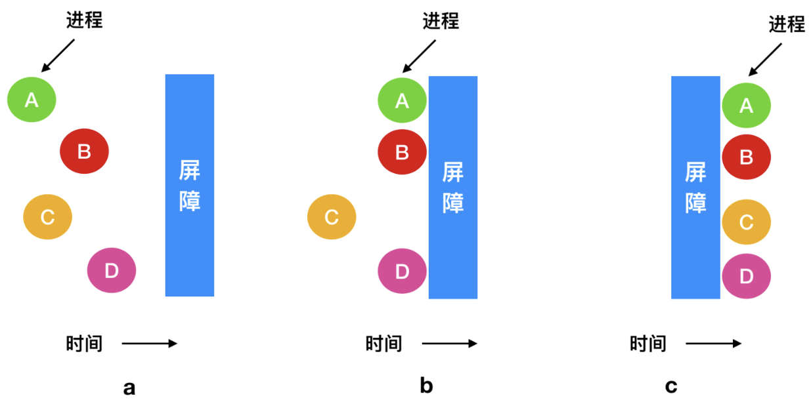

# 管程、消息通信、屏障等
## 一、管程
为了能够编写出更加精确无误且易于维护的程序, Brinch Hansen 和 Hoare 两位计算机科学先驱各自独立地提出了一个高级同步机制, 即`管程(Monitor)`。尽管他们的具体实现细节和侧重点略有不同, 但管程的基本概念是相似的: **它是一种将程序、变量(共享数据)以及保护这些数据的操作封装在一起的特殊模块或包。这种封装确保了数据的一致性和线程安全, 因为进程(或线程)在访问管程内的数据或执行其内部程序时, 会遵循严格的互斥原则。**

管程的核心特性在于, 它只允许进程在管程内部执行对共享数据的操作, 从而防止了从外部直接访问数据可能导致的竞态条件和数据不一致问题。这种设计使得并发编程更加直观和安全。

下面是一个抽象的管程示例, 采用类似Pascal语言的伪代码风格来展示其基本概念, 因为Pascal语言在表达模块化编程方面较为清晰, 而C语言由于其本身的特性并不直接支持管程结构。

```pascal
MONITOR BankAccount
VAR
    balance: INTEGER;  {* 账户余额, 初始化为0(需在BEGIN块中显式初始化) *}

    {* 存款过程, 将指定金额存入账户 *}
    PROCEDURE Deposit(amount: INTEGER);
    BEGIN
        {* 如果存款金额大于0, 则将其加到余额上 *}
        IF amount > 0 THEN
            balance := balance + amount;  {* 更新账户余额 *}
        END IF;
    END Deposit;

    {* 取款过程, 从账户中取出指定金额 *}
    PROCEDURE Withdraw(amount: INTEGER);
    BEGIN
        {* 如果取款金额不超过当前余额, 则执行取款操作 *}
        IF amount <= balance THEN
            balance := balance - amount;  {* 更新账户余额 *}
        ELSE
            {* 这里可以添加错误处理, 例如打印错误信息或抛出异常 *}
        END IF;
    END Withdraw;

BEGIN
    {* 初始化账户余额为0 *}
    balance := 0;
END BankAccount;
```

在这个例子中, **BankAccount** 是一个管程, 它包含以下内容:   
1. 一个整型变量:   
   - **balance**(代表账户余额)。  

2. 两个过程:   
   - **Deposit**(存款)。  
   - **Withdraw**(取款)。  

任何尝试访问或修改 **balance** 的操作都必须通过 **Deposit** 或 **Withdraw** 过程进行。这些过程内部会自动处理必要的同步和互斥, 以确保:   
- 在同一时刻只有一个进程能够修改 **balance**,   
- 从而避免并发访问时可能出现的问题。

---  

需要注意的是, 由于C语言本身不支持管程作为内置特性, 要实现类似的功能, 通常需要借助互斥锁(mutexes)、条件变量(condition variables)等同步机制, 以及适当的代码结构和逻辑来模拟管程的行为。

如: 在Java中, `管程`的概念通常通过`synchronized`关键字和`wait()`、`notify()`或`notifyAll()`方法来实现, 以确保线程间的同步和互斥。

> 说白了, <span style="color:gold">`管程`就是封装好的线程安全的对象</span> (简要理解)

管程通过其内置的临界区自动互斥机制, 相较于信号量, 在并行编程中更易于确保正确性。(毕竟封装了)

---

无论是**管程**还是**信号量**, 它们最初都是为了解决单一或多 CPU 架构下共享内存访问的互斥问题而设计的。在单一或多 CPU 系统中, 通过以下方式可以有效防止竞争条件的发生: 
1. 将信号量置于共享内存中。
2. 使用原子指令(如 `Lock`、`TSL`(Test and Set Lock)或 `XCHG`(Exchange))保护信号量。

然而, 在**分布式系统**环境中, 情况复杂得多: 
1. 分布式系统可能包含多个 CPU, 每个 CPU 拥有独立的私有内存, 并通过网络进行通信。
2. 在这种场景下, 传统的基于共享内存的信号量和管程显得不再适用: 
   - **信号量**虽然提供了基本的同步机制, 但其操作级别较低, 难以直接应用于分布式环境。
   - **管程**由于语言支持的限制, 在大多数分布式编程场景中无法使用, 尤其因为管程强依赖于共享内存和特定语言环境。

> **在分布式系统中解决互斥和同步问题的高级方法**
> 
> 为了适应分布式系统的特性, 需要采用更高级和灵活的机制, 例如: 
> 1. **分布式锁**: 
>    - 使用分布式协调工具(如 Zookeeper 或 Redis)实现锁的获取和释放, 保证多个节点间对共享资源的互斥访问。
> 
> 2. **事务性内存(Transactional Memory)**: 
>    - 提供一种乐观的并发控制机制, 通过事务提交和回滚确保操作的原子性和一致性。
> 
> 3. **基于消息传递的并发模型**: 
>    - 通过消息队列(如 RabbitMQ、Kafka)或 Actor 模型(如 Akka)来管理节点之间的通信和同步, 无需依赖共享内存。

## 二、消息传递
### 2.0 引入

> 在开发过程中, 如果多个进程需要相互通信, 我们该如何设计通信方式?
>
> 我们知道, 每个进程都有自己的虚拟地址空间, 因此即使它们的内存地址相同, 实际映射的物理地址也是 **不同** 的。同时, 不同的进程也无法直接访问彼此的全局变量来通信。
>
> 或许你会想到, 既然内存无法直接共享, 那是否可以通过读写 **同一个文件** 来实现通信呢？确实可行, 但问题在于, 这种基于 **磁盘** 的通信方式速度太慢, 不适合频繁交互。
>
> 不过, 虽然进程的私有内存是虚拟的, 但操作系统可以提供一个公共的共享内存区域, 并通过接口让进程交互数据！这种机制就是“有名管道”的基本原理。

### 2.1 消息传递的基本概念
消息传递是一种进程间通信(IPC)机制, 它通过进程之间发送和接收消息来交换数据或实现同步, 而不需要共享内存。每条消息可以包含数据(如整数或字符串)以及控制信息(如请求或响应)。

它特别适合分布式系统, 因为在分布式环境中, 各节点通常无法直接共享内存, 消息传递成为首选通信方式。

---

### 2.2 消息传递的分类
#### 2.2.1 基于同步性的分类
1. **同步通信**: 
   - 发送进程在消息被接收前会被阻塞, 接收进程在收到消息之前也会被阻塞。
   - 这种方式更适合需要严格执行顺序的场景, 例如生产者-消费者模型。

2. **异步通信**: 
   - 发送进程在消息发出后即可继续执行, 接收进程可在任意时间接收消息。
   - 这种方式更加灵活, 但需要处理消息存储和排序问题。

#### 2.2.2 基于通信方式的分类
1. **点对点通信**: 一个发送者和一个接收者之间直接进行消息交换。
2. **组通信**: 一个发送者将消息广播给多个接收者, 常用于分布式系统中的通知或事件广播。

---

### 2.3 消息传递的实现方式
#### 2.3.1 直接通信
- **实现方式**: 
  进程通过指定对方的标识符直接发送或接收消息。
- **特点**: 
  - 简单直接, 效率较高。
  - 发送方和接收方需要明确彼此的标识, 进程间耦合度高。

#### 2.3.2 间接通信
- **实现方式**: 
  通过消息队列等中间实体传递消息, 进程无需直接交互。
- **特点**: 
  - 解耦合, 发送者和接收者无需知道彼此的存在。
  - 系统需要管理消息队列, 如分配存储、处理满队列等问题。

在分布式系统中, 间接通信的典型实现包括使用消息队列(如 Kafka、RabbitMQ)或发布-订阅模式。

---

### 2.4 消息传递的实际应用

1. **分布式系统**: 通过消息传递实现节点间的数据交换, 如远程过程调用(RPC)或 HTTP 请求。
2. **实时系统**: 用于任务调度和事件通知, 保证系统的实时响应能力。
3. **嵌入式系统**: 模块之间通过消息传递协作, 降低系统复杂性。
4. **操作系统的进程通信**: 在 Linux 中, 可以通过管道、消息队列或套接字等方式实现消息传递。

---

### 2.5 消息传递的优缺点
#### 2.5.1 优点
1. **解耦性高**: 发送进程和接收进程可以独立存在, 便于维护和扩展。
2. **无需共享内存**: 简化并发编程, 避免竞争条件和死锁问题。
3. **适合分布式环境**: 通过网络实现进程间通信, 灵活性强。

#### 2.5.2 缺点
1. **性能开销**: 与直接共享内存相比, 消息传递的效率较低, 尤其在高频通信场景中。
2. **复杂性**: 需要额外管理消息队列、消息丢失处理等问题。 

---

### 2.6 基于信箱(Mailbox)的编址
基于信箱的编址是一种**进程间通信(IPC)机制**, 它通过“信箱”这一中间实体实现消息的存储和传递。与直接编址不同, 信箱的引入解耦了发送方和接收方, 使得进程之间的通信更加灵活和高效。

---

基本概念

**信箱(Mailbox)**: 

信箱是一个由操作系统管理的抽象数据结构, 用于存储进程之间发送的消息。发送者将消息发送到信箱中, 接收者从信箱中取出消息完成通信。

---

信箱的工作流程
1. **信箱的创建**: 
   - 由操作系统或进程动态创建, 分配唯一标识符。
2. **发送消息**: 
   - 发送进程通过信箱的标识符, 将消息写入信箱中。
3. **存储消息**: 
   - 信箱内部维护一个队列, 用于存储消息(可以是先进先出或优先级队列)。
4. **接收消息**: 
   - 接收进程通过信箱的标识符, 从信箱中读取消息。

---

信箱的类型

按消息与进程的绑定方式
1. **私有信箱**: 
   - 信箱只为一个进程服务, 仅该进程可访问。
   - 适用于严格点对点通信场景。
2. **共享信箱**: 
   - 多个进程可访问同一个信箱, 用于多对多通信。
   - 适合广播、组通信等场景。

按信箱的存储容量
1. **有限容量**: 
   - 信箱有固定的消息存储上限, 达到容量后发送进程可能会被阻塞或失败。
2. **无限容量**:   
   - 信箱可以动态扩展存储空间, 但会占用更多的系统资源。*(实际上还是有限的, 因为内存有限)*

---

信箱的应用场景
1. **解耦通信**:   
   - 发送者和接收者不需要直接交互, 便于模块化设计和动态扩展。  
2. **异步通信**:   
   - 进程之间可以独立运行, 通过信箱异步交换数据。  
3. **分布式系统**:   
   - 信箱机制非常适合分布式环境中的消息传递, 例如消息队列(如 RabbitMQ 和 Kafka)就是信箱概念的扩展。  

---

优点  
1. **解耦性**:   
   - 发送进程和接收进程只需通过信箱通信, 无需了解彼此的具体信息。  
2. **支持异步**:   
   - 信箱机制允许发送和接收过程分离, 增加通信灵活性。  
3. **灵活性强**:   
   - 可以通过调整信箱容量或使用优先级队列满足不同的通信需求。  

缺点  
1. **额外开销**:   
   - 操作系统需要分配和管理信箱的存储资源, 增加系统复杂性。  
2. **潜在的延迟**:   
   - 如果信箱容量有限或消息过多, 可能导致消息阻塞或丢失。  


### 2.7 总结

消息传递是解决进程间通信和同步问题的重要机制, 尤其在分布式系统中得到了广泛应用。通过发送和接收消息, 可以避免共享内存的复杂性, 同时提供了灵活的通信方式。结合具体场景, 选择同步或异步通信、直接或间接通信的方式, 是实现高效可靠系统的关键。

## 三、屏障
### 3.1 屏障的概念
在处理复杂的并行或分布式系统时, 特别是那些需要精细控制进程间同步与协作的应用场景中, 一种有效的机制是利用`屏障(barrier)`来同步进程组的行为。这种机制特别适用于那些被划分为多个阶段的任务, 其中每个阶段的推进都依赖于所有参与进程的同时就绪。

具体来说, 屏障被设计为一个同步点, 它位于每个阶段的末尾, 用于确保所有进程在继续执行下一个阶段之前都达到了同一状态。当一个进程完成其当前阶段的工作并尝试跨越屏障时, 如果该进程是首个到达的, 它将在此等待; 如果已有其他进程在此等待, 则所有进程都将被挂起, 直到最后一个进程也到达屏障。屏障可用于一组进程同步, 如下图所示:

| ##container## |
|:--:|
||

> 类比于, 使用gpu进行计算矩阵, 你需要等待前一个矩阵整个计算完了, 才可以让它继续和下一个矩阵计算.

### 3.2 C代码示例

下面是C语言程序示例: (通过`互斥锁+条件变量+cnt`实现)

```C++
#include <stdio.h>
#include <stdlib.h>
#include <pthread.h>

#define THREAD_COUNT 5  // 线程数量

// 定义一个结构体, 用于存储屏障相关信息
typedef struct {
    pthread_mutex_t mutex;     // 互斥锁
    pthread_cond_t cond;       // 条件变量
    int count;                 // 当前到达屏障的线程数
    int threshold;             // 屏障需要的线程数
} Barrier;

// 初始化屏障
void barrier_init(Barrier *barrier, int threshold) {
    pthread_mutex_init(&barrier->mutex, NULL);
    pthread_cond_init(&barrier->cond, NULL);
    barrier->count = 0;
    barrier->threshold = threshold;
}

// 销毁屏障
void barrier_destroy(Barrier *barrier) {
    pthread_mutex_destroy(&barrier->mutex);
    pthread_cond_destroy(&barrier->cond);
}

// 等待屏障
void barrier_wait(Barrier *barrier) {
    pthread_mutex_lock(&barrier->mutex);

    barrier->count++;  // 增加到达屏障的线程数

    if (barrier->count == barrier->threshold) {
        // 如果所有线程都到达屏障, 广播唤醒所有线程并重置计数
        barrier->count = 0;
        pthread_cond_broadcast(&barrier->cond);
    } else {
        // 等待其他线程到达屏障
        pthread_cond_wait(&barrier->cond, &barrier->mutex);
    }

    pthread_mutex_unlock(&barrier->mutex);
}

// 线程函数
void* thread_func(void* arg) {
    Barrier *barrier = (Barrier *)arg;
    printf("Thread %lu: Reached the barrier.\n", pthread_self());
    barrier_wait(barrier);  // 等待屏障
    printf("Thread %lu: Passed the barrier.\n", pthread_self());
    return NULL;
}

// 主函数
int main() {
    pthread_t threads[THREAD_COUNT];
    Barrier barrier;

    // 初始化屏障, 要求所有线程到达
    barrier_init(&barrier, THREAD_COUNT);

    // 创建线程
    for (int i = 0; i < THREAD_COUNT; i++) {
        pthread_create(&threads[i], NULL, thread_func, &barrier);
    }

    // 等待所有线程结束
    for (int i = 0; i < THREAD_COUNT; i++) {
        pthread_join(threads[i], NULL);
    }

    // 销毁屏障
    barrier_destroy(&barrier);

    printf("All threads have passed the barrier.\n");

    return 0;
}
```

这个版本是基于 POSIX pthread 库提供的屏障接口实现的代码示例:

```C++
#include <stdio.h>
#include <stdlib.h>
#include <pthread.h>

#define THREAD_COUNT 5  // 线程数量

// 全局屏障变量
pthread_barrier_t barrier;

// 线程函数
void* thread_func(void* arg) {
    int thread_id = *(int*)arg;
    printf("Thread %d: Reached the barrier.\n", thread_id);

    // 等待屏障
    int res = pthread_barrier_wait(&barrier);
    if (res == PTHREAD_BARRIER_SERIAL_THREAD) {
        // 第一个通过屏障的线程, 可以执行一些善后操作
        printf("Thread %d: First to pass the barrier, doing cleanup.\n", thread_id);
    } else if (res == 0) {
        // 其他线程正常通过屏障
        printf("Thread %d: Passed the barrier.\n", thread_id);
    } else {
        fprintf(stderr, "Thread %d: Error waiting at the barrier.\n", thread_id);
    }

    return NULL;
}

int main() {
    pthread_t threads[THREAD_COUNT];
    int thread_ids[THREAD_COUNT];

    // 初始化屏障, 要求所有线程到达
    if (pthread_barrier_init(&barrier, NULL, THREAD_COUNT) != 0) {
        fprintf(stderr, "Failed to initialize barrier.\n");
        return -1;
    }

    // 创建线程
    for (int i = 0; i < THREAD_COUNT; i++) {
        thread_ids[i] = i + 1;
        if (pthread_create(&threads[i], NULL, thread_func, &thread_ids[i]) != 0) {
            fprintf(stderr, "Failed to create thread %d.\n", i + 1);
            return -1;
        }
    }

    // 等待所有线程结束
    for (int i = 0; i < THREAD_COUNT; i++) {
        pthread_join(threads[i], NULL);
    }

    // 销毁屏障
    pthread_barrier_destroy(&barrier);

    printf("All threads have passed the barrier.\n");

    return 0;
}
```

输出:

```C++
Thread 1: Reached the barrier.
Thread 2: Reached the barrier.
Thread 3: Reached the barrier.
Thread 4: Reached the barrier.
Thread 5: Reached the barrier.
Thread 1: First to pass the barrier, doing cleanup. // 必须要到达阈值, 才可以通过~
Thread 2: Passed the barrier.
Thread 3: Passed the barrier.
Thread 4: Passed the barrier.
Thread 5: Passed the barrier.
All threads have passed the barrier.
```

### 3.3 避免锁: 读-复制-更新
在探讨并发编程中的同步机制时, 一个常被提及的观点是“最快的锁是无需锁”, 但这并非指完全放任对共享资源的访问, 而是强调在适当条件下避免不必要的锁定开销。关键在于如何安全地管理对共享数据结构的并发读写访问。

考虑一个具体场景: 若进程A正在对一个数字数组进行排序操作, 而同时进程B试图计算该数组的平均值, 若不进行适当的同步控制, 进程B可能会在排序过程中多次读取到数组的未稳定状态, 导致计算平均值时可能包含重复值或遗漏某些值, 从而得出错误的结果。

为了应对这类问题, Linux内核引入了 **读-复制-更新(Read-Copy Update, RCU)** 技术, 这是一种高效的同步机制, 专门用于优化那些被多个CPU频繁读取的数据结构的保护。RCU的核心思想是允许多个读操作与多个写操作并发执行, 同时确保读操作的一致性, 即每个读操作要么看到数据结构的旧版本, 要么看到其更新后的新版本, 但绝不会看到新旧数据混杂的中间状态。

重要的是, RCU实现了一种免锁算法, 对于读操作而言, 它无需使用共享的锁或计数器来保护数据结构, 从而显著降低了读操作的开销。然而, 值得注意的是, 对于写操作, RCU并不能完全避免锁的使用。在多个写操作需要并发修改同一数据结构时, 仍然需要依赖锁或其他同步机制来确保数据的一致性和完整性。

因此, RCU的适用场景相对严格, 它主要适用于读多写少的场景, 此时, 通过RCU减少读操作的锁开销所带来的性能提升, 能够超过因管理多个写操作而引入的锁开销。这样的设计使得RCU成为在高并发读场景下优化性能的有力工具。

然而, 在某些情况下, 我们可以允许写操作在有其他进程正在使用数据结构时进行更新的场景, 即便还有其他的进程正在使用。关键在于实施一种策略, 以确保每个读操作在执行时, 都能安全地访问到数据结构的稳定版本——无论是更新前的旧版本还是更新后的新版本。

这种策略的核心在于维护数据的一致性和可见性。具体来说, 系统需要确保:

1. **无数据损坏的读取**: 当读操作发生时, 它必须能够访问到一个完整且一致的数据结构版本。这意味着读操作不能看到部分更新或新旧数据混杂的状态。

2. **版本隔离**: 系统应当能够区分数据结构的旧版本和新版本, 并确保读操作能够明确地访问到其中一个版本。这通常通过版本控制、快照、或读时复制等技术实现。

> [!TIP]
> 这个东西很复杂, 建议使用c++17的读写锁qwq