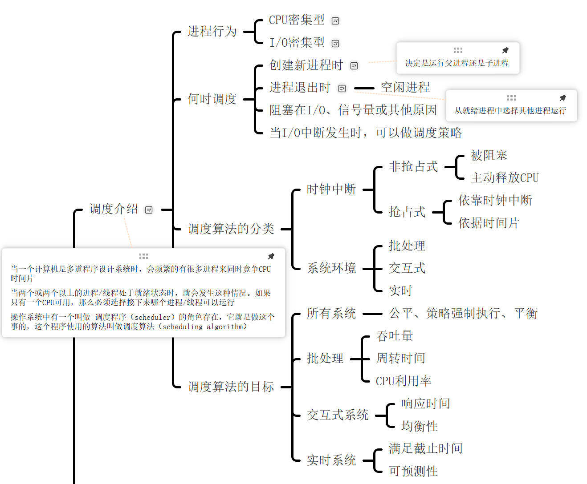
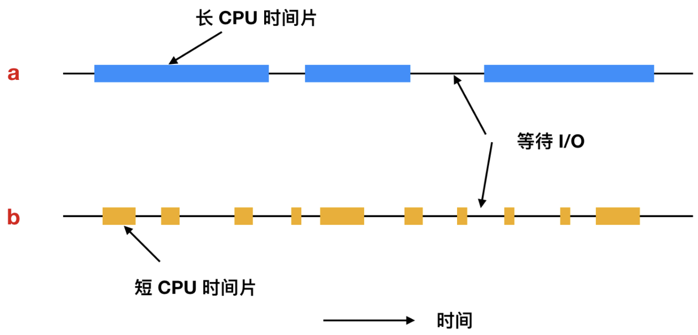
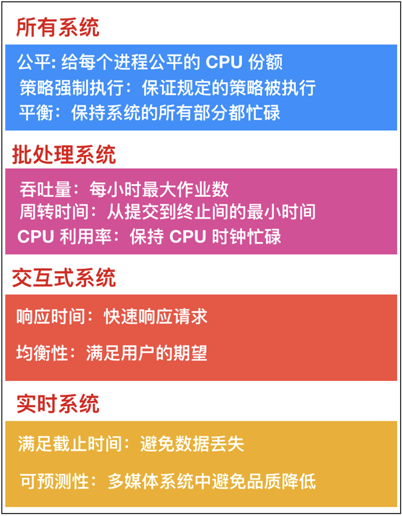
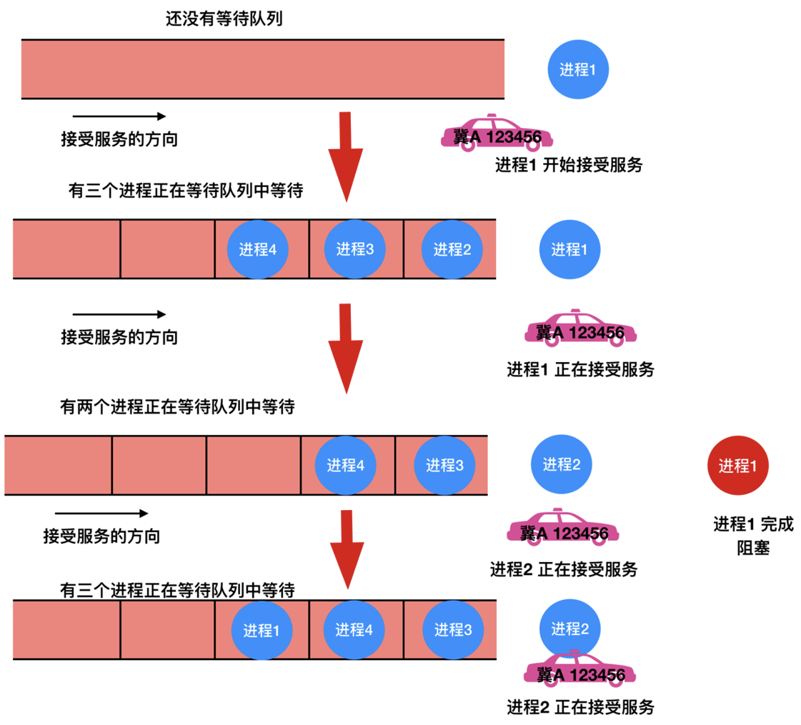
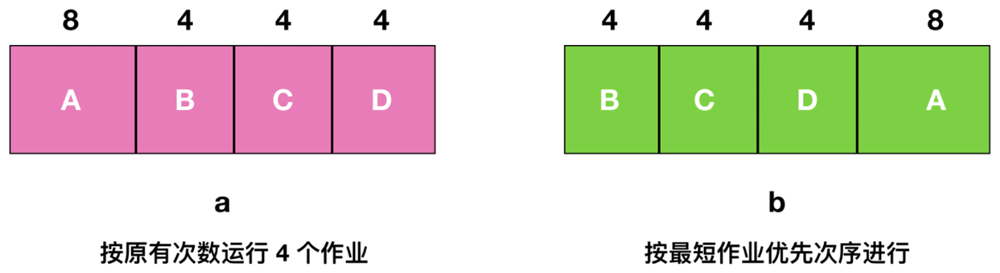
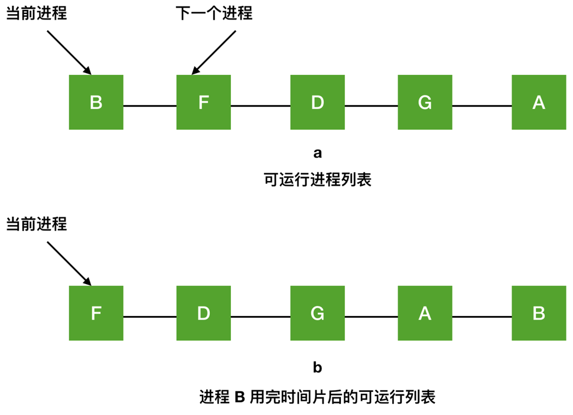
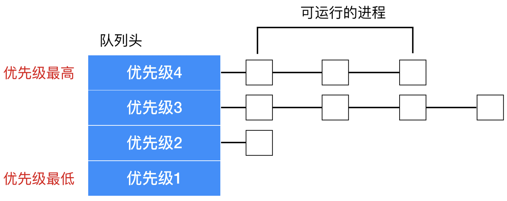
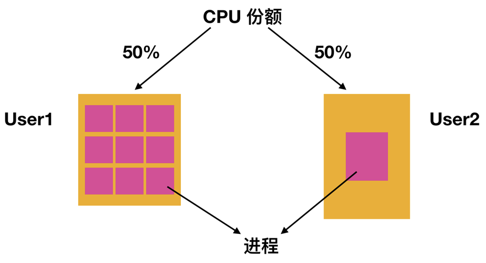

# 进程调度

| ##container## |
|:--:|
||

## 一、调度
<span style="margin-left: 30px;" />在多道程序设计系统中, 计算机环境高度并发, 众多进程或线程同时处于就绪状态, 竞相争夺CPU时间片的分配权。这种竞争尤其显著于单CPU系统, 其中调度程序(scheduler)扮演着至关重要的角色, 负责决定哪个就绪的进程或线程将获得CPU的执行权。这一决策过程所依赖的策略和方法, 即称为 **调度算法(scheduling algorithm)**。

<span style="margin-left: 30px;" />值得注意的是, 尽管进程调度与线程调度在细节上存在差异, 但二者在核心理念上多有共通之处。特别是在现代操作系统中, 当内核直接管理线程时, 调度活动往往以线程为基本单位进行, 较少或几乎不直接考虑线程所属的进程。这种设计提高了系统的灵活性和响应速度, 因为线程作为比进程更轻量级的执行实体, 能够更快速地在不同任务间切换。

### 1.1 调度介绍
<span style="margin-left: 30px;" />回溯至计算机发展的早期阶段, 当批处理系统以磁带上的穿孔卡片作为数据输入的主要方式时, 调度算法的设计相对直接且基础: 系统遵循 **“先来先服务”(FCFS, First-Come, First-Served)** 的原则, 逐一执行磁带上的作业。这种方法的实施简便, 但缺乏灵活性与效率优化。

<span style="margin-left: 30px;" />随着技术的进步, 多道程序设计系统的出现极大地提升了系统的并发处理能力, 同时也引入了更为复杂的调度挑战。在这样的系统中, 多个用户或任务可能同时请求CPU资源, 导致资源分配成为一项关键任务。部分大型机为了兼顾不同应用场景的需求, 创造性地融合了“批处理”与“分时服务”两种模式。在此情境下, 调度程序的角色变得尤为重要, 它需要智能地决策: 是优先处理批处理作业以高效利用非交互式计算资源, 还是响应终端用户的即时请求以提升用户体验。

<span style="margin-left: 30px;" />鉴于CPU资源的稀缺性与宝贵性, 设计高效的调度算法成为了提升系统整体性能与用户满意度的关键。一个优秀的调度算法不仅能够合理分配CPU时间, 减少等待时间, 还能通过优先级设置、作业分类、时间片轮转等多种策略, 平衡系统负载, 优化资源利用率, 从而在提升系统吞吐量的同时, 也保证了用户任务的及时响应与完成质量。例如, 采用优先级调度算法时, 系统可以根据作业的紧急程度或用户权限等因素, 动态调整作业的执行顺序, 确保重要或紧急任务得到优先处理。

### 1.2 进程行为
几乎所有的进程(磁盘或网络)I/O 请求和计算都是交替运行的:

| ##container## |
|:--:|
||
|CPU的使用和等待I/O交替出现|

<span style="margin-left: 30px;" />如上图所示, CPU 不停顿的运行一段时间, 然后发出一个系统调用等待 I/O 读写文件。完成系统调用后, CPU 又开始计算, 直到它需要读更多的数据或者写入更多的数据为止。当一个进程等待外部设备完成工作而被阻塞时, 才是 I/O 活动。

<span style="margin-left: 30px;" />上面 a 是 CPU 密集型进程; b 是 I/O 密集型进程进程, a 因为在计算的时间上花费时间更长, 因此称为`计算密集型(compute-bound)`或者`CPU 密集型(CPU-bound)`, b 因为I/O 发生频率比较快因此称为`I/O 密集型(I/O-bound)`。计算密集型进程有较长的 CPU 集中使用和较小频度的 I/O 等待。I/O 密集型进程有较短的 CPU 使用时间和较频繁的 I/O 等待。注意到上面两种进程的区分关键在于 CPU 的时间占用而不是 I/O 的时间占用。I/O 密集型的原因是因为它们没有在 I/O 之间花费更多的计算、而不是 I/O 请求时间特别长。无论数据到达后需要花费多少时间, 它们都需要花费相同的时间来发出读取磁盘块的硬件请求。

#### 1.2.1 CPU密集型
<span style="margin-left: 30px;" />`CPU密集型任务`, 亦称`计算密集型任务`, 主要特征是服务器的硬盘和内存等硬件性能相较于CPU而言显得非常优越, 或者说这些硬件资源的使用率显著低于CPU。在此类场景下, 系统执行CPU与I/O(如硬盘读写、内存访问)交互的操作时, 能够迅速完成, 几乎不产生因等待I/O操作完成而导致的阻塞时间。由于CPU持续面临大量的计算任务需要处理, 因此其负载长期处于高位。

<span style="margin-left: 30px;" />对于CPU密集型任务而言, 由于几乎不存在I/O阻塞, CPU几乎会保持全速运行状态。在单核CPU环境中, 开启多线程执行这类任务通常并不带来实质性的性能提升, 反而可能因为频繁的线程上下文切换而增加不必要的资源消耗, 导致整体效率下降。因此, 在单核CPU上运行CPU密集型任务时, 单线程执行往往是最优选择。

<span style="margin-left: 30px;" />然而, 在多核CPU环境下, 通过开启多线程可以充分利用CPU的多核并行处理能力, 从而显著提升CPU密集型任务的执行速度。这是因为多个线程可以同时在不同的CPU核心上运行, 避免了单核环境下的线程切换开销, 实现了真正的并行计算。

<span style="margin-left: 30px;" />在实际应用中, 当CPU使用率较高, 比如在进行算法模型训练或处理大规模数据集等CPU密集型任务时, 合理设置线程数对于优化性能至关重要。一般来说, 将线程数设置为与CPU核心数相等, 可以最大化地利用CPU资源, 同时避免过多的线程切换开销。对于单个CPU核心而言, 单线程执行仍然是效率最高的选择。例如, 在一个四核CPU上运行CPU密集型任务时, 设置四个线程通常能够获得最佳的性能表现。

> 一般其计算公式可遵循: $CPU密集型核心线程数 = CPU核数$。

#### 1.2.2 I/O密集型
<span style="margin-left: 30px;" />`I/O密集型任务`通常指的是服务器环境中, CPU的性能相对于硬盘、内存等I/O设备的性能来说更为优越, 或者CPU的使用率远低于这些I/O设备的利用率。在这种场景下, 系统运行时, CPU大部分时间处于等待状态, 等待I/O设备(如硬盘、内存)完成读写操作。因此, 尽管系统可能正在执行大量I/O操作, 但CPU的负载并不高。

<span style="margin-left: 30px;" />对于`I/O密集型`程序而言, 当它们接近性能极限时, CPU的占用率往往仍然保持在较低水平。这通常是因为程序本身包含大量的I/O操作, 而程序的逻辑设计未能充分利用CPU的计算能力, 导致CPU在等待I/O操作完成时存在大量的空闲时间。为了提升CPU的利用率, 一种常见的策略是开启比CPU核心数更多的线程。这样, 当一个线程因I/O操作而阻塞时, CPU可以切换到其他线程继续执行, 从而有效减少CPU的空闲时间, 提高资源利用率。

> 为了合理设置I/O密集型任务的线程数, 可以采用一种经验性的计算公式: $$I/O密集型核心线程数 = \frac{CPU核数}{1-阻塞系数}$$ 其中, 阻塞系数是一个介于0到1之间的值, 它反映了线程在执行过程中因I/O操作而阻塞的比例。

<span style="margin-left: 30px;" />在实际应用中, 阻塞系数通常取0.8到0.9之间, 但具体值需要根据实际情况进行调整。

> [!NOTE]
> 以双核CPU为例, 如果假设阻塞系数为 $0.9$, 那么根据上述公式计算得出的理想线程数约为 $20$ (即 $\frac{2}{1-0.9} = 20$ )。然而, 需要注意的是, 这个数值仅作为参考, 并非绝对。在实际应用中, 还需要根据具体的业务场景、系统负载以及硬件资源等因素进行灵活调整, 以达到最优的性能表现。

#### 1.2.3 小结

<span style="margin-left: 30px;" />在计算机任务执行策略中, `CPU密集型`与`I/O密集型`是两种基本分类, 它们对于并发执行策略的选择具有重要意义。在决定是采用多线程还是多进程时, 关键依据是任务的性质: 对于I/O密集型任务, 倾向于使用多线程; 而对于CPU密集型任务, 则更倾向于使用多进程。

> 对于I/O密集型任务, 增加线程数通常能够提升CPU的效率, 因为当一个线程等待I/O操作时, 其他线程可以利用CPU进行计算, 从而减少了CPU的空闲时间。然而, 这种提升并非无限制的, 线程数过多也可能导致线程切换的开销增加, 反而降低整体性能。

<span style="margin-left: 30px;" />随着CPU性能的不断提升, 特别是其速度远远超过硬盘等I/O设备的速度, 越来越多的应用倾向于成为I/O密集型。这意味着未来对于I/O密集型进程的调度和处理将变得更加重要。有效的调度策略应该能够确保I/O密集型进程及时获得执行机会, 从而保持磁盘等I/O设备的高效利用, 避免不必要的等待和空闲。例如, 通过优化I/O请求的顺序、使用异步I/O操作以及合理的线程池管理等手段, 可以显著提升I/O密集型任务的执行效率。

HX注:
- 就比如, 现在的高并发Web的底层大多是使用异步I/O, 如单线程的基于`io_uring`/`iocp`的`协程`的事件循环的异步I/O, 然后再对其多线程化, 通过os提供的端口复用, 让os来往消息队列中分发内容, 到事件循环中; 线程之间是独立的. (见: [HXNet](https://github.com/HengXin666/HXNet))

### 1.3 何时调度
关于调度决策的第一个核心问题是 **何时进行调度**。这一决策过程涵盖了多种需要调度处理的场景。

<span style="margin-left: 30px;" />首先, 当 **新进程被创建** 时, 系统面临一个关键的调度抉择: 是立即运行新创建的子进程, 还是继续执行其父进程。由于此时子进程和父进程都处于就绪状态, 这一调度决策具有一定的灵活性。调度程序可以根据系统策略、优先级或其他相关因素, 自主决定首先运行哪一个进程。例如, 如果子进程需要尽快执行以响应某些紧急事件, 那么调度程序可能会选择先运行子进程; 反之, 如果父进程正在进行关键任务, 保持其连续执行可能更为合适。

<span style="margin-left: 30px;" />其次, 当 **进程退出** 时, 系统同样需要进行调度决策。由于退出的进程将不再占用CPU资源, 系统必须选择一个处于就绪状态的进程来接替其执行。这是确保CPU资源持续利用、系统保持活跃状态的关键步骤。如果系统中没有其他就绪进程可供选择, 系统通常会启动一个 **空闲进程** 来运行。空闲进程的主要作用是消耗CPU时间, 防止CPU进入空闲状态(即所谓的“空转”), 从而保持系统的响应性和稳定性。例如, 在Unix或Linux系统中, `swapper`或`idle`进程就扮演着这样的角色, 它们在系统没有其他任务可执行时占用CPU时间。

#### 1.3.1 什么是空闲进程
空闲进程是操作系统中的一个特殊进程, 通常在系统没有其他进程需要执行时运行, 目的是让 CPU 处于空闲状态, 减少系统空转。它一般会占用最低的优先级, 等待其他任务的到来。

空闲进程(System Idle Process)是操作系统为了管理CPU空闲时间而虚拟出的特殊进程。在Windows操作系统中, 它是一个系统级的进程, 存在于每个处理器上, 主要作用是在系统没有其他任务需要执行时占用CPU时间, 防止CPU进入完全空闲状态, 从而有助于节省能耗和保持系统稳定。实际操作中, 空闲进程并不执行任何计算任务, 它仅仅表示CPU的空闲状态。

在任务管理器中, System Idle Process的CPU占用率反映了CPU当前未被其他进程占用的比例。例如, 若其占用率为90%, 则意味着只有10%的CPU时间被其他进程使用, 剩余时间CPU处于空闲状态。这一数值有助于用户了解系统负载, 进行优化或调整。

#### 1.3.2 为什么需要空闲进程
为什么要有空闲进程？银行的日常运营流程为我们提供了一个生动而贴切的例子, 用以理解操作系统中核心的进程管理与调度机制。当我们踏入银行大厅, 首先映入眼帘的便是井然有序的排队现象, 这实际上与操作系统中进程通过队列进行管理的原理不谋而合。

在银行系统中, 为了高效且公平地处理各项业务, 银行会根据客户的不同需求和重要性设定优先级。大多数情况下, 客户以普通身份排队等候服务, 遵循先到先服务的原则。然而, 对于那些在该银行拥有高额存款的VIP客户, 银行会给予他们特别的待遇, 即更高的服务优先级。这意味着VIP客户在办理业务时能够跳过普通队列, 直接获得优先处理, 体现了优先级机制在实际应用中的灵活性和高效性。

类似地, 在操作系统层面, 进程的管理与调度也遵循着类似的优先级原则。操作系统会评估每个进程的紧迫性和重要性, 并据此为它们分配不同的优先级。这些进程随后会被放入到与它们优先级相对应的队列中, 等待调度器的调度执行。调度器则负责根据一定的策略(如优先级调度、轮转调度等), 从队列中选取合适的进程执行, 以确保系统资源的有效分配和进程的合理运行。

通过银行VIP服务的例子, 我们可以更加直观地理解操作系统中进程管理与调度的核心思想: 即通过对进程进行分类、设定优先级, 并利用队列机制进行有序管理, 从而实现系统资源的高效利用和进程的公平执行。

实际上操作系统是用队列来管理进程的。在操作系统的设计中, 进程管理是一个至关重要的环节, 而队列则是实现进程有序调度的核心机制。当队列为空时, 意味着当前没有进程需要CPU执行, 这时CPU将处于空闲状态。为了优化这种情况下的系统资源利用, 内核设计者需要采取特定策略。

尽管编写内核代码时, 使用if语句进行异常处理是一种常见的做法, 但过多的条件判断可能会使代码结构变得复杂且难以维护。因此, 一个更为优雅的设计目标是减少或消除不必要的异常处理, 特别是在进程调度这一关键领域。

为实现这一目标, 内核设计者巧妙地引入了一个称为“空闲任务”的特殊进程。这个进程在Windows系统中表现为“系统空闲进程”, 而在Linux系统中则对应于第0号进程(通常是idle或swapper进程)。空闲任务的设计初衷是确保在任何时候, 调度器都能从队列中找到一个可运行的进程, 从而避免CPU空闲。

具体而言, 当系统中所有其他进程都因等待I/O操作、被阻塞或完成执行而处于不可运行状态时, 调度器就会从队列中取出空闲进程来运行。这个空闲进程的主要作用是消耗CPU时间, 防止CPU进入空闲状态, 同时不执行任何实际的有用工作。因此, 空闲进程被设计为永远处于就绪状态, 并且其优先级被设置为最低, 以确保在有其他进程需要执行时, 它们能够优先获得CPU资源。

通过这样的设计, 操作系统能够在没有实际进程需要运行时, 仍然保持CPU的活跃状态, 同时避免了因频繁的状态切换和异常处理而导致的性能开销。这不仅提高了系统的整体效率, 也体现了内核设计者在处理复杂系统问题时的智慧和创造力。

第三种情况是, 当进程因等待I/O操作完成、获取信号量失败或其他阻塞原因而暂停执行时, 操作系统必须能够识别出这些处于阻塞状态的进程, 并适时地选择另一个就绪状态的进程来运行, 以确保CPU资源的有效利用。值得注意的是, 尽管某些阻塞原因(如进程间的依赖关系)在理论上可能影响调度决策的制定, 但实际操作系统的调度程序往往并不直接对这些复杂的依赖关系进行考量。

假设有两个进程A和B, 其中A是一个关键业务进程, 它需要访问由B进程当前占用的某个关键资源。如果A因为等待B退出关键区域而被阻塞, 那么理论上最优的调度策略可能是优先调度B, 使其尽快释放资源并让A得以执行。然而, 在实际操作中, 由于调度器通常只关注进程的当前状态和优先级, 而不会深入分析进程间的依赖关系, 因此它可能不会特别为这种情况做出优化。

第四点, I/O中断是操作系统中一种重要的事件, 它标志着I/O设备已完成某项操作并需要CPU的进一步处理。当I/O中断发生时, 操作系统会暂停当前运行的进程(如果它正在运行), 并转向中断处理程序。中断处理程序会检查中断的来源和类型, 如果中断来自一个已完成工作的I/O设备, 那么操作系统会检查是否有进程正在等待该I/O操作的完成。

如果有进程等待, 那么这些进程将被置于就绪状态, 准备继续执行它们之前因等待I/O而被阻塞的部分。接下来, 调度程序将决定是立即运行这些新就绪的进程之一, 还是继续执行之前被中断的进程(如果适用), 或者选择其他更高优先级的就绪进程来运行。设想一个场景, 其中进程X正在执行, 并等待来自硬盘的某个文件数据。当硬盘完成数据读取并发出I/O中断时, 操作系统会响应这个中断, 将进程X置于就绪状态(如果它之前因等待I/O而被阻塞), 然后调度程序会评估所有就绪进程的优先级, 并可能选择进程X(如果它的优先级足够高)或其他更紧急的进程来继续执行。

在操作系统的进程调度领域中, 硬件时钟提供的周期性中断(如50Hz、60Hz或其他频率)是触发调度决策的关键因素。基于这些时钟中断, 调度决策可以在每个中断发生时进行, 或者仅在每第k个中断时进行, 其中k是一个正整数。根据操作系统如何响应这些时钟中断以执行调度操作, 根据调度算法如何响应这些时钟中断, 我们可以将调度算法明确区分为两大类: `非抢占式(non-preemptive)调度算法`和`抢占式调度算法`。

非抢占式调度算法选择一个进程执行后, 将允许该进程持续运行, 直至其自愿放弃CPU。这通常发生在进程需要等待I/O操作完成、等待某个事件或资源、或是正常执行完毕后释放CPU。即使该进程已经运行了很长时间(如数小时), 只要它保持可运行状态且没有其他更高优先级的进程就绪, 调度器就不会介入并强制挂起它。因此, 在时钟中断发生时, 如果当前进程并未进入阻塞状态或未主动放弃CPU, 调度器将不会进行调度, 而是继续让当前进程执行。直到中断处理完毕, 并且系统确认没有更高优先级的进程等待执行时, 当前进程才会继续其运行。

假设有一个非抢占式调度的系统, 其中进程A正在执行。每当时钟中断发生时(假设频率为50Hz), 系统都会检查是否有新的或更高优先级的进程需要执行。但由于A并未进入阻塞状态, 且没有其他更高优先级的进程就绪, A将继续执行, 直到它完成当前任务或自愿放弃CPU。

与非抢占式不同, 抢占式调度算法会限制每个进程运行的最大时间量(称为时间片或时间量)。如果一个进程在其时间片结束时仍未完成执行, 则调度器将强制挂起该进程, 并选择一个就绪状态的进程来继续执行。这种抢占式行为需要在时间片结束时依靠时钟中断来实现, 以确保CPU的控制权能够按时交还给调度程序。因此, 抢占式调度算法要求系统具备可靠的时钟机制。

在抢占式调度的系统中, 每个进程被分配了一个固定大小的时间片, 比如10毫秒。当进程B在时间片结束时仍未完成其任务时, 硬件时钟的中断将触发调度程序介入。调度程序将挂起进程B, 并检查是否有其他就绪的进程(如进程C)可以执行。如果有, 进程C将被选中并开始执行; 如果没有, 则可能选择继续执行某个低优先级的后台任务或空闲进程。

如果没有可用的时钟来触发中断, 那么抢占式调度算法将无法实现, 此时非抢占式调度算法就成为了唯一可行的选择。

### 1.4 调度算法的分类

毫无疑问, 不同的环境下需要不同的调度算法。之所以出现这种情况, 是因为不同的应用程序和不同的操作系统有不同的目标。也就是说, 在不同的系统中, 调度程序的优化也是不同的。这里有必要划分出三种环境:

1. **批处理(Batch)**  
   批处理系统通常用于处理大量数据, 任务之间没有紧密的交互或时效要求, 主要目标是高吞吐量和效率。在这种环境下, 调度算法更关注如何快速有效地处理大量的作业。常见的调度算法有: 
   - **先来先服务(FCFS)**: 简单易实现, 但可能导致“长任务饿死短任务”(即队列中的长任务会占用大量CPU资源, 影响短任务的执行)。
   - **最短作业优先(SJF)**: 通过先执行运行时间较短的作业来提升系统的吞吐量, 但需要预知作业的执行时间, 且可能导致长作业一直得不到执行(即“饥饿”问题)。

2. **交互式(Interactive)**  
   交互式系统注重用户体验, 系统响应时间至关重要。此类系统中, 进程常常在等待用户输入和提供即时反馈, 因此, 调度算法的优化目标是减少响应时间, 提升交互流畅性。常见的调度算法有: 
   - **轮转调度(Round Robin, RR)**: 每个进程轮流执行一个时间片, 确保系统中各进程能公平地获得CPU时间, 提高了响应速度。适合交互式应用, 但可能导致上下文切换过多的性能损耗。
   - **多级反馈队列(Multi-Level Feedback Queue, MLQ)**: 根据进程的行为(例如, I/O密集型或CPU密集型), 动态调整进程的优先级, 从而优化响应时间和CPU利用率。

3. **实时(Real time)**  
   实时系统要求进程在严格的时间限制内完成任务, 保证时间上的确定性和可靠性。这类系统的调度算法通常需要处理进程的时间约束, 并确保高优先级的进程能及时执行。常见的实时调度算法有: 
   - **固定优先级调度(例如, Rate Monotonic Scheduling, RMS)**: 根据进程的周期和频率分配固定优先级, 优先级高的任务先执行, 适用于周期性任务。
   - **最早截止时间优先(EDF)**: 任务的截止时间越早, 优先级越高, 适用于需要在特定时间内完成的任务。

不同的调度算法有不同的设计目标和适用场景, 操作系统的调度策略需要根据应用环境的需求进行合理选择和调整。

### 1.5 调度算法的目标

| ##container## |
|:--:|
||

## 二、批处理中的调度
现在让我们把目光从一般性的调度转换为特定的调度算法。下面我们会探讨在批处理中的调度。

### 2.1 先来先服务
非抢占式调度算法中, 最为直观且基础的一种设计便是先来先服务(First-Come, First-Served, FCFS)调度策略。该算法严格遵循请求到达的顺序来为进程分配CPU资源。其工作机制可以概述如下:

- 系统维护一个就绪进程的等待队列, 该队列按照进程到达系统的先后顺序进行排序。当第一个任务(我们称之为进程A)从外部进入系统时, 它会被立即启动并允许持续运行, 直至其主动放弃CPU(如完成执行、进入等待状态或阻塞状态)为止, 期间不会被其他进程中断。

- 随着后续任务的陆续到达, 它们会按照到达的先后顺序被添加到就绪队列的尾部。这意味着, 如果进程B在进程A之后到达系统, 那么无论进程B的执行需求多么紧迫或执行时间多么短暂, 它都必须等待进程A完成其当前执行周期后才能获得CPU资源。

- 当正在运行的进程(如进程A)因为某种原因(如等待I/O操作完成)而进入阻塞状态时, 系统会检查就绪队列, 并启动队列中的第一个进程(此时为进程B, 假设它是队列中唯一的等待进程)继续执行。若此时有多个进程处于就绪状态, 则只有队列头部的进程会被选中执行。

- 当一个原本处于阻塞状态的进程(如进程A)重新变为就绪态时, 它并不会被优先处理或插入到队列的特定位置。相反, 它会像新到达的任务一样, 被添加到就绪队列的末尾, 即排在所有当前已就绪进程之后。这种处理方式确保了所有进程都能按照它们到达系统的先后顺序公平地竞争CPU资源。

| ##container## |
|:--:|
||

该算法之所以广受青睐, 主要归功于其卓越的简洁性与直观性, 在编程实现上尤为便捷。其核心机制是通过一个单链表来维护所有处于就绪状态的进程队列。在这种设计中, 选取进程执行仅需简单地从队列头部移除一个进程即可, 实现了先进先出的处理逻辑; 同样地, 向系统提交新作业或将进程置于阻塞状态后重新就绪, 也仅需将该作业或进程添加到队列的尾部, 确保了所有进程均能以一致的规则等待执行。这种实现方式不仅代码简洁, 而且易于理解与维护。

然而, 尽管先来先服务(FCFS, First-Come, First-Served)算法具有上述优点, 但其缺陷也同样明显, 主要体现在缺乏优先级支持上。以特定场景为例, 若系统当前正处理着大量I/O密集型进程(假设已有100个), 而此时加入了一个至关重要的CPU密集型进程作为第101个等待者, 按照FCFS算法, 该CPU密集型进程将不得不等待所有前面的I/O进程完成执行后才能获得CPU资源, 这在很多实际应用中是不可接受的。因为CPU密集型进程通常对响应时间有更高要求, 长时间等待可能导致系统整体性能下降或关键任务延误。

为了解决这一问题, 就需要引入优先级调度或抢占式调度机制。优先级调度允许系统根据预设的优先级规则来优先处理更重要的进程, 而抢占式调度则允许高优先级或新到达的紧急进程中断当前正在执行的低优先级进程, 从而确保关键任务能够及时获得处理。这两种策略的出现, 极大地提升了操作系统的灵活性和响应能力, 使其能够更好地适应复杂多变的运行环境。

### 2.2 最短作业优先
在批处理系统中, 除了基本的先来先服务(FCFS)调度算法外, 另一种广泛采用的调度策略是 **最短作业优先(Shortest Job First, SJF)** 算法。该算法的核心思想在于优先执行预计运行时间最短的作业, 以提高系统的吞吐量和减少平均等待时间。值得注意的是, ***SJF算法的有效实施依赖于对作业运行时间的准确预估或已知条件***。

> 以一家保险公司为例, 其日常运营中涉及大量重复性的工作, 如处理保险索赔。由于这类工作的性质相对稳定且流程化, 保险公司能够基于历史数据和经验, 相当精确地预测处理一批(如1000个)索赔所需的总时间。然而, 在实际操作中, 每个索赔的具体处理时间可能因多种因素(如索赔复杂度、所需审核层级等)而有所不同。但在此场景下, 我们假设保险公司已经具备了对单个索赔处理时间的合理估计能力。
>
> 当保险公司的批处理系统接收到多个同等重要的索赔作业, 并准备启动处理流程时, 调度程序会采用最短作业优先算法进行决策。具体而言, 调度程序会首先分析每个索赔作业的预计处理时间, 并据此对所有待处理作业进行排序, 优先选择那些预计处理时间最短的作业进行执行。通过这种方式, 系统能够更有效地利用CPU资源, 减少平均等待时间, 并可能在一定程度上提高客户满意度, 因为客户能够更快地获得索赔处理结果。

虽然SJF算法在理论上具有诸多优点, 但在实际应用中也存在一些挑战, 如作业运行时间的准确预测、作业到达顺序的随机性以及对短作业可能导致的“饥饿”现象(即长作业因不断被短作业抢占而长时间得不到执行)的考虑等。因此, 在实际部署时, 需要根据具体的应用场景和需求进行权衡和调整。

| ##container## |
|:--:|
||

如图a所示, 我们面临四个作业A、B、C、D, 它们的运行时间分别为8分钟、4分钟、4分钟和4分钟。若按照图示的先后顺序执行, 则每个作业的周转时间(即从作业提交到作业完成的时间)分别为: A的周转时间为8分钟, B为12分钟(等待A完成的时间加上B自身的运行时间), C为16分钟, D为20分钟。计算得出的平均周转时间为 $\frac{8+12+16+20}{4} = 14$ 分钟。

接下来, 我们考虑采用最短作业优先(SJF)算法来调度这四个作业, 如图b所示。在这种调度策略下, 作业按照其运行时间的短长顺序执行, 即首先执行运行时间最短的作业。因此, 作业B、C、D将先于作业A执行, 它们的周转时间分别为4分钟、8分钟和12分钟(考虑到前面的作业已占用时间), 而作业A则在最后执行, 周转时间为所有前面作业运行时间之和加上A自身的运行时间, 即20分钟。此时, 平均周转时间计算为 $\frac{4+8+12+20}{4} = 11$ 分钟。

> [!NOTE]
> 为了证明SJF算法在这种情境下的优越性, 我们可以进一步分析。对于任意四个作业, 其运行时间分别设为 $a、b、c、d$ (且不失一般性, 假设 $a ≤ b ≤ c ≤ d$ ), 根据SJF算法, 它们的执行顺序将是 $a、b、c、d$。此时, 各作业的周转时间分别为 $a、a+b、a+b+c、a+b+c+d$, 而平均周转时间则为 $\frac{4a + 3b + 2c + d}{4}$。从该表达式可以看出, 最短作业 $a$ 对平均周转时间的影响最大, 因为它被首先执行, 且其运行时间完全计入所有作业的周转时间中。因此, 优先执行短作业能够有效减少后续作业的等待时间, 从而降低平均周转时间。

> 在理想情况下, 如果所有进程都能立即开始执行且不受任何外部干扰, 那么SJF算法通过优先执行运行时间最短的进程, 能够最小化所有进程的等待时间和平均周转时间。这是因为短进程的快速完成能够释放出CPU资源, 使得后续的长进程能够尽早开始执行, 从而减少了整体的等待成本。
> 
> 然而, 在实际操作系统中, 进程的执行往往受到多种因素的影响, 包括但不限于I/O操作、内存访问延迟、资源竞争以及优先级调度等。当这些因素存在时, SJF算法的最优性可能会受到挑战。例如, 如果一个短进程需要等待长时间的I/O操作完成, 那么它可能会占用CPU队列中的位置, 导致更长的进程等待不必要的时间。

### 2.3 最短剩余时间优先
最短作业优先(SJF)算法的一个变体, 旨在通过动态调整执行顺序以进一步优化系统性能, 被称为 **最短剩余时间优先(Shortest Remaining Time Next, SRTN)** 算法。这一抢占式调度策略的核心思想是, 调度程序始终监视并优先执行当前剩余运行时间最短的进程。

在SRTN算法的执行过程中, 每当系统接收到一个新作业或当前运行进程的状态发生变化(如执行了部分任务)时, 调度程序都会重新评估所有就绪进程(包括新到达的作业和正在运行的但尚未完成的进程)的剩余运行时间。如果新到达的作业的预计剩余运行时间比当前正在CPU上运行的任何进程的剩余运行时间都要短, 那么调度程序会立即中断当前进程的执行, 将其状态标记为挂起(或等待), 并转而运行这个新的、剩余时间更短的进程。

通过这种方式, SRTN算法能够确保那些预计很快能够完成的短期作业得到优先处理, 从而减少了它们的等待时间和周转时间。这对于提升系统整体的响应能力和吞吐量至关重要, 特别是在处理大量短作业和少量长作业混合的场景中效果尤为显著。

> 例如, 假设系统中有三个作业A、B、C, 它们的总运行时间分别为10分钟、2分钟和8分钟。
>
> - 如果系统首先运行作业A, 但在A执行了5分钟后, 作业B到达。
>
> - 此时, 根据SRTN算法, 系统会比较B的剩余时间(假设为整个2分钟, 因为B刚到达还未开始执行)与A的剩余时间(5分钟)。
>
> - 由于B的剩余时间更短, 系统会暂停A的执行, 转而运行B。当B完成后, 如果C此时也处于就绪状态, 系统则会再次比较C(剩余8分钟)和A(剩余5分钟)的剩余时间, 选择A继续执行, 直至完成。
>
> 这样的调度顺序能够最大化地减少每个作业的等待时间, 从而提高系统的整体效率。

可能的`伪代码`实现:
```C++
小根堆<time_t> pq;

while (1) {
    auto x = pq.top(); // 取[运行时间最短的进程]
    pq.pop();
    x.run();
    pq.push(x);

    // 其他地方也可能会 pq.push()
}
```

## 三、交互式系统中的调度
交互式系统中在个人计算机、服务器和其他系统中都是很常用的, 所以有必要来探讨一下交互式调度。

### 3.1 轮询调度
轮询算法(Round-Robin), 作为一种古老而经典的调度策略, 以其简单性、公平性和广泛的应用性而著称。该算法的核心机制在于**为每个进程分配一个固定的时间段**, 这一时间段被称为`时间片(Quantum)`。时间片的长度是轮询算法中一个关键的参数, 它决定了进程能够连续执行的最长时间。

在轮询算法的执行过程中, CPU按照固定的顺序轮流为每个进程分配时间片。如果某个进程在其分配的时间片内完成了其任务或因为某种原因(如等待I/O操作)而进入阻塞状态, 那么CPU将立即被释放并转交给下一个进程。然而, 如果进程在时间片结束时仍未完成其执行且仍处于就绪状态, 那么该进程将被**抢占**, CPU将被分配给轮询队列中的下一个进程。这种抢占机制确保了每个进程都能获得公平的CPU访问机会, 同时也避免了任何单个进程长时间独占CPU资源的情况。

轮询算法的实现相对简单, 它不需要复杂的预测或优先级判断机制。因此, 在许多操作系统和实时系统中, 轮询算法都被用作一种基本的调度策略。例如, 在早期的分时操作系统中, 轮询算法被广泛用于实现多个用户之间的公平CPU共享。此外, 在一些嵌入式系统和实时控制系统中, 轮询算法也被用于管理多个并发任务, 以确保每个任务都能得到及时的处理。

调度程序所做的就是维护一个可运行进程的列表, 就像下图中的 $a$, 当一个进程用完时间片后就被移到队列的末尾, 就像下图的 $b$。<sup>[双向循环链表]</sup>

| ##container## |
|:--:|
||

时间片轮询调度算法中的时间片长度直接影响系统的响应时间和CPU利用率。进程间切换(上下文切换)会消耗CPU资源, 如保存寄存器状态、更新进程控制块等操作。切换时间为1ms时, 不同时间片长度的影响如下: 

1. **时间片过短**:   
   若时间片为4ms, 1ms的切换时间占用20%(1ms/5ms), 导致大量时间用于管理开销, CPU利用率低。

2. **时间片过长**:   
   将时间片延长至100ms, 切换占用降低至1%(1ms/101ms), CPU利用率提高, 但会带来: 
   - **响应时间过长**: 短时间内大量进程加入时, 队列末尾进程需等待较长时间。例如, 50个进程到达后, 最后一个可能需等待约5秒, 不适用于即时响应系统。
   - **资源分配不均**: 短作业需等待较长时间, 降低效率。

3. **时间片长度的权衡**:   
   - 过短的时间片频繁触发上下文切换, 降低CPU有效利用率。  
   - 过长的时间片则可能延长短作业的等待时间, 降低系统响应性。

**优化策略**: 时间片应足够长以减少切换频率, 同时考虑短作业的及时处理。经验表明, 20到50毫秒的时间片能较好平衡CPU效率与响应性, 提升系统整体性能。

### 3.2 优先级调度
轮询调度假设了所有的进程是同等重要的。但事实情况可能不是这样。例如, 在一所大学中的等级制度, 首先是院长, 然后是教授、秘书、后勤人员, 最后是学生。这种将外部情况考虑在内就实现了`优先级调度(priority scheduling)`。

优先级调度算法的基本思想在于, 通过为系统中的每个进程分配一个优先级, 来决定它们被CPU执行的顺序。这一策略的核心在于, 高优先级的进程相较于低优先级的进程会优先获得CPU资源。

然而, 为了确保系统资源的公平分配和防止某个高优先级进程无限期地占用CPU, 调度程序采取了相应的策略来平衡这种优先权。具体来说, 每当发生时钟中断时(这是系统定期检查并响应各种事件的机制), 调度程序会检查当前运行进程的优先级, 并可能根据一定的规则(如固定步长减少)来降低其优先级。如果这一操作导致当前进程的优先级降至其他更高优先级进程之下, 那么将触发进程切换, 即CPU控制权将转移给下一个最高优先级的就绪进程。

此外, 另一种常用的策略是为每个进程设置一个允许运行的最大时间间隔(也称为时间片)。一旦某个进程的运行时间达到了其分配的时间间隔, 无论其优先级如何, 都将被暂停执行, 并允许下一个高优先级的进程获得CPU资源。这种机制有助于防止高优先级进程长时间独占CPU, 从而保证了系统资源的合理分配。

关于优先级的分配方式, 可以是静态的也可以是动态的。静态分配优先级意味着在进程创建时就确定了其优先级, 且在运行过程中不会改变(除非通过特定操作如管理员手动调整)。例如, 在军用计算机系统中, 可以根据军官的军衔来静态分配进程优先级, 如将军启动的进程被赋予最高优先级100, 上校为90, 依此类推。而动态分配优先级则允许系统根据进程的实时状态和需求动态地调整其优先级, 以更灵活地应对系统负载和进程需求的变化。

> [!TIP]
> 在UNIX等操作系统中, 提供了如`nice`命令这样的工具, 允许用户自愿降低自己进程的优先级。虽然这一功能设计初衷是为了鼓励用户间的资源共享和礼让, 但在实际使用中, 由于其降低优先级的效果可能并不显著, 且用户往往更关心自己进程的执行效率, 因此`nice`命令的使用并不普遍。

---

优先级调度机制不仅支持静态分配, 还能由系统 **动态调整**, 以适应不同的运行需求和优化目标。以I/O密集型进程为例, 这类进程在执行过程中大部分时间处于等待I/O操作完成的状态, 而非实际占用CPU执行计算。为了提升系统整体效率和资源利用率, 当这类进程需要CPU资源以发起新的I/O请求时, 应迅速为其分配CPU时间, 从而允许CPU在I/O操作等待期间执行其他计算密集型任务。

一种有效的策略是动态调整I/O密集型进程的优先级, 具体方法可以采用“反比优先级”算法。该算法基于进程在前一时间片内实际使用CPU时间的比例来设定其优先级, 优先级设为
 $\frac{1}{f}$, 其中 $f$ 是该进程在 **前一时间片内所占用的CPU时间比例**。

- 例如, 若一个时间片长度为50ms, 某进程仅使用了1ms, 则其优先级将被设定为50; 而另一个进程在阻塞前使用了25ms, 则其优先级为2; 若进程完全使用了整个时间片, 则其优先级则为1。

这种设置方式确保了那些大部分时间处于等待状态的I/O密集型进程在需要时能够获得较高的优先级, 从而减少了它们因长时间等待CPU而导致的内存占用浪费。

---

为了进一步优化系统调度, 可以将进程按照优先级划分为不同的类别, 并在类别之间采用优先级调度策略。而在每个类别内部, 则可以采用轮转调度算法来公平地分配CPU时间给各个进程。这种混合调度策略既保证了高优先级进程能够优先获得服务, 又确保了同一优先级下的进程能够公平地共享CPU资源, 从而实现了系统资源的有效管理和高效利用。

下面展示了一个四个优先级类的系统

| ##container## |
|:--:|
||

它的调度算法主要描述如下: 
- 上面存在优先级为 4 类的可运行进程, 首先会按照轮转法为每个进程运行一个时间片, 此时不理会较低优先级的进程。
- 若第 4 类进程为空, 则按照轮询的方式运行第三类进程。
- 若第 4 类和第 3 类进程都为空, 则按照轮转法运行第 2 类进程。
- 如果不对优先级进行调整, 则低优先级的进程很容易产生饥饿现象。

### 3.3 多级队列

该算法将系统中的进程就绪队列从一个拆分为若干个, 将不同类型或性质的进程固定分配在不同的就绪队列, 不同的就绪队列采用不同的调度算法, 一个就绪队列中的进程可以设置不同的优先级, 不同的就绪队列本身也可以设置不同的优先级。多级队列调度算法由于设置多个就绪队列, 因此对每个就绪队列就可以实施不同的调度算法, 因此, 系统针对不同用户进程的需求, 很容易提供多种调度策略。

1. **多级队列调度的基本机制**: 
   - 系统根据进程的特点或优先级, 将其划分到不同的队列中。
   - 每个队列可以采用不同的调度算法(例如, 时间片轮转、先来先服务、优先级调度等)。
   - 一般情况下, 高优先级队列的任务会优先调度, 只有当高优先级队列空闲时, 才会调度低优先级队列中的任务。

2. **多级反馈队列(MLFQ)**: 
   - **进入最高优先级队列**: 进程最初通常会进入最高优先级队列。
   - **时间片耗尽后降级**: 若进程未在时间片内完成工作, 则被移动到更低优先级的队列。 (有的为了防止部分"病毒"程序, 是分配一个`份额`给各个程序, 如果花完了, 就换队列)
   - **未耗尽时间片时保留优先级**: 若进程在时间片内完成任务, 可能会留在当前队列或提升优先级(具体视算法而定)。
   - **不同队列的调度算法**: 不同级别队列的调度算法可以不同, 例如高优先级队列使用时间片轮转以保证快速响应, 低优先级队列使用先来先服务(FCFS)以减少切换开销。

3. **特点**: 
   - **响应性**: 短作业和高优先级任务可以快速完成, 因为它们首先被调度。
   - **公平性**: 长作业逐渐“下沉”到低优先级队列, 但仍会被低优先级队列中的调度算法适时处理。

4. **优缺点**: 
   - **优点**: 兼顾响应时间和系统吞吐量, 适合多种类型任务的混合环境。
   - **缺点**: 长作业可能会遭受“饥饿”, 为此需要引入优先级提升机制以避免进程长期得不到调度。

总结: 多级队列调度通过分级和降级机制实现对不同任务的高效管理, 并且不同队列可以采用适配的调度策略, 从而实现响应时间与系统效率的平衡。

### 3.4 最短进程优先
对于批处理系统而言, 由于最短作业优先常常伴随着最短响应时间, 所以如果能够把它用于交互式进程, 那将是非常好的。在某种程度上, 的确可以做到这一点。交互式进程通常遵循下列模式: 等待命令、执行命令、等待命令、执行命令。。。如果我们把每个命令的执行都看作一个分离的作业, 那么我们可以通过首先运行最短的作业来使响应时间最短。这里唯一的问题是如何从当前可运行进程中找出最短的那一个进程。

一种方式是根据进程过去的行为进行推测, 并执行估计运行时间最短的那一个。假设每个终端上每条命令的预估运行时间为 $T_0$, 现在假设测量到其下一次运行时间为 $T_1$, 可以用两个值的加权来改进估计时间, 即 $aT_0+ (1 - a)T_1$。通过选择 a 的值, 可以决定是尽快忘掉老的运行时间, 还是在一段长时间内始终记住它们。当 $a = \frac{1}{2}$ 时, 可以得到下面这个序列: $$T_0, \frac{T_0}{2} + \frac{T_1}{2}, \frac{T_0}{4} + \frac{T_1}{4} + \frac{T_2}{2}, \frac{T_0}{8} + \frac{T_1}{8} + \frac{T_2}{4} + \frac{T_3}{2}$$ 可以看到, 在三轮过后, T0 在新的估计值中所占比重下降至 $\frac{1}{8}$。

有时把这种通过当前测量值和先前估计值进行加权平均从而得到下一个估计值的技术称作 `老化(aging)`。这种方法会使用很多预测值基于当前值的情况。

### 3.5 保证调度
一种完全不同的调度方法是对用户做出明确的性能保证。一种实际而且容易实现的保证是: 若用户工作时有 $n$ 个用户登录, 则每个用户将获得 CPU 处理能力的 $\frac{1}{n}$。类似地, 在一个有 $n$ 个进程运行的单用户系统中, 若所有的进程都等价, 则每个进程将获得 $\frac{1}{n}$ 的 CPU 时间。

### 3.6 彩票调度
彩票调度(Lottery Scheduling) 是一种概率性调度算法, 通过为每个任务分配不同数量的彩票票数, 以随机抽签的方式决定哪个任务获得CPU资源。

(说白了, 就是給每个程序分配权重, 然后按照随机数来决定调度, 从数学期望上来说, 至少是不会出现"饥饿"的, 但是...)

### 3.7 公平分享调度
到目前为止, 我们假设被调度的都是各个进程自身, 而不用考虑该进程的拥有者是谁。结果是, 如果用户 1 启动了 9 个进程, 而用户 2 启动了一个进程, 使用轮转或相同优先级调度算法, 那么用户 1 将得到 90 % 的 CPU 时间, 而用户 2 将之得到 10 % 的 CPU 时间。

为了阻止这种情况的出现, 一些系统在调度前会把进程的拥有者考虑在内。在这种模型下, 每个用户都会分配一些CPU 时间, 而调度程序会选择进程并强制执行。因此如果两个用户每个都会有 50% 的 CPU 时间片保证, 那么无论一个用户有多少个进程, 都将获得相同的 CPU 份额。

| ##container## |
|:--:|
||

区别: 
|**方面**|**公平分享调度**|**保证调度**|
|:-:|-|-|
|**目标**|追求资源分配的公平性|提供确定的性能保证|
|**灵活性**|通常较为灵活, 允许一定的资源竞争|通常较为严格, 确保每个用户/进程的保障份额|
|**实现方式**|常用比例分配机制, 如轮转调度|需要明确的性能承诺或实时调度机制|
|**适用场景**|多用户共享资源、无严格性能需求的场景|需要特定用户或进程达到某种性能指标的场景|

- 结论

    尽管两者的分配机制在某些情况下可能类似(比如同样是每个用户获得 $\frac{1}{n}$ 的 CPU 时间), 但**公平分享调度**关注的是公平性, 而**保证调度**关注的是性能承诺。因此, 它们并不是完全相同的调度方法。

## 四、实时系统中的调度
`实时系统(real-time)`是一个时间扮演了重要作用的系统。典型的, 一种或多种外部物理设备发给计算机一个服务请求, 而计算机必须在一个确定的时间范围内恰当的做出反应。例如, 在 CD 播放器中的计算机会获得从驱动器过来的位流, 然后必须在非常短的时间内将位流转换为音乐播放出来。如果计算时间过长, 那么音乐就会听起来有异常。再比如说医院特别护理部门的病人监护装置、飞机中的自动驾驶系统、列车中的烟雾警告装置等, 在这些例子中, 正确但是却缓慢的响应要比没有响应甚至还糟糕。

实时系统可以分为两类, `硬实时(hard real time)`和`软实时(soft real time)`系统, 前者意味着必须要满足绝对的截止时间; 后者的含义是虽然不希望偶尔错失截止时间, 但是可以容忍。在这两种情形中, 实时都是通过把程序划分为一组进程而实现的, 其中每个进程的行为是可预测和提前可知的。这些进程一般寿命较短, 并且极快的运行完成。在检测到一个外部信号时, 调度程序的任务就是按照满足所有截止时间的要求调度进程。

实时系统中的事件可以按照响应方式进一步分类为`周期性(以规则的时间间隔发生)`事件或`非周期性(发生时间不可预知)`事件。一个系统可能要响应多个周期性事件流, 根据每个事件处理所需的时间, 可能甚至无法处理所有事件。例如, 如果有 $m$ 个周期事件, 事件 $i$ 以周期 $P_i$ 发生, 并需要 $C_i$ 秒 CPU 时间处理一个事件, 那么可以处理负载的条件是: $$\sum_{i=1}^m\frac{C_i}{P_i} ≤ 1$$

只有满足这个条件的实时系统称为 **可调度的**, 这意味着它实际上能够被实现。一个不满足此检验标准的进程不能被调度, 因为这些进程共同需要的 CPU 时间总和大于 CPU 能提供的时间。

> 举一个例子, 考虑一个有三个周期性事件的软实时系统, 其周期分别是 100 ms、200 m 和 500 ms。如果这些事件分别需要 50 ms、30 ms 和 100 ms 的 CPU 时间, 那么该系统时可调度的, 因为 0.5 + 0.15 + 0.2 < 1。如果此时有第四个事件加入, 其周期为 1 秒, 那么此时这个事件如果不超过 150 ms, 那么仍然是可以调度的。忽略上下文切换的时间。

实时系统的调度算法可以是静态的或动态的。前者在系统开始运行之前做出调度决策; 后者在运行过程中进行调度决策。只有在可以提前掌握所完成的工作以及必须满足的截止时间等信息时, 静态调度才能工作, 而动态调度不需要这些限制。

## 五、调度策略和机制
到目前为止, 我们隐含的假设系统中所有进程属于不同的分组用户并且进程间存在相互竞争 CPU 的情况。通常情况下确实如此, 但有时也会发生一个进程会有很多子进程并在其控制下运行的情况。例如, 一个数据库管理系统进程会有很多子进程。每一个子进程可能处理不同的请求, 或者每个子进程实现不同的功能(如请求分析、磁盘访问等)。主进程完全可能掌握哪一个子进程最重要(或最紧迫), 而哪一个最不重要。但是, 以上讨论的调度算法中没有一个算法从用户进程接收有关的调度决策信息, 这就导致了调度程序很少能够做出最优的选择。

解决问题的办法是将`调度机制(scheduling mechanism)`和`调度策略(scheduling policy)`分开, 这是长期一贯的原则。这也就意味着调度算法在某种方式下被参数化了, 但是参数可以被用户进程填写。让我们首先考虑数据库的例子。假设内核使用优先级调度算法, 并提供了一条可供进程设置优先级的系统调用。这样, 尽管父进程本身并不参与调度, 但它可以控制如何调度子进程的细节。调度机制位于内核, 而调度策略由用户进程决定, 调度策略和机制分离是一种关键性思路。

## 六、线程调度
当若干进程都有多个线程时, 就存在两个层次的并行: 进程和线程。在这样的系统中调度处理有本质的差别, 这取决于所支持的是用户级线程还是内核级线程(或两者都支持)。

首先考虑用户级线程, 由于 $内核并不知道有线程存在$, 所以内核还是和以前一样地操作, 选取一个进程, 假设为 A, 并给予 A 以时间片控制。A 中的线程调度程序决定哪个线程运行。假设为 A1。由于多道线程并不存在时钟中断, 所以这个线程可以按其意愿任意运行多长时间。如果该线程用完了进程的全部时间片, 内核就会选择另一个进程继续运行。

在进程 A 终于又一次运行时, 线程 A1 会接着运行。该线程会继续耗费 A 进程的所有时间, 直到它完成工作。不过, 线程运行不会影响到其他进程。其他进程会得到调度程序所分配的合适份额, 不会考虑进程 A 内部发生的事情。