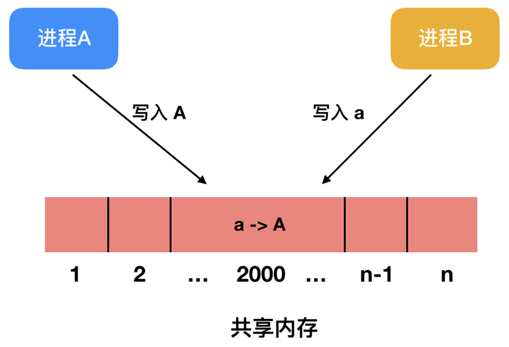
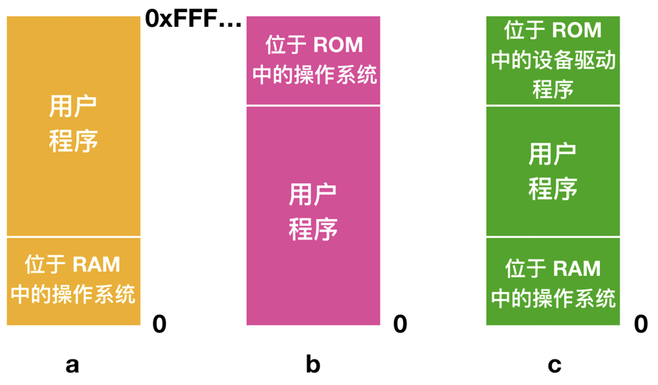
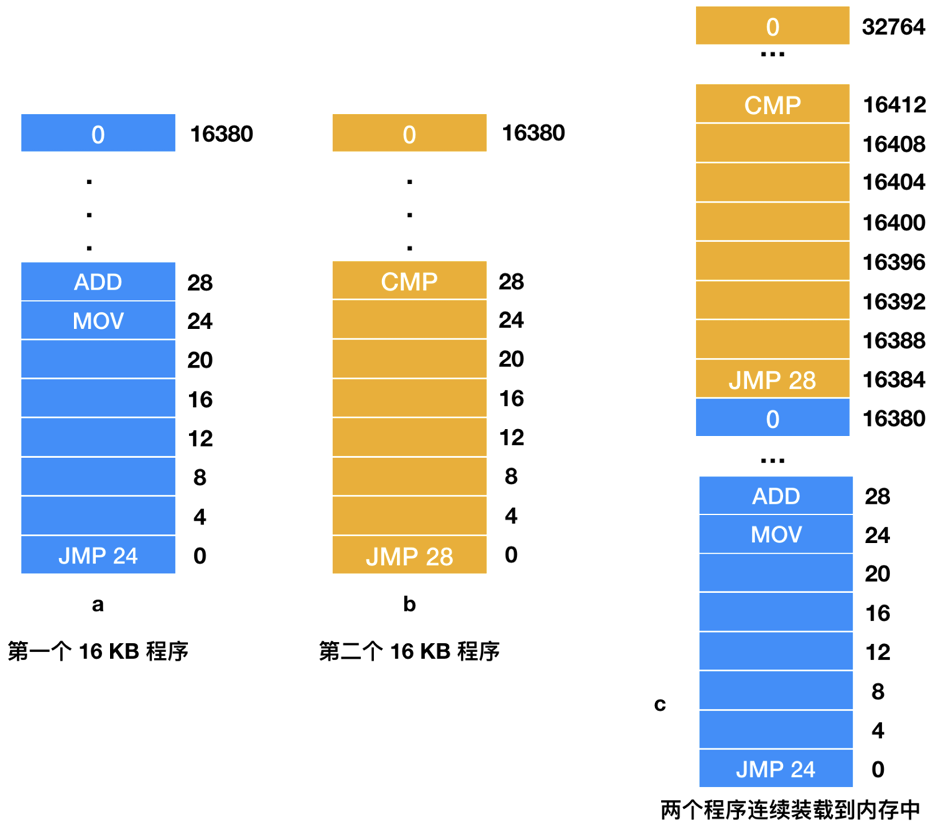
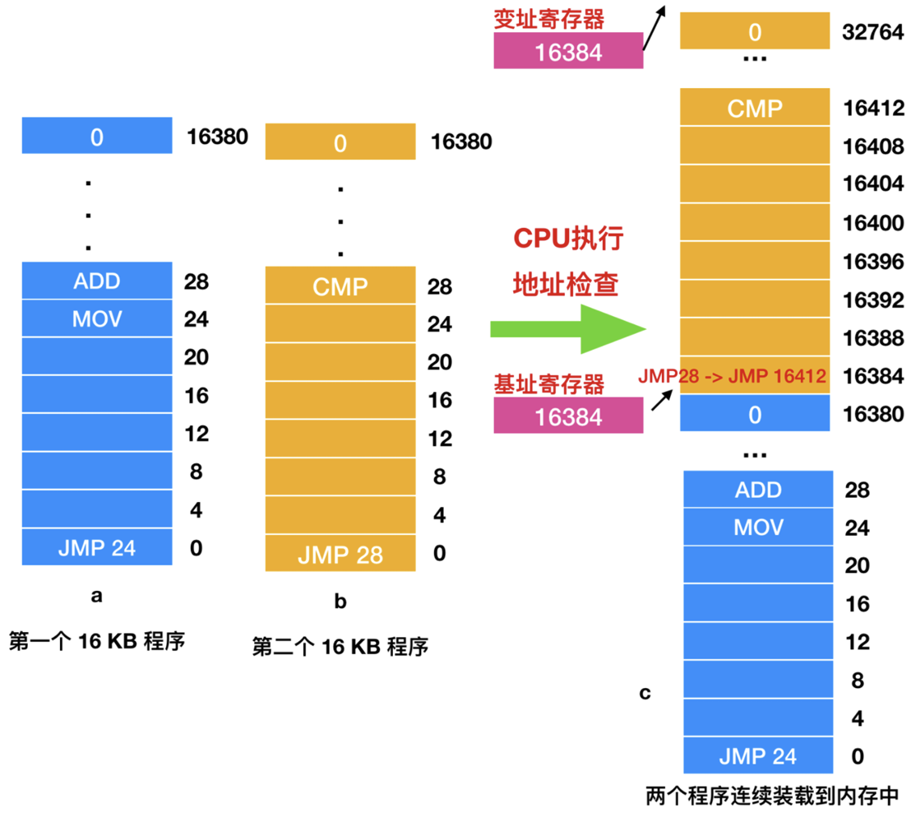

# 地址空间

| ##container## |
|:--:|
||

主存（Random Access Memory, RAM）是计算机系统中至关重要且需精细管理的资源。尽管当前技术下，内存的增长速度远非昔日如IBM 7094等早期计算机可比，然而，值得注意的是，程序（包括应用程序及操作系统本身）的体量和复杂度也在以更快的速度膨胀，其增长速度往往超越了内存容量的扩展速度。这一现象深刻揭示了“无论存储器容量如何扩展，程序大小的增长总是倾向于更快”的普遍规律。

为了有效应对这一挑战，并最大化利用有限的内存资源，操作系统扮演了至关重要的角色。它们不仅负责内存的分配与回收，还通过一系列复杂的机制来管理内存，确保系统的稳定运行和高效性能。下面我们就来探讨一下操作系统是如何创建内存并管理他们的。

经过多年的研究发现，科学家提出了一种`分层存储器体系(memory hierarchy)`，下面是分层体系的分类:

| ##container## |
|:--:|
||
|存储层次结构|

在操作系统中，负责管理内存层次结构的组件被称为“内存管理器（memory manager）”。其主要职责在于有效地管理内存资源，包括记录哪些内存区域正在被使用、在进程需要时为其分配内存、以及在进程完成后回收内存空间。这一功能是现代操作系统不可或缺的一部分，所有现代操作系统均提供了相应的内存管理机制。

接下来，我们将对不同复杂程度的内存管理模型进行探讨。需要注意的是，由于最低级别的缓存通常由硬件自动管理，因此我们的讨论将主要聚焦于主存模型及其管理方法。从简单的内存管理策略到更为复杂的机制，我们将逐一进行剖析。

## 一、无存储器抽象
### 1.1 运行一个程序
最为基础的存储器抽象概念是`“无存储器抽象”`。在计算机技术发展的早期阶段，如20世纪60年代之前的大型计算机、70年代之前的小型计算机，以及80年代之前的个人计算机，均未采用存储器抽象技术。这些计算机系统中的程序直接访问物理内存，意味着程序与硬件内存地址之间存在着直接的映射关系。

以一条简单的机器指令为例:

```伪汇编
MOV REGISTER1, 1000
```

当执行这条指令时，计算机会直接将物理内存中地址为`1000`的位置上的数据移动到`REGISTER1`寄存器中。在这种情境下，程序员所面对的内存模型即为物理内存的直观反映，内存地址从`0`开始，逐一递增至最大值，每个地址单元均存储着一个`8`位的二进制数。

由于这种直接映射的方式，当时的计算机系统无法支持两个应用程序同时驻留在内存中运行。举例来说，如果第一个程序向内存地址2000写入了一个值，那么这个值将会覆盖第二个程序在相同地址（即2000）上的原有数据。因此，两个程序若试图同时运行，将会因数据冲突而导致立即崩溃。这种限制严重阻碍了计算机多任务处理能力的提升，也凸显了存储器抽象技术引入的必要性。

| ##container## |
|:--:|
||

不过即使存储器模型就是物理内存，还是存在一些可变体的。下面展示了三种变体:

| ##container## |
|:--:|
||

在图a所示模型中，操作系统被置于`RAM（Random Access Memory，随机存取存储器）`的底部，而在图b中，操作系统则位于`ROM（Read-Only Memory，只读存储器）`的顶部。至于图c，设备驱动程序被放置在顶端的ROM中，而操作系统则位于底部的RAM中。这些模型反映了不同历史时期和计算机类型中的内存布局方式。

具体来说，图a的模型曾广泛应用于大型机和小型机，但如今已较为罕见。图b的模型则常见于掌上电脑或嵌入式系统中，这些系统通常依赖ROM来存储固定的、不易更改的操作系统代码。至于图c的模型，它代表了早期个人计算机的一种典型布局，其中ROM中的一部分被用作`BIOS（Basic Input Output System，基本输入输出系统）`。

然而，模型a和c存在一个共同的缺点：用户程序中的错误可能会直接破坏操作系统，从而引发灾难性的后果。这是因为在这两种模型中，用户程序和操作系统共享同一块内存空间，且没有有效的隔离机制。

在采用这种内存组织方式时，系统通常**只能同时运行一个进程**。用户键入命令后，操作系统会将所需的程序**从磁盘复制到内存中**并执行。当进程运行结束后，操作系统会在用户终端上显示提示符，并等待新的命令。一旦收到新命令，操作系统会再次将新的程序装入内存，覆盖前一个程序的内存空间。

为了在没有存储器抽象的系统中实现一定程度的并行性，一种方法是使用多线程编程。由于同一进程中的多个线程共享同一内存映像，因此它们之间的并行执行在技术上成为可能。然而，这种方法并未得到广泛采纳，因为用户通常期望能够同时运行多个没有关联的程序，而线程抽象并不能提供这种级别的隔离和并行性。

> 举例来说，在一个没有存储器抽象的系统中，如果用户同时运行了两个程序（如文本编辑器和计算器），那么这两个程序将不得不共享同一块内存空间。如果文本编辑器中的某个错误导致它错误地覆盖了计算器的内存区域，那么计算器程序可能会崩溃或表现出异常行为。这种情况在模型a和c中尤为常见，因为它们缺乏有效的内存隔离机制。

### 1.2 运行多个程序
即便在没有存储器抽象的情况下，同时运行多个程序依然是可行的，这主要通过操作系统的巧妙管理来实现。操作系统可以采取一种策略：将当前内存中运行的所有程序内容暂时保存到磁盘文件中，随后再将需要运行的程序读入内存。只要确保在任一时刻，内存中仅有一个程序在运行，就可以有效避免程序间的冲突。

> 此外，借助额外的特殊硬件，即使在没有交换功能的情况下，也能实现多个程序的并行运行。IBM 360的早期模型就是一个典型的例子。

在IBM 360系统中，内存被细致地划分为多个2KB的区域块，每个区域块都被分配了一个独特的4位保护键。这些保护键被存储在CPU的“特殊寄存器（SFR）”中。以一个内存容量为1MB的机器为例，它仅需要512个这样的4位寄存器，总容量仅为256字节（计算方式：512个寄存器 x 4位/寄存器 = 2048位 = 256字节）。同时，在“程序状态字（PSW）”中，也包含了一个4位的码，用于与内存区域块的保护键进行匹配。

当某个运行中的进程尝试访问一个内存区域块时，如果该进程的保护键与其PSW中保存的码不一致，IBM 360的硬件会立即捕获这一异常情况。由于只有操作系统才具备修改保护键的权限，因此这种机制能够有效地防止进程间的相互干扰，以及用户进程对操作系统的潜在破坏。通过这种方式，IBM 360在没有存储器抽象的情况下，也实现了多个程序的并行运行。

这种解决方式是有一个缺陷。如下所示，假设有两个程序，每个大小各为 16 KB:

| ##container## |
|:--:|
||

从图中我们可以清晰地看到，这描述了两个不同的`16KB`程序（我们称之为a程序和b程序）的装载过程。a程序在装载后，其执行流程会首先跳转到`地址24`，那里是一条`MOV`指令。而b程序则会首先跳转到`地址28`，该地址对应的是一条`CMP`指令。

这里所展示的是两个程序被先后加载到内存中的情况。然而，如果我们假设这两个程序被同时加载到内存中，并且都从地址0处开始执行，那么内存的状态就会如上图c所示。程序装载完成后开始运行，第一个程序（a程序）从`地址0`处开始，执行`JMP 24`指令，然后依次执行后续指令（虽然图中并未完全展示所有指令）。一段时间后，第一个程序执行完毕，随后开始执行第二个程序（b程序）。

但这里存在一个关键问题：第二个程序的第一条指令是跳转到`地址28`，而这条指令实际上会使程序跳转到第一个程序的`ADD`指令处，而非原本设定的`CMP`指令。这种不正确的访问可能会导致程序崩溃。

问题的核心在于，这两个程序都使用了 **绝对物理地址**。在实际应用中，我们更希望每个程序都能引用一个私有的本地地址，以避免此类冲突。

IBM 360在处理第二个程序装载到内存时，采用了一种称为`静态重定位(static relocation)`的技术。具体来说，当一个程序被加载到内存中的特定地址（如`16384`地址）时，会将一个常数（在本例中为`16384`）加到该程序的所有地址上。因此，原本的`JMP 28`指令会变为`JMP 16412`。

虽然这种机制在正常情况下是可行的，但它并非一种完美的解决方案。首先，它会减慢程序的装载速度。其次，它需要所有可执行程序中包含额外的信息，以指示哪些地址是可重定位的，哪些则不是。例如，在b程序中，`JMP 28`可以被重定向，但`MOV REGISTER1,28`这样的指令则不会，因为它只是将数字`28`移动到寄存器中，而不是进行地址跳转。

因此，`装载器（loader）`需要具备一定的能力来**区分地址和常数**。这要求装载器在加载程序时，能够识别并修改那些需要重定位的地址，同时保留那些不应被修改的常数。

## 二、一种存储器抽象: 地址空间
将物理内存直接暴露给进程会带来几个显著的缺陷。首先，若用户程序能够访问内存的每个字节，它们可能会轻易地破坏操作系统，导致系统崩溃（或称“停止运行”）。这种情况并非仅在多用户环境下才会发生，即便在仅有单个用户进程运行的情况下，也潜藏着这样的风险。除非采用如IBM 360所使用的`锁钥模式（lock-and-key mode）`或依赖特殊硬件进行保护，否则这种风险始终存在。例如，如果某个用户程序错误地写入了操作系统内核所在的内存区域，就可能导致系统无法继续运行。

其次，这种内存模型对于同时运行多个程序构成了极大的挑战。在只有一个CPU核心的情况下，程序通常只能按顺序执行。然而，在现代个人计算机上，用户往往会同时打开多个应用程序，如输入法、电子邮件客户端和浏览器等。这些进程在不同时刻可能交替成为当前运行的进程，而其他应用程序则可能通过用户的操作（如鼠标点击）被唤醒并继续执行。如果系统没有足够的物理内存来同时容纳所有正在运行和可能被唤醒的进程，那么实现这种多任务处理就变得异常困难。在这种情况下，系统可能需要依赖复杂的内存管理策略（如虚拟内存、分页和交换等）来确保多个程序能够顺畅地运行。

### 2.1 地址空间的概念
为了确保多个应用程序能够在内存中顺利且安全地同时运行，我们必须妥善处理两大核心问题：`保护`与`重定位`。接下来，让我们深入探讨IBM 360是如何应对这些问题的。

IBM 360采用的第一种解决方案是通过`保护密钥来标记内存块`。在执行过程中，系统会将当前进程的密钥与从内存中提取的每个存储字的密钥进行逐一比对。这种机制虽然能够有效防止用户程序破坏操作系统（即解决了保护问题），但遗憾的是，它并未能解决多进程在内存中并行运行所带来的挑战。

为了更全面地应对这些问题，一种更为巧妙的解决方案应运而生：构建`地址空间(the address space)`这一存储器抽象。正如进程的概念为我们创造了一个抽象的CPU环境来运行程序，地址空间则为我们提供了一个抽象的内存环境供程序使用。具体而言，地址空间是指进程可以用来寻址内存的一系列地址集合。每个进程都拥有自己独立的地址空间，这些空间相互隔离，互不干扰。当然，在实际应用中，也存在某些进程需要共享地址空间的特殊场景。

以两个同时运行的应用程序为例，假设它们分别需要访问内存中的某个特定区域。在没有地址空间抽象的情况下，这两个程序可能会因为访问相同的物理内存地址而发生冲突。但有了地址空间后，每个程序都被分配了一个独特的地址空间，它们在自己的地址空间内自由访问内存，而不会相互干扰。即使两个程序试图访问相同的“逻辑地址”，由于这些地址被映射到了不同的物理内存区域，因此也不会发生冲突。

综上所述，地址空间的引入不仅解决了保护问题，还为多进程在内存中并行运行提供了可能。

### 2.2 基址寄存器和变址寄存器
为了确保多个程序能在内存中安全且有效地并行运行，一种简洁而高效的方法是采用`动态重定位(dynamic relocation)`技术。这项技术通过为每个进程的地址空间与物理内存的不同区域之间建立**映射关系**，实现了进程的隔离与共存。

> 从历史的角度来看，从CDC 6600（被誉为世界上最早的超级计算机）到Intel 8088（原始IBM PC的核心处理器），一种经典的实现方式是为每个CPU配备两个特殊的硬件寄存器：`基址寄存器(base register)`和`界限寄存器(limit register)`（注意：原文中的“变址寄存器”可能是一个误称，因为在此上下文中更常见的术语是“界限寄存器”，它用于限定程序可访问的内存范围）。

当使用这两个寄存器时，程序会被装载到内存中的连续位置，并且在装载过程中无需进行重定位。具体来说，当一个进程开始运行时，该程序的起始物理地址会被加载到基址寄存器中，而程序的长度（或可访问的内存范围）则会被加载到界限寄存器中。

当使用这两个寄存器时，程序会被装载到内存中的连续位置，并且在装载过程中无需进行重定位。具体来说，当一个进程开始运行时，该程序的起始物理地址会被加载到基址寄存器中，而程序的长度（或可访问的内存范围）则会被加载到界限寄存器中。

> 以图c中的情况为例，当第一个程序运行时，基址寄存器和界限寄存器的值分别被设置为0和16384（假设程序大小为16KB）。这意味着该程序可以访问从物理地址0到16383的内存区域。当第二个程序运行时，为了避免与第一个程序发生冲突，基址寄存器和界限寄存器的值会分别更新为16384和32768，使第二个程序能够访问从物理地址16384到32767的内存区域。
> 
> 如果有一个第三个16KB的程序需要直接装载到第二个程序的地址之上并运行，那么基址寄存器和界限寄存器的值会再次更新，分别为32768和49152（即16384+32768，但界限寄存器存储的是长度或范围，所以这里应理解为从32768开始，长度为16384的内存区域）。这样，第三个程序就能安全地访问从物理地址32768到49151的内存区域了。
> 
> | ##container## |
> |:--:|
> ||

通过这种方式，动态重定位技术不仅实现了进程的内存隔离，还确保了多个程序可以在有限的物理内存资源上并行运行，而不会相互干扰。

我们可以对基址寄存器和变址寄存器的作用进行如下总结:

- **基址寄存器**：其主要功能是存储数据内存区域的起始地址。这个起始地址是进程在其私有地址空间中访问内存时的基准点。

- **变址寄存器**：它负责存储应用程序在内存中可以访问的最大范围或长度。这个值用于界定程序可以合法访问的内存区域，从而确保程序的运行不会超出其预定的内存范围。

在实际的运行过程中，每当进程需要引用内存以获取指令、读取数据或写入数据时，CPU都会自动执行以下操作:

1. 将进程生成的地址（也称为逻辑地址或虚拟地址）与基址寄存器中存储的基址值相加，从而计算出该地址在物理内存中的实际位置（也称为物理地址）。

2. 在将计算出的物理地址发送到内存总线之前，CPU还会检查程序提供的逻辑地址是否超出了变址寄存器中存储的范围值。

3. 如果逻辑地址大于或等于变址寄存器中的值，即表明程序试图访问超出其预定内存范围的内存区域，此时CPU会产生一个错误信号，并中止对该内存区域的访问，以确保系统的稳定性和安全性。

> 以图c中的情况为例，当执行`JMP 28`这条指令时，由于基址寄存器中存储的基址值为16384（假设这是之前某个时刻由操作系统设置的），因此硬件会将这条指令解释为`JMP 16412`（即28+16384）。这样，程序就能够正确地跳转到CMP指令所在的位置，继续执行后续的操作。这一过程充分体现了基址寄存器和变址寄存器在确保程序正确、安全地访问内存方面的重要作用。

为各进程分配独立的私有地址空间，基址寄存器和（在某些设计中包括的）变址寄存器提供了一种极为有效的方法。这种方法的核心在于，每个内存地址在访问物理内存之前，都会先与基址寄存器的内容相加（若存在变址寄存器，则可能还涉及与变址寄存器的某种运算）。这样，每个进程都能在其独立的地址空间内运行，互不干扰。

> 在实际系统中，为了保障系统的安全性和稳定性，基址寄存器和（如果存在的话）变址寄存器通常会受到严格的保护，确保只有操作系统才能对它们进行修改。例如，在CDC 6600这样的早期超级计算机中，就提供了对这些寄存器的保护机制。然而，并非所有系统都具备这样的保护，比如Intel 8088处理器就没有对变址寄存器提供支持，同时也没有提供对基址寄存器修改的保护机制。尽管如此，Intel 8088还是通过提供多个基址寄存器，实现了程序代码和数据的独立重定位，这在当时已经是一个不小的进步。但需要注意的是，它并没有为超出内存范围的引用提供保护机制。

然而，使用基址寄存器和（可能的）变址寄存器也存在一定的缺点。由于每次访问内存时都需要执行加法运算（以及可能的比较运算，即CMP指令），这会增加一定的处理时间。虽然CMP指令的执行速度相对较快，但加法运算（特别是当涉及进位传播时）可能会相对较慢。除非系统采用了特殊的加法电路来加速这一过程，否则这种性能上的开销是不可避免的。因此，在设计系统时，需要权衡这种方法的优点（如提供独立的地址空间）和缺点（如可能的性能开销）。

> [!NOTE]
> 注意, 以上操作**需要硬件的支持**, 一般是cpu中的`MMU`单元.