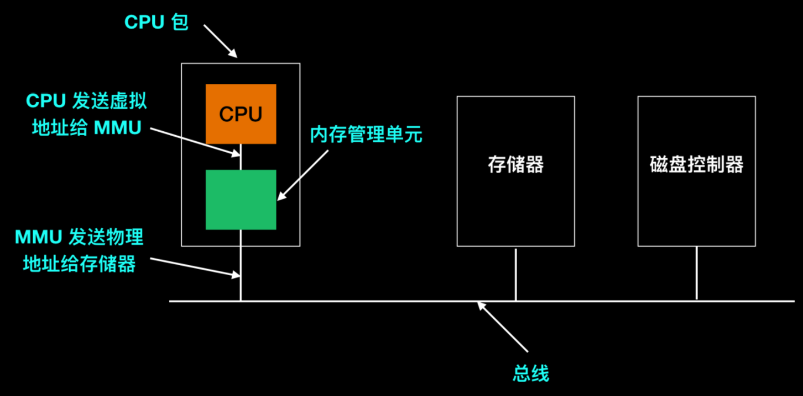
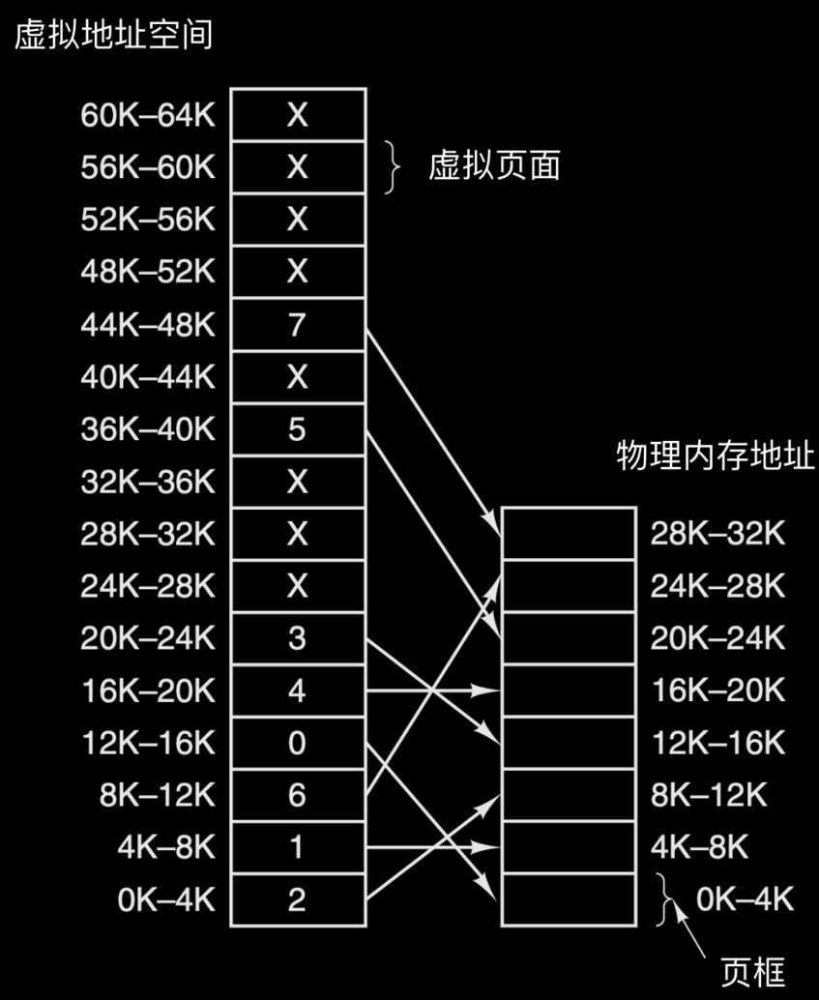
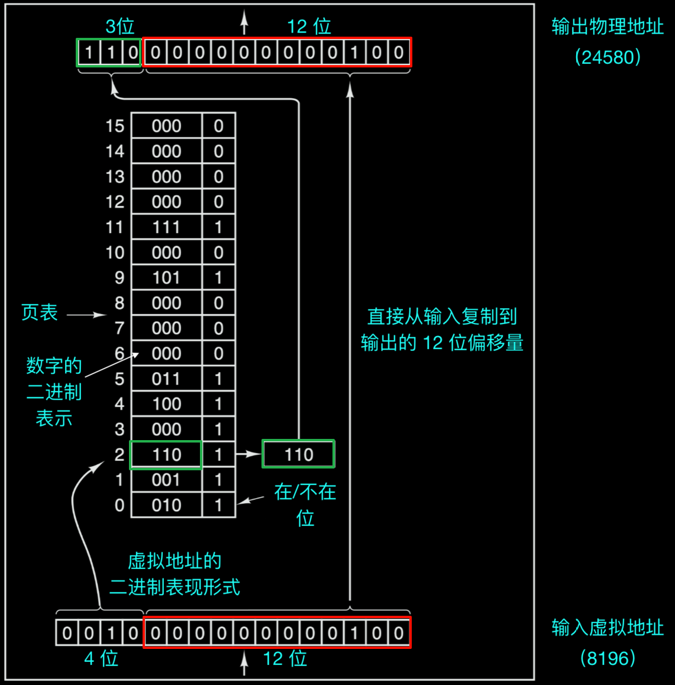
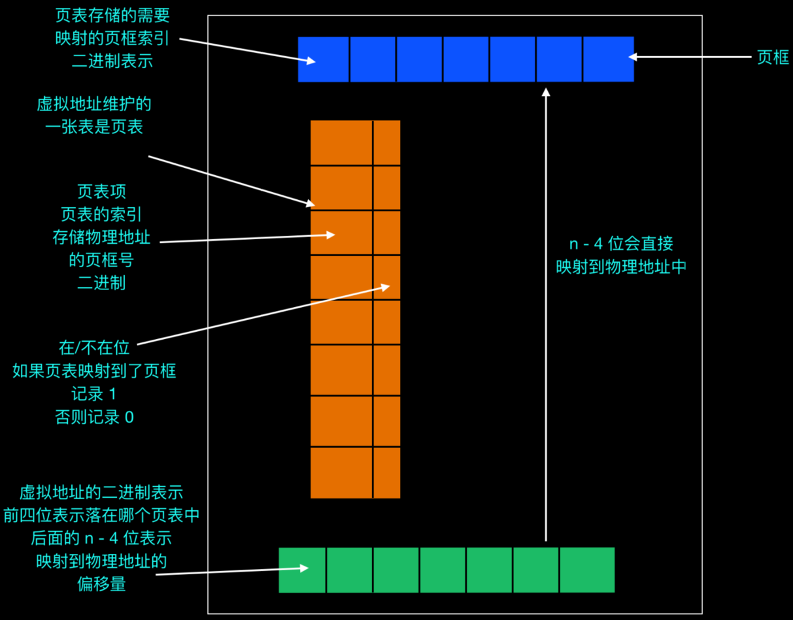
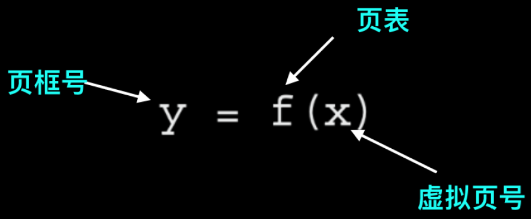
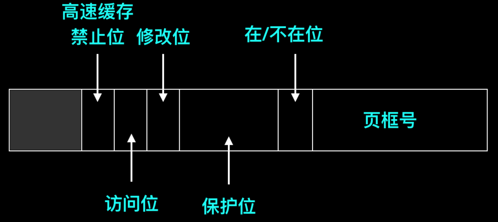
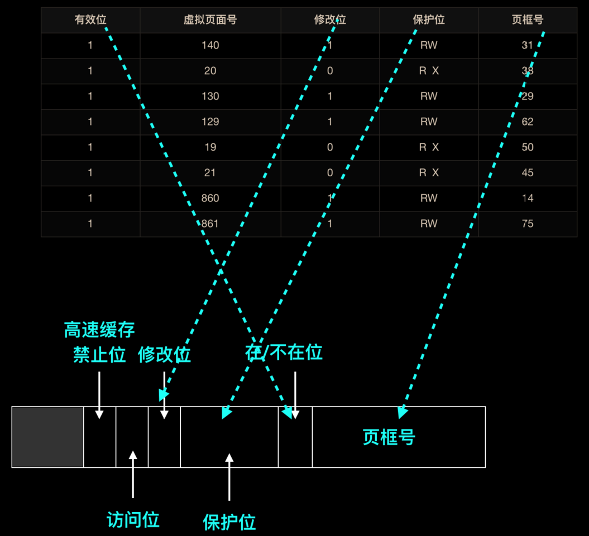
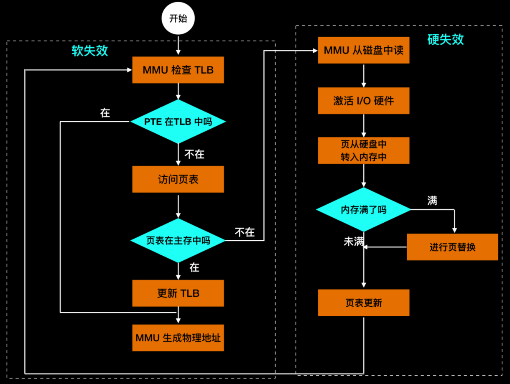

# 段式页式内存管理
## 一、虚拟内存
**虚拟内存(Virtual Memory)** 的核心思想是，为每个程序分配一个独立的地址空间，这个空间被划分为多个称为`页面（Page）`的连续地址块。这些页面在逻辑上连续，但在**物理内存中并不一定连续存放**。程序在运行时，只需关注自己的虚拟地址空间，而无需关心实际的物理内存布局。通过将 **物理内存** 与 **硬盘** 结合，为每个程序提供一个**连续的、独立的**地址空间。

当程序访问某个虚拟地址时，硬件会负责将其映射到物理内存中的实际地址。如果所访问的页面已经在物理内存中，则硬件会立即执行相应的操作。如果所访问的页面不在物理内存中，即发生了`缺页`情况，那么操作系统会负责将该页面从磁盘等辅助存储器中调入物理内存，并重新执行失败的指令。

虚拟内存在某种程度上可以看作是对基址寄存器和变址寄存器的一种扩展和概述。以8088处理器为例，它拥有分离的基址寄存器（尽管没有直接的变址寄存器），用于存放代码（text）和数据（data）的起始地址。而虚拟内存则进一步扩展了这一思想，使得整个地址空间都可以以页面为单位进行映射和重定位。

使用虚拟内存的好处之一是，它可以将整个地址空间以很小的单位（即页面）映射到物理内存中，而不仅仅是针对代码和数据区进行重定位。这使得内存管理更加灵活和高效。此外，虚拟内存还非常适合在多道程序设计系统中使用。在这种系统中，多个程序的片段可以同时保存在内存中。当一个程序等待其部分数据被读入内存时，CPU可以切换到另一个进程继续执行，从而提高了系统的整体吞吐量和响应速度。

> 举例来说，假设我们有一个包含多个程序的计算机系统，每个程序都需要占用一定的内存空间。在没有虚拟内存的情况下，如果所有程序都同时运行，那么它们可能会因为内存不足而相互竞争。而有了虚拟内存后，系统可以将每个程序的地址空间划分为多个页面，并根据需要将这些页面调入和调出物理内存。这样，即使所有程序都同时运行，系统也只需要在物理内存中保留当前正在使用的页面即可，从而大大提高了内存的利用率和系统的性能。

## 二、分页
在大多数采用虚拟内存的系统中，都会使用一种称为`“分页（Paging）”`的技术。在计算机的运行过程中，程序会引用并使用一组内存地址。例如，当程序执行以下指令时:

```伪汇编
MOV REG, 1000
```

它实际上是在将内存地址为1000的内存单元的内容复制到寄存器REG中（或者在某些情况下，是将寄存器REG的内容复制到内存地址为1000的内存单元中，这取决于具体的计算机架构）。这些地址可以通过索引、基址寄存器、段寄存器或其他方式生成。

程序生成的这些地址被称为“**虚拟地址（Virtual Addresses）**”，它们共同构成了“**虚拟地址空间（Virtual Address Space）**”。在没有虚拟内存的计算机上，系统会将虚拟地址直接发送到内存总线上，读写操作都使用与虚拟地址相同的物理内存地址。

然而，在使用虚拟内存的系统中，情况就有所不同了。在这种情况下，虚拟地址并不会直接发送到内存总线上。相反，它们会首先被送到一个称为“**内存管理单元（Memory Management Unit，简称 MMU）**”的硬件组件中。<span style="color:gold">MMU负责将虚拟地址映射为物理内存地址，然后再将这个物理地址发送到内存总线上进行读写操作</span>。

> 举个例子来说，假设有一个程序正在运行，并且它试图访问虚拟地址为1000的内存单元。在没有虚拟内存的情况下，这个请求会直接被发送到物理内存地址为1000的位置。但是，在使用虚拟内存的系统中，这个虚拟地址会首先被MMU处理。如果MMU发现这个虚拟地址对应的物理地址不是1000（比如说是2000），那么它就会将请求重定向到物理地址为2000的内存单元上。这样，程序就可以在不知道实际物理内存布局的情况下，通过虚拟地址来访问内存了。像下图这样:
>
> | ##container## |
|:--:|
||

这幅计算机内存管理的示意图清晰地展示了虚拟地址空间与物理内存地址之间的映射关系:

| ##container## |
|:--:|
||

在图中，我们可以看到虚拟地址空间被划分为一系列连续的虚拟页面，这些页面从60K一直延伸到0-4K。每个虚拟页面都对应着物理内存中的一个或多个页框。

页表是这一映射关系的核心，它记录了每个虚拟页面的起始地址和对应的物理内存地址。值得注意的是，每一页都起始于4096的倍数位置，并结束于下一个4096倍数的前一个位置，即4K到8K实际对应的是4096-8191的物理地址范围，8K到12K则对应8192-12287，以此类推。

以这个示意图为例，我们假设有一个16位地址的计算机，其虚拟地址范围从0到64K-1。然而，物理内存的大小只有32KB。这意味着，虽然我们可以编写一个64KB大小的程序，但受限于物理内存的容量，程序无法一次性全部调入内存运行。因此，在磁盘上必须保留一个最多64KB的程序核心映像的完整副本。当程序需要访问某个不在内存中的虚拟页面时，操作系统会负责将该页面从磁盘调入内存，并更新页表以反映这一变化。

> 举个例子，如果程序试图访问虚拟地址为7000（即7K）的内存单元，而该地址对应的页面当前不在内存中，那么操作系统会查找页表，找到该虚拟页面在磁盘上的位置，然后将其调入内存中的一个空闲页框中。接着，操作系统会更新页表，将虚拟地址7000映射到新的物理地址上。这样，程序就可以继续执行，而无需知道底层内存管理的复杂性。

### 2.1 存在映射的页如何映射
虚拟地址空间由一系列固定大小的单元构成，这些单元被称为`“页（pages）”`。相应地，物理内存也被划分为一系列固定大小的物理单元，称为`“页框（page frames）”`。页和页框的大小是相同的，这是为了确保它们之间可以一一对应地进行映射。

以某个具体例子来说，页的大小可能被设定为4KB，但值得注意的是，在实际应用中，页的大小可以根据系统需求在512字节到1G字节的范围内变化。这种灵活性使得内存管理系统能够适应不同规模和类型的程序。

现在，让我们考虑一个具有64KB虚拟地址空间和32KB物理内存的示例。在这个例子中，由于页的大小为4KB，因此虚拟地址空间可以被划分为16个虚拟页面（64KB / 4KB = 16），而物理内存则可以被划分为8个页框（32KB / 4KB = 8）。

值得注意的是，RAM（随机存取存储器）和磁盘之间的数据交换总是以整个页为单元进行的。这意味着，当操作系统需要将某个虚拟页面从磁盘调入内存时，它会将整个页面加载到一个空闲的页框中。同样地，当需要将某个页面从内存中移出以腾出空间给其他页面时，操作系统也会将整个页面写回到磁盘上。

当程序执行内存访问指令时，例如:

```伪汇编
MOV REG, 0
```

此时，程序试图访问虚拟地址0。这个虚拟地址会被发送到内存管理单元（MMU）进行处理。 MMU会检查这个虚拟地址所属的页面（在这个例子中，虚拟地址0属于页面0，其范围是从0到 4095）。然后，MMU会根据页表（一个记录虚拟页面和物理页框映射关系的表）找到这个虚拟页面对应的物理页框。假设在这个例子中，页面0被映射到了物理页框2（其地址范围是从8192到12287），那么MMU就会将虚拟地址0变换为物理地址8192，并将这个物理地址发送到总线上。

**内存对MMU的操作一无所知**，它只会看到一个对物理地址8192的读写请求，并据此执行相应的操作。通过这种方式，MMU有效地将所有虚拟地址0到4095映射到了物理地址8192到12287上。

类似地，如果程序执行以下指令:

```伪汇编
MOV REG, 8192
```

而虚拟地址8192（属于虚拟页面2）被映射到了物理地址24576（属于物理页框6），那么MMU就会将这个虚拟地址变换为物理地址24576，并执行相应的内存访问操作。这个过程可以表示为:

```伪汇编
MOV REG, 8192 --> (经MMU变换后) --> MOV REG, 24576
```

通过恰当地设置MMU，我们可以将16个虚拟页面映射到8个物理页框中的任何一个。然而，这并 **没有** 解决`虚拟地址空间`比`物理内存` **大** 的问题。在实际应用中，如果虚拟地址空间中的某个页面没有被映射到物理内存中，那么当程序试图访问这个页面时，就会触发一个`页面错误（Page Fault）`。

在硬件实现中，通常会使用一个`“在/不在（Present/absent bit）”位`来记录页面是否在内存中的实际存在情况。这个位通常被包含在页表的每个条目中。当MMU查找页表时，它会检查这个位来确定页面是否在内存中。如果页面不在内存中，那么就会触发页面错误，操作系统会负责将这个页面从磁盘调入内存，并更新页表以反映这一变化。

> [!TIP]
> 在上面的例子中，如果我们有8个物理页框，那么只有8个虚拟页面可以被映射到物理内存中。其他未被映射的虚拟页面（在上图中用“X”号表示）在尝试访问时将会触发页面错误。

### 2.2 未映射的页如何映射
当程序试图访问一个未映射的页面时，会发生什么情况呢？以执行以下指令为例:

```伪汇编
MOV REG, 32780
```

这条指令试图将虚拟地址32780的内容移动到寄存器REG中。然而，虚拟地址32780位于虚拟页面 8（其范围是从32768到36863）的第12个字节。由于该页面在当前的页表中没有被映射到任何物理页框（在图中用X号表示），因此MMU（内存管理单元）会注意到这一点，并触发一个异常，导致 CPU“陷入”到操作系统中。这个陷入事件被称为`“缺页中断”`或`“缺页错误”`。

操作系统在接收到缺页中断后，会选择一个当前很少使用的物理页框，并将其内容（如果有的话）写入磁盘（如果该内容尚未在磁盘上，则直接丢弃）。然后，操作系统会将需要访问的虚拟页面（在这个例子中是虚拟页面8）读入到刚才回收的物理页框中。为了完成这个操作，操作系统需要更新页表，以反映新的映射关系。

具体来说，操作系统会执行以下两步操作来修改页表:

1. 将之前被放弃的物理页框（在这个例子中是页框1）对应的虚拟页面表项标记为未映射。这样，以后任何对该虚拟页面（在这个例子中是虚拟地址4096-8191）的访问都会触发缺页中断。

2. 将虚拟页面8的表项中的X号改为刚刚回收的物理页框的编号（在这个例子中是1）。因此，在引起陷阱的指令重新启动时，MMU会将虚拟地址32780映射到物理地址（4096 + 12 = 4096 + 偏移量12 = 32792，但注意这里我们实际上应该考虑页内偏移，即32780 % 4096 = 12，所以物理地址是4096（页框1的起始地址）+ 12 = 32792中的页框起始地址部分应为新映射的页框的起始地址，但在这个上下文中我们关注的是映射关系的变更，而不是具体的物理地址计算）。然而，为了保持一致性，我们应该说，在重新启动指令时，虚拟地址32780将被映射到新的物理页框的起始地址加上其在页内的偏移量（12字节），从而允许CPU正确地访问所需的数据。

上面的物理地址计算（32792）是一个示例性的说明，实际上在发生缺页中断后，新的物理页框的起始地址将由操作系统根据可用的物理内存和页表的状态来确定。

通过这个过程，操作系统能够动态地管理内存，确保即使程序的虚拟地址空间大于物理内存的大 小，程序仍然能够运行。当程序需要访问某个未映射的页面时，操作系统会负责将该页面调入内存，并更新页表以反映这一变化。

为了深入理解MMU（内存管理单元）的工作原理以及为何我们常选用2的整数次幂作为页大小，让我们一同探究MMU的内部构造。以虚拟地址8196（其二进制表示为0010000000000100）为例，结合下图所示的MMU映射机制进行说明。

| ##container## |
|:--:|
||

> (建议直接看图)
>
> 在这个例子中，输入的16位虚拟地址被巧妙地划分为两部分: 4位的页号和12位的偏移量。其中，4位的页号足以表示16个不同的页面（因为212=4096）。
>
> 接下来，MMU会利用这个页号作为索引，去查找页表（page table）中对应的条目。页表是一个关键的数据结构，它记录了虚拟页面与物理页框之间的映射关系。如果查找到的页表条目中的“在/不在”位为0，这意味着该虚拟页面当前并未映射到任何物理页框上，此时会触发一个操作系统陷入（通常称为缺页中断），由操作系统负责处理这一异常情况。
>
> 相反，如果“在/不在”位为1，则表示该虚拟页面已经成功映射到了一个物理页框上。此时，MMU会将页表中查到的页框号复制到输出寄存器的高3位中（假设物理页框号用3位表示，这仅是一个示例，实际中可能使用更多位来表示页框号）。随后，将输入虚拟地址中的低12位偏移量也加入到输出寄存器 中，从而构成了一个完整的15位物理地址。
>
> 最后，这个物理地址会被输出寄存器发送到总线上，用于指导内存访问操作。以虚拟地址8196为例，假设它映射到了物理页框2（用二进制表示为001），则最终构成的物理地址将是 0010000000000100（其中高3位为页框号001，低12位为偏移量00000000000100）。这个物理地址随后会被用于访问内存中的相应位置。

## 三、‌页表
虚拟地址到物理地址的映射机制可以清晰地概述如下: 虚拟地址被分割为两个部分，即“虚拟页号”（占据高位）和“偏移量”（占据低位）。以16位地址空间和4KB（即4096字节）的页面大小为例，虚拟地址的高4位能够指定16个可能的虚拟页面中的任意一个（因为212=4096）。

在实际操作中，虚拟页号作为页表的索引被用来查找对应的页表项。页表是一个关键的数据结构，它记录了虚拟页面与物理页框之间的映射关系。通过查找页表项，我们可以找到与虚拟页面对应的物理页框号（如果该虚拟页面已经被映射到某个物理页框上的话）。一旦获取了物理页框号，我们就可以将其与偏移量进行拼接，拼接时需要将物理页框号放置在偏移量的高位端，并替换掉原来的虚拟页号。这样，我们就得到了一个完整的物理地址。

> 举个例子，假设我们有一个16位的虚拟地址0x1004（即二进制0001000000000100），并且该地址已经被映射到了物理页框2上（用二进制表示即为001）。在这个例子中，虚拟页号是0x1（即二进制 0001），它指向页表中的第一个条目（因为索引是从0开始的）。该条目告诉我们，虚拟页面0x1被映射到了物理页框2上。因此，我们可以将物理页框号001与偏移量00000000000100进行拼接，得到物理地址0x002004（即二进制0000001000000100）。这个物理地址随后会被用来访问内存中的相应位置。

| ##container## |
|:--:|
||

因此，页表的目的是把虚拟页映射到页框中。从数学上说，页表是一个函数，它的参数是虚拟页号，结果是物理页框号。

| ##container## |
|:--:|
||

通过这个函数可以把虚拟地址中的虚拟页转换为页框，从而形成物理地址。

### 3.1 页表项的结构
下面我们探讨一下页表项的具体结构，上面你知道了页表项的大致构成，是由`页框号`和`在/不在位`构成的，现在我们来具体探讨一下页表项的构成:

| ##container## |
|:--:|
||

页表项的结构虽然因机器而异，但通常有较高的相似性，以下是主要字段及其功能:

1. **页框号（Page Frame Number, PFN）**  
   - **核心作用:** 将虚拟地址中的页面映射到物理内存中的页框。  
   - **本质:** 页框号是页表项的核心字段，完成虚拟地址到物理地址的转换。

2. **“在/不在”位（Present/Absent Bit）**  
   - **作用:** 指示页面是否驻留在内存中。  
   - **值为1:** 页面有效，可直接访问。  
   - **值为0:** 页面不在内存中，访问时触发缺页异常（Page Fault），由操作系统加载页面或处理异常。

3. **保护位（Protection Bits）**  
   - **作用:** 定义页面的访问权限。  
   - **常见实现:** 区分只读与读写权限，以提高内存安全性，防止非法访问。

4. **修改位（Modified Bit，或脏位 Dirty Bit）**  
   - **作用:** 指示页面是否被写入。  
   - **值为1:** 页面被修改，需在回收页框前写回磁盘。  
   - **值为0:** 页面未修改，可<span style="color:gold">直接丢弃(也就是和磁盘的数据是一样的, 因此 **不需要** 回写)</span>，减少磁盘 I/O。

5. **访问位（Referenced Bit）**  
   - **作用:** 记录页面是否被访问（读或写）。  
   - **用途:** 在页面置换算法中用于判断页面的使用情况。访问位为0的页面更可能被淘汰，减少对程序运行的影响。

6. **高速缓存禁止位（Cache Disable Bit）**  
   - **作用:** 控制页面是否可以被高速缓存。  
   - **应用场景:**   
      - 对映射到设备寄存器的页面禁用缓存，确保数据的实时性和准确性。  
      - 确保访问硬件设备时直接作用于设备，而非使用缓存副本。

在深入探讨虚拟内存管理的相关问题之前，我们有必要明确一点：虚拟内存的本质在于创造一个地址空间的抽象。这一抽象与进程作为CPU抽象的概念类似，都是为了简化和管理复杂的计算机系统。虚拟内存的实现方式是将虚拟地址空间划分为一系列页面，并将每个页面映射到物理内存的某个页框上。我们的关注点在于如何有效地管理和利用这一虚拟内存的抽象，以确保系统的稳定性和性能。

### 3.2 加速分页过程
截至目前，我们已经奠定了`虚拟内存（Virtual Memory）`与`分页（Paging）`的理论基础，接下来，我们将聚焦于这些概念在具体实现中所面临的挑战。在任何实施了分页机制的系统中，都必须妥善解决以下两大核心问题:

1. **虚拟地址至物理地址的映射效率**：此过程需迅速完成，因为内存访问频繁且至关重要。每条指令，无论是从内存中读取还是执行，都可能牵涉到对内存中操作数的访问。考虑到指令执行的时效性，例如，若某条指令的执行耗时1纳秒（ns），那么为了确保映射过程不成为性能的主要拖累，页表查询的耗时就必须控制在0.2纳秒以内。这种严苛的时间要求凸显了映射速度的关键性。

2. **页表的规模管理**：当虚拟地址空间广阔无垠时，页表也会相应地变得庞大。这不仅增加了存储成本，还可能对映射效率构成额外挑战。

以第一个问题为例，我们进一步阐释其重要性。在计算机的运算过程中，内存访问是不可或缺的一环。无论是从内存中读取指令以供CPU执行，还是指令本身需要访问内存中的数据，这些操作都频繁且关键。鉴于指令执行的时效性要求极高，如果页表查询耗时过长，就会成为整个运算过程中的性能瓶 颈，严重影响系统的整体效率。因此，我们必须设计高效的映射机制，以确保映射过程能够迅速且准确地完成。

因此，每条指令可能会多次访问页表，如果执行一条指令需要 1 ns，那么页表查询需要在 0.2 ns之内完成，以避免映射成为一个主要性能瓶颈。

第二个核心问题在于现代操作系统普遍采用至少32位的虚拟地址，而64位地址空间正日益成为主流。以4 KB作为标准页大小，32位地址空间将包含大约100万个页面，而64位地址空间所涵盖的页面数量则几乎无法估量。

面对如此庞大且需要快速映射的页面数量，计算机系统的设计面临了严峻挑战。正如页表结构所 示，每个表项都与一个虚拟页面相对应，虚拟页号则作为索引来定位这些表项。当进程启动时，操作系统会将其页表的一个副本（通常存储在内存中）加载到特定的寄存器中，以便快速访问。

这里可能有一个概念上的难点需要澄清：**页表** 是`虚拟地址`到`物理地址`映射的关键所在，是访问内存数据时不可或缺的一部分。进程启动时，操作系统会多次执行虚拟地址到物理地址的转换，并将转换结果（即物理地址）的副本从内存中读取到寄存器中。然而，这里所说的“寄存器中的副本”并非页表本身，而是页表项所映射的物理地址或与之相关的某些信息。这样，在进程运行过程中，大部分情况下就无需再次访问内存中的页表了。

这种方法的优势在于其简单性，并且映射过程中无需频繁访问内存，从而提高了效率。然而，当页表规模庞大时，这种方法也会带来显著的缺点。首先，维护一个巨大的页表需要高昂的成本；其次，在每次上下文切换时，都必须将整个页表重新装载到寄存器中，这可能会导致性能下降。

鉴于这些挑战，我们需要探讨一些有效的实现方案来加速分页机制并处理庞大的虚拟地址空间。通过这些手段，我们可以在保证映射速度的同时，有效地管理大规模的虚拟地址空间。

### 3.3 转换检测缓冲区 (TLB)

简单的说, 每次使用`虚拟地址`都需要去内存查`页表`的话, 性能太差了, 因为很慢.

> [!NOTE]
> 大多数程序总是对少量页面进行多次访问，而不是对大量页面进行少量访问。因此，只有很少的页面能够被再次访问，而其他的页表项很少被访问。

因此, 为了加速分页操作, 计算机工程师设计了: **转换检测缓冲区（Translation Lookaside Buffer, TLB）**, 它专门记住程序最近常用的虚拟地址和物理地址的对应关系. (是一个在CPU Cache中的"页表").

如果访问TLB没有命中, 才会去内存中访问`页表`(顺便加载到TLB以便下次使用).

> [!TIP]
> 本质就是加了一层缓存.

这个是TLB的表结构

|有效位|虚拟页面号|修改位|保护位|页框号|
|:-:|:-:|:-:|:-:|:-:|
|1|140|1|RW|31|

除了`虚拟页面号`外, 其他都与`页表`的数据有着严格的一一对应关系:

| ##container## |
|:--:|
||

### 3.4 总体的流程

| ##container## |
|:--:|
||
