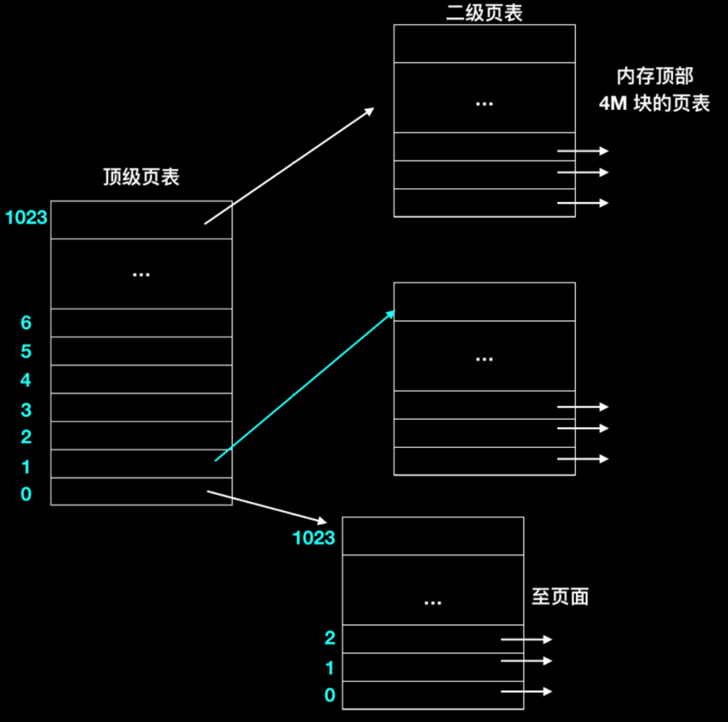
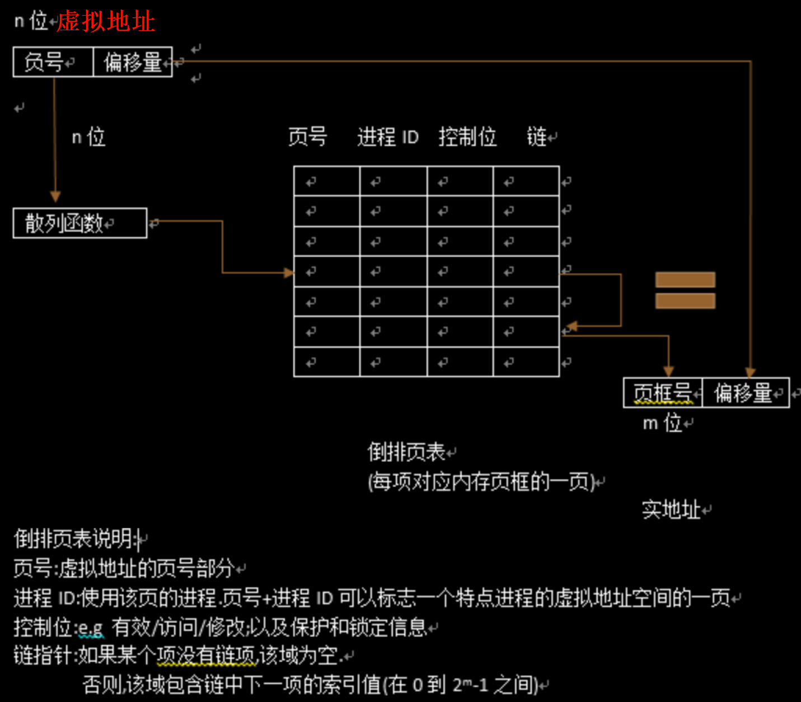
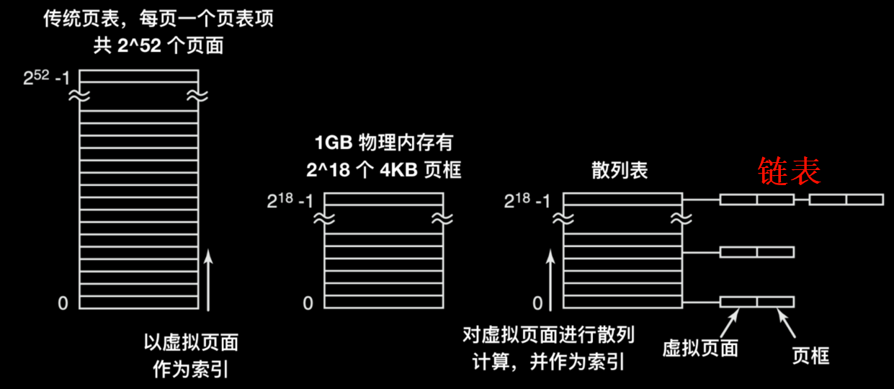
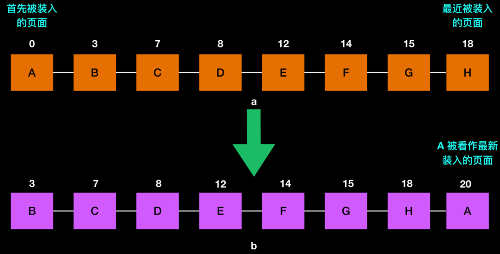
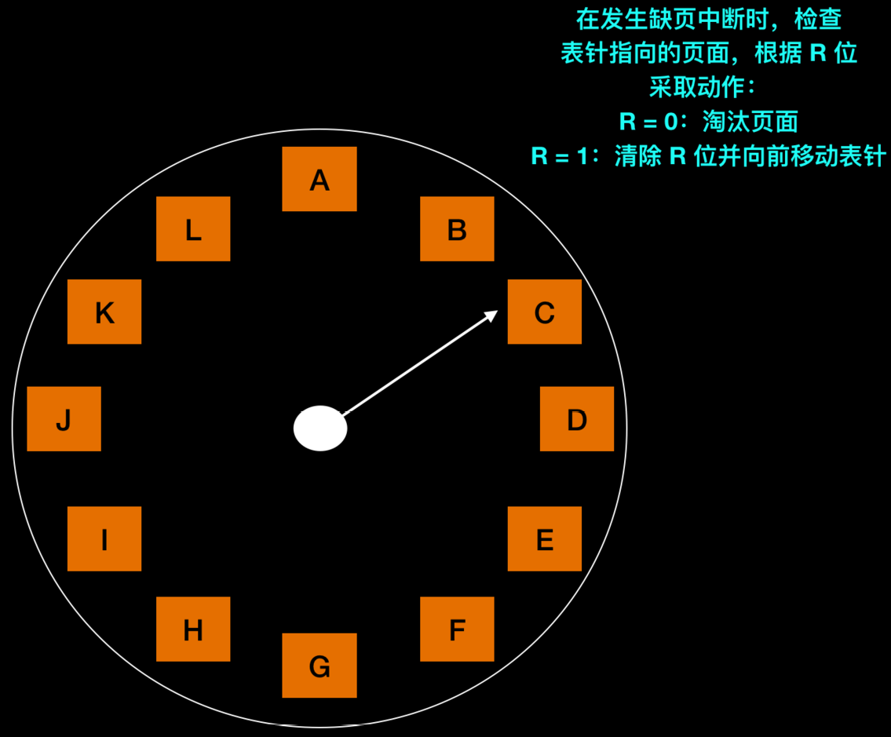
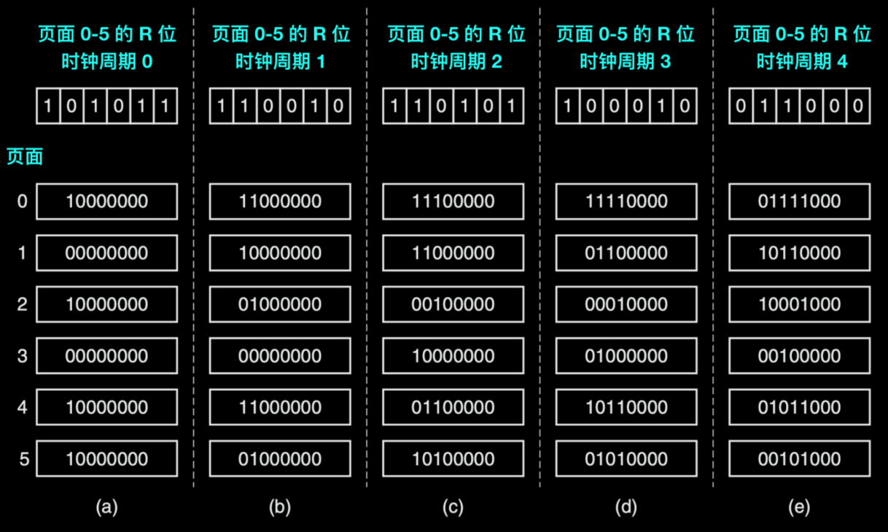
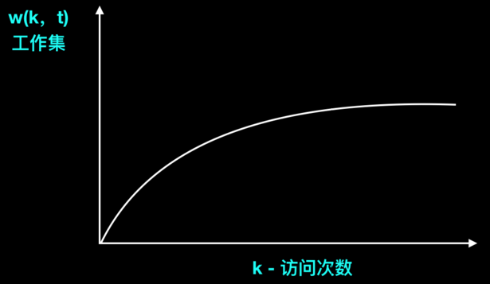
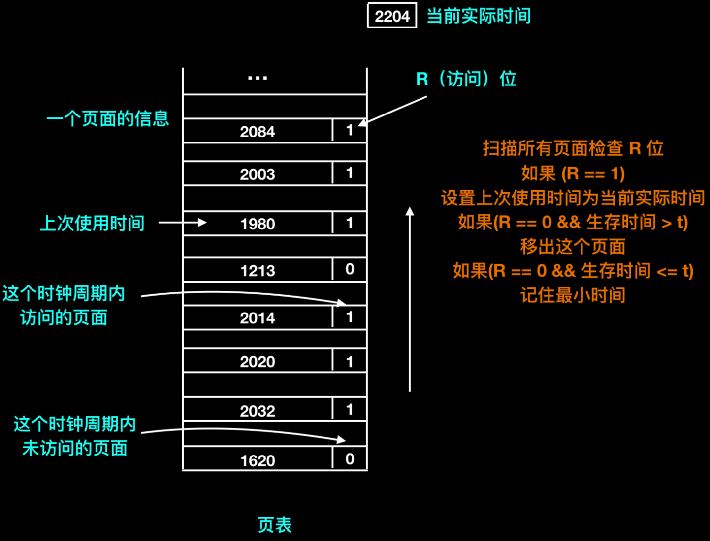
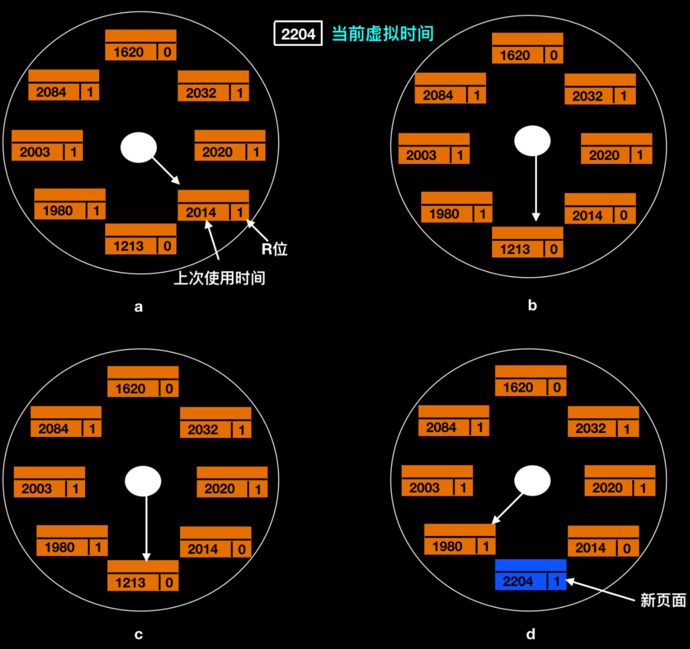

# 多级页表和页面置换算法
## 一、针对大内存的页表
在加速分页过程中, 我们关注的是虚拟地址到物理地址的映射速度必须迅速。但除此之外, 还有一个同样重要的问题, 那就是<span style="color:gold">当虚拟地址空间异常庞大时, 页表也会相应地变得非常巨大</span>。接下来, 我们将深入探讨如何有效管理这一庞大的虚拟地址空间。

在处理大规模虚拟地址空间时, 一个显著的挑战是页表的大小。如果虚拟地址空间足够大, 那么页表也会变得非常庞大, 这不仅会占用大量的内存资源, 还会影响内存访问的速度。为了解决这个问题, 人们提出了多种策略。

### 1.1 多级页表
在处理大规模虚拟地址空间时, 一种有效的方案是采用 **多级页表(multi-level page table)** 结构。这种结构通过分层的方式, 有效地减少了内存中需要保留的页表数量, 从而提高了系统的整体性能。

| ##container## |
|:--:|
||

以32位虚拟地址空间为例, 我们可以将其划分为三个部分: 10位的PT1域、10位的PT2域以及12位的Offset域。这种划分方式意味着, 我们可以拥有多达210(即1024)个二级页表项(PT2指向的)。而由于Offset域占据了12位, 因此页面大小被确定为4KB(220(即1048576)个页面。

引入多级页表的主要原因在于, 它允许我们根据实际需求动态地加载和卸载页表项, 从而避免了将所有页表都一直保存在内存中。这种按需加载的方式, 不仅节省了内存资源, 还提高了系统的响应速度。

具体来说, 多级页表是一种分页方案, 它包含两个或多个层次的分页表。在这个例子中, 级别 1(level 1)页面表的条目是指向级别2(level 2)页面表的指针。同样地, 级别2页面表的条目可以是指向级别3(如果存在的话)页面表的指针, 以此类推。直到最后一级页表, 其条目才存储了实际的信息, 即物理页面的地址。

为了更直观地理解多级页表的工作原理, 我们可以举一个简单的例子。假设有一个程序正在访问一个虚拟地址, 该地址的PT1域和PT2域分别指向了某个一级页表项和二级页表项。当程序试图访问这个地址时, 系统会首先查找一级页表, 找到对应的二级页表项的指针。然后, 再根据这个指针查找二级页表, 找到实际的物理页面地址。最后, 通过Offset域在物理页面中找到所需的数据。

| ##container## |
|:--:|
||
|一个二级页表的工作过程|

在计算机内存中, 二级页表结构是一种用于管理大规模虚拟地址空间的有效方法。这一结构通过将虚拟地址空间划分为不同层次的页表, 实现了对内存的高效访问和管理。

首先, 我们来看顶级页表。它作为整个页表结构的顶端, 包含了1024个表项, 这些表项与10位的 PT1域相对应。当虚拟地址被送到内存管理单元(MMU)时, MMU会首先提取出PT1域的值, 并将其作为索引来访问顶级页表。值得注意的是, 整个4GB(即32位)的虚拟地址空间已经被按4KB的大小划分成了多个块, 因此顶级页表中的每一个表项都代表了一个4MB的块地址范围。

> 举个例子, 假设我们有一个虚拟地址, 其PT1域的值为5。那么, MMU就会使用这个值作为索引, 去顶级页表中查找对应的表项。这个表项中存储的是二级页表的地址或页框号。在顶级页表中, 表项0通常指向程序正文的页表, 表项1指向含有数据的页表, 而表项1023则指向堆栈的页表。其他的表项(如用阴影表示的项)则表示当前没有被使用。
>
> 接下来, 我们再看二级页表。通过索引顶级页表得到的表项, 我们可以找到二级页表的地址。然 后, 我们再使用PT2域的值作为索引, 去访问选定的二级页表。在二级页表中, 每一个表项都代表了一个虚拟页面的对应页框号。因此, 通过查找二级页表, 我们就可以找到所需虚拟页面在物理内存中的实际位置。
>
> 继续上面的例子, 假设我们通过顶级页表找到了二级页表的地址, 并且PT2域的值为200。那么, 我们就会使用这个值作为索引, 去二级页表中查找对应的表项。这个表项中存储的就是我们所需虚拟页面在物理内存中的页框号。

二级页表结构通过分层的方式, 有效地管理了大规模的虚拟地址空间, 并实现了对内存的高效访问。这种结构不仅提高了系统的性能, 还为程序员提供了更加灵活和便捷的内存管理方式。

### 1.2 倒排页表
在传统计算机系统中, 页表的大小通常与进程的虚拟地址空间成正比, 这意味着随着虚拟地址空间的增大, 页表的大小也会相应增加。然而, 随着分页层级结构的不断复杂化, 一种替代方法逐渐崭露头角, 那就是使用 **倒排页表(Inverted Page Tables)**。

倒排页表的设计思路与传统的页表截然不同。在这种设计中, 每个实际内存中的页框都对应一个表项, 而不是像传统页表那样每个虚拟页面对应一个表项。这种设计显著减少了页表的大小, 因为无论虚拟地址空间有多大, 页表的大小都只与物理内存中的页框数量有关。

采用倒排页表设计的计算机架构包括PowerPC、UltraSPARC和Itanium等。在这些架构中, 虚拟地址的页号部分会通过一个简单的散列函数映射到一个散列表中。这个散列表包含一个指向倒排表的指 针, 而倒排表中则包含了页表项。通过这种结构, 散列表和倒排表中各有一项对应于一个实际内存页。

> 举个例子, 假设我们的物理内存中有 $2m$ 个表项, 每个表项对应一个物理页框。当进程试图访问某个虚拟地址时, 系统会使用散列函数将虚拟地址的页号部分映射到散列表中, 然后通过散列表中的指针找到对应的倒排表, 最后在倒排表中找到实际的物理页框号。

<span style="color:gold">由于倒排页表的大小是固定的, 并且与虚拟地址空间的大小无关, 因此它能够显著减少内存占用, 并提高系统的性能。</span>这种设计尤其适用于那些需要支持大量进程和虚拟地址空间的系统。

| ##container## |
|:--:|
||

倒排页表作为一种创新的内存管理技术, 虽然在空间利用上表现出色, 但也存在一些显著的缺陷。其中, 最主要的问题是从虚拟地址到物理地址的转换过程变得复杂且耗时。在传统的页表结构中, 硬件可以直接将虚拟页面的页码作为索引来查找物理页, 但在倒排页表中, 这一方法不再适用。硬件必须遍历整个倒排表, 以查找与虚拟页面相对应的表项, 这无疑增加了内存访问的延迟。

为了应对这一问题, 人们引入了 **TLB(Translation Lookaside Buffer, 即转换后备缓冲器)**。TLB是一种高速缓存, 用于存储最近访问过的虚拟地址到物理地址的映射关系。当进程尝试访问某个虚拟页面时, 硬件会首先检查TLB中是否已存在该页面的映射关系。如果存在, 则可以直接从TLB中获取物理地址, 从而避免了遍历倒排表的开销。

然而, 当TLB中不存在所需映射关系时(即TLB失效), 就需要使用软件来搜索整个倒排页表。为了提高搜索效率, 可以建立一个基于虚拟地址的散列表。在这个散列表中, 具有相同散列值的虚拟页面会被链接在一起, 形成一个链表。当发生TLB失效时, 硬件可以使用散列函数计算出虚拟地址的散列 值, 并在散列表中查找对应的链表。然后, 软件会遍历这个链表, 以找到与虚拟页面相匹配的表项, 并更新TLB。

> 举个例子, 假设有一个进程试图访问虚拟地址V。首先, 硬件会检查TLB中是否存在V的映射关系。如果不存在, 硬件会计算出V的散列值H, 并在散列表中查找对应的链表。然后, 软件会遍历这个链表, 找到与V相匹配的表项, 并获取其对应的物理地址P。最后, 硬件会将V和P的映射关系存储到TLB中, 以便下次访问时能够直接获取物理地址。

| ##container## |
|:--:|
||

在理想情况下, 如果散列表中的槽数与机器中物理页面数完全相等, 那么散列表的冲突链长度将会缩减至仅包含一个表项。这种设计将极大地提升映射速度, 因为每次查找都能迅速定位到对应的槽位, 而无需遍历冲突链。

具体来说, 当系统需要访问某个虚拟页面时, 它会首先计算该页面的散列值, 并依据该值在散列表中查找对应的槽位。由于槽数与物理页面数一致, 因此每个槽位都唯一对应一个物理页框。一旦找到对应的槽位, 系统就能迅速获取到该槽位中存储的物理页框号。

随后, 系统会将这个新的(虚拟页号, 物理页框号)映射关系装入到TLB(Translation Lookaside Buffer, 即转换后备缓冲器)中。TLB是一种高速缓存, 用于存储最近访问过的虚拟地址到物理地址的映射关系。通过将这些映射关系存储在TLB中, 系统可以在后续的内存访问中快速获取到物理地址, 从而进一步提高内存访问速度。

> 举个例子, 假设机器中有1024个物理页面, 同时散列表中也有1024个槽位。当系统需要访问虚拟页面V时, 它会计算V的散列值, 并在散列表中找到对应的槽位。由于槽位与物理页面一一对应, 因此系统能迅速获取到该槽位中存储的物理页框号P。随后, 系统会将(V, P)这个映射关系装入到TLB中。这样, 在后续的内存访问中, 当系统再次需要访问虚拟页面V时, 它就可以直接从TLB中获取到物理地址P, 而无需再次遍历散列表。

## 二、页面置换算法
当操作系统遇到缺页异常时, 它必须选择一个页面进行置换, 以便为新页面腾出空间。在选择置换页面时, 操作系统会检查该页面在内存中是否已被修改。如果页面已被修改, 那么操作系统必须将其内容写回到磁盘上, 以确保磁盘中的副本保持最新状态。这样做是为了防止数据丢失或不一致的情况发 生。

相反, 如果页面在内存中未被修改, 并且磁盘中的副本已经是最新的, 那么操作系统就无需进行重写操作。在这种情况下, 操作系统可以直接使用新调入的页面来覆盖需要被移除的页面, 从而节省写入磁盘的时间。

虽然操作系统可以随机选择一个页面进行置换, 但为了提高系统性能, 通常会选择一种更智能的页面置换策略。这是因为, 如果一个经常使用的页面被换出, 那么它很可能在短时间内再次被访问, 这将导致额外的性能开销, 如页面置换和磁盘I/O操作等。

为了解决这个问题, 人们开发了许多页面置换算法(Page Replacement Algorithms), 这些算法已经从理论上和实践上得到了广泛的研究和验证。例如, FIFO(First-In, First-Out)算法会按照页面进入内存的顺序进行置换, 而LRU(Least Recently Used)算法则会选择最近最少使用的页面进行置换。这些算法各有优缺点, 适用于不同的应用场景。

值得注意的是, “页面置换”问题不仅存在于操作系统的虚拟内存管理中, 还广泛出现在计算机科学的其他领域中。一个典型的例子是计算机的高速缓存系统。为了提高数据访问速度, 多数计算机会将最近使用过的存储块(通常是32字节或64字节)保存在一个或多个高速缓存中。然而, 当高速缓存空间不足时, 就需要选择并移除一些存储块以腾出空间。这个过程与页面置换问题在本质上是相同的, 只不过高速缓存的访问速度更快, 因为丢失的数据可以直接从内存中获取, 而无需像磁盘那样经历寻找磁道和旋转延迟。

另一个例子是Web服务器的缓存机制。为了提高响应速度, Web服务器会在内存中缓存一些经常访问的Web页面。然而, 当缓存空间满了, 并且需要引入新的页面时, 服务器就必须决定移除哪个已缓存的页面。在这个场景中, 由于高速缓存中的Web页面通常不会被修改, 因此磁盘中的副本往往是最新 的。这与虚拟内存中的页面置换问题有相似之处, 但也有所不同。在虚拟内存系统中, 内存中的页面可能会被修改, 也可能保持未修改状态, 因此在进行页面置换时, 还需要考虑页面是否已被修改, 并据此决定是否需要将修改后的页面写回磁盘。

下面我们就来探讨一下有哪些页面置换算法。

### 2.1 最优页面置换算法
最优页面置换算法(Optimal Page Replacement Algorithm)虽然其理念简单明了, 但在实际操作中却难以实施。该算法的工作原理是: 在发生缺页中断时, 它会预测每个页面在未来被访问的时间。具体来说, 它会为每个页面设置一个标记, 该标记表示该页面在首次被访问前需要执行的指令数。例如, 如果一个页面在接下来的10条指令后才会被访问, 而另一个页面则在100条指令后才会被访问, 那么根据最优算法, 应该优先保留后者, 因为这样可以最大限度地推迟因调入新页面而引发的缺页中断。

然而, 这个算法存在一个根本性的问题: 它 **无法实现**。当缺页中断发生时, 操作系统无法预知每个页面在未来的具体访问时间。这种前瞻性的预测能力超出了当前技术的范畴。因此, 尽管最优页面置换算法在理论上看起来非常完美, 但在实际应用中却无法被采纳。

> 为了更直观地理解这个问题, 我们可以举一个例子。假设一个计算机程序包含多个页面, 其中一些页面在程序运行初期就被频繁访问, 而另一些页面则可能在程序运行的后半段才被使用。在这种情况下, 最优页面置换算法需要能够预测哪些页面将在未来被频繁访问, 以便在发生缺页中断时做出最优的置换决策。然而, 这种预测能力在当前的技术水平下是无法实现的。

### 2.2 最近未使用页面置换算法
为了使操作系统能够有效地收集页面使用信息, 大多数采用虚拟地址空间的计算机都会为每个页面设置两个状态位: R位(引用位)和M位(修改位)。每当页面被引用(无论是读取还是写入)时, R位都会被设置; 而当页面被修改(即写入新数据)时, M位则会被设置。这些状态位通常被包含在页表项中, 以便操作系统能够方便地访问和更新它们。就像下面所示:

| ##container## |
|:--:|
||

由于这些状态位需要在每次页面访问时都被更新, 因此它们的设置工作通常由硬件来完成。一旦某个位被硬件设置为1, 它就会一直保持这个状态, 直到操作系统在后续的某个时刻主动来修改它。

如果硬件不支持这些状态位, 操作系统也可以通过其他机制来模拟它们的功能。例如, 可以利用缺页中断和时钟中断来实现。当启动一个进程时, 操作系统可以将其所有页面都标记为“不在内存”状态。随后, 每当进程尝试访问一个不在内存中的页面时, 就会触发一次缺页中断。在此时, 操作系统可以设置R位(在其内部维护的页面中), 并更新页表项以指向正确的页面。然后, 为了监控页面的修改情况, 操作系统可以将页面设置为只读模式, 并重新启动引发缺页中断的指令。如果进程随后尝试修改该页面, 就会再次触发缺页中断, 从而允许操作系统设置M位, 并将页面的模式切换回读写模式。

我们可以利用R位(引用位)和M位(修改位)来设计一个简洁的页面置换算法。当操作系统启动一个进程时, 它首先会将该进程所有页面的R位和M位都初始化为0。随后, 在每个时钟中断发生时, 操作系统会负责将R位清零, 以便区分出最近未被引用的页面和已被引用的页面。

当进程执行过程中发生缺页中断时, 操作系统会检查所有页面的R位和M位, 并根据它们的当前状态将这些页面分为四类: 

- 第0类: R位和M位均为0, 表示页面既未被引用也未被修改。

- 第1类: R位为0, M位为1, 表示页面未被引用但已被修改。

- 第2类: R位为1, M位为0, 表示页面已被引用但未被修改。

- 第3类: R位和M位均为1, 表示页面既已被引用又已被修改。

虽然第0类页面在直觉上可能看似不存在, 但实际上, 当第三类页面的R位在时钟中断时被清零, 而 M位由于需要保留修改信息而不被清零时, 就会形成第0类页面。这是因为R位的清零表示页面在最近一个时钟周期内未被引用, 而M位的保持则表明页面之前已被修改。

**NRU(Not Recently Used)算法** 是一种基于上述分类的页面置换策略。它会从编号最小的非空类别中随机选择一个页面进行置换。这个算法的核心思想是, 在一个时钟周期内(通常约为20毫秒), 淘汰一个已修改但未被访问的页面(即第1类页面)通常比淘汰一个频繁引用的未修改页面(即第2类页 面)更为合理。因为已修改的页面在置换时可能需要写回磁盘, 而未修改的页面则可以直接丢弃。

NRU算法的主要优点是易于理解和实现。它不需要复杂的预测机制或额外的数据结构来跟踪页面的使用情况, 只需简单地根据R位和M位的值进行分类和选择即可。这使得NRU算法在实际应用中具有较高的效率和可行性。

> 举个例子, 假设一个进程有三个页面, 分别属于第1类、第2类和第3类。当发生缺页中断时, NRU算法会首先查看第0类页面(虽然在这个例子中不存在), 然后查看第1类页面。如果第1类页面非空, 算法就会从中随机选择一个页面进行置换。如果第1类页面为空, 算法会继续查看第2类页面, 并依此类推。在这个过程中, 算法始终遵循从编号最小的非空类别中选择页面的原则。

### 2.3 先进先出页面置换算法
**FIFO(First-In, First-Out)算法** 是一种开销相对较小的页面置换算法, 它采用了先进先出的数据结构原理。在操作系统中, 会维护一个链表, 用于记录当前内存中所有的页面。链表的头部存放的是最早进入内存的页面, 而尾部存放的则是最新进入内存的页面。当发生缺页异常时, 操作系统会移除链表头部的页面, 并将新的页面添加到链表的尾部。

> 还记得缺页异常什么时候发生吗? 缺页异常通常发生在应用程序尝试访问的内存地址无法找到对应的物理地址时。在虚拟内存管理系统中, 应用程序使用的是虚拟地址, 而操作系统需要将这些虚拟地址映射到实际的物理地址上。然而, 由于物理内存的大小通常远小于虚拟内存的大 小, 因此虚拟地址到物理地址的映射并不总是成功的, 这时就会发生缺页异常。

FIFO页面置换算法非常简单直观, 它不需要复杂的预测或评估机制, 只需按照页面进入内存的顺序进行置换即可。操作系统会跟踪链表中的所有页面, 当需要置换页面时, 只需移除链表头部的页面即 可。这种算法虽然简单, 但在某些情况下却能有效工作, 尤其是在页面访问模式较为稳定时。在这种算法中, 操作系统会跟踪链表中内存中的所有页。下面我们举个例子看一下:

| ##container## |
|:--:|
||

在初始化阶段, 由于没有任何页面被加载到链表中, 因此当第一次尝试访问页面1时, 系统会检查链表, 发现页面1不在链表中, 此时记为MISS (未命中)。随后, 页面1会被添加到链表中, 按照先进先出的原则, 页面1成为链表中的第一个元素。链表的先进先出方向如图所示(虽然具体图形未给出, 但我们可以理解为从左到右的顺序)。

类似地, 在第二次访问时, 系统会检查页面2是否在链表中。由于页面2同样不在链表中, 因此也会记为MISS , 并将页面2添加到链表的末尾。这个过程会持续进行, 每次访问不在链表中的页面都会触发MISS , 并将该页面添加到链表的末尾。

> 以第四次访问为例, 此时链表中的页面顺序为 1, 2, 3 。当尝试访问页面2时, 系统会检查链表, 发现页面2已经在链表中, 因此记为HIT (命中), 并不会进行任何入队或出队操作。第五次访问的情况与第四次类似, 如果访问的页面仍在链表中, 则记为HIT 。
>
> 然而, 在第六次访问时, 情况发生了变化。此时链表中的页面顺序仍为 1, 2, 3 , 但尝试访问的页面是5。系统会检查链表, 发现页面5不在链表中, 因此记为MISS , 并将页面5添加到链表的末尾。由于链表需要保持固定的大小(在这个例子中假设为3), 因此需要将链表中的一个页面移除。根据先进先出的原则, 页面1会被移除出链表。执行完这些操作后, 链表中的页面顺序变为 2, 3, 5 。

需要注意的是, 这里的链表大小和页面置换策略(先进先出)是固定的, 但在实际应用中, 这些参数可能会根据具体需求进行调整。此外, 虽然例子中的页面引用顺序是固定的, 但在实际应用中, 页面引用的顺序通常是不可预测的, 因此页面置换算法需要能够适应不同的访问模式。

### 2.4 ‌第二次机会页面置换算法
我们之前学习的FIFO链表页面置换算法存在一个明显的缺陷: **在出链和入链的过程中, 并不会对页面进行额外的检查。** 这种机制可能导致那些频繁被使用的页面被不当地置换出去。为了优化这一点, 我们可以对FIFO算法进行一项简单的改进, 引入“第二次机会”算法。

在“第二次机会”算法中, 当我们需要置换页面时, 会首先检查链表中最老的页面的R位(引用位)。如果R位为0, 意味着这个页面既是最老的, 又自上次被检查以来未被使用过, 因此可以安全地将其置换出去。相反, 如果R位为1, 则表明该页面虽然在链表中存在时间较长, 但近期仍被访问过。此 时, 我们会清除R位, 并将该页面重新放置在链表的尾部, 以此模拟它刚刚被装入内存的状态。这一过程会持续进行, 直到找到一个合适的页面进行置换。

| ##container## |
|:--:|
||

上图展示了两种页面链表的状态: 

1. 图a按照先进先出的原则排列页面, 即页面按照它们进入内存的时间顺序进行排序。

2. 图b则展示了在时刻20发生缺页异常中断时, 且页面A的R位(引用位)已被设置的链表状态。

现在, 我们假设在时刻20发生了缺页异常。此时, 链表中最老的页面是A, 它在时刻0最早进入内存。根据“第二次机会”页面置换算法的原则, 我们将对页面A的R位进行检查:

- 如果页面A的R位为0, 这表示自上次检查以来, 页面A未被访问过。因此, 页面A将被视为不再需要, 可以从内存中淘汰(如果它已被修改, 则写回磁盘; 如果未被修改, 则直接放弃)。

- 如果页面A的R位已被设置(如图b所示), 这表示页面A在最近一段时间内被访问过。为了给予页面A“第二次机会”, 我们将它重新放置在链表的尾部, 并更新其“装入时间”为当前时刻(即时刻20)。同时, 我们清除页面A的R位, 以表示它已准备好接受下一次访问检查。

接下来, 算法将从页面B开始继续搜索, 寻找下一个可能被置换的页面。这一过程将持续进行, 直到找到一个R位为0的页面或所有页面的R位都被检查并重置。

值得注意的是, “第二次机会”算法的核心在于寻找那些在最近的时钟间隔内未被访问过的页面。如果所有页面的R位都被设置, 那么算法将退化为传统的FIFO算法。例如, 在图a中, 如果所有页面的R位都被设置, 那么操作系统将依次将这些页面移动到链表末尾, 并在每次移动时清除R位。最终, 当算法再次回到页面A时, 由于此时A的R位已被清除, 页面A将被执行出链处理, 从而确保算法能够正常结束。

通过这样的机制, “第二次机会”算法能够在一定程度上减少常用页面被错误置换的风险, 从而提高内存利用率和系统性能。

### 2.5 时钟页面置换算法
尽管第二次页面置换算法在某些场景下表现出合理性, 但它频繁地在链表中移动页面, 这不仅降低了算法的效率, 而且该算法也并非不可或缺。为了优化这一过程, 我们可以采用一种更为高效的方式, 即将所有页面保存在一个类似钟面的环形链表中, 其中一个表针用于指示最老的页面。

> 说白了, 这个就是`第二次机会页面置换算法 + 循环链表`罢了

| ##container## |
|:--:|
||
|时钟页面置换算法|

如上图所示, 这个环形链表形象地模拟了一个时钟的运作机制。当发生缺页中断时, 算法会首先检查表针当前指向的页面。如果该页面的R位(引用位)为0, 表示该页面自上次被检查后未被使用过, 因此可以将其淘汰, 并将新的页面插入到这个位置。随后, 表针会向前移动一位, 指向下一个页面。

如果表针指向的页面的R位为1, 则表示该页面在最近一段时间内被访问过, 因此不应被淘汰。此时, 算法会清除该页面的R位, 并将表针向前移动一位, 继续检查下一个页面。这个过程会一直重复, 直到找到一个R位为0的页面位置为止。

通过了解这个算法的工作方式, 我们可以很容易地理解为什么它被称为“时钟(clock)”算法。就像时钟的指针一样, 该算法的表针也会不断地在环形链表中移动, 根据页面的R位状态来决定是否进行页面置换。

> 举个例子, 假设我们有一个包含5个页面的环形链表, 页面顺序为A、B、C、D、E, 且表针最初指向页面A。如果此时发生缺页中断, 且页面A的R位为0, 那么页面A将被淘汰, 新的页面将被插入到A的位置, 表针则移动到页面B。如果页面B的R位为1, 则清除R位, 表针继续移动到页面C, 以此类推, 直到找到一个R位为0的页面进行置换。

时钟页面置换算法通过引入环形链表和表针机制, 有效地提高了页面置换的效率, 同时降低了算法实现的复杂度。

### 2.6 最近最少使用页面置换算法
最近最少使用页面置换算法(LRU, Least Recently Used)基于一个核心思想: 如果某个页面在前面的几条指令中被频繁使用, 那么它有可能在接下来的指令中继续被使用。相反, 如果一个页面已经很久没有被使用, 那么在未来一段时间内, 它可能仍然不会被使用。

这个思想启发我们设计了一个可行的算法: 当发生缺页中断时, 我们应该选择置换那些未使用时间最长的页面。这种策略就是所谓的LRU页面置换算法。

举个例子, 假设我们有一个内存页面集合, 其中包含了页面A、B、C和D。在一段时间内, 页面A和 B被频繁访问, 而页面C和D则很少被使用。当发生缺页中断, 并且需要置换一个页面以腾出空间给新页面时, 根据LRU算法, 我们应该选择置换页面C或D, 因为它们是最久未被使用的页面。

值得注意的是, LRU算法的实现方式有多种, 其中一种常见的方法是使用双向链表。在这种实现 中, 链表头部保存着最近被使用的页面, 而链表尾部则保存着最久未被使用的页面。当某个页面被访问时, 它会从当前位置被移动到链表头部, 从而表示它是最近被使用的页面。这种实现方式能够高效地支持页面的快速访问和置换操作。

LRU页面置换算法通过优先置换最久未被使用的页面, 来提高内存的使用效率和系统的性能。

虽然理论上可以实现LRU(Least Recently Used, 最近最少使用)页面置换算法, 但从长远来看, 其实现成本相对较高。为了完全实现LRU, 系统需要在内存中维护一个包含所有页面的链表。在这个链表中, 最频繁使用的页面位于表头, 而最近最少使用的页面则位于表尾。然而, 实现这一点的关键在 于, 每次内存引用时都需要更新整个链表。具体来说, 就是在链表中定位到被访问的页面, 将其删除, 并移动到表头。这一操作过程非常复杂且耗时, 即使借助硬件实现, 也难以显著提高效率。

不过, 幸运的是, 还存在其他可以通过硬件实现的LRU方法。其中最简单的一种方式是利用一个64位的计数器。这个计数器会在每条指令执行完毕后自动递增。同时, 每个页表项都需要包含一个足够大的域, 以容纳这个计数器的值。每当内存被访问时, 系统就会将当前计数器的值保存到被访问页面的页表项中。这样, 在发生缺页异常时, 操作系统就可以通过检查所有页表项中的计数器值, 找到值最小的一个页面, 即最近最少使用的页面, 并将其置换出去。

举例来说, 假设我们有一个包含页面A、B、C和D的内存系统, 以及一个64位的计数器。在初始状态下, 所有页面的计数器值都为0。当页面A被访问时, 计数器值被更新为1, 并保存到页面A的页表项中。随后, 如果页面B被访问, 计数器值增加到2, 并保存到页面B的页表项中。以此类推, 每次访问内存时, 都会更新计数器的值, 并将其保存到相应页面的页表项中。当发生缺页异常时, 比如需要加载页面E, 但内存已满, 此时操作系统就会检查所有页表项中的计数器值, 找到值最小的一个页面(即最近最少使用的页面), 并将其置换为页面E。

这种方法虽然相对简单, 但仍然存在一定的局限性。例如, 当页面被频繁访问时, 计数器的值会迅速增长, 导致页面之间的计数器值差异变得很小, 从而难以准确判断哪个页面是最近最少使用的。此外, 如果系统支持多个进程或线程同时运行, 那么还需要考虑如何为每个进程或线程维护独立的计数器, 以避免计数器值之间的混淆。不过, 尽管如此, 这种方法仍然为硬件实现LRU提供了一种可行的思路。

### 2.7 ‌用软件模拟 LRU (老化算法)
尽管LRU(Least Recently Used, 最近最少使用)算法在理论上是可行的, 但由于其实现需要特殊的硬件支持, 如高效的链表操作和计数器更新机制, 因此很少有机器能够直接满足这些要求。鉴于硬件实现的难度和成本, 我们现在考虑使用软件来实现类似的页面置换算法。

一种可行的软件实现方案是NFU(Not Frequently Used, 最不常用)算法。NFU算法为每个页面关联了一个软件计数器, 这些计数器在初始化时都被设置为0。每当系统时钟发生中断时, 操作系统会遍历内存中的所有页面, 并根据每个页面的R位(引用位, 通常为0或1)来更新其计数器。如果页面的 R位为1, 表示该页面在最近一段时间内被访问过, 因此其计数器值会增加; 如果R位为0, 则计数器值保持不变。

通过这种方式, NFU算法的计数器大体上能够跟踪各个页面被访问的频繁程度。当发生缺页异常 时, 操作系统会检查所有页面的计数器值, 并选择计数器值最小的页面进行置换。因为计数器值最小的页面通常表示它在最近一段时间内被访问的频率最低, 因此最有可能在未来一段时间内仍然不被使用。

NFU(Not Frequently Used, 最不常用)算法存在一个主要问题, 即它无法“遗忘”任何信息。以多次扫描的编译器为例, 如果某个页面在第一遍扫描中频繁使用, 其计数器值会随之增加。若第一次扫描的执行时间恰好是所有扫描中最长的, 那么后续扫描中页面的统计次数很可能始终低于第一次扫描的统计次数。这种情况下, 操作系统可能会错误地置换掉仍然有用的页面, 而不是那些已经不再使用的页面。

幸运的是, 通过对NFU算法进行简单的修改, 我们可以使其模拟LRU(Least Recently Used, 最近最少使用)算法的行为。这个修改过程包含两个关键步骤:

- 首先, 在R位(引用位)被添加到计数器之前, 先将计数器右移一位。这一步骤相当于对计数器中的值进行了衰减处理, 使得之前累积的访问信息逐渐减弱。

- 其次, 将R位添加到计数器的最左边位, 而不是最右边位。这样, 每次页面被访问时, 都会在计数器的最高位上添加一个1, 从而突出了最近一次访问的重要性。

经过上述修改后的算法被称为“老化(aging)”算法。该算法通过模拟页面的“老化”过程, 使得那些长时间未被访问的页面计数器值逐渐减小, 而最近被访问的页面计数器值则相对较高。这样, 在发生缺页异常时, 操作系统就能更准确地选择那些最久未被使用的页面进行置换。

为了更直观地理解老化算法的工作原理, 我们可以参考附带的图片。图片中展示了页面0-5的R位状态变化过程, 以及在不同时钟周期下计数器值的变化。

| ##container## |
|:--:|
||

> [!NOTE]
> 省流: 通过`R位`的0、1进行记录, 每次给`计数器`的最高位`与`上`R位`, 然后进行`右移`操作, 这样下来, 通过二进制组成的数的大小, 即可判断出誰是最近使用的. (因为是淡淡的消失(右移嘛), 故称之为`老化`)

我们假设在第一个时钟周期内, 页面0到页面5的R位状态依次为1、0、1、0、1、1(即页面0的R位为1, 页面1的R位为0, 以此类推)。这意味着在0个时钟周期到1个时钟周期之间, 页面0、页面2、页面4和页面5被引用过, 因此它们的R位被设置为1, 而其余页面的R位则保持为0。随后, 这六个页面的计数器会进行右移操作, 紧接着将R位添加到计数器的左侧, 这一过程如图中的a所示。接下来的四列则展示了在接下来的四个时钟周期内, 这六个计数器的变化情况。

当系统发生缺页异常时, 需要选择一个页面进行置换(即移除)。此时, 系统会检查所有页面的计数器值, 并选择计数器值最小的页面进行置换。如果一个页面在前四个时钟周期内都没有被访问过, 那么它的计数器将包含四个连续的0, 这意味着它的计数器值肯定要比那些在前三个时钟周期内都没有被访问过的页面的计数器值要小。因此, 在发生缺页异常时, 系统更有可能选择这样的页面进行置换。

该算法与LRU(Least Recently Used, 最近最少使用)算法存在两个显著的区别。通过观察上图中的e 部分, 我们可以注意到第三列和第五列所代表的页面在两个连续的时钟周期内都没有被访问过。然而, 在这之前的时钟周期内, 这两个页面都曾被引用过。

如果根据LRU算法的原则进行页面置换, 当需要选择一个页面进行置换时, 我们应该从这两个未被访问的页面中进行选择。但此时, 我们面临一个难题: 无法确定在时钟周期1到时钟周期2之间, 哪个页面是最后被访问的。这是因为该算法在每个时钟周期内只记录了一位信息, 即页面的R位(引用位), 它只能表示页面是否在当前时钟周期内被访问过, 而无法区分页面在一个时钟周期内的具体引用顺序。

因此, 在面临这种情况时, 我们只能依据当前可用的信息做出决策。具体来说, 我们会选择置换页面3, 因为在周期0到周期1之间, 页面3从未被访问过, 而页面5则至少被引用过一次。

为了更直观地理解这一点, 我们可以举一个具体的例子。假设我们有一个包含页面0到页面5的内存系统, 并且使用了上述的页面置换算法。在初始状态下, 所有页面的计数器值都为0(或处于未引用状态)。随着系统的运行, 页面0、页面2、页面4和页面5在第一个时钟周期内被访问过, 因此它们的R位被设置为1。而页面1和页面3则未被访问, R位保持为0。在接下来的时钟周期内, 如果页面0和页面2再次被访问, 它们的计数器值(或引用状态)会相应更新。然而, 如果页面3和页面5在接下来的两个时钟周期内都没有被访问过, 那么根据该算法的原则, 我们将选择置换页面3, 因为它在更长的时间段内未被访问过。

LRU(Least Recently Used, 最近最少使用)算法与老化算法之间的第二个重要区别在于, 老化算法中的计数器具有有限数量的位(在此例中为8位)。这一限制意味着计数器只能记录有限的以往访问记录。因此, 当两个页面的计数器值都为0时, 我们无法仅凭计数器值来确定哪个页面应该被优先置换。实际上, 可能其中一个页面是在最近的9个时钟周期内被访问过的, 而另一个页面则可能在1000个时钟周期之前被访问过, 但由于计数器的位数限制, 我们无法准确区分这两种情况。

然而, 在实际应用中, 如果时钟周期的长度适中(例如20毫秒), 那么8位的计数器通常是足够使用的。这是因为, 在大多数情况下, 我们更关心的是页面在较近的时间段内是否被访问过, 而不是在非常久远的历史记录。因此, 尽管存在位数限制, 但老化算法仍然能够在许多实际场景中做出合理的页面置换决策。

> 为了更直观地理解这一点, 我们可以举一个具体的例子。假设我们有一个包含多个页面的内存系 统, 并且使用了8位的老化算法来跟踪页面的访问情况。在某个时刻, 我们发现页面A和页面B的计数器值都为0。此时, 我们无法仅凭计数器值来确定应该置换哪个页面。但是, 如果我们知道时钟周期的长度为20毫秒, 并且系统在过去几秒钟内一直在运行, 那么我们可以合理推测, 页面A可能是在最近的几个时钟周期内被访问过的(尽管计数器值已经归零), 而页面B则可能在更长的时间段内都没有被访问过。在这种情况下, 尽管我们无法从计数器值中直接获取这些信息, 但我们仍然可以根据系统的运行情况和时钟周期的长度来做出更明智的页面置换决策。

尽管8位的计数器在许多情况下是足够使用的, 但在某些特定场景下(例如需要跟踪非常长的历史记录或处理非常高频率的页面访问时), 可能需要使用更多位的计数器或采用其他更复杂的算法来更准确地跟踪页面的使用情况。

### 2.8 工作集页面置换算法
在最基础的分页系统中, 当进程刚刚启动时, 内存中并没有预先加载任何页面。此时, 如果CPU尝试执行第一条指令, 由于该指令所在的页面尚未被加载到内存中, 因此会触发一个缺页异常。操作系统在接收到这个异常后, 会负责将包含第一条指令的页面装入内存。紧接着, 由于程序中可能存在的全局变量访问或堆栈操作, 也可能会导致进一步的缺页异常。然而, 随着进程的继续执行, 它所需要的大部分页面会逐渐被加载到内存中, 从而使得缺页异常的发生频率逐渐降低。这种根据实际需要动态加载页面的策略被称为“请求调页”(Demand Paging)。

值得注意的是, 如果在一个拥有庞大地址空间的系统中, 程序试图读取所有页面, 那么将会导致大量的缺页异常, 进而可能耗尽系统的内存资源。然而, 幸运的是, 大多数程序并不会以这种方式运行。相反, 它们通常会以一种称为“局部性原理”(Locality of Reference)的方式访问内存。这意味着在程序的执行过程中, 任何给定时刻, 程序通常只会引用其地址空间中的一小部分页面。

一个进程当前正在使用的页面集合被称为其“工作集”(Working Set)。当整个工作集都被加载到内存中时, 该进程在运行到下一个阶段(例如, 编译器的下一遍扫描)之前, 通常不会产生大量的缺页中断。这是因为所有需要的页面都已经在内存中, CPU可以直接访问它们, 而无需等待磁盘I/O操作。

然而, 如果系统的内存容量太小, 无法容纳进程的整个工作集, 那么进程在运行过程中就会频繁地产生缺页中断。这是因为当进程尝试访问一个不在内存中的页面时, 系统会触发一个缺页中断, 然后操作系统必须将该页面从磁盘加载到内存中。这个过程通常需要几十毫秒甚至更长的时间, 远远慢于CPU执行一条指令所需的时间(通常只需几纳秒)。

因此, 当内存不足时, 进程的运行速度会显著下降。如果进程每10毫秒只能执行一到两条指令, 那么它将需要非常长的时间才能完成其任务。这种由于频繁缺页中断而导致的性能下降现象被称为“颠簸”(Thrashing)。

在多道程序设计的系统中, 为了提高CPU的利用率, 通常会将暂时不活动的进程移到磁盘上(即从内存中移除该进程的所有页面), 以便让其他进程有机会占用CPU。然而, 当这些被移出的进程再次需要运行时, 就会面临一个问题: 如何将之前被移到磁盘上的页面重新调回内存?

从技术层面来看, 系统并不需要特别的操作来应对这种情况。当进程尝试访问一个不在内存中的页面时, 会触发缺页中断, 操作系统随后会将该页面从磁盘加载到内存。然而, 如果进程的工作集(即当前正在使用的页面集合)很大, 那么这个过程可能会非常耗时。例如, 如果进程每次运行都需要装入 20、100甚至1000个页面, 那么每次切换进程都会伴随着大量的缺页中断, 导致速度显著下降。此外, 由于处理一个缺页中断通常需要几毫秒的时间, 因此大量的缺页中断还会浪费大量的CPU时间。

---

为了解决这个问题, 许多分页系统都采用了“工作集模式”(Working Set Model)。该模式的核心思想是跟踪进程的工作集, 并在进程运行前确保其工作集被调入内存。这样做可以显著减少缺页中断的次数, 从而提高系统的整体性能。

具体来说, 在进程运行之前, 系统会首先进行“预先调页”(Prepaging)操作, 即根据进程的工作集将其所需的页面提前加载到内存中。由于工作集是随时间变化的, 因此系统需要动态地跟踪和调整工作集的大小和内容。例如, 如果进程在执行过程中频繁访问某些新的页面, 那么这些页面可能会被添加到工作集中; 相反, 如果某些页面长时间未被访问, 那么它们可能会被从工作集中移除。

通过采用工作集模式和预先调页操作, 系统可以有效地减少缺页中断的次数, 提高CPU的利用率和系统的整体性能。

研究表明, 大多数程序在访问内存时并非均匀分布在整个地址空间中, 而是倾向于集中访问一小部分页面。无论是取出指令、读取数据还是存储数据, 内存访问都呈现出这种局部性特征。

在任一时刻 $t$, 我们可以定义一个集合 $w(k,t)$, 它包含了所有最近k次内存访问所访问过的页面。这个集合被称为工作集。值得注意的是, 由于最近的一次访问( $k=1$ )肯定会包含在更广泛的历史访问记录( $k>1$ )中, 因此 $w(k,t)$ 是 $k$ 的单调递减函数。这意味着, 随着 $k$ 的增大, 工作集 $w(k,t)$ 不会无限扩大, 而是会逐渐趋于稳定。

> 为了更直观地理解这一点, 我们可以举一个例子。假设有一个程序在运行过程中不断访问内存中的页面, 我们可以记录每次访问的页面编号。然后, 对于不同的 $k$ 值(如 $k=10、k=100、k=1000$ 等), 我们可以统计出相应的工作集 $w(k,t)$。通过观察这些工作集的大小变化, 我们可以发现, 随着 $k$ 的增大, 工作集的大小逐渐趋于一个稳定值, 这个值反映了程序在运行过程中实际需要的页面数量。

此外, 由于程序的内存访问模式受到限制(例如, 程序的内存占用不会超过其物理内存的限制), 因此工作集 $w(k,t)$ 的大小也不会超过程序所能容纳的页面数量上限。这意味着, 尽管k可以无限增大, 但工作集的大小却会保持在一个相对稳定的范围内。

| ##container## |
|:--:|
||

结合图片中的信息, 我们可以看到函数 $w(k,t)$ 随着时间t的增加而呈现出线性增长的趋势。然而, 这种增长并不是无限的, 而是会受到程序内存访问模式的限制。因此, 在实际应用中, 我们可以通过分析工作集的大小和变化来优化程序的内存使用效率。

---

事实上, 大多数应用程序在运行时只会频繁访问其地址空间中的一小部分页面集合, 这个集合被称为工作集。值得注意的是, 这个工作集并不是静态不变的, 而是会随着时间的推移而缓慢变化。这种变化特性解释了为什么在工作集大小随时间变化的曲线中, 一开始曲线会快速上升, 而当k值(表示时间窗口或访问次数)较大时, 曲线上升变得缓慢。这是因为随着k的增加, 工作集逐渐趋于稳定, 新增的访问大多集中在已有的工作集内。

为了实现工作集模型, 操作系统需要承担一项关键任务: 跟踪哪些页面当前属于进程的工作集。这通常涉及复杂的算法和数据结构, 以确保操作系统能够准确地识别并维护每个进程的工作集。

为了更具体地说明这一点, 我们可以引入一个概念: “当前实际运行时间”。它指的是一个进程从开始执行到当前时刻所实际消耗的CPU时间总数。基于这个概念, 我们可以进一步定义进程的工作集: 在过去的 $t$ 秒实际运行时间中, 进程所访问过的所有页面的集合。这个定义不仅考虑了时间因素, 还反映了进程内存访问的动态性。

下面来简单描述一下工作集的页面置换算法, 基本思路就是找出一个不在工作集中的页面并淘汰它。下面是一部分机器页表:

| ##container## |
|:--:|
||

工作集的页面置换算法是一种内存管理技术, 其核心思想在于识别并淘汰那些不在当前工作集中的页面。为了深入理解这一算法, 我们可以参考上图的机器页表结构。

首先, 值得注意的是, 该算法仅考虑那些已经加载到内存中的页面作为潜在的淘汰对象, 对于不在内存中的页面则不予考虑。页表中的每个表项都至少包含两条关键信息: 一是上次使用该页面的近似时间, 这有助于算法判断页面的“新鲜度”; 二是R(访问)位, 它是一个标志位, 用于指示页面在最近一个时钟周期内是否被访问过。

该算法的工作流程设计精巧, 旨在高效管理内存页面。其运作基于硬件设置的R(引用)位和 M(修改, 虽未直接提及但通常与R位一同考虑)位, 以及软件在每个时钟周期通过周期性时钟中断清除的Referenced (引用)位。

当发生缺页异常时, 算法会启动页表扫描流程, 以寻找一个合适的页面进行置换。在扫描过程中, 算法会逐一检查页表项的R位。

- 若R位为1, 表示该页面在当前时钟周期内被访问过, 因此它很可能属于工作集的一部分。此时, 算法会将当前时间写入页表项的上次使用时间 域, 以记录页面的最新使用情况。由于页面正在被使用, 它不应被立即置换(假设t为横跨多个时钟周期的预设阈值)。

- 若R位为0, 则表明该页面在当前时钟周期内未被访问。此时, 页面可能已成为置换的候选对象。为了确定是否应将其置换, 算法会计算页面的使用期限(即当前虚拟时间减去上次使用时间), 并将其与t进行对比。若使用期限大于t, 则页面很可能已不在工作集中, 因此可以将其置换为新的页面。若扫描过程中发现多个R位为0的页面, 算法会继续更新剩余表项, 并保留使用期限最长的页面作为最后的置换候选。

然而, 在特殊情况下, 即使R位为0, 页面的使用期限也可能小于或等于t。这意味着页面仍可能属于工作集的一部分。在这种情况下, 算法会将页面临时保存起来, 并记录生存时间最长(即上次使用时间的最小值)的页面。若整个页表扫描完毕后仍未找到合适的置换页面, 即所有页面都在工作集中, 算法会采取以下策略:

- 若存在R位为0的页面, 则淘汰生存时间最长的页面。

- 若所有页面的R位均为1(即在当前时钟周期内都被访问过), 则算法会随机选择一个页面进行置换。在可能的情况下, 算法会优先选择一个未被修改过的页面(即干净的页面), 以减少写回磁盘的开销。

> 举例来说, 假设页表中有四个页面A、B、C、D, 它们的上次使用时间分别为100、200、300、400, 当前虚拟时间为500, 且t设为150。若此时发生缺页异常, 算法会扫描页表并发现:
> 
> - 页面A的R位为0, 使用期限为500-100=400, 大于t, 因此可能成为置换候选。
> 
> - 页面B的R位为1, 表示正在使用, 不应被置换。
> 
> - 页面C的R位也为0, 但使用期限为500-300=200, 小于t, 因此应保留在工作集中。
> 
> - 页面D的R位同样为1, 也在使用中。

在这种情况下, 若算法决定置换页面, 则可能会选择页面A(尽管其使用期限最长, 但R位为0且超过t), 或者如果策略允许, 随机选择一个R位为1的页面(如页面B或D), 但通常会优先考虑未被修改过的页面以减少写回开销。然而, 在实际应用中, 算法可能会更加复杂, 以综合考虑多种因素来做出最优决策。

### 2.9 ‌工作集时钟页面置换算法
当系统中发生缺页异常时, 传统的基本工作集算法需要扫描整个页表以确定哪个页面应被淘汰。这一过程相对耗时, 降低了系统的效率。为了优化这一算法, 人们提出了一种基于时钟算法但融入工作集信息的改进方案, 即WSClock(工作集时钟) 算法。

WSClock 算法通过结合时钟算法的高效性和工作集模型的优势, 实现了对内存页面的有效管理。其核心思想是利用一个时钟指针来遍历页表, 同时根据页面的访问情况(即是否属于当前工作集)来决定是否进行置换。

在实践中,  WSClock 算法因其实现简单且高性能而被广泛应用。例如, 在许多操作系统的内存管理模块中, 都可以看到WSClock 算法的身影。它不仅能够有效地管理内存页面, 还能够与其他内存管理技术(如分页、虚拟内存等)相结合, 共同提升系统的整体性能。

与时钟算法一样, 所需的数据结构是一个以页框为元素的循环列表, 就像下面这样:

| ##container## |
|:--:|
||

工作集时钟页面置换算法是一种高效的内存管理技术, 其运作机制基于时钟算法并融入了工作集的概念。该算法使用一个环形结构来管理内存中的页面, 每个页面都对应一个表项, 这些表项中包含了页面的关键信息, 如上次使用时间、R位(引用位)和M位(修改位, 虽然文本中未直接提及, 但在实际实现中通常会包含)。

在算法开始时, 该表是空的。当系统需要装入第一个页面时, 该页面会被加载到表中, 并初始化其相关信息。随着更多页面的加入, 它们会按照一定顺序形成一个环形结构。

与时钟算法类似, 每当发生缺页异常时, 算法会首先检查指针当前指向的页面。如果该页面的R位被设置为1, 表示该页面在当前时钟周期内被使用过, 因此它不适合被淘汰。此时, 算法会将该页面的R位置为0, 然后指针会指向下一个页面, 并重复这一检查过程。这一步骤在图b中得到了展示, 其中当前虚拟时间为1620, 指针指向的页面R位为1, 表示该页面正在被使用。

当指针指向的页面R位为0时, 算法会进一步检查该页面的使用期限(即当前虚拟时间减去上次使用时间)。如果页面的使用期限大于预设的阈值t, 并且该页面在当前时钟周期内没有被访问过(R位为 0), 那么可以认为这个页面不在当前的工作集中, 并且磁盘上存有该页面的副本。此时, 算法会申请重新调入一个新的页面, 并将其放置在原页面的位置。这一步骤在图c和图d中得到了展示, 其中图c表示当前虚拟时间为2084, 指针指向的页面R位为0且使用期限大于t, 因此该页面被置换; 图d则展示了新页面被加载到原位置的情况。

需要注意的是, 如果待置换的页面被修改过(M位为1), 则不能直接重新申请页面, 因为此时磁盘上没有该页面的有效副本。为了避免由于调度写磁盘操作引起的进程切换, 算法会继续移动指针, 对下一个页面进行检查。在这一过程中, 算法会寻找一个未被修改过的页面进行置换, 因为这样的页面可以立即使用而无需进行写回操作。

为了降低磁盘阻塞的风险, 算法通常会设置一个限制, 即最大只允许写回n个页面。一旦达到这个限制, 算法就不会再调度新的写操作。这一策略有助于平衡磁盘I/O操作和算法效率之间的关系。

当指针绕一圈回到原点时, 算法会根据两种情况做出不同的处理:

- 如果至少调度了一次写操作, 那么指针会继续移动, 寻找一个未被修改过的页面进行置换。由于已经调度了一个或多个写操作, 最终会有某个写操作完成, 其对应的页面会被标记为未修改。此时, 算法会置换遇到的第一个未被修改过的页面。需要注意的是, 这个页面不一定是第一个被调度写操作的页 面, 因为硬盘驱动程序可能会为了优化性能而对写操作进行重排序。

- 如果没有调度过写操作, 那么可以认为所有的页面都在当前的工作集中。在这种情况下, 由于缺乏额外的信息来选择一个合适的置换页面, 算法通常会采取最简单的方法: 置换一个未被修改的页面来使用。在扫描过程中, 算法会记录未被修改的页面的位置。如果不存在未被修改的页面, 则算法会选定当前页面并将其写回磁盘后再进行置换。

综上所述, 工作集时钟页面置换算法通过结合时钟算法的高效性和工作集的概念, 实现了对内存页面的有效管理。该算法能够高效地处理缺页异常, 降低磁盘阻塞的风险, 并提供了灵活的策略来应对不同的内存管理需求。

### 2.10 ‌页面置换算法小结

| **算法名称**| **描述**| **优点**| **缺点**| **备注** |
|-|-|-|-|-|
| **最优算法**| 置换当前页面中最后需要访问的页面。| 性能最佳, 用于衡量其他算法。 | 无法实际实现。| 理论算法, 仅作基准参考。|
| **NRU (最近未使用)**| 根据 R 位和 M 位状态将页面分为四类, 从编号最小类别随机选择页面。| 易于实现。| 性能一般, 存在更好的算法。| 使用较少, 适合简单场景。|
| **FIFO (先进先出)**| 根据页面加载顺序, 将页面存入链表中, 移除最早加载的页面。| 实现简单。| 可能抛弃仍在使用的重要页面, 性能不佳。| 实现成本低, 但效率不高。|
| **第二次机会算法**| 对 FIFO 改进, 检查页面是否正在使用, 若正在使用则保留。 | 提升性能, 相较 FIFO 改善明显。 | 实现复杂度略有增加。 | FIFO 的优化版本。|
| **时钟算法**| 第二次机会算法的另一种实现形式, 页面状态检查以环形队列实现。 | 性能与第二次机会算法相似, 但执行效率更高。 | - | 实际中广泛使用。 |
| **LRU (最近最少使用)**| 替换最近最少被使用的页面。 | 性能优异, 接近最优算法。 | 无专用硬件(如 TLB)支持时难以实现。| 常用的理想算法, 但硬件要求高。|
| **NFU (最不经常使用)**| 统计页面使用频率, 替换使用次数最少的页面。| 实现简单, 接近 LRU。| 性能较 LRU 差, 易受长期统计的影响。 | 适用于特定场景的简化版本 LRU。|
| **老化算法**| 基于 LRU, 通过定期右移位和加权实现接近 LRU 的效果。 | 性能接近 LRU 且实现成本低。 | 实现复杂度略高于 NFU。 | LRU 的有效近似算法, 性能优异。|
| **工作集算法**| 根据程序当前的工作集决定页面替换, 确保活跃页面不被置换。| 提供良好性能, 理论支持强。| 实现复杂, 开销较大。 | 理论算法, 实际应用有限。|
| **WSClock (工作集时钟)**| 将工作集算法与时钟算法结合, 优化了性能与实现效率。| 性能优良, 开销较低, 易于实现。| 需要适当配置工作集大小。| 实际中广泛使用, 较优选择。 |

**总结**:
- **性能最优**: 老化算法、WSClock 算法。
- **实现简单**: FIFO、NRU。
- **实际应用较多**: 时钟算法、WSClock 算法。
- **理论基准**: 最优算法。

> [!NOTE]
> 最好的算法是`老化算法`和`WSClock算法`。他们分别是基于`LRU`和`工作集算法`。他们都具有良好的性能并且能够被有效的实现。还存在其他一些好的算法, 但实际上这两个可能是最重要的。

## 附录: 部分页面置换算法的代码实现

> [!TIP]
> 实际上他们都是硬件支持的, 此处代码只是为了理解过程. (有些看起来还可以优化的地方, 实际上是硬件只能这样)

```C++
#include <cstdlib>
#include <iostream>
#include <queue>

using std::cout;
using std::endl;
using std::queue;

/* 考虑到队列是没有办法查找的, 自己实现边出边找, 边入 */
static bool inPageTable(queue<int> q, int page) {
    bool flags = false;
    for (int i = 0; i < q.size(); ++i) {
        if (q.front() == page) {
            flags = true;
        }
        q.push(q.front());
        q.pop();
    }

    return flags;
}

/* FIFO页面置换算法, 用队列模拟页表, 一旦发生缺页, 就出队, 缺页的页号入队 
 * pages: 请求页序列的首地址
 * page_num: 请求页序列数量
 * frame_size: 页表的长度
 */
int replace_fifo(int *pages, int page_num, int frame_size) {
    int lack = 0;
    queue<int> page_table; // 用队列模拟页表, 队列的最大容量frame_size来表示

    for (int i = 0; i < page_num; ++i) {
        // 判断每一个请求页号, 是否在页表中
        if (inPageTable(page_table, pages[i]) == false) {
            if (page_table.size() == frame_size) {
                // 页表已经满了, 移除一个元素
                page_table.pop();
            }
            // 将缺页的页号放入页表中
            page_table.push(pages[i]);
            ++lack;
        }
    }

    return lack;
}

/* 普通FIFO页面置换算法测试, 缺页中断15次, 页表数3个 */
void test01() {
    int request_pages[] = { 7, 0, 1, 2, 0, 3, 0, 
                            4, 2, 3, 0, 3, 2, 1,
                            2, 0, 1, 7, 0, 1};
    int lack = replace_fifo(request_pages, sizeof(request_pages)/sizeof(request_pages[0]), 3);
    cout << "FIFO lack num: " << lack << endl;
    lack = replace_fifo(request_pages, sizeof(request_pages)/sizeof(request_pages[0]), 4);
    cout << "FIFO lack num: " << lack << endl;
}

/* FIFO算法随着物理块的增多, 缺页次数不减反增 */
void test02() {
    int request_pages[] = {3, 2, 1, 0, 3, 2, 4, 3, 2, 1, 0, 4};
    int lack = replace_fifo(request_pages, sizeof(request_pages)/sizeof(request_pages[0]), 3);
    cout << "frame 3 use FIFO lack num: " << lack << endl;
    lack = replace_fifo(request_pages, sizeof(request_pages)/sizeof(request_pages[0]), 4);
    cout << "frame 4 use FIFO lack num: " << lack << endl;
}

/* 最近最少使用页面置换
 * a. 每当访问一个页号时, 如果在页表里, 那么就将该页号放到队尾
 * b. 如果没有在页表, 触发缺页异常, 只需要将队头元素移除, 最后将触发缺页异常的页号插入到队尾
 */
int replace_LRU(int *pages, int page_num, int frame_size) {
    int lack = 0;
    queue<int> page_table; // 实现页表, 最大容量frame_size

    for (int i = 0; i < page_num; ++i) {
        if (inPageTable(page_table, pages[i]) == false) {
            if (page_table.size() >= frame_size) {
                page_table.pop();
            }
            page_table.push(pages[i]);
            ++lack;
        } else {
            // 如果元素在队列中, 把这个元素放到队尾
            int elem = pages[i];
            // 把除了这个元素以外的元素恢复到队列中, 最后再将elem插入到队尾
            for (int j = 0; j < page_table.size(); ++j) {
                int num = page_table.front();
                page_table.pop();
                if (num == elem) {
                    continue;
                }
                page_table.push(num);
            }
            page_table.push(elem);
        }
    }
    return lack;
}

/* 最近最少使用页面置换算法测试, 共发生12次缺页中断 */
void test03() {
    int request_pages[] = { 7, 0, 1, 2, 0, 3, 0, 
                            4, 2, 3, 0, 3, 2, 1,
                            2, 0, 1, 7, 0, 1};
    int lack = replace_LRU(request_pages, sizeof(request_pages) / sizeof(request_pages[0]), 3);
    cout << "LRU lack num: " << lack << endl;
}

struct clock_table {
    int data;
    int R;
};

static int search_clock(clock_table *page_table, int num, int page) {
    for (int i = 0; i < num; ++i) {
        if (page_table[i].data == page) {
            return i;
        }
    }
    return -1;
}

int replace_clock(int *pages, int page_num, int frame_size) {
    int lack = 0;
    // 堆上分配frame_size大小的页表
    clock_table *page_table = (clock_table *)malloc(sizeof(clock_table) * frame_size);
    for (int i = 0; i < frame_size; ++i) {
        page_table[i].data = -1;
        page_table[i].R  = -1;
    }
    int pos = 0;            // 时钟指针索引

    for (int i = 0; i < page_num; ++i) {
        int index = search_clock(page_table, frame_size, pages[i]);
        if (index != -1) {
            // 在页表里找到了这个页号
            page_table[index].R = 1;
        } else {
            ++lack;
            if (page_table[pos].R == -1) {    // 当前页表还有空位置
                page_table[pos].data = pages[i];
                page_table[pos].R = 1;
                pos  = (pos + 1) % frame_size;
            } else {
                // 从页表里开始循环查找, 淘汰一个
                while (1) {
                    if (page_table[pos].R == 0) {
                        page_table[pos].data = pages[i];
                        page_table[pos].R = 1;
                        pos = (pos + 1) %frame_size;
                        break;
                    } else {
                        page_table[pos].R = 0;
                        pos = (pos + 1) %frame_size;
                    }
                }
            }
        }
    }

    return lack;
}

/* CLOCK时钟置换算法 */
void test04() {
    int request_pages[] = { 7, 0, 1, 2, 0, 3, 0, 
                            4, 2, 3, 0, 3, 2, 1,
                            3, 2};
    int lack = replace_clock(request_pages, sizeof(request_pages) / sizeof(request_pages[0]), 3);
    cout << "clock lack num: " << lack << endl;
}

int main() {
    test04();
    return 0;
}
```
