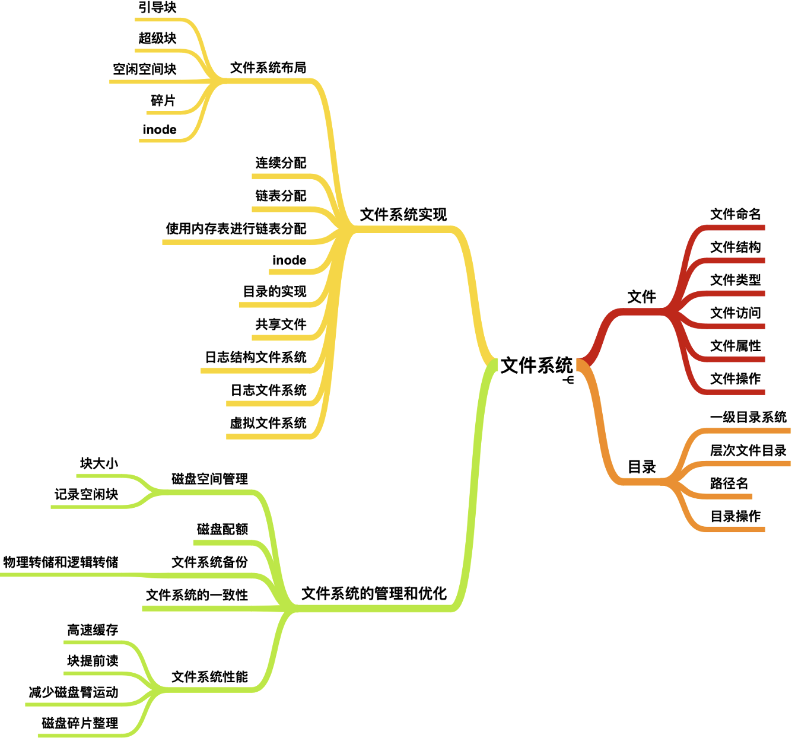
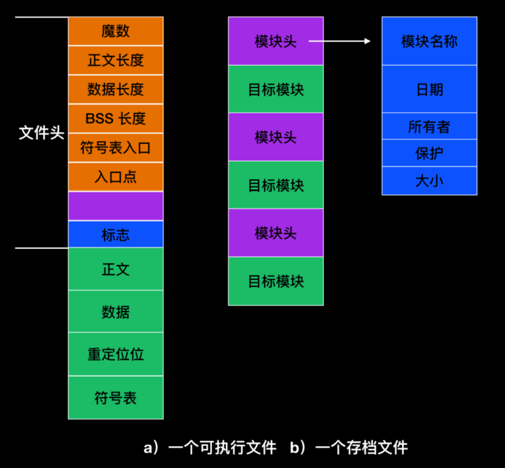
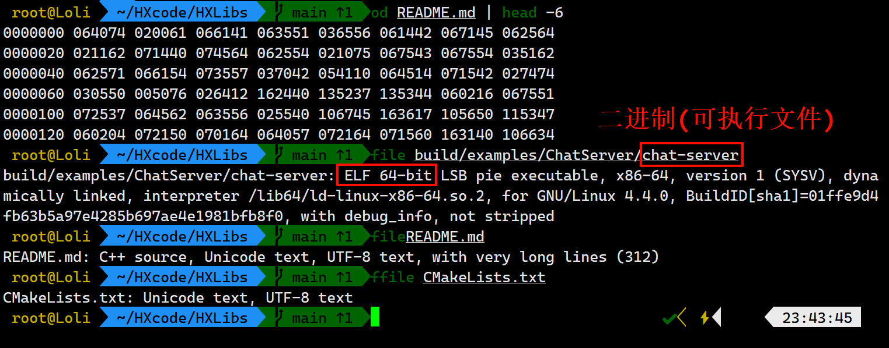

# 文件系统概述及文件概念
文件系统 (File System)

| ##container## |
|:--:|
||

## 一、文件
### 1.1 文件命名
- **文件名**: 由主文件名与扩展名组成, 常见格式如 `filename.ext`。
- **命名规则**: 遵循操作系统限制(如长度、特殊字符)。

> **常见文件系统**: 
> - FAT32: 兼容性强, 但不支持大于 4GB 的文件。
> - NTFS: 支持权限管理和日志功能, 适合现代操作系统。
> - EXT4: Linux 默认文件系统, 高效稳定。
> 
> **虚拟文件系统(VFS)**:
> - 屏蔽底层文件系统差异, 提供统一接口。

> [!TIP]
> 有的文件系统的文件名是区分不大小写的(如win)

### 1.2 文件结构
- **流式文件`字节序列`**: 一维字节序列(如文本文件)。
- **记录式文件`记录序列`**: 分为固定或可变长度记录(数据库文件常用)。
- **多层结构`树`**: 目录、索引、文件内容。

### 1.3 文件类型

| **文件类型**| **描述**| **示例** |
|:-:|-|-|
| **普通文件**| 包括文本文件和二进制文件, 存储数据或代码。| `.txt`, `.cpp`, `.exe` |
| **目录文件**| 文件系统中的目录, 用于组织文件和子目录。 | `/home/user/`|
| **符号链接文件**| 指向另一个文件或目录的快捷方式, 存储目标路径。| `ln -s target link_name` |
| **块设备文件**| 提供对设备的块级访问, 如磁盘和存储设备。 | `/dev/sda` |
| **字符设备文件**| 提供对设备的字符流访问, 如终端、打印机等。| `/dev/tty` |
| **管道文件**| 用于进程间通信, 数据单向流动。| FIFO: `mkfifo mypipe`|
| **套接字文件**| 支持网络通信或进程间双向通信的特殊文件。| `/var/run/docker.sock` |

值得注意的是, 一般的文件系统, 不像win一样, 双击, 然后调用一个程序, 然后通过文件后缀匹配打开方式.

而是有专门的内容记录着的, 比如UNIX系统中, 二进制文件包含内容如(a)所示:

| ##container## |
|:--:|
||
||
|查看文件类型描述|

### 1.4 文件访问
- **顺序访问**: 按顺序读写文件, 适合流式数据。
- **随机访问**: 通过偏移量直接访问任意位置, 常用 `seek()` 方法。
- **访问控制**: 权限模型(如 `rwx`, 读/写/执行)与访问控制列表(ACL)。

### 1.5 文件属性
- **基本属性**: 文件名、大小、创建/修改时间、权限。
- **扩展属性**: 与文件关联的元数据, 具体支持由文件系统决定(如 NTFS 的 ADS)。
- **隐藏属性**: 某些文件可被标记为隐藏, 在普通文件列表中不可见。

常用的属性: (一般os只会选一些比较重要的字段来实现...) 

| **属性**| **含义** |
|:-:|:-:|
| **保护** | 谁可以访问文件、以什么方式存取文件。 |
| **密码(口令)**| 访问文件所需要的密码(口令)。 |
| **创建者** | 创建文件者的 ID。|
| **所有者** | 当前所有者的 ID。|
| **只读标志** | `0` 表示读/写, `1` 表示只读。|
| **隐藏标志** | `0` 表示正常, `1` 表示文件不在列表中显示。|
| **系统标志** | `0` 表示普通文件, `1` 表示系统文件。|
| **存档标志** | `0` 表示已经备份, `1` 表示需要备份。|
| **ASCII / 二进制标志** | `0` 表示 ASCII 文件, `1` 表示二进制文件。 |
| **随机访问标志** | `0` 表示只允许顺序访问, `1` 表示随机访问。|
| **临时标志** | `0` 表示正常, `1` 表示进程退出时删除该文件。|
| **加锁标志** | `0` 表示未加锁, `1` 表示文件已加锁。|
| **记录长度** | 一个记录中的字节数。|
| **键的位置** | 每个记录中的键的偏移量。|
| **键的长度** | 键字段的字节数。|
| **创建时间** | 创建文件的日期和时间。|
| **最后一次存取时间** | 上一次访问文件的日期和时间。 |
| **最后一次修改时间** | 上一次修改文件的日期和时间。 |
| **当前大小** | 文件的字节数。|
| **最大长度** | 文件可能增长到的最大字节数。|

### 1.6 文件操作
- 文件操作相关的系统调用:

| **功能** | **描述**| **示例**|
|-|-|-|
| **Create(创建)** | 在文件系统中新建一个空文件, 并设置初始属性(如权限、所有者等)。 | Windows: `CreateFile` 函数 |
| **Delete(删除)** | 删除文件以释放存储空间。| Unix/Linux: `unlink` 函数或 `rm` 命令|
| **Open(打开)** | 在读取或写入文件之前, 将其打开, 加载属性和磁盘地址列表到主存。| C语言: `fopen` 函数|
| **Close(关闭)**| 关闭文件以释放表空间, 系统会强制将最后一块数据写入磁盘。| C语言: `fclose` 函数 |
| **Read(读取)** | 从文件当前位置读取指定数量的数据到缓冲区。| C语言: `fread` 函数|
| **Write(写入)**| 向文件写入数据, 支持覆盖或追加写入(取决于文件指针位置)。| C语言: `fwrite` 函数 |
| **Append(追加)** | 向文件末尾追加数据, 不影响其他内容。| C语言: 通过打开文件模式 `a` 实现 |
| **Seek(定位)** | 移动文件指针位置以实现随机访问, 从指定位置开始读写数据。 | C语言: `fseek` 函数|
| **Get Attributes** | 获取文件属性信息(如大小、创建时间、权限等)。| Windows: `GetFileAttributes` 函数|
| **Set Attributes** | 设置或更改文件的属性(如只读标志、隐藏标志等)。| Windows: `SetFileAttributes` 函数|
| **Rename(重命名)**| 更改文件名以方便管理。 | Unix/Linux: `rename` 函数或 `mv` 命令|

> [!TIP]
> 注意事项:
> 1. **及时关闭文件**: 系统对每个进程可打开的文件数量有限, 未关闭的文件可能占用资源。
> 2. **权限设置**: 某些文件操作(如删除、写入)需要具备相应的权限。
> 3. **随机访问**: 文件需支持随机访问才能使用 `Seek` 等定位操作。
> 4. **文件属性管理**: 获取或设置属性时, 需根据文件系统支持的功能实现。
