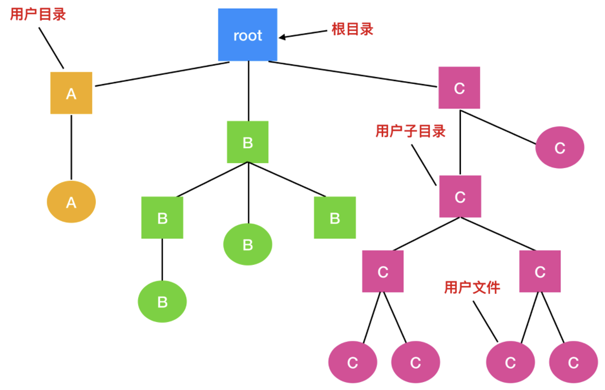
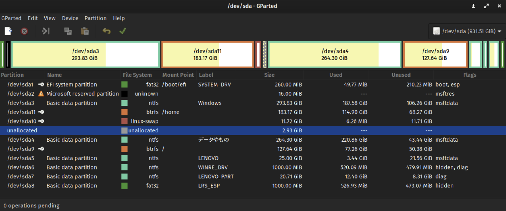
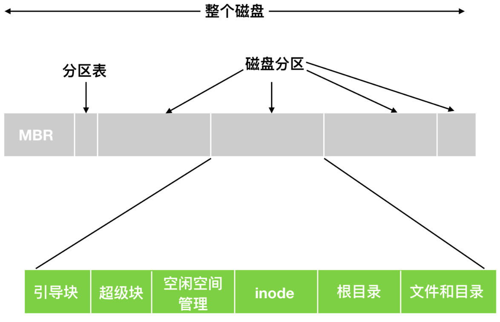
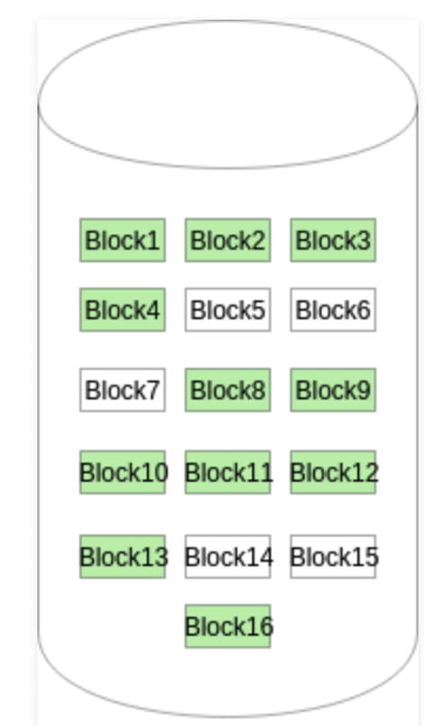
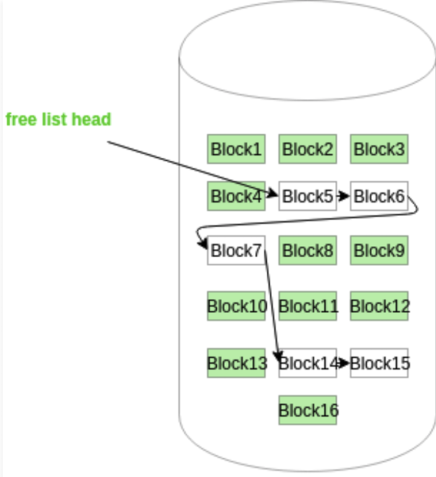
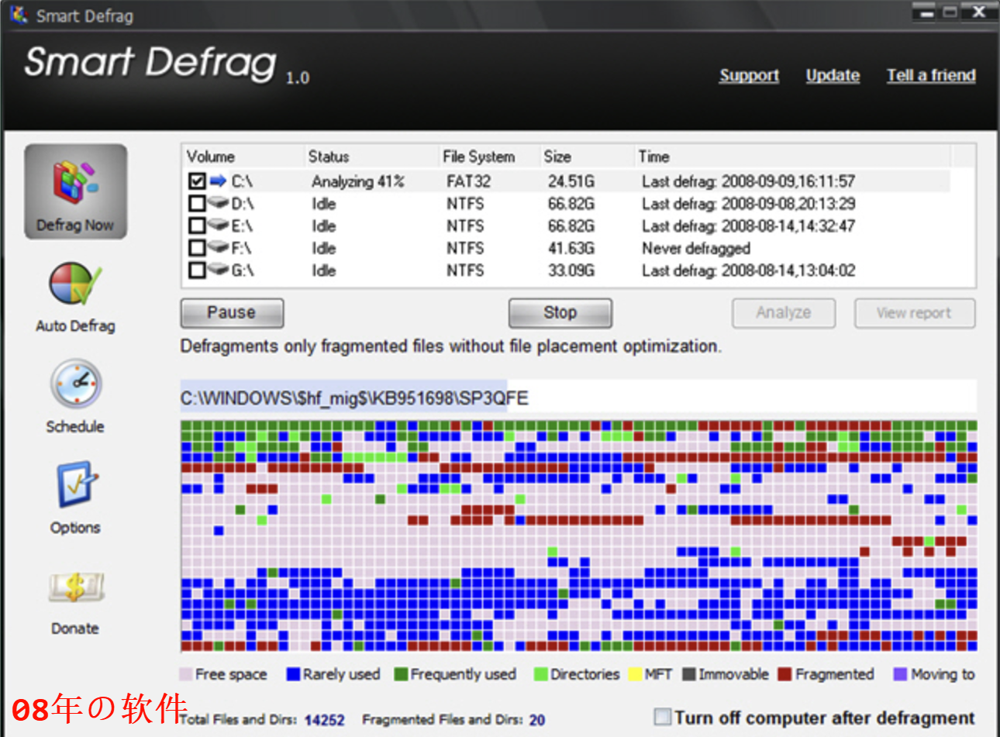

# 目录结构和文件系统结构
## 一、目录
文件系统普遍采用`目录(directories)`或`文件夹(folders)`的概念来记录和管理文件的位置。在许多系统中, 目录本身也被视为一种特殊的文件。

### 1.1 一级目录系统
目录系统的最基本形态是包含一个能够容纳所有文件的单一目录, 这个目录被命名为`根目录(root directory)`。在根目录的架构下, 由于其独一无二的地位, 其命名实际上并不重要, 因为它始终是文件系统的起点。

在早期的个人计算机时代, 这种简单的目录结构相当普遍, 这在很大程度上是因为当时的计算机系统往往只服务于单一用户。

这种设计的优势在于其简洁性, 以及文件定位的高效性。由于所有文件都集中在根目录下, 因此用户无需进行复杂的目录导航, 就能快速地找到目标文件。然而, 随着计算机系统的发展, 用户数量和文件数量的激增, 这种简单的目录结构逐渐无法满足实际需求。

尽管如此, 这种目录组织形式在现代仍然有其应用场景。例如, 在一些简单的嵌入式设备中, 如 **数码相机** 和某些便携式音乐播放器, 由于这些设备的存储空间有限, 且主要服务于单一用户或单一功能, 因此仍然采用这种简单的目录结构。在这些设备中, 用户无需在复杂的目录结构中寻找文件, 只需在根目录或有限的子目录中就能找到所需的图片、音乐等文件。

### 1.2 层次目录系统
对于简单的应用场景, 单层目录方式可能足够, 即将所有文件和文件夹都放在根目录下。然而, 这种组织形式并不适用于现代计算机, 因为现代计算机系统中通常包含成千上万个文件和文件夹。如果都放在根目录下, 不仅会导致目录变得极其庞大, 而且查找特定文件或文件夹也会变得非常困难。

为了解决这一问题, 人们设计出了`层次目录系统(Hierarchical Directory Systems)`, 也称为`目录树`。在层次目录系统中, 文件被组织在多个目录中, 这些目录可以进一步嵌套成子目录。通过这种方式, 可以用多个目录对文件进行分组, 使得文件系统更加有序和易于管理。这种方式的组织结构如下:

| ##container## |
|:--:|
||

进一步地, 如果多个用户共享同一个文件服务器, 比如在一个公司的网络系统中, 每个用户都可以为自己的目录树拥有一个私人根目录。这样, 每个用户都可以在自己的私人根目录下创建和管理自己的文件和文件夹, 而不会与其他用户的文件混淆。这种方式的组织结构不仅提高了文件系统的可扩展性, 还增强了文件的安全性。

现代文件系统通常都是按照层次目录系统的方式组织的, 这种方式使得文件系统更加有序、易于管理和扩展。

### 1.3 路径名
当目录树用于组织文件系统时, 需要采用特定方式来指明文件名。通常有两种常用的方法来实现这一目标。第一种方式是为每个文件分配一个`绝对路径名(absolute path name)`, 该路径名由根目录开始, 逐级指向目标文件。举例来说, 路径名`/usr/ast/mailbox`表示根目录下有一个名为`usr`的子目录, `usr`目录下又有一个名为`ast`的子目录, 而`ast`目录下则包含了一个名为`mailbox`的文件。绝对路径名总是以根目录符号`/`开头, 并且在文件系统中具有唯一性。

> [!NOTE]
> 在 UNIX 系统中, 路径的各个组件由斜杠`/`分隔。相比之下, 在 Windows 系统中, 路径分隔符为反斜杠`\`。而在 MULTICS 系统中, 路径分隔符则为大于号`>`。
> 
> ```C++
> Windows: \usr\ast\mailbox
> UNIX:    /usr/ast/mailbox // 一般记(用)这个
> MULTICS: >usr>ast>mailbox
> ```

无论采用哪种系统, 如果路径名的第一个字符是对应的路径分隔符(`/`、`\`、`>`), 则该路径名即为绝对路径名。

另外一种用于指定文件名的方法是采用“相对路径名(relative path name)”, 这种方法通常与“工作目录(working directory)”或“当前目录(current directory)”相结合使用。用户可以选择一个目录作为当前的工作目录, 随后在引用文件时, 可以使用相对于这个工作目录的路径。

---

尽管相对路径和绝对路径在表现形式上有所不同, 但它们所实现的功能是完全相同的。相对路径通过简化路径名的表示方式, 提高了用户在处理文件时的效率和便捷性。

在计算机文件系统中, 一些程序需要访问特定的文件, 而无需关心当前的工作目录。为了实现这一点, 程序会使用绝对路径名来定位文件。绝对路径名是从根目录开始, 依次经过各个子目录, 最终到达目标文件的完整路径。

大多数支持层次目录结构的操作系统中, 每个目录都包含两个特殊的目录项: `.`和`..`。`.`代表当前目录, 而`..`代表其父目录(在根目录中, `..`指向自身)。这些特殊目录项在文件路径的解析中起着重要作用。

### 1.4 目录操作
为了探讨目录管理系统调用的种类及其工作机制, 可以参考 UNIX 系统中的实践案例。以下是 UNIX 系统中用于管理目录的主要系统调用: 

1. 创建目录(`mkdir` 或 `create`)
    - 用途: 新建一个目录。
    - 特点: 新创建的目录包含两个特殊的目录项: 
      - `.`: 代表当前目录。
      - `..`: 代表父目录。
    - 这些特殊目录项是目录结构的基础, 通常不允许被删除。

2. 删除目录(`rmdir` 或 `delete`)
    - 用途: 移除一个目录。
    - 限制条件: 目录必须为空, 仅包含 `.` 和 `..` 时被视为空目录。
    - 注意: 即使删除目录, 这两个特殊目录项也不会被删除, 以保持目录结构的完整性。

3. 打开目录(`opendir`)
    - 用途: 在读取目录内容之前打开目录。
    - 作用: 如需列出某目录中的所有文件, 需先调用 `opendir` 打开目录。

4. 关闭目录(`closedir`)
    - 用途: 在完成目录内容的读取后, 关闭目录。
    - 功能: 释放内部表空间和其他相关资源。

5. 读取目录(`readdir`)
    - 用途: 返回打开目录中的下一个目录项。
    - 优势: 与早期的 `read` 系统调用相比, `readdir` 不需要程序员了解或处理目录的内部结构, 返回统一格式的目录项, 简化编程。

6. 重命名目录(`rename`)
    - 用途: 为目录更换新名称。
    - 特点: 目录的重命名方式与文件类似。

7. 创建硬链接(`link`)
    - 用途: 在多个目录中为同一文件创建链接。
    - 方法: 
      - 指定已存在的文件和一个新路径名。
      - 通过链接, 文件可以在多个目录中被访问。
    - 特性: 这种链接称为硬链接(Hard Link)。

8. 删除链接(`unlink`)
    - 用途: 删除一个目录项(即文件或目录的链接)。
    - 特性: 
      - 如果文件只有一个链接, 则删除该文件及其内容。
      - 如果文件有多个链接, `unlink` 仅删除指定路径名的链接, 而不影响其他链接。

## 二、文件系统的实现
> 在掌握了文件的基本概念之后, 我们的关注点将转向文件系统的具体“实现”层面。以往, 用户主要关注的是文件的命名规则、可执行的操作类型、目录树的结构, 以及如何准确地定位文件路径等问题。然而, 对于文件系统的设计人员而言, 他们更为关心的是文件和目录在物理存储层面的组织方式、磁盘空间的有效管理策略, 以及如何确保文件系统的高效顺畅运行。接下来, 我们将深入探讨这些核心议题。

### 2.1 文件系统布局
文件系统被存储在磁盘之中。磁盘通常可以划分为一个或多个区域, 这些区域被称为`磁盘分区(disk partitioning)`或`磁盘分片(disk slicing)`。每个分区都拥有独立的文件系统, 并且这些文件系统的类型可以各不相同。

在磁盘的起始位置, 即`0号扇区`, 存在一个特殊的区域叫做`主引导记录(Master Boot Record, MBR)`。MBR的主要职责是`引导(boot)`计算机启动。在MBR的末尾部分, 紧跟着一个`分区表(partition table)`, 该表详细记录了磁盘上每个分区的起始和结束地址。系统管理员会借助一种名为分区编辑器的工具来创建、调整大小、删除以及管理这些分区。然而, 传统的分区方式存在一个显著的缺陷: 调整分区大小的过程相对复杂且困难。这往往导致一种情况出现: 一个分区拥有大量的未使用空间, 而另一个分区则几乎被完全占用, 空间分配极不均衡。

> 例如, 假设我们有一个1TB的硬盘, 最初被划分为两个分区: C盘和D盘。随着时间的推移, C盘上的数据不断增长, 导致其空间变得紧张, 而D盘却还有大量的空闲空间。在这种情况下, 如果我们想要从D盘划分一些空间给C盘使用, 就需要进行复杂的分区调整操作, 这可能会涉及到数据的备份、恢复以及分区的重新划分, 过程繁琐且存在风险。

因此, 为了更加灵活地管理磁盘空间, 现代操作系统和磁盘管理工具开始支持更为先进的分区和卷管理技术, 如`动态磁盘(Dynamic Disks)`和`逻辑卷管理(Logical Volume Manager, LVM)`, 这些技术允许我们在不重新划分分区的情况下动态地调整卷的大小和分配。

| ##container## |
|:--:|
||

上图展示了一个使用 GParted 工具进行分区管理的计算机硬盘界面。在这个界面中, 我们可以看到多个分区, 它们都被视为“活动的(active)”, 意味着它们当前处于可用状态并可以被操作系统访问。

具体来说, 该硬盘(以`/dev/sda`标识)的总容量为931.51 GiB, 上面划分了多个分区, 每个分区都有自己独特的名称、文件系统类型、挂载点(Mount Point)、标签(Label)、大小、已使用空间和未使用空间等信息。例如, `/dev/sda1`是一个EFI系统分区, 采用fat32 文件系统, 挂载在`/boot/efi`目录下, 标签为`SYSTEM_DRV`, 大小为260.00 MiB, 其中已使用49.77 MiB, 未使用210.23 MiB, 并且被标记为`boot`和`esp`, 这表明它是用于启动系统的关键分区。

以下为流程图:

$$
计算机启动 (BIOS) \\
\downarrow \\
读取 MBR (/dev/sda) \\
\downarrow \\
\text{分区表加载成功？} \\
\begin{cases}
\text{是:} & \text{加载操作系统} \\
& \downarrow \\
& \text{加载用户数据和应用程序} \\
\text{否:} & \text{显示错误信息} \\
\end{cases}
$$

### 2.2 引导块
在计算机启动的过程中, MBR(主引导记录)扮演着至关重要的角色。其首要任务是“确定活动分区”。在这一步骤中, MBR会识别并选定一个特定的分区作为启动分区, 这个分区通常被称为活动分区。紧接着, MBR会读取该活动分区的第一个块, 这个块被专门称为“引导块(boot block)”。

引导块, 作为文件系统的起始部分, 占据了前4096个字节的空间, 从磁盘的字节偏移量0处开始。这个区域的重要性不言而喻, 因为它包含了用于启动操作系统的关键程序。当MBR成功读取并执行引导块中的程序时, 这些程序会进一步加载并运行活动分区中的操作系统。

值得注意的是, 为了确保文件系统的一致性, 每个分区都会从引导块开始布局。这意味着, 即使某个分区的引导块并不包含操作系统(例如, 它可能是一个数据分区), 该分区仍然会保留这个引导块的结构。这样的设计有助于简化磁盘管理和维护, 因为系统可以统一地处理所有分区, 而无需区分它们是否包含操作系统。

> 举例来说, 在一个安装了Windows和Linux双系统的计算机上, MBR会识别并选择一个活动分区来启动。如果选择了Windows作为活动分区, 那么MBR会读取并执行Windows分区中的引导块, 进而加载并启动Windows操作系统。同样地, 如果选择了Linux作为活动分区, 那么MBR会执行Linux分区中的引导块来启动Linux。

磁盘分区的布局并非一成不变, 而是会根据所采用的文件系统类型有所差异。不过, 它们通常都会遵循一个共同的起始点——引导块。紧接着引导块之后的关键组成部分是“超级块(Superblock)”。

| ##container## |
|:--:|
||
|文件系统布局|

### 2.3 超级块

超级块是一个重要的数据结构, 占据磁盘上字节偏移 4096 开始的 4096 字节区域。它存储了文件系统的核心参数, 是文件系统正常运行的关键。

超级块包含的信息: 
1. **文件系统的大小**: 指明文件系统的总容量, 例如支持 1TB 存储空间。
2. **数据块总数**: 记录文件系统中数据块的数量, 用于数据存储和管理。
3. **文件系统状态标志**: 指示当前状态(如已满、只读), 提供文件系统健康状况的反馈。
4. **分配组大小**: 记录分配组的大小, 以优化文件存储和检索效率。

**超级块的作用**:
- 当计算机启动或文件系统挂载(mount)时, 超级块会被加载到内存。操作系统通过解析其中的信息, 了解文件系统的结构和参数, 从而实现高效的存储管理。

> 例如, Linux 在挂载 ext4 文件系统时会读取超级块, 了解文件系统的容量、数据块数量、状态标志和分配组大小等信息。在此基础上, 操作系统能够实现文件的创建、删除、读取和写入等操作。

### 2.4 空闲空间块
接着是文件系统中空闲块的信息, 在文件系统中, 关于“空闲块”的信息是至关重要的, 它帮助系统追踪哪些磁盘块是可用的, 哪些已经被分配。为了有效地管理这些信息, 文件系统可以采用多种数据结构, 其中位图(BitMap)或位向量(Bit vector)是两种常见的方法。

位图或位向量由一系列位(bit)组成, 每个位都对应一个磁盘块。这些位可以取两个值: 0或1。在位图中, `0`通常表示对应的磁盘块 **已被分配**, 而`1`则表示该磁盘块是**空闲的**。这种表示方法简洁明了, 非常适合用于快速查找和标记空闲块。

以下是一个具体的例子来说明位图的应用。假设我们有一个包含16个磁盘块的磁盘(如图片所示, 这些磁盘块被标记为Block1到Block16)。如果其中一些磁盘块已经被分配(在图片中以绿色标签表示), 而其他磁盘块仍然是空闲的, 那么我们可以使用一个16位的位图来表示这个状态。

| ##container## |
|:--:|
||

例如, 假设Block1、Block2、Block9、Block10、Block13和Block14已经被分配, 而其他磁盘块都是空闲的。那么, 这个状态可以用以下的16位位图来表示: 0000 1110 0000 0110。在这个位图中, 前两位是0(表示Block1和Block2已被分配), 接下来的四位是1110(表示Block3、Block4、Block5和Block6是空闲的), 以此类推。

通过这种方法, 文件系统可以快速地查询和更新空闲块的信息, 从而确保磁盘空间的有效利用。位图或位向量的使用不仅提高了文件系统的性能, 还简化了空闲块的管理过程。

---

**使用链表进行管理**

在磁盘空间管理中, 一种高效的方法是采用空闲块链表。这种方法中, 空闲的磁盘块被链接在一起, 形成一个链表结构。每个空闲块都包含一个指向下一个空闲块的指针, 从而形成一个连续的链。

链表的起始点, 即第一个空闲块, 其块号被特别存储在磁盘上的一个独立位置。这个位置通常是文件系统的元数据区, 用于记录文件系统的关键信息。此外, 为了提高访问速度, 这个块号还会被缓存在内存中。当系统需要分配或释放磁盘空间时, 可以直接从内存中访问这个块号, 从而快速定位到链表的起始点。

| ##container## |
|:--:|
||

假设我们有一个磁盘, 其上分布着多个磁盘块, 分别标记为'Block1'、'Block2'、'Block3'等。在磁盘的某个位置, 我们存储了第一个空闲块的块号, 比如说是'Block1'。同时, 这个块号也被缓存在内存中。

现在, 'Block5'作为链表的起始点, 它包含一个指向下一个空闲块的指针, 比如说
是'Block6'。'Block6'又包含一个指向'Block7'的指针, 以此类推。这样, 就形成了一个由空闲块组成的链表。

空闲块链表是一种高效管理磁盘空间的方法。它通过将空闲块链接在一起, 形成了一个连续的链表结构, 从而方便系统快速定位和分配空闲块。

### 2.5 碎片
在探讨数据存储和管理时, 我们不得不提及一个关键概念——“碎片(fragment)”, 也被称为片段。碎片通常指的是那些零散分布的单个数据单元。在磁盘存储的上下文中, 磁盘块可以被进一步划分为固定大小的分配单元, 而碎片则是指那些由于文件被分割存储而在驱动器上不相邻的文件片段。

假设你正在使用一台Windows电脑, 并创建了一个新的文件。这个文件可以被你保存在任何位置, 比如桌面、磁盘中的某个文件夹, 或者其他任何你指定的地方。你可以自由地打开、编辑、删除这个文件, 而无需关心其底层的存储细节。

然而, 文件的存储并不像我们想象的那样简单。由于磁盘空间的分配和管理机制, 硬盘驱动器可能会将文件的不同部分存储在不同的区域。这意味着, 即使你看到一个完整的文件, 它的各个部分可能实际上分散在硬盘的不同位置。

当你需要打开这个文件时, 硬盘驱动器会迅速地进行一系列操作, 将这些分散的文件片段汇总在一起, 以便你的计算机系统可以像处理一个完整文件那样来处理它。这个过程通常被称为“**文件碎片整理**”, 尽管在现代操作系统中, 文件的读取和写入操作通常是由文件系统自动管理的, 用户无需手动进行碎片整理。

文件碎片可能会对系统的性能产生负面影响。当文件被分散存储在多个位置时, 硬盘驱动器需要花费更多的时间来定位和读取这些片段, 从而导致文件访问速度变慢。因此, 一些操作系统提供了碎片整理工具, 用于定期将分散的文件片段重新组织在一起, 以提高系统的整体性能。

| ##container## |
|:--:|
||

### 2.6 inode
在文件系统中, `inode(index node)`, 也被称为索引节点, 扮演着至关重要的角色。它是一个复杂的数据结构, 通常以数组的形式存在, 每个文件在文件系统中都对应着一个唯一的inode。inode的重要性不言而喻, 因为它详细记录了文件的各项属性和信息。

具体来说, 每个索引节点(inode)都存储着与其关联的对象数据的属性, 以及这些数据在磁盘上的块位置。这些属性包括但不限于: 

- **模式/权限(保护)**: 这决定了文件的访问权限, 比如哪些用户或组可以读取、写入或执行该文件。

- **所有者ID**: 这标识了文件的拥有者, 通常是一个用户账号。

- **组ID**: 这标识了文件所属的组, 组内的用户可能拥有特定的访问权限。

- **文件大小**: 这表示文件占用的磁盘空间大小。

- **文件的硬链接数**: 这表示链接到该文件的硬链接数量。当硬链接数为0时, 文件将被删除。

- **上次访问时间**: 这记录了文件最后一次被访问的时间。

- **最后修改时间**: 这记录了文件内容最后一次被修改的时间。

- **inode上次修改时间**: 这记录了inode本身最后一次被修改的时间, 比如权限或属性的更改。

要查找系统中的inode, 可以使用`ls -lai`命令。这个命令会列出当前目录下的所有文件和目录, 包括它们的inode号、权限、所有者、组、大小、链接数以及时间戳等信息。

```sh
 root@Loli  ~/HXcode/HXLibs   main  ls -lai
total 36
 74489 drwxr-xr-x 1 root root   242 Jan 18 16:32 .
 74077 drwxr-xr-x 1 root root   362 Jan 13 14:56 ..
313408 drwxr-xr-x 1 root root   258 Jan 18 20:41 build
 74539 drwxr-xr-x 1 root root    62 Oct 17 13:35 certs
252351 drwxr-xr-x 1 root root   200 Jan 13 23:40 cmake
 74540 drwxr-xr-x 1 root root   100 Jan 10 16:30 documents
```

文件在文件系统中的存储结构通常分为两部分: `索引节点(inode)`和`块(block)`。一旦文件被创建, 其包含的块数就是固定的。这意味着, 我们不能在现有的分区上增加inode的数量, 也不能增加磁盘块的数量(除非进行分区扩展或重新格式化)

紧跟在inode结构之后的是`根目录(root directory)`。根目录是文件系统目录树的起点, 它包含了指向其他所有目录和文件的指针。换句话说, 根目录是文件系统的“入口点”, 通过它可以访问到文件系统中的所有内容。

最后, 磁盘的剩余部分用于存放除根目录以外的其他所有目录和文件。这些目录和文件通过链表等数据结构相互连接, 形成了一个庞大的文件系统网络。

<details>
<summary>Inode Table 与 Data Blocks:</summary>

> ### Inode Table 与 Data Blocks
> 
> 在磁盘存储系统中, 文件由两部分组成: **文件属性**和**文件数据**。
> 
> - **Inode Table**: 存放文件的属性信息。
> - **Data Blocks**: 存储文件的具体数据。
> 
> #### Data Blocks
> 
> Data Blocks 是文件的实际存储区域, 由多个数据块组成, 每个数据块都有唯一编号。所有数据块共同构成文件的内容。
> 
> #### Inode Table
> 
> Inode Table 是一个索引表, 每个 inode(索引节点)记录了一个文件的属性信息, 包括: 
> 
> - 文件大小
> - 文件权限
> - 所有者等属性
> 
> #### Inode 的工作原理
> 
> 1. **创建文件**: 
> 
>    - 系统找到一个空闲的 inode, 并将文件属性填充到该 inode 中。
>    - 向文件写入数据时, 系统找到一个空闲数据块, 将数据写入, 并将 inode 与数据块关联。
> 
> 2. **关联方式**: 
> 
>    - inode 结构体中维护一个指向数据块的指针数组(blocks 数组)。
>    - blocks 数组记录了与 inode 关联的所有数据块编号。
> 
> 3. **唯一标识**: 
> 
>    - 每个文件都有唯一的 inode 编号, 是文件的真正标识。
>    - 即使文件名改变或删除, 只要 inode 编号未变, 文件内容仍可访问。
> 
> #### 文件访问流程
> 
> 1. 系统根据文件的 inode 编号, 在 inode Table 中找到对应的 inode。
> 2. 通过 inode 的 blocks 数组找到关联的数据块编号。
> 3. 在 Data Blocks 中找到对应的数据块并读取内容。
> 
> #### 动态扩展机制
> 
> - 当 blocks 数组空间不足时, 系统通过链接等方式扩展数组容量, 以支持更多数据块。
> - 这种机制增加了复杂性, 但提高了文件存储的灵活性。

</details>