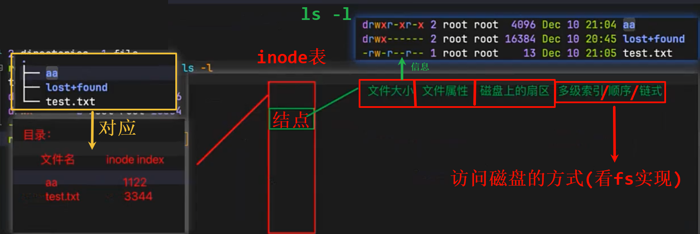
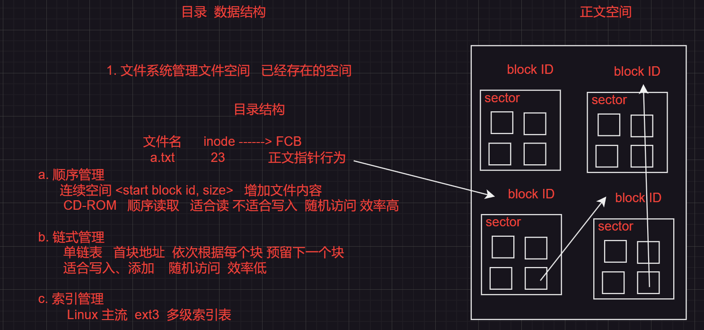
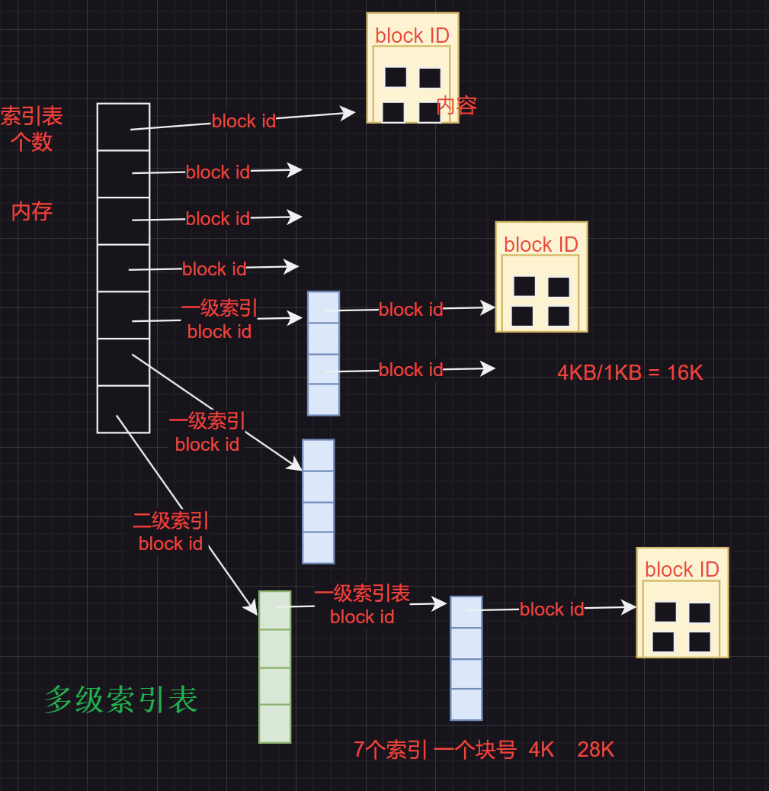
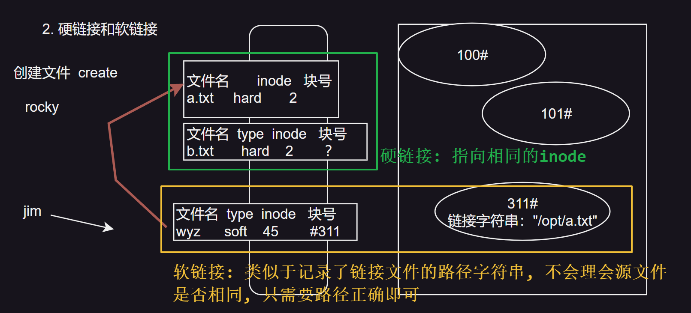
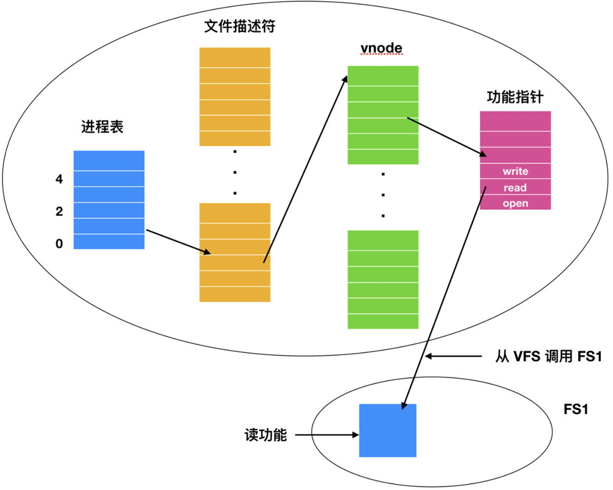

# 文件系统实现
“磁盘 -> 低级格式化 -> 扇区（sector）”

“分区 -> 分区表”

“高级格式化 —— 文件系统格式”

“挂载   mount”

| ##container## |
|:--:|
||
|**文件名 → inode 索引 → inode 表 → 文件数据块** 的访问过程|

## 一、文件系统实现策略

| ##container## |
|:--:|
||

| ##container## |
|:--:|
||

学过B、B+树的应该能理解.

## 二、软、硬链接

| ##container## |
|:--:|
||

- **硬链接**：指向相同的 inode，这意味着两个文件（如 a.txt 和 b.txt）共享相同的数据块（即相同的 inode）。因此，它们的内容完全相同，删除任何一个文件并不会影响另一个文件的数据，因为它们指向的是相同的 inode。(类比于C++智能指针`shared_ptr`, 多个`硬链接`, 就是多个智能指针, 但是他们指向的数据块是一样的; 只有引用计数为零, 才是真正的`删除`数据(当然, 只是无法访问, 之后数据块会复用, 然后被覆盖))

- **软链接**：也叫符号链接，它不是直接指向 inode，而是保存目标文件的路径。例如，wyz 是一个软链接，指向`/opt/a.txt`。删除软链接不会影响源文件，而源文件删除后，软链接会失效。

刚学的`硬链接`, 马上就可以用上了, wc: [【看番教程】片库上视频刮削不到？超详细高效规范化教程！](https://www.bilibili.com/video/BV12u411H7ya)

## 三、日志结构文件系统
技术的不断进步对当前的文件系统构成了显著的压力。在这种背景下，CPU 的性能持续提升，磁盘的容量不断增大且价格日益亲民，然而其寻道时间（固态硬盘因无机械结构而无需寻道时间）并未得到显著改善。与此同时，内存容量也呈现出指数级的增长态势。

这一系列因素共同作用，导致许多传统文件系统中出现了性能瓶颈。为了应对这一挑战，Berkeley 的研究团队设计了一种创新的文件系统——`日志结构文件系统（Log-structured File System, 简称 LFS）`，以期缓解这些性能问题。

日志结构文件系统由 Rosenblum 和 Ousterhout 在90年代初首次提出，其设计初衷是为了解决以下几个关键问题:

1. **不断增长的系统内存**：随着内存容量的不断增加，文件系统需要更有效地利用这些资源，以提高整体性能。

2. **顺序I/O性能优于随机I/O性能**：现代磁盘的读写性能在顺序访问时明显优于随机访问。LFS 通过优化数据布局，使得更多的操作能够以顺序方式进行，从而提高了磁盘的利用率和性能。

3. **现有文件系统的低效率**：传统的文件系统在数据管理和访问方面存在诸多不足，如碎片化、元数据管理复杂等问题。LFS 通过采用全新的数据组织方式，简化了文件系统的结构，提高了数据访问的效率。

4. **文件系统不支持RAID（虚拟化）**：在当时，许多文件系统并不支持RAID技术，这限制了数据冗余和容错能力的提升。虽然LFS本身并不直接提供RAID功能，但其设计思想为后续的文件系统提供了灵感，推动了文件系统在数据冗余和容错方面的进步。

日志结构文件系统（LFS）设计的核心目标是**减少硬盘的随机写入操作**，从而提高文件系统的性能，尤其是在缓存机制（Page cache）的帮助下，大部分读取操作可以通过内存访问，而不再依赖磁盘的随机读。LFS的创新之处在于，尽管它在结构上保留了UNIX文件系统的传统 inode 设计，但其存储方式与传统文件系统有显著不同。

在LFS中，**inode不再存储在固定位置，而是分散存储在整个日志中**，这样增加了直接定位inode的复杂性。为了解决这一问题，LFS引入了`inode map`机制，它通过一个索引结构记录每个 inode 在日志中的位置，这使得系统能够高效地定位 inode，并且通过将`inode map`缓存在 **内存** 中，进一步提升了访问速度，减少了磁盘访问。

> LFS的核心数据结构包括：inode、inode map、segment 和 segment usage table。inode 存储文件的元数据，inode map 用于快速查找 inode 位置，segment 是数据的基本存储单元，而 segment usage table 则跟踪每个segment的使用状态。
>
> 当文件被创建时，LFS将分配一个新的 inode，并将其存储在 inode map 中，同时为文件的数据分配一个segment。随着文件系统的使用，新的写入操作以顺序方式被追加到日志末尾，避免了传统文件系统的磁盘碎片问题。
>
> 为了处理磁盘空间有限的问题，LFS设计了清理（Clean）线程来回收不再使用的空间。清理线程扫描日志中的无效数据并将其移除，将仍然有效的数据压缩到新的segment中，从而释放空间供新的数据写入。这个清理过程使得LFS能够持续高效地运行，并提高了磁盘空间的利用率。

总体来说，LFS通过引入顺序写入、日志管理、清理线程等机制，显著减少了磁盘的随机写入操作，提升了文件系统的性能和空间管理效率。

## 四、日志文件系统
日志文件系统是一种通过将文件系统操作记录为**事务日志**的方式来管理数据的文件系统，其主要目标是提高数据的可靠性和一致性，尤其是在系统崩溃或意外断电的情况下。

核心思想

- 日志文件系统的核心思想是**写前日志（Write-Ahead Logging）**，即在执行实际文件操作前，先将相关操作记录到一个日志区域中。只有当日志的写入被确认后，才会执行实际的数据写入操作。这样，即使发生系统崩溃，文件系统也可以通过回溯日志来恢复未完成的操作，确保数据的一致性。

工作流程：
1. **记录操作**：文件系统的所有写操作（如创建文件、修改文件内容等）首先记录到日志文件中，这一过程是顺序写入，效率较高。
2. **提交事务**：当一组操作记录完整后，日志会标记为已提交。
3. **实际写入**：随后，系统会将操作应用到文件系统的实际数据区域。
4. **清理日志**：当这些操作被成功写入到主文件系统后，相关日志记录会被标记为完成，从而可以被覆盖或清除。

优点：
1. **高可靠性**：由于日志的存在，即使系统在中途崩溃，也可以通过回放日志来恢复数据，确保一致性。
2. **减少碎片化**：写操作可以顺序记录到日志中，减少随机写造成的性能损失。
3. **快速恢复**：崩溃后只需处理未完成的事务日志，而无需扫描整个文件系统。

局限性：
1. **额外开销**：日志写入会占用磁盘空间，并引入一定的性能开销。
2. **复杂性**：日志管理需要额外的逻辑来追踪事务状态以及清理过期的日志。
3. **性能瓶颈**：尽管顺序写日志性能较高，但频繁的日志写入和主数据写入之间的同步可能会影响整体性能。

> 例如，用户修改一个文件时：
> 1. 系统会将此次修改的内容、文件位置等信息记录到日志中。
> 2. 日志写入完成后，才会对实际数据进行修改。
> 3. 如果系统崩溃，重启后可以通过日志记录恢复此次修改，保证文件系统一致性。

对比日志结构文件系统（LFS）

- 日志文件系统关注的是数据的一致性和可靠性，记录的是操作本身，事务完成后实际数据会写入原始位置；而日志结构文件系统（LFS）则将所有写入操作以日志形式组织，日志本身就是数据存储的核心，重视顺序写入和性能优化。

日志文件系统通过引入事务日志，显著提高了文件系统的可靠性和一致性。它特别适用于高可靠性要求的场景，如数据库存储和关键系统文件的管理。尽管有一定的性能开销，但其崩溃后的快速恢复能力使其在现代操作系统中广泛应用。

## 五、虚拟文件系统
因为不同的文件系统, 使用的api是不同的, 而程序开发不可能关注如此细节的东西.

因此我们引入了一个`代理中间层`, 以提供一个统一的接口, 以访问不同的文件系统.

而这个文件系统就是`虚拟文件系统(VFS)`:

| ##container## |
|:--:|
||
