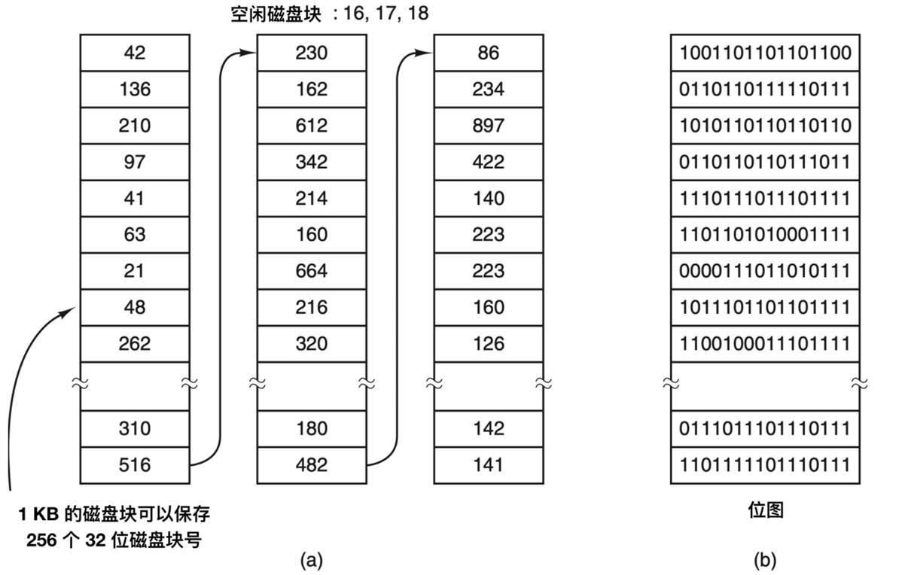
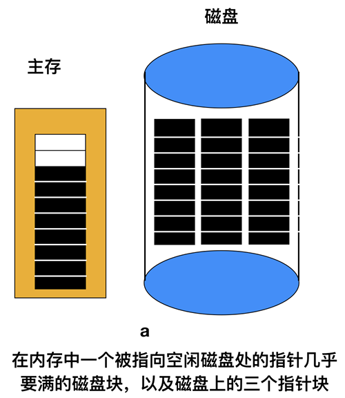
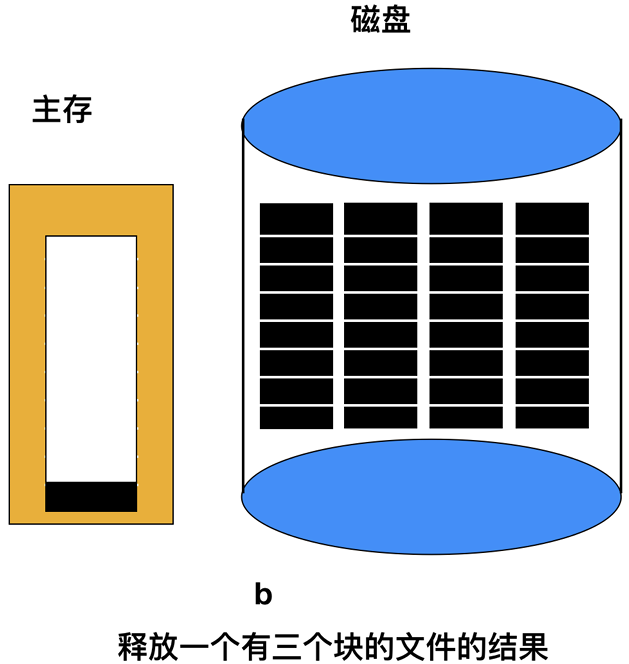
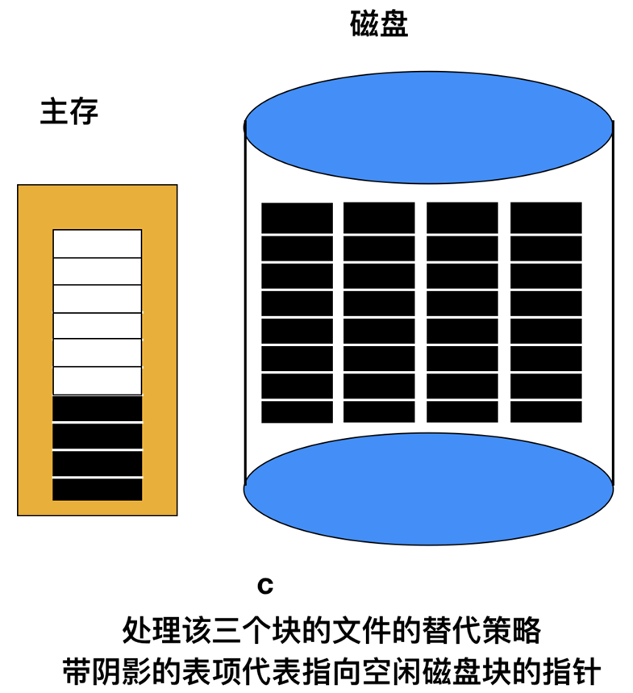
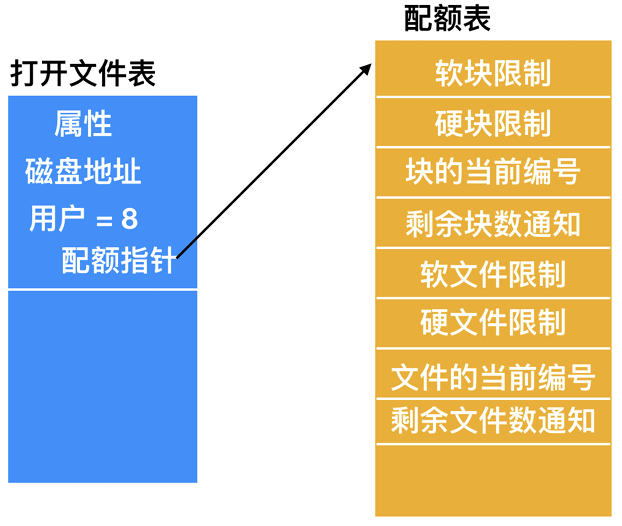
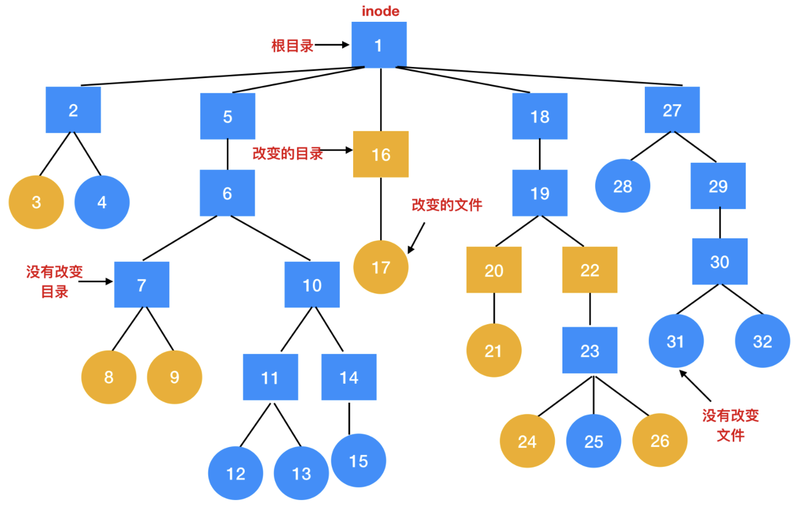
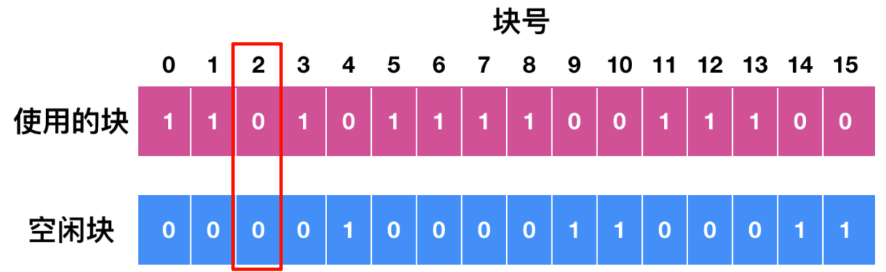
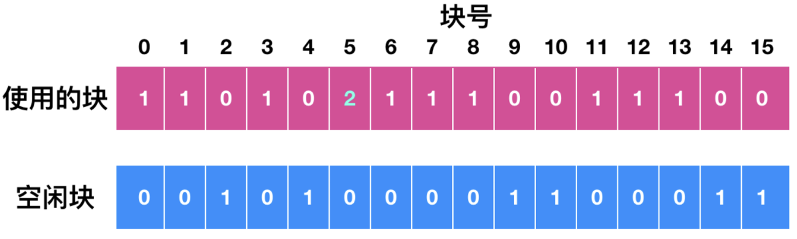
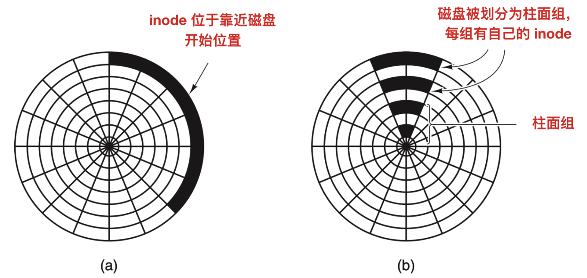

# 空闲空间管理及文件系统优化
能用与好用, 是两回事. 因此让我们来学学FS的优化吧.

## 一、磁盘空间管理
文件存储于磁盘之上，其空间管理策略成为操作系统设计中的一个核心考量。在文件存储方面，存在两种主要策略：一是为文件分配一段连续的n个字节的磁盘空间，另一种则是将文件分割为多个可能并不连续的块进行存储。这两种策略在存储管理系统中分别对应着`分段管理`与`分页管理两`种方式。

当我们采用`连续字节序列`存储文件时，一个显而易见的问题是，随着文件的增大，可能会遇到磁盘空间不足的情况，这时就可能需要移动文件以腾出连续的空间。同样的问题也存在于内存中的分段管理，但不同的是，内存中的段移动操作相较于磁盘上的文件移动要迅速得多。因为磁盘的读写速度远低于内存，所以磁盘上的文件移动操作会耗费更多的时间，并可能带来性能上的瓶颈。

为了规避这一问题，几乎所有的现代文件系统都选择了将文件分割为固定大小的块（或称为页）进行存储，即采用了`分页管理`的方式。这种方式允许文件块分散存储在磁盘的不同位置，从而提高了磁盘空间的利用率，并减少了因文件扩大而需要移动整个文件的概率。

> 举例来说，假设我们有一个正在不断增长的日志文件，如果采用连续空间分配策略，那么每当文件增大到一定程度，就可能需要在磁盘上为其寻找新的连续空间，并移动文件。而如果采用分页管理策略，我们可以将日志文件分割为多个固定大小的块，这些块可以随着文件的增长而动态地添加到磁盘上，而无需移动整个文件。

### 1.1 块大小
在将文件分割为固定大小的块进行存储时，一个关键的问题在于如何确定这些块的大小。选择块大小的依据主要源于磁盘的组织方式，其中扇区、磁道和柱面均可作为潜在的分配单位。而在分页系统中，分页大小则成为影响块大小的主要因素。

### 1.2 记录空闲块
一旦指定了块大小，下一个问题就是怎样跟踪空闲块。有两种方法被广泛采用，如下图所示:

| ##container## |
|:--:|
||

在确定了块大小之后，接下来的关键问题是如何有效地跟踪和管理空闲块。当前，有两种主流方法被广泛采纳以实现这一目标。

第一种方法是利用`磁盘块链表`。在这种方法中，链表的每一个块都尽可能地包含多个空闲磁盘块的编号。

> 以1KB大小的块和32位的磁盘块号为例，每个空闲块在链表中可以存储多达255个（由于需要保留一个位置给链表指针或其他管理信息，所以实际存储的块号会少于256个，这里简化为255个进行说明）空闲块的编号。
>
> 让我们以一个1TB的硬盘为例来进行具体说明。1TB的硬盘大约包含十亿个磁盘块（假设每个块大小为1KB）。为了存储所有这些空闲块的编号，如果我们采用上述的磁盘块链表方法，并且每个空闲块可以存储255个块号，那么理论上我们需要将近400万个块（10亿/255，结果向上取整）来存储所有的空闲块信息。然而，值得注意的是，这些用于存储空闲列表的块本身也是空闲的，它们在未被用作其他数据存储时，才用于保存空闲块的信息。

这种方法的优点在于其灵活性和可扩展性。随着硬盘容量的增加，我们只需要相应地增加更多的块来扩展空闲列表，而无需对现有的数据结构进行重大的修改。然而，它也存在一定的挑战，比如如何高效地管理和维护这个庞大的链表，以及在磁盘空间碎片化严重时如何快速找到连续的空闲块等。

---

另一种管理磁盘空闲空间的技术是`位图(bitmap)`方法。在这种方法中，一个包含n位的位图被用来表示一个拥有`n`个块的磁盘的空闲状态。在位图中，空闲的块被标记为`1`，而已被分配的块则被标记为`0`。

> 为了更具体地说明这一点，我们可以考虑一个1TB的硬盘，假设每个块的大小为1KB（这是为了简化计算，实际情况可能有所不同）。在这种情况下，1TB的硬盘大约包含10亿个块，因此我们就需要一个包含10亿位的位图来表示这些块的状态。由于每个位只占用1比特（bit），所以整个位图大约需要125MB（10^9位 / 8位/字节 * 1024字节/KB * 1024KB/MB，结果向下取整到最接近的MB数）的存储空间，如果以1KB的块为单位来计算，则需要大约131,072个块（125MB / 1KB，结果向上取整到最接近的块数）来存储这个位图。

与32位链表模型相比，位图方法在空间占用上具有显著优势。在链表模型中，每个块需要32位（或更多）来存储指向下一个空闲块的指针，而在位图中，每个块的状态仅用1位来表示。因此，对于大量的块来说，位图方法可以显著减少所需的存储空间。

然而，位图方法也有其局限性。如果磁盘上的空闲块是长期连续的，那么使用空闲列表来记录连续的分块而不是单个的块可能会更加高效。在这种情况下，每个块可以使用8位、16位或32位的计数器来与每个块相关联，以记录连续空闲块的数量。这种方法的最佳情况是，整个空闲区域可以用两个数字来表示：**第一个空闲块的地址和空闲块的计数**。

但是，如果磁盘严重碎片化，那么跟踪连续分块可能会比跟踪单个分块更加低效。这是因为不仅需要存储空闲块的地址，还需要存储连续空闲块的数量。在碎片化严重的情况下，连续空闲块的数量可能会很少，甚至不存在，这会导致存储和搜索空闲块的信息变得更加复杂和耗时。

---

现在，让我们重新聚焦于`空闲链表`的管理方法，该方法在内存中仅维护一个指针块。这一设计旨在高效地管理和追踪磁盘上的空闲空间。

当系统需要创建一个新文件时，它会从 **内存** 中的这个指针块中分配所需的磁盘块。这些磁盘块原本处于空闲状态，现在被标记为已分配，并用于存储文件数据。随着文件的创建和数据的写入，指针块中的空闲块数量会逐渐减少。

当内存中的指针块用尽，即所有记录的空闲块都已被分配时，系统会从磁盘上读取下一个指针块到内存中。这个新读取的指针块同样包含了一系列空闲磁盘块的地址，系统可以继续从中分配块以满足新的文件创建需求。

类似地，当文件被删除时，其占用的磁盘块将被释放并重新标记为空闲。这些被释放的块随后会被添加到内存中的指针块中，以便后续的文件创建或数据写入操作可以重新使用它们。

当内存中的指针块因添加了大量释放的块而变得几乎填满时，为了保持内存使用的效率，系统会将这个指针块写回磁盘，并可能将其与磁盘上的其他指针块进行合并或优化，以减少碎片和提高查找效率。同时，系统会读取一个新的或经过优化的指针块到内存中，以继续管理空闲空间。

这种空闲链表的管理方法通过动态地在内存和磁盘之间移动指针块，实现了对磁盘空闲空间的高效管理和追踪。它允许系统在创建和删除文件时灵活地分配和释放磁盘块，从而确保了磁盘空间的充分利用和性能的优化。

> 例如，在一个大型的文件系统中，可能会有成千上万的磁盘块和复杂的空闲空间分布。通过空闲链表的方法，系统可以快速地找到并分配空闲块给新文件，同时确保在文件删除后能够迅速回收并重用这些块。这种灵活性对于维护文件系统的性能和稳定性至关重要。

在某些特定的情况下，这个方法导致了不必要的磁盘 IO，如下图所示:

| ##container## |
|:--:|
||

上面内存中的指针块仅有两个空闲块，如果释放了一个含有三个磁盘块的文件，那么该指针块就会溢出，必须将其写入磁盘，那么就会产生如下图的这种情况。

| ##container## |
|:--:|
||

如果现在写入含有三个块的文件，已满的指针不得不再次读入，这将会回到上图 a 中的情况。如果有三个块的文件只是作为临时文件被写入，在释放它时，需要进行另一次磁盘写操作以将完整的指针块写回到磁盘。简而言之，**当指针块几乎为空时，一系列短暂的临时文件可能会导致大量磁盘 I/O**。

避免大部分磁盘 I/O 的另一种方法是拆分完整的指针块。这样，当释放三个块时，变化不再是从 a - b，而是从 a - c，如下图所示:

| ##container## |
|:--:|
||

现在，让我们详细阐述这种优化系统处理临时文件的策略，该策略旨在 **最大限度地减少磁盘I/O操作**。系统能够处理一系列临时文件操作，而无需立即进行磁盘读写，这是通过高效管理内存和磁盘上的指针块来实现的。

当系统内存中的指针块达到容量上限时，系统会将其内容写入磁盘，以释放内存空间。同时，当磁盘上存在半满的指针块时，系统会将其读入内存，以备后续使用。这种策略的核心思想是：尽量保持**磁盘上的指针块处于满状态**，以减少磁盘空间的占用，同时在**内存中保留一个半满的指针块**。这样做的好处是，系统既能处理文件的创建操作（从半满指针块中分配空闲块），又能处理文件的删除操作（将释放的块添加回半满指针块），而无需频繁地进行磁盘I/O操作来更新空闲表。(攻守兼备)

> 以文件系统的日常操作为例，当大量临时文件被创建和删除时，这种策略能够显著减少磁盘的读写次数，从而提高系统的整体性能。

另一方面，对于位图管理策略，系统同样采用了内存与磁盘之间的动态交互。在内存中，系统只保留一个位图块，用于记录磁盘块的分配状态。当这个位图块被填满或清空时，系统会到磁盘上读取或写入另一个位图块。通过在内存中的单个位图块上进行所有的分配操作，系统能够确保磁盘块在物理上紧密聚集，从而减少了磁盘臂的移动，进一步提高了磁盘的访问效率。

此外，由于位图是一种固定大小的数据结构，它非常适合于放置在虚拟内存中。当内核采用分页机制时，系统可以将位图的页面在需要时调入内存，而无需在启动时一次性加载整个位图。这种灵活的内存管理策略使得位图方法在处理大规模磁盘空间时更加高效和可靠。

通过巧妙地结合内存和磁盘上的数据结构管理，系统能够高效地处理文件的创建和删除操作，同时减少磁盘I/O操作，提高系统的整体性能和稳定性。

## 二、磁盘配额
在多用户操作系统环境中，为了公平地分配和管理磁盘资源，防止个别用户过度占用空间，系统通常会实施一种称为“磁盘配额（Disk Quotas）”的管理机制。这一机制的核心在于，系统管理员会为每个用户设定一个最大的文件和磁盘块分配上限，而操作系统则负责监控并确保用户的实际使用情况不超过这一配额限制。

具体来说，当用户尝试打开一个文件时，操作系统会首先检索该文件的属性信息和磁盘地址，并将这些信息存储在内存中的打开文件表中。这些属性信息中，有一项至关重要，即文件的所有者信息。这一信息不仅用于文件的访问控制和权限管理，还是实施磁盘配额的基础。

每当用户对文件进行写操作，如添加内容或修改数据，操作系统都会根据文件的所有者信息，将其所占用的磁盘空间增量计入该用户的配额中。如果用户的写操作导致其已使用的磁盘空间超过了预设的配额上限，操作系统将拒绝进一步的写请求，并可能向用户发出警告或通知系统管理员。

| ##container## |
|:--:|
||
|配额表中记录了每个用户的配额|

每当在“打开文件表”中新建一个表项时，系统会生成一个指向所有者配额记录的指针。这个指针的作用是，每当向文件中添加一个数据块时，能够快速地定位到文件所有者的配额记录，并更新其数据块总数。在此过程中，系统会同时检查`硬限制`和`软限制`。

(请自行百度, 没啥用好吧...)

## 三、文件系统备份
文件系统的损坏相较于计算机其他部件的故障，其后果往往更为严重。无论是源于硬件故障还是软件错误，一旦计算机的文件系统遭到破坏，数据的恢复工作将变得极其困难，甚至在某些情况下根本无法实现。鉴于文件系统本身并不具备抵御破坏的能力，因此，在文件系统可能遭受损坏之前，采取有效的数据备份措施显得尤为重要。

...

磁盘转储至备份磁盘的过程主要存在两种策略：**物理转储（physical dump）** 与 **逻辑转储**。

物理转储是一种直接且全面的备份方式，它从磁盘的起始块（通常是0块）开始，按顺序逐一复制磁盘上的所有块，直至最后一个磁盘块被复制完成。这一过程的显著特点是其高度的确定性和完整性。由于物理转储是按照磁盘的物理布局进行的，因此它能够确保备份过程中不遗漏任何数据块，从而提供了一种万无一失的备份方案。(但是成本高)

在磁盘备份过程中，第二个需要重点考虑的因素是 **坏块的转储问题**。由于技术限制，大型磁盘在生产过程中难免存在瑕疵，这些瑕疵在磁盘上表现为所谓的 **“坏块（bad blocks）”**。

在磁盘制造完成后，通常会进行低级格式化操作，以检测和标记潜在的坏块。一种常见的处理方法是使用磁盘末尾的一些空闲块来替换这些被标记的坏块，从而确保磁盘的可用性和数据的完整性。然而，值得注意的是，有些块可能在格式化后才会变坏，这类坏块通常能够被操作系统在后续的使用过程中检测到。

为了应对这种情况，操作系统会采取一系列措施来确保这些坏块不会对系统的正常运行和数据安全构成威胁。一种常见的做法是创建一个特殊的文件，该文件由所有检测到的坏块组成。通过这种方式，这些坏块被有效地从空闲池中排除，确保它们永远不会被分配给任何应用程序或数据。需要强调的是，这个文件是完全不可读的，因为它包含了无法恢复或访问的坏块数据。

在物理转储的过程中，如果磁盘控制器具备坏块重新映射的功能，那么即使磁盘上存在坏块，物理转储仍然能够正常工作。这是因为磁盘控制器会在内部将这些坏块映射到替代的空闲块上，从而确保备份过程中数据的完整性和连续性。

### 3.1 物理转储和逻辑转储
物理转储与逻辑转储是两种截然不同的数据备份方法，它们各自具有鲜明的优缺点。

物理转储的主要优势在于其简单性和高效性。它以磁盘的读写速度进行，因此备份过程极为快速。然而，物理转储也存在显著的局限性。它采用全量备份的方式，无法跳过指定的目录，也不支持增量转储。这意味着，无论数据是否发生变化，整个磁盘的内容都会被复制。此外，物理转储还无法响应恢复个人文件的请求，这进一步限制了其使用场景。因此，在大多数情况下，物理转储并非首选，而是被逻辑转储所取代。

逻辑转储（logical dump）则更加灵活和高效。它从一个或几个指定的目录开始，递归地转储自指定日期以来发生更改的文件和目录。这种方式使得备份数据更加精确和有针对性，同时也便于根据需求轻松还原特定的文件或目录。因此，逻辑转储成为了数据备份中最常用的方法。

接下来，我们将深入探讨逻辑转储的通用算法。这一算法在UNIX系统上得到了广泛的应用。它通过分析文件系统的结构，识别并转储指定的目录和文件。在备份过程中，算法会记录文件的元数据（如名称、大小、修改时间等），以及文件的内容。这样，在需要恢复数据时，可以根据元数据快速定位并还原所需的文件或目录。如下图所:

| ##container## |
|:--:|
||

待转储的文件系统以一种直观的树形结构进行组织，其中方框代表着`目录`，而圆圈则代表着`文件`。在这系统中，黄色的项目特别显著，它们表示自上次转储以来被修改过的内容。每一个目录和文件都被赋予了一个独特的inode号，以便于识别和追踪。

---

逻辑转储算法之所以会转储位于修改文件或目录路径上的所有目录（无论是否经过修改），主要是基于两个核心原因。首要的是，这样的策略能够在不同的电脑文件系统中实现转储文件的恢复。具体来说，通过这一算法，我们可以轻松地在两台电脑之间传输整个文件系统，确保数据的完整性和一致性。其次，这一算法还支持对单个文件进行增量恢复，大大提高了数据恢复的灵活性和效率。

为了有效地执行逻辑转储算法，系统需要维护一个以`inode`为索引的`位图(bitmap)`。这个位图中的每一位都对应着一个`inode`，随着算法的进行，这些位会被相应地设置或清除。算法的执行过程可以划分为四个阶段:

在第一阶段，算法会从`起始目录（本例中为根目录）`开始，逐一检查其中的所有目录项。对于每一个 **被修改过** 的文件，算法会在 **位图** 中标记其对应的`inode`。同时，算法还会递归地检查每一个目录（无论其是否被修改过），以确保路径上的所有目录都被纳入转储范围。

在第一阶段结束时，所有修改过的文件和全部目录都在位图中标记了，如下图所示:

| ##container## |
|:--:|
||

理论上来说，第二阶段再次递归遍历目录树，并`去掉`目录树中任何不包含被修改过的文件或目录的标记。本阶段执行的结果如下:

| ##container## |
|:--:|
||

注意，`inode`编号为 10、11、14、27、29 和 30 的目录已经被去掉了标记，因为它们所包含的内容没有修改。它们也不会转储。相反，`inode`编号为 5 和 6 的目录本身尽管没有被修改过也要被转储，因为在新的机器上恢复当日的修改时需要这些信息。为了提高算法效率，可以将这两阶段的目录树遍历合二为一。

现在已经知道了哪些目录和文件必须被转储了，这就是上图 b 中标记的内容，第三阶段算法将以节点号为序，扫描这些`inode`并转储所有标记为需转储的目录，如下图所示:

| ##container## |
|:--:|
||

为了进行恢复，每个被转储的目录都用目录的属性（所有者、时间）作为前缀。

| ##container## |
|:--:|
||

最后，在第四阶段，上图中被标记的文件也被转储，同样，由其文件属性作为前缀。至此，转储结束。

---

从转储磁盘上还原文件系统的过程相对直观且条理清晰。首先，我们需要在目标磁盘上创建一个空白的文件系统作为起点。紧接着，我们需要恢复最近一次的完整转储，这是重建文件系统的关键一步。

在恢复过程中，由于目录结构是文件系统的基石，因此我们会首先恢复目录。这些目录为文件系统提供了一个基本的`框架(skeleton)`，使得后续的文件恢复能够有序进行。一旦目录结构恢复完成，我们就可以开始恢复文件系统本身的内容了。

在恢复完整转储之后，我们通常会按照时间顺序依次恢复后续的增量转储。这些增量转储记录了自上一次完整转储以来文件系统的变化，通过逐一应用这些增量转储，我们可以确保文件系统的状态与备份时保持一致。例如，在完整转储之后，我们可能会首先恢复第一次的增量转储，然后是第二次，以此类推，直到所有的增量转储都被应用完毕。

尽管逻辑转储在恢复过程中展现出了其简洁性和高效性，但我们也必须面对一些挑战。其中，一个比较棘手的问题是空闲块列表的重新构造。由于空闲块列表并不是一个独立的文件，因此在所有被转储的文件都恢复完毕之后，我们需要从零开始重新构建这个列表。这个过程可能涉及扫描整个文件系统，标记出那些尚未被任何文件占用的块，并将它们添加到空闲块列表中。

---

另外一个问题是关于`链接`。关于`链接`的处理是一个重要方面。在UNIX等类Unix系统中，文件可以通过硬链接（hard link）关联到多个目录。如果某个文件被链接到了两个或更多的目录，那么在恢复过程中，这个文件只能被还原一次。但是，所有指向该文件的目录都必须被相应地还原，以确保链接关系的完整性。

`空洞(holes)`现象也需要我们关注. 空洞是文件中的一种特殊结构，它们占据了文件的某些部分，但并不包含实际的数据。这种空洞可以通过在文件中写入少量数据，然后在文件中间的大片区域不写入任何数据，再在远离这些数据的文件末尾继续写入数据来创建。在文件转储和恢复的过程中，我们必须确保这些空洞区域被正确地识别和处理，以避免不必要的数据复制和潜在的错误。具体来说，这些空洞区域不应该被包含在转储文件中，因为在恢复时，它们可以通过文件系统自身的机制来重新创建。(比如下载大片, 为了顺序读取, 会先占用整个文件的大小, 等后边再填入; (相当于占了一个坑位...))

最后，还有一些特殊类型的文件是不应该被转储的。这些文件包括**特殊文件**（如设备文件）、**命名管道**（named pipes）以及类似的文件。这些文件通常用于进程间通信或表示特定的系统资源，它们的特性和行为在备份和恢复过程中可能无法被正确地模拟或复制。因此，为了避免潜在的问题和错误，我们应该在转储过程中明确排除这些文件。

## 四、文件系统的一致性
文件系统的一致性是决定其可靠性的关键因素之一。在日常操作中，文件系统经常需要读取磁盘块、对其进行修改，并最终将这些修改后的块写回磁盘。然而，如果在所有修改后的块都成功写回磁盘之前系统发生崩溃，那么文件系统就可能会陷入一种`不一致(inconsistent)`的状态。

这种不一致性状态可能带来严重后果，特别是当那些尚未写回的块是关键的系统块时。例如，如果尚未写回的块中包含索引节点（inode）块，那么文件的元数据信息（如权限、所有者、大小等）可能会丢失或损坏。同样，如果尚未写回的块是目录块，那么目录结构可能会被破坏，导致文件无法被正确访问。此外，如果包含空闲列表的块尚未写回，那么文件系统可能会错误地认为某些磁盘空间已被占用，而实际上这些空间是空闲的，或者相反。

为了应对文件系统一致性问题，大多数操作系统都提供了专门的工具来检查和修复文件系统的一致性。例如，在UNIX系统中，`fsck`（文件系统一致性检查）是一个常用的工具，它可以在系统引导时（尤其是在崩溃后）运行，以检查并修复文件系统中的不一致性。同样，在Windows系统中，`sfc`（系统文件检查器）也提供了类似的功能，它可以帮助用户验证和修复受保护的系统文件的完整性。

> 举个例子，假设一个UNIX系统因为电源故障而突然崩溃。在系统重新启动后，管理员可能会运行`fsck`命令来检查文件系统的状态。`fsck`会遍历文件系统，检查每个块的一致性，并尝试修复任何发现的问题。如果发现有未写回的索引节点块或目录块，`fsck`会尝试根据剩余的信息来重建这些块的内容，以确保文件系统的完整性和可访问性。

在进行文件系统的一致性检查时，我们可以将其分为两大类: **块的一致性检查** 和 **文件的一致性** 检查。这两种检查方式各有侧重，共同确保文件系统的完整性和可靠性。

---

### 4.1 块的一致性检查
为了执行这一检查，我们会利用两张关键的表格，每张表格都包含一系列的计数器，这些计数器在检查开始时都被初始化为0。第一张表格的计数器用于跟踪每个块在文件中出现的次数。具体来说，每当我们在文件中找到一个块时，该块在第一张表格中对应的计数器就会加1。第二张表格的计数器则用于记录每个块在空闲列表或空闲位图中出现的频率。每当我们在空闲列表或位图中找到一个块时，该块在第二张表格中对应的计数器同样会增加。

接下来，检查程序会利用原始设备读取所有的`inode`信息，这一过程中会忽略文件的结构，只关注从零开始的所有磁盘块。

每当检查程序读取到一个块时，它会在第一张表格中为该块对应的计数器加1，并同时检查空闲块列表或位图，以确定该块是否处于未使用状态。如果块在空闲列表中出现，那么它在第二张表格中对应的计数器也会相应增加。

最终，如果文件系统处于一致状态，那么每个块在两张表格中的计数器之和应该恰好为1。具体来说，如果一个块在文件中被使用，那么它在第一张表格中的计数器应该为1，而在第二张表格中的计数器应该为0；相反，如果一个块处于空闲状态，那么它在第一张表格中的计数器应该为0，而在第二张表格中的计数器应该为1。这样的检查结果表明，文件系统中的每个块都被正确地分配和使用，没有出现重复或遗漏的情况。如下图所示:

| ##container## |
|:--:|
||

但是当系统崩溃后，这两张表可能如下所示:

| ##container## |
|:--:|
||

其中，磁盘块 2 没有出现在任何一张表中，这称为`块丢失(missing block)`。尽管块丢失不会造成实际的损害，但它的确浪费了磁盘空间，减少了磁盘容量。块丢失的问题很容易解决，文件系统检验程序把他们加到空闲表中即可。

有可能出现的另外一种情况如下所示:

| ##container## |
|:--:|
||

其中，块 4 在空闲表中出现了 2 次。这种解决方法也很简单，只要`重新建立空闲表`即可。

最糟糕的情况是在两个或者多个文件中出现同一个数据块，如下所示:

| ##container## |
|:--:|
||

比如上图的磁盘块 5，如果其中一个文件被删除，块 5 会被添加到空闲表中，导致一个块同时处于使用和空闲的两种状态。如果删除这两个文件，那么在空闲表中这个磁盘块会出现两次。

文件系统检验程序在处理文件系统一致性问题时，会采取一种特定的策略来确保文件内容的完整性，同时指出潜在的问题供用户进一步核查。具体步骤如下：

- 当检测到文件系统中的某个块（例如块5）存在潜在的不一致性问题时，文件系统检验程序不会直接修改或删除该块的内容，而是首先分配一个新的空闲磁盘块。接着，程序会将块5中的原始内容复制到这个新分配的空闲块中。随后，这个新复制的块会被临时插入到文件系统中的一个文件中，以确保文件的内容在检查过程中不会丢失或损坏，尽管这些插入的内容可能并不符合文件的原始意图或格式。

- 这一操作虽然暂时性地改变了文件的内容，但它是为了确保在进行更深入的检查和修复之前，文件系统的整体一致性得到维护。同时，程序会向用户报告这一错误，指出块5的内容已被复制到某个新位置，并建议用户检查这一受影响的区域。用户可以根据程序的报告，进一步核查文件的内容，以确定是否需要进行额外的修复或恢复操作。

- 除了对磁盘块进行计数检查外，文件系统检验程序还会对目录系统进行全面的检查。为此，程序会使用一张计数器表，但这次是每个文件（而不是每个块）对应于一个计数器。检查过程从根目录开始，沿着目录树的层级结构逐级向下进行，遍历文件系统中的每一个目录。对于每个目录中的文件，程序会将其对应的计数器值加1，以此来跟踪和验证目录结构的完整性和一致性。

- 在完成文件系统检验程序后，我们会获得一张以`inode`为索引的详细表格，该表格清晰地展示了每个文件和目录之间的包含关系。接下来，检验程序会将这张表格中的数字信息与存储在文件`inode`中的链接数目进行仔细对比。

在对比过程中，我们可能会发现一种不太严重的错误情况：`inode`节点的链接计数高于其对应的目录项个数。这种情况下，即便从目录中删除了所有与该`inode`相关的文件，由于链接计数仍然不为0，这个`inode`将不会被系统删除。虽然这种错误不会立即导致文件系统崩溃或数据丢失，但它却会造成磁盘空间的浪费，因为存在不属于任何目录的“孤儿”文件。这些文件仍然占据着磁盘空间，但却无法被用户正常访问或管理。

然而，另一种错误情况则更为棘手，它潜藏着更大的风险。当同一个文件被两个不同的目录项所链接，但`inode`的链接计数却错误地设置为`1`时，问题就出现了。在这种情况下，如果我们删除了其中任何一个目录项，`inode`的链接计数就会减至`0`。一旦`inode`的链接计数变为0，文件系统就会将该inode标记为“未使用”状态，并释放其占用的所有块。这意味着，原本由该`inode`管理的文件数据块现在变成了空闲状态，随时可能被系统重新分配给其他文件。

因此，在进行文件系统检验时，我们必须高度重视并妥善处理这两种错误情况，以确保文件系统的完整性和数据的可靠性。

## 五、文件系统性能
我们知道FS非常慢.

### 5.1 块提前读
显著提升文件系统性能的另一个重要策略是在实际需要用到数据块之前，尝试提前将其加载到高速缓存中，以此来提高缓存的命中率。这一策略尤其适用于那些以顺序方式读取文件的场景。

然而，这种块提前读取的策略并不适用于所有类型的文件访问。特别是对于那些进行随机访问的文件，提前读取不仅无法带来性能上的提升，反而可能会造成不必要的性能开销。因为随机访问的文件中，数据块的访问顺序是无法预测的，提前读取的数据块很可能并不会被后续访问，从而导致缓存资源的浪费。

因此，在应用块提前读取策略时，我们需要根据文件的访问模式来进行判断。只有对于那些以顺序方式读取的文件，提前读取才能够带来显著的性能提升。

### 5.2 减少磁盘臂运动
提高文件系统性能的策略并不仅限于高速缓存和块提前读，还有一种重要的技术是优化磁盘块的布局，特别是将可能顺序访问的块放置在相近的位置，最好是位于同一个柱面上，以此来减少磁盘臂的移动次数。

在写入输出文件的过程中，文件系统需要按照需求逐一分配磁盘块。如果采用位图来记录空闲块的状态，并且整个位图都驻留在内存中，那么文件系统就可以很方便地查找到与前一个已分配块相邻的空闲块，并将它们分配给文件，从而实现磁盘块的连续或近似连续存储。这种布局方式有助于减少磁盘臂在读写过程中的移动，提高磁盘的访问效率。

然而，如果采用空闲表来管理空闲块，并且空闲表的一部分存储在磁盘上，那么要分配紧邻的空闲块就会变得相对困难。因为此时文件系统需要频繁地访问磁盘来读取空闲表的部分内容，以便查找到相邻的空闲块。这种频繁的磁盘访问会增加磁盘臂的移动次数，降低磁盘的访问效率。

尽管空闲表在管理磁盘存储区时存在某些局限性，但我们仍可以通过引入“块簇”技术来优化其性能。**块簇技术** 是一种不以单个块为单位，而是以连续的块簇来跟踪磁盘存储区的方法。

> 以具体的例子来说，假设一个扇区包含512个字节，系统可能选择使用1KB（即两个扇区）作为一个基本的块大小。然而，在分配磁盘存储区时，系统可能会按每2块（也就是4个扇区）一个单位来进行。这里需要明确的是，这种分配方式并不等同于简单地使用2KB的磁盘块，因为在高速缓存中，系统仍然以1KB的块为单位进行数据的存储和传输。

采用**块簇技术**的优势在于，它可以显著**减少顺序读取文件时的寻道次数**。在一个空闲的系统中，当顺序读取采用块簇技术存储的文件时，由于连续的块被存放在相近的位置（理想情况下是在同一个柱面上），因此寻道次数可以减少一半，从而大幅提高文件系统的性能。

此外，块簇技术还可以结合旋转定位等策略进行进一步优化。在分配块时，系统会尽量将一个文件中的连续块存放在同一个柱面上，以进一步减少磁盘臂的移动和旋转延迟，从而提高数据访问的效率。

在采用inode或类似inode的文件系统中，存在一个显著的性能瓶颈：即使是读取一个非常短小的文件，也需要进行两次磁盘访问。具体来说，第一次磁盘访问是为了获取文件的inode信息，它包含了文件的各种元数据（如文件大小、权限、所有者等）以及指向文件数据块的指针。第二次磁盘访问则是根据inode中提供的指针信息，去读取实际存储文件数据的磁盘块。通常情况下，inode 的放置如下图所示:

| ##container## |
|:--:|
||

在文件系统的设计中，inode的布局对于磁盘访问性能有着重要影响。一种常见的布局方式是将所有inode放置在磁盘的起始位置。然而，这种布局方式存在一个显著的问题：由于inode和它所指向的数据块在磁盘上分布较远，平均而言，它们之间的距离相当于柱面组的一半，这导致了较长的寻道时间。

为了优化inode布局，提高磁盘访问效率，一种简单的改进方法是将inode放置在磁盘的中部而非起始处。这样做的好处是，inode与第一个数据块之间的平均距离缩短了一半，从而显著减少了寻道时间。

另一种更为复杂的优化策略是将磁盘划分为多个柱面组，并为每个柱面组分配独立的inode表、数据块和空闲表。这种布局方式进一步缩短了inode与数据块之间的物理距离，使得数据访问更加高效。同时，它也提高了磁盘空间的利用率和管理的灵活性。

然而，需要注意的是，以上讨论主要基于传统机械硬盘（HDD）的磁盘访问特性。在HDD中，磁盘臂的移动速度和磁盘的旋转速度是影响访问时间的关键因素。但随着固态硬盘（SSD）的普及，这些传统问题逐渐得到了缓解。SSD采用闪存技术，使得随机访问和顺序访问在传输速度上相差无几，从而消除了HDD中因磁盘臂移动和磁盘旋转而产生的性能瓶颈。

然而，SSD也带来了新的挑战和问题。例如，SSD的写入操作具有有限的耐久性（即写入寿命），频繁的写入操作会导致性能下降甚至硬件损坏。此外，SSD的读写性能也受到其内部数据结构和算法的影响。

### 5.3 磁盘碎片整理
在操作系统初始安装后，随着文件的不断创建和删除，磁盘会逐渐产生碎片。碎片化的磁盘会导致文件在创建时其数据块分散在整个磁盘上，这不仅增加了磁盘访问的复杂度，还降低了文件系统的性能。具体来说，当文件被删除后，其占用的磁盘块会被回收，但可能会留下不连续的空间，即空穴。

为了恢复磁盘性能，一种有效的方法是移动文件，使它们相互靠近，并将空闲空间整合成一个或多个大的连续区域。这种操作被称为磁盘碎片整理。Windows操作系统提供了一个名为`defrag`的程序，专门用于此目的。Windows用户通常会定期使用该程序来优化磁盘性能，但需要注意的是，对于固态硬盘（SSD），磁盘碎片整理并不适用。

在Windows文件系统中，磁盘碎片整理程序能够很好地运行，帮助用户解决碎片化问题。然而，在Linux文件系统中，特别是ext2和ext3版本，由于其独特的磁盘块选择机制，碎片化问题通常不如Windows系统严重。因此，Linux系统很少需要手动进行磁盘碎片整理。

> [!TIP]
> 值得一提的是，固态硬盘（SSD）并不受磁盘碎片的影响。相反，在SSD上进行磁盘碎片整理是多余的，甚至可能对硬盘造成损害。因为SSD的读写机制与机械硬盘不同，频繁的读写操作会加速SSD的磨损，缩短其使用寿命。因此，对于SSD用户来说，进行磁盘碎片整理不仅没有提高性能的效果，反而可能缩短硬盘的寿命!