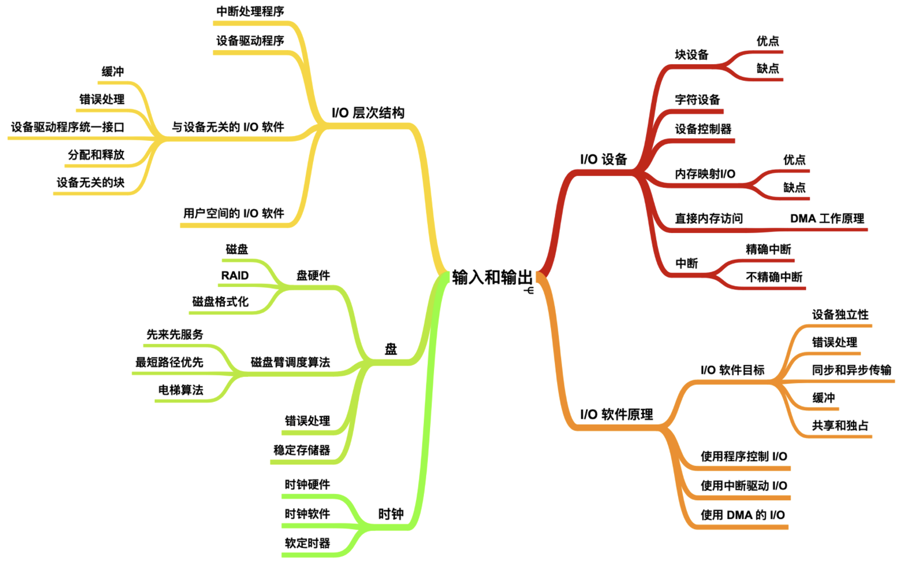
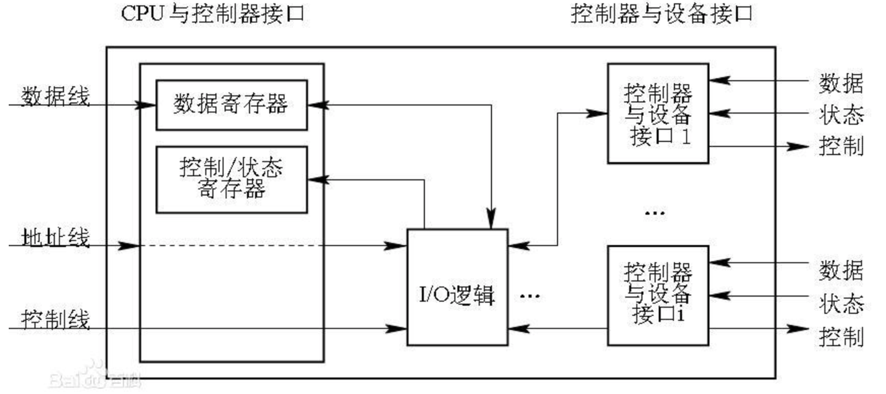
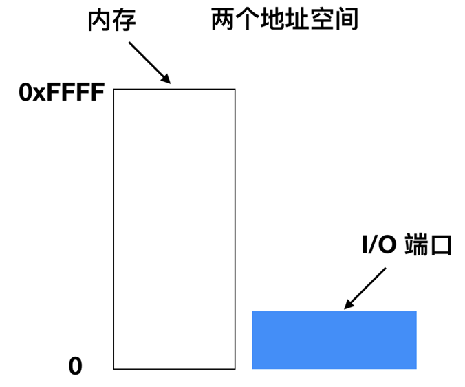
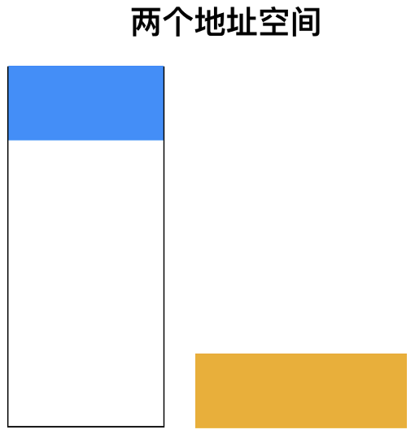
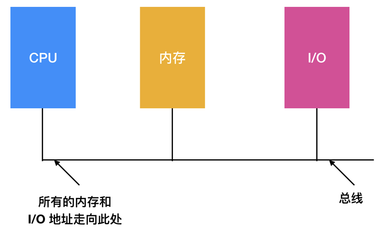
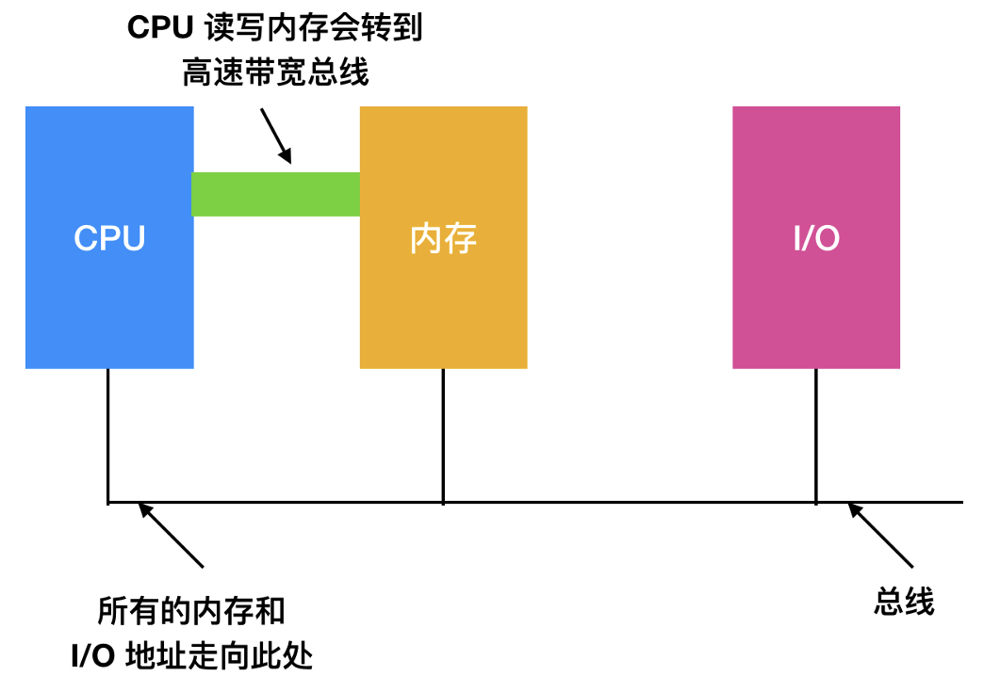
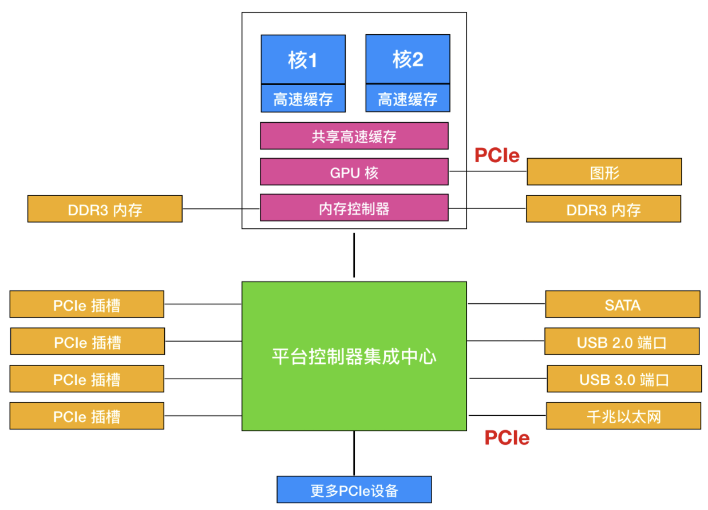
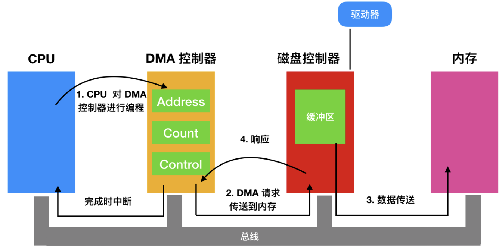

# 设备输入输出之硬件模型

| ##container## |
|:--:|
||

在之前的文章中，我们探讨了操作系统的三大核心抽象：**进程**、**地址空间** 和 **文件**。除此之外，操作系统还承担着控制所有输入/输出（I/O）设备的重任。这要求操作系统必须能够向设备发送命令、捕捉中断以及处理错误。同时，它还需要在设备与操作系统的其他部分之间提供一个既简单又易用的接口。

接下来，我们将重点关注操作系统如何有效地管理I/O。

关于I/O硬件的理解，不同专业背景的人可能有着不同的视角。对于电子工程师而言，I/O硬件主要指的是芯片、导线、电源等构成硬件的物理组件。然而，在我们程序员看来，I/O更多地体现为硬件为软件提供的 **接口**。这些接口涵盖了硬件接收的命令、执行的具体操作以及返回的错误信息等。因此，我们的讨论将聚焦于如何对硬件进行编程，而非其内部的工作机制。例如，我们可能会探讨如何通过特定的编程接口向打印机发送打印命令，或者如何从传感器中读取数据，而不会深入探究这些设备的物理实现细节。

## 一、I/O 设备
什么是I/O设备？I/O设备，全称输入/输出设备，是人类与计算机进行交互的外部硬件装置。它们的主要功能包括向计算机 **发送数据（输出）** 以及从计算机 **接收数据（输入）**。

在I/O设备的分类中，我们可以将其划分为两大类：**块设备（block devices）** 和 **字符设备（character devices）**。

### 1.1 块设备
块设备是一种能够存储 **固定大小数据块** 信息的设备，它支持以这些固定大小的块、扇区或群集为单位来读取和（在某些情况下）写入数据。每个数据块都拥有一个独特的 **物理地址**，这些块的大小通常在512字节到65536字节之间。在数据传输过程中，信息总是以 **连续** 的数据块为单位进行处理的。块设备的一个关键特性是每个数据块都相对独立，可以单独进行读写操作。

> 在实际应用中，我们常见的块设备包括`硬盘（如HDD和SSD）、蓝光光盘以及USB闪存盘等`。例如，当我们从硬盘中读取一个文件时，操作系统会首先定位到该文件存储的起始数据块，然后依次读取后续的数据块，直到整个文件被完全读取。

与字符设备相比，块设备在设计上通常需要较少的引脚，这主要是因为它们以数据块为单位进行数据传输，而不需要像字符设备那样逐字符或逐字节地进行处理。这种设计使得块设备在处理大量数据时能够表现出更高的效率和性能。

- **块设备的缺点**

基于固态存储器的块设备，相较于直接对存储器进行字节寻址的方式，其操作速度会相对较慢。这是因为块设备要求所有的数据读取或写入操作都必须从块的起始位置开始。如果我们需要读取块中的任何数据部分，首先必须定位到该块的开头，然后读取整个块的内容到内存中，即使我们只需要块中的一小部分数据，其余未使用的数据也会被一并读取并随后丢弃。

同样地，当我们需要修改块中的某部分数据时，过程也颇为繁琐。首先，我们得找到目标块的起始位置，将整个块的内容读入内存。接着，在内存中修改所需的数据部分。之后，再次定位到块的开头，并将整个修改后的块写回到存储设备中。这种读写整个块的方式，即使只是修改了块中的一小部分数据，也会导致整个块的重新写入。

> 举个例子，假设我们有一个存储数据的块设备，每个块的大小为4KB。如果我们只需要读取或修改块中512字节的数据，我们仍然需要读取或写入整个4KB的块。这种操作模式虽然简化了存储设备的物理管理，但在处理小块数据时可能会导致性能上的损失。

(读写必须以块为单位)

### 1.2 字符设备
另一类重要的I/O设备被称为`字符设备`。与块设备不同，字符设备以`字符`作为基本单位来发送或接收数据流，而不依赖于任何块结构。这意味着字符设备在处理数据时不会将数据划分为固定大小的块，而是直接以字符序列的形式进行传输。

字符设备的显著特点是它们是不可寻址的，也就是说，它们没有像块设备那样的物理地址或块结构，因此也不需要进行寻道操作。这一特性使得字符设备在处理连续数据流时更加灵活和高效。

> 在实际应用中，我们可以找到许多字符设备的例子。例如，**打印机** 通过接收字符流来打印文档；**网络设备** 如网卡和调制解调器，它们通过字符流来传输和接收网络数据；鼠标则通过发送字符序列来报告其在屏幕上的移动和点击操作；此外，**大多数与磁盘不同的设备**，如串行通信接口和并行端口，也都属于字符设备的范畴。这些设备都以字符为单位进行数据传输，无需考虑数据的块结构或物理地址。

### 1.3 设备控制器
**设备控制器** 是计算机体系中的一个核心组件，它扮演着I/O设备与计算机主体之间数据交换的桥梁角色。具体而言，设备控制器负责控制一个或多个I/O设备，确保它们能够按照CPU的指令进行工作。作为CPU与I/O设备之间的接口，设备控制器接收来自CPU的命令，并据此对I/O设备进行操控，从而减轻了CPU在设备控制方面的负担。

| ##container## |
|:--:|
||

设备控制器是硬件组件，它负责管理与特定I/O设备的通信。每个设备控制器都会配备一个对应的应用程序接口（API），通过这个接口，设备控制器能够利用中断机制与操作系统进行高效的通信。虽然设备控制器是硬件部分，但与之配套工作的设备驱动程序则是软件部分。

I/O设备，作为计算机系统中不可或缺的部分，通常由两大组件构成：机械组件和电子组件。其中，电子组件被专门称为“设备控制器”或“适配器”。在个人计算机领域，这些设备控制器通常以芯片或印刷电路卡的形式出现，并且可以插入到主板上的PCIe扩展插槽中，从而与计算机的其他部分进行连接和通信。

1. CPU如何找到这些控制器?

    答: 找这些控制器对应的寄存器地址

    按照功能，寄存器可以分成:
    1.  控制寄存器   configure寄存器
    2.  数据寄存器   向外界、CPU 保存或发出数据 的 缓存
    3.  状态寄存器   描述当前控制器内部的状态信息

2. 控制器如何控制设备?

    控制器里 含有 资源（寄存器）

    通过`软件` **配置** 控制器里 提取出来的对应 1 0 的bit，功能一致的位组合，作为一个资源，进行访问.

## 二、映射 I/O
CPU是如何与这些设备寄存器和数据缓冲区进行通信的呢? 主要依靠两种设备.

### 2.1 端口映射I/O
在计算机系统中，为了实现CPU与设备控制器之间的通信，一种常见的方法是为每个控制寄存器分配一个独特的I/O端口号。这个I/O端口号通常是一个8位或16位的整数，用于在计算机的硬件架构中唯一标识每个控制寄存器。所有这些I/O端口共同构成了一个受保护的I/O端口空间，这一设计确保了只有操作系统能够访问这些端口，从而有效防止了普通用户程序的非法访问，增强了系统的安全性和稳定性。

当CPU需要读取某个控制寄存器的值时，它会使用一种特殊的I/O指令。以

```伪汇编
IN REG, POR
```

指令为例，该指令的作用是将I/O端口 PORT 的内容读取到CPU的寄存器 REG 中。这样，CPU就可以通过访问这个寄存器来获取设备控制器的状态或配置信息。

相反地，当CPU需要向某个控制寄存器写入值时，它会使用另一种特殊的I/O指令，即

```伪汇编
OUT PORT, REG
```

这条指令的作用是将CPU寄存器 REG 的内容写入到I/O端口 PORT 所对应的控制寄存器中。通过这种方式，CPU可以向设备控制器发送指令或配置信息，从而控制设备的行为。

---

在这一方案中，内存地址空间和I/O地址空间是两个独立且不同的概念，这一点如图所示得到了清晰的体现。图中展示了计算机内存结构，其中0xFFFF代表的是内存地址空间的一部分，而“I/O端口”则代表了另一个独立的I/O地址空间。这两个空间通过某种方式进行交互或连接，但它们在逻辑上是严格区分的。

| ##container## |
|:--:|
||

由于I/O地址空间与内存地址空间是严格隔离的，这种设计有时被称为被隔离的I/O（Isolated I/O）。这种隔离机制确保了CPU在访问内存和I/O设备时不会发生混淆或冲突，从而提高了系统的稳定性和可靠性。

(这个只在部分体系结构上有, 一般为操作系统内核进行管理, 普通程序直接使用可能是非法的!)

### 2.2 内存映射I/O
该方法将 **所有控制寄存器巧妙地映射到了内存空间** 之中!

为了容纳这些I/O设备并确保系统的稳定运行，CPU必须预留给I/O一个特定的地址区域。这个地址区域是专属于I/O设备的，不能被物理内存所使用。在大多数计算机系统中，分配给控制寄存器的地址通常位于地址空间的顶端或靠近顶端的区域，以确保它们与物理内存地址之间不会发生冲突。

`内存映射的I/O（MMIO）`是一种在CPU与其连接的外围设备之间交换数据和指令的高效方式。在这种方式下，处理器和IO设备共享同一套内存地址空间，即它们通过内存地址进行映射来实现数据的读写操作。这意味着，当CPU需要访问某个IO设备时，它可以通过访问一个特定的内存地址来与该设备进行通信，仿佛这个地址对应的是一块普通的内存区域。

---

在大多数计算机系统中，为了管理和区分不同的设备和内存区域，分配给控制寄存器的地址通常位于或靠近地址空间的顶部附近。这些控制寄存器是IO设备的关键组成部分，它们负责接收CPU的指令和数据，并将其转发给设备内部的其他部分进行处理。

然而，在实际应用中，有些系统采用了一种混合的方式来结合内存映射I/O和传统的I/O端口方法。这种混合方式具有内存映射I/O的数据缓冲区，用于存储和传输大量的数据，而控制寄存器则仍然通过单独的I/O端口进行访问。这种方式结合了两种方法的优点，既能够高效地传输数据，又能够灵活地控制设备的操作。

| ##container## |
|:--:|
||

> 以x86体系结构为例，它就采用了这种混合方式。在IBM PC兼容机中，除了0到64K-1的I/O端口用于访问控制寄存器之外，还保留了640K到1M-1的内存地址空间给设备的数据缓冲区使用。这意味着，当CPU需要与某个IO设备进行数据传输时，它可以直接访问这些预留的内存地址来读取或写入数据，而无需通过繁琐的I/O端口操作。同时，当CPU需要向设备发送控制指令时，它仍然可以通过访问相应的I/O端口来与设备的控制寄存器进行通信。

内存映射的I/O是一种高效的CPU与IO设备通信方式，它通过共享内存地址空间来实现数据的快速传输。在实际应用中，有些系统采用了混合方式来结合内存映射I/O和传统的I/O端口方法，以充分发挥两种方法的优点。这种设计既提高了系统的性能，又增强了系统的灵活性和可扩展性。

### 2.3 两种方法工作原理
这些方案的工作原理相对直观。当CPU需要读取一个字（无论是从内存中还是I/O端口中），它会首先将所需的地址放置在总线地址线上。随后，在总线的一条控制线上，CPU会发出一个READ 信号，表明它正在尝试读取数据。

为了区分CPU是在尝试访问内存空间还是I/O空间，系统还设置了一条额外的信号线。如果CPU想要访问的是内存空间，那么内存模块将会响应这个读取请求。相反，如果CPU想要访问的是I/O空间，那么相应的I/O设备将会响应这个请求。

为了确保地址的唯一性和避免冲突，系统采用了一种地址分配机制。在这种机制下，每个内存模块和每个I/O设备都会将其服务的地址范围与总线上的地址线进行比较。如果总线上的地址落在某个设备或内存模块的服务范围内，那么该设备或内存模块就会响应这个读取请求。重要的是，系统保证每个地址只会被分配给一个内存模块或一个I/O设备，因此不会出现地址冲突或歧义的情况。

> 举个例子，假设CPU想要读取一个存储在内存地址0x1000处的字。CPU会将地址0x1000放置在总线地址线上，并发出READ 信号。然后，系统会根据地址线和每个设备或内存模块的服务范围进行比较。如果有一个内存模块的服务范围包含了地址0x1000，那么该内存模块就会响应这个请求，并将存储在地址0x1000处的字发送给CPU。

此外，内存映射I/O（MMIO）作为一种CPU对I/O设备的通信方法，并不会影响DMA（直接内存访问  后面会讲）的工作。**DMA是一种允许设备在没有CPU干预的情况下直接从内存中读取或写入数据的通信方法**。因此，即使系统采用了内存映射I/O，DMA仍然可以正常工作，从而实现了CPU、内存和设备之间的高效通信。

### 2.4 内存映射 I/O 的优点和缺点
首先，从编程便捷性的角度来看，内存映射I/O具有显著优势。在传统的I/O操作中，如果需要读写设备控制寄存器，通常需要借助特殊的I/O指令，如`IN`和`OUT`。然而，这些指令在高级编程语言如C或C++中并不直接支持，因此开发者通常需要使用汇编代码来实现这些操作。这不仅增加了开发的复杂度，还提高了I/O操作的开销。相比之下，在内存映射I/O中，控制寄存器被当作内存中的普通变量来处理。这意味着开发者可以使用C语言中的常规寻址方式来访问这些寄存器，无需编写复杂的汇编代码。例如，开发者可以直接使用指针或数组索引来访问控制寄存器的值，从而简化了I/O操作的过程。

其次，内存映射I/O在安全性方面也表现出色。在传统的I/O操作中，为了防止用户进程执行非法的I/O操作，通常需要设置复杂的保护机制。然而，在内存映射I/O中，操作系统只需确保控制寄存器的地址空间不被包含在用户的虚拟地址空间中即可。这样，即使用户进程试图访问这些地址，也会被操作系统拦截并报错，从而有效地防止了非法的I/O操作。这种简洁的保护机制不仅提高了系统的安全性，还降低了开发和维护的复杂度。

最后，内存映射I/O在指令引用方面也具有优势。在传统的I/O操作中，由于控制寄存器与内存是分开的，因此需要使用不同的指令来引用它们。而在内存映射I/O中，控制寄存器被映射到内存空间中，因此可以使用与引用内存相同的指令来引用它们。这种统一的指令引用方式不仅简化了编程过程，还提高了代码的可读性和可维护性。例如，开发者可以使用相同的指针运算和数组访问操作来引用内存和控制寄存器，从而减少了代码中的重复和冗余。

---

首要问题在于，现代计算机体系结构中普遍引入了内存缓存机制，旨在加速数据访问速度。然而，当这一机制应用于设备控制寄存器的内存映射时，却可能引发显著的性能损耗。原因在于，控制寄存器的数据往往具有高度的时效性和重要性，对其的每一次读写都需确保精确无误。而缓存机制虽能提升常规内存访问的效率，但对于这类特殊用途的内存区域，却可能因缓存一致性问题或延迟更新而导致数据不一致，进而引发系统错误或性能下降。

为了规避这一潜在风险，硬件设计必须采取特殊措施，有选择性地禁用对设备控制寄存器所在内存区域的缓存。例如，在特定内存页面上禁用缓存功能，以确保每次访问都能直接命中主存，从而获取最新的控制寄存器值。然而，这一解决方案并非没有代价。它要求硬件和操作系统层面进行更为复杂的管理，以精确识别并控制哪些内存区域应被禁用缓存。这不仅增加了系统设计的复杂性，也对系统的稳定性和可靠性提出了更高要求。

第二点，在计算机系统的架构设计中，地址空间的管理与分配是一个至关重要的环节。若系统中仅存在一个统一的地址空间，那么将会引发一系列复杂性和效率问题。如果仅有一个地址空间供所有`内存模块（memory modules）`和I/O设备共享，那么每当发生内存引用时，每一个内存模块和I/O设备都不得不执行一个繁琐的检查过程，以确定该引用是否针对自己。

这种机制不仅极大地增加了系统的复杂性，还显著降低了系统的整体性能。因为每次内存访问都需要所有内存模块和I/O设备进行比对和响应判断，这无疑会引入不必要的延迟和开销。特别是在大型系统中，随着内存模块和I/O设备数量的增加，这种检查过程将变得愈发耗时和繁琐。

## 三、总线结构
### 3.1 单总线结构

| ##container## |
|:--:|
||
|单总线体系结构|

让每个内存模块和 I/O 设备查看每个地址是简单易行的。

### 3.2 多总线结构

然而，现代个人计算机的趋势是专用的高速内存总线，如下图所示

| ##container## |
|:--:|
||

装备这一总线是为了优化内存访问速度，x86 系统还可以有多种总线（内存、PCIe、SCSI 和 USB）。如下图所示:

| ##container## |
|:--:|
||
|大型x86系统架构|

在内存映射机器上采用独立的内存总线时，会遇到一个显著问题：I/O设备无法直接通过内存总线访问或响应内存地址。为了在这一架构下实现内存映射I/O的有效运作，特别是在多总线系统中，必须采取特殊策略。以下是几种可能的设计方案及其优缺点分析:

**顺序总线访问法**:

- 此方法首先将所有内存引用直接发送至内存总线。若内存未能响应（即访问失败），CPU随后会尝试通过其他总线进行访问。这种方法虽然简单直接，但可能导致效率下降，因为每次失败的内存访问都需要额外的总线切换和重试过程。

> **示例**：假设CPU尝试访问一个被映射到I/O设备的地址，但首先通过内存总线发送请求。由于该地址实际指向I/O设备而非内存，内存总线将不会响应。此时，CPU需切换到I/O总线并重新发送请求。

**探查设备法**:

- 在这种设计中，一个名为“探查设备”的组件被置于内存总线上，用于监控所有可能指向特定I/O设备的内存地址。一旦检测到此类地址，探查设备会尝试将这些请求重定向至相应的I/O设备。然而，这种方法的一个主要挑战是I/O设备的处理速度可能远低于内存，从而可能导致性能瓶颈。

> **示例**：探查设备检测到内存总线上有一个地址请求，该地址实际上指向一个串行通信端口。由于串行通信端口的处理速度较慢，探查设备可能需要等待该端口准备好接受数据，从而延长了整个请求的响应时间。

**地址过滤法**:

- 此设计在内存控制器中实现地址过滤功能，通常通过包含一组在引导时预装载的范围寄存器来完成。这些寄存器定义了哪些内存地址范围应被视为真正的内存访问，而哪些应被重定向至I/O设备。虽然这种方法在理论上可以提高效率，但它要求在系统引导时精确确定哪些地址属于内存、哪些属于I/O设备。这增加了系统配置的复杂性，并可能引入引导时的错误判定风险。

> **示例**：在系统引导过程中，内存控制器被配置为将地址范围0x00000000-0x00FFFFFF视为内存访问，而将0x01000000-0x01FFFFFF视为I/O设备访问。如果引导配置错误，可能会导致本应访问内存的数据被错误地发送到I/O设备，或反之。

每种设计都有其独特的优点和局限性。因此，在实际应用中，需要根据系统的具体需求、性能要求以及成本预算等因素进行权衡和折中。

## 四、DMA
### 4.1 直接内存访问
无论CPU是否具备内存映射I/O功能，为了与设备控制器进行数据交换，它都需要能够寻址这些控制器。尽管CPU可以从I/O控制器每次请求一个字节的数据，但这种方式效率极低，会大量占用CPU时间。因此，在实际应用中，更常采用的是一种名为“直接内存访问（Direct Memory Access，DMA）”的技术方案。

为了简化说明，我们可以假设CPU通过一条单一的系统总线来访问所有的设备和内存。这条总线将CPU、内存以及I/O设备紧密连接在一起，形成一个统一的通信路径，如图所示。在该图中，我们可以看到CPU与DMA控制器之间的数据传输流程。

| ##container## |
|:--:|
||
|DMA传送操作|

现代操作系统的复杂性远超以往，但其核心原理依然相通。当硬件配备了`DMA（Direct Memory Access）控制器`时，操作系统便必须依赖这一机制来高效地管理数据传输。DMA控制器作为一种专用的硬件组件，它的存在极大地减轻了CPU在处理数据传输任务时的负担。

在实际应用中，DMA控制器的设计有多种形式。有时，它会被直接集成到磁盘控制器或其他类型的设备控制器中。这种集成设计的好处在于，它可以针对特定设备进行优化，从而提高数据传输的效率和稳定性。然而，这种设计也带来了一定的局限性，即每个需要DMA功能的设备都必须配备一个独立的DMA控制器。这在一定程度上增加了硬件成本和设计的复杂性。

### 4.2 DMA 工作原理
当采用DMA（Direct Memory Access，直接内存访问）技术后，数据传输的过程将发生显著变化。


**DMA方式的工作原理**:
- 一个设备接口试图通过总线直接向另一个设备发送数据(一般是大批量的数据)，它会先向CPU发送DMA请求信号。外设通过DMA的一种专门接口电路――DMA控制器（DMAC），向CPU提出接管总线控制权的总线请求，CPU收到该信号后，在当前的总线周期结束后，会按DMA信号的优先级和提出DMA请求的先后顺序响应DMA信号。CPU对某个设备接口响应DMA请求时，会让出总线控制权。于是在DMA控制器的管理下，外设和存储器直接进行数据交换，而不需CPU干预。数据传送完毕后，设备接口会向CPU发送DMA结束信号，交还总线控制权。

**实现DMA传送的基本操作如下**:
1. 外设可通过DMA控制器向CPU发出DMA请求
2. CPU响应DMA请求，系统转变为DMA工作方式，并把总线控制权交给DMA控制器
3. 由DMA控制器发送存储器地址，并决定传送数据块的长度
4. 执行DMA传送
5. DMA操作结束，并把总线控制权交还CPU

**用途**：
- DMA方式主要适用于一些高速的I/O设备。这些设备传输字节或字的速度非常快。对于这类高速I/O设备，如果用输入输出指令或采用中断的方法来传输字节信息，会大量占用CPU的时间，同时也容易造成数据的丢失。而DMA方式能使I/O设备直接和存储器进行成批数据的快速传送。
