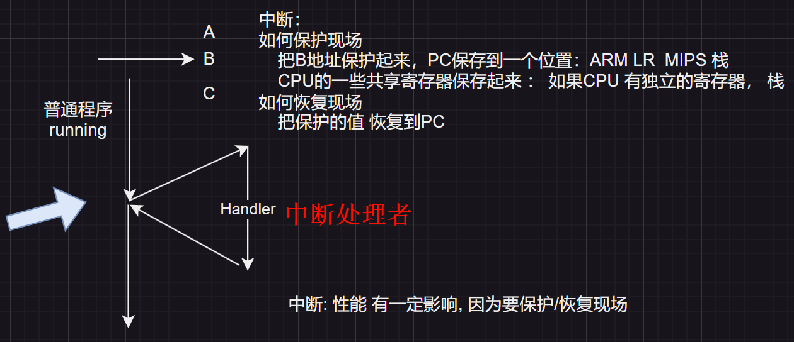
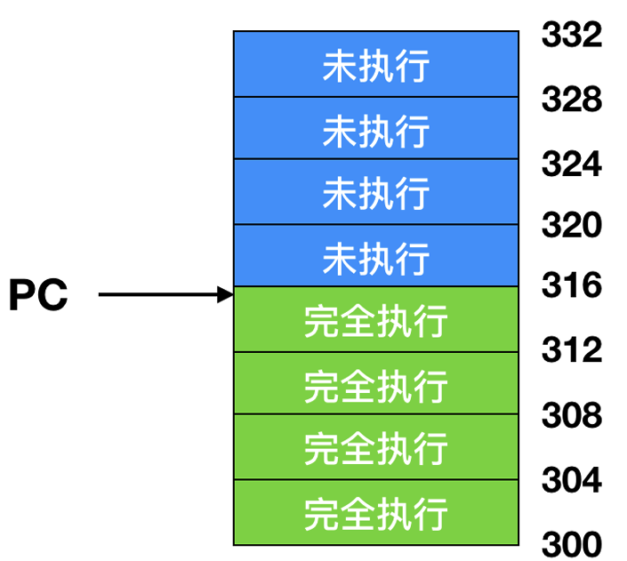
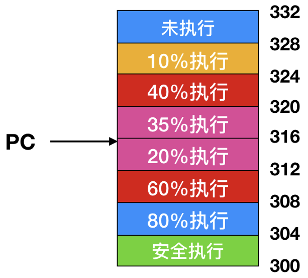
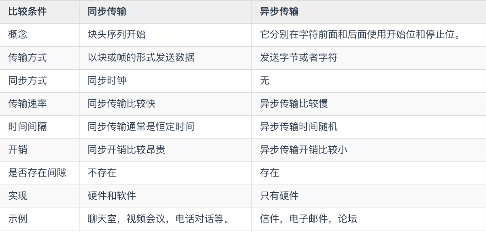
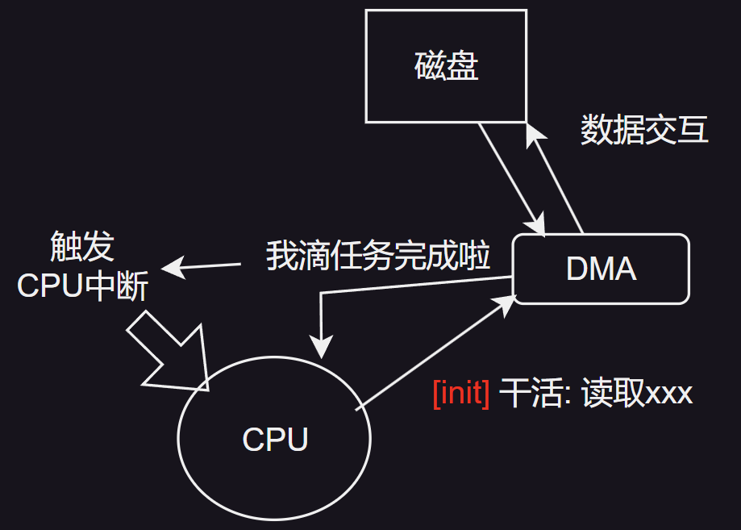
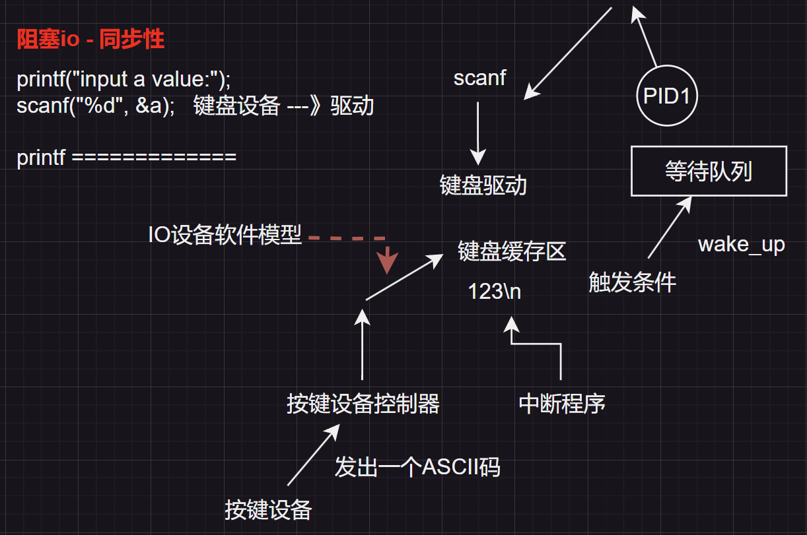
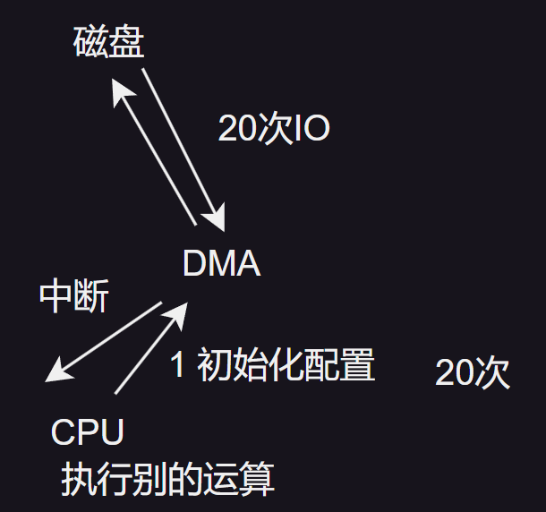

# IO设备软件
## 一、中断
### 1.1 重温中断

| ##container## |
|:--:|
||

### 1.2 精确中断和不精确中断
现代CPU的设计中广泛采用了`流水线`技术, 并且部分CPU还融入了`超标量`技术(即内部并行处理空间)。这一设计显著提升了处理效率。相比之下, 在一些老旧的系统架构中, 指令的执行流程有所不同。每当一条指令执行完毕后, 微程序或硬件会负责检查系统中是否存在待处理的中断。

如果存在未完成的中断, 系统将采取以下步骤进行处理: 
- 首先, 当前的程序计数器(PC)和程序状态字(PSW)会被压入堆栈中保存, 以便后续恢复。

- 随后, 系统开始执行中断服务程序。当中断服务程序运行完毕后, 系统会从堆栈中弹出之前保存的PSW和程序计数器, 以此来恢复被中断的进程, 确保程序能够继续从被打断的地方无缝执行。

> 例如, 假设一个程序在执行过程中遇到了一个外部设备的中断请求。在老旧系统中, 如果该中断未被立即处理, 那么当前的执行状态(包括PC和PSW)会被保存起来, 然后系统跳转到中断服务程序去处理该请求。处理完毕后, 系统利用之前保存的PC和PSW恢复程序的执行, 确保程序逻辑的正确性和连续性。
>
> | ##container## |
> |:--:|
> ||
> |流水线模型|

当流水线满载时遭遇中断, 其处理情况变得尤为复杂。由于此时有多条指令正同时处于流水线中的不同执行阶段, 中断的突然介入使得程序计数器的值难以准确反映已执行指令与待执行指令之间的明确界限。

在这种场景下, 一个显著的问题是: 许多指令可能仅部分完成了它们的执行过程, 且各指令的完成程度不尽相同。例如, 某条指令可能已完成了数据读取阶段, 但尚未进行数据运算; 而另一条指令则可能仅处于地址解析阶段。这种执行状态的不确定性给中断处理带来了挑战。

更重要的是, 此时程序计数器的值往往指向的是即将被取出并送入流水线的下一条指令的地址, 而非刚刚由执行单元处理完毕的指令的地址。这意味着, 如果直接根据程序计数器的当前值来恢复中断后的程序执行, 可能会导致部分已部分执行的指令被重复执行, 或者某些关键指令被遗漏, 从而引发程序逻辑错误或数据不一致的问题。

为了应对这一挑战, 现代处理器在设计中通常会采用一系列复杂的机制来保存中断时的执行状态, 包括记录每条指令在流水线中的具体位置、已执行的程度等信息。当中断处理完毕后, 这些机制将帮助处理器准确地恢复中断前的执行状态, 确保程序能够从中断点无缝继续执行。例如, 通过保存并恢复流水线状态寄存器、使用精确中断技术等手段, 处理器能够确保每条指令都得到正确且仅一次的执行。

在超标量的设计中, 可能更加糟糕:

| ##container## |
|:--:|
||

每个指令都可以被细分为一系列的微操作, 这些微操作在实际执行过程中可能会根据内部资源(例如功能单元和寄存器)的实时可用性而采取 **乱序执行** 的方式。这意味着指令的执行顺序并不总是与它们在程序中的顺序一致。

当中断发生时, 这种乱序执行机制可能会引发一些复杂的情况。由于指令的执行是异步的, 某些在程序早期就已经启动的指令可能由于资源竞争或其他原因尚未开始执行, 而最近提交给处理器的指令却可能即将完成。因此, 在中断信号被触发时, 处理器内部可能会有大量的指令处于不同的执行阶段和完成状态。

这些指令的完成状态与程序计数器(PC)之间没有直接的对应关系。程序计数器通常用于指示当前正在执行的指令或即将被执行的下一条指令的地址, 但在乱序执行的环境中, 它并不能准确地反映所有指令的执行进度。例如, 即使程序计数器指向某条特定的指令, 该指令的实际执行状态可能仍然是未知的, 因为它可能正在等待某个功能单元的空闲或某个寄存器的值。

为了处理这种情况, 现代处理器通常会采用复杂的控制逻辑和状态保存机制来确保在中断发生时能够准确地记录并恢复所有指令的执行状态。这包括使用标签或标记来跟踪每条指令在流水线中的位置和执行进度, 以及在中断处理完毕后根据这些信息来重新排序和恢复指令的执行。通过这些机制, 处理器能够确保即使在中断发生后, 程序的执行也能够保持正确性和一致性。

所谓`精确中断(precise interrupt)`, 是指一种能够使机器在执行过程中保持一致性状态的中断机制。这种中断具备以下四个关键属性, 从而确保了中断处理的可靠性和可预测性: 

1. **PC(程序计数器)保存在一个已知的位置**: 当中断发生时, 程序计数器的值会被自动保存到一个预先定义且已知的内存位置或寄存器中。这样, 在中断处理完毕后, 系统可以轻松地恢复程序的执行点。

2. **PC所指向的指令之前所有的指令已经完全执行**: 这意味着在中断发生时, 程序计数器所指向的那条指令之前的所有指令都已经完成了它们的执行过程, 且其结果已经对处理器的状态产生了影响。

3. **PC所指向的指令之后所有的指令都没有执行**: 这一属性确保了中断不会影响到程序计数器所指向指令之后的任何指令的执行。换句话说, 这些指令在中断发生时仍然处于未执行状态。

4. **PC所指向的指令的执行状态是已知的**: 即使程序计数器所指向的指令在中断发生时尚未完成执行, 其执行状态(如是否已经开始执行、执行到了哪个阶段等)也是可以被系统准确捕获和记录的。这样, 在中断处理完毕后, 系统可以根据这些状态信息来决定是否以及如何继续执行该指令。

与精确中断相对的是`不精确中断(imprecise interrupt)`, 这种中断不满足上述四个属性中的至少一个。不精确中断会导致指令的执行时序和完成度变得不确定, 给系统的恢复和错误处理带来极大的挑战。例如, 在不精确中断的情况下, 程序计数器所指向的指令可能已经开始执行但尚未完成, 或者其之后的某些指令可能已经部分执行。这种不确定性使得系统难以准确地恢复中断前的执行状态, 从而可能导致程序逻辑错误或数据不一致等问题。

因此, 在实际应用中, 我们总是尽力避免不精确中断的发生, 而采用精确中断来确保系统的稳定性和可靠性。

## 二、IO 软件原理
### 2.1 I/O 软件目标
#### 2.1.1 设备独立性
I/O软件的设计领域, 其中一个至关重要的目标是实现`设备独立性(device independence)`。这一概念的核心在于, 它允许我们编写出能够访问任意设备的应用程序, 而无需在编写时明确指定特定的设备类型。

具体而言, 设备独立性意味着, 如果你开发了一个旨在从设备中读取文件的应用程序, 那么这个程序将具备从多种不同设备(如硬盘、DVD驱动器或USB存储设备)中读取文件的能力, 而无需为每种设备单独定制应用程序。这种灵活性极大地提升了软件的通用性和可移植性。

计算机操作系统作为硬件与软件之间的桥梁, 扮演着至关重要的角色。由于不同硬件设备的指令集各不相同, 操作系统便承担了将这些不同指令转换为统一、可执行的命令的任务。

在操作系统的设计中, `统一命名(uniform naming)`是与设备独立性紧密相关的一个重要概念。它要求为设备分配一个不依赖于具体硬件的标识符, 这个标识符可以是整数或字符串形式。通过统一命名, 用户无需记忆各种设备的具体名称, 而只需记住它们在系统中的路径即可。

> 例如, UNIX中, 它巧妙地将所有磁盘设备集成到了文件系统中。这样, 用户就无需记住每个磁盘设备的具体名称, 而只需通过相应的文件路径来访问它们。

通过这种方式, UNIX操作系统不仅提高了设备的可访问性和易用性, 还进一步强化了设备独立性的概念。用户无需关心底层硬件的具体细节, 只需通过统一的文件路径来操作设备, 从而大大简化了设备管理和使用的复杂性。

#### 2.1.2 错误处理
I/O软件在实现过程中, 除了追求`设备独立性`这一核心目标外, 还高度重视`错误处理(error handling) `机制。在理想的状况下, 错误应由`硬件`层级负责处理。具体而言, 当设备控制器在执行过程中检测到读取错误时, 会首先尝试自行修复该错误。

然而, 若设备控制器无法独立解决此问题, 那么处理权将转移至设备驱动程序。设备驱动程序会采取进一步措施, 例如重新尝试读取操作, 因为许多错误都是偶发性的, 通过重试可能得以解决。但如果设备驱动程序同样无法应对该错误, 此时才会将问题上报至更高层级(即上层)进行处理。

上层系统往往无需深入了解下层是如何具体解决错误的。这种处理方式类似于项目管理中的分层决策机制: 项目经理无需向老板汇报每一个细微决定, 程序员也无需向项目经理详细解释每行代码的编写逻辑。虽然这种处理方式在一定程度上牺牲了透明度, 但它却极大地提高了系统的整体效率和响应速度。

> 举例来说, 假设一个存储设备在读取数据时遇到了错误, 设备控制器会首先尝试通过内部算法进行修复。如果修复失败, 设备驱动程序会介入, 尝试重新读取数据或采取其他补救措施。如果所有这些努力都未能解决问题, 那么错误才会被上报至操作系统或应用程序层面, 由它们根据具体情况做出进一步的处理决策。

#### 2.1.3 同步和异步传输
I/O软件实现的第三个关键目标是支持`同步(synchronous)`与`异步(asynchronous, 又称中断驱动)`两种传输模式。

在同步传输模式下, 数据通常以`块(block)`或`帧(frame)`的形式进行发送。这种传输方式要求发送方与接收方在数据传输开始之前, 必须建立并保持一致的`同步时钟`信号。同步时钟确保了数据在双方之间的稳定、有序传输, 避免了数据丢失或错位的问题。例如, 在视频流或音频流的传输中, 同步传输能够确保数据的连续性和实时性, 从而提供高质量的媒体播放体验。

相比之下, 异步传输则采用了一种更为灵活的数据传输方式。在这种模式下, 数据通常以字节(byte)或字符(character)的形式进行发送。与同步传输不同, 异步传输不需要建立同步时钟信号, 而是通过在每个数据单元前添加特定的`起始位`和`停止位`, 以及可能的`奇偶校验位`来实现数据的传输和校验。这些附加位确保了接收方能够准确识别并接收每个数据单元, 同时检测并纠正数据传输中的错误。例如, 在计算机键盘与主机之间的通信中, 异步传输能够确保按键信息的准确传递, 即使在不同的敲击速度和频率下也能保持稳定的通信质量。

| ##container## |
|:--:|
||
|同步和异步的主要区别|

在多数情况下, `物理IO(physical I/O)`操作是以 **异步** 方式进行的。这里的“异步”意味着CPU在启动数据传输后, 并不会停滞等待数据传输完成, 而是会继续执行其他任务。CPU的这种设计体现了其高效利用资源的智慧。

当CPU需要执行物理IO操作时, 它会向相关设备发出指令, 并启动数据传输过程。然而, CPU并不会一直等待数据传输完毕, 而是会转而处理其他任务。这种多任务处理的能力是计算机高效运行的关键所在。

与此同时, CPU与中断机制之间存在着紧密的协作关系。一旦数据传输完成, 设备会向CPU发送一个中断信号。这个中断信号就像是CPU的“闹钟”, 提醒它回到之前的数据传输任务上来。当CPU接收到中断信号后, 它会暂停当前正在执行的任务, 并跳转到中断处理程序来处理数据传输的后续工作。

| ##container## |
|:--:|
||

> I/O 分为两种: `物理I/O`和`逻辑I/O(Logical I/O)`
>
> 物理 I/O 通常是从磁盘等存储设备实际获取数据。逻辑 I/O 是对存储器(块, 缓冲区)获取数据。

#### 2.1.4 缓冲
I/O软件中的一个关键且最终要面对的问题是“缓冲(buffering)”。在数据传输过程中, 数据通常不会直接从源头设备传输到目标设备, 而是需要经过一系列的校验、检查以及缓冲等中间环节。

> 为了更清晰地说明这一点, 我们可以举一个具体的例子: 当在网络中发送一个数据包时, 该数据包并不会立即到达其目的地。相反, 它会首先经过一系列的检查流程, 以确保数据的完整性和准确性。随后, 这个数据包会被发送到缓冲区中。缓冲区在这里起到了至关重要的作用, 它能够有效地平衡数据的发送速率与接收设备的处理能力, 从而避免了因缓冲区填满速率过快而导致的缓冲区过载问题。

通过这样的缓冲机制, I/O软件能够确保数据的稳定传输, 并提高了系统的整体性能和可靠性。

#### 2.1.5 共享和独占
I/O软件面临的最后一个关键问题是关于共享设备与独占设备的协调管理。在I/O系统中, 存在两种类型的设备: 共享设备和独占设备。共享设备, 如磁盘, 可以同时被多个用户访问而不会引发严重冲突或性能下降。例如, 多个进程可以并行地从磁盘的不同区域读取数据, 而不会相互干扰。然而, 有些设备则必须是独占性的, 即同一时间内只能由一个用户独占使用, 例如打印机。这类设备要求在使用时必须保证严格的互斥访问, 以避免数据混乱或物理损坏。当一个用户正在使用独占设备时, 其他用户必须等待, 直到当前用户释放设备的使用权。

接下来, 我们深入探讨一下控制I/O设备的三种主要方法: 
1. 使用程序控制 I/O
2. 使用中断驱动 I/O
3. 使用 DMA 驱动 I/O

### 2.2 使用程序控制 I/O
使用程序控制I/O, 亦称为“可编程I/O”。

`I/O软件模型`就是下面几种:

- 阻塞io模型

| ##container## |
|:--:|
||

- 非阻塞io模型 (轮询)

我问你, 你说`我还没好`, 那我就去干别的, 等会再来问你, 轮询.

- io复用模型 (epoll)

我监测`1, 2, 3, 4`, 把他们都叫做 $S$, 有一个好了, $S$ 就大喊大叫. 此时我就可以轮询一次, 是誰好了 (select); 而epoll会记录是誰叫的, 可以轻易找到. (粗略讲解)

- 信号模型

- 异步io模型

### 2.3 使用中断驱动 I/O

(实际上就是上面的epoll / 信号模型 / 异步io模型)

### 2.4 使用 DMA 的 I/O

直接内存访问(DMA)是一种高效的数据传输技术, 其全称揭示了其核心特性: 无需CPU的直接参与, I/O模块即可获得访问内存的权限。这一过程的核心管理者是DMA控制器(DMAC), 一个专门的芯片, 它负责在CPU不介入的情况下, 协调I/O模块与内存之间的数据传输。

DMA技术使得DMA设备能够绕过CPU, 直接在内存的不同区域之间传输数据。这种直接传输的方式极大地减轻了CPU的负担, 并有效缓解了系统总线上的拥塞现象。因为传统的数据传输方式往往需要CPU作为中介, 负责数据的读取、处理和写入, 这在大规模数据传输时会导致CPU资源的过度占用和总线拥塞。

DMA技术的另一个显著优势在于提高了系统的并发性。当DMA系统通过系统和内存总线传输数据时, CPU可以并行地执行其他任务, 如处理中断、执行计算任务或管理其他I/O操作。这种并行处理的能力使得系统能够更高效地利用资源, 从而提高了整体性能。

> 比如当我们在计算机上播放高清视频时, 视频数据需要被不断地从硬盘读取到内存中, 然后再从内存传输到显卡进行显示。如果这个过程完全依赖CPU来完成, 那么CPU的资源将会被大量占用, 可能导致系统响应变慢或视频播放卡顿。然而, 如果采用DMA技术, 那么硬盘到内存、内存到显卡的数据传输就可以由DMA控制器来完成, CPU则可以在此期间执行其他任务, 如处理用户输入或运行其他应用程序。这样, 系统就能够更流畅地播放高清视频, 同时保持其他功能的正常运行。

| ##container## |
|:--:|
||

