# IO软件层次完结和盘结构
## 一、I/O 层次结构
### 1.1 I/O 软件结构
I/O 软件通常组织成四个层次, 它们的大致结构如下图所示:

| ##container## |
|:--:|
||

每一层和其上下层都有明确的功能和接口。下面我们采用和计算机网络相反的套路, 即自下而上的了解一下这些程序。

| ##container## |
|:--:|
|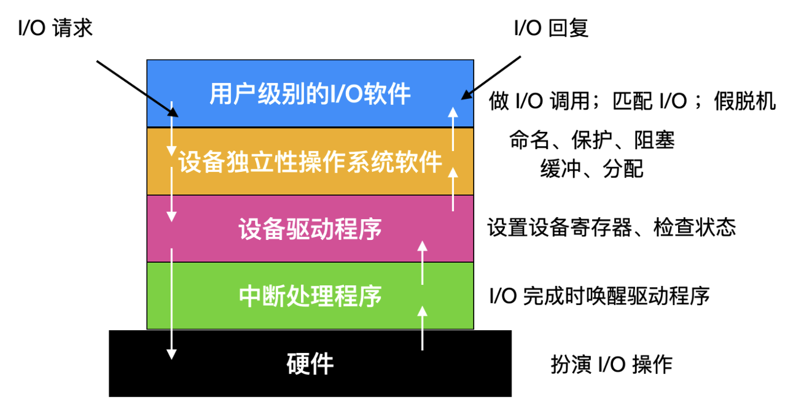|
|输入/输出软件系统所有层及其主要功能|

### 1.2 中断处理程序

在计算机系统中, 中断是一种频繁发生的现象, 尽管其出现往往带来一定的处理负担。中断处理程序, 也被称为 **中断服务程序(ISR, 即Interrupt Service Routines)**, 构成了软硬件交互的最底层环节。这些程序由硬件中断、软件中断或软件异常触发, 旨在实现设备驱动程序与受保护操作模式(例如系统调用)之间的无缝转换。

中断处理程序的核心职责是处理中断事件引发的所有必要操作。一旦操作完成, 程序会进入阻塞状态, 此时需要启动中断驱动程序来解除阻塞。为了通知阻塞的中断处理程序恢复运行, 系统通常采用以下三种机制, 具体实现可能因系统而异:

1. **信号量机制**: 在信号量管理系统中, 通过执行`up`操作来释放信号量, 从而通知等待中的中断处理程序可以恢复执行。例如, 在一个多线程环境下, 一个线程可能因为等待某个资源而阻塞。当该资源可用时, 系统会通过`up`操作来唤醒等待的线程。

2. **管程机制**: 在管程(一种用于同步访问共享资源的程序设计结构)中, 通过对条件变量执行`signal`操作来通知等待中的进程或线程。例如, 在一个生产者-消费者模型中, 当生产者生产了一个新产品并放入缓冲区时, 它会通过`signal`操作来通知等待中的消费者线程可以开始消费。

3. **消息传递机制**: 在某些系统中, 通过发送消息来通知中断处理程序恢复运行。这种机制通常用于分布式系统或进程间通信的场景。例如, 在一个微服务架构中, 一个服务可能因为等待另一个服务的响应而阻塞。当响应到达时, 系统会通过发送消息来通知等待中的服务可以继续处理。

这些通知机制都是为了确保中断处理程序在完成必要操作后能够及时恢复运行, 从而保持系统的正常运作。在实际应用中, 选择哪种机制取决于系统的具体需求和设计。

| ##container## |
|:--:|
|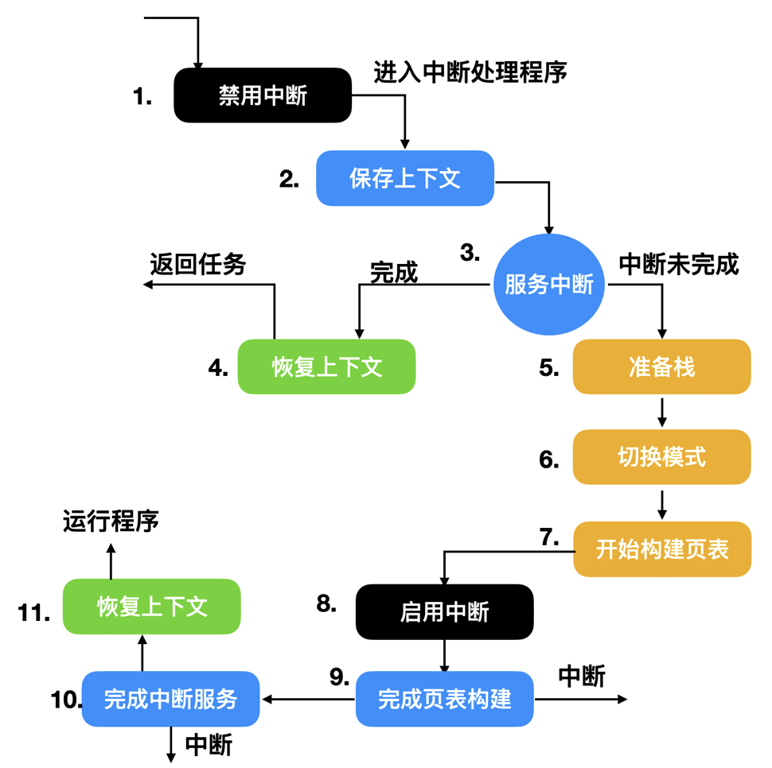|

> [!TIP]
> 现代操作系统中, 一般不允许中断未完成(也就是需要长时间占用来完成中断任务), 如Linux会给这些 *长中断* 分配给一个`内核线程`, 然后马上回复上下文, 让新来的内核线程与用户进程争抢cpu调度.

### 1.3 设备驱动程序
在深入探讨计算机系统中设备控制器的作用时, 我们了解到每个控制器内部都配备了寄存器, 这些寄存器作为设备与控制器之间沟通的桥梁, 负责发送指令以及读取设备状态。每个连接到计算机的I/O设备, 为了实现其特定功能, 都需要相应的设备代码进行控制。

例如, 鼠标控制器需要与鼠标进行通信, 接收来自鼠标的指令, 确定鼠标的移动方向；键盘控制器则需要准确捕捉哪个按键被按下。这些将I/O设备的需求转换为设备控制器可理解指令的过程, 是通过一组特定的程序代码完成的, 我们称之为“设备驱动程序(Device Driver)”。

设备驱动程序在系统中的位置至关重要, 它通常是操作系统内核的组成部分, 这使得它能够直接访问设备的硬件资源。然而, 随着技术的发展, 也出现了在用户空间实现设备驱动程序的设计, 这种设计通过系统调用来完成数据的读写操作。这种做法的一个显著优势在于, 即使设备驱动程序出现问题, 也不会直接影响到内核的稳定性, 从而降低了系统崩溃的风险。因此, 在用户空间实现设备驱动程序成为 **提升系统稳定性** 的一个重要手段。

例如, 咕噜咕噜的安卓, 对接手机的传感器, 因为Linux是GPL的, 你传感器的驱动是需要被强制开源的; 而如果你开源的话, 别人抄了你的, 你就倒闭啦. 因此第三方传感器的驱动是闭源的. 此处咕噜咕噜就是使用`设备驱动程序`, 让它运行在用户空间, 然后通过动态库的方式被调用. 以规避法律问题.

| ##container## |
|:--:|
|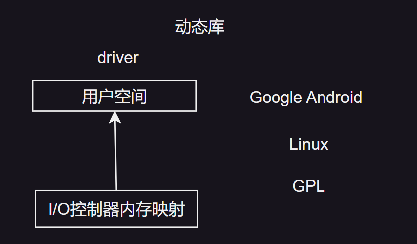|

> 大多数桌面操作系统要求驱动程序必须运行在内核中。

| ##container## |
|:--:|
|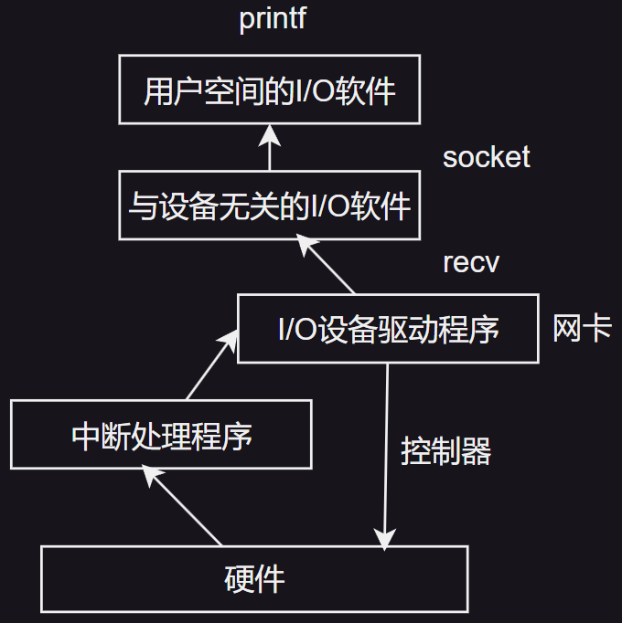|
|常规的`设备驱动程序`的工作|

---

设备控制器是计算机系统中用于管理外部设备的一种可编址硬件组件。它充当设备与主机之间的桥梁, 负责接收来自主机的指令并将其转化为设备的控制信号, 同时将设备的状态或数据传递回主机。  

设备控制器的地址机制:
1. **单一设备控制**  
   若设备控制器仅需控制一个设备, 它将被分配一个独一无二的设备地址, 用于标识该设备在系统中的位置。  

2. **多设备控制**  
   如果设备控制器需要管理多个设备, 它必须能够为每个设备分配一个独立的设备地址。这些地址确保了设备之间的区分性, 从而使控制器能够精准地识别和管理每个连接的设备。  

设备控制器的分类:  
1. **字符设备控制器**  
   - 数据处理方式: 字符设备以字符流的方式进行数据传输, 通常一次传输一个字节。
   - 典型应用: 键盘、鼠标、串口通信设备等。
   - 特点: 数据流连续, 适用于实时性要求较高的设备。

2. **块设备控制器**  
   - 数据处理方式: 块设备以固定大小的数据块为单位进行数据传输, 每次读写通常涉及多个字节的数据块。
   - 典型应用: 硬盘、光驱、U盘等。
   - 特点: 数据传输效率高, 适合大容量存储设备。

设备控制器的主要功能:
1. **设备初始化**  
   在设备启动时, 控制器对设备进行初始化设置, 包括设置设备的工作模式、初始化寄存器等。

2. **数据传输**  
   负责在主机和设备之间传递数据, 包括读取设备输出的数据以及向设备发送指令或数据。

3. **中断处理**  
   当设备需要主机响应时(如设备准备好接收数据), 设备控制器会发出中断信号以通知主机。

4. **错误检测与报告**  
   监控设备运行状态, 识别潜在的硬件故障或通信错误, 并通过状态寄存器或中断将错误信息反馈给主机。

5. **设备状态管理**  
   通过寄存器或缓冲区记录设备的当前状态, 如忙闲状态、错误状态等, 供操作系统查询和管理。

总结:
- 设备控制器作为硬件与操作系统之间的桥梁, 对设备的高效管理起着至关重要的作用。通过分类管理、地址映射及功能划分, 它能够适应多样化的设备需求, 并保障系统的稳定性和高效性。  

### 1.4 与设备无关的 I/O 软件
I/O软件可以分为两大类: 一类是基于特定设备的, 这类软件通常与特定的硬件设备紧密相关, 负责控制和管理该设备的操作；另一类则是设备无关性的软件, 这类软件不依赖于特定的硬件设备, 能够跨多种设备执行通用的I/O功能。

设备驱动程序与设备无关软件之间的界限并非固定不变, 而是取决于具体的操作系统和系统架构。在某些系统中, 设备驱动程序可能更多地关注于与特定设备的交互细节, 而设备无关软件则负责处理更高级别的、与设备类型无关的操作。

下面显示的功能由设备无关的软件实现:

- **缓冲管理**: 设备无关软件可以管理内存中的缓冲区, 用于暂存从设备读取的数据或准备写入设备的数据。这种缓冲机制有助于减少I/O操作的延迟, 提高系统性能。

- **错误处理**: 设备无关软件可以统一处理来自不同设备的错误报告, 根据错误类型采取相应的恢复措施或向用户报告错误。这种统一的错误处理机制简化了设备驱动程序的开发, 提高了系统的健壮性。

- **数据格式转换**: 在数据传输过程中, 设备无关软件可以进行必要的数据格式转换, 以确保数据在不同设备或系统组件之间能够正确传递。例如, 将来自键盘的ASCII码转换为系统内部使用的二进制格式。

- **设备调度**: 在多设备共享同一资源(如总线)的情况下, 设备无关软件可以负责设备的调度, 确定哪个设备应该优先使用资源。这种调度机制有助于提高资源利用率和系统性能。

- **用户接口**: 设备无关软件还可以提供统一的用户接口, 允许用户通过标准化的方式访问和控制不同的I/O设备。例如, 操作系统中的文件系统和设备管理器通常都提供了这样的用户接口。

与设备无关的软件的基本功能是对所有设备执行公共的 I/O 功能, 并且向用户层软件提供一个统一的接口。

### 1.5 缓冲
缓冲机制在块设备与字符设备的操作中均占据着举足轻重的地位。以ADSL(非对称数字用户线路, 即我们通常所说的调制解调器, 用于连接互联网)读取数据的过程为例。

当用户程序需要通过ADSL接收数据时, 它会发起一个read系统调用。这个系统调用会导致用户进程进入阻塞状态, 等待字符数据的到来。这种等待机制是处理字符输入的一种常见方式。

每当有新的字符通过ADSL到达时, 都会产生一个中断信号。中断服务程序(ISR)会负责响应这个中断, 并从ADSL设备中读取字符数据。随后, ISR会将这个字符数据传递给等待中的用户进程, 并解除其阻塞状态。这样, 用户进程就可以继续执行, 并对接收到的字符数据进行处理。

在处理完这个字符后, 用户进程可能会再次发起read系统调用, 以等待并接收下一个字符。这个过程中, 用户进程会在读取字符和阻塞等待之间不断循环, 直到所有需要的数据都被接收完毕。

这种模型的优势在于, 它能够有效地利用系统资源, 同时确保数据的及时传递和处理。然而, 也需要注意到, 频繁的中断和进程阻塞可能会对系统性能产生一定影响。这种模型如下:

| ##container## |
|:--:|
|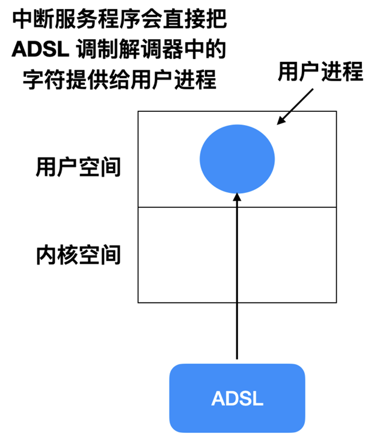|

在没有缓冲区的设计方案中, 用户进程在尝试读取数据时, 如果数据尚未到达, 则会进入阻塞状态, 直至数据可读为止。这种阻塞式的处理方式不仅效率低下, 因为它会导致用户进程在等待数据期间无法执行其他任务, 而且用户体验极差, 因为用户无法容忍进程因等待数据而被长时间挂起。

更为糟糕的是, 如果采用每次字符到达都重启用户进程的方案, 那么系统性能将遭受严重损害。想象一下, 每当一个字符通过网络到达时, 系统都需要重新加载并启动用户进程来处理这个字符, 这将导致大量的资源消耗和时间浪费。

---

为了改进这一设计, 我们可以在用户空间中引入一个能够读取n个字节的缓冲区。这个缓冲区将作为用户进程和数据源之间的中间存储区域。当中断服务程序检测到有数据到达时, 它会将这些数据逐个放入缓冲区中, 直到缓冲区被填满或者没有更多数据可读为止。然后, 中断服务程序会通知并唤醒等待中的用户进程, 告知其缓冲区中已有数据可读。

这种带有缓冲区的设计方案相较于无缓冲区的方案有着显著的优势。它不仅提高了数据处理的效率, 因为用户进程可以在缓冲区填满后一次性读取多个字符, 而无需为每个字符的到达都进行阻塞等待和进程重启；而且它还改善了用户体验, 因为用户进程在等待数据期间可以执行其他任务, 而不会被长时间挂起。

| ##container## |
|:--:|
|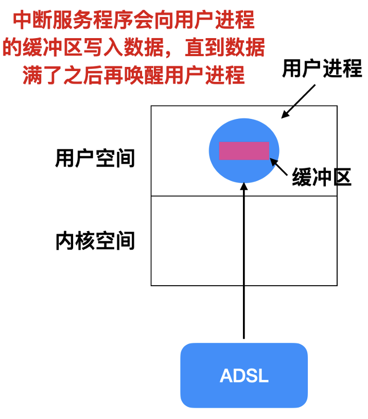|

然而, 当字符数据到达时, 若缓冲区恰好被操作系统调出到内存之外(即发生换页), 将会引发一系列问题。具体而言, 若此时尝试将数据写入已被调出的缓冲区, 将导致数据丢失或系统错误, 因为目标内存区域当前并不可用。

---

为了应对这一问题, 一种直观的解决方案是将缓冲区锁定在内存中, 防止其被操作系统换出。但这种方法同样存在潜在风险。当大量缓冲区被锁定在内存中时, 可用于换页的内存页面数量将大幅减少, 这可能导致系统性能下降。因为操作系统在内存管理时需要保持一定的页面置换灵活性, 以应对不断变化的内存需求。若大量页面被固定, 将限制操作系统的页面置换能力, 进而影响整体系统性能。

为了平衡内存锁定与系统性能之间的关系, 一种更为合理的解决方案是在操作系统内核中创建一块专用的缓冲区。这块缓冲区位于内核空间, 由操作系统直接管理。当中断服务程序接收到字符数据时, 它会将这些数据直接写入内核内部的缓冲区中。这样, 即使用户空间的缓冲区被换出, 也不会影响字符数据的接收和存储。因为内核空间的缓冲区始终由操作系统维护, 并享有较高的内存保护级别和访问速度。

| ##container## |
|:--:|
|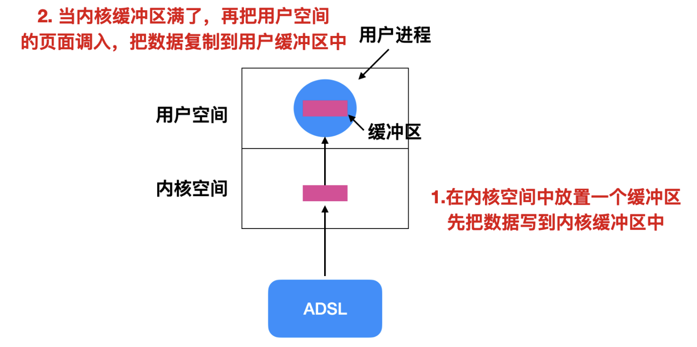|

当内核中的缓冲区即将达到容量上限时, 操作系统会尝试将用户空间中的相应页面调入内存, 以便将内核缓冲区中的数据复制到用户缓冲区。然而, 这一过程中可能会遇到一个问题: 如果用户空间的页面刚被换入内存, 而内核缓冲区此时已经满载, 并且恰好有新的字符数据到达, 那么系统将面临一个挑战——因为内核缓冲区已无剩余空间来存储这些新到的字符。

---

为了应对这一挑战, 一种直观且有效的解决方案是引入额外的缓冲区。具体来说, 可以设置一个或多个备用缓冲区, 当主缓冲区(即当前正在使用的缓冲区)填满后, 在数据被完全处理并清空之前, 系统可以切换到备用缓冲区来接收新到的字符数据。这种解决方式如下:

| ##container## |
|:--:|
|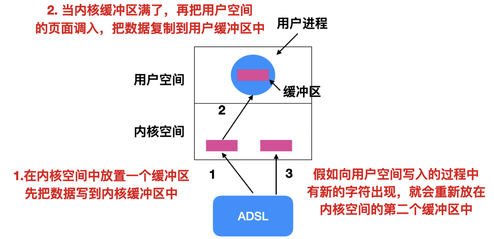|

当第二个缓冲区同样达到容量上限时, 系统会将其中的数据复制到用户空间中, 随后释放第一个缓冲区, 使其重新变为可用状态, 用于接收后续新到达的字符。这种采用两个缓冲区的设计策略, 我们称之为“双缓冲(double buffering)”。

除了双缓冲之外, 还存在另一种重要的缓冲形式, 即“循环缓冲(circular buffer)”。循环缓冲由一个连续的内存区域以及两个关键的指针构成: 一个指针负责指示下一个空闲的位置, 新数据将被存放于此；另一个指针则指向缓冲区中尚未被处理或删除的最早数据。在多数情况下, 硬件在接收到新数据时会自动移动第一个指针(即写入指针), 而操作系统在删除或处理完无用数据后, 会相应地移动第二个指针(即读取指针)。当这两个指针达到缓冲区的末端时, 它们会回绕到缓冲区的起始位置, 从而形成一个循环的结构。

缓冲区在输出操作中同样扮演着至关重要的角色。尽管输出的具体流程与输入存在差异, 但缓冲的基本原理在两者间是相似的。例如, 在输出过程中, 数据首先被写入缓冲区, 待缓冲区达到一定容量或满足特定条件后, 再一次性将数据发送到目标设备, 从而提高效率。

缓冲技术因其能够显著提高数据传输和处理的效率而被广泛应用于各种场景中。然而, 它也存在一定的局限性。如果数据被过度缓冲, 即数据在缓冲区中停留的时间过长, 那么可能会导致系统整体性能的下降。这是因为过多的缓冲会增加数据的访问延迟, 同时占用额外的内存资源。考虑例如如下这种情况:

| ##container## |
|:--:|
|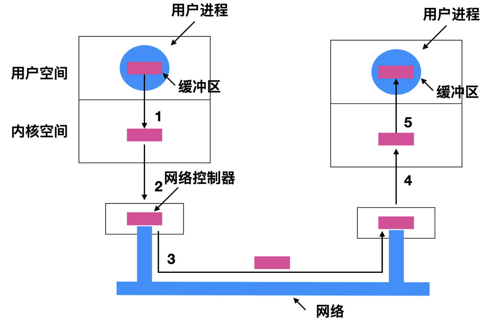|

数据经过`用户进程 -> 内核空间 -> 网络控制器`, 这里的网络控制器应该就相当于是 `socket 缓冲区`, 然后发送到网络上, 再到接收方的`网络控制器 -> 接收方的内核缓冲 -> 接收方的用户缓冲`, 一条数据包被缓存了太多次, 很容易降低性能。

### 1.6 错误处理
在I/O操作中, 遇到错误是极为常见的现象。为了确保系统的稳定性和可靠性, 操作系统必须能够有效地应对和处理这些错误。根据错误的性质, 我们可以将其大致分为两类: 一类是与特定设备紧密相关的错误, 另一类则是与设备无关、由更广泛的系统框架处理的错误。

其中, 一类典型的I/O错误源于程序员的编程失误。例如, 程序员可能在文件尚未成功打开的情况下就尝试读取文件流, 或者未能及时关闭文件流而导致内存泄漏或溢出。这类错误通常需要由程序员自身在编写代码时加以注意和避免, 并在代码审查、测试等阶段进行修正。
另一类I/O错误则是由实际的物理或逻辑问题引起的。例如, 当尝试向一个磁盘上的坏块写入数据时, 无论怎么尝试, 数据都无法成功写入。这类错误通常是由底层的驱动程序来处理的。驱动程序会尝试采取各种措施来纠正或绕过这些问题, 比如通过重试写入操作、使用备用扇区等。如果驱动程序无法处理这些错误, 那么它们可能会被传递给硬件层面进行进一步的处理。例如, 一些高端存储设备可能内置有自我修复机制, 能够自动检测并修复坏块。

> 虽然驱动程序和硬件在处理I/O错误中扮演着重要角色, 但程序员仍然需要保持高度的警惕和责任感。通过编写健壮的代码、进行充分的测试以及利用系统提供的错误处理机制, 程序员可以最大程度地减少I/O错误的发生, 并确保系统的稳定性和可靠性。

### 1.7 设备驱动程序统一接口
> 在操作系统概述中, 我们强调了操作系统的一个重要功能: 它作为硬件与软件之间的桥梁, 有效地屏蔽了两者之间的差异性, 并为它们提供了一个统一的标准。这一标准不仅确保了软件在不同硬件平台上的兼容性, 还体现在为各类设备驱动程序提供了统一的接口规范。

由于不同硬件设备和制造商所编写的设备驱动程序存在显著的差异, 如果操作系统为每种驱动程序都单独设计接口, 那么这将极大地增加系统的复杂性和维护成本。为了解决这个问题, 操作系统采用了一种更为高效和灵活的策略: 为所有设备驱动程序提供一个标准化的接口。这样, 无论是哪种硬件设备或制造商提供的驱动程序, 只要它们遵循这一统一的接口规范, 就能够与操作系统进行无缝对接和通信。

### 1.8 分配和释放
在操作系统中, 某些设备(如打印机)由于其物理或逻辑特性, 通常只能被单个进程独占使用。为了确保设备使用的合理性和高效性, 操作系统需要一种机制来管理和协调对这类设备的访问请求。

一种简单直接的方法是, 在尝试使用设备时执行`open`操作。如果设备当前已被其他进程占用, 那么`open`操作将失败, 并 **返回一个错误码** 给请求进程。这种方式的好处是直观且易于实现, 但它要求请求进程能够妥善处理这种失败情况, 并可能需要在稍后时间重新尝试访问设备。

另一种更为灵活的方法是, 当设备被占用时, 不立即返回失败, 而是让请求进程进入 **阻塞状态**。这样, 请求进程会暂停执行, 直到设备被当前占用的进程释放为止。一旦设备变为可用状态, 操作系统将唤醒被阻塞的进程, 并允许其继续执行`open`操作以访问设备。这种方式赋予了用户进程更多的选择权, 它可以根据自身的需求和资源状况来决定是否等待设备资源的释放。

### 1.9 设备无关的块
在数据存储和传输的过程中, 不同类型的磁盘设备往往具有不同的扇区大小。然而, 应用软件在执行存储操作时, 通常并不需要考虑这些扇区大小的差异。换句话说, 应用软件只需关注数据的存储和读取, 而无需关心底层存储设备的物理特性, 如扇区大小等。

操作系统和设备驱动程序的设计使得这些差异对应用软件而言是透明的(也就是不影响的)。

## 二、用户空间的 I/O 软件
在计算机系统中, 虽然大部分I/O软件确实位于内核结构中, 负责处理与硬件设备的交互和数据的传输, 但并非所有I/O软件都严格遵循这一模式。实际上, 存在一些I/O软件和库过程是在用户空间中实现的, 它们通过提供系统调用的接口与内核进行交互。

这种在用户空间中实现的I/O软件具有其独特的优势。首先, 由于用户空间与内核空间是分离的, 因此用户空间中的I/O软件可以更加灵活地处理数据, 而无需受到内核空间严格的安全和权限限制。其次, 用户空间中的I/O软件可以更容易地进行更新和升级, 而无需重启系统或修改内核代码。

然而, 尽管用户空间中的I/O软件具有这些优势, 但它们仍然需要与内核进行交互以完成实际的I/O操作。这通常是通过系统调用接口实现的, 系统调用是一种由操作系统提供的、允许用户空间程序请求内核服务的机制。

举个例子, 一些高性能的网络库(如libevent、libuv等)就是在用户空间中实现的。它们提供了丰富的网络I/O处理功能, 如事件驱动、非阻塞I/O等, 并通过系统调用接口与内核的网络子系统进行交互, 以实现数据的发送和接收。这些库的存在极大地简化了网络编程的复杂性, 并提高了网络应用的性能和可扩展性。

因此, 在计算机系统中, I/O软件的实现方式并非绝对的内核实现或用户空间实现, 而是根据具体需求和场景来选择合适的实现方式。

### 2.1 盘
#### 2.1.1 盘硬件
磁盘是众多存储类型中的一种, 其最基本且广为人知的构造形式是磁盘(magnetic disk), 也常被称作硬盘(hard disk, HDD)。磁盘的工作原理依赖于安装在磁臂上的磁头, 这一设计使得磁头能够精准地将数据写入磁盘或从磁盘中读取数据, 因此磁盘的读写速度相对均衡。

磁盘的一大特性是支持数据的随机访问。这意味着磁盘能够按照任意顺序存储和检索数据块, 用户可以在磁盘上的任意位置放置数据, 磁头都能够迅速定位并进行读取。此外, 磁盘属于非易失性存储设备, 即使在断电的情况下, 磁盘上存储的数据也能永久保留。

在计算机发展的早期阶段, 光盘曾是主流的数据存储介质。然而, 随着技术的不断进步, 固态硬盘(SSD)因其不包含任何运动部件, 从而提供了更高的稳定性和耐用性, 逐渐成为了现代计算机的首选存储方式。与传统的磁盘相比, 固态硬盘在读写速度、抗震性以及能耗等方面都展现出了显著的优势。

#### 2.1.2 磁盘
为了组织和检索数据, 会将磁盘组织成特定的结构, 这些特定的结构就是**磁道、扇区和柱面**

| ##container## |
|:--:|
|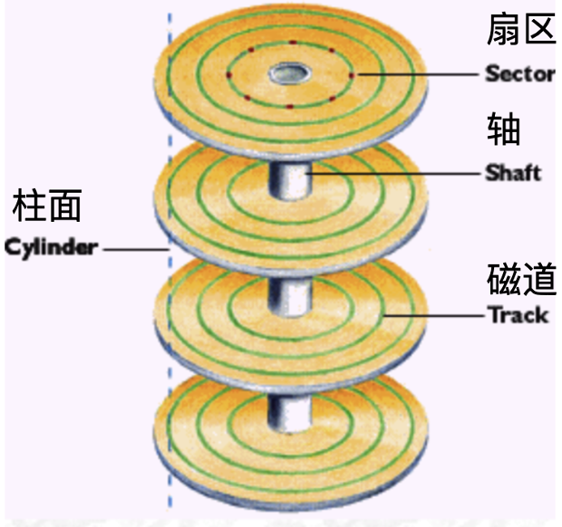|
|垂直记录硬盘(PMR, Perpendicular Magnetic Recording)|

> 叠瓦式磁盘的特征是磁道之间的部分重叠以提高存储密度, 上图不是叠瓦盘.

| ##container## |
|:--:|
|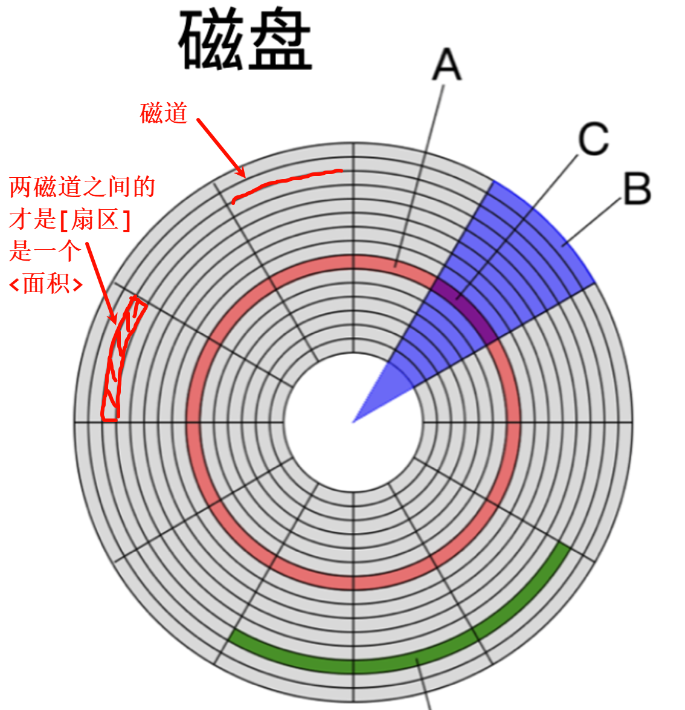|

磁盘的内部结构被精心组织成柱面形式, 其中每个磁盘都通过轴心相连。每个柱面进一步细分为多个磁道, 而每个磁道则由一系列的扇区构成。具体而言, 在软盘上, 每个磁道通常包含8至32个扇区；而在硬盘上, 这一数字显著提升, 每个磁道上的扇区数量可能高达几百个。此外, 磁盘还可能配备1至16个磁头, 用于数据的读写操作。

磁盘驱动程序的一个关键特性在于其控制器是否具备同时控制多个驱动器进行磁道寻址的能力, 这一能力被称为`重叠寻道(overlapped seek)`。在实际操作中, 控制器能够指挥一个磁盘驱动程序执行寻道任务, 同时安排其他驱动程序处于等待状态, 直至当前寻道操作完成。更进一步地, 控制器还能够在某个驱动程序进行读写操作时, 允许另一个驱动器同时进行寻道, 从而优化整体操作效率。然而, 软盘控制器并不支持在两个驱动器上同时进行读写操作, 这是其设计上的一个限制。

#### 2.1.3 RAID
RAID, 全称为“磁盘冗余阵列”, 也被简称为“磁盘阵列”。它利用虚拟化技术, 将多个硬盘组合在一起, 形成一个或多个磁盘阵列组, 旨在提升数据存储的性能或实现数据冗余以保障数据安全。(玩NAS的都知道好吧...)

#### 2.1.4 磁盘格式化
磁盘由一系列由铝、合金或玻璃制成的盘片构成。在磁盘刚被制造出来时, 它上面并没有存储任何信息。为了使磁盘能够正常使用, 它必须经过一个称为`低级格式化(low-level format)`的过程。

低级格式化过程中, 磁盘的每个扇区都会被赋予一个特定的格式。以下是一个典型的扇区格式:

| ##container## |
|:--:|
||

扇区的开始位置由`前导码(Preamble)`标示。前导码通常以特定的位模式开始, 用于帮助磁盘驱动器定位扇区的起始点。此外, 前导码中还包含了诸如`柱面号、扇区号`等关键信息, 这些信息对于磁盘驱动器来说至关重要, 因为它们能够帮助驱动器准确地定位到磁盘上的每一个扇区。

紧随前导码之后的是`数据区(Data Area)`, 这是实际存储用户数据的地方。数据区的大小通常由低级格式化程序在格式化过程中确定。在大多数磁盘中, 每个扇区的数据部分大小为512字节, 但这一数值并非绝对, 它可能会因磁盘制造商和型号的不同而有所变化。

数据区之后是`ECC(Error Correction Code, 数据纠错码)`区域。ECC与普通的错误检测机制不同, 它不仅能够检测到数据中的错误, 还能够通过一定的算法来纠正这些错误, 从而恢复出正确的数据。ECC区域的大小通常由磁盘制造商根据自身的技术实力和市场需求来决定。设计者需要在提高磁盘可靠性和节省磁盘空间之间做出权衡, 同时还需要考虑ECC算法的复杂性和实现难度。

通常情况下, ECC的大小为16位, 但这只是一个常见的数值, 并非所有磁盘都采用这一标准。此外, 为了应对磁盘制造过程中可能出现的缺陷, 硬盘通常会预留一定数量的备用扇区(Spare Sectors)。这些备用扇区可以在磁盘上的某些扇区出现制造缺陷时, 被用来替换这些缺陷扇区, 从而确保磁盘的可靠性和数据的安全性。

低级格式化后的磁盘布局中, 每个磁道的0扇区位置相对于其前一个磁道都存在一定程度的偏移, 这种设计被称为`柱面斜进(cylinder skew)`。该技术的采用旨在优化程序的运行性能, 确保数据读取的高效性。如下图所示:

| ##container## |
|:--:|
|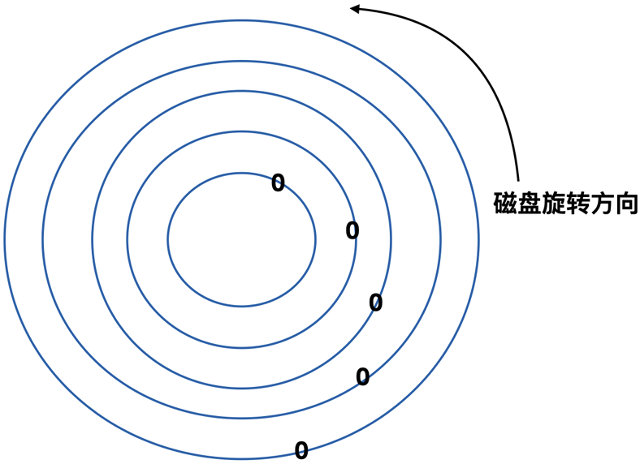|

为了深入理解这一点, 我们可以设想磁盘在旋转过程中, 磁头负责读取各个扇区的信息。当磁头完成内侧一圈扇区的数据读取后, 它会开始向外侧磁道进行寻址操作。在寻址过程中, 磁盘仍在持续旋转。如果不采用柱面斜进的设计, 那么当磁头成功寻址到外侧磁道时, 原本应该被读取的0号扇区可能已经转过了磁头的位置, 这意味着磁头需要等待磁盘再旋转一圈才能再次读取到这个扇区。

然而, 通过引入柱面斜进的设计, 我们可以有效地消除这一问题。柱面斜进量, 即两个相邻同心圆上0号扇区之间的差异量, 是根据驱动器的几何规格精心计算的。这个差异量确保了当磁头从内侧磁道移动到外侧磁道时, 0号扇区恰好处于磁头的读取范围内, 从而避免了不必要的等待时间。

(说白了就是`磁头`的移动不是光速的, 因此不能在同一起跑线上, 开跑的时候, 在起跑线上移动, 别人必然已经从起跑线上跑了!)

在磁盘技术中, 除了柱面斜进之外, 磁头也会存在一定的`斜进(head skew)`现象, 尽管这种斜进相对较小。磁头斜进的设计同样是为了优化磁盘的性能, 尽管其影响程度不如柱面斜进显著。

磁盘在经历格式化过程时, 其可用容量会有所减少。这部分减少的容量主要被用于存储前导码、扇区间间隙、ECC(Error Correction Code, 错误纠正码)数据以及保留的备用扇区。前导码用于标识扇区的开始位置, 扇区间间隙则是为了确保磁头能够准确地在不同扇区之间切换, ECC则用于检测和纠正数据读取过程中的错误, 而备用扇区则用于替换可能出现故障的扇区。

在磁盘正式投入使用之前, 还需要经过一个关键步骤--`高级格式化(high-level format)`。这一步骤针对磁盘的每个分区进行, 主要目的是设置引导块、空闲存储管理(通常采用位图或空闲列表形式)、根目录以及空文件系统。在高级格式化过程中, 分区表项会被更新, 以指示该分区所使用的文件系统类型。由于许多操作系统支持多种兼容的文件系统, 因此这一步骤至关重要。

完成高级格式化后, 系统即可进行引导过程。当电源接通时, `BIOS(Basic Input/Output System, 基本输入输出系统)`会首先启动并运行。BIOS会读取主引导记录(MBR), 并跳转到MBR中指定的位置执行引导程序。引导程序会检查哪个分区被标记为活动分区, 并从该分区读取`启动扇区(boot sector)`。启动扇区包含一个小程序, 该程序负责加载一个更大的引导器, 该引导器会在文件系统中搜索`系统内核(system kernel)`。一旦找到系统内核, 该程序就会将其加载到内存中并执行, 从而启动操作系统。