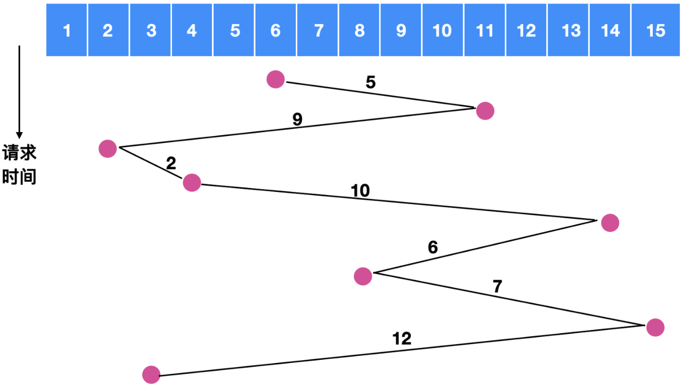
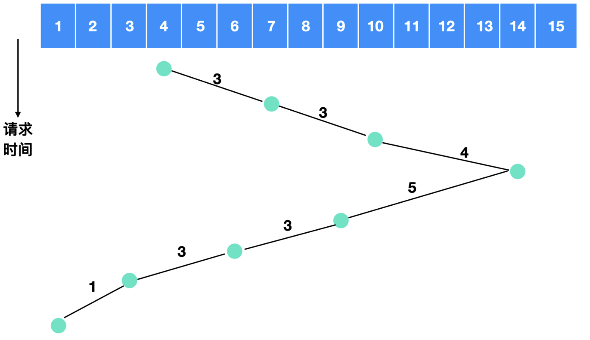
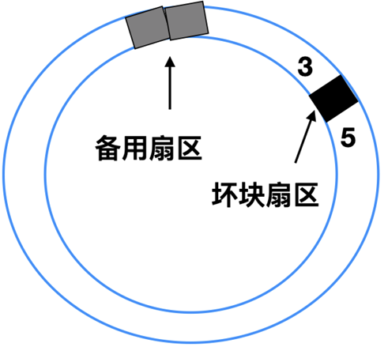
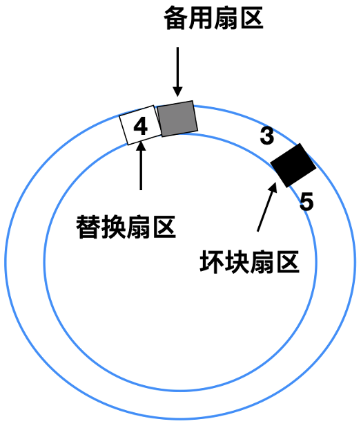
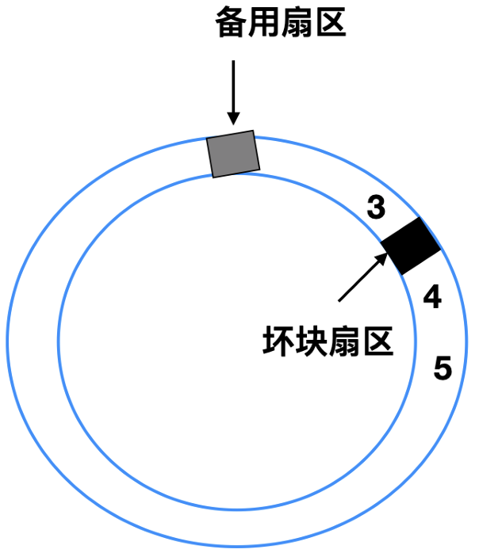
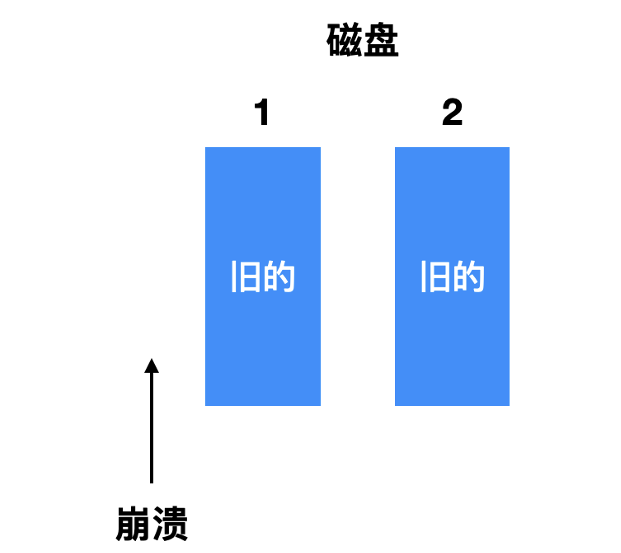
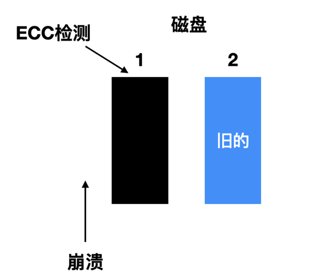
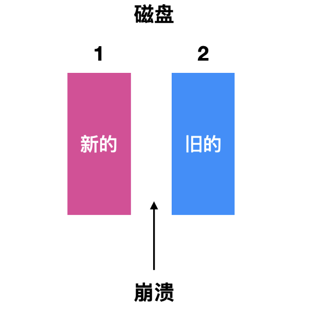
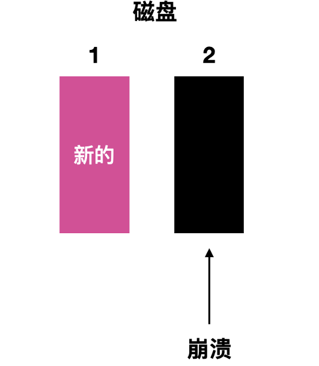
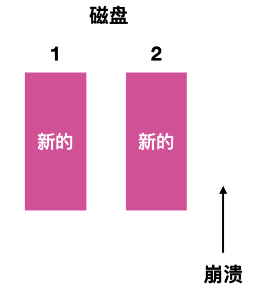

# 磁盘调度
## 一、磁盘臂调度算法
磁盘的快速读写时间主要由以下几个因素决定: 
1. **寻道时间**: 这是指将磁盘臂移动到所需读取或写入磁盘块所在位置所需的时间。
2. **旋转延迟**: 这是指等待目标扇区旋转到磁头下方所需的时间。
3. **数据读写时间**: 这是指实际进行数据读取或写入操作的时间。

而2、3都是物理限制(也就是得加钱!); *其中, 寻道时间通常对总时间的影响最大*。因此, 有效降低寻道时间是提升磁盘读取速度的关键。

### 1.1 先来先服务
在磁盘处理请求的方式上, 如果磁盘驱动程序按照接收顺序依次完成请求, 这种方式被称为`先来先服务(First-Come, First-served, FCFS)`。然而, 这种方式的优化效果有限, 因为它不考虑请求之间的相对位置关系。例如, 当磁盘臂完成一个请求后, 可能需要等待整个磁盘旋转一周才能到达下一个请求的位置, 而在此期间, 其他更接近当前磁盘臂位置的柱面可能已经有可以立即处理的请求。这会导致请求排队等待, 降低磁盘的利用率和读写速度。

另外, 磁盘驱动程序通常会维护一张请求表。这张表以柱面号为索引, 将每个柱面未完成的请求形成链表, 链表头存放在表的相应表项中。这样, 驱动程序可以更方便地管理和调度请求。

假如我们在对磁道`6`号进行寻址时, 同时发生了对`[11, 2, 4, 14, 8, 15, 3]`的请求, 如果采用先来先服务的原则, 如下图所示:

| ##container## |
|:--:|
||

磁盘臂所跨越的磁盘数量为 $5 + 9 + 2 + 10 + 6 + 7 + 12 = 51$, 相当于是跨越了 $51$ 次盘面.

### 1.2 最短路径优先(SSF)算法
最短路径优先(SSF)算法的基本思想是, 在每次选择下一个要处理的请求时, 都选择能使 **磁盘臂移动距离最短** 的请求。这样, 磁盘臂的移动路径会更短, 从而减少了寻道时间。

跨越的磁盘数量为 $4 + 1 + 1 + 4 + 3 + 3 + 1 = 17$ , 相比 $51$ 足足省了两倍的时间。

但是, SSF算法容易引起`饥饿现象`: 如果有一个特别远的磁道需要读取, 而却源源不断有很近的磁道的请求. 那么磁头就会优先处理近的, 远的就被抛弃了...

### 1.3 电梯算法(elevator algorithm)
电梯在运行过程中, 采用的是一种被称为`电梯算法(elevator algorithm)`的调度策略, 旨在平衡效率与公平性这两个看似矛盾的目标。电梯通常会保持向一个方向持续移动, 直至该方向上再无待处理的请求, 随后才会改变移动方向。

在电梯算法中, 有一个关键的“二进制位”被用于指示当前的运动方向, 即`UP(向上)`或`DOWN(向下)`。每当一个请求被处理完毕后, 电梯或磁盘的驱动程序会检查这个方向位。若方向位为`UP`, 则电梯或磁盘臂会移动到下一个更高且尚未完成的请求位置。若在该方向上已无待处理的请求, 则会改变方向向下移动。同理, 当方向位为`DOWN`时, 若存在一个更低位置的请求, 则电梯或磁盘臂会转向该位置移动。若不存在这样的请求, 则会停止并等待新的指令。

将这一策略应用于磁盘调度中, 我们可以发现, 与SSF算法相比, 电梯算法通过维护一个当前运动方向的状态, 能够更智能地处理请求队列中的任务, 从而在一定程度上解决了SSF算法中的优先级问题。

| ##container## |
|:--:|
||

电梯算法需要跨越的盘面数量是 $3 + 3 + 4 + 5 + 3 + 3 + 1 = 22$

> 通常情况下, 电梯算法(Elevator Algorithm)在性能表现上不及最短路径优先(SSF)算法。

不过, 当磁盘控制器具备一种特殊功能, 即为软件提供检查磁头下方当前扇区号的能力时, 我们可以利用这一特性实现另一种优化策略。具体来说, 如果在同一个柱面上存在两个或多个待处理的请求, 磁盘驱动程序可以利用这一信息, 智能地发出指令, 要求磁盘在下次经过磁头时读写特定的扇区。

> 例如, 假设磁头当前正位于柱面10, 且该柱面上有两个待处理的请求, 分别指向扇区5和扇区15。如果磁盘控制器支持检查当前磁头下方的扇区号, 那么驱动程序可以判断磁头在旋转过程中将先后经过扇区5和扇区15(假设它们位于磁头的移动路径上)。在这种情况下, 驱动程序可以预先发出指令, 要求磁盘在磁头经过扇区5时读取或写入数据, 然后在磁头继续旋转到扇区15时再处理该扇区的请求。

通过这种方式, 驱动程序能够更有效地利用磁盘的旋转, 减少等待时间, 从而提高数据处理的效率。这种优化策略特别适用于那些在同一柱面上有多个请求的场景, 因为它能够最大限度地减少磁头的寻道次数和旋转延迟。然而, 这种优化策略的实现依赖于磁盘控制器是否具备检查当前磁头下方扇区号的能力, 因此并非所有磁盘系统都能采用这一策略。

> [!TIP]
> 值得注意的是, 当一个柱面有多条磁道时, 相继的请求可能针对不同的磁道, 这种选择没有代价, 因为选择磁头不需要移动磁盘臂也没有旋转延迟。

---

磁盘的性能主要受寻道时间和旋转延迟的影响, 因此, 每次仅读取一个或两个扇区的效率极低。为了提高效率, 许多磁盘控制器设计为在读取一个扇区的同时, 会预读取该扇区所在磁道上的多个扇区, 或者根据控制器高速缓存的可用空间, 读出尽可能多的扇区。这种策略旨在通过减少寻道次数和旋转延迟来提高数据传输效率。

磁盘控制器的高速缓存与操作系统的高速缓存有所不同。磁盘控制器的高速缓存主要用于存储那些虽未被直接请求, 但可能随后会被访问的扇区数据。而操作系统维护的高速缓存则包含那些已被明确读取, 且预计近期内仍会频繁使用的数据块。

在多驱动器环境中, 操作系统应为每个驱动器单独维护一个未完成的请求表。当某个驱动器处于空闲状态时, 操作系统应发出寻道请求, 将磁盘臂移动到下一个被请求的柱面。如果下一个寻道请求到来时, 没有磁盘臂恰好处于正确位置, 驱动程序会在刚刚完成数据传输的驱动器上发出新的寻道命令, 并等待下一个中断。在中断到来时, 系统会检查哪个驱动器处于空闲状态, 以便继续处理请求。

> 假设一个系统中有两个磁盘驱动器, 分别标记为Drive A和Drive B。当Drive A正在处理一个读取请求时, Drive B可能处于空闲状态。此时, 操作系统可以检查Drive B的未完成请求表, 如果发现有待处理的请求, 就可以向Drive B发出寻道请求, 将磁盘臂移动到相应的柱面。当Drive A完成数据传输并触发中断时, 如果Drive B的寻道操作已完成, 驱动程序就可以继续在Drive B上处理请求; 如果Drive B的寻道操作尚未完成, 驱动程序则会等待, 直到Drive B的寻道操作完成, 或者另一个驱动器变为空闲状态。

## 二、错误处理
磁盘在制造的过程中可能会有瑕疵, 如果瑕疵比较小, 比如只有几位, 那么使用坏扇区并且每次只是让`ECC`纠正错误是可行的, 如果瑕疵较大, 那么错误就不可能被掩盖。

一般坏块有两种处理办法, 一种是在控制器中进行处理; 一种是在操作系统层面进行处理。

这两种方法经常替换使用, 比如一个具有 30 个数据扇区和两个备用扇区的磁盘, 其中扇区 4 是有瑕疵的。

| ##container## |
|:--:|
||

控制器能做的事情就是将备用扇区之一重新映射:

| ##container## |
|:--:|
||

还有一种处理方式是将所有的扇区都向上移动一个扇区:

| ##container## |
|:--:|
||

上面这这两种情况下控制器都必须知道哪个扇区, 可以通过内部的表来跟踪这一信息, 或者通过重写前导码来给出重新映射的扇区号。如果是重写前导码, 那么涉及移动的方式必须重写后面所有的前导码, 但是最终会提供良好的性能。

## 三、稳定存储器
磁盘在运行过程中难免会遇到各种故障, 这些故障可能导致原本正常的扇区转变为坏扇区, 甚至驱动程序也可能因故障而失效。RAID(独立磁盘冗余阵列)技术虽然能够为扇区错误或驱动器崩溃提供一定的保护, 但它并非万能的。RAID无法防范因坏数据导致的写错误, 也无法在写操作期间发生崩溃时保护原始数据的完整性。

尽管我们期望磁盘能够始终准确无误地工作, 但实际情况往往并非如此。然而, 我们可以明确的是, 一个理想的磁盘子系统应具备以下特性: 当接收到写命令时, 磁盘要么能够正确地写入数据, 要么完全不进行任何写操作, 从而确保现有数据的完整性和准确性。这样的系统被称为`稳定存储器(stable storage) `。

稳定存储器的核心目标是不惜一切代价确保磁盘数据的一致性。为了实现这一目标, 稳定存储器可能采用多种技术手段, 如数据校验、冗余存储等, 以确保在发生故障时能够恢复数据的完整性。

稳定存储器使用两个一对相同的磁盘, 对应的块一同工作形成一个无差别的块。稳定存储器为了实现这个目的, 定义了下面三种操作:

- 稳定写(stable write)
- 稳定读(stable read)
- 崩溃恢复(crash recovery)

在稳定写操作中, 数据首先被写入到第一个驱动器(例如驱动器1)上的指定块中。随后, 系统会读取刚刚写入的数据块以验证其正确性。如果读取的数据与写入的数据不匹配(即验证失败), 系统会重新尝试写入和读取操作, 直到数据能够成功验证为止。如果经过多次尝试后, 驱动器1上的指定块仍然无法正确写入数据, 系统会选择一个备用块进行替换, 并重复上述写入和验证过程。值得注意的是, 只有在驱动器1上的写入和验证操作成功后, 系统才会将相同的数据写入到第二个驱动器(驱动器2)上, 并进行相应的验证。这样, 我们实际上是对两个驱动器都进行了数据的写入操作, 从而确保了数据的冗余和可靠性。

在稳定读操作中, 系统首先尝试从第一个驱动器(驱动器1)上读取数据。如果读取过程中产生了错误的ECC(错误检查与纠正码), 系统会再次尝试从驱动器1上读取该数据块。如果多次尝试后仍然无法获得正确的ECC, 系统会转而从第二个驱动器(驱动器2)上读取数据。这样, 我们实际上是对两个驱动器都进行了数据的读取操作, 以最大限度地提高数据读取的成功率。

崩溃恢复操作是在系统发生崩溃后, 用于恢复数据一致性的过程。由于稳定存储器采用了双磁盘冗余策略, 因此在系统崩溃后, 系统可以通过比较两个驱动器上的数据块来确定哪个数据块是最新的、正确的数据。然后, 系统会使用最新的、正确的数据来恢复整个存储系统的一致性。

如果CPU保持正常运行, 那么稳定写策略是切实可行的。该策略的核心在于, 它总是对每个数据块创建并写入两个有效的副本, 且基于一个基本假设: 同一时刻, 两个对应的副本块不会同时发生自发性错误。然而, 当考虑CPU在稳定写过程中可能发生崩溃的情况时, 结果的确定就变得复杂起来, 具体取决于崩溃发生的精确时间点。

1. 第一种情况是崩溃发生在 **写入之前**, 在恢复的时候就什么都不需要修改, 旧的值也会继续存在。

| ##container## |
|:--:|
||

2. 第二种情况是 CPU 崩溃发生在写入驱动器 1 的时候, 崩溃导致块内容被破坏, 然而恢复程序能够检测出这一种错误, 并且从驱动器 2 恢复驱动器 1 上的块。

| ##container## |
|:--:|
||

3. 第三种情况是崩溃发生在磁盘驱动器 1 之后但是还没有写驱动器 2 之前, 这种情况下由于磁盘 1 已经写入成功, 那只需要把 2 和 1 同步一下`新的`即可。

| ##container## |
|:--:|
||

4. 第四种情况是崩溃发生在磁盘驱动 1 写入后在磁盘驱动 2 写入时, 恢复期间会用好的块替换坏的块, 两个块的最终值都是最新的。

| ##container## |
|:--:|
||

5. 最后一种情况就是崩溃发生在两个磁盘驱动写入后, 这种情况下不会发生任何问题。

| ##container## |
|:--:|
||

这种模式下进行任何优化和改进都是可行的, 但是代价高昂, 一种改进是在稳定写期间监控被写入的块, 这样在崩溃后进行检验的块只有一个。有一种非易失性 RAM 能够在崩溃之后保留数据, 但是这种方式并不推荐使用。