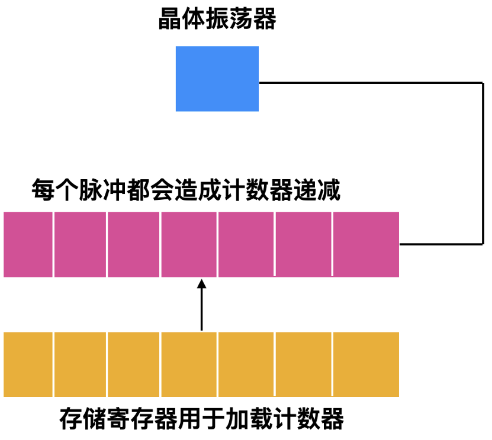

# 时钟
时钟(Clocks), 也常被称为定时器(timers), 是任何程序系统中不可或缺的关键组件。它们承担着维护系统时间、确保任务调度公平性以及防止单个进程过度占用CPU时间等多重职责。时钟软件(clock software), 作为一类特殊的设备驱动程序, 扮演着与硬件时钟交互并管理其功能的角色。

## 一、时钟硬件
在计算机系统中, 存在两种截然不同的时钟类型, 它们与我们在日常生活中所使用的时钟有着本质的区别。

第一种是较为传统的交流(AC)电源同步时钟。这种时钟与110V或220V的电源线相连, 利用交流电的电压周期来产生中断信号。由于大多数地区的交流电频率为50Hz或60Hz, 因此这种时钟会以大约每秒50到60次的频率产生中断。在过去, 这种时钟因其简单可靠且易于实现而占据了主导地位。例如, 在一些早期的计算机系统中, 就采用了这种基于交流电频率的时钟来驱动系统的定时任务。

然而, 随着技术的不断发展, 另一种更为精确和稳定的时钟类型逐渐崭露头角, 那就是晶体振荡器时钟。这种时钟由晶体振荡器、计数器和寄存器等多个组件构成。晶体振荡器能够产生一个稳定的高频振荡信号, 该信号经过计数器分频后, 可以产生一个精确的时钟脉冲。这个时钟脉冲的频率可以根据需要进行调整, 以满足不同系统对时间精度的要求。与AC电源同步时钟相比, 晶体振荡器时钟具有更高的精度和稳定性, 因此在现代计算机系统中得到了广泛应用。

| ##container## |
|:--:|
||
|晶体振荡器时钟的工作原理|

这种时钟被称为“可编程时钟”, 它具备两种工作模式。首先是“一键式(one-shot mode)”模式。在这一模式下, 当可编程时钟被启动时, 它会将存储器中的值复制到计数器中。随后, 每次晶体振荡器发出的脉冲都会使计数器递减1(即-1)。当计数器的值减至0时, 会产生一个中断信号, 并且时钟会停止工作, 直到软件再次发出启动指令。

另一种模式是“方波(square-wave mode)”模式。在这一模式下, 当计数器递减至0并产生中断后, 存储寄存器中的值会自动重新复制到计数器中。这一过程会周期性地重复, 每次计数器从设定值递减至0并产生中断, 形成一个时钟周期。这种周期性的中断信号构成了方波模式的特点。

> 为了更具体地说明这两种模式, 我们可以举以下例子:
>
> - 在“一键式模式”下, 假设存储器中的初始值为10。当时钟启动后, 计数器被设置为10。随着晶体振荡器发出脉冲, 计数器会依次递减至9、8、7……直到0。当计数器变为0时, 产生一个中断信号, 时钟停止工作。此时, 如果软件没有再次发出启动指令, 时钟将保持停止状态。
>
> - 而在“方波模式”下, 同样假设存储器的初始值为10。当时钟启动后, 计数器同样被设置为10。但在计数器递减至0并产生中断后, 存储寄存器中的值(在这个例子中是10)会自动重新复制到计数器中, 形成一个完整的时钟周期。然后, 计数器会再次从10开始递减, 重复这一过程, 产生连续的周期性中断信号

## 二、时钟软件
时钟硬件的核心职责是根据预设的时间间隔精准地产生中断信号, 而后续的一系列复杂任务则交由“时钟软件”来承担。不同的操作系统会依据其特性和需求, 对时钟软件进行不同的具体实现, 但无论哪种系统, 时钟软件通常都会涵盖以下几个关键功能: 

1. **维护一天的时间**: 时钟软件负责准确地记录并更新系统时间, 包括日期和24小时制的时间。这确保了系统能够正确地显示当前时间, 并支持各种基于时间的功能, 如定时任务、日志记录等。

    例如, 在Linux系统中, `cron`服务会利用时钟软件提供的时间信息来执行预设的定时任务。

2. **阻止进程运行的时间超过其指定时间**: 为了确保系统的稳定性和公平性, 时钟软件会监控每个进程的运行时间, 防止其超过系统或用户设定的时间限制。一旦某个进程的运行时间超限, 时钟软件会触发相应的中断或信号, 以终止或挂起该进程。

    例如, 在Unix-like系统中, `ulimit`命令可以用来设置进程的资源限制, 包括CPU时间, 当时钟软件检测到进程超出这些限制时, 会采取相应的行动。

3. **统计CPU的使用情况**: 时钟软件会定期收集CPU的使用数据, 包括各个进程占用的CPU时间、系统空闲时间等, 以便系统管理员或用户能够了解系统的性能状况, 并进行相应的优化。
    例如, 在Windows系统中, 任务管理器会显示每个进程的CPU使用率, 这些数据就是由时钟软件和相关机制收集并提供的。

4. **处理用户进程的警告系统调用**: 时钟软件还负责处理用户进程发出的与时间相关的警告或信号调用, 如设置定时器、延迟执行等。当定时器到期时, 时钟软件会触发相应的中断或回调, 以执行用户指定的操作。

    例如, 在编程中, 我们可以使用`setTimeout`函数来设置一个定时器, 在指定的时间间隔后执行某个函数, 这个函数就是由时钟软件在定时器到期时触发的。

5. **为系统各个部分提供看门狗定时器**: 看门狗定时器是一种用于监控系统关键部分运行状态的机制。时钟软件会为这些部分提供定期的中断信号, 以检查它们是否仍在正常工作。如果某个部分未能及时响应看门狗定时器的中断, 时钟软件会触发相应的故障处理流程。

    例如, 在嵌入式系统中, 看门狗定时器常用于监控主程序的运行状态, 如果主程序陷入死循环或崩溃, 看门狗定时器会触发复位操作, 以恢复系统的正常运行。

6. **完成概要剖析、监视和信息收集**: 时钟软件还会执行一些高级的功能, 如概要剖析(profiling)、系统监视和信息收集等。这些功能有助于系统管理员深入了解系统的运行状态, 并发现潜在的性能瓶颈或安全问题。

## 三、软定时器
时钟软件, 亦被广泛称作可编程时钟, 其强大之处在于能够按照程序所需的任意速率来触发中断。值得注意的是, 时钟软件触发的这种中断属于硬中断范畴, 然而, 并非所有应用程序都能很好地适应硬中断的处理方式。

为了应对这一挑战, 人们引入了“软定时器(soft timer)”的概念。软定时器巧妙地规避了硬中断的弊端, 其工作原理是在内核因各种原因(如系统调用、TLB未命中、缺页异常、I/O中断或CPU空闲等)处于运行状态, 并即将返回用户态之前, 检查时钟以确定软定时器是否已到期。若软定时器到期, 则直接执行被调度的事件, 而无需再次切换到内核态。这种方式显著减少了内核态与用户态之间的频繁切换, 从而提升了程序的运行效率。

当一个程序正在执行时, 如果它发起了一个系统调用, 内核会接管执行权。在内核完成系统调用的处理后, 它不会立即返回用户态, 而是会先检查是否有到期的软定时器。如果存在到期的软定时器, 内核会立即执行与之关联的事件处理函数, 然后再返回用户态。这样, 程序就能够以较低的开销处理定时事件, 而不会因硬中断的介入而打断其正常的执行流程。