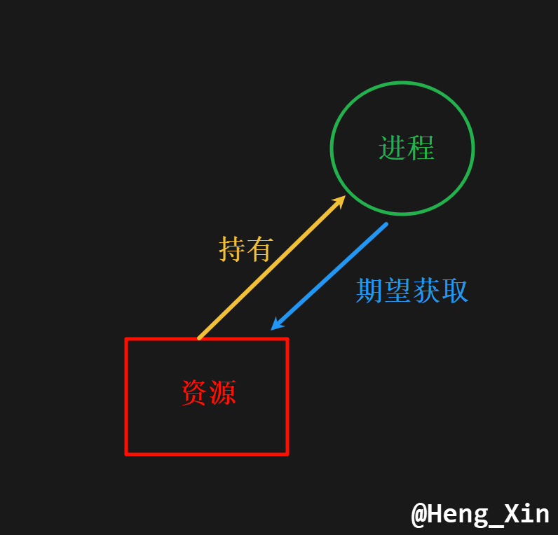
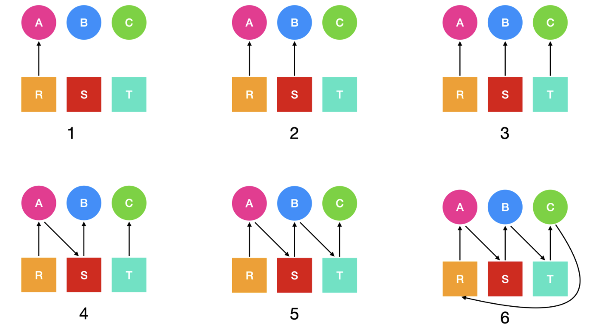
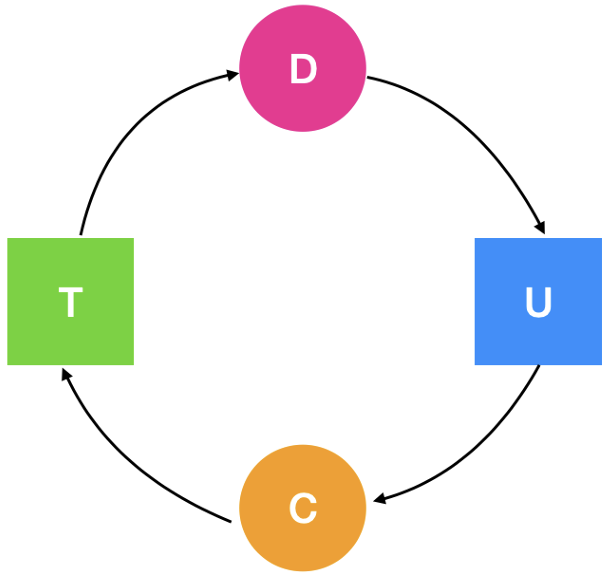
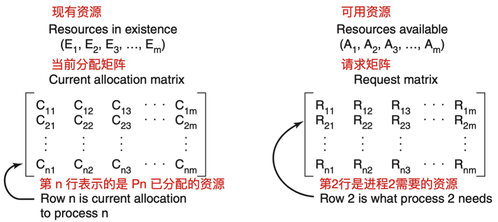
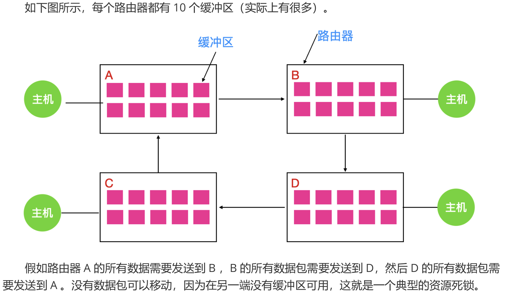

# 死锁
## 一、资源
锁现象大多与资源分配紧密相关, 特别是在进程对设备、文件等对象具有独占性 (即排他性)使用权时, 死锁问题尤为突出。这类需要排他性使用的对象, 我们统称为`资源(resource)`。资源主要可以分为两大类: 可抢占资源和不可抢占资源。

### 1.1 可抢占资源与不可抢占资源
- **可抢占资源(preemptable resource)**: 这类资源可以被系统从当前持有它的进程中强制收回, 而不会对系统或进程造成灾难性的影响。例如, 内存就是一种典型的可抢占性资源。在任何时刻, 系统都可以将内存的使用权从一个进程转移到另一个进程, 而无需担心数据损坏或系统崩溃。

- **不可抢占资源(non-preemptable resource)**: 与可抢占资源相反, 这类资源一旦被某个进程占用, 除非发生错误或异常, 否则不能被其他进程抢占。典型的不可抢占资源包括光盘驱动器。例如, 当一个进程正在使用光盘驱动器读取数据时, 其他进程必须等待该进程完成操作并释放资源后, 才能获得对光盘驱动器的访问权。

虽然可抢占资源在某些情况下也可能导致死锁, 但解决这类死锁问题通常相对简单, 因为系统可以通过重新分配资源来化解冲突。然而, 由于不可抢占资源的特性, 一旦进程陷入死锁状态, 解决起来往往更加复杂和困难。因此, 在研究和解决死锁问题时, 我们的重点通常更多地放在不可抢占资源上。

> 举例来说, 如果两个进程A和B分别持有对方需要的资源 (如进程A持有资源R1, 进程B持有资源R2, 且它们都需要对方的资源才能继续执行), 并且这些资源都是不可抢占的, 那么这两个进程就可能陷入死锁状态。在这种情况下, 除非有外部干预 (如系统管理员手动释放资源), 否则这两个进程将无法继续执行。

下面给出了使用资源所需事件的抽象顺序:

| ##container## |
|:--:|
||

在处理资源请求时, 如果所需资源当前不可用, 请求进程的行为会根据操作系统的不同而有所差异。以下是对这一过程的详细阐述: 

在某些操作系统中, 当进程请求资源但资源不存在或已被其他进程占用时, 该进程会自动进入阻塞状态。这种机制确保了进程不会继续执行无效操作或尝试访问不存在的资源。一旦资源变得可用, 操作系统会负责唤醒该进程, 使其能够继续执行。

然而, 在其他操作系统中, 当进程请求资源失败时, 系统不会立即阻塞进程, 而是返回一个错误代码。此时, 进程可以选择等待一段时间后再重新尝试请求资源。这种策略允许进程在资源暂时不可用的情况下, 通过重试机制来尝试获取资源。

无论是哪种情况, 当进程请求资源失败并陷入等待时, 它可能会进入一种**循环状态**: `请求资源、休眠 (或等待)、再请求资源`。尽管这类进程在技术上并未被操作系统明确阻塞, 但从实际执行效果和目的来看, 它们与阻塞状态相差无几, 因为在这段时间内, 进程并没有执行任何有用的工作。

请求资源的具体过程高度依赖于操作系统的设计和实现。在一些系统中, 进程通过调用`request`系统调用来请求访问资源。而在另一些系统中, 操作系统将资源视为一种特殊文件, 任何时刻只能被一个进程打开和占用。在这种情况下, 进程通过`open`命令来尝试打开资源文件。如果文件已被其他进程占用, 那么调用者会进入阻塞状态, 直到当前占用文件的进程关闭文件并释放资源为止。

> 例如, 在Unix-like操作系统中, 文件和设备通常被视为特殊类型的文件, 可以通过标准的文件操作命令 (如 open、read、write 和 close )进行访问。如果多个进程尝试同时打开同一个设备文件, 那么只有第一个成功打开的进程能够获得对该设备的访问权, 而其他进程则必须等待直到设备被释放。这种机制有助于防止资源冲突和死锁情况的发生。

### 1.2 资源获取
在数据库系统中, 记录等资源的管理通常交由用户进程来负责。为了实现这种管理, 一种常见的方法是采用`信号量 (semaphore)`机制。信号量在初始化时通常被设置为1, 以表示资源可用。此外, `互斥锁 (mutex)`也可以实现类似的功能, 用于确保资源的独占性访问。

之前都tm的学过的.

## 二、死锁
如果要为死锁下一个准确的定义, 我们可以这样表述: 当一组进程中的 **每个进程** 都在等待一个事件, 而这个事件 **只能** 由该组中的另一个进程来触发时, 就发生了死锁。

> 简单来说, 死锁发生在以下情况: 每个进程都在等待其他进程释放资源, 而这些其他进程又恰好在等待当前进程释放资源。这样, 没有一个进程愿意或能够抢先释放自己的资源, 导致所有进程都陷入无限等待的状态。
>
> 换句话说, 在死锁进程集合中, 每个进程都在等待另一个死锁进程已经占有的资源。由于所有进程都处于无法运行的状态, 因此它们都无法释放自己持有的资源。这就形成了一个恶性循环, 导致没有一个进程可以被唤醒继续执行。这种死锁情况被称为“资源死锁 (resource deadlock)”。

例子:

```C++
auto 线程_1() -> void {
    获取空闲的资源A并且上锁(); // ps: 如果该资源不空闲, 则阻塞等待
    获取空闲的资源B并且上锁();
    fun1(A, B);
    解锁资源B();
    解锁资源A();
}

auto 线程_2() -> void {
    获取空闲的资源B并且上锁();
    获取空闲的资源A并且上锁();
    fun2(A, B);
    解锁资源A();
    解锁资源B();
}
```

明显死锁了: 如果`线程_1`锁上`A`的同时, `线程_2`锁上`B`; 那么就完蛋啦~

ps: 修改上锁的顺序, 就可以修复这个八嘎...

> [!TIP]
> 资源死锁是最常见的死锁类型, 但并不是唯一的类型。

### 2.1 资源死锁的条件
资源死锁的发生主要基于以下四个必要条件:

1. **互斥条件**: 每个资源在任意时刻只能被一个进程所占用, 或者资源处于可用状态等待被分配。这意味着资源不是共享的, 而是互斥的。

    举例: 例如, 打印机资源在某一时刻只能被一个进程 (或用户)使用, 当该进程正在打印时, 其他进程必须等待。

2. **保持和等待条件**: 已经持有至少一个资源的进程, 还可以请求获取新的资源, 并且在新资源被分配给它之前, 它不会释放已经持有的资源。

    举例: 一个进程可能已经打开了文件A进行读取, 同时它还想打开文件B进行写入。在文件B被打开之前, 它不会关闭文件A。

3. **不可抢占条件**: 资源只能由持有它的进程显式释放, 而不能被其他进程强制抢占。

    举例: 在操作系统中, 分配给进程的内存块在进程主动释放之前, 不能被其他进程抢占。

4. **循环等待条件**: 在发生死锁时, 系统中必然存在一个或多个进程组成的循环链, 其中每个进程都在等待下一个进程持有的资源, 而最后一个进程又在等待第一个进程持有的资源。

    举例: 假设有三个进程P1、P2和P3, 以及三个资源R1、R2和R3。P1持有R1并等待R2, P2持有R2并等待R3, P3持有R3并等待R1。这样就形成了一个循环等待链, 导致死锁。

这四个条件必须同时满足, 才会发生死锁。如果其中任何一个条件不成立, 死锁就不会发生。因此, 我们可以通过破坏这四个条件中的任意一个来预防和解决死锁问题。


### 2.2 死锁模型
Holt在1972年首次提出了对死锁现象进行建模的方法, 该建模标准具体规定如下:

建模元素与表示方法:
- 圆形: 在模型中, 圆形被用来形象地表示进程。每一个圆形都代表着一个独立的进程实体, 这些进程在系统中并发地运行, 并可能因争夺资源而发生死锁。

- 方形: 方形则在模型中代表资源。每一个方形都象征着系统中可被进程访问和使用的某种资源。这些资源可能是物理设备, 如打印机、磁盘等, 也可能是逻辑资源, 如内存块、文件句柄等。

| ##container## |
|:--:|
||
|建模元素示例|
||
|吃着碗里的看着锅里的容易死锁|

死锁处理四大策略:

1. **鸵鸟策略 (忽略死锁)**
- 适用场景: 死锁概率极低的小型系统 (如嵌入式设备), 不适用于关键系统。

2. **检测与恢复机制**
- 建立资源分配追踪系统
- 检测到死锁后采用: 资源剥夺/进程回滚/系统重启
- 例: 数据库事务死锁时强制回滚

3. **预防性资源分配**
- 资源排序法: 强制统一资源请求顺序
- 银行家算法: 动态检测分配安全性

4. **破坏死锁条件**
- 互斥条件: 允许资源共享 (如只读文件)
- 占有等待: 强制进程一次性请求全部资源
- 不可剥夺: 设置资源超时/抢占机制
- 环路等待: 强制资源层级访问顺序

### 2.3 鸵鸟算法
在面对死锁问题时, 人们可能会采取不同的解决策略。其中, 最简单但也是最不可取的一种方法是所谓的“鸵鸟算法 (Ostrich Algorithm)”。这种策略的核心思想是 **逃避问题**, 即假装问题根本不存在, 不去主动解决它。就像鸵鸟一样把头埋在沙子里, 假装问题根本没有发生。然而, 这种策略显然无法真正解决问题, 只是暂时避开了问题的表面现象。

不同的人对死锁问题的看法和反应各不相同。数学家通常对死锁问题持严谨的态度, 认为死锁是不可接受的, 必须通过有效的策略来预防其发生。他们倾向于从理论层面出发, 寻找能够确保系统在任何情况下都不会陷入死锁的方法。

相比之下, 工程师则更注重实践中的问题解决。他们通常会考虑死锁问题发生的频次以及系统崩溃的其他可能原因。例如, 如果工程师发现死锁发生的频次非常低, 而系统却经常因为硬件故障、编译器错误或其他操作系统问题而崩溃, 那么他们可能会认为修复死锁问题并不是当前的首要任务。在这种情况下, 他们可能会选择将资源投入到解决那些更常见且影响更大的问题上。

然而, 这并不意味着我们应该忽视死锁问题。虽然死锁可能不是系统崩溃的唯一原因, 但它仍然是一个潜在的风险点。如果系统长时间运行且死锁问题频繁发生, 那么它可能会对系统的稳定性和可靠性造成严重影响。因此, 在设计和实现系统时, 我们应该充分考虑死锁问题, 并采取相应的措施来预防其发生。

### 2.4 死锁检测和恢复
在处理死锁问题时, 第二种常见的技术是死锁的检测和恢复。与预防死锁的策略不同, 这种技术并不试图阻止死锁的发生。相反, 它采取了一种更为宽容的态度, 允许死锁在一定条件下发生, 并在检测到死锁后, 采取相应的措施进行恢复。下面, 我们将详细探讨死锁检测和恢复的几种主要方式。

#### 2.4.1 单资源类型死锁检测方式
在探讨计算机系统中的死锁问题时, 我们常常会遇到资源有限且类型单一的情况, 例如打印机资源。在这种情况下, 尽管资源类型唯一 (如只有一台打印机), 但多个进程可能会同时请求该资源, 从而引发死锁现象。

可以通过构造一张资源分配表来检测这种错误, 比如我们上面提到的:

| ##container## |
|:--:|
||

为了有效检测这种单一资源类型的死锁情况, 我们可以构建一个资源分配表来进行监控。这个表将基于特定的算法来检测从 $P_1$ 到 $P_n$ ( $n$ 为进程总数)这些进程中的死锁状态。

首先, 我们需要明确资源的种类和数量。假设系统中只有一种资源类型( $m=1$ ), 我们可以将其标记为 $E_1$ (若存在多种类型, 则依次为 $E_2, E_3, ..., E_i$, 其中 $1 ≤ i ≤ m$ )。此外, 我们引入一个概念: “现有 **资源向量** $E$ ”, 它表示当前系统中每种资源的总数。在单一资源类型的场景下, $E$ 就是一个具体的数值, 代表该资源的总量。

接下来, 我们需要构造两个关键的矩阵: 
1. **当前分配矩阵** $C$: 此矩阵用于记录每个进程当前持有的资源类型及数量。具体来说, $C_i$ 表示进程 $P_i$ 持有的资源数量 (在单一资源类型下, $C_i$ 就是一个数值), 而 $C_{ij}$ (尽管在这个特定场景下 $j$ 总是为 $1$, 但为了保持一般性, 我们仍保留此双下标表示法)则具体表示进程 $P_i$ 持有的资源 $j$ 的数量。

2. **请求矩阵** $R$: 此矩阵记录了每个进程还需要获得多少资源才能继续执行。 $R_{ij}$ 表示进程 $P_i$ 还需要获得的资源 $j$ 的数量。同样地, 在单一资源类型场景下, $j$ 总是为 $1$, 但为保持矩阵表示的通用性, 我们保留此表示法。

在构建完这两个矩阵后, 我们可以通过一个简单的等式来验证系统是否处于死锁状态: 已分配资源总数 (即所有 $C_{ij}$ 之和, 在单一资源类型下简化为所有 $C_i$ 之和)与所有可供使用的资源数 (即 $E - 已分配的资源数$ )之和, 应等于该类资源的总数。如果这一等式不成立, 且存在进程因为无法获得所需资源而被阻塞, 那么系统可能正处于死锁状态。

| ##container## |
|:--:|
||

假设系统中只有一台打印机( $E=1$ ), 有两个进程 $P_1$ 和 $P_2$。如果 $P_1$ 当前持有打印机( $C_1=1$ ), 而 $P_2$ 正在请求打印机( $R_2=1$ ), 同时 $P_1$ 也请求其他资源 (尽管在这个例子中不是打印机, 但为说明问题, 我们可以假设它请求的是某种与打印机无关的资源, 这不影响死锁检测的逻辑), 且因为P2未释放打印机而导致P1无法继续执行, 那么系统就形成了一个死锁循环。此时, 我们需要通过资源分配表和相关算法来检测和解决这一死锁问题。

死锁检测的核心在于通过向量比较来识别系统中的进程状态。在检测过程中, 每个进程最初都处于未标记状态。算法逐步对进程进行标记, 标记后的进程表示其已被执行, 因此不会陷入死锁。当算法执行完毕后, 任何仍未被标记的进程将被判定为处于死锁状态。

在理解了死锁检测的基本原理后, 接下来需要探讨的是何时进行死锁检测。这通常取决于两个关键因素: 

1. **即时检测**: 一种策略是在每次有资源请求时立即进行死锁检测。这种方式能够迅速响应并处理潜在的死锁问题, 但其代价是可能占用大量的CPU时间。因为每次资源请求都会触发检测机制, 这会导致系统性能在频繁请求资源的场景下显著下降。

    例如, 在一个高并发的数据库系统中, 如果每次事务提交或回滚时都进行死锁检测, 那么在高负载情况下, 系统的响应时间可能会因为频繁的检测操作而变长。

2. **定期检测**: 另一种策略是每隔固定的时间间隔 (如k分钟)进行一次死锁检测, 或者在CPU使用率降低到某个阈值以下时进行检测。这种策略旨在平衡系统性能和死锁检测的及时性。当CPU使用率较低时, 意味着系统中可能有较多的空闲资源, 此时进行检测不会对系统性能造成太大影响。同时, 如果死锁进程达到一定数量, 导致系统中可运行的进程减少, CPU使用率自然会下降, 这为检测提供了合适的时机。

    例如, 在一个Web服务器中, 如果检测到CPU使用率持续低于某个阈值 (如20%), 则可能意味着系统中存在死锁进程, 此时可以触发死锁检测机制来查找并解决问题。

#### 2.4.2 从死锁中恢复
在成功检测到进程死锁之后, 我们的终极目标是确保程序能够顺畅运行。因此, 针对已检测出的死锁问题, 我们必须采取有效的恢复措施。接下来, 我们将详细探讨几种常见的死锁恢复方式。

##### 2.4.2.1 通过抢占进行恢复
抢占式恢复是一种极端的处理手段, 它涉及从当前持有者那里临时剥夺资源, 再将这些资源重新分配给其他进程。具体来说, 系统可能会在不通知原持有进程的情况下, 直接强制取走某个关键资源, 以满足其他急需该资源的进程。一旦这些进程完成任务, 被抢占的资源会归还给原持有者。

然而, 这种恢复方式存在显著弊端。首先, 它可能导致数据不一致或丢失, 因为原持有进程可能正在使用该资源进行处理, 突然的剥夺可能会破坏数据的完整性。其次, 这种“简单粗暴”的方法可能引发更多的问题, 如进程崩溃、系统不稳定等。再者, 频繁的资源抢占也会严重影响系统的整体性能和用户体验。

> 假设在一个图形处理应用中, 有两个进程A和B分别负责渲染不同的图像部分。如果进程A持有了渲染所需的唯一资源 (如GPU), 而进程B因等待该资源而陷入死锁, 此时若采用抢占式恢复, 强制将GPU从A转移到B, 那么A的图像渲染可能会中断, 导致图像损坏或丢失关键信息。

因此, 尽管 **抢占式恢复** 在某些极端情况下可能作为一种应急手段, 但通常并 **不推荐** 作为常规的死锁恢复策略。

##### 2.4.2.2 通过回滚进行恢复
在系统设计与运维过程中, 若预见到死锁风险的存在, 可采取定期检查流程的策略来加以防范。此策略的核心在于 **设立进程检测点**, 即将进程当前的状态信息 (包括存储映像与资源状态)定期保存至文件中, 以备不时之需。

存储映像, 即进程在某一时刻的内存状态快照, 它记录了进程当前占用的内存空间、变量值等关键信息。而资源状态, 则详细记录了进程所持有的资源种类、数量及其当前的使用状态。

为了提升恢复效率与灵活性, 不建议在每次检测时覆盖原有的检测点信息, 而是应将每个新生成的检测点都独立保存至文件中。这样, 随着时间的推移, 系统会累积一系列的检查点文件, 每个文件都代表了一个特定的时间点与进程状态。

一旦系统检测到死锁发生, 即可利用这些检查点文件来实施恢复操作。系统会从最近的一个较早检查点开始, 将 **进程回滚** 至该时间点。此时, 那些因死锁而陷入困境的进程尚未获取到导致死锁的资源, 因此系统有机会重新为它们分配资源, 从而打破死锁循环, 使系统得以继续正常运行。

> 假设一个银行系统中有两个进程A和B, 分别负责处理客户甲的存款与客户乙的取款请求。若A持有客户甲的存款记录 (资源1), 同时请求访问客户乙的取款记录 (资源2), 而B则持有资源2并请求资源1, 此时便形成了死锁。若系统在此前已设立了检查点, 并保存了A和B的状态信息, 那么当死锁被检测到时, 系统可以将A和B回滚至检查点状态, 重新为它们分配资源, 从而避免死锁的发生。

### 2.5 死锁避免
#### 2.5.1 单个资源的银行家算法
##### 2.5.1.1 算法介绍
**银行家算法**由 $Edsger \ Dijkstra$ 提出, 是操作系统中用于**死锁避免**的核心算法。其核心思想是通过**模拟资源分配**, 确保系统始终处于**安全状态**, 避免进入可能导致死锁的**不安全状态**。

- **适用场景**:   
  适用于**多个进程竞争有限资源**的场景 (如内存、I/O 设备、贷款额度等), 且资源类型为**可计数**的单个资源或多个资源类型 (本总结以单个资源为例)。

- **关键数据结构**:   
  - **Max[i]**: 进程 $i$ 声明的最大资源需求 (不可动态修改)。  
  - **Allocation[i]**: 进程 $i$ 当前已分配的资源数。  
  - **Need[i]**: 进程 $i$ 还需要的资源数, $Need[i] = Max[i] - Allocation[i]$。  
  - **Available**: 系统当前可用资源数。

- **核心目标**:   
  每次资源分配后, 确保存在至少一个**安全序列** (即所有进程能按顺序完成)。

##### 2.5.1.2 算法流程图

$$
\begin{aligned}
&\text{进程 } P_i \text{ 请求资源} \\
&\downarrow \\
&\text{检查请求合法性} \\
&\downarrow \quad \text{合法性条件:} \\
&\quad \quad \text{1. } Request_i \leq Need[i] \quad (\text{是否超出声明需求}) \\
&\quad \quad \text{2. } Request_i \leq Available \quad (\text{是否资源足够}) \\
&\downarrow \\ 
&\text{任一条件不满足 → 拒绝请求} \\
&\downarrow \\ 
&\text{假设分配资源:} \\
&\quad \quad Available = Available - Request_i \\
&\quad \quad Allocation[i] += Request_i \\
&\quad \quad Need[i] -= Request_i \\
&\downarrow \\
&\text{安全性检查} \\
&\downarrow \quad \text{存在安全序列？} \\
&\quad \quad \text{是 → 正式分配资源} \\
&\quad \quad \text{否 → 撤销假设分配, 进程等待} \\
\end{aligned}
$$

##### 2.5.1.3 安全性检查算法
1. 初始化:   
   - $Work = Available$ (临时可用资源)。  
   - $Finish[j] = \text{false}$ (标记所有进程未完成)。  

2. 循环寻找进程 $P_j$, 满足:   
   - $Finish[j] = \text{false}$。  
   - $Need[j] \leq Work$。  

3. 若找到 $P_j$:   
   - $Work = Work + Allocation[j]$ (释放资源)。  
   - $Finish[j] = \text{true}$。  
   - 重复步骤 2, 直到所有进程完成或无进程可分配。  

4. 若所有 $Finish[j] = \text{true}$ → **安全状态**, 否则为**不安全状态**。

##### 2.5.1.4 示例分析
**场景**: 银行总贷款额度为 **15 单位**, 已分配给三个城镇居民:   
| 进程 | Max | Allocation | Need  |  
|------|-----|------------|-------|  
| A    | 10  | 5          | 5     |  
| B    | 6   | 2          | 4     |  
| C    | 4   | 3          | 1     |  

**当前可用资源**: $$Available = 15 - (5+2+3) = 5$$

---

**场景 1: 进程 A 请求 5 单位**  
1. **合法性检查**:   
   - $Request_A = 5 \leq Need_A = 5$, $Request_A = 5 \leq Available = 5$ → 合法。  

2. **假设分配**:   
   - $Available = 5 - 5 = 0$, $Allocation[A] = 10$, $Need[A] = 0$。  

3. **安全性检查**:   
   - 剩余可用资源为 0, 无法满足任何进程的 Need (B 需 4, C 需 1)。  
   - **结论**: 不安全状态 → 拒绝请求。

---

**场景 2: 进程 C 请求 1 单位**  
1. **合法性检查**:   
   - $Request_C = 1 \leq Need_C = 1$, $Request_C = 1 \leq Available = 5$ → 合法。  

2. **假设分配**:   
   - $Available = 5 - 1 = 4$, $Allocation[C] = 4$, $Need[C] = 0$。  

3. **安全性检查**:   
   - **安全序列 C→B→A**:   
     1. C 完成 → 释放 4 → $Available = 4 + 4 = 8$。  
     2. B 完成 → 释放 2 → $Available = 8 + 2 = 10$。  
     3. A 完成 → 释放 10 → $Available = 10 + 10 = 20$。  
   - **结论**: 安全状态 → 允许分配。

---

##### 2.5.1.5 算法总结
- **优点**: 
  - 严格避免死锁, 适用于资源分配策略明确的场景。  

- **缺点**:   
  - 需预先声明进程的最大资源需求 (现实中难以动态调整)。  
  - 频繁的安全性检查带来性能开销。  
  - 假设资源不可抢占, 进程数量固定。  

**核心逻辑**:   
- **原子性请求**: 每次请求需独立通过合法性与安全性检查。  
- **全局安全性预判**: 模拟最坏情况 (所有进程立即申请最大需求), 确保存在安全序列。  
- **保守分配策略**: 宁可拒绝合法请求, 也不进入不安全状态。  

通过这一机制, 银行家算法以**前瞻性安全验证**确保系统稳定性, 广泛应用于操作系统和金融资源管理领域。

### 2.6 破坏死锁
死锁, 作为并发系统中的一种常见现象, 其本质在于进程间因资源竞争而形成的相互等待与阻塞状态, 这种状态往往难以避免, 因为它涉及到对未来资源和请求的不确定性。然而, 死锁的发生并非无迹可寻, 它必须满足四个特定的条件, 即互斥、保持和等待、不可抢占以及循环等待。

这四个条件并不是相互独立的, 而是共同构成了死锁发生的充分必要条件。换句话说, 只要破坏了这四个条件中的任意一个, 就能有效地破坏死锁的发生机制。

#### 2.6.1 破坏互斥条件
在探讨如何有效预防死锁的策略时, 我们首先关注的是 **破坏互斥使用条件**。这一条件指出, 若资源不被单个进程独占, 则死锁现象将无从发生。以打印机资源为例, 若允许两个进程同时访问同一台打印机, 无疑会引发输出混乱。然而, 通过引入`假脱机打印技术(spooling printer)`, 我们成功地规避了这一问题。

假脱机打印技术的核心在于, 它创建了一个缓冲区, 用于暂存待打印的文档。在这个模型中, 实际向打印机发送打印指令的唯一进程是打印机守护进程(也被称为后台进程)。该进程负责从缓冲区中读取文档, 并将其发送给打印机进行打印。由于后台进程在打印过程中不会请求其他资源, 因此它本身不会陷入死锁状态。

然而, 即便采用了假脱机打印技术, 仍有可能出现死锁情况。例如, 当多个进程同时向缓冲区写入数据时, 如果它们各自占用了缓冲区的一部分空间, 并且都未完成全部的输出, 那么这些进程可能会因为相互等待对方释放缓冲区空间而陷入死锁。

为了降低这种风险, 我们可以采取一种策略, 即 **尽量减少能够请求资源的进程数量**。这意味着, 我们应该尽可能地将资源请求集中在少数几个进程上, 以减少因资源竞争而导致的死锁风险。例如, 在假脱机打印系统中, 我们可以设计一个中央管理进程来负责处理所有打印请求, 并协调资源的分配和使用。这样, 即使存在多个打印请求, 也只有一个进程(即中央管理进程)需要关注资源的分配问题, 从而大大降低了死锁的可能性。

综上所述, 通过破坏互斥使用条件, 并结合适当的资源管理和分配策略, 我们可以有效地预防死锁的发生。

#### 2.5.2 破坏保持等待的条件
为了有效消除死锁现象, 我们可以还采取一种策略, 即<span style="color:gold">阻止已经持有资源的进程继续请求其他资源</span>。这一策略的实施途径之一是要求所有进程在启动执行之前, 必须预先请求并获取其所需的全部资源。

当进程启动前, 它会向系统发出资源请求。系统会对这些请求进行评估, 如果所需的全部资源均处于可用状态, 那么系统会将这些资源分配给进程, 并允许其开始执行。一旦进程开始执行, 它将不再需要请求其他资源, 直至其运行结束并释放所占用的资源。然而, 如果所需的资源中有任何一项处于频繁分配或已被其他进程占用的状态, 那么未能分配到全部资源的进程将会被置于等待队列中, 直至所需资源变得可用。

尽管这种策略在理论上能够消除死锁, 但在实际应用中却面临诸多挑战。一个显著的问题是, 许多进程在启动执行前, 往往无法准确预知自己到底需要多少资源。例如, 在编译任务中, 编译器可能无法在开始编译之前确定编译过程中所需的内存和CPU资源量。如果进程能够在执行前预知所需资源, 那么我们就可以利用银行家算法等策略来预防死锁的发生。然而, 这一前提在现实中往往难以实现。

此外, 要求进程在启动前请求并获取全部资源, 还可能导致资源利用效率低下。例如, 在一个包含多个进程的系统中, 如果某个进程在启动前请求了大量资源, 但在实际执行过程中只使用了其中的一小部分, 那么这些未被充分利用的资源就可能被浪费掉。这不仅降低了系统的整体资源利用率, 还可能影响到其他进程的正常运行。

为了解决上述问题, 我们可以考虑采用另一种策略, 即允许进程在请求其他资源之前, 先释放当前所占用的资源。然后, 进程会尝试重新获取所需的全部资源。如果成功获取, 则进程可以继续执行；如果未能获取全部资源, 则进程会再次进入等待状态。这种策略能够在一定程度上提高资源的利用效率, 并降低死锁的风险。然而, 它也可能导致进程频繁地释放和重新获取资源, 从而增加系统的开销和复杂性。因此, 在实际应用中, 我们需要根据系统的具体需求和资源状况来选择合适的策略。

#### 2.5.3 破坏不可抢占条件
为了预防死锁的发生, 我们可以考虑破坏其发生的必要条件之一--不可抢占条件。

不可抢占条件指的是, 已经分配给某个进程的资源, 在进程使用完毕之前, 不能被其他进程强制剥夺。这一条件在现实中往往难以避免, 因为一旦资源被分配, 系统通常期望进程能够完整地利用这些资源来完成任务。然而, 通过引入虚拟化技术, 我们可以在一定程度上破坏这一条件, 从而降低死锁的风险。

虚拟化技术通过在物理资源之上构建一个逻辑层, 使得多个进程可以在逻辑上同时访问和使用同一物理资源, 而不会产生冲突。在虚拟化环境中, 每个进程都可以获得一个虚拟的资源视图, 这些视图在逻辑上是相互独立的, 但在物理上可能共享同一资源。

> 例如, 在虚拟化的存储系统中, 多个进程可以同时访问同一个物理存储设备上的不同逻辑分区。每个进程都认为自己独占了一个存储设备, 而实际上它们只是在同一个物理设备上进行了逻辑上的隔离。这样, 即使某个进程因为某种原因无法继续执行, 其他进程也可以继续访问和使用它们的虚拟资源, 而不会受到任何影响。

通过虚拟化技术, 我们可以实现资源的动态分配和回收。当某个进程不再需要某个资源时, 系统可以立即将其回收, 并分配给其他需要该资源的进程。这种动态的资源管理机制可以在一定程度上破坏不可抢占条件, 因为即使某个进程已经持有某个资源, 系统也有能力在必要时将其剥夺并分配给其他进程。

虚拟化技术并不能完全消除死锁的风险。因为即使资源在逻辑上是可抢占的, 进程间的资源竞争和依赖关系仍然可能导致死锁的发生。然而, 通过虚拟化技术, 我们可以降低死锁的风险, 并提高系统的灵活性和可扩展性。因此, 在设计和实现并发系统时, 我们可以考虑引入虚拟化技术来预防死锁的发生。

#### 2.5.4 破坏循环等待条件
目前, 仅余下一个关键条件需要解决, 即循环等待条件, 而破坏这一条件的方法多种多样。其中一种有效策略是设立严格规定: 任何进程在任何时刻仅允许占用一种资源。若该进程需获取其他资源, 则必须先释放当前所占用的资源。

然而, 这种策略在某些实际应用场景中可能并不适用。例如, 在需要将大型文件从磁带复制到打印机的场景中, 若严格遵循这一规定, 将会导致操作效率低下甚至不可行。因为在实际操作中, 文件从磁带读取到内存, 再从内存传输到打印机的过程中, 通常需要同时占用磁带读取设备和打印机输出设备这两种资源。若要求进程在获取打印机资源前必须先释放磁带读取资源, 将极大地影响文件复制的连续性和效率。

另一种消除死锁的方式是将系统中的所有资源统一进行编号管理, 如图所示的资源列表, 其中包括图像处理仪(编号1)、打印机(编号2)、绘图仪(编号3)、磁带机(编号4)和蓝光光驱(编号5)等。进程在任何时间点都可以提出资源请求, 但关键在于, 所有的请求都必须严格按照资源的编号顺序来提出。

| ##container## |
|:--:|
||

如果一个进程需要使用图像处理仪和打印机, 那么它必须先请求图像处理仪(编号1), 在成功获取并释放该资源后, 才能继续请求打印机(编号2)。这种按顺序请求资源的机制确保了资源分配之间不会出现环路, 从而有效避免了死锁的发生。

尽管这种方式在理论上可以消除死锁, 但在实际操作中却可能面临挑战。因为编号的顺序往往不可能让每个进程都完全接受。例如, 某些进程可能更频繁地使用打印机和绘图仪, 而如果按照编号顺序, 它们可能不得不先请求并不常用的图像处理仪或磁带机, 这显然会降低系统的整体效率和进程的执行速度。因此, 在实际应用中, 需要权衡这种编号顺序方法的利弊, 并根据具体情况做出合理的决策。

### 2.7 其他问题
#### 2.7.1 两阶段加锁
虽然在许多场景下, 人们尝试通过避免和预防策略来解决死锁问题, 但这些方法的效果往往并不理想。随着时间的推移, 为了解决这一难题, 研究者们提出了多种高效的算法。以数据库系统为例, 一个常见的操作是请求锁定一些记录, 并在锁定后对这些记录进行更新。当多个进程同时运行时, 这种操作模式极易引发死锁。

为了解决这一问题, 一种被广泛采用的策略是“两阶段提交(Two-Phase Locking, 2PL)”。该策略明确分为两个阶段: 在第一阶段, 进程会尝试一次性锁定它所需的所有记录。如果成功锁定所有记录, 进程才会进入第二阶段, 执行记录的更新操作并在完成后释放所有锁。第一阶段并不涉及任何实质性的数据处理工作, 其主要目的是确保所有必要的资源在后续操作中能够被顺利获取。

如果进程在第一阶段发现所需的某些记录已被其他进程锁定, 那么它会释放当前已锁定的所有记录, 并重新进入第一阶段进行尝试。从某种程度上讲, 这种方法类似于在进行某些关键操作之前, 预先请求并锁定所有必需的资源, 以确保操作的顺利进行。

然而, 尽管两阶段提交策略在数据库系统中具有显著优势, 但在一般的应用场景中, 这种策略并不总是适用。特别是在那些对实时性和连续性要求较高的系统中, 如果一个进程因为缺少资源而被迫中断并重新开始, 可能会导致不可接受的性能损失和用户体验下降。因此, 在选择死锁处理策略时, 需要根据具体的应用场景和需求进行权衡和决策。

#### 2.7.2 通信死锁
我们之前讨论的主要是资源死锁, 但死锁现象并非仅限于资源类型。另一种常见的死锁类型是通信死锁, 它发生在两个或多个进程在相互通信时。例如, 进程A向进程B发送了一条消息, 并随后进入阻塞状态, 等待进程B的响应。然而, 如果这条请求消息在传输过程中丢失了, 进程A将会持续等待回复, 而进程B则可能因为从未收到请求消息而同样处于阻塞状态, 等待请求的到来。这种相互等待却永远无法得到满足的情况, 就构成了通信死锁。

尽管通信死锁同样会导致系统停滞, 但它并不属于资源死锁的范畴, 因为在这个过程中, 进程A并没有实际占据进程B的任何资源。事实上, 通信死锁并不涉及完全可见的资源占用。从死锁的定义来看, 只要每个进程都在等待由其他进程引发的事件, 而这种等待又无法被满足, 那么就构成了一种死锁状态。相较于其他类型的通信阻塞问题, 我们将这种特定的死锁现象称为“通信死锁”。

通信死锁不能通过简单的调度策略来避免, 但可以利用通信机制中的一个关键概念--`超时
(timeout)`来有效预防。在通信过程中, 每当一条消息被发送出去后, 发送者会启动一个定时器, 该定时器会设定一个超时时间。如果在超时时间内没有收到回复消息, 发送者就会认为消息可能已经丢失, 并据此重新发送消息。通过这种方式, 可以大大降低通信死锁的发生概率。

并非所有发生在网络通信中的死锁都是通信死锁。在某些情况下, 网络通信中也可能出现资源死锁。例如, 当一个数据包从主机传输到路由器时, 它会被暂时存储在路由器的缓冲区中, 然后再被转发到下一个路由器, 直到最终到达目的地。由于缓冲区的数量是有限的资源, 因此在实际网络环境中, 可能会出现多个数据包因为争夺有限的缓冲区资源而陷入死锁状态。如下图所示, 每个路由器都配备了有限数量的缓冲区(在实际应用中, 这个数量可能会非常大), 而数据包在这些缓冲区之间的传输过程中, 就有可能因为资源竞争而引发死锁。

| ##container## |
|:--:|
||

#### 2.7.3 活锁
在某些并发场景下, 当进程发现自己无法获取所需的下一个锁时, 它可能会采取一种看似礼貌实则可能导致问题的策略: 释放已经持有的锁, 并等待极短的时间后再次尝试获取。这里有一个生动的例子可以帮助我们理解这一概念: 想象两个人在狭窄的小路上相遇, 出于礼貌, 他们都试图给对方让路。然而, 如果他们的动作完全一致, 那么结果很可能是两个人都无法前进, 因为他们在不断地为对方让路的同时, 也阻碍了自己的前行。

现在, 让我们设想一个包含两个并行进程和两个资源的场景。这两个进程分别尝试获取对方持有的锁, 但都失败了。于是, 它们各自释放了自己持有的锁, 并再次尝试获取所需的锁。这个过程可能会不断重复, 形成一个循环。在这个过程中, 虽然没有任何进程被阻塞, 但它们也无法继续执行下去。这种看似活跃但实际上无法取得进展的状态, 我们称之为“活锁(livelock)”。

活锁的存在揭示了并发编程中的一个复杂问题: 即使系统没有陷入死锁状态, 也可能因为进程间的相互等待和让步而无法继续执行。因此, 在设计并发系统时, 我们需要仔细考虑如何避免活锁的发生, 以确保系统的稳定性和高效性。

#### 2.7.4 饥饿
与死锁和活锁相似, 计算机系统中还存在一个被称为“饥饿(starvation)”的问题。饥饿这一概念, 我们可以从日常生活中的经验来理解: 当我们一段时间没有进食时, 就会感到饥饿。对于计算机系统中的进程而言, 资源就如同它们的食物。如果一个进程在一段时间内无法获得所需的资源, 那么它就会陷入饥饿状态, 即这个进程将无法得到及时的服务。

为了更具体地说明饥饿问题, 我们可以设想一个打印机的资源分配场景。假设打印机的分配策略是优先分配给需要打印最小文件的进程。在这种情况下, 那些需要打印大文件的进程可能会因为始终无法获得打印机的使用权而陷入饥饿状态。这些大文件打印进程会被无限期地推迟, 尽管它们并没有因为等待资源而被阻塞(即它们仍然处于活动状态并尝试获取资源), 但实际上却永远无法得到所需的服务。

这种饥饿现象揭示了资源分配策略的重要性。如果分配策略设计不当, 就可能导致某些进程永远无法获得所需的资源, 从而影响系统的公平性和效率。因此, 在设计并发系统和资源分配策略时, 我们需要充分考虑如何避免饥饿问题的发生, 以确保所有进程都能得到公平的服务。