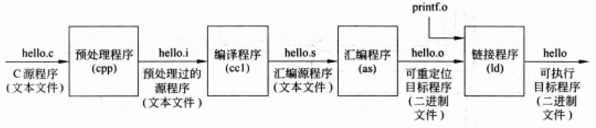

# 程序
- **编写程序**: 高级语言
- **硬件执行**: 机器语言（一种非常底层、特定的指令集）

应用程序到硬件执行要**系统软件**来介入。系统软件的主要作用是为应用程序和硬件之间提供一个桥梁，使得应用程序能够被硬件所识别和执行。

- **系统软件**: 提供常用服务的软件，包括操作系统、编译程序、加载程序和汇编程序等。

- **操作系统**: 一个关键系统软件，它为用户提供了与硬件交互的界面，并管理计算机的各种资源。同时，操作系统还提供了很多其他的功能，如任务调度、内存管理、设备驱动等，以确保计算机的稳定运行和高效使用。

- **编译程序**: 责将高级语言编写的源代码翻译成机器语言，以便硬件能够执行。

---

| ##container## |
|:--:|
||
|从高级语言(如C语言)到机器语言|

- **机器语言**: 计算机可以将二进制代码存储在内存中，并且执行这些代码。
    - **二进制位**: 也称为**位(bit)**, 基数为2 的数字中的 0 或 1，它是信息的基本组成元素。
    - **指令**: 计算机硬件所能理解并服从的命令（也是二进制位串）。

    在计算机内部，指令和数据并没有本质的区别，它们都是以二进制形式存储的。如何区分它们?[留下坑]

- **汇编语言**: 以**助记符**形式表示的机器指令。

- **高级语言**: 高级编程语言 C++、 Java 等可移植的语言，由一些单词和代数符号组成，可以由编译器转换为汇编语言。

