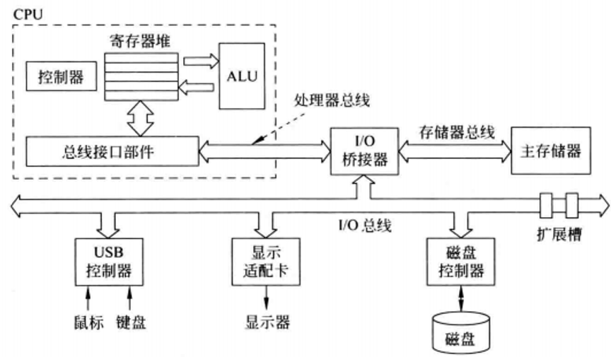
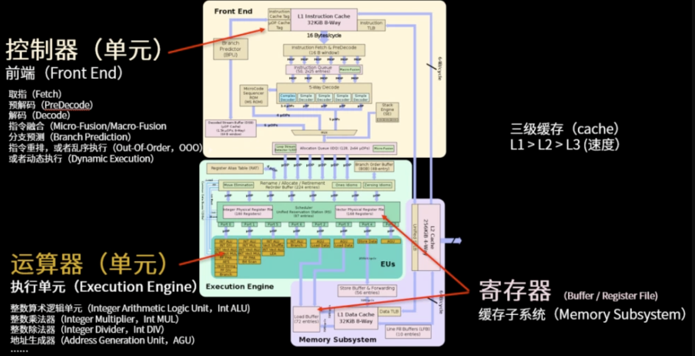

# 硬件的概念
任何一台计算机，都会完成一些通用的基础的操作: 输入数据、输出数据、处理数据、存储数据。

完成这些操作需要硬件的支持，有5大基本部件: 
- **输入设备**: 向计算机提供信息，比如键盘，比如鼠标。
- **输出设备**: 将计算结果呈现给用户，比如显示器。
- **数据通路(运算器)**: 主要包含算术逻辑部件和通用寄存器等,其功能是用来执行算术和逻辑运算等操作。
- **控制器**: 对指令进行译码,生成相应的控制信号,以控制数据通路进行正确的操作。
- **存储器**: 存储数据。包含内存(主存储器)和外存(外部存储器)。

注:
1. 控制器和数据通路统称(中央)处理器，即CPU。
2. 输入输出设备也叫外设(外部设备)，即I/O设备。外设通常由机械部分和电子部分组成，而且两部分通常是可以分开的,机械部分是外部设备本身,而电子部分则是控制外部设备的I/O控制器或I/O适配器。
3. 各个部件通过总线连接。
4. 处理器从存储器中得到指 和数据，输入部件将数据写入存储器，输出部件从内存中读出数据，控制器向数据通路 存储器、输入和输出部件发出命令信号
5. 对数据通路的解释: 数据在功能部件之间传送的路径称为数据通路，路径上的部件称为数据通路部件，如ALU、通用寄存器等。

| ##container## |
|:--:|
||
|一个典型计算机系统的硬件组成|
|计算机硬件主要包括中央处理器、存储器、I/O控制器、外部设备和各类总线等。|

- 显示器: I/O设备中的输出了，就是给我们呈现出画面的东西。
- 触摸屏: 平板电脑和智能手机则是使用了触摸屏代替键盘鼠标。
- 集成电路(芯片):
    - CPU芯片: 
        - 内存芯片: 内存是程序运行时候的存储空间，同时也用于保存程序子啊运行时所需要使用到的一些数据.内存其实就是一块DRAM芯片(动态随机访问存储器)，用来存储程序的指令和数据。
        - cache: 高速缓存，采用的是另一种技术，叫做SARM(静态随机访问存储器)。

| ##container## |
|:--:|
||
|CPU的五个核心部分|

- 外存: 早期占据主导地位的是磁盘，包括硬盘、光盘和软盘等。它们都利用磁性来记录
数据。随着技术的发展，非易失性半导体存储器——闪存(flash memory)在个人移动设备中逐渐取代了磁盘。U盘也是闪存的一种形式。

- 与其他计算机进行通信: 计算机网络。

- 处理器和存储器制造技术: 芯片制造过程。