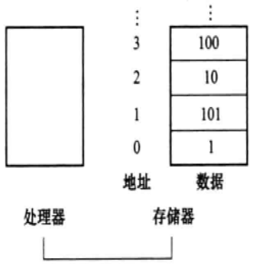

# 指令

- **机器指令**(简称**指令**): 指示计算机执行某种操作的命令，计算机语言中的基本单词。

- 一台计算机的所有指令的集合构成该机的**指令系统**，也称**指令集**。

- 指令集的两种形式: 
    - 一种是人们编程书写的形式 (汇编语言-助记符),
    - 另一种是计算机所能识别的形式 (机器语言-二进制元).

    指令集有很多种: **MIPS**; Intel x86; ARM系统: ARMv7, ARMv8; RISC-V...

    本课程以 **MIPS**架构 的指令集为例。

<div style="margin-top: 80px;">

---
</div>

- **存储程序**: 必须将事先编好的程序和原始数据送入主存后才能执行程序, 一旦程序被启动执行, 计算机能在不需操作人员干预下自动完成逐条取出指令并执行的任务。
    - 存储程序是1945年`冯·诺伊曼`提出的，“存储程序(stored-program)通用电子计算机方案”,宣告了现代计算机结构思想的诞生。

硬件设计的三条基本原则: *(无需特别记忆, 因为它基本上同(蕴含)[计算机系统结构](../../002-第一章计算机概要与技术/002-计算机系统结构/index.md)的八个伟大思想)*

1. **简单源于规整**: 这意味着设计应该尽可能地简单，以便于理解和维护。这通常通过保持设计的规整性来实现，例如通过保持指令长度的统一，可以简化处理器的设计和编程。

2. **越小越快**: 在硬件设计中，减小组件的尺寸可以提高其运行速度。这是因为当信号传输的距离变短时，传输时间也会减少，从而提高了整体性能。

3. **优秀的设计需要折中的方案**: 在实际的硬件设计中，往往需要在不同的设计要求之间做出权衡。例如，为了提高性能，可能需要增加功耗或牺牲一部分能效。因此，设计师需要找到一个能够满足所有关键要求的最佳折中方案。

以上原则不仅适用于硬件设计，也可以作为指导任何复杂系统设计的原则。


# 计算机硬件的操作

$$任何计算机必须能够执行算术运算$$

## 算术运算
以加法为例，MIPS 汇编语言的下述记法:

```MIPS
add a, b, c
```

表示将两个变量`b`和`c`相加，并将它们的和放入变量`a`中。

这种表达的方式是**固定的**，**每一条指令只用来执行一个操作**。

与加法类似的指令一般都有三个操作数: 两个进行运算的数和一个保存结果的数。

要求每条指令`有且仅有`三个操作数。体现了: **简单源于规整**。

# 计算机硬件的操作数
- **操作数**: 与高级语言程序不同，MIPS 算术运算指令的操作数是很严格的，它们必须来自<b style="color:red">寄存器</b>。

- **寄存器**: 由硬件直接构建且数量有限，是计算机硬件设计的基本元素。MIPS 体系结构中寄存器大小为 32 位，称其为**字**。

- **字**: 计算机中的基本访问单位，通常是 32 位为一组，在 MIPS 体系结构中与寄存器大小相同。MIPS按字节编址，一个字对应4个字节。

---

- **寄存器的数量是有限的。越小越快。**
    - 大量的寄存器可能会使时钟周期变长，因为电信号传输更远的距离必然花费更长的时间。

---

- 对于这32个寄存器，我们用`0~31`来表示。尽管可以简单使用序号`0~31` 表示相应的**寄存器**，
    - 但 MIPS 约定书写指令时用一个符“`$`”后面跟两个字符来代表一个寄存器
        - 如: `$s0`。

---
> 思考: 复杂数据结构中的数据元素可能远多于计算机中寄存器的个数,计算机怎样来表示和访问这样大的结构呢?
>
> 答: 只能将少量数据保存在寄存器中，但**存储器**可以存储数十亿的数据元素。
>
> 因此，数据结构是存放在**存储器**中的。(*此处的存储器实际上就是内存*)

## 数据传送指令
<span style="color:red">MIPS 的算术运算指令只对`寄存器`进行操作</span>, 因此, MIPS 必须包含在存储器和寄存器之间传送数据的指令。这些指令叫作<span style="color:#88FFFF">数据传送指令</span>。
### 取数 lw

| ##container## |
|:--:|
||

为了访问存储器中的一个字，指令必须给出存储器地址。

将数据从存储器复制到寄存器的数据传送指令通常叫**取数(load)指令**。

MIPS取数指令助记符是`lw`。也就是`load word`的缩写:

基本语法: **`lw 目标寄存器, 偏移量(基址寄存器)`**

例如:
```MIPS
lw $t0, 100($s1)
```

其中`()`的意思是, 取`$s1`寄存器的值, 然后进行偏移 100, 得到的结果就给`$t0`寄存器.

和取数相对应的就是**存数(sw)**
### 存数 sw
基本语法: **`sw 源寄存器，偏移量(目的寄存器)`**

```MIPS
sw $s1, 4($s2)
```

即 `$s1 --> ($s2) + 4` 或者说 `($s2) + 4 <-- $s1`

> 思考: 上面的 4 与 100 是常量, 那么它们是存放在哪里的呢?
>
> 答: 在编译阶段，**立即数(immediate value)**(即常量)，比如这里的4，会被编码为二进制表示形式，并与指令本身一起存储在程序的指令内存中。这确保了指令和它所操作的数据是紧密相关的，同时也节省了指令的空间。<sup>[By GPT-3.5]</sup>

寄存器的数量相对于程序可能需要存储的变量数量而言通常是非常有限的。<br>
将**最常用的变量**保存在寄存器中可以显著提高程序执行效率。

当一个变量不再频繁使用或者当前需要用到的变量太多，而寄存器资源不足时，编译器会选择将某个寄存器中的变量“溢出”到内存中存储，这个过程称为<span style="color:red">寄存器溢出</span>。

现代编译器还会采用各种优化技术，如寄存器重用、局部优化、全局优化等策略，以最大程度地利用有限的寄存器资源，提高程序性能。

## 字节编址
MIPS 按字节编址，一个地址空间存放一个字节。每个字都占据4个连续的字节位置。

> 例如, 如果一个字的地址是`0x1000`，那么这个字所包含的四个字节的地址分别是:
> - 第1个字节: `0x1000`
> - 第2个字节: `0x1001`
> - 第3个字节: `0x1002`
> - 第4个字节: `0x1003`
>
> 因此，连续两个字在内存中的地址会相差`4`，因为每个字都占据`4`个连续的字节位置。下一个字的地址将是`0x1004`。

这叫<span style="color:red">对齐限制</span>。这种对齐方式确保了CPU能够有效地从内存中读取和写入数据，且能加快数据传输。

## 大小端
有了编址，编写地址，也就要有寻址。也就是寻找地址。首先，既然编址按字来，那么寻址也是按字来。有两种类型的字节寻址的计算机: **大端和小端**。

1. **大端（Big-endian）**: 在大端编址方式中，一个多字节数据的高位字节存储在内存的低地址处，而低位字节则存储在内存的高地址处。例如，一个32位的字（假设其值为`0x12345678`）在内存中会被存储为:
 
```C++
地址: 0x0000 0x12
地址: 0x0001 0x34
地址: 0x0002 0x56
地址: 0x0003 0x78
```
MIPS 架构就是使用大端编址的。

2. **小端（Little-endian）**: 在小端编址方式中，一个多字节数据的低位字节存储在内存的低地址处，而高位字节则存储在内存的高地址处。对于同样的32位字（`0x12345678`），它在内存中的存储方式会是:

```C++
地址: 0x0000 0x78
地址: 0x0001 0x56
地址: 0x0002 0x34
地址: 0x0003 0x12
```

许多现代的PC和个人设备（如Intel和AMD的x86和x64架构）使用小端编址。

一句话总结: <span style="color:yellow">区分大小端, 即问这个字的首地址是实际数的高位还是低位, 高大, 低小.</span> (是高位则大端, 是低位则小端)

## 常数
程序中经常会在某个操作中使用到**常数**. 例如，将数组的下标加 1; ++i, 即 i += 1。

从已介绍过的指令看，**如果要使用常数必须先将其从存储器中取出**。

### 加立即数 addi

为了提高性能并减少能耗，们会有专门设计的指令来处理常数操作数: MIPS 架构的`addi`指令（加立即数）。

基本语法: **addi 目标寄存器, 源寄存器, 立即数**

```MIPS
addi $s3, $s3, 4
```

注: MIPS 架构中有一个特殊的寄存器，名为`$zero`(编号为 0)，它在硬件层面被永久设置为 0。这个寄存器的存在使得程序员在需要将某个寄存器清零或者将 0 赋值给其他寄存器时，可以直接使用`$zero`寄存器作为源操作数，从而简化指令和提高代码效率。

```MIPS
# 将寄存器 $t1 清零:
addi $t1, $zero, $zero
# 给t1赋值成15:
addi $t1, $zero, 15
```

常数操作数出现频率高，而且相对于从存储器中取常数，包含常数的算术运算指令执行速度快很多，并且能耗较低。 根据使用频率来确定要定义的常数是`加速大概率事件`的一个例子。