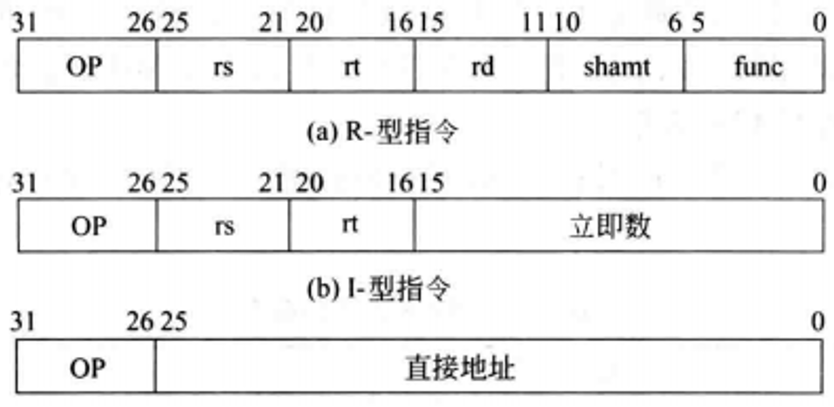

# 指令格式
## 容易混淆的几个概念

- **字(Word)**: 计算机一次能处理的一个数据，一个字由若干个字节组成

- **(机器)字长(Word Length)**: 也称为字的位数，它是指CPU内部用于整数运算的运算器的位数，或者是寄存器的位数。机器字长决定了一次能够处理的整数数据的范围和精度。

- **指令字长(Instruction Word Length)**: 一条指令中所包含的二进制位数，一条指令的长度 (**指令字长一般是存储字长的整倍数**)。指令字长的大小决定了计算机可以执行的指令种类和操作的复杂度。
- **存储字长(Storage Word Length)**: 一个存储单元的二进制位数，即存储单元的数据宽度。它决定了计算机可以处理的内存范围和单个存储单元所能存储的数据大小。

## 指令

**指令**: 由一系列的二进制位(bits)组成的，这些位可以表示不同的操作、操作数地址、跳转目标等。

在 MIPS 架构中，指令的编码是精心设计的，以便 CPU 能够解码并执行相应的操作。每个指令通常都包含**操作码(opcode，用于标识指令的类型)**、**源操作数**、**目标操作数**等部分。

指令有自己的布局格式，叫做**指令格式**。指令的格式或布局定义了指令在计算机内存中的表示方式。

对于**MIPS架构，每条指令都是32位长**，这与MIPS体系结构中数据字的位数相一致。这种固定长度的指令格式简化了指令的解码和执行过程，因为CPU不需要在读取指令时确定指令的长度。

在计算机科学中，我们通常将这种直接表示为二进制形式的指令称为**机器语言**或**机器码**。

## 由汇编指令到机器码
以加法为例: `add $t0, $s1, $s2` 的机器码是?

该指令包含了一个操作码和三个寄存器。

关于寄存器，这些寄存器在汇编语言中有特定的名称，如 $s0、$s1、$t0、$t1 等。在底层，这些寄存器的名字会被映射成数字，以便硬件能够识别和操作。

例如:
- 寄存器 $s0 ~ $s7 在 MIPS 中映射到数字 16 ~ 23。
- 寄存器 $t0 ~ $t7 映射到数字 8 ~ 15。

这种映射关系使得汇编语言编写的程序能够在底层被正确地转换成机器码，并由硬件执行。当汇编器或编译器处理源代码时，它会将这些寄存器名称转换为相应的数字，以生成正确的机器码。

这种映射关系的设计允许指令集保持简洁和一致，同时使得硬件实现更加高效。

由于MIPS指令是固定长度的32位格式，**操作码和其他字段的位置是固定的**。

| ##container## |
|:--:|
|(以R型指令为例)|
||

各字段名称及含义:
- `Op`: 指令操作码，用于标识指令的类型和功能。`6位`
- `RS`: 第一个源操作数寄存器号，用于存放第一个操作数。`5位`
- `Rt`: 第二个源操作数寄存器号，用于存放第二个操作数。`5位`
- `Rd`: 目标操作数寄存器号，用于存放指令执行的结果。`5位`
- `Shamt`: 位移量字段，用于指定移位指令的位移量。`5位`
- `Func`: 指令功能码，用于选择op操作中的具体函数。`6位`

取数指令: `lw 目标寄存器, 偏移量(基址寄存器)`

操作数有三个，两个寄存器和一个立即数。通常，加载指令使用一种称为“基址+偏移”的方式，其中基址是一个寄存器，偏移是一个立即数。

但是R型述指令中，并没有一个字段能够直接容纳一个大点的立即数。他的立即数被限制在了5位，即 $2^5 = 32$ 之内。想想我们定义的数组等这些东西，难道只能定义这么大么? 肯定不是的。因此，我们还设定了其他不同的指令格式。

MIPS指令集的完整指令格式包括三种主要类型: R型、I型和J型

| ##container## |
|:--:|
||

立即数可以是数也可以是地址(表示为地址的时候立即数以偏移量的形式出现), 但是直接地址就是一个绝对地址

## 定长指令
MIPS指令的长度都固定为32位，即**每条指令的长度相同，称为定长指令**。

这种设计简化了处理器的设计和指令解码过程，使得硬件在执行指令时无需根据指令的不同长度调整操作，提高了处理效率。尽管不同类型的指令可能在字段分配上有所不同，但每条指令的总长度始终保持一致。

对于指令的设计，我们既希望所有指令长度相同，又希望具有统一的指令格式，两者之间产生了冲突。这就引出了最后一条硬件设计原则: **优秀的设计需要适宜的折中方案**。

在设计计算机体系结构时，需要在寄存器数量和指令长度之间做出权衡:

- 一方面，更多的寄存器能够减少对内存的访问频率，提高程序执行效率，因为寄存器比主存更快且访问延迟更短。然而，每增加一个寄存器就需要在指令格式中为该寄存器编号分配额外的位数。

- 另一方面，保持指令长度不变有利于简化处理器设计和优化流水线处理，同时也有助于减小存储指令所需的存储空间。

因此，在实际应用中，现代指令集架构往往会选择一个折衷方案，比如提供16个或32个通用寄存器，以平衡性能需求与指令编码复杂度之间的关系。像RISC-V等一些现代ISA也通过灵活的扩展机制来解决这一问题，允许根据不同的应用场景和资源需求选择合适的寄存器组大小和其他特性。

## 存储程序
当今设计计算机，指令用数字的形式表示。计算机内部采用二进制形式来表示指令和数据。
数据既然可以存储在存储器中。那么是不是程序也可以，并且我们可以读写程序？

由此法引出 **存储程序(stored-program)** 的概念。

这是冯·诺依曼体系结构的核心特征之一，**它指出程序和数据在计算机内存中是统一存储和处理的，并且都可以被CPU读取和写入**。因此，编辑器程序的源代码可以存放在存储器中，经过编译器编译成机器码后也保存在同一存储器内。当计算机运行时，它可以依次取出指令执行，从而使计算机能够实现动态加载和执行不同程序的能力，极大地提升了计算机系统的灵活性和通用性。

这一革命性的设计使得计算机能够在无需硬件改动的情况下，仅通过改变存储在内存中的程序就可实现不同的计算任务，从而释放了计算机的巨大潜力，为现代信息技术的发展奠定了基础