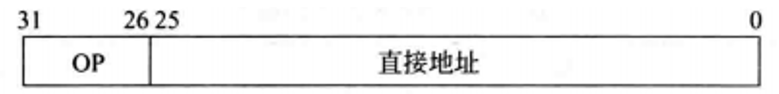
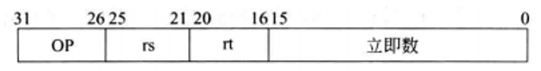
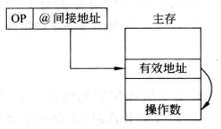
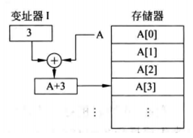
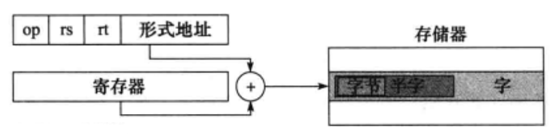

# 寻址方式
MIPS架构设计时将所有指令定为32位长(即4字节)，这简化了硬件设计，使得处理器的解码和执行阶段更加高效且统一。然而，在实际编程中，有时需要使用大于16位的常量或者访问32位地址空间中的数据，这时就需要采用特殊的编码方式来加载或存储32位的常数值以及使用完整的32位地址。

- 寻址方式: 是寻址指令或者操作数的有效地址的方式

- 指令寻址: 去寻找下一条指令的地址

具体不用太区分数据寻址还是指令寻址, 因为都是共通的, 只是取的东西不同然后起了个名字.

<div style="margin-top: 80px;">

---
</div>

## 32位立即数
在MIPS架构中，许多包含立即数字段的指令格式只预留了16位的空间来存放立即数。那如果使用32位的立即数该怎么办呢?

这时就需要采用**特殊的编码方式**来加载或存储32位的常数值以及使用完整的32位地址，需要采用两条指令来实现:

1. **lui(Load Upper Immediate)**: 将最高16位的立即数载入到目标寄存器的高16位，同时低16位清零。

2. **ori(OR Immediate)** 或 **addi(Add Immediate)**: 将剩余的低16位立即数与前一步得到的结果进行 **逻辑或(ori)** 操作，或者 加法(addi, 如果目标寄存器之前已包含有效数据且希望累加的话)，从而合成出完整的32位立即数。

例如，假设我们要将32位立即数`0x12345678`加载到寄存器`t0`中，我们需要这样操作:

```MIPS
lui $t0, 0x1234      # 将高16位0x1234载入$t0, 低16位清零
ori $t0, $t0, 0x5678 # 将低16为0x5678与$t0进行逻辑或(|)操作
```

总结: **将32位立即数加载到目标寄存器中，以便后续的运算或存储**

> 问: 32位立即数就耗费和int一样的内存
>
> 答: 在MIPS指令集中，立即数通常用于表示常数、地址偏移量等。当指令被执行时，立即数会直接被加载到指定的寄存器中，而不需要额外的内存访问。因此，虽然使用了32位的立即数，但它并不会占用和一个整数相同的内存空间，而是被编码在指令中，仅在指令执行时临时占用一些寄存器中的存储空间。

<div style="margin-top: 80px;">

---
</div>

## 寻址
### 跳转 中的寻址方式: 伪直接寻址
| ##container## |
|:--:|
||
|J型指令格式的跳转指令|

**J型指令**是一种专门用于**无条件跳转**(Jump)(例如`goto`)的指令格式。在MIPS指令集中，J型指令的具体格式如下:

- 6位操作码: 用于指示这是一个J型跳转指令。
- 26位地址字段: 用于存储相对于当前 **PC(程序计数器)** 的偏移量。

J型指令的寻址方式主要是变通的直接寻址(**伪直接寻址**):
- 跳转地址由指 26 位字段和 PC 高位相连而成

由于J型指令的总长度为32位，除去6位的操作码后，剩下的26位可以表示一个相对范围广泛的地址偏移量。这个偏移量是一个有符号的整数值，因此可以向前或向后跳转到一个相对较远的位置。这种设计简化了硬件实现，同时也足够灵活以支持大部分情况下的程序流程控制需求。在执行跳转指令时，处理器会将该偏移量与当前PC值相加，从而得到目标指令的实际地址，并更新PC值来执行跳转。

> PC 是 **程序计数器(Program Counter)** 的缩写。在计算机中，PC是一个专门的寄存器，用于存储当前正在执行的指令的地址，也就是下一条将要执行的指令所在的内存地址。
>
> 在指令的执行过程中，PC会不断地被更新，以指向下一条将要执行的指令的地址。例如，在顺序执行指令时，PC会按照顺序递增以指向下一条指令的地址。而在发生分支或跳转时，PC会根据分支或跳转指令中的条件或目标地址来更新自己的值。
>
> 在伪直接寻址中，J型指令的跳转地址由指令中的 26 位字段和当前PC的高位相连而成，用于确定跳转的目标地址。
>
> 当执行J型指令时，CPU会将指令中的26位地址字段左移两位(因为MIPS指令的地址是以字节为单位，而指令是以字为单位存储的，因此需要将地址左移两位以对齐字边界)，然后与当前PC的高位进行连接，形成一个完整的跳转地址。

<div style="margin-top: 80px;">

---
</div>

### 分支 中的寻址方式: PC相对寻址

| ##container## |
|:--:|
||
|I 型指令格式的条件分支指令|

与无条件跳转指令不同，条件分支指令在跳转到目标地址之前会先比较两个操作数的值。如果满足比较条件，则执行跳转；否则，继续顺序执行下一条指令。具体来说:

1. 两个操作数: 这些操作数通常是从寄存器中获取的值，例如 rs(源寄存器1) 和 rt (源寄存器2)，用于比较它们之间的关系。

2. 条件判断: 不同的条件分支指令对应着不同的条件判断，如`beq`检查两者是否相等，`bne`检查两者是否不相等，`blt`则检查第一个操作数是否小于第二个操作数。

3. 分支地址: 如果满足特定条件，则程序计数器PC会被更新为指令中指定的目标地址，从而实现有条件地转移到新的指令序列继续执行。

例如:

```MIPS
beq $t0, $t1, LOOP # 如果 $t0 等于 $t1, 则跳转到 LOOP 标签处
```

条件分支指令的寻址方式是: PC相对寻址

**PC相对寻址(PC-Relative Addressing)** 是一种指令寻址方式，它使用当前 **程序计数器(Program Counter, PC)** 的值加上一个相对于当前指令地址的偏移量来确定下一条要执行的指令或数据的位置。

具体来说，在PC相对寻址中，指令包含了一个表示偏移量的字段。当CPU执行到含有PC相对寻址的跳转指令时，它会将当前PC值与该偏移量相加，得到的目标地址就是跳转的目的地。这种方式使得程序员可以编写出与加载地址无关的代码，增强了程序的可移植性，并且简化了硬件设计，因为不需要复杂的计算逻辑去生成绝对地址。

即: `目标地址 = PC + PC相对寻址跳转指令的偏移量`

- 优点: 简洁性和可预测性。
- 缺点: 限制了分支目标的范围，因为偏移量的大小是有限的。不利于代码的重定位和共享。(需要保证跳转的目标地址在偏移量范围内(这个是编译器做))

> 寻址附近的指令也是加速大概率事件的另外一个例子

<div style="margin-top: 80px;">

---
</div>

## 寻址模式的总结
### 1. 立即寻址
**立即寻址**: 操作数直接包含在指令中，作为指令的一部分。这种情况下，操作数的值是一个立即数，即固定值。

> 立即寻址模式通常用于加载立即数到寄存器中，或者用于算术和逻辑运算。

MIPS 指令集并没有像某些其他指令集那样直接支持`MOV`指令，但可以通过其他方式实现寄存器到寄存器的数据移动。

```MIPS
addi $t0, $zero, 16 # 立即寻找示例
```

优点:
- 速度快, 不用访问内存

缺点:
- 位数有限, 立即数的大小是有限的(但是可以使用32位立即数的思路来实现)

<div style="margin-top: 80px;">

---
</div>

### 2. 直接寻址
**直接寻址**: 指令中包含一个实际的内存地址，这个地址直接指向内存中的一个位置，从中读取或写入操作数，CPU直接使用这个地址从内存中读取操作数。在 MIPS 指令集中，直接寻址模式通常用于访问内存中的特定地址。在直接寻址中，指令中直接包含了要访问的内存地址。

表示为: $$EA = A \ (寄存器编号)$$

```MIPS
# lw 指令将从内存地址 0x1000 处加载一个字（32位数据）到寄存器 $t0 中
lw $t0, 0x1000 # 直接寻址示例
```

直接寻址在 MIPS 指令集中是一种简单而直接的方式来访问内存中的特定位置。然而，由于其限制和可能的性能影响 (例如，直接寻址模式限制了指令中的地址值的范围，并且可能会导致代码的可移植性下降，因为程序的内存布局可能会因为不同的环境而改变。)，它通常只在需要直接访问特定内存地址时使用 (而在一般情况下，会更倾向于使用间接寻址模式或基于寄存器的寻址方式。)。所以其实并不常用。

优点:
- 直接(简单)

缺点:
- 限制了寻址范围

而在 MIPS 中一般也不使用直接寻址, 而是使用伪直接寻址

<div style="margin-top: 80px;">

---
</div>

### 3. 寄存器寻址
**寄存器寻址**: 操作数存储在某个寄存器中。**指令中通常包含一个寄存器标识符，处理器从该寄存器中读取或写入操作数**。

寄存器寻址通常比内存寻址更快，因为寄存器位于 CPU 内部，访问它们不需要像访问内存那样经过复杂的内存子系统。

```MIPS
add $t1, $t2, $t3 # 寄存器寻址示例
```

寄存器寻址模式具有以下优点：

1. 快速: 寄存器位于CPU内部，访问它们**不需要**像**访问内存**那样经过复杂的内存子系统，因此寄存器寻址通常比内存寻址更快。

2. 灵活: MIPS指令集中的大多数指令都可以接受来自寄存器或立即数的操作数，这使得寄存器寻址非常灵活，不仅限于算术和逻辑运算，还可以用于数据移动、比较、跳转等操作。

3. 简单: 不需要进行地址计算

缺点:
- 个数有限; 造价昂贵

<div style="margin-top: 80px;">

---
</div>

### 4. 主存间接寻址
**间接寻址**: 指令中给出的地址码是存放操作数有效地址的主存单元地址。图所示的是单级间接寻址过程,还可有多重间接寻址。

| ##container## |
|:--:|


类似于C的`指针的指针`

表示为: $$EA = (A)$$ `(x)`表示取地址`x`里面的数据

优点:
- 扩大了寻址范围

缺点:
- 速度变慢了, 这里会有 2 次(或者多次)内存io

<div style="margin-top: 80px;">

---
</div>

### 5. 寄存器间接寻址
**寄存器间接寻址**: 通过寄存器间接寻址实现。这意味着指令的操作数地址不是直接给出的，而是存储在一个寄存器中，处理器会访问该寄存器内容所指向的内存地址来获取实际操作数

```MIPS
lw $t0, 0($s1) # Load Word 指令, 从内存中加载32位数据到$t0寄存器
# 这里的内存地址是 $s1 的内容 (假设$s1包含了一个有效的内存地址)
```

~~寄存器间接寻址模式的优点在于，它提供了一种灵活的方式来访问内存中的数据。通过使用寄存器间接寻址，程序可以动态地改变寄存器中存储的地址，而不需要修改指令本身。这种方式特别适用于处理一些动态生成的数据结构或者数据访问模式。<sup>[By GPT-3.5]</sup>~~

优点:
- 扩大了寻址范围

缺点:
- 速度变慢了, 这里会有 2 次(或多次)寄存器访问, 而且寄存器的数量太少了

<div style="margin-top: 80px;">

---
</div>

### 6. 变址寻址
**变址寻址**: **以某个寄存器的内容为基础地址，加上指令中给出的偏移量来计算操作数的实际地址**。这种`寻址模式在处理数组或循环时特别有用`，因为它允许程序在不需要修改基址寄存器的情况下，通过改变偏移量来访问内存中的不同位置。

| ##container## |
|:--:|


$$操作数的有效地址 EA = (I) + A, \ \ \ 其中 (I) 表示\ 变址寄存器I\ 中的内容$$

变址寄存器是面向用户的，在程序执行过程中，<span style="color:red">变址寄存器的内容可由用户改变(作为偏移(量)，形式地址A不变(作为基地址)</span>。

```MIPS
addi $t2, $s2, 8 # 先通过addi指令将8加到寄存器$s2上得到新的地址
lw $t1, 0($t2)   # 然后使用这个新地址（$s2 + 8）加载内存中的数据到$t1寄存器
```

<div style="margin-top: 80px;">

---
</div>

### 7. 基址寻址
**基址寻址(Base Addressing)**: 类似于变址寻址，但这里的基准是固定的**基址寄存器，加上一个偏移量得到操作数地址**。有效地址是通过将基址寄存器的内容与指令中给出的偏移量相加而得到的。

基址寄存器的内容在程序执行过程中通常保持不变，而偏移量可以变化。

| ##container## |
|:--:|


可以表示为: $$EA = (BR) + A$$

- 应用主要用于多道程序分配存储空间(由操作系统分配(面向系统的))

```MIPS
lw $t0, 12($t1) # 基址寻址示例
```

在 MIPS 指令集中，并没有专门的基址寻址指令，而是通过组合寄存器寻址和内存访问指令来实现基址寻址的效果。偏移量可以是一个立即数（如上例中的 12），也可以是一个寄存器的值，这提供了很大的灵活性。

还有一些其他的寻址方式，比如讲上述的一些寻址方式结合，成为新的寻址方式。比如寄存器间接寻址等等的。

小结 --- 以下统称`偏移寻址`:
1. PC相对寻址
2. 变址寻址
3. 基址寻址