# 定点数乘法
## 回顾十进制乘法

```C++
  13 (被乘数)
x 14 (乘数)
-------------
  52 (部分积)
 13  (部分积)
-------------
 182 (积)
```

<div style="margin-top: 80px;">

---
</div>

## 二进制乘法
二进制乘法其实跟十进制的乘法运算的运算原理基本一样。

只涉及0和1两种数字，每一次相乘的结果只有四种可能:
```
0×0=0
0×1=0
1×0=0
1×1=1
```
也是从右向左依次计算。

| ##container## |
|:--:|
|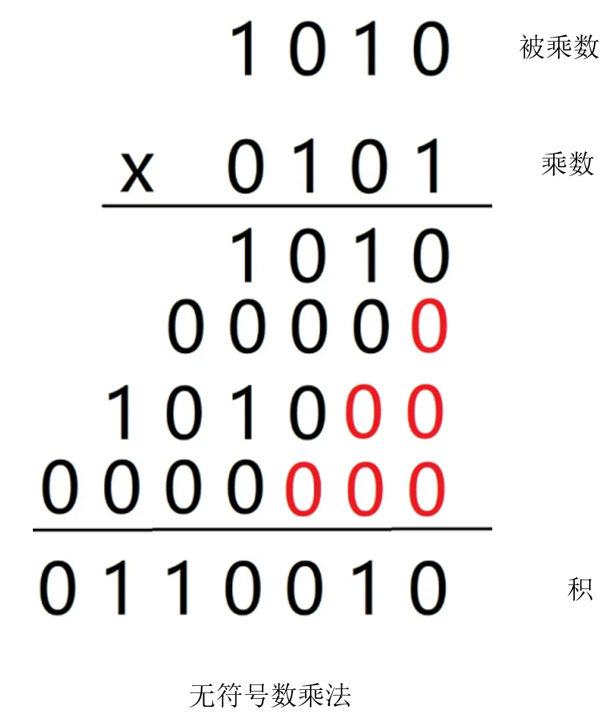|

由于二进制的性质, 只有`乘数`的位数是`1`, 才会把`部分积`将`被乘数`抄下.

```C++
#include <cstdio>

// return a * b | 前提: b > 0 | 时间复杂度 O(logb)
int multiplicationByBit(int a, int b) {
    int res = 0, moveBit = 0;
    while (b) {
        if (b & 1) {
            res += a << moveBit; // 此处 + 请使用二进制加法替换(严谨)
        }
        ++moveBit;
        b >>= 1;
    }
    return res;
} 

int main() {
    printf("%d\n", multiplicationByBit(3, 4)); // 12
    return 0;
} 
```

显然这个还需要点优化.

### 原码乘法: 符号位与数值位分开求
1. 乘积的符号位由两个乘数的符号位进行`异或`运算得到

2. 乘积的数值位为两个乘数的绝对值之积, 即执行无符号数乘法

在硬件实现中，乘法运算用加法和移位运算来实现，硬件逻辑结构图如下:

| ##container## |
|:--:|
|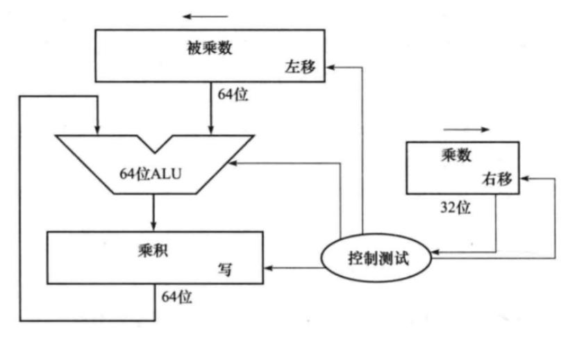|

假设我们实现 $4位 \times 4位 = 8位$ 的乘法器，那么:

1. 需要一个8位的移位寄存器保存被乘数，他有一个左移的信号输入。

2. 需要一个8位的乘积寄存器，用来保存运算的结果。

3. 移位寄存器和乘积寄存器需要进行加法运算，所以需要一个8位的加法器，相加之后存放到乘积寄存器中。

4. 需要一个4位的乘数寄存器，同时将乘数寄存器的最底位连接右移信号，右移信号除了控制移位寄存器移位，还要控制是否进行加法运算和是否允许乘积寄存器保存当前的结果。最后还需要控制自身是否右移位。

#### 演示: 原码乘法
- 计算 1000 x 1001 第一周期

| ##container## |
|:--:|
|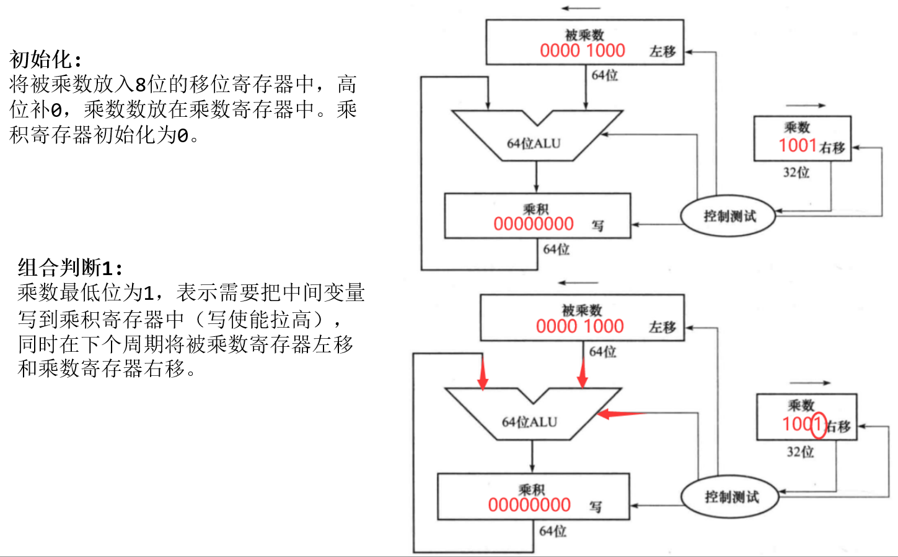|

> [!TIP]
> **使能(Enable)** 是一个动词，意思是通过某种方式启用或激活某个功能或操作。在计算机术语中，使能可以是一个信号、一个开关或者一个标志位，用于控制特定的功能、设备或操作的执行。当使能信号被触发或设置为有效状态时，相关的功能或操作将被启用并开始执行；而当使能信号处于无效状态时，相关的功能或操作将被禁用或停止执行。

- 计算 1000 x 1001 第二周期

| ##container## |
|:--:|
|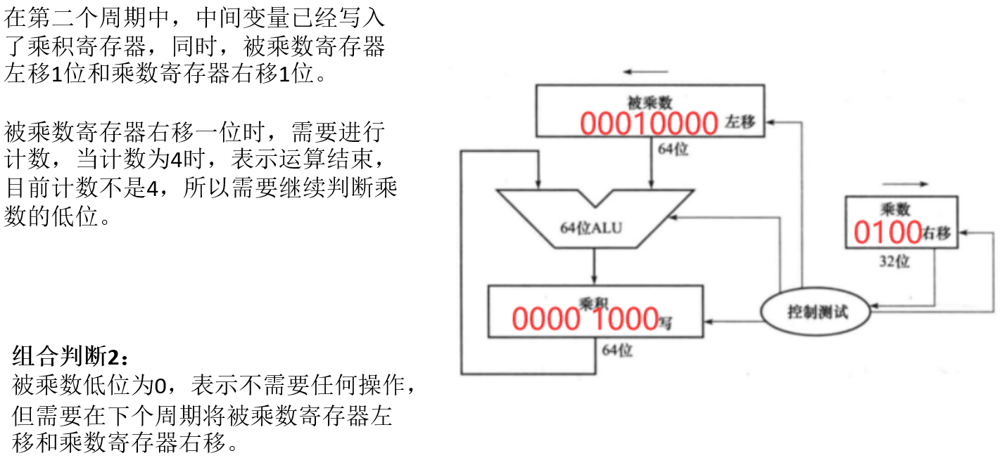|

- 计算 1000 x 1001 第三周期

| ##container## |
|:--:|
|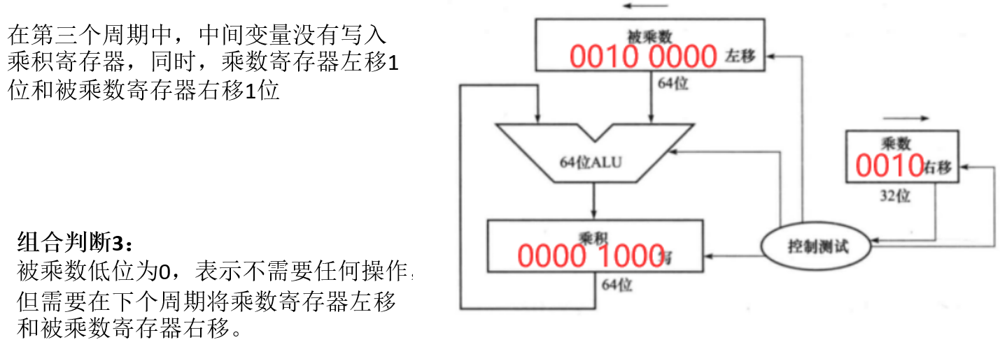|

- 计算 1000 x 1001 第四周期

| ##container## |
|:--:|
|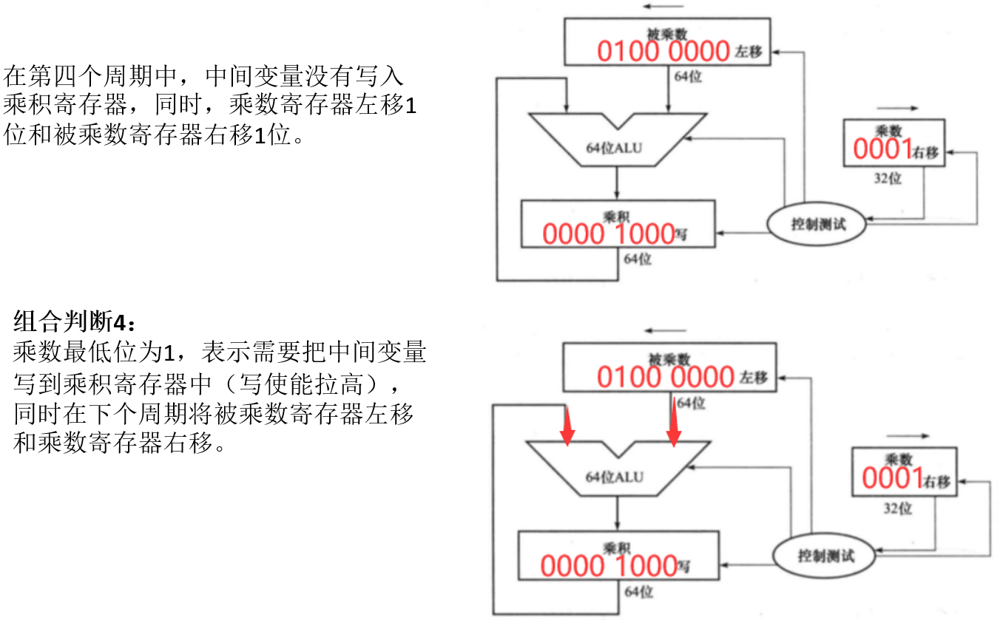|

- 计算 1000 x 1001 第五周期

| ##container## |
|:--:|
|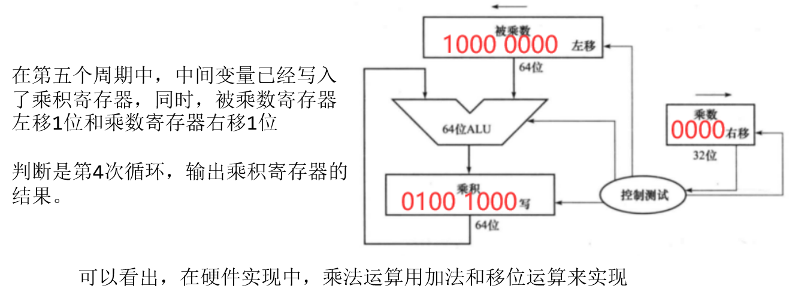|

#### 流程图

原码乘法: 符号位与数值位分开求

| ##container## |
|:--:|
|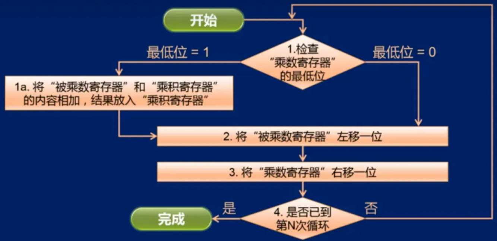|
|乘法逻辑|

#### 优化

| ##container## |
|:--:|
|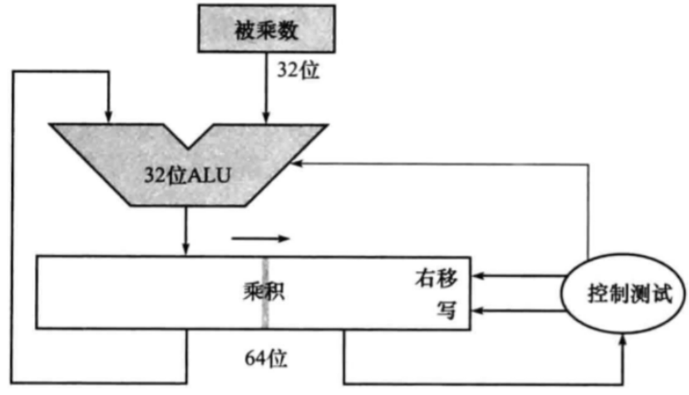|

代码:
```C++
#include <cstdio>

using ll = long long;
// a, b is int (此处稍微写了点, 几乎是完整的原码计算二进制乘法了)
ll multiplicationByBitPRIME(ll a, ll b) {
    bool isNegative = (a >> 63) ^ (b >> 63);
    b = b < 0 ? -b : b;
    a = a < 0 ? -a : a;
    int moveBit = 31;
    while (moveBit) {
        if (b & 1) {
            b += a << 31;
        }
        --moveBit;
        b >>= 1;
    }
    return isNegative ? -b : b;
}

// 下面这个是GPT-4o写的, 过程确实是这样跟符合实际.
ll multiplicationByBitPRIME(int a, int b) {
    bool isNegative = (a < 0) ^ (b < 0);  // 判断结果的正负号
    unsigned int ua = a < 0 ? -a : a;     // 绝对值
    unsigned int ub = b < 0 ? -b : b;     // 绝对值

    ll result = 0;
    ll multiplier = ua;

    while (ub > 0) {
        if (ub & 1) {  // 检查当前最低位是否为1
            result += multiplier;
        }
        multiplier <<= 1;  // 被乘数左移一位
        ub >>= 1;          // 乘数右移一位
    }

    return isNegative ? -result : result;
}

int main() {
    printf("%lld\n", multiplicationByBitPRIME(-11, -11)); // 121
    return 0;
}
```
乘法器实现流程: (以 4 * 4 = 8 位 为例子)
1. **初始化**：
    - 被乘数（4位）放入8位移位寄存器（低4位放被乘数，高4位放0）。
    - 乘数（4位）放入4位乘数寄存器。

2. **每个时钟周期操作**：
    1. 检查乘数寄存器的最低位。
    2. 如果最低位是1，则将被乘数寄存器的值加到乘积寄存器。
    3. 乘数寄存器右移一位。
    4. 被乘数寄存器左移一位。

3. **重复4次后**：
    - 乘积寄存器中即为最终结果。

### 补码乘法
在有符号数的补码乘法运算中，我们需要将被乘数和乘数先转化为补码进行乘法运算。运算过程中的所有数据均以补码形式呈现。

符号位也参加运算，在运算过程中要考虑符号位乘上被乘数之后的部分积是正数还是负数。

那么在此基础上，在手动计算时可以将有符号数的乘法运算分为以下四种情况: (以四位补码 $a\times b$, 结果为8位为例)

| ##container## |
|:--:|
|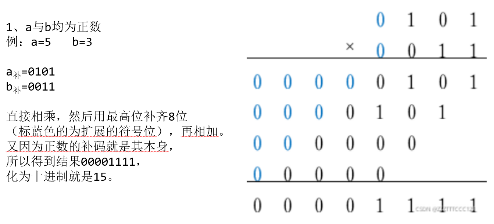|
|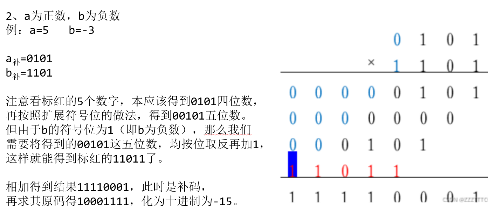|
|注: 此处的最高位溢出了, 但是因为最高位和次高位进位相同, 因此没有问题, 不是溢出!(见: [定点数加减法](../001-定点数加减法/index.md))|
|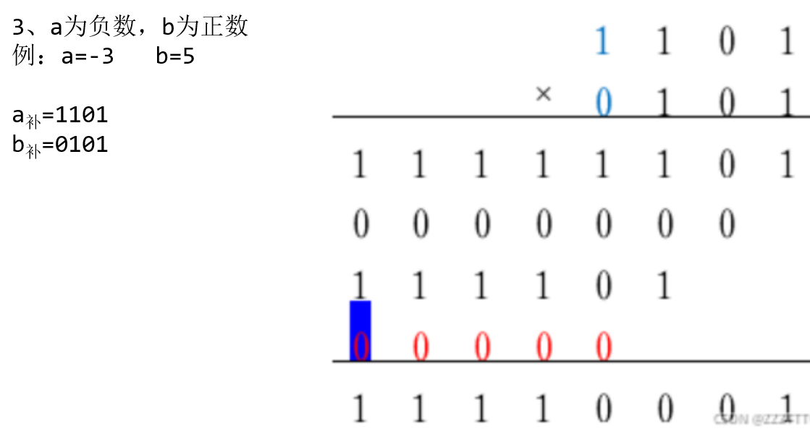|
|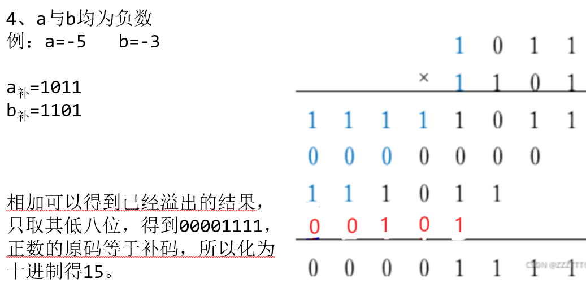|

以上是手动计算补码乘法的过程。

朴素代码:
```C++
#include <cstdio>

// 补码二进制乘法
int multiplicationByComplementBit(int a, int b) {
    int res = 0, moveBit = 0;
    while (moveBit < 32) {
        if (b & 1) {
            res += a << moveBit;
        }
        ++moveBit;
        b >>= 1;
    }
    return res;
}

int main() {
    printf("%d\n", multiplicationByComplementBit(-11, 11)); // -121
    return 0;
}
```

> [!TIP]
> <span style="color:yellow">计算机一般采用`Booth`算法（补码一位乘法）进行补码乘法运算，采用相加和相减操作计算补码数据的乘积。`Booth`算法及其电路逻辑后续进行讲解。</span>
