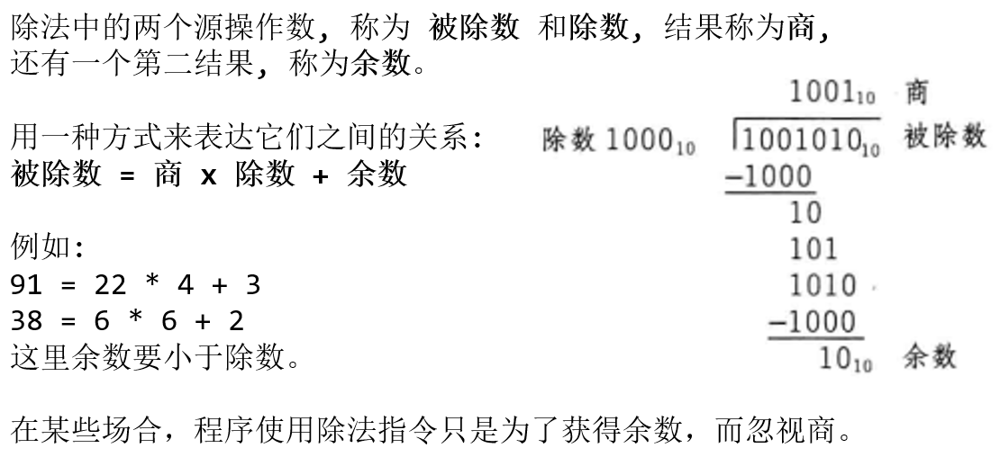
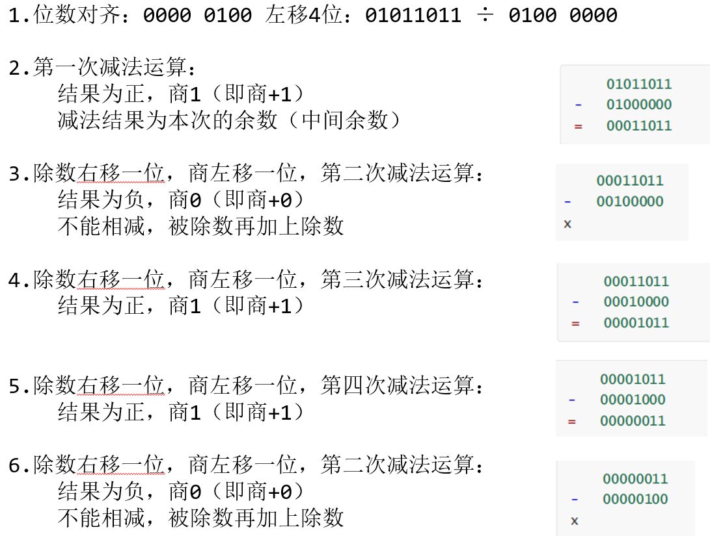
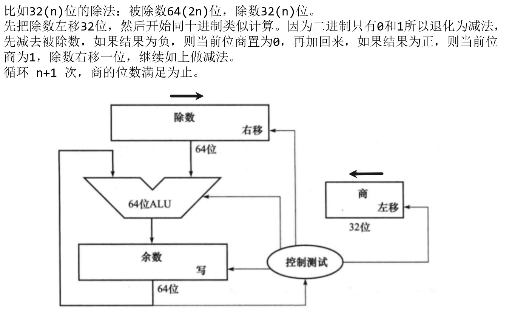
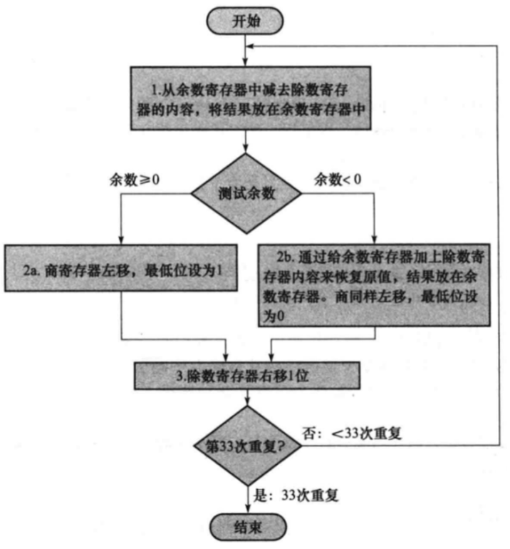
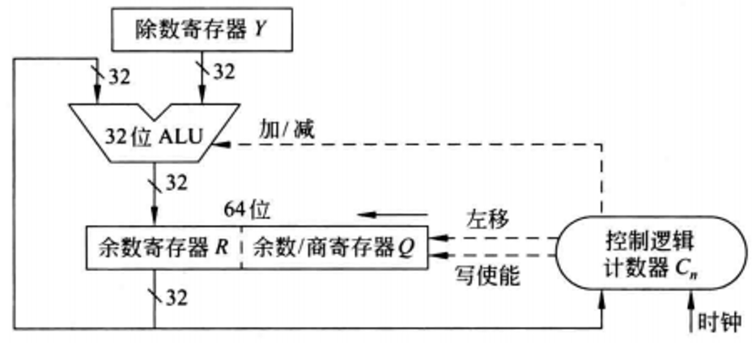
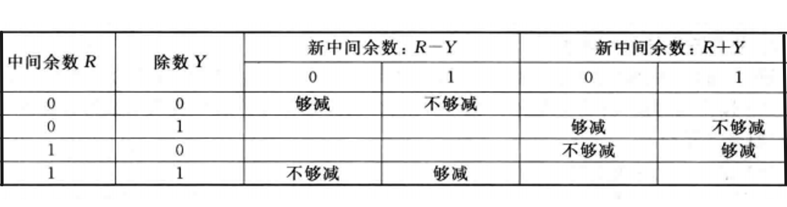

# 定点数除法
## 回顾: 十进制除法



我们知道, 商的位数最大是 $被除数的位数 - 除数的位数 + 1$

## 二进制除法
二进制除法的运算，本质上相当于看最多几个除数累加能逼近于被除数。(加上余数后就等于被除数)。

可以通过`减法`和`移位运算`来实现。

1. 无符号数除法
2. 有符号数原码除法
3. 有符号数补码除法

### 无符号数除法
除法只有两种可能性: $1÷1=1$ 与 $0÷1=0$ (`0`不能做除数)

1. 先对除数末尾补零到与被除数位数对齐（通过左移实现），左移一位代表乘2，右移一位代表除2;

2. 判断大小，确定该位商1还是商0。

不像人那样聪明，计算机不可能提前知道除数是否小于被除数。

先让被除数减去除数，若结果为>=0，说明`被除数>=除数`，直接商1。若结果为负数，说明被`除数<除数`，说明不能减，则**先恢复被除数的原值**，再商0。

以8位二进制`94`除以`4`为例: $0101 \ 1011 ÷ 0000 \ 0100$

> [!TIP]
> 注: 除数左移4位, 的4是因为 8位被除数 - 4位除数 + 1 = 5, 而左移0位 对于 1, 所以移动4.



可能的过程代码:

```C++
#include <cstdio>

// 有 O(1) 得到二进制长度的方法
int getBitLen(int x) {
    int res = 0;
    while (x) {
        ++res;
        x >>= 1;
    }
    return res;
}

// a / b && a >= b
int divisionByBit(int a, int b) {
    int len = getBitLen(a) - getBitLen(b);
    b <<= len;
    int quotient = 0; // 商 
    while (len--) {
        if (a - b >= 0) {
            quotient |= 1;
            a -= b;
        }
        quotient <<= 1;
        b >>= 1;
    }
    
    // 第 len + 1 次, 并且不需要移位了 
    if (a - b >= 0) {
        quotient |= 1;
        a -= b;
    }
    printf("mod: %d\n", a); // 余数 
    return quotient;
} 


int main() {
    printf("%d\n", divisionByBit(21, 4)); // 4
    return 0;
}
```

#### 电路图
| ##container## |
|:--:|
||

#### 流程图
| ##container## |
|:--:|
||

#### 电路图-优化
当然，除法器也可以做进一步的优化。

- 加速方法就是通过将源操作数和商移位与减法同时进行。

| ##container## |
|:--:|
||

<div style="margin-top: 80px;">

---
</div>

### 有符号数原码除法
商的符号位与数值位分开来求

1. 符号位: 被除数和除数的符号位`异或`运算得到

2. 数值位: 被除数和除数的数值位执行`无符号除法`

<div style="margin-top: 80px;">

---
</div>

### 有符号数补码除法
符号位参与运算，除数和被除数，余数和商均用补码表示。符号拓展。

其他过程与 无符号除法一致。

区别在于判断是否可以减时，不能直接相减看结果的符号位，要按分情况来看




<div style="margin-top: 80px;">

---
</div>

### 留坑: 不恢复的补码除法
我们之前讲的都是减后判断符号位再决定, 并且商0还需要恢复.

但是实际上现在我们都是用`不恢复`的做法, 但是可能比较复杂, 因此留坑.