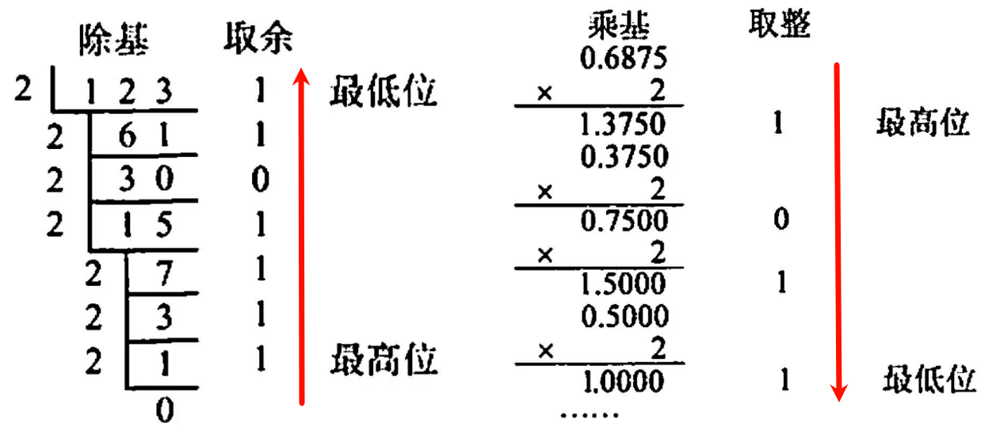
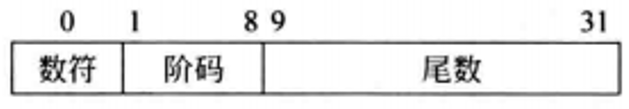
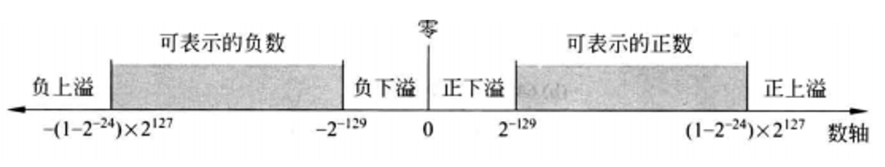

# 浮点数
## 实数的进制转换
$$123.456 = 1 \times 10^2 + 2 \times 10^1 + 3 \times 10^0 + 4 \times 10^{-1} + 5 \times 10^{-2} + 6 \times 10^{-3} $$

即 $$\sum w \times 10^x$$

具体的在[进制转换](../../../001-数据结构与算法/011-【算法】数学/007-进制转换/index.md)也有提及.

<div style="margin-top: 80px;">

---
</div>

## 二进制进制转换
按权展开相加法: 各位数码与权值相乘再相加。小数的权值为 $2^{-x}$。

$$(11011.101)_2=1*2^4+1*2^3+0*2^2+1*2^1+1*2^0+1*2^{-1}+0*2^{-2}+1*2^{-3}=27.625$$

十进制转二进制:
- 整数部分: 除基取余法, 商为 0 时结束
- 小数部分: 乘基取整法, 积的“小数部分”为 0 时结束

十进制`123.6875`转换为二进制数`1111011.1011`

| ##container## |
|:--:|
||

并不是每个十进制小数都能准确的用二进制表示。因为在转换过程中, 可能乘积的小数部分总得不到0, 即转换得到需要的位数后还有余数, 这种情况下得到的是近似值。

例如: 0.3 = 0.0100110011001100...
```C++
                 整数
0.3 × 2 = 0.6     0

0.6 × 2 = 1.2     1
0.2 × 2 = 0.4     0
0.4 × 2 = 0.8     0
0.8 × 2 = 1.6     1

0.6 × 2 = 1.2     1
0.2 × 2 = 0.4     0
0.4 × 2 = 0.8     0
0.8 × 2 = 1.6     1
........
```
计算机中, 整数可以连续表示, 小数是离散的, 并不是每个十进制小数都能准确的用二进制表示。

<div style="margin-top: 80px;">

---
</div>

## 科学计数法
对于小数, 我们数学上定义了一些表示方法, 比如科学计数法。

**科学计数法**: 一种将任意一个较大或较小的数值简化表示的方法。它由两部分构成：尾数或和指数。例如, 一个数 $x$ 可以用如下形式表示:

$$x = a \times 10^n$$

其中:
- $a$ 称为“尾数”或“有效数字”, 可以是正数也可以是负数, $1 ≤ |a| < 10$ ;
- $n$ 是整数, 代表指数, 用于指示小数点相对于 $a$ 的位置移动了多少位。


注: 一个采用科学记数法表示的数, 若没有前导零且小数点左边只有一位整数, 则可称为规格化(`normalized`)数。

例如, $1.0 \times 10^{-9}$ 就是规格化的科学记数, 但 $0.1 \times 10^{-8}$ 和 $10.0 \times 10^{-10}$ 就不是。

<div style="margin-top: 80px;">

---
</div>

### 浮点数的表示
科学记数法的概念也可以扩展到其他数制, 包括二进制。在二进制系统中, 科学计数法通常被称为浮点表示法, 并且是计算机科学中用于存储和计算实数的标准方法。这种表示方式同样由两部分构成:

1. 尾数: 
    - 在二进制科学计数法中, 基数通常是小数形式的二进制数, 并且在标准化的情况
下, 它总是从`1.xxxxxx`开始, 这里的每个`x`是 0 或 1 。

2. 指数:
    - 指数是一个以某个基数（通常为2）为底的整数, 表示基数的小数点相对于固定点的位置偏移了多少位。例如, 在`IEEE 754`标准中, 二进制浮点数的指数是以`2`为底的。

所以, 在二进制中, 科学记数法可以表示为 $$a \times 2^n$$ 其中 $1 ≤ |a| < 2$ 且 $n$ 是整数。

在二进制科学记数法中, $a$ 通常是一个规格化数, 这意味着小数点左边只有一位非零数字(1)。这与十进制科学记数法中的规格化数概念类似。

例子:
- 二进制`11010`的科学计数法: $1.101 \times 2^4$

- 二进制`-11010`的科学计数法: $-1.101 \times 2^4$

<div style="margin-top: 80px;">

---
</div>

## 计算机中浮点数的表示格式

在计算机中任意一个二进制实数表示:

$$X = (-1)^S \times M \times R^E$$

其中:
- `S`: **sign**, 取值 0 或 1, 确定符号。
- `R`: **radix**, 基数/进制。二进制下为 2。
- `M`: **mantissa**, 尾数。是一个二进制定点小数(`0.1b...bbb`), 其位数反映了 $X$ 的有效位数, 决定了精度。
- `E`: **exponent**, 阶/指数。是一个二进制定点整数, 其位数决定 $X$ 的表示范围, 其值确定小数点的位置。

存储时存储 $S,M,E$ 三个字段即可, 其中阶码 $E$ 常用`补码`或`移码`表示, 尾数 $M$ 常用`原码`或`补码`表示。

<div style="margin-top: 80px;">

---
</div>

## 移码
定点数的编码表示: 原码 反码 补码 移码

**移码**: 常用来表示浮点数的阶码。

移码就是在真值 $X$ 上加上一个常数(偏置值), **通常**这个常数取 $2^n$, 相当于 $X$ 在数轴上向正方向偏移了若干单位, 这就是“移码”一词的由来。

- $n$ 位移码, 偏置值为 $2^{n-1}$

例如: 8位移码: 第一位还是符号位, 偏置值 $2^7$

- `+101012`的移码: (+10101) + 1000 0000 = 1001 0101
- `-101012`的移码: (-10101) + 1000 0000 = 0110 1011

$n+1$ 位移码的特点:

1. 零的表示唯一: 
    - $[+0]_移 = 2^n + 0 = 100...00$
    - $[-0]_移 = 2^n - 0 = 100...00$ (n个0)

2. 一个真值的移码和补码仅差一个符号位, 所以 $[x]_补$ 的符号位取反得到 $[x]_移$ 所以
    - 在原、反、补码中`0正1负`;
    - 移码中`0负1正`。

3. <p> </p>
   
   - 移码全 0 时, 对应真值的最小值 $-2^n$ ;
   - 移码全 1 时, 对应真值的最大值 $2^n-1$。

4. 移码保持了数据原有的大小顺序, **移码大真值就大, 移码小真值就小**。

<div style="margin-top: 80px;">

---
</div>

## 一个32位短浮点数的例子
| ##container## |
|:--:|
||

其中:
- 第`0`位为数符 $S$ ;
- 第`1 ~ 8`位为 8 位移码表示的阶码 $E$ (偏置常数为`128`);
- 第`9 ~ 31`位为用 23 个数位表示的 24 位二进制原码小数, 为尾数。
    - 规格化尾数形式为`士0.1xx...xxx`, 其中第一位`1`不显式地表示出来, 这样可用 23 个数位表示 24 位尾数。
- 基数 $R$ 为2。

<div style="margin-top: 80px;">

---
</div>

## 尾数的规格化

浮点数尾数的位数决定浮点数的有效数位, 有效数位越多, 数据的精度越高。

为了在浮点数运算过程中尽可能多地保留有效数字的位数, 使有效数字尽量占满尾数数位, 必须在运算过程中对浮点数进行“规格化”操作。

从理论上来讲,规格化数的标志是**真值的尾数部分中最高位具有非零数字**。

也就是说, 若浮点数的基数为`2`, 则尾数规格化的浮点数(正数)形式应为`0.1xx...xx`(这里`x`是`0`或`1`)。

规格化操作有两种: “左规”和“右规”。

当有效数位进到小数点前面时, 需要进行**右规**。右规时, 尾数每右移一位, 阶码加1, 直到尾数变成规格化形式为止, 右规时指数会增加, 因此有可能溢出;

当出现形如`0.00...001xx...xx`的运算结果时, 需要进行**左规**, 左规时, 尾数每左移一位, 阶码减1, 直到尾数变成规格化形式为止。

例如: 
- 十进制的 $65798$ 用上述二进制浮点数格式表示:

$$(65798)_{10}=(1 \ 0000 \ 0001 \ 0000 \ 0110)_2=(0.1 \ 0000 \ 0001 \ 0000 \ 0110)_2 \times 2^{17}$$

则: 

$$X = (-1)^S \times M \times R^E \\ 65798 = (-1)^0 \times (0000 \ 0001 \ 0000 \ 0110)_2 \times 2^{(1001 \ 0001)_{2_{[移]}}}$$

- 数符 $S=0$,
- 阶码 $E=[17]_移=(17+2^7)_{10}=(145)_{10}=(1001 \ 0001)_2$        
- 尾数 $M=(0000 \ 0001 \ 0000 \ 0110)_2$, 其中最高位 $1$ 隐藏

<div style="margin-top: 80px;">

---
</div>

## 表示范围
阶码用移码表示，其范围: $[00000000, 11111111]=[-128，127]$

上述格式的规格化浮点数的表示范围如下。
- 正数最大值: $0.11...1×2^{11...1}=(1-2^{-24})×2^{127}$
- 正数最小值: $0.10...0×2^{00...0}=(\cfrac{1}{2})×2^{-128}=2^{-129}$

(尾数)原码表示范围对称，负数范围不用算了

| ##container## |
|:--:|
||

有四个区域不能表示, 为**溢出区**。

对于不同的浮点数格式, 可以自己去算其表示范围。

---

直到20世纪80年代初,浮点数表示格式还没有统一标准,不同厂商计算机内部浮点数表示格式不同,在不同结构的计算机之间进行数据传送或程序移植时,必须进行数据格式的转换,而且,数据格式转换还会带来运算结果的不一致。

因而,20世纪70年代后期，IEEE成立委员会着手制定浮点数标准,1985年完成了浮点数标准IEEE 754的制定。目前几乎所有计算机都采用IEEE 754标准表示浮点数。在这个标准中,提供了两种基本浮点格式: 32位单精度和64位双精度格式。
