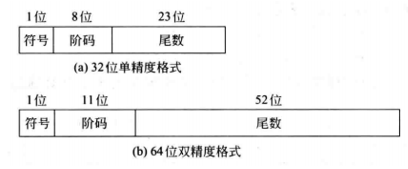
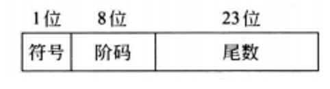

# IEEE 754标准
> 20世纪70年代后期, IEEE成立委员会着手制定浮点数标准, 1985年完成了浮点数标准`IEEE 754`的制定。目前几乎所有计算机都采用`IEEE 754`标准表示浮点数。

`IEEE 754标准`规定了四种表示浮点数值的方式: 单精确度（32位）、双精确度（64位）、延伸单精确度（43比特以上，很少使用）与延伸双精确度(`long double`)（79比特以上，通常以80位实现）。其中，只有32位模式有强制要求，其他都是选择性的。

---

| ##container## |
|:--:|
||

`IEEE 754标准`规定常用的浮点数格式有32位单精度浮点数(短浮点数、float 型)和64位双精度浮点数(长浮点数、double 型)，其基数隐含为2。

---

## 详细分析 32位 单精度格式

| ##container## |
|:--:|
||

单精度格式中包含 $1$ 位符号 $s$, $8$ 位阶码 $e$ 和 $23$ 位尾数 $f$ ;

**尾数**用`原码`表示。**阶码**用`移码`表示。

尾数:
- 对于规格化的二进制浮点数, 尾数的最高位总是 1, 为了能使尾数多表示一位有效位, 将这个 1 隐藏, 称为**隐藏位**, 因此 23 位尾数实际表示了 24 位有效数字。

    `IEEE 754`规定隐藏位 1 的位置在小数点之前, 即`1.xxx...xxx`的尾数形式。

    例如, $(12)_{10} = (1100)_2$, 将它规格化后结果为`1.1x23`, 其中整数部分的`1`将不存储在`23`位尾数内。

阶码:
- 阶码用移码表示, 偏置值为 $2^{n-1}-1$。因此, 单精度和双精度浮点数的偏置常数分别为`127`和`1023`。一些特殊的位序列(如`阶码`为**全0**或**全1**)有其特别的解释。

    以`IEEE 754标准`中的单精度浮点数为例，其阶码部分有8位（包括一位符号位），能够表示的范围通常是`-127`到`128`，但是实际可用的范围是从`-126`到`127`, 因为**全0**和**全1**的指数值有特殊的含义。

---

## 对`IEEE 754`中规定的数进行了以下分类:
(以 32位单精度格式进行分析)
### 1. 阶码非全0 且 非全1 - 规格化非0数
阶码范围: $[0000 \ 0001, 1111 \ 1110]$, 即 $[1, 254]$, 阶码真值对应范围 $[-126, 127]$, 是一个正常的`规格化非0数`。

`真值`计算公式: 其中 $e$ 的值是移码的值: $$(-1)^s \times 1.f \times 2^{e-127}$$

规格化非O数的正数部分的范围: $\left[2^{-126},\left(2-2^{-23}\right) \times 2^{127}\right]$
1. 最小值: $s=0, \quad e=0000 \ 0001, \quad f=0$

    $\mathrm{X}=(-1)^{0} \times (1.0) \times 2^{1-127}=2^{-126}$

2. 最大值: $s=0, \quad e=1111 \ 1110, \quad f=0.1111 \ldots 111(23 个全 1)=1-2^{-23}$ 

    $X=(-1)^1 \times (1.1111 \ldots 1111) \times 2^{254-127}=\left(2-2^{-23}\right) \times 2^{127}$

规格化非O数的负数部分的范围:
- 与正数部分的范围相反对应: $\left[-\left(2-2^{-23}\right) \times 2^{127},-2^{-126}\right]$

### 2. 阶码全0 且 尾数全0

$$s=0或1, \quad f=0.000...000, \quad e=0000 \ 0000$$

表示的值不再根据前面的公式计算，而是规定固定为 $0$。根据 $s$ 的值分为 $+0$ 或 $-0$。

- 一般情况下正负零是等效的。

### 3. 阶码全0 且 尾数不全为0 - 非规格化数
$$s=0或1, \quad f=0.xxx...xxx(至少有一个x为1), \quad e=0000 \ 0000$$

此时隐藏位不再为 $1$, 隐藏位固定为 $0$。阶码 $e=0000 \ 0000$, 转化出的真值为 $-127$, 但是此时我们**不进行**转化, 而是将阶码固定看成是 $-126$。

此时数值为: $$(-1)^{s} \times 0 . f \times 2^{-126}$$

非规格化数可用于处理`阶码下溢`, 使得出现比最小规格化数还小的数时程序也能继续。

规格化正数最小是 $2^{-126}$, 若 $x$ 为 $2^{-127}$, 则可以用非规格化数表示: $$X=(-1)^{0} \times 0.100 \ldots 000 \times 2^{-126}$$

即 $0 \ \underbrace{0000 \ 0000}_{阶码} \ \underbrace{100 \ 0000 \ 0000 \ 0000 \ 0000 \ 0000}_{尾数}$

### 4. 阶码全1 且 尾数全0

此时固定表示`正负无穷大` $+∞ \ 或 -∞$

引人无穷大数使得在计算过程出现异常的情况下程序能继续进行下去, 并且可为程序提供错误检测功能。 $+∞$ 在数值上大于所有有限数, $-∞$ 则小于所有有限数, 无穷大数既可作为操作数, 也可能是运算的结果。

### 5.阶码全1 且 尾数不全为0 - 非数(NaN) Not a Number

表示一个**没有定义**的数, 称为非数。

一些没有数学解释的计算(如 $\cfrac{0}{0}, \quad 0 \times ∞$ 等)会产生一个 $NaN$。

> 如果你是考研的, 注意除了会考 32/64位的, 可能题目还会自己定义一些规则, 你就需要通过定义来求解了, 不能死记硬背.

---

## 设计浮点数表示系统的注意事项

在设计浮点数表示系统时，比如`IEEE 754标准`，设计者必须确定`尾数(fraction)`和`指数(exponent)`部分各自分配多少位。

由于存储空间有限，通常是一个固定的总位数（例如单精度32位、双精度64位），所以尾数和指数位数是一种权衡:

- 增加尾数位数意味着可以更精确地表示小数值，提高数字的精度。更多的尾数位意味着能更好地近似实数，特别是在接近零的小数值区域。

- 增加指数位数则会增大可表示数的范围，使得能够表示非常大或非常小的数。指数位数增多允许更大的动态范围，包括正负值以及更大绝对值的数。

设计者需要根据实际应用的需求来平衡这两者。例如，在科学计算中，可能需要同时处理很大和很小的数值，并且对精度要求很高，这时可能会倾向于使用较多位数的指数和尾数；而在一些对精度要求相对较低，但对速度或者内存占用有较高要求的应用中，则可能选择牺牲一部分精度以换取较小的存储需求和更快的运算速度。

当然了，浮点数也会出现溢出的情况（位数毕竟不是无限大的）。
