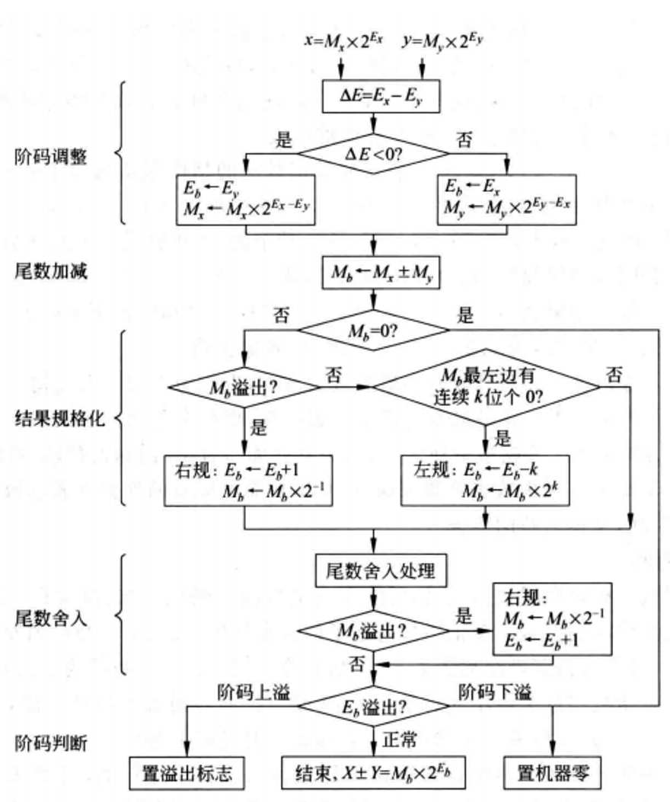

# 浮点数加减法
## 十进制的例子
$0.123×10^5+0.456×10²\\=0.123×10^5+0.000456×10^5\\=(0.123+0.000456)×10^5\\=0.123456×10^5$

不能将`0.123`和`0.456`直接相加，因为阶数不一样，要把阶数调整为相同(往大的调整)之后再相加。

- 结果的尾数为两个尾数之和，**阶数为调整之后的阶数**。

so，浮点数加减法运算其实很简单，总共就5步:
- 对阶、尾数运算、规格化、舍入、溢出判断。 

$x+(-)y=z$ 为例，基于`IEEE754标准`

## 1. 对阶
> [!TIP]
> 使 $x$ 和 $y$ 的阶码相等, 以使尾数可以相加减。

原则: 小阶向大阶看齐, 阶小的那个数的尾数右移, `右移的位数`等于`两个阶(指数)的差`的`绝对值`。

大多数机器采用`IEEE754 标准`来表示浮点数, 阶数为移码表示因此, 对阶时需要进行移码减法运算, 并且尾数右移时按原码小数方式右移, 符号位不参加移位, 数值位要将隐含的一位1右移到小数部分, 空出位补0。为了保证运算的精度, 尾数右移时, 低位移出的位不要丢掉,应保留并参加尾数部分的运算。

tips: 自己手算时直接用真值算即可

> [!TIP]
> 注: `移码 - 移码 != 移码`, 而是 == 补码

证明: 记阶码为 $E$ 在`IEEE754 标准`中其`偏置值`为 $2^{n - 1} - 1$ (n 为阶码位数), 现在有两个数的阶码的真值为 $E_x, E_y$

回顾: 
- 补码的定义式: $X = (x + 2^n) \mod 2^n$

$E_{x_移} - E_{y_移}\\=E_{x_移} + (-E_{y_移})_补\\=E_{x_移} + ((-E_{y_移}) + 2^n (\mod 2^n)\\=(E_{x} + 2^{n - 1} - 1) + (-(E_{y} + 2^{n - 1} - 1)) + 2^n (\mod 2^n)\\=(E_x - E_y) + 2^n (\mod 2^n)\\=(E_x - E_y)_补$

> [!TIP]
> 注: 对于 两个移码 **相加**, 必需保证偏置值为 $2^x$ 才满足: `移码 + 移码 != 补码`

## 2. 尾数加减

对阶后两个浮点数的指数相等，**可以进行对阶后的尾数相加减**。

因为`IEEE754`采用定点原码小数表示尾数, 所以, 尾数加减实际上是定点`原码小数`的加减运算(与定点加减法一样)。

因为`IEEE754`浮点数尾数中有一个`隐藏位`, 所以,在进行尾数加减时, 必须把`隐藏位`还原到`尾数部分`。运算过程中, **在尾数右移时保留的附加位也要参加运算**。

因此, 在用定点原码小数进行尾数加减运算时, 在操作数的高位部分和低位部分都需要进行相应的调整。

进行加减运算后的尾数不一定是规格化的, 因此, 浮点数的加、减运算需要进一步进行规格化处理。

## 3. 尾数规格化
> [!TIP]
> 左规、右规, 保证最高有效位为`1`

- 右规 `-->`: 尾数右移一位, 阶码加1。
    - 尾数右移时, 最高位1被移到小数点前一位作为隐藏位, 最后一位移出时, 要考虑舍入。阶码加1时, 直接在末位加1。

- 左规 `<--`: 数值位逐次左移, 阶码逐次减1, 直到将第一位1(隐藏位)移到小数点左边。

## 4.尾数的舍入处理
> [!TIP]
> 在对阶和尾数右规时, 可能会对尾数进行右移, 为保证运算精度, 一般将低位移出的位保留下来, 参加中间过程的运算, 最后再将运算结果进行舍入, 还原表示成`IEEE 754`格式。

1. 保留多少附加位才能保证运算的精度?

    `IEEE754标准`规定, 所有浮点数运算的中间结果右边都必须至少额外保留两位附加位。

    - 这两位附加位中, 紧跟在浮点数尾数右边那一位为**保护位**或**警戒位(guard)**, 用以保护尾数右移的位;

    - 紧跟保护位右边的是**舍入位(round)**, 左规时可以根据其值进行舍入。
  
    - 在`IEEE 754标准`中, 为了更进一步提高计算精度, 在保护位和舍入位后面还引入了额外的一个数位, 称为**粘位(sticky)**, 只要舍入位的右边有任何非0数字, 粘位就被置1; 否则, 粘位被置0。

3. `IEEE754标准`的舍入方法:
    - $0$ 舍 $1$ 入。
    - 朝 $+∞$ 方向舍入。总是取右边最近可表示数, 也称为正向舍入或朝上舍入。
     - 朝 $-∞$ 方向舍入。总是取左边最近可表示数, 也称为负向舍入或朝下舍入。
    - 朝 $0$ 方向舍入。直接截取所需位数,丢弃后面所有位，也称为截取、截断或恒舍法。这种舍入处理最简单。对正数或负数来说，都是取更靠近原点的那个可表示数,是趋向原点的舍入,因此,又称为趋向零舍入。

## 5.溢出判断

在进行尾数规格化和尾数舍入时, 可能会对结果的阶码执行加、减运算。因此, 必须考虑结果的指数溢出问题:

- 若一个**正指数**超过了最大允许值(`127`或`1023`), 则发生`指数上溢`, 机器产生异常, 也有的机器把结果置为 $+∞$ (数符为0时) 或 $-∞$ (数符为1时) 后, 继续执行下去。

- 若一个**负指数**超过了最小允许值(`-149`或`-1074`), 则发生`指数下溢`, 此时, 一般把结果置为 $+0$ (数符为0时)或 $-0$ (数符为1时), 也有的机器引起异常。

溢出判断实际上是在上述尾数规格化和尾数舍入过程中进行的, 只要涉及阶码求和/差, 就可以在阶码运算部件中直接用溢出判断电路来实现。涉及阶码求和/差的情况有以下情况:

1. 右规和尾数舍入。一个数值很大的尾数舍入时, 可能因为末尾加1而发生尾数溢出, 此时, 可以通过右规来调整尾数和阶。

    右规时阶加 1, 导致阶增大, 因此需要判断是否发生了指数上溢。只有当调整前的阶码为`1111110`, 加 1 后, 才会变成`1111111`而发生**上溢**;

    如果右规前阶码已经是`1111111`, 则右规后变为`0000000`, 因而会造成判断出错。

    所以,

    - 右规前应先判断阶码是否为全1, 若是, 则不需右规, 直接置结果为**指数上溢**; 否则, 阶码加 1, 然后判断阶码是否为全 1 来确定是否**指数上溢**。

3. 左规。左规时数值位逐次左移, 阶码逐次减1, 所以左规使阶码减小, 故需判断是否发生**指数下溢**。

    其判断规则与指数上溢类似,

    - 首先判断阶码是否为全 0, 若是, 则直接置结果为**指数下溢**; 否则, 阶码减 1, 然后判断阶码是否为全 0 来确定是否指数下溢。

从浮点数加、减运算过程可以看出, 浮点数的溢出并不以尾数溢出来判断, 尾数溢出可以通过右规操作得到纠正。运算结果是否溢出主要看结果的指数是否发生了上溢, 因此是由指数上溢来判断的。

## 流程图总结

| ##container## |
|:--:|
||

## 练习
1. 用`IEEE 754`单精度浮点数加减运算计算 $0.5+(-0.4375)$。

2. [**408考研真题**的说] 设浮点数格式: 阶码尾数均用补码表示, 补码含两位符号位。阶码占5位尾数占7位, 没有隐藏位。

- $X=2^7 \times \cfrac{29}{32}$

- $Y= 2^5 \times \cfrac{5}{8}$

问 $X + Y$ 是否溢出?