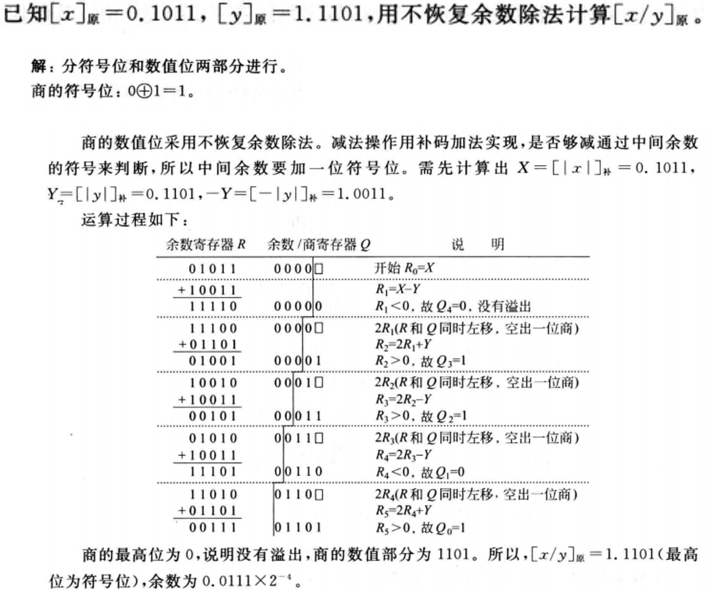

# 补码乘除法
## 1. 补码乘法: 布斯(Booth)乘法
### 1.1 补码算真值公式
#### 1.1.1 正数的补码
对于一个正数 $ Y $: 
- **补码表示**: 补码与原码相同, 即
$$
\left[Y_{\text{补}}\right] = Y_{(n-1)} Y_{(n-2)} \ldots Y_{1} Y_{0}
$$
  其中 $ Y_{(n-1)} $ 是符号位, 必定是 $ 0 $。

- **真值计算**: 计算公式为
$$
\text{Y的真值} = -Y_{(n-1)} \cdot 2^{n-1} + Y_{(n-2)} \cdot 2^{n-2} + \ldots + Y_{1} \cdot 2^{1} + Y_{0} \cdot 2^{0}
$$
  因为正数的符号位 $ Y_{(n-1)} $ 是 $ 0 $。

#### 1.1.2 负数的补码
对于一个负数 $ Y $: 
- **原码表示**: 原码中, 符号位为 $ 1 $, 数值位表示负数的绝对值, 即
$$
\left[Y_{\text{原}}\right] = Y_{(n-1)} Y_{(n-2)} \ldots Y_{1} Y_{0}
$$
  其中 $ Y_{(n-1)} $ 是符号位, 必定是 $ 1 $。

- **补码计算**: 负数的补码是原码的数值位按位取反再加 $ 1 $: 
$$
\left[Y_{\text{补}}\right] = Y_{(n-1)} Y_{(n-2)} \ldots Y_{1} Y_{0}
$$
  其中 $ Y_{(n-1)} $ 是符号位, 必定是 $ 1 $。

  - **数值位取反和加 $ 1 $**: 
    $$
    \text{原码数值位按位取反} = \text{全1} - \text{原码数值位}
    $$
    $$
    \text{补码} = (\text{全1} - \text{原码数值位}) + 1
    $$

    例如, 对于 $ 101 $: 
    $$
    101 \text{ 的取反为 } 010
    $$
    $$
    010 + 1 = 011
    $$

  - **补码真值**: 计算公式为
    $$
    \text{Y的真值} = -Y_{(n-1)} \cdot 2^{n-1} + Y_{(n-2)} \cdot 2^{n-2} + \ldots + Y_{1} \cdot 2^{1} + Y_{0} \cdot 2^{0}
    $$

    其中 $ Y_{(n-1)} $ 是 $ 1 $, 所以
    $$
    \text{Y的真值} = -2^{n-1} + Y_{(n-2)} \cdot 2^{n-2} + \ldots + Y_{1} \cdot 2^{1} + Y_{0} \cdot 2^{0}
    $$

#### 1.1.3 总结
补码的真值计算公式为: 

$$
\text{Y的真值} = -Y_{(n-1)} \cdot 2^{n-1} + Y_{(n-2)} \cdot 2^{n-2} + \ldots + Y_{1} \cdot 2^{1} + Y_{0} \cdot 2^{0}
$$

### 1.2 补码乘法的数学推导

因为补码用来表示带符号整数, 机器字长都是字节的倍数, 所以, 我们关注偶数位的补码定点整数的乘法运算, 即假定 $[X]_补$ 和 $[Y]_补$ 是两个偶数位补码定点整数, $[X \times Y]_补$ 的布斯乘法递推公式推导如下:

#### 1.2.1 补码定点整数的真值计算

设有补码表示的整数: 
- $[x]_{补} = X_{n-1} X_{n-2} \cdots X_{1} X_{0}$
- $[y]_{补} = Y_{n-1} Y_{n-2} \cdots Y_{1} Y_{0}$

根据补码的定义, 真值 $ y $ 的计算公式为: 

$$
\begin{aligned}
y &= -Y_{n-1} \cdot 2^{(n-1)} + \sum_{i=0}^{n-2} Y_{i} \cdot 2^{i} \\
&= -Y_{n-1} \cdot 2^{(n-1)} + Y_{n-2} \cdot 2^{(n-2)} + \cdots + Y_{1} \cdot 2^{1} + Y_{0} \cdot 2^{0} \\
&= -Y_{n-1} \cdot 2^{(n-1)} + (Y_{n-2} - Y_{n-1}) \cdot 2^{(n-2)} + \cdots + (Y_{1} - Y_{0}) \cdot 2^{1} + (-Y_{0}) \cdot 2^{0} \\
&= \sum_{i=0}^{n-1} \left(Y_{i-1} - Y_{i}\right) \cdot 2^{i}
\end{aligned}
$$

其中, 当 $ i = 0 $ 时,  $ Y_{-1} $ 作为辅助位, 引入: 

$$
Y_{-1} = 0
$$

因此, 补码乘法的计算公式可以写作: 

$$
[x \times y]_{补} = \left[x \times \sum_{i=0}^{n-1} \left(Y_{i-1} - Y_{i}\right) \cdot 2^{i} \right]_{补} (1)
$$

#### 1.2.2 乘法计算步骤

将右边乘上 $2^{-n}$: 

$$
\left[x \times \sum_{i=0}^{n-1} \left(Y_{i-1} - Y_{i}\right) 2^{-(n-i)} \right]_{补} (2)
$$

展开, 令 $P_{i}$ 为上次部分积, $P_{i+1}$ 为本次部分积。令 $\left[P_{0}\right]_{\text{补}} = 0$, 则有: 

$$
\begin{array}{l}
\left[P_{1}\right]_{补} = \left[2^{-1} \left(P_{0} + \left(Y_{-1} - Y_{0}\right) \times x \right) \right]_{补} \\
\vdots \\
\left[P_{n-1}\right]_{补} = \left[2^{-1} \left(P_{n-2} + \left(Y_{n-3} - Y_{n-2}\right) \times x \right) \right]_{补} \\ \\
\left[P_{n}\right]_{补} = \left[2^{-1} \left(P_{n-1} + \left(Y_{n-2} - Y_{n-1}\right) \times x \right) \right]_{补} (3)
\end{array}
$$

#### 1.2.3 递推公式

得到递推公式: 

$$
\left[P_{i+1}\right]_{补} = \left[2^{-1} \left(P_{i} + \left(Y_{i-1} - Y_{i}\right) \times x \right) \right]_{补} \quad (i = 0, 1, 2, \cdots, n-1)
$$

#### 1.2.4 计算部分积

由(2)式和(3)式得到: 

$$
[x \times y]_{补} = 2^{n} \left[P_{n}\right]_{补}
$$

乘以 $2^{n}$ 相当于数据左移, 小数点右移, 因此, 只需要将最终部分积 $\left[P_{n}\right]$ 补的小数点约定到最右边即可。

递推式为: 

$$
\left[P_{i+1}\right]_{补} = \left[2^{-1} \left(P_{i} + \left(Y_{i-1} - Y_{i}\right) \times x \right)\right]_{补} \quad (i = 0, 1, 2, \cdots, n-1)
$$

#### 1.2.5 条件判断

在求部分积的递推式中, $Y_{i-1}$ 和 $Y_{i}$ 只能是 0 或 1, 根据乘数中连续两位 $i_{1} Y_{i} Y_{i-1}$ 的判断就可以求部分积 $\left[P_{i+1}\right]$: 

- 若 $Y_{i} Y_{i-1} = 01$, 则: 
  $$
  \left[P_{i+1}\right]_{补} = \left[2^{-1} \left(P_{i} + x \right)\right]_{补}
  $$

- 若 $Y_{i} Y_{i-1} = 10$, 则: 
  $$
  \left[P_{i+1}\right]_{补} = \left[2^{-1} \left(P_{i} - x \right)\right]_{补}
  $$

- 若 $Y_{i} Y_{i-1} = 00$ 或 $11$, 则: 
  $$
  \left[P_{i+1}\right]_{补} = \left[2^{-1} \left(P_{i} + 0 \right)\right]_{补}
  $$

> [!TIP]
> 上式中的 $\left[2^{-1} \left(P_{i} \pm x\right)\right]_{补}$ 可通过执行 $\left[P_{i}\right]_{补} + [\pm x]_{补}$ 后右移一位实现。此时, 采用的是补码右移方式, 即带符号整数的算术右移。

### 1.3 总结

根据上述分析, 归纳出补码乘法运算规则如下:
1. 乘数最低位增加一位辅助位 $Y_{-1}=0$。

2. 根据 $Y_iY_{i-1}$ 的值, 决定是 $+[x]_补$, $-[x]_补$ 还是 $+0$

3. 每次加减后, 算术右移一位, 得到部分积

4. 重复第2和第3步`n`次, 结果得 $[x \times y]_补$。

注意: 如果是纯小数, 为了结果的符号位正确, 保证精度等, 要多加一次。

| ##container## |
|:--:|
||

例子:

| ##container## |
|:--:|
||

## 2. 不恢复余数除法: 原码
复习: 原码恢复余数除法 ([定点数除法](../003-定点数除法/index.md))

| ##container## |
|:--:|
||
||

当第 $i$ 次中间余数为负时, 可以跳过恢复余数这一步, 直接求第 $i+1$ 次中间余数。这种算法称为不恢复余数法。从上述推导可以发现, 不恢复余数法的算法要点就是6个字:

$$“正、1、减; 负、0、加”$$

其含义就是:
- 若中间余数为正数, 则上商为1, 余数和商左移, 下次做减法; 若中间余数为负数, 则上商为0, 余数和商左移, 下次做加法。

这样运算中每次循环内的步骤都是规整的, 差别仅在做加法还是减法, 所以, 这种方法也称为“加减交替法”。采用这种方法有一一点要注意, 即如果在最后一步上商为0, 则必须恢复余数, 把试商时减掉的除数加回去。

### 2.1 核心步骤

设被除数和除数分别为: 
- 被除数 $[X]_{x} = x_{s} x_{1} x_{2} \cdots x_{n}$
- 除数 $[Y]_{1 /} = y_{s} y_{1} y_{2} \cdots y_{n}$

1. **商的符号**: 
   $$
   Q_{\mathrm{s}} = x_{\mathrm{s}} \oplus y_{\mathrm{s}}
   $$

2. **商的数值**: 
   $$
   |Q| = \frac{|X|}{|Y|}
   $$

1. **初始步骤**: 
   先用被除数减去除数, 计算: 
   $$
   |X| - |Y| = |X| + (-|Y|) = |X| + [-|Y|]_补
   $$
   当余数为正时, 商上 1, 余数和商左移一位, 再减去除数。当余数为负时, 商上 0, 余数和商左移一位, 再加上除数。

2. **第 $n+1$ 步**: 
   当第 $n+1$ 步余数为负时, 需加上 $|Y|$ 得到第 $n+1$ 步正确的余数(余数与被除数同号)。

### 2.2 示例

| ##container## |
|:--:|
||

## 3. 不恢复余数除法: 补码
### 3.1 核心方法
| ##container## |
|:--:|
||

> [!TIP]
> 注意: 我们采用校正法: 为了提高商的精度, 多求了一位商, 然后用校正的办法对商进行处理。如果是“恒置1” 法,不需要多求一位。

### 3.2 示例

| ##container## |
|:--:|
||