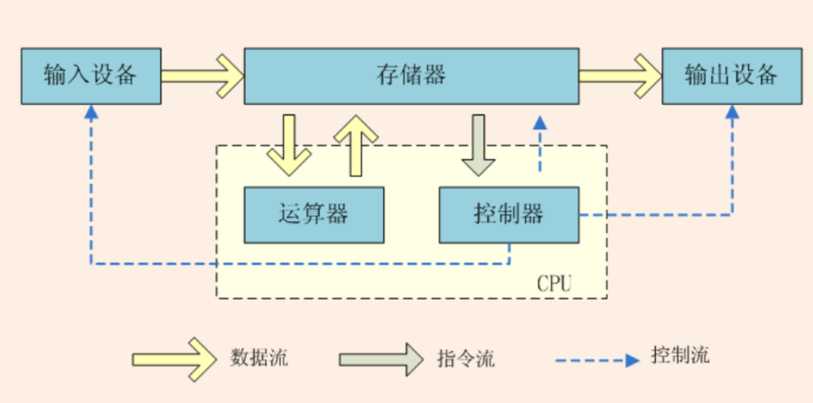
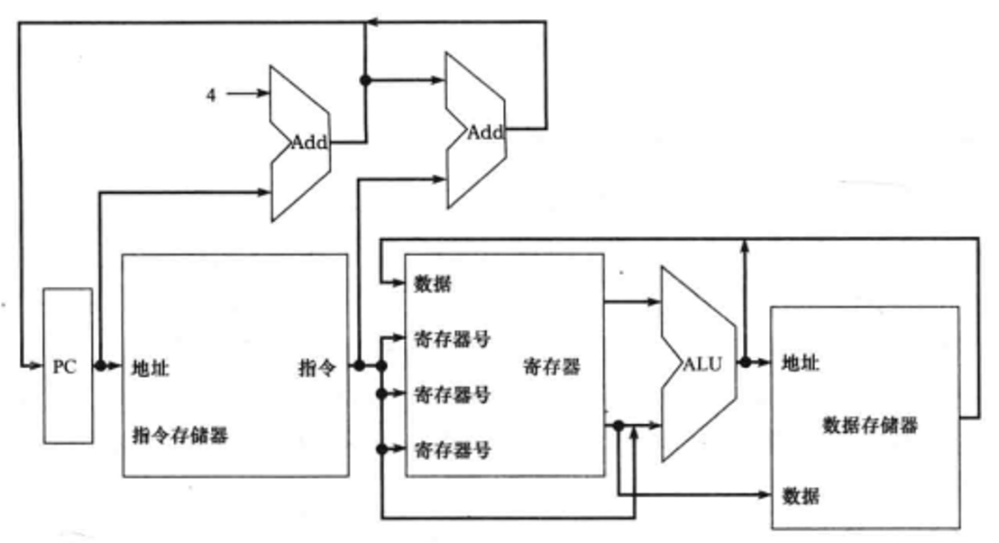
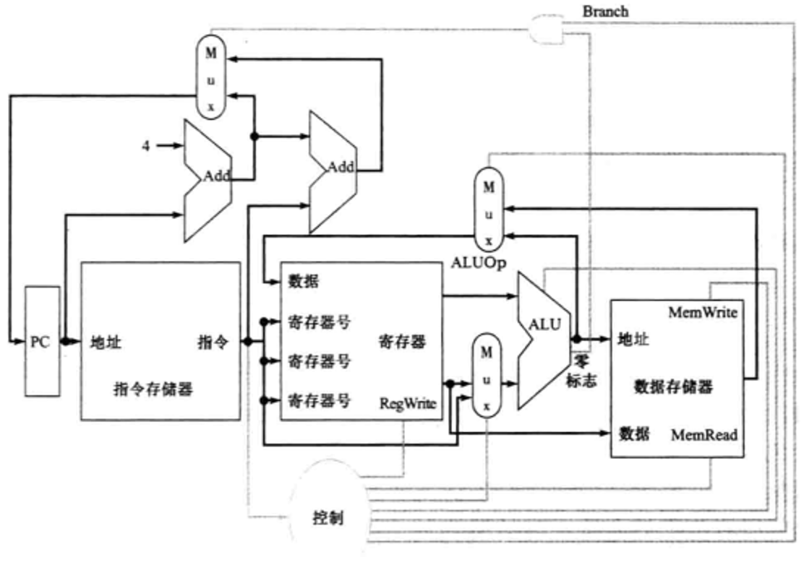

# MIPS核心子集及实现方式

冯·诺依曼架构的特点: 
1. 存储程序
2. 二进制逻辑
3. 五大基本部件

注:  运算器也叫数据通路

4. 指令和数据共享同一总线
5. 指令顺序执行

| ##container## |
|:--:|
||

个人计算机中, `控制器和运算器通常集成在一起形成中央处理器(CPU)`, 它是计算机的核心部件。也是我们本章的主题。还是从`MIPS CPU`来看计算机系统。

## 数据通路

数据通路是计算机系统中负责执行指令并处理数据的部分。它通常是由一系列硬件组件和逻辑电路组成, 负责执行算术逻辑运算、数据传输以及存储等操作。简单来说, 数据通路是指令执行的“高速公路”, 负责数据在计算机内部各个部件之间的传输和处理。主要组成部分包括: 

1. **寄存器**: 用于存储临时数据和指令的硬件存储单元。寄存器通常与CPU紧密关联, 用于
暂存指令、操作数以及运算结果。

2. **运算单元**: 执行算术逻辑运算的部件, 包括加法器、减法器、乘法器、除法器等。运算单元负责对数据进行各种数学运算和逻辑操作。

3. **数据选择器/多路复用器**: 用于选择不同的数据源或目的地, 并将数据传输到指定的位置。它可以根据控制信号选择不同的输入, 将选定的数据发送到指定的输出端口。

4. **数据存储器**: 包括随机存储器(RAM)和只读存储器(ROM), 用于存储程序指令、数据以及中间结果。存储器在数据通路中扮演重要角色, 负责存储和提取数据。

5. **控制逻辑**: 负责根据指令序列产生控制信号, 控制数据通路中各个部件的操作和数据流动。控制逻辑根据指令的操作码和地址等信息, 生成适当的控制信号来调度数据通路中
的操作。

6. **数据总线**: 用于在各个硬件组件之间传输数据和控制信号的物理通道。数据总线可以分
为地址总线、数据总线和控制总线, 分别用于传输地址、数据和控制信号。

综合来看, 数据通路是计算机系统中执行指令并处理数据的关键部分, 它负责将指令和数据从存储器中提取出来, 通过运算单元进行处理, 并将结果存储回存储器中。数据通路的设计和优化直接影响了计算机系统的性能和效率。

## MIPS的核心子集

MIPS指令集的核心子集主要包括一系列基础的指令类型, 这些指令对于任何计算机架构来说都是至关重要的: 

### 1. 加载/存储指令
- **lw (LoadWord)**: 从内存中加载一个32位的字到寄存器中。

- **sw (StoreWord)**: 将一个32位的字从寄存器存储到内存中。

加载/存储指令是MIPS架构中访问内存的主要方式, 它们允许CPU从内存读取数据或将数据写入内存

### 2. 算术逻辑指令
- **add (Addition)**: 执行两个操作数的加法操作, 并将结果存储到目标寄存器中。

- **sub (Subtraction)**: 执行两个操作数的减法操作, 并将结果存储到目标寄存器中。

- **and (Bitwise AND)**: 执行两个操作数的按位与操作, 并将结果存储到目标寄存器中。

- **or (Bitwise OR)**: 执行两个操作数的按位或操作, 并将结果存储到目标寄存器中。

- **slt (Set onLess Than)**: 如果第一个操作数小于第二个操作数, 则设置目标寄存器为1, 否则为0。

算术逻辑指令用于执行CPU内部的数据计算和操作。

### 3. 分支指令
- **beq (Branch if Equal)**: 如果两个操作数相等, 则跳转到指定的标签或地址处执行。

- **j (Jump)**: 无条件跳转到指定的地址处执行。

分支指令用于改变程序执行的流程, 实现条件跳转或无条件跳转。

上述MIPS指令集核心子集没有包含所有的整数指令, 例如乘、除指令和移位指令, 也没有包含任何浮点指令。这个子集的选择是为了简化设计和说明原理, 突出计算机体系结构中的基本概念和关键组件。

在这个子集的基础上, 可以逐步添加更多的指令和功能, 例如乘除指令、移位指令和浮点指令等。通过扩展指令集, 可以进一步提升计算机的性能和功能, 满足更复杂的应用需求。

## 指令的实现方式描述

MIPS 指令集的设计体现了简洁和规整的原则, 这使得指令的执行过程相对统一, 降低了实现的复杂性。尽管每种类型的指令(存储访问、算术逻辑、分支)的具体操作细节不同, 但它们的执行过程遵循类似的结构: 

1. **指令获取阶段**: **程序计数器(`PC`)** 指向内存中即将执行的指令地址, 然后从内存中取出该指令。

2. **寄存器读取阶段**: 根据指令格式, 从寄存器文件中读取一个或两个操作数。例如, 加载/存储指令可能只需要一个寄存器(存放地址), 而算术逻辑指令通常需要两个操作数。

3. **ALU 处理阶段**: 所有非跳转指令通常都会利用 **算术逻辑单元(`ALU`)** 进行计算。对于存储访问指令, `ALU`用来计算有效内存地址；对于算术逻辑指令, `ALU`执行加减乘除、逻辑运算等；对于分支指令, `ALU`基于比较结果生成新的`PC`值。

4. 数据通路阶段: 
    - 存储访问指令: 根据`ALU`计算出的地址访问内存, 进行数据读取或写入操作。
    
    - 算术逻辑指令: 将`ALU`计算结果写回寄存器文件, 更新寄存器中的值。
    
    - 分支指令: 根据ALU的比较结果决定是否跳转, 若满足条件则修改PC值, 使其指向新的目标地址；否则, 按照顺序执行下一条指令, 即PC增加4个字节(在MIPS中, 指令通常是固定长度的, 每个指令占4个字节)。
  
## MIPS子集的基本实现
一个早期的指令集实现的抽象图如下: 

| ##container## |
|:--:|
||

增加了三个必需的多选器和主要功能单元的控制信号, 还增加了一个控制单元 ,  它以指令为输入, 决定功能单元和两个多选器的控制信号: 

| ##container## |
|:--:|
||

后面我们还要对上图进行进一步的补充和完善, 包括更多的功能单元和单元间的连接, 并增强控制单元功能以控制不同类型的指令执行过程 。

~~如果没学过数字逻辑设计相关, 上图可能部分部件看不懂, 我们接下来补充一些充一些数字逻辑设计相关的基础。但是要注意, 我们只是对逻辑设计的基本原理进行了讨论, 无法替代逻辑设计的课程, 也不能保证你可以设计出可以很好工作的逻辑系统。 如果你很少接触, 甚至从没接触过逻辑设计, 将提供足够的背景知识。~~
