# 逻辑设计基础
## 概念
现代计算机的内部电路实际是基于数字电路设计, 这些电路的核心功能在于它们能够可靠地区分并处理两种稳定状态, <span style="color:red">即`高电压状态`和`低电压状态`, 这两个状态分别对应二进制数的`1`和`0`.</span> 这种二元状态体系非常适合用来表达和处理数据及指令, 因为二进制系统天然与数字电路的工作方式相契合.

由于电路在实际操作中可能会出现电压值在过渡阶段并不明确的情况, 设计者必须确保在规定时间内, 电路能够正确采样并稳定到一个确切的逻辑状态, 以避免数据错误. 这就需要引入一些工程实践, 比如施加阈值电压的概念, 使得<span style="color:red">只有超过某个特定电压值时</span>才被认为是逻辑“1”, 反之则为逻辑“0”.

通过这种方式, 计算机能够利用简单的门电路(如与门、或门、非门等)进行基本的逻辑运算, 并且这些运算可以直接对应到更为复杂的数学和逻辑操作. 因此, 计算机选择二进制作为其基础计算和信息存储的方式, 不仅是因为二进制的简单性和稳定性, 还因为它能够有效地映射到硬件层面的实现——数字电路的设计和构建.

根据是否包含存储器件, 逻辑电路可以被分为两大类:

- `组合逻辑`和`时序逻辑`(或称为存储逻辑).

**组合逻辑**

- 不包含存储器件.

- 输出仅依赖于当前的输入.

- 不会在内部保存任何状态信息.

- 每个输入的变化都会立即导致输出的变化.

- 常见的组合逻辑电路包括与门、或门、非门、多路选择器、解码器等.


**时序逻辑**

- 包含存储器件(如触发器、寄存器).

- 输出不仅与当前的输入有关, 还与存储器件中存储的值(即电路的状态)有关.

- 能够保存内部状态, 并在不同的时间点上保持或改变这些状态.

- 输出对输入的反应可能不是立即的, 而是依赖于时钟信号或其他触发条件.

- 常见的时序逻辑电路包括触发器、寄存器、计数器、有限状态机等.

在时序逻辑中, <span style="color:red">存储器件中的值(状态)对电路的行为至关重要.状态的变化通常是由输入信号和时钟信号共同控制的.</span>因此, 时序逻辑电路的设计和分析通常比组合逻辑电路更为复杂.

这两种逻辑电路在数字系统中都有其应用:
- 组合逻辑电路用于实现那些不需要记忆功能的逻辑操作; 

- 时序逻辑电路则用于实现那些需要保存内部状态并在不同时间点上进行操作的复杂功能


## 真值表
由于组合逻辑电路不包含存储元件, 其行为完全由当前的输入决定. 因此, 对于每一个可能的输入组合, 我们都可以定义其对应的输出值. 这种描述`组合逻辑电路行为的方法`通常使用 **真值表(truth table)** 来实现.

真值表是一个表格, 列出了逻辑电路所有可能的输入组合以及每个输入组合对应的输出值.

对于一个包含 $n$ 个输入的组合逻辑电路, 因为有 $2$ 个可能的二进制值(0或1)用于每个输入, 所以总共有 $2^n$ 种可能的输入组合. 因此, 真值表将包含 $2^n$ 项, 每一项对应一个特定的输入组合及其输出值.

考虑一个简单的2输入AND门.这个门有两个输入(我们称之为A和B), 一个输出.

真值表如下所示: 

```
 A | B | 输出
-------------
 0 | 0 | 0
 0 | 1 | 0
 1 | 0 | 0
 1 | 1 | 1
```

在实际情况中, 尤其是当组合逻辑电路的输入数量增加时, 真值表的大小会迅速增长, 因为它是按2的幂次方扩展的. 对于 $m$ 个输入变量的组合逻辑, 其真值表将会包含 $2^m$ 行, 随着 $m$ 的增长, 表格变得庞大且难以直接观察和分析.

当某些输入组合下逻辑函数的输出恒定不变, 比如总是输出`0`(逻辑低电平), 那么在描述逻辑函数的时候, 可以省略这些显而易见的输出为`0`的行. 重点只需要列出那些输出为`1`(逻辑高电平)或者其他非零逻辑值的有效输入组合. 这样可以大大简化问题的表述, 尤其是在设计阶段, 工程师关注的是有效的或有意义的逻辑状态, 而非全部可能的状态.

例如, 如果知道对于所有输入A、B、C取值的情况下, 只要 $A$ 为 0, 输出始终为 0, 那么真值表就无需列出所有 $A=0$ 的情况, 只需列出 $A=1$ 时的各输入组合及其对应的输出值即可. 此外, 为了进一步简化和优化设计, 常常会利用 **逻辑代数法则** 或者 **卡诺图(Karnaugh map)** 来进行化简, 从而得到最简逻辑表达式或最少数量的逻辑门实现方案.

## 布尔代数
组合逻辑函数的另一种方法是使用逻辑方程式, 通常, 我们用布尔代数来完成此方程式. 布尔代数是描述逻辑电路行为的强大工具, 它允许我们使用数学方法来分析、设计和优化逻辑电路.

三种基本布尔操作符:

1. 或操作(OR): 
    - 符号: 通常使用加号 $+$ 来表示, 有时也使用逻辑或的符号 $\bigvee$ .
    - 定义: 如果两个或多个输入中的任意一个为1, 则输出为1.
    - 例子: $A + B$ 表示如果 A 或 B(或两者都)为1, 则结果为1.
    - 注意: 尽管在数学中加号通常表示数值相加, 但在布尔代数中, 它表示逻辑或.

2. 与操作(AND):
    - 符号: 通常使用点乘 $·$ 来表示, 有时也使用逻辑与的符号 $\bigwedge$ .
    - 定义: 只有当所有输入都为1时, 输出才为1.
    - 例子: $A · B$ 表示只有当 A 和 B 都为1时, 结果才为1.
    - 注意: 在布尔代数中, 点乘不同于数学中的乘法, 它表示逻辑与.

3. 非操作(NOT): 
    - 符号: 通常使用上划线 $\overline{ ^\ }$ 或单引号 $'$ 来表示.
    - 定义: 对输入的逻辑值取反. 如果输入为1, 则输出为0; 如果输入为0, 则输出为 1.
    - 例子: $\overline{A}$ 或 $A'$ 表示 A 的逻辑非. 如果 A 是1, 则 $\overline{A}$ 或 $A'$ 是 O; 反之亦然.

使用这些基本操作符, 我们可以构建复杂的逻辑方程式来表示组合逻辑函数的行为. 例如, 考虑一个简单的2输入与门, 其逻辑方程式可以表示为 $F = A · B$. 这表示只有当 A 和 B 都为 1 时, 输出 F 才为 1.

### 交换律 (Commutative Laws)
- 对于或操作: $A+B=B+A$
- 对于与操作: $A*B=B*A$

### 结合律 (Associative Laws)
- 对于或操作: $(A+B)+C=A+(B+C)$
- 对于与操作: $(A*B)*C=A*(B*C)$

### 分配律 (Distributive Laws)
- $A*(B+C)=(A*B)+(A*C)$
- $A+(B*C)=(A+B)*(A+C)$

### 德摩根定律 (DeMorgan's Laws)
- 对一组变量的逻辑与取反等于对该组内每个变量取反后再做逻辑或:  $\overline{(A＊B)}=\overline{A}+\overline{B}$
- 对一组变量的逻辑或取反等于对该组内每个变量取反后再做逻辑与:  $\overline{(A+B)}=\overline{A}＊\overline{B}$

### 同一律 (Ldentity Laws)
- $A+0=A$ (任何值与0做或运算保持不变)
- $A*1=A$ (任何值与1做与运算保持不变)

### 吸收律 (Absorption Laws)
- $A*(A+B)=A$
- $A+(A*B)=A$

### 零律和一律 (Nulland Identity Laws)
- $A*0=0$
- $A+1=1$

### 自反律 (Ldempotent Laws)
- $A+A=A$
- $A*A=A$

## 门
逻辑门是构成逻辑块的基本单元, 它们实现了逻辑运算的功能. 以下是几种主要的逻辑门及其功能:

### 与门 (AND Gate)

| ##container## |
|:--:|
|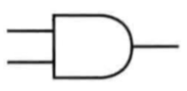|

### 或门 (OR Gate)

| ##container## |
|:--:|
|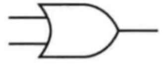|

### 非门 (NOT Gate 或 Inverter)

| ##container## |
|:--:|
|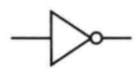|

注: 实际上, 我们在实际描述非门的时候, 一般不会明确的写出一个反相器, 而是<span style="color:red">在需要取反的输入输出直接加一个小气泡</span>即可. 比如:

| ##container## |
|:--:|
|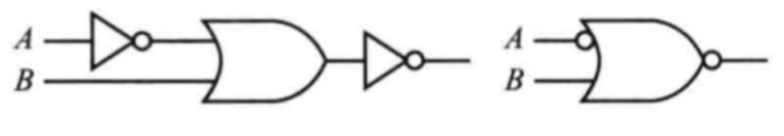|


### 异或门

| ##container## |
|:--:|
|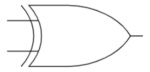|

注: 异或的符合为 $\oplus$

在数字逻辑中, 所有逻辑函数都可以通过单一的反相门(即带有取反功能的门)来实现.比如, 我们可以使用多个非门来实现与门:

- 当我们想要实现逻辑与门时, 我们希望当且仅当两个输入都为真时输出才为真, 否则输出为假. 我们可以使用非门来实现逻辑与门, 通过反转输入并将其传递给一个或门.(即`德摩根定律`)

使用单一的反相门来实现所有其他逻辑函数.这个概念称为`通用门`或者`完备集合`.

## 组合逻辑
组合逻辑: 学了基本的门电路, 接下来我们就可以开始进行组装逻辑块了.

### 译码器
译码器的主要功能是将输入的几位数据(通常是二进制)解码为对应的一个输出信号, 其中这个输出信号对应于输入数据的二进制表示.

一个最常见的译码器具有 $n$ 个输入和 $2^n$ 个输出.对于每一种输入组合, 只有一个输出信号被置为1, 而其他的输出信号都为0.

这意味着如果输入数据对应的十进制值为 $i$ (其中 $0 ≤ i < 2^n$ ), 那么标记为`Outi`的输出信号将被置为1, 而其他的输出信号则为0.

以3位译码器为例, 它有 3 个输入和 8 个输出(因为 $2^3 = 8$ ), 因此也被称为`3-8译码器`.

| ##container## |
|:--:|
|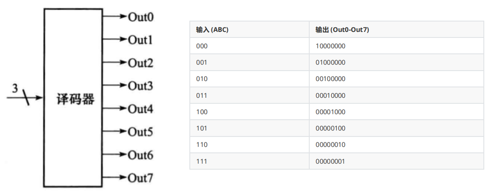|

注: 在`存储器章节`会遇到

| ##container## |
|:--:|
|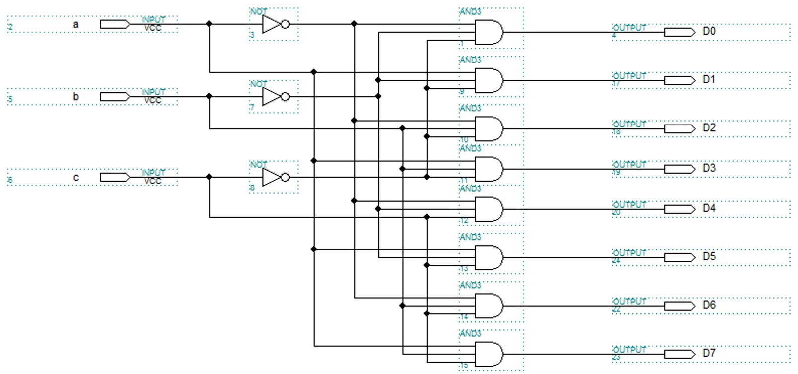|


### 多路选择器
多路选择器之所以称为选择器, 是因为它的输出来自输入信号中的某一个, 而具体来自哪一个输入信号是由控制信号决定的.

| ##container## |
|:--:|
|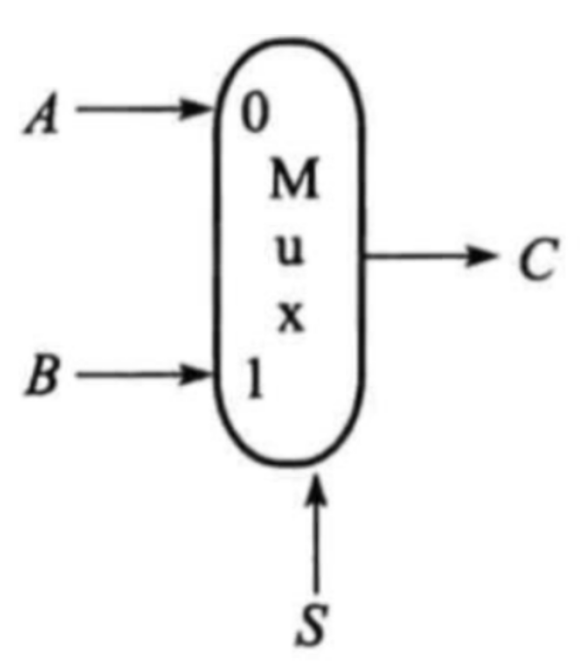|

在一个两输入多路选择器中, 有两个数据输入信号和一个选择(控制)信号. 控制信号决定了哪一个输入信号将被传递到输出信号中. 通常情况下, 控制信号是一个二进制数, 用来选择输入信号的某一个. 如果控制信号为"0", 则第一个输入信号被选中; 如果控制信号为"1", 则第二个输入信号被选中.

因此, 多路选择器的主要功能是根据控制信号来选择一个特定的输入信号, 并将其传递到输出端.这种选择性的传递特性使得多路选择器在数字系统中被广泛应用, 例如在数据选择、数据路由等方面.在更复杂的数字系统中, 多路选择器的选择控制信号可以是多位的, 从而实现对更多输入信号的选择.

| ##container## |
|:--:|
|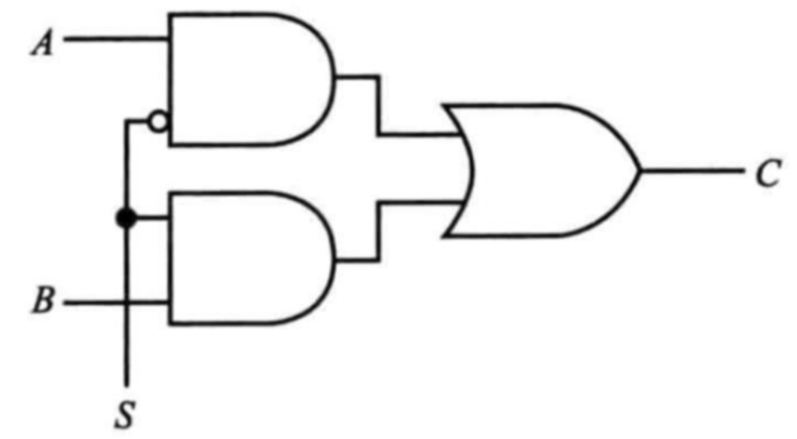|

### Verilog

Verilog是一种**硬件描述语言(HDL)**, 用于对数字电路进行建模、仿真和实现. 它是一种用于描述电子系统的高级语言, 特别适用于数字电路设计. Verilog通常用于设计和验证数字集成电路(ASIC)和可编程逻辑器件(FPGA).

在Verilog中, 多路选择器可以通过if语句或case语句来实现. if语句在简单情况下使用非常方便, 但是对于大型的多路选择器, 使用case语句可能更加清晰和易于理解.

```Verilog
// case
module mux4to1(
    input [1:0]     sel ,
    input [1:0]     p0 ,
    input [1:0]     p1 ,
    input [1:0]     p2 ,
    input [1:0]     p3 ,
    output [1:0]    sout);
 
    reg [1:0]     sout_t ;
    always @(*)
        case(sel)
            2'b00:   begin       
                    sout_t = p0 ;
                end
            2'b01:       sout_t = p1 ;
            2'b10:       sout_t = p2 ;
            default:     sout_t = p3 ;
        endcase
    assign sout = sout_t ;
 
endmodule

// if
module mux4to1(
    input [1:0]     sel ,
    input [1:0]     p0 ,
    input [1:0]     p1 ,
    input [1:0]     p2 ,
    input [1:0]     p3 ,
    output [1:0]    sout);

    reg [1:0]     sout_t ;

    always @(*) begin
        if (sel == 2'b00)
            sout_t = p0 ;
        else if (sel == 2'b01)
            sout_t = p1 ;
        else if (sel == 2'b10)
            sout_t = p2 ;
        else
            sout_t = p3 ;
    end
    assign sout = sout_t ;
 
endmodule
```

## 两级逻辑
任何逻辑函数都可以使用与门、或门和非门来实现。这是数字逻辑设计的基本原则之一。通过组合这些基本逻辑门，可以构建出能够执行复杂逻辑操作的电路。

从数学角度来说，我们可以用函数来简化并规整地表示这些电路实现，这个就是我们的布尔代数中会提到的两种基本表达形式:

- 逻辑函数可以表示为`乘积和`或`和项积`的形式。

### 乘积和 (Sum of Products, SOP)
也称为“与-或”形式。在这种表达形式中，逻辑函数被分解为多个“乘积项”（即“与项”，由输入变量通过与门连接而成）的和。

每个乘积项对应于逻辑函数真值表中的一项“1”。最终，这些乘积项通过或门连接，形成输出。

例如，对于一个3输入逻辑函数F(A, B, C), 其一个可能的SOP形式如下:

$$F(A,B,C)=(A \bigwedge B \bigwedge \overline{C}) \bigvee (A \bigwedge \overline{B} \bigwedge C) \bigvee (\overline{A} \bigwedge B \bigwedge C)$$

<div style="margin-top: 80px;">

---
</div>

### 和项积 (Product of Sums, POS)
也称为“或-与”形式。在这种表达形式中，逻辑函数被分解为多个“和项”（即“或项”，由输入变量通过或门连接而成）的乘积。

每个和项对应于逻辑函数真值表中的一项“0”。最终，这些和项通过与门连接，形成输出。对于一个3输入逻辑函数F(A, B, C), 其一个可能的SOP形式如下:

$$F(A,B,C)=(A \bigvee B \bigvee C) \bigwedge (A \bigvee \overline{B} \bigvee \overline{C}) \bigwedge (\overline{A} \bigvee B \bigvee \overline{C})$$

<div style="margin-top: 80px;">

---
</div>

这两种形式都可以有效地转化为实际的逻辑门电路，且每种形式都只包含两级门（与门和或门）以及可能的非门（反向器）。在实际应用中，选择哪种形式取决于具体的设计要求，如电路的面积、速度、功耗等因素。

通常，综合工具（EDA）会自动将逻辑函数转换为最优化的门级实现。对于复杂的逻辑函数，可能需要使用Karnaugh图（卡诺图）等方法进行优化和简化。

同时，乘积和形式的逻辑函数可以很自然地映射到可编程逻辑阵列（PLA）的结构。

## PLA
可编程逻辑阵列PLA是一种早期的可编程逻辑器件，它利用与门阵列和或门阵列相结合的结构来实现特定的布尔函数。这种结构非常适合于实现乘积项的生成与组合，进而实现复杂的逻辑功能。

| ##container## |
|:--:|
|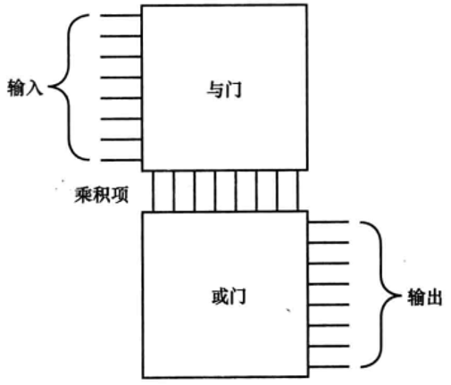|

通过组合与门阵列和或门阵列，PLA可以实现任意布尔函数。其中，与门阵列负责生成布尔函数的乘积项，而或门阵列负责将这些乘积项组合成最终的结果。

乘积项生成器（第一级逻辑）以及和项生成器（第二级逻辑）就构成了两级逻辑。

PLA结构的优点在于其灵活性和可编程性。**通过调整输入信号和与门阵列的连接，可以实现不同的布尔函数，而无需改变硬件结构**。这使得PLA成为了一种常用的可编程逻辑设备，用于实现数字电路中的逻辑功能。 

现代的PLA已经被更复杂的可编程逻辑设备（如FPGA，现场可编程门阵列）所取代，这些设备提供了更高的集成度、更大的灵活性和更强的计算能力。

| ##container## |
|:--:|
|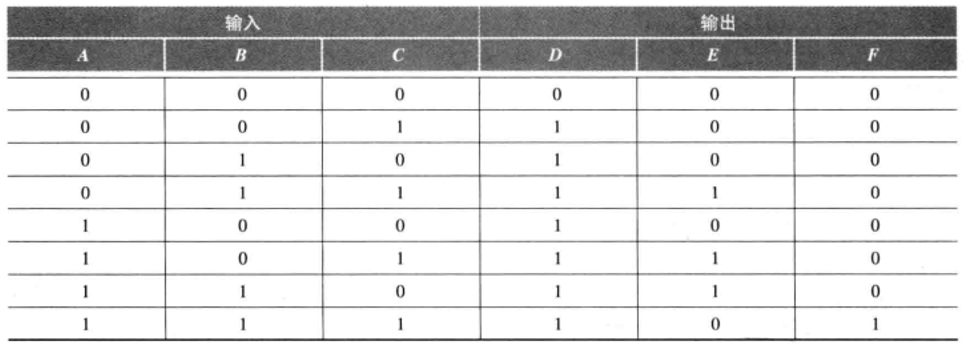|
|真值表|
|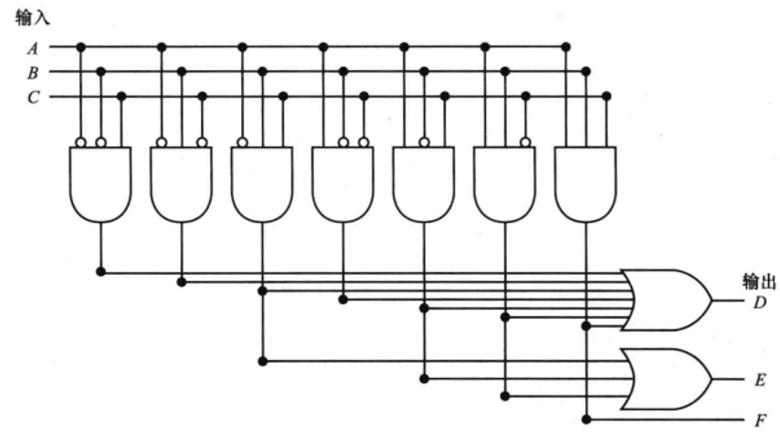|
|PLA电路图|

## 逻辑单元阵列
在数字逻辑和计算机架构中，处理整个字（如32位二进制数）的组合逻辑操作是非常常见的。为了实现这些操作，通常需要构建一个能够并行处理所有位的逻辑单元阵列。这种阵列结构使得 **每一个** 输入位都能 **同时** 经过相同的逻辑操作，从而 *一次性* 生成整个输出字。

在机器内部，经常需要在多个总线之间进行选择。总线是一组数据线的集合，这些数据线被当作一个单一的逻辑信号来处理。总线的宽度（即它包含的数据线数量）决定了它可以一次传输的数据量。

例如，一个32位总线可以一次传输一个32位的字。

<div style="margin-top: 80px;">

---
</div>

**简述总线（Bus）的概念与应用:**

*了解即可 ~~非408内容~~*

总线是计算机系统中一组并行的数据线的集合，它们共同传输一组相关数据。一般来说在机
器内部需要在一对总线中进行选择。主要是以下几种情况:

- **多路选择**: 在有限的物理连接资源下，通过使用多路复用器或多路器在多个数据源或目的地间共享一条总线。例如，当有多个寄存器需要写入同一个总线上的数据时，通过一个选择信号确定当前应该哪个寄存器的数据通过总线传输。

- **总线仲裁**: 在多组件共享同一总线资源的情况下，需要一种机制来决定哪个设备在某一时刻有权使用总线。这通常涉及总线控制器和某种协议（如优先级仲裁、轮询、分布式仲裁等），确保总线访问的有序性和公平性。

- **总线切换**: 在某些复杂系统中，可能有多条并行的总线，如地址总线、数据总线、控制总线等。根据不同的操作需求，可能需要在这些总线间进行切换，以实现数据在不同部分之间的有效传递。例如，在内存访问过程中，先通过地址总线发送内存地址，随后切换到数据总线进行数据读写。

总结起来，处理整个字的组合逻辑操作常常采用阵列化设计以实现高效并行处理。同时，总线作为一种重要的数据传输结构，在计算机内部广泛用于在不同组件间交换数据，而总线的选择操作则是管理总线资源、协调多个数据源和目的地的关键手段。

<div style="margin-top: 80px;">

---
</div>


为了在多个总线之间选择，通常使用`多路选择器`。在总线选择的应用中，每个输入可能代表一个不同的总线，而`选择信号`则决定了哪个总线的数据应该被传递到输出。

通过构建能够处理整个字的逻辑单元阵列，并使用多路选择器在总线之间进行选择，计算机系统能够实现高效的数据传输和处理。这种并行处理的方式大大提高了计算机的性能，使得现代计算机系统能够处理大规模的数据集和复杂的计算任务。

| ##container## |
|:--:|
|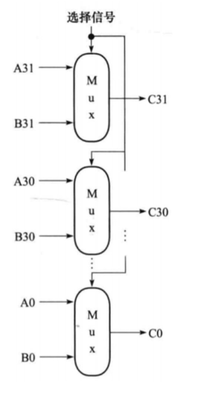|

一个32位宽的一个多路选择器。在 MIPS 指令集中，指令运行的结果被写人寄存器中，而寄存器中的数据可能有一个或两个来源。此时，需要用一个`多路选择器`来决定哪一个总线上的数据（32位）将被写入寄存器中。

而我们 **不会** 针对不同的位宽做不同的机械零部件的设计。而是`直接堆叠`, 只有 1 位需要运算的多路选择器，在这里需要被复制 32 次.