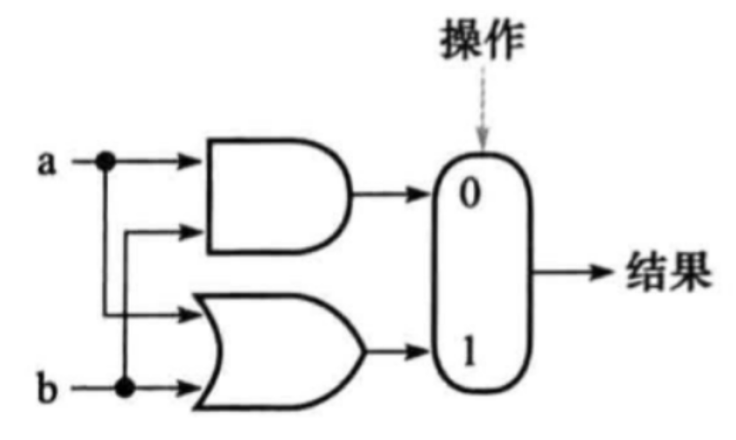
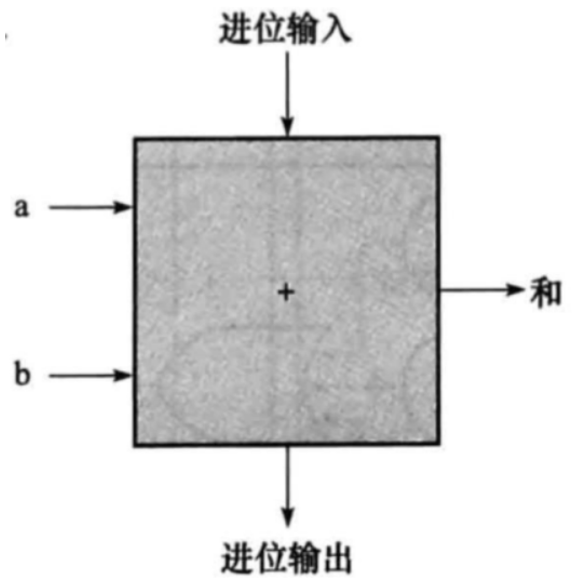
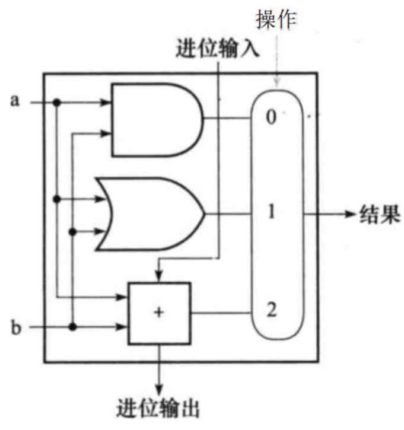
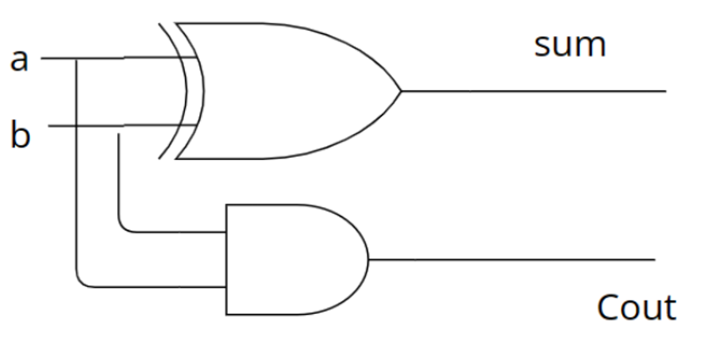
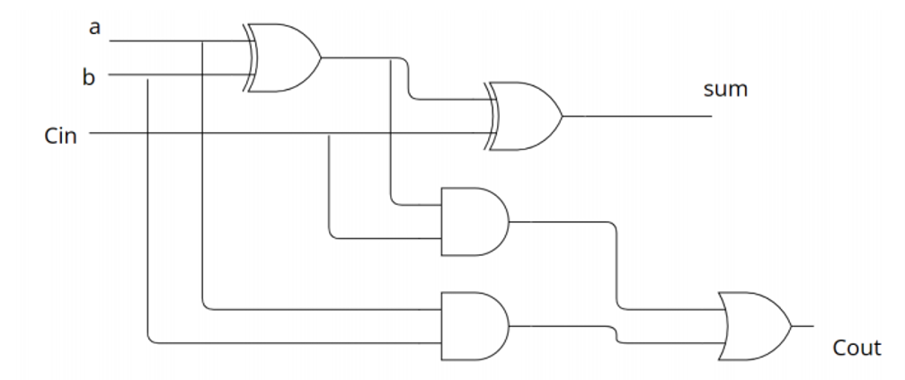
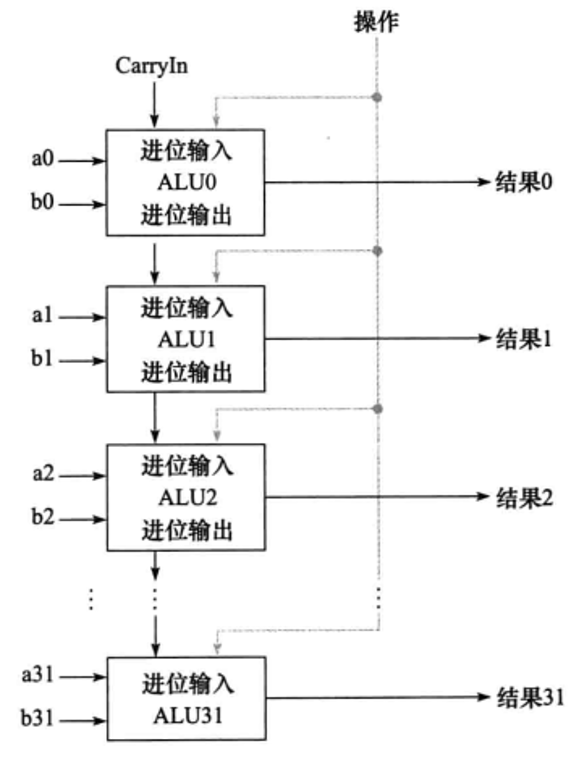
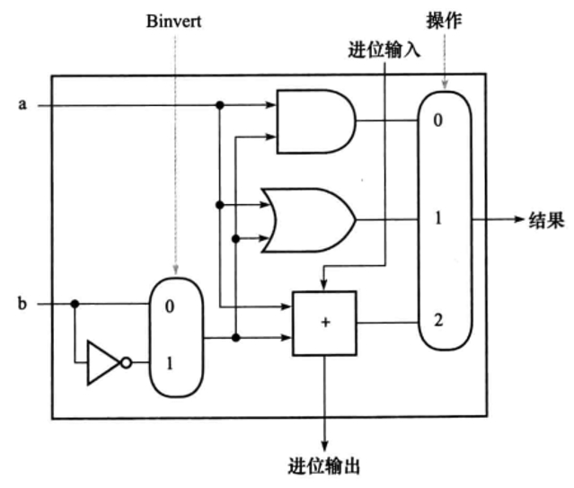

# 构建一个基本算数逻辑单元
## 前言
**算术逻辑单元(ALU)** 是计算机的核心，ALU 用来执行算术运算，比如加法和减法，也可以用来执行逻辑运算，比如与操作、或操作。

我们将借助 4 个硬件块 (与门、或门、反向器和多路选择器) 来构造一个 ALU, 并演示组合逻辑是如何工作的。

## 1位 ALU

> 我们先从简单的 1 bit の ALU 始まり

### 逻辑单元: 与/或

| ##container## |
|:--:|
||

> [!TIP]
> 很简单对吧~ 一目瞭然

### 算术单元: 加法

| ##container## |
|:--:|
||

进位信号在加法运算中非常重要，当两个数相加的结果超过一位数的表示范围时，就需要用到进位。这个进位信号会传递给下一个加法器或逻辑门，以便进行更高位的加法运算，这个主要是进位输出做的事情。

进位输入信号用于传递`上一位`加法产生的进位到当前位的加法操作中。这样，即使在处理多个二进制位的加法过程中发生 **连续的进位**，也能得到正确的结果。

最终，我们将选择控制器和加法器组装在一起，形成了一个1位的ALU。

| ##container## |
|:--:|
||

加法器的内部硬件构成 (补充，不重要)

|A|B|Sum|Cout|
|:-:|:-:|:-:|:-:|
|1|1|0|1|
|1|0|1|0|
|0|1|1|0|
|0|0|0|0|

先不考虑低位的进位，不难发现, `Sum`可以看作由 A 和 B 经过`异或运算`得到, 而向下一位的进位`Cout`则是由A 和 B经过`与运算`得到. 我们用门电路画出来, 就得到了一个**半加器**。

加法器的内部硬件构成:

| ##container## |
|:--:|
||

接下来, 就是在半加器的基础上让它能处理低位过来的进位。

只需要把刚才半加器得到的和再和进位相加, 就能得到真正的和。

因为我们知道异或可以得到和, 与可以得到进位, 所以在半加器的基础上再添加一个半加器的结构,我们的加法器就变成了能处理进位的**全加器**。
|A|B|Cin|Sum|Cout|
|:-:|:-:|:-:|:-:|:-:|
|0|0|0|0|0|
|0|0|1|1|0|
|0|1|0|1|0|
|0|1|1|0|1|
|1|0|0|1|0|
|1|1|0|0|1|
|1|1|1|1|1|

即:

| ##container## |
|:--:|
||

## 32 位ALU
多位的ALU就是用一位ALU组装起来的。我们通过一种特殊的组织方式将其组装起来，这个组织方式叫做 $行波进位$ 。

行波进位的基本思想是将进位计算分解为两个阶段:

1. **进位产生(Generate, G)**: 判断本位是否直接产生进位，即本位两个输入数据相加是否溢出(即都为1)。

2. **进位传递(Propagate, P)**: 判断本位是否有能力将前一位传来的进位向下一位传递，即本位至少有一个输入数据为1。

每个 1 位 ALU 负责执行基本的算术和逻辑运算，并且在这个结构中，每个 1 位ALU的进位输出作为下一位1位ALU的进位输入，这样逐级连接，形成了“行波”般的进位传播链。同时，通过上述的G和P信号，以及相应的逻辑门网络，可以在每一级快速计算出下一级所需的进位信息，无需等待所有低位的实际进位值逐级传递过来，大大提高了运算速度。

| ##container## |
|:--:|
||

## 支持减法(补码)运算的ALU

| ##container## |
|:--:|
||

> [!TIP]
> 如果是减法, 那么 A - B = A + (-B), 则时候 就是 $+ (-B)_{补码}$, 然后默认初始(第一个ALU)进位为1, 代表补码运算. (注, B 需要按位取反再加)