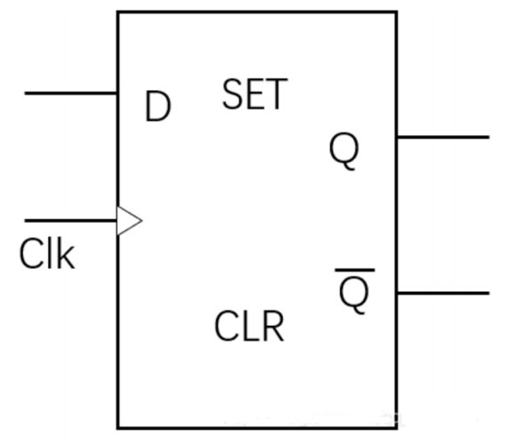
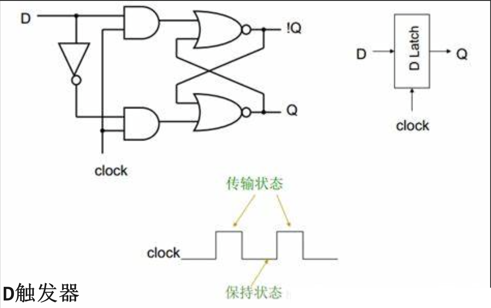
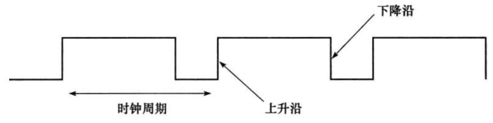
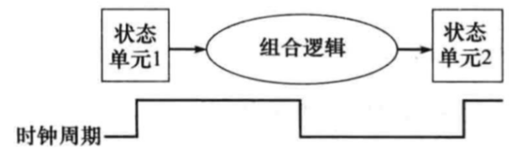

# 逻辑设计的一般方法
前面两章, 我们都是学习的`组合逻辑`; 而本章则是学习`时序逻辑`.

在MIPS实现中, 数据通路的功能部件包括两种不同类型的逻辑单元:

- 处理数据值的单元和存储状态的单元. 

## 处理数据值的单元
组合单元, 或称为组合逻辑单元, 其输出完全由当前的输入决定. 它们没有内部存储, 也不保留任何状态信息. 每当输入改变时, 输出也会立即改变. MIPS数据通路中的算术逻辑单元(ALU)就是一个典型的组合单元. ALU执行加法、减法、与、或等操作, 并立即产生结果. 这些操作的结果只取决于当前的输入, 而与之前的操作或状态无关. 

**组合逻辑单元**的特点如下: 
- **即时响应**: 组合逻辑单元的输出仅取决于当前时刻的所有输入信号, 而与过去的输入或内部状态无关. 一旦输入发生变化, 输出立即更新, 无需时钟周期的等待. 

- **无记忆功能**: 由于组合逻辑单元内部不包含任何形式的存储元件(如触发器), 它们不具备保存历史状态的能力. 这意味着对于相同的输入, 组合逻辑单元始终会产生相同的输出, 表现出确定性和一致性. 

- **常见组合逻辑单元**: 在MIPS 数据通路中, 常见的组合逻辑单元包括算术逻辑单元、多路选择器、加法器、逻辑门等. 例如, ALU用于执行算术运算(如咖加减乘除)和逻辑运算(如与、或、非、异或等), 其输出完全由当前的两个操作数和控制信号决定. 

## 存储状态的单元
与处理数据值的单元相对应, 这些单元具有内部存储功能, 并且包含了计算机在执行过程中的状态信息. 这些状态单元可以存储寄存器文件的值、程序计数器(PC)的值等, 以描述计算机的状态. 

特点如下:
- 这些单元具有内部存储功能, 可以保持和更新状态. 
- 它们通常用于存储指令、数据、地址等信息. 
- 存储状态的单元可以是寄存器、内存或其他形式的存储设备. 

在MIPS架构中, 寄存器文件是一个重要的存储状态的单元. 它包含多个寄存器, 用于存储操作数、中间结果和地址等信息. 寄存器文件允许快速访问数据, 提高了处理器的性能. 

此外, MIPS架构还包括内存单元, 用于存储程序和数据. 内存单元通常比寄存器文件大得多, 可以存储更多的信息, 但访问速度相对较慢. 

---

通过组合处理数据值的单元和存储状态的单元, MIPS处理器可以执行复杂的指令序列, 实现各种计算和控制任务. 

这些单元之间的协作和数据流动构成了MIPS处理器的数据通路. 

## 状态单元
一个状态单元通常至少有两个输入: 一个是要写入单元的数据值, 另一个是决定何时写入的时钟信号. 

数据值输入决定了状态单元将要存储的新内容, 而时钟信号则控制着这个写入操作的时机. 

`状态单元`的输出则提供了在前一个时钟信号周期写入单元的数据值, 这允许处理器在需要时读取这些状态信息. 

| ##container## |
|:--:|
| |

这个是`D触发器`. 也是我们状态单元中最简单的一种单元. 

D触发器在数字逻辑电路中是一种非常重要的存储设备, 它可以用来存储一位二进制信息(即0或1). 

注: `D`是数据(Data), `SET`是置位(使得输出恒为1), `CLR`是清除(使得输出恒为0), `Clk`就是时钟.

## 时序逻辑
包含状态的逻辑部件又被称为**时序的(sequential)**, 因为它们的输出由输入和内部状态共同决定. 

时序逻辑是数字电路和计算机科学中的一个核心概念, 它涉及那些不仅根据当前输入来产生输出的逻辑部件, 还依赖于其内部状态或之前事件的影响. 这与组合逻辑形成鲜明对比, 组合逻辑的输出仅取决于当前输入. (类似于那个真值表)

时序逻辑之所以被称为时序逻辑, 是因为它的工作方式依赖于时间的序列或顺序. 这意味着电路的输出不仅反映了当前输入的瞬时状态, 而且还反映了过去的输入以及由此产生的内部状态的变化. *这种历史信息的记忆能力使得时序逻辑能够执行更为复杂的功能, 比如存储数据、执行条件操作、管理多个并发状态等. *

时序逻辑中的状态单元, 如寄存器和触发器, 是专门设计来存储信息的. 这些单元能够保持其状态, 直到被新的输入或条件所改变. 这种能力使得时序逻辑电路能够跨越多个时钟周期来执行复杂的操作, 而不是仅仅在单个时钟周期内完成. 

**内部状态的存储**: 这种历史信息通常以二进制形式存储在专门设计用于保持数据的硬件单元中, 寄存器(Registers)和触发器(Flip-Flops). 这些状态单元构成了时序逻辑的基本构建块:
- **寄存器**: 多用于存储多位数据(如字节、字、双字等), 并在时钟脉冲的控制下进行数据的读写操作. 寄存器可以看作是多个触发器的集合, 提供了一定容量的数据缓存空间. 

- **触发器**: 是最基础的时序逻辑元件, 通常用于存储一位二进制信息. 触发器根据时钟信号和控制输入(如置位、复位、时钟使能等)改变其内部状态, 并在任何时刻保持该状态直至接收到新的有效触发. 触发器是构建更复杂时序逻辑结构(如寄存器、计数器、移位寄存器等)的基础. 

由于时序逻辑具有记忆能力, 它能够处理时间相关的数据序列, 这对于许多应用来说至关重要. 

- **处理时间相关的数据序列**: 时序逻辑能够按照时间顺序逐个处理数据流, 适用于串行通信、数据采集、视频/音频信号处理等应用场景. 

- **记录过去事件**: 通过对历史状态的记录, 时序逻辑能够追踪系统的操作历史, 这对于故障诊断、审计跟踪、状态恢复等任务至关重要. 

- **预测未来行为**: 基于当前状态和输入规则(如状态机逻辑), 时序逻辑可以预测系统在未来某个时刻的行为或状态, 这对于控制系统的设计、协议解析、指令流水线等非常有用. 

- **实现复杂状态转移**: 在状态机、控制器、CPU等设计中, 时序逻辑通过状态间的转移来执行复杂的操作序列, 确保系统按照预定的流程有序运行. 

## 时钟
时钟决定了处于某一状态的存储元件何时被更新. 

时钟是一个具有固定周期时间的不停运转的信号, 时钟频率是周期时间的倒数. 

时钟信号是由时钟发生器产生的. 时钟周期时间或者说时钟周期被分割为两部分, 高电平时钟和低电平时钟. 

在此我们只使用 **边沿触发时钟(edge- tiggered clocking)**. 这意味着所有的状态改变都将发生在时钟边沿. 我们之所以使用一种基于边沿触发的时钟策略, 是因为它易于解释. 

| ##container## |
|:--:|
||

## 时钟策略

时钟方法通过引入时钟信号来同步数据的读写操作. 时钟信号是一个周期性的信号, 它的每个周期都划分为几个不同的时间段, 包括读取时间、写入时间以及可能的其他操作时间. 在这个框架下, 所有的数据读写操作都必须在特定的时间段内完成, 从而避免了数据冲突和不确定性. 

| ##container## |
|:--:|
||

**边沿触发**: 确保了数据在时钟信号的特定边沿(通常是上升边沿或下降边沿)被读取或写入, 从而避免了数据冲突和不确定性. 

1. **状态单元1**: 这是第一个存储数据值的状态单元. 它在时钟信号的上升沿(或下降沿)更新其内部状态. 

2. **组合逻辑**: 这是一个无记忆元件的逻辑电路, 它根据当前状态单元1和状态单元2的状态计算出新的输出. 这个过程不依赖于时钟信号, 而是立即完成的. 

3. **状态单元2**: 这是第二个存储数据值的状态单元. 它的输入来自组合逻辑的输出, 同样在时钟信号的上升沿(或下降沿)更新其内部状态. 

整个电路的工作就是: 
- 在一个时钟周期内, 状态单元1的值被读取到组合逻辑中进行处理. 

- 组合逻辑根据状态单元1的值计算出新的输出, 该输出作为状态单元2的输入. 

- 当时钟信号发生跳变(上升沿或下降沿)时, 状态单元2会更新其内部状态, 存储组合逻辑提供的新值. 

- 这个过程在每个时钟周期内重复, 使得状态单元1和状态单元2的值可以按照预设的逻辑规则进行转换. 

---

在边沿触发的时钟方法中, 时序逻辑单元(如寄存器和触发器)的状态改变只在时钟信号的特定边沿发生. 这意味着, 在时钟信号的稳定期间(即非边沿期间), 时序逻辑单元的状态保持不变, 而组合逻辑则根据当前的状态单元集合的值进行计算. 当时钟信号到达其边沿时, 组合逻辑的输出被写入状态单元, 从而更新系统的状态. 

通过严格的时钟方法, 设计者能够确保在任何时候, 一个信号要么正在被稳定地读取, 要么正在被明确地写入, 二者不会重叠, 从而避免了数据的不确定性, 保障了计算机系统乃至任何依赖同步数字逻辑的电子设备的正确、高效和可靠运行. 

要注意. 这里是时钟信号, 大家可以理解成这是一个电路变化的必然规律, 在这个必然规律下做出的必然行为. 而不是我们主观上发送一个写入信号. 这两个是不一样的东西. 

---

一般来说, 在时序逻辑中, 状态单元的状态改变是通过写入操作完成的, 而这个写入操作可以由时钟信号和写控制信号共同控制. 

当状态单元在每个有效的时钟边沿都进行写入操作时, 意味着该状态单元总是随着时钟的跳动而更新其值. 在这种情况下, 写控制信号是不必要的, 因为写入操作是时钟边沿的必然结果. 这种设计简化了电路. 当然了, 增加了功耗. 因为即使写入的值没有变化, 状态单元也会进行写入操作. 

然而, 如果状态单元不是每个周期都进行修改, 那么就需要一个写控制信号来确定何时进行写入操作. 在这种情况下, 只有当时钟边沿到来并且写控制信号有效时, 状态单元才会改变其状态. 这种设计增加了灵活性, 因为写入操作可以根据系统需求进行精确控制, 但同时也增加了电路的复杂性. 

当然了, 这里控制信号是否有效等等的我们都可以用0、1来进行表示

---

*逻辑设计的基础内容我们掌握了, 后面我们就可以具体去看中央处理器的构成了: 数据通路 + 控制器*