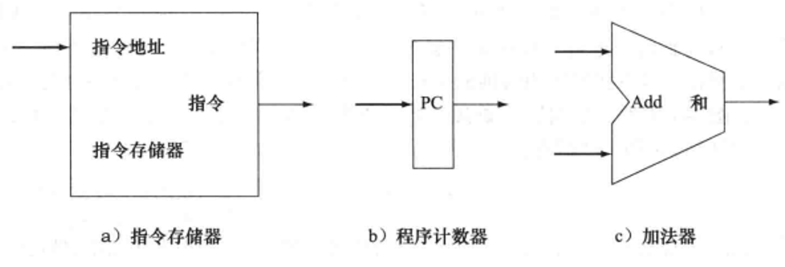
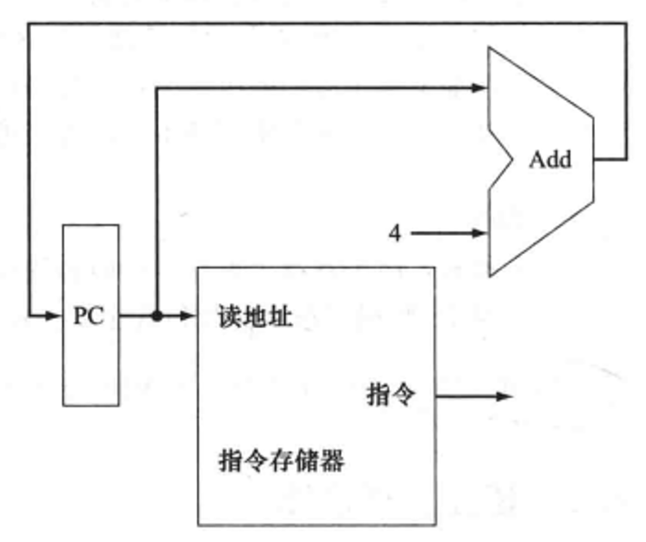
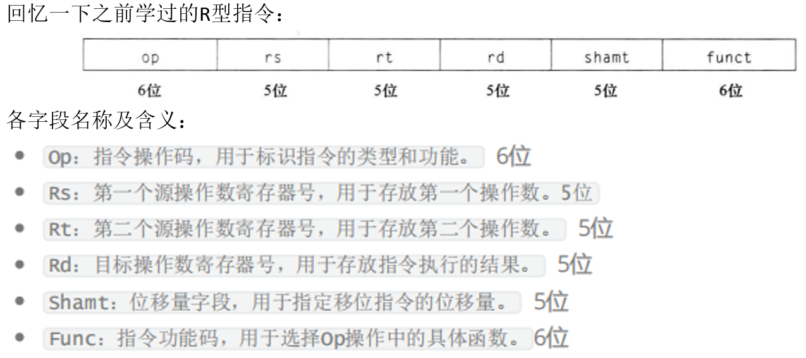
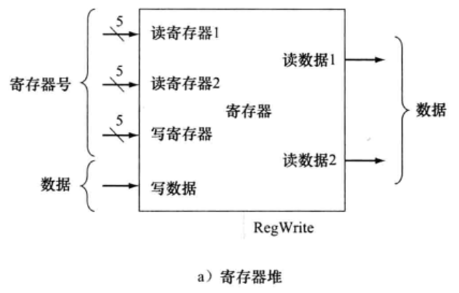
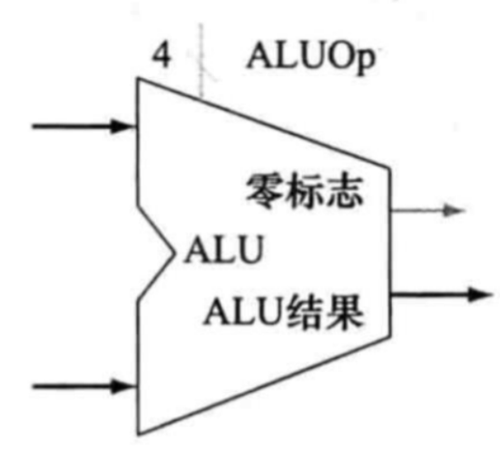
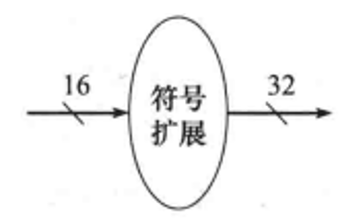
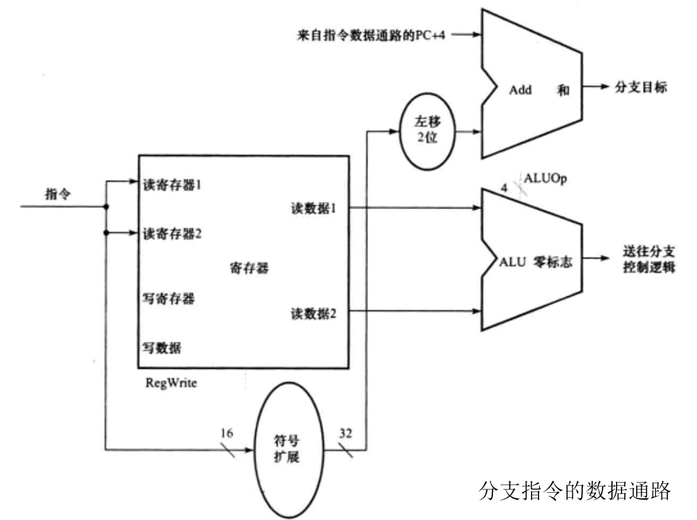
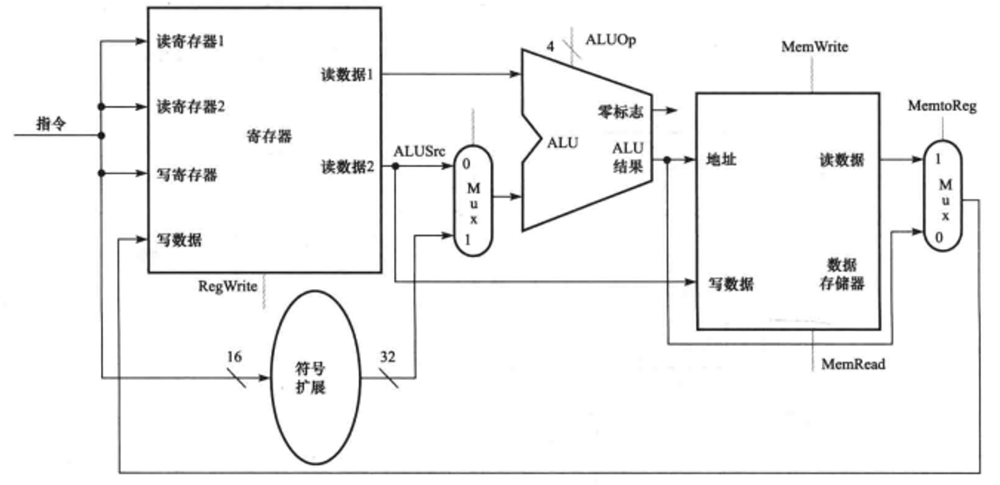
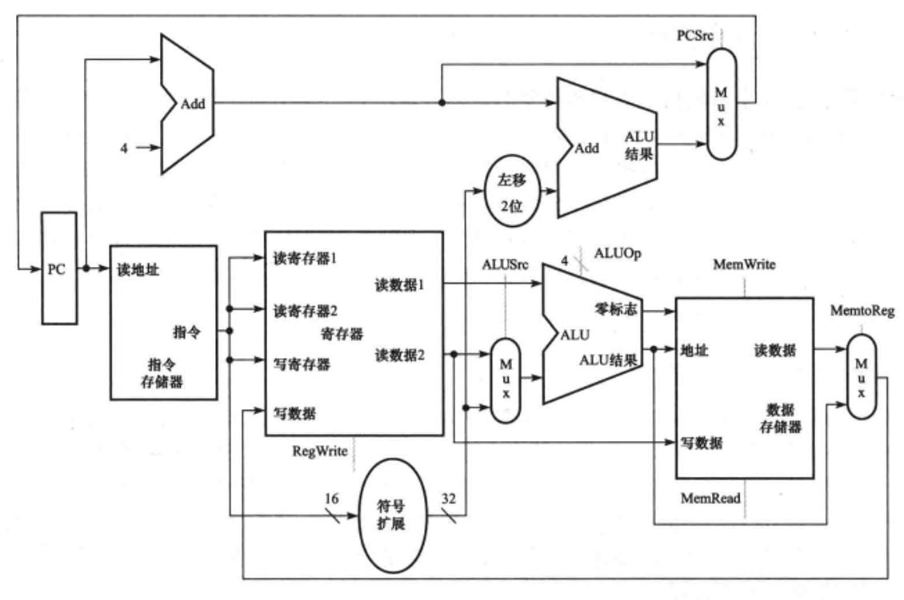

# 建立一个数据通路

本节以 MIPS 指令为例子, 自底向上的开始抽象整个数据通路。(注: 只实现不同方向具有代表的指令)

数据通路部件: 一个用来操作或保存处理器中数据的单元。在MIPS实现中, 数据通路部件包括指令存储器、数据存储器、寄存器堆、ALU和加法器。

- 请见其`数据通路`的组成 -> [MIPS核心子集及实现方式](../001-MIPS核心子集及实现方式/index.md)

## 取指令操作
| ##container## |
|:--:|
||

两个状态单元和一个加法器。

一个存储单元, 即指令存储器, 它用于存储程序的指令, 并在给定地址时提供指令。 

一个程序计数器, 用于保存当前指令的地址。 

最后, 我们需要一个加法器来计算 PC 的值以指向下条指令的地址。 加法器就是一个组合单元。

要执行任何一条指令, 首先要从存储单元中将指令取出。为准备执行下一条指令, 也必须增加程序计数器使其指向下一条指令, 即向后移动 4 字节(32位为例)

| ##container## |
|:--:|
||

用于取指和程序计数器自增的数据通路部分。取出的指令被数据通路的其他部分使用。

---

回顾一下: [指令格式](../../003-第二章指令系统/005-指令格式/index.md)

| ##container## |
|:--:|
||

在`R型指令`中, 指令格式通常包括操作码字段和多个寄存器地址字段。操作码字段指示要执行的具体操作(如加法、减法、与操作等), 而寄存器地址字段则指定哪些寄存器包含操作数以及哪个寄存器将用于存储结果。

`R型指令`涉及读取两个或多个寄存器的内容, 通过算术逻辑单元(ALU)执行某种算术或逻辑操作, 然后将结果写回到一个寄存器中。这类指令之所以被称为R型指令, 是因为它们的操作数(即参与运算的数据)主要来自寄存器, 而不是内存或其他源。(寄存器的英语单词就是`Register`)。

## 通用寄存器和寄存器堆

| ##container## |
|:--:|
||

刚才我们提到了寄存器, 在上述操作中, 寄存器的主要作用是用于暂存指令执行过程中所需要的数据和地址信息, 我们将这一类寄存器称之为`通用寄存器`。

但是要注意, 通用寄存器是中央处理器(CPU)中的一类寄存器, 它们不针对特定的功能, 而是可以用于多种不同的目的, 例如存储临时数据、地址、计数器值等。通用寄存器可以被任何指令访问, 并且可以在执行各种操作时存储和传递数据。

**通用寄存器, 统一存储在一个寄存器堆中**。寄存器堆是一个小型的、高速的存储器, 用于存储处理器中的通用寄存器。它的设计目标是为了快速访问, 因此其访问时间通常远小于访问主存的时间。每个寄存器都有一个唯一的编号(寄存器号), 通过指定这个编号, 处理器可以快速地读写特定的寄存器。

- `R型指令`和`寄存器堆`: R型指令通常具有三个寄存器操作数: 两个`源操作数`和一个`目的`操作数。通过整个指令的操作, 我们就可以得到一个相应的寄存器堆的设计

## ALU模块

| ##container## |
|:--:|
|实际上, [构建一个基本算数逻辑单元](../003-构建一个基本算数逻辑单元/index.md)中制作的ALU还缺少了一些内容:|
||

这个ALU有两个32位的输入, 一个32位的输出, 以及一个1位的输出来指示处理器其结果是否为0。这意味着ALU不仅可以执行传统的算术运算(如加法、减法、乘法和除法), 还可以执行逻辑运算(如与、或、异或和取反)

- **零标志输出(ZF)**: 是一个状态位, 用于指示ALU的结果是否为零。如果ALU的结果为零, 那么ZF将被置位(设置为1), 否则ZF将被清零(设置为0)。这个标志对于条件分支和判断非常重要, 因为`它允许处理器根据运算结果调整执行路径`。

- **ALUOp输出**: 是一个单一的比特位, 用于指示ALU执行的操作类型。它可以表示多种不同的操作, 具体取决于ALU的设计。在这个特定的ALU中, ALUOp输出可能表示加法、减法、逻辑与、逻辑或等操作之一。看见ALUOp有一个4, 这个是针对ALU的四位控制法。ALU的四位控制通常用来指示ALU执行哪种类型的运算。这四个控制位通常被称为操作码(Opcode), 它们可以编码不同的运算类型, 这些控制位通常由处理器的其他部分(如控制器单元)设置, 以指示ALU应该执行哪种运算。

## 取存指令
存取指令`lw`和`sw`: 分别用于 *从内存加载数据到寄存器* 以及 *从寄存器存储数据到内存*。

具体请见 -> [计算机硬件的操作与操作数](../../003-第二章指令系统/001-计算机硬件的操作与操作数/index.md)

例如:

```MIPS
# 取数: lw 目标寄存器, 偏移量(基址寄存器)
lw $t0, 100($s1)

# 存数: sw 源寄存器, 偏移量(目的寄存器)
sw $s1, 4($s2)
```

因为他涉及到存取操作, 以及需要进行地址的计算,  所以, 在进行存取操作的时候, 我们之前讲的ALU和寄存器堆模块都会用得到。

我们还注意到, 我们的寄存器地址可能还要加上一些偏移地址。这时候就涉及到另外一个问题了。

## 符号扩展
指令是有自己的格式的, 我们的偏移地址也是有固定的位数的。但是, 我们指令里面会表明寄存器号, 而实际的操作是, 我们要把偏移地址加上当前寄存器的地址, 来计算目标寄存器地址。假设我们的寄存器地址是32位的, 但是偏移地址是16位的。这时候, 我们要把32位和16位进行相加。怎么办呢? ---- $符号扩展$

要注意, 在处理器设计中, 将16位的偏移地址符号扩展为32位的带符号值通常不是由专门的硬件单
元直接完成的, 而是由`指令集架构(ISA)`和`处理器微架构`共同处理的

| ##container## |
|:--:|
||


逻辑单元可以是一个简单的算术逻辑单元(ALU)的一部分, 或者是一个专门的硬件电路, 它接受一个16位的带符号整数作为输入, 并输出一个符号扩展后的32位整数。以下是这个逻辑单元如何工作的基本步骤

1. **读取16位输入**: 逻辑单元从指令的某个字段(如立即数字段)中读取16位的带符号整数。

2. **检测符号位**: 逻辑单元检查这个16位整数的最高位(即第15位), 以确定它是正数还是负数。

3. **执行符号扩展**: 

    - 如果符号位是0(正数或零), 逻辑单元在输出的32位整数的剩余高位(第16位到第31位)上填充0。

    - 如果符号位是1(负数), 逻辑单元在输出的32位整数的剩余高位上填充1。

4. **输出32位结果**: 符号扩展后的32位整数被输出到处理器的内部总线或其他需要它的单元。

## 指令集架构 (ISA)

指令集架构定义了一台计算机系统的软件和硬件之间的接口规范, 它是程序员和硬件之间交流的语言。ISA详细说明了处理器能够理解和执行的所有指令, 包括基本数据类型、寄存器集合、指令格式、寻址模式、中断和异常处理机制等。它决定了一个处理器能够执行的计算类型和数据操作, 是软件兼容性的基础, 不同的ISA之间通常不兼容。

指令集架构是计算机硬件平台的基础, 控制着计算机能够执行的操作。不同的指令集架构在设计思想和实现方式上有所区别, 导致了各种不同类型的处理器架构。指令集架构直接影响了计算机的性能、功耗和编程模型等方面, 是计算机系统中一个至关重要的设计因素。

- 重要性:

    - **软件兼容**: 相同的ISA意味着软件可以在不同的处理器上运行, 只要它们遵循同一套指令标准。

    - **性能指标**: ISA的效率直接影响程序执行的效率, 如指令的复杂度、指令的编码方式等。

    - **设计指导**: ISA为处理器的设计提供了蓝图, 决定了处理器能实现的功能范围。

## 处理器微架构

微架构是指处理器内部的实际硬件实现细节, 它关乎如何具体实现ISA规定的功能。这包括处理器的内部结构布局、流水线设计、缓存系统、分支预测、多核协同等。微架构设计的目标是在给定的ISA框架下, 优化性能、功耗和成本。

## 分支指令: beq
`beq(Branch if Equal)`指令是一个条件分支指令, 用于在比较两个寄存器的内容是否相等时改变程序的控制流。

```MIPS
beq Srs, $rt, offset
```

- `$rs`和`$rt`是源操作数寄存器, 它们包含了要比较的两个值。

- `offset`是一个有符号的立即数, 表示相对于当前指令地址的偏移量(以`字`为单位)。如果`$rs`和`$rt`的内容相等, 则程序流会跳转到当前指令地址加上`offset`( $跳转目标地址=当前指令地址+ offset \times 4$, 因为MIPS指令是按字(word)对齐的, 每个字(word)是4字节, 而偏移量是以字为单位给出的)的位置。如果它们不相等, 则指令执行完毕后, 控制流会顺序执行到下一条指令。(自增)

```MIPS
addi $s0, $zero,5 # 将5赋值给$s0
addi $s1, $zero,5 # 将5赋值给$s1
beq $s0, $s1, label # 如果$s0和$s1相等, 则跳转到label处
# 如果没有跳转, 则接下来的指令会顺序执行
addi $s2, $zero, 10 # 这行代码只有在$s0和$s1不等时才执行
label:
addi $s3, $zero,20  # 这里是跳转的目标位置
```
在这个例子中, 因为`s0`和`s1`都存储了`5`, `beq`指令会使程序跳转到`label`标签处, 直接执行将`20`赋值给`s3`的指令, 跳过了中间的`addi $s2, $zero, 10`指令。

根据整个分支指令的操作, 分支指令需要哪些数据单元。首先, 需要两个操作, **计算分支目标地址** 和 **比较操作数**。

1. 计算分支目标地址:
    - **符号扩展单元**: MIPS 指令集中的偏移量(`offset`)通常是一个 16 位的立即数。因为 MIPS指令是32位的, 所以当`offset`作为跳转地址的增量时, 需要将其从16位扩展到32位。符号扩展单元负责这个工作, 
  
        - 如果`offset`的最高位(符号位)是 1, 则将其余位填充为 1;
        
        - 如果符号位是0, 则填充为 0。这样, 扩展后的`offset`就保持了其原始的符号(正或负)。
    
    - **加法器**: 扩展后的`offset`(现在是32 位)乘以4(因为 MIPS 指令是4字节长的), 然后与当前指令的地址相加, 得到分支的目标地址。这个加法操作由加法器完成。

2. 比较操作数:
    - **寄存器堆**: MIPS架构有一个或多个寄存器堆(通常称为寄存器文件), 用于存储操作数和中间结果。在分支指令中, 两个源寄存器(`$rs`和`$rt`)提供要比较的操作数。这两个寄存器的内容由寄存器堆提供, 但不需要将比较结果写回到寄存器堆中。

    - **ALU(算术逻辑单元)**: ALU负责执行算术和逻辑操作。在`beq`指令的情况下, ALU被配置为执行减法操作(尽管这里实际上是比较两个数是否相等, 但减法操作可以用来实现这个比较)。如果`$rs`和`$rt`的内容相等, 则减法的结果将为0。

    - **零检测**: ALU通常有一个输出信号, 用于指示其操作的结果是否为`0`。在`beq`指令中, 这个零检测信号被用来判断`$rs`和`$rt`是否相等。如果零信号有效(即结果为`O`), 则控制单元知道两个操作数相等, 并根据指令的分支部分来决定是否跳转到目标地址。
  
| ##container## |
|:--:|
||

## R型指令和访存指令在数据通路设计上的区别
1. **ALU的输入来源不同**:
    - **算术逻辑指令(R型)**: 这类指令通常涉及寄存器之间的算术或逻辑运算。因此, ALU的两个输入都直接来源于寄存器。比如加法指令ADD, 会将两个操作数从源寄存器中取出, 送入ALU进行计算。

    - **访存指令**: 对于访存指令, 如LOAD或STORE, ALU的一个输入同样来自寄存器, 但另一个输入则是经过符号扩展的指令中的偏移地址。这个偏移量与某个基址寄存器的内容相加, 计算出实际的存储器地址。这样做的目的是为了访问特定内存位置的数据(LOAD)或将数据存储到特定位置(STORE)。

2. **目的寄存器的数据来源不同**: 
    - **算术逻辑指令(R型)**: 执行完毕后, ALU的输出(即运算结果)会被写回到目标寄
存器。这意味着算术逻辑运算的结果直接更新了寄存器的内容。

    - **访存指令**: 对于加载(LOAD)指令, 目的寄存器中的数据来自于存储器。即从计算出的内存地址中读取数据, 并将读取到的数据写入指定的寄存器。而对于存储(STORE)指令, 虽然不直接更新寄存器内容, 但其"目的"是从寄存器中取出数据写入内存, 这反映了数据流动方向的不同。

---

为了只用一个 ALU 和一个寄存器堆来创建一个数据通路, ALU 的第二个输入和要存入寄存器堆的数据都需要两个不同的来源。所以, 要在 ALU 的输入和寄存器堆的输入数据处各加一个选择器。将上述合并以后, 形成:

| ##container## |
|:--:|
||
|访存指令和R型指令数据通路的合并|

再加上之前的取指数据通路, 分支数据通路, 以及刚合成的这个通路, 把所有部件合并在一起建立一个简单的 MIPS 体系结构数据通路:

| ##container## |
|:--:|
||

如果再加上`控制信号(控制单元)`, 就可以构成 一个完整的MIPS子集.
