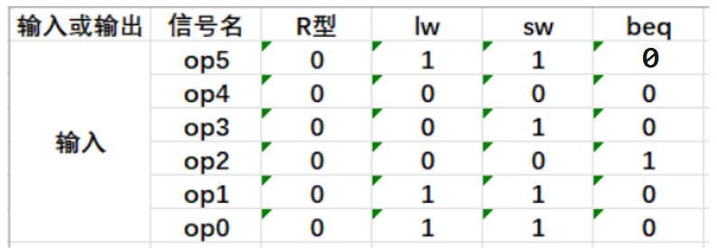

# 实现MIPS子集
控制单元必须能够接收输入, 能够产生每个状态单元的写信号、每个多选器的选择信号和 ALU 的控制信号。由于 ALU 的控制比较特殊, 因此最好先设计 ALU, 随后再设计控制单元的其他部分。

我们用上一节的`数据通路`和增加一个简单的`控制单元`来实现一个 MIPS 体系结构, 用以实现我们讲过的那些指令。

## ALU的控制信号
先确定好控制信号, 也就是什么样的信号控制什么样的功能呢?

|ALU控制信号|功能|控制信号|功能|
|:-:|:-:|:-:|:-:|
|0000|与|0110|减|
|0001|或|0111|小于则置位|
|0010|加|1100|或非|

这个表格描述了ALU(算术逻辑单元)的控制信号及其对应的功能。

根据指令类型的不同, ALU将执行上述5种功能中的一种。

如:
- 对于取字和存储字指令, ALU会用加法计算存储器地址。
- 对于R型指令, ALU会根据指令的低6位(`funct`字段)来执行与、或、减、加、小于则置位这5种操作之一。
- 对于相等则分支指令, ALU会执行减法操作。

设置一个简单的控制单元用来生成这4位的ALU信号: 这个控制单元利用了指令的funct字段(6位)和ALUOp字段(2位)作为输入, 输出一个4位的ALU控制信号来指挥ALU执行特定的操作。

1. **ALUOp字段**:
    - `00`: 表示进行存取指令所需的加法操作(如Load/Store指令中的地址计算)。
    - `01`: 表示进行beq指令所需的减法操作, 用于比较两个寄存器值是否相等。
    - `10`: 表示操作由funct字段决定, 这通常涉及R型指令中的各种算术逻辑操作。

2. **funct字段**(当ALUOp为 10 时考虑)定义了R型指令中的具体操作, 比如与、或、减、无符号比较、小于则置位(SLT)等。

为了将这些输入转换成具体的4位ALU控制信号, 可以设计一个 **组合逻辑电路** 或者 **查找表(LUT,Look-Up Table)** 来实现。

下面是简化版的控制逻辑示例, 仅展示核心思想:

- **ALUOp = 00 (加法)**:
    - 直接映射到执行加法操作的控制信号, 假设为0010(仅为示例, 实际编码依设计而定)。

- **ALUOp = 01 (减法)**:
    - 映射到执行减法操作的控制信号, 例如0110。

- **ALUop = 10 (funct决定)**:
    - 这时需要根据funct字段进一步解码。例如:
        - funct的某个特定值对应`与操作`, 控制信号可能是0000。
        - funct的另一个值对应`或操作`, 控制信号可能是0001。
        - 同理, 对于`减`、`无符号比较`、`小于则置位等操作`, 都会有对应的控制信号编码。

注: LUT指 **显示查找表(Look-Up-Table)**, 本质上就是一个RAM。它把数据事先写入RAM后, 每当输入一个信号就等于输入一个地址进行查表, 找出地址对应的内容, 然后输出。

对于这种主控制单元首先根据指令的某些字段(如操作码)生成一个或多个中间控制信号(如ALUOp), 然后这些中间控制信号被传递给更具体的控制单元(如ALU控制单元), 以生成直接控制硬件组件(如ALU)的最终控制信号的方法叫做<span style="color:red">多级译码</span>。

其好处:
1. 减小主控制单元规模
2. 提高速度
3. 提高灵活性
4. 降低功耗
5. 简化测试

在处理器设计中, 多级译码方法通常与流水线(即将讲到)、分支预测和其他技术结合使用, 以实现更高的时钟频率、更低的功耗和更好的性能。这种优化对于现代处理器设计至关重要, 因为处理器的性能直接影响到整个计算机系统的速度和响应能力。

这个控制单元利用了指令的funct字段(6位)和ALUOp字段(2位)作为输入, 输出一个4位的ALU控制信号来指挥ALU执行特定的操作。

| ##container## |
|:--:|
||

注: `XXXXX`表示任意, 即不关心这里的值.

通过上述表格, 我们就可以看到怎样根据 2 位的 ALUOp 和 6 位的 funct 功能字段生成 ALU 的控制信号。

通过上面的表我们可以发现两个问题:

1. **有限的有效funct值**: 由于funct字段的64种可能取值中只有一小部分是实际使用的, 这意味着我们不需要为每一个理论上的组合都设计一个控制信号输出。可以通过查找表(LUT, Look-Up-Table)、解码器或者简化的逻辑电路来匹配并识别出有效值, 仅对这些有效的funct值进行处理。

2. **条件性使用funct字段**: 仅当ALUOp为特定值(在例子中是"1o")时, funct字段才被考虑。这允许我们设计一个"门控"机制, 即一个小逻辑单元, 它基于ALUOp的值决定是否需要使用funct字段来生成控制信号。如果ALUOp不是"10", 则可以直接设置默认的ALU控制信号或者根本不生成控制信号, 进一步简化了逻辑。

为设计这个逻辑单元, 由此为 ALUOp 和 funct 字段有意义的部分组合生成一张真值表。

| ##container## |
|:--:|
||

真值表展示了ALU控制信号(操作)的生成规则, 其中输入为ALUOp和funct字段。真值表中仅列出了有效的输入组合以及它们对应的ALU操作。真值表建好以后, 可以进行优化并转化成门电路。

## 主控单元的设计
我们已经描述了如何使用funct和2位信号作为输入来进行ALU控制单元的设计, 现在来看看控制的其他部分。在开始之前, 首先看指令的各个字段和数据通路所需的控制信号。

为了理解怎样将指令的各个字段与数据通路相连, 需要复习一下三种指令类型的格式: R型指令、分支指令和存取指令。

| ##container## |
|:--:|
||

| ##container## |
|:--:|
||
|上节课的数据通路|

提取相同的操作。实际上, 大部分操作都是单独的。只有一个, 就是目的寄存器。R型指令的rd和存取指令的rt都是目的寄存器, 所以我们需要一个多选器, 用来指明寄存器号在哪个字段里面。另外再加一个ALU控制单元。

| ##container## |
|:--:|
||

数据通路上增加了所有必需的多选器, 并标识出了所有的控制信号。`控制信号`以`灰色线`表示。还增加了 ALU 控制单元。PC 不需要写控制, 因为它在每个时钟周期末都被写入一次。分支控制逻辑决定给PC 自增还是写入分支目标地址。我们来看一看所有控制信号的作用。


| 控制信号名 | 无效时的含义 | 有效时的含义 |
|:-:|:-|:-|
|RegDst| 写寄存器的目标寄存器号来自rt字段 (位20:16) | 写寄存器的目标寄存器号来自rd字段 (位15:11) |
|RegWrite| 无 | 数据写入由写入寄存器输入端口指定的寄存器 |
|ALUSrc| 第二个ALU操作数来自第二个寄存器堆的输出 (读数据2) | 第二个ALU操作数是指令低16位的符号扩展 |
|PCSrc| PC使用PC+4更新 | PC使用分支目标地址更新 |
|MemRead| 无 | 输入地址对应的数据存储器的内容输出到读数据输出端口 |
|MemWrite| 无 | 将写入数据输入端的数据写入地址输入端指定的存储单元 |
|MemtoReg| 写入寄存器的数据来自ALU | 来自数据存储器 |

这些控制信号用于指导数据路径(datapath)和控制器(controller)内的各个单元如何操作。每个控制信号都有特定的作用, 它们决定了寄存器、ALU(算术逻辑单元)、内存接口等的行为。

关于 PCSrc 控制信号, 它是一个特殊的控制信号, 因为它不仅依赖于指令的操作码(这通常通过控制单元解析6位操作码字段来确定), 还依赖于ALU的输出状态。在这种情况下, 当指令是相等则分支指令(如 BEQ )并且ALU的零输出有效(表示比较的结果为真)时,  PCSrc 信号会被设置。

- 为了生成`PCSrc`信号, 控制单元会执行以下步骤:

    1. 解析指令的操作码字段(6位, 位置31:26)。

    2. 如果操作码指示这是一个相等则分支指令(如`BEQ`), 则控制单元会生成一个内部信号, 我们称之为"Branch"信号。

    3. 同时, 控制单元会监视ALU的零输出信号。当ALU执行完比较操作后, 这个信号会被设置(如果比较的结果为真, 即两个操作数相等)。

    4. 通过一个逻辑"与"操作(AND gate), 将"Branch"信号和ALU的零输出信号组合起来。只有当两个信号都为真时, PCSrc 信号才会被设置。

这样,  PCSrc 信号就能正确地指示程序计数器(PC)应该如何更新: 如果 PCSrc 为真, 则PC会根据分支偏移量进行更新；如果 PCSrc 为假, 则PC会正常递增以指向下一条指令。

对于其他的控制信号, 它们可以直接根据操作码来确定, 因为它们的值不依赖于ALU的输出或其他动态条件。这些控制信号可能用于控制寄存器的读写、ALU的操作、数据总线的复用等。

将控制单元继续加入到电路图当中:

| ##container## |
|:--:|
||

看控制单元的真值表。

由于控制信号的状态仅由操作码决定, 我们需要定义在每种操作码下每个控制信号的取值: 0 1 或者x。

| ##container## |
|:--:|
||

至此, 我们一个简单的数据通路就完成了。

来看一下基本的数据通路的操作:

## 数据通路操作: R型

| ##container## |
|:--:|
||

## 数据通路操作: 取数

| ##container## |
|:--:|
||

## 数据通路操作: 分支

| ##container## |
|:--:|
||

至此 实现了对上述三个数据通路的控制。

但是, 还有两个问题: 
1. 控制单元如何实现的？
2. 指令集中的其他指令如何实现的？

## 完成控制单元
控制单元的功能我们已经在之前的表中定义好了, 其输入为 6 位操作码`Op[5:0]`, 输出为控制信号。这样, 可以基于操作码的二进制编码为每个输出建立一张真值表:

| ##container## |
|:--:|
||
||

控制器负责协调和指挥各个部件协同工作, 确保指令的正确执行。

其结构以下几个关键部分:

- 由程序计数器(PC)、指令寄存器(IR)、指令译码器、时序产生器和操作控制器组成。

1. **指令控制**: 将指令序列取出并进行一定的译码, 也就是把指令转换成对应的微操作序列, 然后发出各种控制命令, 执行微操作系列, 从而控制有关部件执行相应的操作。

2. **数据控制**: 为了实现数据的正确传送, 控制器必须对数据通路进行一定的控制, 包括数据通路的激活、数据通路的建立、数据通路的撤销等。

3. **中断处理**: 控制器对外部中断请求进行处理, 包括中断请求的检测、中断请求的识别、中断请求的处理等。

4. **定时控制**: 控制器为每条指令的执行提供定时控制信号, 包括时钟信号、节拍电位等。

此外, 控制器还具有协调整个计算机系统的工作的功能, 即按照一定的时序和逻辑顺序, 控制计算机系统中的各个部件有条不紊地协调工作, 共同完成特定的任务。

| ##container## |
|:--:|
||

根据控制器产生微操作控制信号的方式的不同, 控制器可分为 **硬布线控制器** 和 **微程序控制器**, 两类控制器中的`PC`和`IR`是相同的, 但确定和表示指令执行步骤的办法及给出控制各部件运行所需要的控制信号的方案是 **不同** 的。

### 硬布线控制器

| ##container## |
|:--:|
||

硬布线控制器通常由以下几部分构成:

1. **指令寄存器(IR)**: 用于暂存当前正在执行的指令。

2. **指令译码器(ID)**: 对指令进行译码, 识别出指令的操作码和操作数。

3. **树形逻辑网络(N)**: 由逻辑门和触发器组成的复杂网络, 根据指令译码器提供的信息产生`微操作`控制信号。

4. **脉冲发生器**: 产生定时脉冲, 用于控制指令的执行流程。

硬布线控制器通过树形逻辑网络产生`微操作`控制信号。这些信号直接控制着处理器内部的各种功能部件, 如算术逻辑单元(ALU)、寄存器、总线等。树形逻辑网络的设计取决于具体的**指令集架构**, 它可以根据指令的种类和操作符生成相应的控制信号。

硬布线控制器的<span style="color:red">优点是速度快, 因为控制信号的产生是通过硬件直接实现的, 不需要像`微程序`那样进行查找和解释。</span>此外, 硬布线控制器的<span style="color:red">缺点是灵活性差, 因为控制逻辑是固定的, 很难适应指令集的变化或添加新功能。</span>

设计硬布线控制器时, 需要仔细权衡速度、功耗和灵活性等因素。高速度意味着更多的逻辑门和触发器, 这会增加功耗和设计复杂性。另一方面, 灵活性较差意味着需要在设计初期就考虑到所有的指令集变化可能性, 否则后期的改动将会非常困难。

硬布线控制器曾经在早期的微处理器设计中很常见, 特别是在那些对速度和功耗要求很高的场合。然而, 随着`微程序技术`和`微指令集处理器`的发展, 硬布线控制器逐渐被取代。尽管如此, 在某些特殊的应用领域, 如`专用集成电路(ASICs)`和`现场可编程门阵列(FPGA)`中, 硬布线控制器仍然有一定的应用。

### 微程序控制器
微程序控制器是一种计算机体系结构中的控制单元设计方法, 它采用 **存储程序** 的概念来管理控制信号的产生。与硬布线控制器相比, 微程序控制器<span style="color:red">通过**存储**`微指令`来实现对指令的解码和执行控制</span>, 提供了更高的灵活性和可扩展性。

| ##container## |
|:--:|
||

基本概念:
1. **微指令(Microinstruction)**: `微指令`是一组控制信号的集合, 用于控制处理器内部各部件执行一个基本操作。每个`微指令`对应处理器执行过程中的一个`微操作`序列。

2. **微程序(Microprogram)**: 完成一条机器指令功能所需的全部`微指令`序列。每条机器语言指令对应一个唯一的微程序。

3. **控制存储器(Control Memory)**: 存储所有`微指令`的存储器。控制存储器通常由 **快速静态随机访问存储器(SRAM)** 构成, 能够快速读取微指令。

4. **微地址寄存器(Microaddress Register, MAR)**: 保存当前要执行的`微指令`地址。

5. **微程序计数器(Microprogram Counter, MPC)**: 类似于程序计数器(PC), 用于指示下一条微指令的地址。在执行完当前微指令后, MPC会自动递增到下一个微地址, 或者根据转移条件跳转到新的微地址。

6. **微指令寄存器(Microinstruction Register, MIR)**: 用来存放从控制存储器中读取出的当前`微指令`。

7. **微指令解码器(Microinstruction Decoder)**: 将`微指令`寄存器中的二进制代码转换为对处理器各部件的具体控制信号。

关系总结

```lua
微命令(Microinstructions) --组成--> 微操作(Microoperations)
  |
  | 控制
  v
微指令(Microinstructions) --组成--> 微程序(Microprogram)(一条机器指令)
  |
  | 实现
  v
指令(Instruction) --组成--> 程序(Program)
```
工作原理:
1. **取指阶段**: CPU从内存中取出一条机器指令并送入指令寄存器(IR)。

2. **译码阶段**: 指令译码器分析IR中的指令, 产生对应的微程序入口地址, 加载到`微地址`寄存器MAR。

3. **执行阶段**: 控制存储器根据MAR提供的地址读取第一条`微指令`至MIR, 解码器将`微指令`转化为`控制信号`, 控制CPU内部的各个功能部件执行相应的操作。

4. **循环执行**: 在完成当前`微指令`后, MPC会自动递增指向下一`微指令`地址, 重复执行步骤3, 直到完成整个`微程序`, 即执行完一条机器指令。

5. **转移与循环**: 在`微程序`执行过程中, 根据特定条件(如分支、循环等), 微地址寄存器MAR可以接收新的地址, 实现微程序内的转移或循环控制。

- **优点**:
    - **灵活性高**: 修改或扩展指令集时, 只需修改控制存储器中的`微程序`, **无需改变硬件结构**。

    - **设计简化**: `微程序`设计相对独立于硬件逻辑, 使得控制器设计更加模块化和标准化。

    - **易于调试和维护**: 由于控制逻辑存储在控制存储器中, 如同软件一样, 便于修改和调试。

- **缺点**:
    - **速度较慢**: 相比硬布线控制器, `微程序`控制器由于需要频繁访问控制存储器, 可能会有额外的延迟。
    - **成本与空间**: 控制存储器的大小直接影响到能实现的指令集复杂度, 同时也增加了硬件成本。

微程序控制器因其灵活性和可维护性, 在现代处理器设计中仍占有一席之地, 尤其是在`复杂指令集计算机(CISC)`和一些嵌入式系统中。

## CISC 与 RISC

- 复杂指令集计算机(Complex Instruction Set Computer, CISC)
    - **定义**: 复杂指令集计算机, 也称作CISC, 其设计倾向于提供丰富的指令集, 每个指令能够完成较复杂的操作, 如加载并计算、存储结果等在一个步骤中完成。这意味着单条指令可能包含多个操作码, 直接操作多个寄存器或内存地址。

    - **特点**: 
        - **指令多样性**: 提供更多的指令种类, 能直接处理复杂操作, 减少程序的指令数。
        
        - **编译码复杂**: 指令较长, 解码和执行单元设计复杂, 可能需要更多的硬件资源。
        
        - **性能优化**: 理论上, 减少程序大小, 利于编译码和优化, 但实际中可能受制于分支预测、缓存取指等。
        
        - **软件负担减轻**: 编译码负担转移到硬件, 使得编译器编写相对容易, 但对编译码优化要求高。

- 精简指令集计算机(Reduced Instruction Set Computer, RISC)
    - **定义**: 精简指令集计算机, 也称作RISC, 其设计理念在于提供最少且简单的指令集, 每个指令执行单一基本操作。这意味着大部分指令完成简单任务, 如加载、存储、加法等, 需要多条指令组合使用。

    - **特点**: 
        - **指令简洁**: 指令集小, 每条指令完成简单操作, 易于设计和执行单元实现。
        - **硬件简单**: 解码、执行单元设计简化, 降低了硬件复杂度和成本, 功耗。
        - **编译码效率**: 需要更多指令组合完成复杂操作, 可能增大程序大小, 但利于流水线和缓存取指。
        - **软件优化**: 要求编译器高效, 编译码优化复杂, 但利于并行执行, 提高性能。
        - **拓展性**: 指令集扩展性好, 适合于专用指令集定制, 如GPU、DSP等。

对比与应用
- **CISC**: 适用于需要高优化、特定领域应用, 如数据库处理、企业服务器、高性能计算,强调减少程序大小和优化。

- **RISC**: 适用于通用计算, 如个人电脑、移动设备、嵌入式系统, 重视功耗、成本、简单性和效率。

随着技术发展, 两者的界限逐渐模糊, 现代处理器设计往往融合了CISC和RISC的理念, 如Intel的x86/x64架构和ARM架构的某些设计, 力图在两者间找到平衡, 实现高效、低功耗和成本效益。

## 跳转指令
最后, 让我们再来实现最后一个部分。就是跳转。看看怎样通过扩展基本数据通路和控制通路,来实现指令集中的其他指令

MIPS架构中, 跳转指令(通常指的是 J 或 JAL 指令)用于实现程序的无条件跳转, 它能够将程序执行流转移到内存中的任意位置。

跳转地址组成的步骤:
1. **当前PC + 4的高4位**:
    - 在MIPS中, 指令是以字(word)为单位存放的, 每个字32位。当处理器执行一条指令时, 其程序计数器(PC)已经指向了下一条指令的地址。跳转指令执行时, 首先会读取当前PC的值(即正在执行的跳转指令的地址), 然后自动增量4(因为每条指令占4个字节), 得到下一条指令的地址。从这个地址中取出高4位(即位31至28), 作为新跳转地址的高4位。这样确保了跳转后的地址对齐到字边界, 符合MIPS指令寻址的要求。

2. **跳转指令的26位立即数字段**:
    - 跳转指令包含一个26位的立即数字段, 这个立即数经过适当的偏移或处理后, 直接用于构成跳转地址的中间26位。这个设计允许直接编码一个相对于整个地址空间相对较小的偏移量, 覆盖了足够的地址范围以满足大部分跳转需求。

3. **低位00**:
    - MIPS架构规定, 跳转或分支指令的目标地址的最低两位必须为0O, 这是因为所有MIPS指令都对齐在字边界上, 即地址的最低两位总是00。这一设计是为了保持指令对齐, 并简化硬件设计。因此, 在计算跳转地址时, 直接在最低两位补上00, 无需额外计算。

为了在 PC +4、分支目标 PC 和跳转目标 PC 中选择新 PC 值的来源, 加上了一个多选器:

| ##container## |
|:--:|
||

## 单指令周期
目前所有的数据通路都似乎是**单周期设计**的。也被称为单时钟周期实现, 即一个时钟周期执行一条指令的实现机制。

我们先来回顾一下:

```
时钟周期: 计算机最小的时间周期 (几乎所有计算机都用时钟来驱动硬件中发生的各种事件, 时钟间隔的时间称为时钟周期)
机器周期: 执行指令某个步骤(取址周期、间址周期、执行周期、中断周期)的周期
指令周期: 一条指令的周期
存取周期: 指CPU从内存中存储/获取值的周期
```

单周期处理器设计的优势在于其概念简单, 每个指令的执行时间固定, 保证了高度的可预测性, 且CPI(Cycles Per Instruction, 每条指令的时钟周期数)为1, 理论上提供了理想的指令执行速度。然而, 这种设计的缺点也非常明显, 那就是其性能严重受限于最长指令的执行时间。

在单周期架构中, 如加载(load)或存储(store)指令通常是最耗时的, 因为它们涉及多个步骤: 从指令存储器读取指令、访问寄存器堆获取地址、通过ALU计算地址(如果必要)、访问数据存储器, 以及可能的数据回写入寄存器。这要求时钟周期足够长以覆盖这些操作的最长时间, 即使大多数指令可能并不需要这么久的时间。

对于小型指令集或早期计算机, 单周期设计是可行的, 因为指令集简单, 对硬件资源的需求较少, 且对性能的要求不如现代应用那样苛刻。但是, 随着指令集的复杂化, 尤其是引I入了浮点运算和更复杂的指令, 单周期设计难以满足性能需求, 因为这会导致时钟周期异常长, 降低了处理器的吞吐量。

此外, 单周期设计由于其时钟周期设定为满足最长指令, 很难直接采用优化常用指令而不影响到整个时钟周期, 这与该原则相悖。这违背了加速大概率事件的设计原则, 即我们应该尽可能优化那些最常发生的操作。

接下来, 我们将开始学习另一个技术: 流水线技术(pipelining)。流水线技术正是解决单周期设计这些局限性的关键方法之一。流水线技术通过将指令执行过程分割成多个阶段, 并行处理不同指令的不同阶段, 从而显著提高了处理器的吞吐量。尽管流水线设计引入了新的挑战, 如流水线冒险(数据冒险、控制冒险、结构冒险), 但通过预测技术和设计优化, 现代处理器能高效地处理这些挑战, 达到更高的性能水平。
