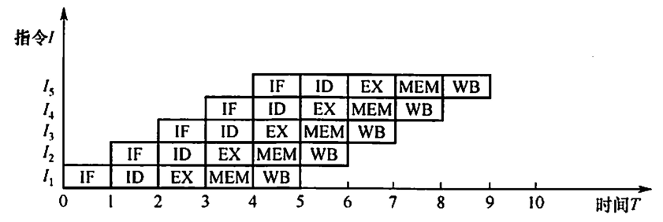
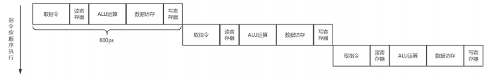
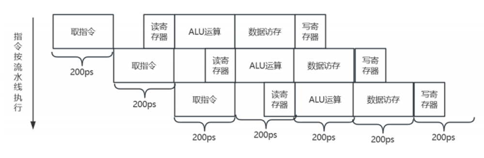

# 流水线技术
**流水线(pipelining)** 技术是一种在处理器设计和其他领域中广泛采用的并行处理技术,其核心思想是在程序执行期间, 通过将指令处理过程分解为多个连续的阶段(如取指、译码、执行、访存和写回等), 使得多条指令能够在不同阶段上同时执行, 尽管每个单独的指令仍然按照顺序完成这些阶段。这种重叠执行的方式显著提高了处理器的吞吐量和效率,允许在一个时钟周期内启动多条指令的不同部分,从而加速了整体的计算过程。

可从两方面提高处理机的并行性:

1. 时间上的并行技术, 将一个任务分解为几个不同的子阶段, 每个子阶段在不同的功能部件上并行执行, 以便在同一时刻能够同时执行多个任务, 进而提升系统性能, 这种方法被称为**流水线技术**。

2. 空间上的并行技术, 在一个处理机内设置多个执行相同任务的功能部件, 并让这些功能部件并行工作, 这样的处理机被称为**超标量处理机**。

比如在餐厅中, 顾客点餐到用餐完毕的整个过程可以看作是一条指令的执行。而餐厅的厨房和服务员们则构成了流水线的各个阶段:

1. **取指阶段(点餐)**: 顾客坐下后, 服务员会前来询问顾客想要点什么菜。这相当于指令的取指阶段, 服务员记录下顾客的点餐要求。

2. **译码阶段(下单)**: 服务员将顾客的点餐要求传达给厨房, 并告诉厨房哪些菜需要准备。这类似于指令的译码阶段, 将顾客的点餐要求转化为具体的烹饪指令。

3. **执行阶段(烹饪)**: 厨房接收到指令后, 开始准备各种食材并进行烹饪。这相当于指令的执行阶段, 厨房按照烹饪指令完成菜肴的制作。

4. **访存阶段(取料)**: 在烹饪过程中, 厨师可能需要从冰箱或储物柜中取出一些食材。这类似于指令的访存阶段, 从内存中获取数据或指令。

5. **写回阶段(上菜)**: 当菜肴制作完成后, 服务员将其送到顾客的桌子上。这相当于指令的写回阶段, 将执行结果返回给顾客(即指令的发起者)。

一条指令的执行过程可分解为若干阶段, 每个阶段由相应的功能部件完成。如果将各阶段视为相应的流水段, 则指令的执行过程就构成了一条指令流水线。

同样地, 在计算机处理器中, 流水线技术使得处理器可以同时处理多条指令的不同阶段, 从而提高了处理器的吞吐量和执行效率。这种并行处理的方式大大提高了计算机的性能, 使得我们能够更快地完成任务和处理数据。

流水线技术不仅限于CPU设计, 在现代计算机体系结构中, 它还应用于图形处理器(GPU)的渲染流水线、内存系统、网络设备的数据包处理以及其他需要高效并行处理的场景。此外, 流水线技术的概念也扩展到了软件工程和数据分析中, 比如 **持续集成/持续部署(CI/CD)** 流程以及数据流水线, 这些应用帮助快速处理大量数据或任务, 提高开发和分析的效率。

随着技术的进步, 现代处理器的流水线可能包含更多的阶段, 并且引入了更复杂的机制来处理指令间的依赖关系、分支预测、以及乱序执行等问题, 以进一步提升性能。同时, 针对特定领域的应用(如深度学习加速器)也会设计定制化的流水线架构以优化特定类型的工作负载。

## 基本的指令处理步骤
计算机实际处理指令的一个基本的步骤: 取指、译码、执行、访存和写回。

> [!TIP]
> 注: 这个划分不是唯一的, 不同的架构 不同的教材可能有不同的划分, 要灵活处理。

1. [IF]**从指令存储器中读取指令(取指Fetch)**: 这是流水线的第一步, 处理器从内存中读取下一条指令, 并将其送入指令寄存器。在MIIPS中, 这通常伴随着PC(程序计数器)的自动递增, 以便指向下一个指令的位置。

2. [ID]**指令译码的同时读取寄存器(译码Decode+部分执行Execute准备)**: MIPS架构设计允许在译码指令的同时访问寄存器以读取操作数。这意味着在确定了指令的操作码和操作数之后, 可以立即开始从寄存器文件中读取源操作数, 这个过程可以与译码并行进行。虽然这里将读寄存器归入译码阶段, 实际的处理器设计可能会将此步骤稍微细化, 作为执行阶段的前期准备工作。

3. [EX]**执行操作或计算地址(执行Execute)**: 在这一阶段, 根据指令类型进行实际的运算(如加法、逻辑运算)或计算内存访问的地址(对于load/store指令)。例如, 对于add指令, 会在这一阶段执行寄存器内容的加法运算。

4. [MEM]**从数据存储器中读取操作数(访存 Memory Access)**: 对于`lw`(Load Word)之类的指令, 这一阶段涉及从数据存储器(内存)中读取数据。计算出的有效地址在上一阶段得出, 现在根据这个地址读取数据并准备将数据送回处理器。

5. [WB]**将结果写回寄存器(写回Write Back)**: 最后, 计算或读取的结果被写入目的寄存器, 完成指令的执行。对于存储指令(如`sw`Store Word), 则是将寄存器中的数据写入内存。对于条件转移指令(如beq), 这一阶段可能涉及根据比较结果更新PC。

通过流水线技术, 这些步骤可以在不同指令间重叠执行。

| ##container## |
|:--:|
||
|一个5段指令流水线|

## 创建流水线结构
为了使问题具体化, 我们首先创建一个流水线结构, 用我们接触过的8条指令(lw, sw, add, sub,AND, OR, slt, beq)去对应我们的各个阶段。

基于提供的指令集(lw, sw, add, sub, AND, OR, slt, beq), 我们可以将其划分为取指(Fetch)、译码(Decode)、执行(Execute)、访存(Memory Access)和写回(Write Back)。请注意, 实际处理器的流水线可能更加复杂, 包括更多预取、分支预测等高级功能, 但这里我们专注于基础概念。

流水线设计的原则是: ~~(考研有考过)~~

- <span style="color:red">指令流水`段个数`以 **最复杂** 指令所用的功能`段个数`为准;</span>
- <span style="color:red">`流水段的长度`(即一段花费的时间)以 **最复杂** 的操作所花`时间`为准。</span>

1. **取指(Instruction Fetch,IF)**:
    
    在这一阶段, 处理器从内存中读取下一条指令。通常, 处理器会有一个程序计数器(PC), 它指向当前正在执行指令的下一条指令的地址。处理器根据PC的值从内存中取出指令, 并将其放入指令缓存或队列中准备解码。

    - **功能**: 从内存中读取下一条指令。
    - **对于各指令**: 所有指令都需要从内存中取出, 因此这一阶段对所有指令都是相同的。

2. **译码/寄存器读取(InstructionDecode/RegisterFetch,ID)**:
    
    处理器在这一阶段对取指阶段获取的指令进行解码, 确定指令的操作类型(如加法、减法、跳转等)、操作数以及目标寄存器。同时, 如果指令需要用到寄存器中的数据, 这一阶段还会从寄存器文件中读取这些数据作为操作数。

    - **功能**: 解析取出的指令, 确定操作类型、操作数等信息。
    - **对于各指令**: 
        - **lw, sw**: 需要识别内存地址和寄存器。
        - **add, sub, AND, OR, slt**: 识别操作数寄存器和目标寄存器。
        - **beq**: 识别两个比较寄存器和分支地址。

3. **执行(Execution, EX)**:

    根据指令的操作类型, 实际的运算在这个阶段执行。例如, 如果是加法指令, ALU(算术逻辑单元)会执行加法运算。如果指令包含条件转移或逻辑运算, 相应的逻辑处理也会在此阶段完成。

    - **功能**: 根据指令执行相应的算术逻辑运算。
    - **对于各指令**: 
        - **lw, sw**: 无直接运算, 跳过或准备访存阶段的地址计算。
        - **add, sub, AND, OR, slt**: 执行相应的运算。
        - **beq**: 比较两个寄存器值, 决定是否分支。

4. **存储器访问(MemoryAccess,MEM)**:

    如果指令涉及内存访问, 比如加载(LOAD)或存储(STORE)操作, 这一阶段会与内存交互。对于LOAD指令, 从内存中读取数据；对于STORE指令, 则是将数据写入内存。并非所有指令都需要这一阶段, 比如纯粹的寄存器到寄存器操作就不需要访问内存。

    - **功能**: 对于涉及内存访问的指令(lw,sw), 进行读/写操作。
    - **对于各指令**: 
        - **lw**: 从内存读取数据到寄存器。
        - **sw**: 将寄存器数据写入内存。
        - **其余指令**: 无需访问内存, 直接跳到写回阶段或等待前一阶段的结果。

5. **写回(WriteBack,WB)**:

    在最后一个阶段, 计算或加载得到的结果会被写回到寄存器文件中, 或者在某些情况下(如STORE指令执行后), 确认数据已正确写入内存。这个阶段标志着指令执行的完成, 之后处理器可以开始处理下一条指令。

    - **功能**: 将执行或访存阶段的结果写入寄存器或更新PC(对于分支指令)。
    - **对于各指令**: 
        - **lw, add, sub, AND, OR, slt**: 将计算结果写入指定寄存器。
        - **sw**: 此时内存操作已完成, 无须写回(在M阶段已处理)。
        - **beq**: 根据比较结果更新程序计数器(PC), 实现分支跳转。

## 流水线的性能
我们为了比较流水线指令执行与单周期指令执行的平均执行时间, 首先需要确定在单周期模型中时钟周期的长度, 然后计算在流水线模型下指令的平均执行时间。

在**单周期模型**中, `所有指令的执行都花费一个时钟周期`。因此, **时钟周期的长度必须是最慢操作所需的时间**, 即存储器访问和ALU操作中的较大者, 因为它们**不能直接并行执行**。

```text
注意区分:

单周期模型: 时钟周期 = 指令周期

流水线: 时钟周期 = 指令的一个阶段的周期 (机器周期)
```

假设, 我们的时间规定为:

- 存储器访问: 200ps
- ALU操作: 200ps
- 寄存器堆的读写: 100ps

我们来看, 每一条指令执行的时候所需要的时间:

|指令类型|取指令|读寄存器|ALU操作|数据存取|写寄存器|总时间|
|:-:|:-:|:-:|:-:|:-:|:-:|:-:|
|取字lw|200|100|200|200|100|800|
|存字sw|200|100|200|200||700|
|R型指令|200|100|200||100|600|
|分支beq|200|100|200|||500|

假设所有的操作, 如多选器, 控制单元没有时延的前提下, 这个就是我们的总时间。也就是说。单周期下, 我们的执行顺序是:

| ##container## |
|:--:|
||

如果使用流水线, 我们的执行方式就变成了:

| ##container## |
|:--:|
||

这种情况下, 我们流水线下的单周期能缩短到200ps, 性能提高的四倍。第一与第四条指令之间的时间差距缩短为 3 * 200ps =600ps 。单周期下, 执行第四条指令的话, 我们需要2400ps的时间。

流水线的性能加速比: $$指令执行时间(流水线) = \frac{指令执行时间(非流水线)}{流水线级数}$$ 在理想情况且有大量指令的情况下, 流水线所带来的加速比与流水线的级数近似相同。 例如一个5级流水线能获得的加速比接近于5。当然, 这是在理想状况下。

理想情况下, 如果流水线的各个阶段完美平衡, 且**没有流水线冲突**(比如数据冒险、结构冒险、控制冒险等导致的停顿 既流水线填充和排空的时间, 以及可能存在的数据相关性和分支预测错误等因素后面我们会讲这些开销问题), 那么理论上确实可以通过增加流水线级数来提高执行效率。但是, 提到的“加速比接近于流水线级数”是指在长时间运行大量指令的前提下的**平均加速效果**, 而**非单个指令的加速比**。

具体来说, 对于一个5级流水线, 在理想情况下, 一旦流水线填满(即经过了最初的5个时钟周期后), 之后理论上每周期可以完成一条指令。相比非流水线操作(如果非流水线每条指令执行时间为5个时钟周期), 流水线的优势在大量指令执行时体现为: 
- 非流水线执行 $n$ 条指令需要 $5n$ 个时钟周期。

- 流水线在度过初期的5个空周期后, 之后每条指令只需要1个时钟周期, 因此n条指令需要 $5+(n-1)$ 个时钟周期。

在这种理想化的分析中, 加速比 $S$ 可以通过总时钟周期比来计算: $$S≈\frac{指令执行时间(非流水线)}{流水线级数}=\frac{5n}{5 + (n - 1)}$$

当 $n$ 趋向于无穷大时, 加速比 $S$ 接近于流水线级数, 即 $S≈5$。

同时, 我们一直在强调, 是大量指令。

刚才的例子, 即使我们在前面的分析中断言能将指令的执行速度提高 4 倍, 但在本例中并没有反映出来, 它实际获得的加速比为 2 400ps/1 400ps, 这是因为执行指令的数量不够多。如果我们提高指令数量, 那么差异将会非常明显.

在流水线处理器中, 性能的提高主要是通过增加指令的吞吐率来实现的, 而不是通过减少单条指令的执行时间。当执行指令的数量足够多时, 流水线填充和排空的时间相对于整个执行时间来说变得微不足道, 因此流水线的性能加速比将趋近于流水线的级数。
这在实际应用中是非常重要的, 因为现代处理器通常都会执行数百万甚至数十亿条指令, 因此流水线的性能优势将非常明显。所以指令的吞吐率的提升至关重要, 使得系统能够更高效地完成任务。

## 面向流水线的指令集设计

MIPS指令集具有如下特点, 利于实现流水线:

1. **指令长度统一**: MIPS指令长度固定为32位(4字节), 这简化了取指(Fetch)和译码(Decode)阶段的设计。因为指令长度一致, 硬件设计者可以精确地安排何时从内存读取下一条指令, 而不必在指令边界上做复杂的判断, 这减少了流水线的复杂性和潜在的延迟

2. **指令格式的对称性**: MIPS指令集中的指令格式虽有几种, 但它们遵循一定的规律, 特别是源寄存器字段的位置固定。这意味着译码阶段可以快速确定操作数来源, 同时开始读取寄存器, 这有助于提高流水线的效率。非对称的指令格式会要求更复杂的译码逻辑, 可能需要额外的流水线阶段。

3. **存储器操作的明确分离**: MIPS指令集中, 存储器访问仅限于特定的指令(如lw和sw), 这使得流水线可以在执行阶段(执行ALU操作)和访存阶段(Memory Access)之间清晰地划分。这与x86等架构不同, 后者允许指令直接操作内存中的数据, 增加了设计上的复杂度, 可能需要更复杂的地址计算与数据访问流程。

4. **数据对齐要求**: MIPS要求数据在内存中对齐, 比如双字必须位于偶数地址, 这样保证了一次内存访问就能完整地读取或写入所需数据, 无需额外的对齐处理步骤, 这对于流水线的效率至关重要。避免了复杂的跨边界访问, 保持了流水线的连续性。

但是流水线指令执行过程中也可能出现的一些问题: 下一节: 流水线冒险
