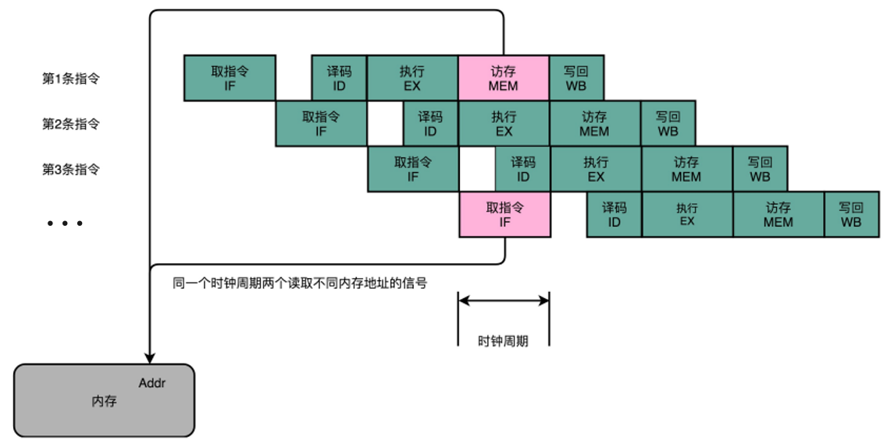
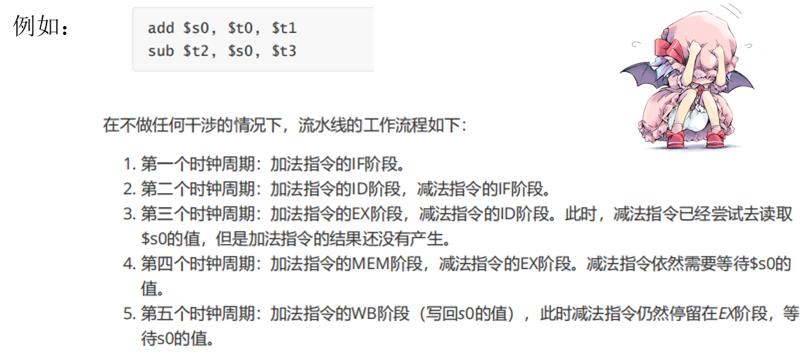
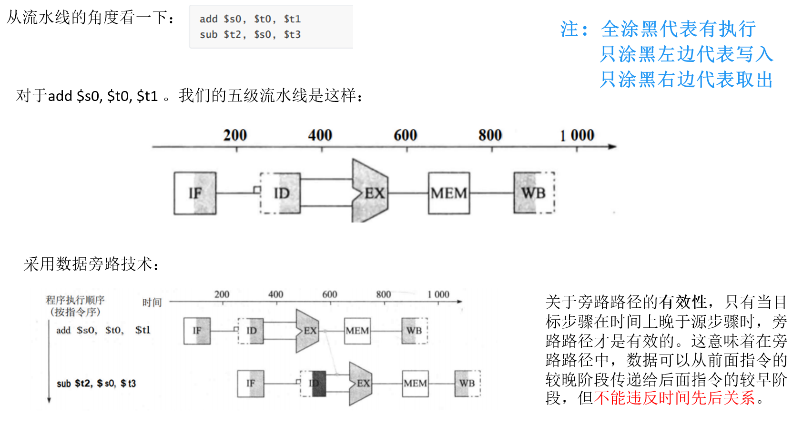
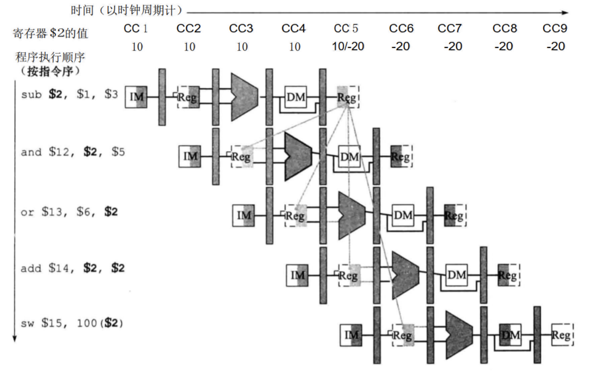
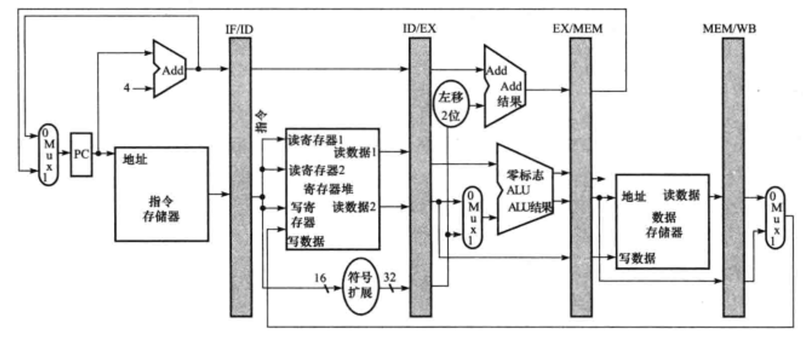
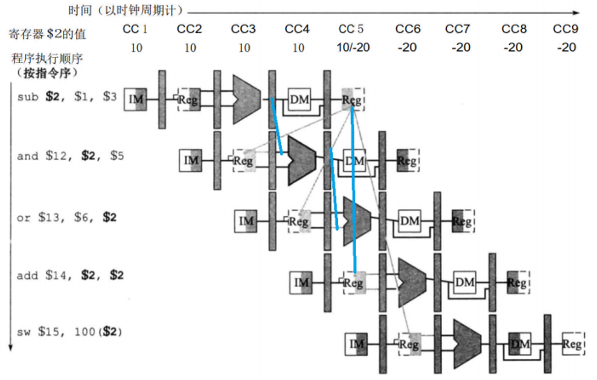
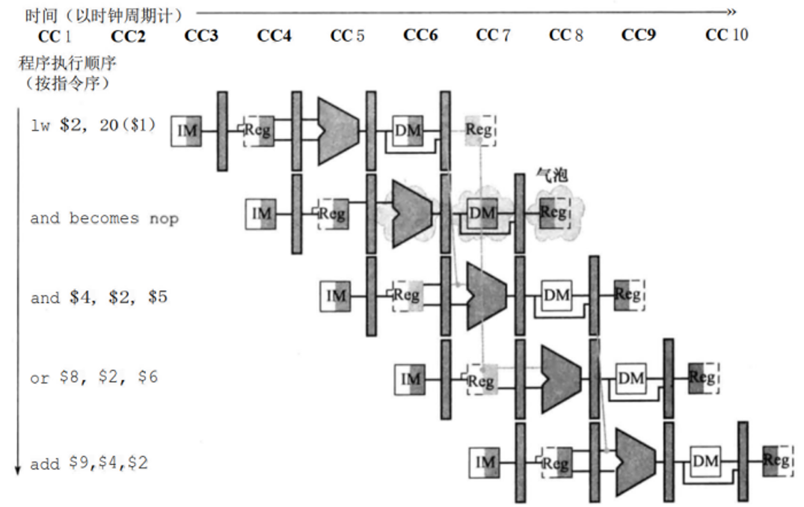
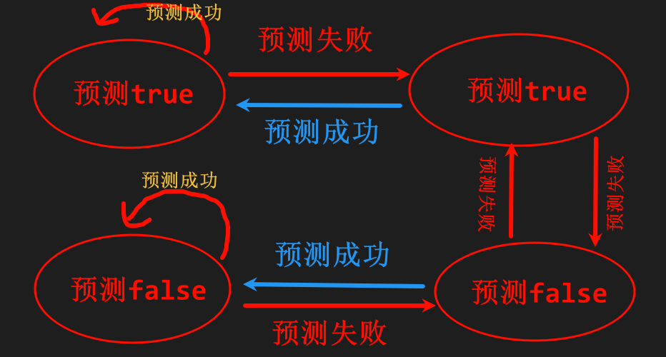

# 流水线冒险
**流水线冒险(Pipeline Hazards)** 是指在流水线处理器中, 当前级流水线的指令可能会阻止下一条连续指令在流水线中预期的时钟周期内执行的情况。这会引起流水线阻塞或停顿(stall), 导致流水线的性能下降, 降低流水化所带来的理想加速比。

流水线冒险主要分为三种类型:
- 结构冒险(Structural Hazards)、
- 数据冒险(DataHazards)、
- 控制冒险(Control Hazards)。

以下分别介绍其原因和对策。

## 结构冒险(资源冲突)
当<span style="color:red">**硬件资源**不足以支持多条指令在同一时钟周期内并行执行时</span>, 会发生**结构冒险**, 也称为**硬件资源冲突**。

比如, 如果MIPS流水线设计只使用了一个存储器来同时处理指令预取(IF阶段)和数据存取(MEM阶段), 那么当指令预取和数据存取尝试在**同一时钟周期内访问存储器**时, 就会发生结构冒险。这是因为存储器在同一时间只能进行一个操作(读取指令或读写数据)。

| ##container## |
|:--:|
||

解决方案:

MIPS(以及许多其他处理器架构)采用了**分离的程序存储器和数据存储器**。这意味着指令预取(IF阶段)从程序存储器(通常是高速缓存)中读取指令, 而数据存取(MEM阶段)从数据存储器(如主存或数据高速缓存)中读写数据。这两个存储器可以独立工作, 从而避免了结构冒险。(即`有钱堆硬件`)

或者, 前一指令访存时, 使**后一条**冲突的指令(及其后续指令)**暂停延后一个周期**。

我们还有其他的方法, 比如
- **资源分配逻辑**: 通过复杂的资源分配逻辑来调度和管理不同指令对共享硬件资源的使用, 确保在任何给定时刻不会有冲突发生。

- **重排序缓冲区**: 在更高级的设计中, 可能会使用重排序缓冲区来临时存放结果, 直到所有依赖项准备好, 以此来缓解资源竞争。

通过这些设计策略, MIPS和其他现代处理器架构能够有效地减少甚至消除结构冒险, 保证流水线的顺畅执行, 从而提升处理器的性能和效率。

## 数据冒险(数据冲突) 
**数据冒险** 是流水线处理器中一种常见的冒险情况, 它发生在**当前指令**需要**等待之前指令的结果**才能继续执行时。这通常是因为当前指令的操作数(即源操作数)是之前某条指令的目标操作数(即目的操作数)。

在流水线处理器中, 指令是按照一定的顺序在流水线的不同阶段中并行执行的。如果后一条指令依赖于前一条指令的结果, 而前一条指令的结果尚未产生(或尚未写入到目标位置), 那么后一条指令的执行就会受到阻碍, 从而导致流水线暂停或“停顿”(stall)。这种数据冒险也称为“写后读”(RAW)

| ##container## |
|:--:|
||

在这个例子中, 流水线在第三个、第四个和第五个时钟周期中对于减法指令来说是无效的, 因为它在等待加法指令的结果。这浪费了三个时钟周期。

为了解决这种数据冒险问题, 现代处理器使用了多种技术, 其中之一就是**数据前递**(也称为`数据旁路`或数据前推)。

这种方法允许在指令的正式写回寄存器之前, 其产生的数据被后续指令直接使用。在我们给出的例子中, 一旦ALU完成了加法运算并产生了结果, 这个结果可以直接“前递”给接下来需要它的减法指令, 而无需等待加法结果完全写回到寄存器`$s0`中。

数据前递的工作流程大致如下:
1. **检测冒险**: 处理器的控制单元监测到即将发生的RAW(Read-After-Write)数据冒险, 即下一个指令依赖于前一个指令还未完成的计算结果。

2. **数据准备**: 当加法指令在执行阶段或者更早的适合阶段产生结果时, 这个结果被临时保存, 并准备好前递。

3. **前递执行**: 在减法指令的执行阶段, 而不是等待`$s0`寄存器更新, 处理器直接从前递路径获取加法的结果, 并用于减法运算的输入, 从而避免了流水线停滞。

4. **正式写回(可选顺序)**: 加法的结果可能在减法指令利用它之后或者同时写回到`$s0`寄存器中, 具体依处理器设计而异。

通过数据前递技术, **处理器能够减少因数据冒险导致的流水线停顿**, 提高了指令执行的并行度和整体效率。这是现代处理器设计中非常关键的一项优化技术, 对于保持高性能计算至关重要。

| ##container## |
|:--:|
||

尽管旁路可以改善流水线性能, 但它<span style="color:yellow">仍然不能完全避免流水线阻塞</span>的问题。

例如, 如果第一条指令是装载(lw)指令, 那么它需要从存储器中读取数据, 这会导致数据依赖问题, 因为装载指令的执行阶段(EX)比下一条指令的译码/寄存器读取阶段(ID)晚, 所以无法实现旁路, 从而导致流水线阻塞。

| ##container## |
|:--:|
||

尽管使用了旁路(Forwarding)机制, 但在`lw`指令的MEM阶段(即数据从内存加载到寄存器)之前, `sub`指令无法使用`$s0`中的数据。因此, 流水线不得不阻塞一个或多个步骤, 等待`lw`指令完成其MEM阶段并将数据写入`$s0`。这种阻塞在流水线中形成了一个“气泡”(Bubble), 表示在该步骤中没有有效的指令执行。

(在硬件上采取措施,使相关指令延迟执行, 通过 **硬件阻塞(stall)** 方式阻止后续指令执行。这种硬件阻塞的方式称为“插人气泡”)

所以, 在遇到 **取数-使用型数据冒险(load-use data hazard)** 时, 即使采用了旁路机制, 流水线也不得不阻塞一个或多个步骤来等待数据准备好。这是因为<span style="color:yellow">从存储器访问的输出到执行级的输入之间的路径在时间上必须是`顺序`的, 而不是倒着的。</span>为了避免这种情况, 处理器通常会采用硬件和软件的解决方案, 例如硬件的转发机制和软件的指令重新排序。

---

前面我们讲了四个指令集的设计原则, 从旁路(Bypassing)机制中, 我们可以引申出MIPS体系结构指令集的另一个重要设计原则: 每条MIPS指令**最多只写一个结果**, 并且在流水线的**最后一级**执行。

这个原则是基于流水线处理中数据依赖和冒险的考虑。在流水线处理中, 如果一条指令需要等待前一条指令的结果才能继续执行(即存在数据依赖), 那么流水线就会阻塞, 导致性能下降。为了避免这种情况, MIPS指令集设计确保每条指令最多只写一个结果, 并且这个写操作发生在流水线的最后一级(即写回阶段)

这样做的好处是:
1. 简化旁路设计
2. 减少数据冒险
3. 提高指令并行性

综合来看, 数据冒险主要有以下几种类型:

1. 【常见】**写后读冒险(RAW, Read-After-WriteHazard)**: 这是最常见的数据冒险类型, 即后继指令需要读取一个寄存器的值, 而这个寄存器正好是先行指令即将写入的。例如, 如果指令2需要使用指令1计算后写入寄存器R1的值, 但在指令1的写回操作完成前, 指令2就开始读取R1, 就会发生RAW冒险。

2. **读后写冒险(WAR,Write-After-ReadHazard)**: 虽然在大多数现代处理器设计中不太常见, 这种冒险发生在当一条指令尝试写入一个寄存器, 而之前另一条指令已经读取了这个寄存器的值。理论上, 这不会影响计算结果, 但在某些特定设计中可能需要处理以保持一致性。

3. **写后写冒险(WAW, Write-After-WriteHazard)**: 当两条指令尝试写入同一个寄存器, 且后写的指令不关心前一个写入的值时, 这通常需要处理器确保写操作的顺序以维护数据的一致性。

至此, 我们已经看到了数据冒险是什么样子。现在, 我们再来看一个实际程序中的情况。

```MIPS
sub $2, $1, $3
and $12, $2, $5
or $13, $6, $2
add $14, $2, $2
sw $15, 100($2)
```

如果`$2`初始值为`10`, `$1`的值为`30`, 则执行后`$2`的值变为`-20`。后续指令在执行时都会看到这个值, 也就是都依赖于第一步产生的`-20`, 这个指令在流水线中是如何执行的呢?

| ##container## |
|:--:|
||

其中, 中间这些类似隔板一样的东西是流水线寄存器, 即:

| ##container## |
|:--:|
||

在流水化处理器中, 如果要将中间结果从一级传送到另外一级, 而源寄存器与目标地址可能并非直接相邻, 这时候就是流水线寄存器发挥作用的时候了。例如: 要在存储指令中存储的寄存器值是在ID期间进行读取的, 但要等到MEM才会真正用到; 他在MEM级中通过两个流水线寄存器传送到数据寄存器。于此类似, ALU指令的结果是在EX期间计算的, 但要等到WB才会实际存储; 

所以有必要对每个寄存器进行命名, 称为: IF/ID, ID/EX, EX/MEM, MEM/WB。

**同一时间读写**:

这里还有一个潜在的问题, 就是`add`的第五个周期, <span style="color:red">当一个寄存器在同一时钟周期内同时读和写时</span>会发生什么呢？理论上如果寄存器`写操作`安排在时钟周期的`前半段`完成, 而`读操作`紧接着在同一个时钟周期的`后半段`进行, 可以确保读操作能获取到最新的写入值, 从而避免了数据(和结构)冒险。

为了实现这种设计, 通常涉及到以下几点关键实现:
1. 寄存器更新的时机
2. 寄存器的多端口设计 (结构冒险)
3. 旁路技术的补充
4. 控制逻辑的复杂性

### 冒险检测: 流水线寄存器
一种用于精确描述处理器流水线中数据冒险条件的技术是流水线寄存器。它利用流水线寄存器的特定字段来识别和解决潜在的数据相关性问题。这种表述方式有助于深入理解和分析处理器流水线的内部工作原理, 特别是在设计含有复杂控制逻辑和数据依赖关系的现代处理器时。就类似写`if..else`一样, 我们把条件整理好。这样他在运行的时候就可以进行检测了。

有哪些条件呢？

| ##container## |
|:--:|
||

冒险条件:
1. `EX/MEM`.Register`Rd` = `ID/EX`.Register`Rs`

    `EX/MEM`.Register`Rd` = `ID/EX`.Register`Rt`

2. `MEM/WB`.Register`Rd` = `ID/EX`.Register`Rs`

    `MEM/WB`.Register`Rd` = `ID/EX`.Register`Rt`

其实本质上就对应了我们之前说过的那几种数据冒险的方式。

说回我们刚才得例子, 在这个例子中, `sub $2,$1,$3`指令的结果将在完成计算后被存储在寄存器`$2`中, 而`and $12,$2,$5`指令需要读取寄存器`$2`作为其一个操作数。
当`sub $2,$1,$3`指令处于 MEM 阶段(准备将其结果写回寄存器`$2`)时, `and $12,$2,$5`指令可能正处于 EX阶段(准备读取寄存器$2)。如果流水线继续不进行任何处理, 那么`and`指令可能会读取到`$2`寄存器的一个旧值(如果`$2`在此之前被其他指令写过), 而不是`sub`指令刚刚计算出
的新值。

所以, 对于这个冒险的检测就是`EX/MEM.RegisterRd = ID/EX.RegisterRt = $2`。

进一步优化和补充

虽然我们已经看过了这么多数据冒险和检测方法, 但是, 直接采用总是旁路的方式解决冒险是不正确的, 因为某些指令可能不写回寄存器, 就会产生一些不必要的旁路。一种简单的解决方法是检测`RegWrite`信号是否是活动的, 即通过检测流水线寄存器在 EX 和 MEM 级的 WB 控制字段以确定`RegWrite`是否被有效。

**特殊处理0寄存器**: 在MIPS架构中, 寄存器0始终被硬件保持为0, 任何对0的写操作都会被忽略, 而读取0总是返回0。因此, 当指令的目标寄存器是0时(例如, sll $0, $1,2), 即使存在看似可能的数据冒险, 实际上也无需旁路, 因为0的值永远不会改变。所以在设计旁路逻辑时, 需要加入额外的检查条件, 确保目标寄存器不是0。即在判断冒险条件时, 除了原有的寄存器匹配条件外, 还应增加`𝐸𝑋/𝑀𝐸𝑀.𝑅𝑒𝑔𝑖𝑠𝑡𝑒𝑟𝑅𝑑 ≠ 0`和`𝑀𝐸𝑀/𝑊𝐵.𝑅𝑒𝑔𝑖𝑠𝑡𝑒𝑟𝑅𝑑 ≠ 0`这样的条件, 以排除些目标寄存器为`0`。

> 如果(Ex/MEM.RegisterRd==ID/EX.RegisterRs)并且(EX/MEM.RegWrite是活动的)并且(EX/MEM.RegisterRd ≠ 0)则进行旁路操作, 将 EX 阶段的结果传递给ID/EX 阶段的指令

这样, 我们的处理器的冒险解决机制变得更加精确和高效, 既避免了不必要的资源浪费, 也确保了程序执行的正确性。

至此, 我们介绍了检测冒险的方法, 问题已经解决了一半, 但仍然需要解决旁路数据策略的问题。

| ##container## |
|:--:|
||

蓝线部分描述了流水线寄存器和ALU输入之间的一个相关性。这里的相关性开始于一个流
水线寄存器而不是等待 WB 级写操作的寄存器堆。由于流水线寄存器保存了需要旁路的数据, 因此后面的指令能够获得相应的数据。

如果可以从任何流水线寄存器而不仅仅从 ID/EX 中得到 ALU 的输入, 那么就可以旁路所需的数据。通过在 ALU 的输入中加入多选器和正确的控制策略, 就可以在存在相关性的情况下仍然能够全速运行流水线。

在遇到 **取数-使用型数据冒险(load-use data hazard)** 时, 即使采用了旁路机制, 流水线也**不得不**阻塞一个或多个步骤来等待数据准备好。

例如:
```MIPS
LOAD R1, [address] # 第一条指令, 从内存地址adress处加载数据到寄存器R1
ADD R2, R1, R3     # 第二条指令, R1 + R3 存入 R2
```

假设我们是先load, 在执行其他操作。由于装载指令和紧随其后的指令之间的相关性在时间上是回溯的, 这种冒险**不可能**通过旁路来解决。(前面在时间上是不回溯的。也就是时间是按顺序来的 所以可以使用旁路)。必须采用相应的机制阻塞流水线 。

对于此类冒险的检测和阻塞处理: 
1. **位置与作用**: 冒险检测单元位于流水线的1D(Decode/Decode)级, 即在译码阶段。它的主要职责是在指令进入执行阶段之前, 检查并预测潜在的数据冒险, 特别是载入冒险。

2. **检测条件**:
    - **装载指令检测**: 首先确认当前译码阶段(ID)的指令是否涉及内存读取操作, 即是否为装载指令(LOAD)。

    - **目的寄存器匹配**: 检查译码阶段(ID)的装载指令目的寄存器(RegisterRt)与指令fetch/decode阶段(IF/ID)的指令源寄存器(RegisterRs或RegisterRt)是否相同或重叠。这表明了后一条指令依赖于前一条装载指令的结果。

3. **阻塞操作**: 一旦检测到上述条件满足, 即存在载入冒险, 冒险检测单元会触发流水线的阻塞机制。这意味着在译码阶段(ID)的指令会被暂停一个时钟周期, 同时为了保持指令序列的完整性, 指令fetch阶段(IF)也需要暂停, 以避免指令丢失。

4. **流水线的"空转"**: 阻塞期间, 从执行(EX)阶段到后续的流水线段(如内存访问MEM、写回WB)会执行**空指令(NOP)**, 确保这些阶段不会对数据或程序状态造成意外改变。

当然, 这种阻塞也有明显的缺点和优点:

- **PC与流水线寄存器保持不变**: 为了维持指令的连续性, 程序计数器(PC)和IF/ID流水线寄存器的值不会更新, 确保在解除阻塞后, 能够正确恢复执行流。

- **性能影响**: 虽然阻塞机制保证了数据的正确性, 但它会引入额外的延迟, 降低处理器的吞吐量。因此, 在高性能处理器设计中, 通常还会考虑其他优化手段, 如数据转发或更复杂的预测逻辑, 来减少阻塞的频率和影响。

那我们怎么在流水线中插入空指令(就像气泡一样)呢?

在流水线处理器中插入空指令(或称为“气泡”)来处理数据冒险或流水线冲突的一种方法是, 通过控制逻辑来暂时停止流水线中某些阶段的执行。即当在ID阶段识别到冒险(比如数据冒险)时, `流水线控制器可以将ID/EX边界的EX、MEM和WB阶段的控制信号置为0`, 从而在流水线中创建一个“气泡”。

| ##container## |
|:--:|
||

创建一个“气泡”的具体步骤:
1. 冒险识别阶段(ID级): 冒险检测单元
2. 控制信号置零: 设置气泡
3. 气泡的传播: 前移气泡
4. 流水线行为: 空转阶段
5. 资源管理: 避免副作用
6. 性能考量: 效率牺牲

### 总结
数据冒险: RAW  WAR  WAW

解决: 数据旁路

冒险检测: 流水线寄存器

取数-使用型数据冒险: 只好加气泡解决

## 控制冒险(控制冲突)

**控制冒险(Control Hazard)**, 是流水线处理器中的另一种重要挑战, 它发生在处
理器需要根据某条指令的结果(通常是分支或跳转指令的结果)来决定下一步执行哪条指令时, 而这时后续指令已经被预取并开始在流水线中前进。

简而言之, 就是处理器在**未确定实际执行路径前**, 已经**提前取了可能是错误路径上的指令**进入流水线。

```MIPS
beq $s0, $s1, target_label # if $s0 == $s1: goto target_label
add $t0, $t1, $t2
```

具体来说, 控制冒险通常与以下几种情况相关:
1. **条件分支**: 当处理器遇到条件分支指令时, 它需要先计算条件表达式的真假, 然后决定是否跳转。在计算完成前, 流水线可能已经取了分支后的指令, 如果分支被最终评估为需要跳转, 则这些指令实际上不应该被执行。

2. **间接跳转**: 间接跳转(如通过寄存器内容决定跳转地址)也会引发控制冒险, 因为目标地址直到执行阶段计算完成前都是未知的。

3. **异常和中断**: 某些指令执行期间可能触发异常或中断, 这也需要改变正常的指令流, 而此时后续指令可能已在流水线中。

### 解决方案
1. **取分支指令后立即阻塞流水线**, 直到流水线确定分支指令的结果并知道下一条真正要执行的指令在哪为止。

2. **分支预测(Branch Prediction)技术**: 分支预测的基本思想是在分支指令的结果实际计算出来之前, 先预测它将采取哪条路径(即是否跳转), 然后提前取指并执行预测路径上的指令。如果预测正确, 那么流水线就可以保持连续运行, 从而避免阻塞；如果预测错误, 那么就需要采取一些措施来恢复流水线的正确状态, 如撤销已经执行的错误指令、刷新流水线等。

3. **延迟分支**: "延迟分支"(Delayed Branch)是一种处理控制冒险的技术, 它通过在实际执行分支指令之前先行执行一条或多条不受分支结果影响的指令来减少流水线停顿。在MIPS体系结构中, 这种技术的实现是通过编译器的支持来完成的, 确保了对程序员的透明性。

### 分支预测—静态分支预测
分支预测技术中的一种最基本形式, 称为**静态不分支预测(Static Not-Taken Prediction)**, 或者简称**不带预测的执行**。这种方法假定所有的条件分支都不会发生(即**默认程序会顺序执行**), 因此在遇到分支指令时, 处理器不等待分支条件的评估结果, 而是直接继续预取和执行后续的指令。

当这种预测正确, 即分支确实未发生时, 流水线可以不间断地执行, 保持最大效率。然而, 如果预测错误(分支实际发生了), 处理器就需要采取措施来修正错误的预测, 这通常涉及到以下步骤:
1. **流水线清空**: 已经错误地取出和开始执行的后续指令需要被取消或丢弃。
2. **更新状态**: 处理器回到分支指令的位置, 重新评估分支条件。
3. **重新取指与执行**: 从正确的分支目标地址开始重新取指令并执行。

一种更加成熟的分支预测 (branch prediction) 方法是预测一些分支发生而预测另一些分支不发生。即基于局部性的分支预测。循环体底部的分支预测是一个典型例子, 体现了循环展开和定向分支预测的思想

### 分支预测—动态分支预测
与基于固定模式或简单规则的静态预测不同, 动态预测器能够根据程序执行过程中每条分支指令的实际行为实时调整其预测策略, 从而在程序生命周期内不断优化预测准确性。

1. **历史记录的使用**: 动态预测器通常会维护一个或多个**分支历史表**(如分支历史寄存器、分支目标缓冲区BTB中的预测位、或更复杂的全局历史状态), 用来记录每个分支点过去的表现(即分支是否发生)。这些历史记录帮助预测器建立一个关于分支行为的模型, 基于此模型对未来分支结果进行预测。

2. **预测算法**: 动态预测器采用多种算法来利用这些历史记录, 常见的如**二元预测器**(根据最近几次分支是否发生来预测)、**饱和计数器**(使用多位计数器表示分支倾向)、以及更复杂的perceptron预测器(多层神经网络模型, 能捕捉更深层次的分支间相关性)等。这些算法随着历史记录的积累和更新, 逐渐调整预测策略, 以匹配当前程序的执行特征。

例如这个是`二元预测器`:

| ##container## |
|:--:|
||

好处:
1. **自适应性**: 动态预测器的精髓在于其自适应性, 即能够根据新获得的信息自我调整和优化。当预测正确时, 预测器会强化当前的预测模型；而预测错误时, 则会调整模型参数以期望在未来做出更准确的预测。

2. **错误预测的处理**: 当预测错误发生时, 处理器需要采取措施纠正错误预测的影响。这通常涉及流水线的刷新(flushing the pipeline), 即丢弃错误预测路径上已经开始执行但未完成的指令, 以及恢复到正确的执行路径, 从正确的分支目标地址开始重新填充流水线。这一过程会引入额外的延迟, 称为分支误测惩罚, 是动态预测器设计中需要权衡的关键因素之一。

3. **高正确率**: 随着技术的发展, 现代动态分支预测器通过采用更精细的历史记录和复杂的预测算法, 能够达到非常高的预测准确率, 90%甚至更高。这极大地减少了因控制冒险导致的流水线停顿, 提升了处理器的整体执行效率。

### 延迟分支
1. **编译器优化**: MIPS编译器在生成机器码时, 会自动分析和重排指令顺序, 使得分支指令之后紧跟的至少一条指令是与分支结果无关的, 即无论分支是否发生, 这条指令都需要执行。这样, 即使分支结果尚未确定, 这条"安全"指令也能在分支指令执行之前被提前取出并执行, 从而隐藏了分支带来的延迟。

2. **分支延迟隐藏**: 通过这种方式, 分支指令本身的延迟(例如, 用于计算分支条件和更新PC寄存器的时间)被隐藏, 因为在这段时间里, 流水线仍然在处理其他有用的指令。在给出的例子中, add指令如果与分支结果无关, 就可以被安排在分支指令之后执行, 使得流水线的前几个阶段在分支真正执行前保持忙碌。

3. **限制**: 延迟分支技术的有效性依赖于分支延迟时间较短。如果分支延迟超过了单个时钟周期这种方法就难以有效隐藏延迟, 因为流水线会被迫停顿等待分支结果。在这种情况下, 使用硬件分支预测器会更加合适, 因为它可以在分支指令真正执行之前就开始取指和执行后续指令, 即使这些指令可能基于错误的分支预测。

4. **与硬件分支预测的对比**: 硬件分支预测器通过预测分支结果并提前执行后续指令, 能够在更长的分支延迟情况下保持流水线的高效运转。虽然预测错误时会带来恢复成本, 但在多数应用程序中, 其总体效果仍然是积极的, 特别是在分支预测准确率高的情况下。

(简单地说就是, 既然我们预测可能失败, 然后会浪费部分已经执行的指令, 但是我们是否可以通过指令重排(没有数据冲突), 然后让即使执行的指令也是预先要执行的指令, 这样在不影响结果的情况下, 减小了预测失败带来的风险)

未优化前的代码示例:
```MIPS
add $t0, $s1, $s2     # 加法操作, 结果存入$t0
beq $s0, $zero, Label # 条件分支, 如果$s0等于$zero, 则跳转到Label
sub $t1, $s3, $s4     # 减法操作, 此操作可能会受到分支影响
Label:
mul $t2, $t0, $t1     # 乘法操作, 使用$t0和$t1的结果
```

在这个例子中,  beq 指令是一个分支指令, 它检查寄存器 s0 是否为0, 如果是, 则跳转到`Label`处继续执行。但是, 按照正常的流水线执行,  sub 指令会在分支结果确定之前就开始执行, 这可能导致错误的运算结果或者需要昂贵的流水线清除操作。

使用延迟分支技术优化:
```MIPS
beq $s0, $zero, Label # 先执行分支指令, 但不立即决定分支
add $t0, $s1, $s2     # 原先的加法操作移动到分支之后
sub $t1, $s3, $s4     # 这个减法操作在分支结果确定前执行, 且假设它不受分支影响
Label:
mul $t2, $t0, $t1     # 乘法操作
```

请注意, 这个例子简化了一些复杂性, 实际的MIPS处理器和编译器在应用延迟分支时会有更复杂的考虑, 包括但不限于指令调度、数据依赖性和预测失败时的恢复策略。