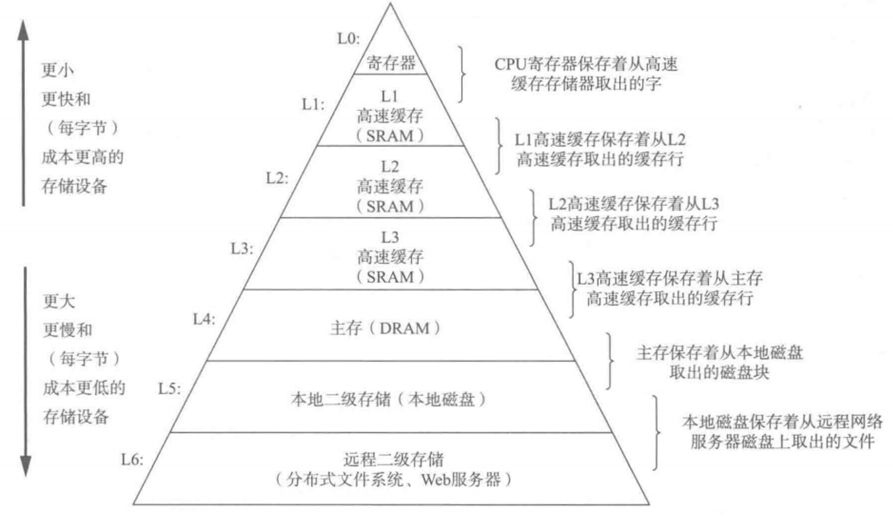
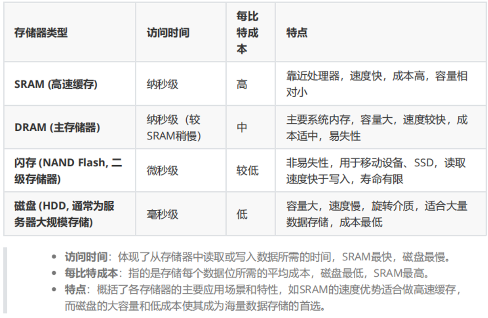
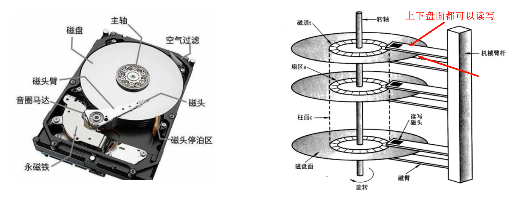
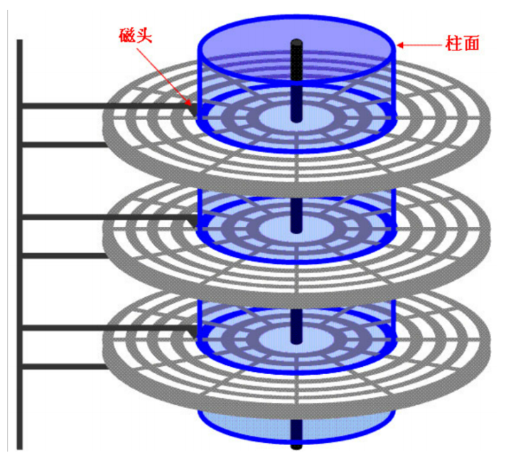
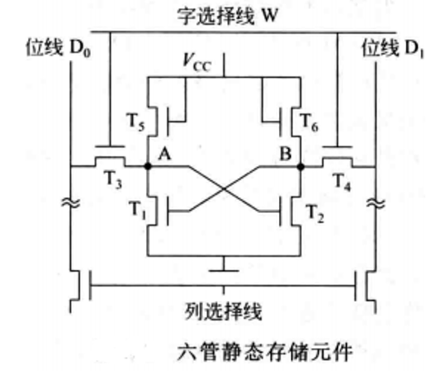
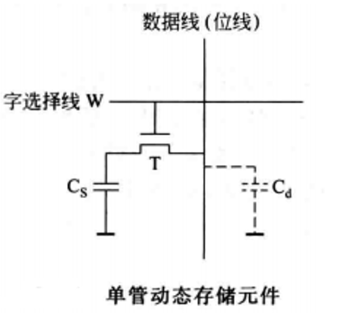
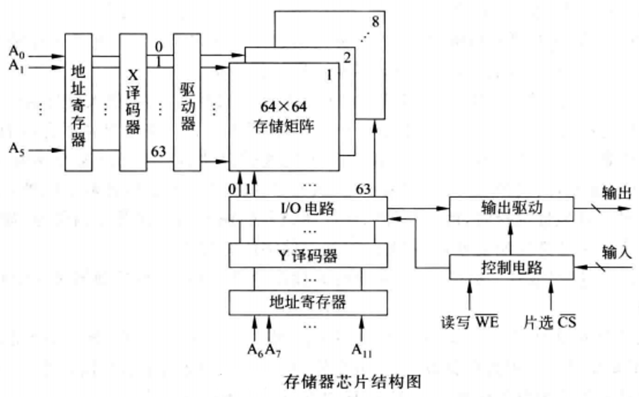
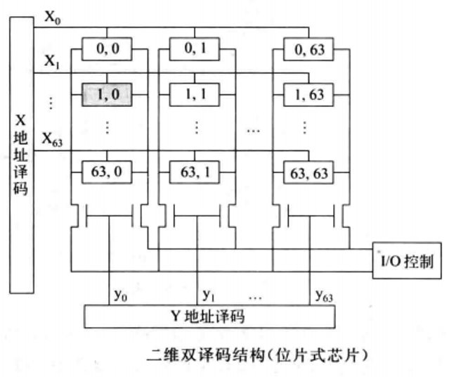

# 存储器技术
## 局部性原理
局部性原理是指CPU在访问存储器时, 无论是存取指令还是存取数据, 所访问的存储单元都趋于聚集在一个较小的连续区域中。即在任何时间内. 程序访问的只是地址空间相对较小的一部分内容。这种特性在程序执行时表现得尤为明显, 即程序在执行时倾向于引用临近于其他最近引用过的数据项的数据项, 或者最近引用过的数据项本身。

局部性原理主要分为两种类型: `时间局部性`和`空间局部性`。

**时间局部性**: 某个数据项在被访问之后可能很快被再次访问的特性, 即某个数据项在一个较短的时间间隔内很可能又被访问。

程序循环、堆栈等结构是产生时间局部性的主要原因。例如, 在循环语句中, 循环体内部的**指令和数据会被反复访问**, 因此它们的时间局部性很高。

**空间局部性**: 某个数据项在被访问之后, **与其地址相近的数据项可能很快被访问的特性**。

程序的指令大部分时间是顺序执行的, 而且程序的数据结构(如数组)是连续存放的。这种顺序执行和连续存放的特性使得空间局部性得以体现。

```C++
int sum = 0;
for (int i = 0; i < n; ++i)
    sum += arr[i];
```
在以上代码片段中, 对`sum`的访问具有良好的**时间局部性**, 对`arr`数组的访问具有良好的**空间局部性**。

存储器层次结构的设计正是基于局部性原理, 旨在平衡存储速度、容量和成本之间的矛盾, 以达到更高的系统性能。

基于这两个局部性原理, 现代计算机系统使用多级存储器来优化性能与成本的平衡。

## 存储器层次结构
存储器系统是一个具有不同容量, 成本和访问时间的存储设备的层次结构:

| ##container## |
|:--:|
||

## 块/行
无论数据如何分层, 数据的处理和交换过程都是两个层之间相互交换, 不可能跨层交换, 所以在描述的存储器层次结构中, "块"(Block)或"行"(Line)是数据传输的基本单位。

当数据从一个层次迁移到另一个层次时, 并不是以字节或者单个数据项为单位, 而是以固定大小的数据块进行。

这个设计选择主要是为了效率考虑: 虽然一次性移动较大块的数据可能会暂时占用更多带宽, 但它减少了管理和迁移数据所需的元数据开销, 整体上提高了系统的性能。

> <span style="margin-left: 30px;">例如, 当处理器需要访问某个内存地址的数据时, 首先会在最快的`L1 Cache`中查找。如果该数据不在`L1 Cache`中(称为**缓存未命中**), 系统会检查较慢但容量更大的`L2 Cache`, 依此类推, 直至主存。在这个过程中, 如果在某一层级找到所需数据, 不仅会将该数据块提供给处理器, 通常还会将与之相邻的数据块一同调入高速缓存(这种策略称为**预取**), 因为相邻的数据在未来很可能也会被访问到, 这样可以进一步优化未来的数据访问速度。</span>

块大小(即行长度)是一个重要的设计参数, 它影响着缓存的效率、命中率以及硬件复杂度。块大小的选择需要权衡多个因素, 包括程序访问模式、缓存大小、以及硬件设计的复杂性和成本。常见的块大小有32字节、64字节、128字节等, 具体大小根据不同的系统和应用需求而定。

在存储器层次结构中, **"命中"(Hit)** 指的是处理器请求的数据恰好存在于高速缓存(即高层存储器)中, 这意味着数据可以迅速获取, 无需访问更慢的下一层存储器, 从而显著减少数据访问延迟。

相反, **"缺失"(Miss)** 发生时, 处理器请求的数据不在高速缓存中, 系统必须继续到下一层存储器(如主存)中去查找所需的数据块。这个过程涉及更多的延迟, 因为下层存储器的访问速度通常较慢。

**命中率(Hit Rate)** 是衡量存储器层次结构效率的关键指标之一, 它表示数据请求在高速缓存中命中的概率。高命中率意味着大多数数据请求可以在高速缓存中得到满足, 从而系统整体运行效率高, 响应速度快。

**缺失率(Miss Rate)**, 即`1 - 命中率`, 反映了数据请求不能在高速缓存中找到而需要从下一层存储器获取的比例, 它是评估和优化存储器层次设计时需要关注的重要参数。通过提高命中率、降低缺失率, 可以有效提升系统的整体性能。

**命中时间(Hit Time)** 是指处理器在高速缓存中成功找到所需数据所需的时间, 它包括了访问延迟和比较标记以及有效位(用于确认数据有效性的信息)的时间。由于高速缓存使用的是高速且成本较高的技术, 它的访问速度远超于下层存储器, 因此命中时间相对较短。

> 这个时间包括了以下几个部分:
> 1. **查找时间**: 在高速缓存中查找指定地址所需的时间。这通常通过比较地址标签(tag)来完成。
> 
> 2. **数据传输时间**: 一旦找到数据, 将数据从高速缓存传输到处理器所需的时间。

**缺失代价(Miss Penalty)** 则是当数据在高速缓存中未命中时, 必须从下一层存储器(如主存)中检索数据所经历的额外延迟。这个代价包括了多个步骤: 识别缺失、访问下一层存储器获取数据、将数据传输到高速缓存中(可能还需要替换高速缓存中已有的某个数据块), 最后再将数据传送给处理器。这个过程远比单纯的命中时间要长, 是影响系统性能的关键因素。

> 1. **等待时间**: 等待低层存储器响应请求的时间。这通常比高层存储器的响应时间要长得多。
> 
> 2. **数据传输时间**: 将数据从低层存储器传输到高层存储器(如从主存到高速缓存)的时间。
> 
> 3. **处理缺失的额外开销**: 这包括在高层存储器中找到一个空的块来存储新数据(替换策略)、更新相关数据结构(如目录或标签数组)等所需的时间。

## 构建存储器层次结构的4种技术

- 构建存储器层次结构主要有 4 种技术:

1. DRAM(动态随机存取存储器):
    - 主要用于主存储器(通常称为RAM)
    - 每比特成本低于SRAM, 但速度较慢。
    - 容量大, 每比特占用空间较少, 因此等量的硅可以制造更多的DRAM。
    - 需要定期刷新以保持数据, 因为电容会漏电

2. SRAM(静态随机存取存储器): ~~(考研重点)~~
    - 通常用于高速缓存(Cache)和寄存器。
    - 每比特成本高于DRAM, 但速度更快。
    - 不需要刷新电路来保持数据, 因为使用交叉反接的晶体管来存储数据。

> [!TIP]
> tips: 构成主存的还有只读存储器(ROM), 用于存放固定不变的信息。比如BIOS

3. 闪存(Flash Memory):
    - 非易失性存储器, 即使断电也能保持数据。
    - 通常用于个人移动设备中的二级存储器, 如SSD(固态驱动器)和USB闪存盘。
    - 访问速度比DRAM慢, 但比磁盘快。
    - 每比特成本介于DRAM和磁盘之间。

4. 磁盘(Disk): ~~(考研重点)~~
    - 通常是服务器中容量最大且速度最慢的一层。
    - 访问时间最长, 但每比特成本最低。
    - 分为HDD(硬盘驱动器)和SSD(固态驱动器, 虽然这里的SSD与闪存中的SSD有所不同, 但技术上更接近于闪存)。

| ##container## |
|:--:|
||

随着时间推移, 这些技术持续发展, 比如SSD(固态硬盘)的普及大幅提升了二级存储的速度, 逐渐在某些场景下替代传统的机械硬盘; 同时, 新的存储技术如3D XPoint和MRAM等, 也在探索更优的性能与成本平衡点, 以满足未来计算需求。

## 磁盘存储器
- 磁盘存储器: 硬盘存储器作为传统的数据存储设备, 其工作原理基于**磁性**记录技术。

| ##container## |
|:--:|
||

### 硬盘结构与运作
- **旋转速度**: 硬盘的盘片(磁盘)以高速旋转, 常见的转速有 5400 RPM(每分钟转数)和 7200 RPM, 高端型号可能达到 10000 RPM 或 15000 RPM。

- **磁性存储材料**: 硬盘的盘片两侧涂有磁性材料, 类似于盒式磁带和录像带所使用的材料, 这种材料能够通过改变磁场方向来存储二进制数据(0和1)。每个磁盘表面被划分为多个同心圆盘, 称为磁道(track)。每条磁道又被划分为多个扇区(sector), 用于存储信息。

- **读写磁头**: 对于每一层磁盘表面, 都有一个或多个包含小型电磁线圈的读写磁头悬浮在其上方, 极为接近但不接触盘面。磁头通过改变或感应磁场来实现数据的写入和读取。

- **密封环境**: 硬盘驱动器内部是一个高度控制的密封环境, 旨在排除尘埃和其他污染物, 同时保持恒定的温度和湿度, 以确保磁头能够在距离盘片表面仅几个纳米的高度稳定飞行, 这是实现高密度数据存储的关键。

### 数据组织结构
- **磁道(Track)**: 硬盘盘片的表面被划分成一系列同心圆, 这些圆环就是磁道。每个磁盘面都有数以万计的磁道, 磁道从外缘到中心编号, 越靠近中心的磁道越短。

- **扇区(Sector)**: 每个磁道进一步被分割成许多小段, 称为扇区, 这是硬盘存储数据的最小单位。一般情况下, 每个扇区的大小为 512 字节或 4096 字节, 用于存储固定长度的数据块。现代硬盘趋向于使用 4096 字节扇区以提高存储效率。

- **数据存储格式**: 在一个扇区中, 数据的排列顺序包括扇区标识符(ID)、一个间隔(gap)、实际数据、另一个间隔、以及纠错码(ECC)。纠错码用于检测和纠正读取过程中可能发生的错误, 保证数据的完整性。

硬盘通过精密的机械运动和电磁原理实现数据的存储和检索。其高效的寻址能力和大容量存储空间, 长期以来一直是计算机系统的主要存储组件之一。然而, 随着固态硬盘(SSD)等新技术的发展, HDD正面临着新的挑战和角色转变, 尤其是在对速度要求更高的应用场景中。

**柱面**: 刚才提到, 磁盘由多个盘面组成, 每个盘面有多个磁道。每个磁道被划分为多个扇区, 扇区是磁盘上存储数据的最小单元。访问每个盘面的磁头连在一起相互协调运动, 以确保每个盘面的磁头同时访问到相同的扇区, 这些扇区就构成了一个柱面。

| ##container## |
|:--:|
||

在硬盘中, 柱面(Cylinder)是一个逻辑概念, 它代表了所有盘面在相同半径上的磁道组成的集合。当操作系统需要读取或写入一系列连续的数据时, 理想情况下, 它会首先定位到包含这些数据的第一个柱面, 然后在该柱面内顺序读取或写入不同盘面的扇区, 而无需移动磁头到不同的磁道, 这样可以大大提高数据传输速度。

### 数据访问

**寻道(Seek)**: 当需要访问的数据不在当前磁头所在的磁道上时, 磁头需要移动到目标磁道上。这个过程称为寻道, 所需的时间称为寻道时间。这是数据访问过程中最耗时的步骤, 涉及到将磁头从当前位置移动到目标数据所在的磁道上。寻道时间直接影响了硬盘的随机访问性能。

> 寻道过程: 先确定柱面, 再确定那个盘, 是上盘面还是下盘面, 然后是确定扇区.

`平均寻道时间`是衡量硬盘随机访问性能的重要指标, 通常介于3毫秒到13毫秒之间。然而, 这个平均值是基于理论上的所有可能寻道距离的平均, 实际情况中由于数据访问的局部性(即程序倾向于连续或附近区域访问数据), 以及操作系统的智能调度(如预读和缓存策略), 实际平均寻道时间往往低于厂商提供的标称值, 大约在标称值的25%到33%之间。

操作系统和应用程序的行为对实际性能有很大影响。例如, 文件连续读取、缓存策略和I/O调度算法(如CFQ、Deadline、Noop等)可以减少不必要的寻道操作, 利用数据访问的局部性, 从而缩短平均寻道时间和整体响应时间。

**旋转延迟(Rotational Delay)**:
- 即使磁头已经位于正确的磁道上, 也还需要等待盘片旋转, 使目标扇区移动到磁头下方。这个时间取决于当前扇区与磁头之间的角度差以及盘片的旋转速度。这个等待时间称为旋转延迟。

理论上<span style="color:red">平均旋转延迟是磁盘旋转一周时间(周期)的一半</span>。这是因为一旦磁盘开始旋转, 磁头有可能在旋转周期的任何时刻到达目标位置, 因此平均而言, 它需要等待半个周期。

给定磁盘每分钟的转速(RPM), 我们可以计算出平均旋转延迟。

公式是: $$平均旋转延迟=(\frac{每分钟转数}{2 \times 60})秒$$

**数据传输(Data Transfer)**: 当目标扇区旋转到磁头下方时, 磁头就可以开始读写数据了。这个过程的时间取决于扇区的大小和磁盘的转速。这个数据传输速度相对较快, 但受制于硬盘的内部传输速率和接口速度。

**磁盘缓存**: 大多数磁盘控制器内置有高速缓存, 用来存储最近访问过的数据。该缓存仅保存最近传输过的扇区数据。这样做有几个好处:
- **加速读取**: 如果请求的数据已经在缓存中, 那么可以直接从缓存读取, 省去了机械寻道和旋转延迟, 极大地提高了数据传输速度。

- **写入优化**: 缓存还用于临时存储写入数据, 可以批量写入磁盘, 减少磁头移动, 同时有些磁盘控制器还会利用缓存实现写入缓存策略, 如写入后确认, 提高系统响应速度。

传统上, 硬盘数据布局遵循扇区-磁道-柱面模型, 在传统模型中, 人们通常认为邻近的块在同一磁道上, 访问同一柱面上的块不需要寻道时间, 因此访问时间较短。然而, 随着磁盘接口层次的提升和技术的演进, 这些假设不再适用。特别是为了优化连续数据读写的性能, 硬盘的数据布局有了很大的改变:

- **连续数据优化**: 现代硬盘在单个磁面上采用的是"区段"或者"区域"概念, 数据不是严格按照磁道顺序存放, 而是在每个磁道上分成多个区域, 每个区域内的数据密度接近, 使得磁头在读取时保持相对恒定的速度, 这样可以提高读写效率。

**逻辑块地址(LBA)**: 随着硬盘容量的增加, CHS(Cylinder-Head-Sector, 柱面-磁头-扇区)寻址方式已不再适用, 现代硬盘广泛使用逻辑块地址(Logical Block Addressing, LBA)来标识每一个存储块。LBA提供了一个统一、连续的地址空间, 隐藏了底层的物理布局复杂性。

## 闪存

闪存, 半导体存储器, 作为一种电可擦除可编程只读存储器(EEPROM)类型, 其独特之处在于非易失性——即断电后仍能保留数据, 这一点与磁盘驱动器相似, 但与易失性的DRAM(动态随机存取存储器)不同。闪存广泛应用于USB闪存盘、固态硬盘(SSD)以及移动设备的内置存储中。

闪存的基本存储单元在经过多次擦写之后会逐渐退化, 最终可能导致数据错误或存储单元失效。这是因为每次擦写操作都会对存储介质造成微小的物理损伤。为了解决这个问题, 现代闪存设备内置了控制器, 该控制器实施了一项关键技术——**损耗均衡/磨损均衡(Wear Leveling)**。

例如SLC(单层单元)闪存芯片的擦写寿命通常为100,000次以上, 现代的SSD擦写寿命已经得到了提高, 可以使用多年。

> 举例: 如果你有256GB的闪存, 假设擦除寿命为500次, 那么你可以写入256 * 500GB, 假设你每天写入10G, 那么也可以使用256 * 50天, 已经是几十年了...

### 损耗均衡
损耗均衡的基本思想是通过算法管理闪存中的数据写入, 确保所有存储块被相对均匀地使用, 而不是让某些块因频繁写入而迅速老化。控制器会跟踪各个存储块的擦写次数, 并在写入新数据时, 优先选择那些擦写次数较少的块。这样做可以显著延长闪存的整体寿命, 确保即使在高写入量的应用场景下, 闪存也能保持稳定可靠的性能。

损耗均衡技术虽然可以提高闪存的耐久度, 但可能会对性能产生一定影响。因为控制器需要花费额外的时间来管理写操作的分配, 这可能会导致写入速度变慢。但它带来的好处远大于这一小幅度的性能牺牲。首先, 它使得终端用户和上层软件无需直接介入复杂的闪存管理, 简化了系统设计。其次, 损耗均衡策略还能通过重新分配数据, 避开制造过程中产生的不良或弱化单元, 有效提升成品率和产品整体的可靠性。

闪存控制器不仅负责损耗均衡, 还负责检测和纠正存储单元中的错误。在制造过程中, 总会有一些存储单元存在缺陷或性能不佳。控制器可以通过标记这些单元为不可用或使用纠错码(ECC)等技术来纠正错误, 从而提高产品的成品率和可靠性。

## SRAM(Static Random-Access Memory, 静态随机存取存储器)
SRAM是一种随机存取存储器, 它的“静态”特性意味着只要**电源保持开启, 数据就可以恒常保持**, 不需要像DRAM(动态随机存取存储器)那样周期性刷新。

其存储单元是双稳态触发器(六晶体管MOS), 它利用一组晶体管(通常是六个, 形成两个交叉耦合的CMOS反相器)来保存一个二进制位的信息, 形成一个稳定的状态, 即“0”或“1”。这种设计使得SRAM能够在读取时不改变存储内容(**非破坏性读出**), 也不需要额外的刷新电路, 从而提供了更快的访问速度。

| ##container## |
|:--:|
||

SRAM的读写操作可以在很短的时间内完成, 且访问时间相对固定。读取时, 通过**感应存储单元的电平状态**来判断数据; 写入时, 则**直接改变该存储单元的电平状态**。由于**不涉及电容充放电过程**, SRAM的读写速度远快于DRAM。

### 特点与优势
1. **高速访问**: SRAM提供极低的访问延迟, 通常在几个纳秒范围内, 非常适合用作CPU的高速缓存(L1、L2、甚至L3缓存)。

2. **无需刷新**: 不像DRAM需要周期性刷新来保持数据, SRAM的数据保持稳定, 降低了系统复杂度和功耗。

3. **功耗**: 虽然在活跃读写时功耗较高, 但在待机模式下, SRAM仅需维持晶体管的状态, 功耗较低。

4. **成本与密度**: SRAM的每比特成本高于DRAM, 因为其晶体管数量多, 导致相同面积下的存储密度较低。这也是为什么它通常仅用于小容量高速缓存而非大容量主存。

应用场景
1. **高速缓存**: 在处理器中作为L1、L2甚至L3缓存, 加速数据访问速度。
2. **嵌入式系统**: 在对速度有严格要求的嵌入式或专用集成电路中, 用作程序或数据存储。
3. **路由器与网络设备**: 在网络设备中作为缓冲存储, 提高数据包处理速度。
4. **高性能计算**: 在需要快速响应和数据处理的高性能计算领域, 用作临时数据存储。

现代处理器设计趋向于将多级缓存直接集成到CPU芯片上, 以减少数据传输延迟并提高系统效率。

## DRAM(Dynamic Random-Access Memory, 动态随机存取存储器)
DRAM是计算机系统中最常用的主存储器类型之一, 因其高密度和相对较低的成本而广泛应用于个人电脑、服务器、移动设备等多种平台。

DRAM使用栅极电容来存储数据, 每个存储单元由一个电容和一个访问晶体管组成。电容的充电或放电状态代表数据的0和1。当需要读取或写入数据时, 计算机会向DRAM的地址线发送目标存储单元的地址, DRAM控制器根据地址找到对应的存储单元, 并打开该单元的访问晶体管。对于读取操作, 访问晶体管的打开允许电荷从电容中流出, 并通过传感放大器读取电荷大小; 对于写入操作, DRAM控制器会根据数据总线上的数据向电容中写入相应的电荷。

| ##container## |
|:--:|
||

DRAM电容上的电荷一般般只能维持 1 ~ 2ms, 因此即使电源不断电, 信息也会自动消失。此外, 读操作会使其状态发生改变(**破坏性读出**), 需<span style="color:red">读后再生</span>, 这也是称其为动态存储器的原因。因此, DRAM存储的信息如果不被定期刷新, 将会丢失。与SRAM(静态RAM)无需刷新的特性相对。

**存储体(存储矩阵)**: 存储体是存储单元的集合。例如: 4096个存储单元被排成 64 x 64 的存储阵列, 称为位平面, 这样8个位平面构成4096字节的存储体。

由X选择线(行选择线)和Y选择线(列选择线)来选择所需单元,不同位平面的相同行、列上的位同时被读出或写人。

| ##container## |
|:--:|
||

**地址译码**: 双译码结构。地址译码器分为X和Y方向两个译码器。

| ##container## |
|:--:|
||

存储阵列有4096个单元(2^12), 需要12根地址线: `A0~A11`, 其中`A0~A5`送至X译码器, 有64条译码输出线, 各选择一行行单元; `A6~A11`送至Y译码器,它也有64条译码输出线, 分别控制一列单元的位线控制门。

在选中的行和到交义点上的单元只有一位。

DRAM芯片容量较大, 因而地址位数较多,为了减少芯片的地址引脚数, 从而减小体积, 大多采用<span style="color:yellow">地址引脚复用技术</span>, 行地址和列地址通过相同的管脚分先后两次输人, 这样地址引脚数可减少一半。

> 题目: 256MB存储器, 4M * 8位的 DRAM芯片构成，该芯片的地址引脚和数据引引脚的总数的多少?
>
> 数据线8根, 4 MB -> 4 * 10^10 KB -> 4 * 10^10  * 10^10 B -> 2^22 即 地址线 22 根, 但是由于`地址引脚复用技术`, 所以最终的地址线为 22/2 = 11 根, 故总数是 8 + 11 = 19 根.

**DRAM刷新机制**: DRAM的刷新是通过一种称为“行刷新”(Row Refresh)或“刷新周期”(Refresh Cycle)的机制来实现的, 确保数据完整性。

主要步骤包括:
1. **地址计数器**: DRAM控制器有一个刷新地址计数器, 它会顺序地指向每个存储矩阵中的行地址。

2. **自动刷新**(AutoRefresh,AR)或自刷新(SelfRefresh,SR):

    - **自动刷新**: DRAM控制器会按照预定的时间间隔(一般为几毫秒)执行自动刷新操作, 遍历所有存储行, 读取并立即重写电容中的数据, 以维持数据的完整性。

    - **自刷新**: 在低功耗模式下, 如笔记本电脑休眠时, DRAM可以进入自刷新模式, 内部自行管理刷新过程, 无需外部控制器干预。

3. 刷新频率: 刷新频率通常设置为大约每64ms刷新一遍所有存储单元(对于常见的DRAM标准而言), 确保数据不会因电荷泄露而丢失。这意味着对于较大的DRAM芯片, 刷新操作实际上是在后台连续不断地进行, 而对用户感知的性能影响被降到最低

DRAM的刷新操作是通过一个专门的刷新控制器来完成的。这个控制器会周期性地选中DRAM中的一行(row), 读取该行中每个单元的数据(即使这些数据并没有被CPU或其他设备请求), 然后立即将数据写回原位置。这个过程就是所谓的"读出后写回”(read-modify-write)操作, 它确保了电容中的电荷得到补充, 从而维持了数据的稳定。

### 优势
- **高存储密度**: 能够容纳大量数据。
- **低成本**: 使得大容量内存更加经济实惠。
- **低功耗**: 适用于移动设备。

### 劣势
- **需要刷新**: 为了保持数据的稳定性, DRAM需要周期性地刷新电容。
- **速度相对较慢**: 相比于SRAM, DRAM的访问速度较慢。

**存取速度与延迟**:
1. 访问时间: 尽管DRAM的单次访问速度比SRAM慢, 但它通过高密度实现了更大的存储容量, 且成本效益更高。访问DRAM时, 首先需要对行地址解码, 激活相应的行(行选通), 然后列地址解码选择具体的存储单元(列选通), 最后完成读写操作。

2. 预充电与行激活: 每次访问DRAM的不同行时, 需要先进行预充电操作关闭前一行, 再激活新行, 这增加了访问延迟。

应用领域:
1. 主存储器: 作为个人电脑、服务器和游戏机等设备的系统内存(RAM)。
2. 图形存储: 在图形处理单元(GPU)中, 作为帧缓冲存储器。
3. 移动设备: 在智能手机和平板电脑中, 作为运行应用程序和操作系统的主要存储。

发展趋势:
1. DDR技术: 从DDR(Double Data Rate)到DDR5, 不断演进的DDR技术提高了数据传输速率和效率。
2. LPDDR: 低功耗DDR(LPDDR)针对移动设备进行了优化, 提供更好的能效比。
3. 3D堆叠技术: 通过堆叠DRAM层, 增加存储密度, 同时降低功耗和提高性能。

**行缓冲技术**: 也称为行缓存(Row Buffer)或行读取缓存(Row Read Buffer), 是在DRAM(动态随机存取存储器)设计中发展起来的一项关键技术。行缓冲技术的引入, 是计算机体系结构和存储器设计领域对CPU与内存速度不匹配问题, 以及对提高数据处理效率需求的响应。

行缓冲技术的出现主要是为了解决以下几个关键问题:
1. 速度不匹配; 2. 提高连续访问性能; 3. 优化数据传输; 4. 减少功耗; 

行缓冲(Row Buffering):
- DRAM芯片中的数据通常被组织成行(Row)和列(Column)的二维数组。

- 当一行数据被访问时, 整行数据会被加载到行缓冲中。

- 在该行数据被刷新(由于DRAM的电容需要定期刷新以保持数据)或被其他行数据替换之前, 对该行中任何列数据的访问都可以直接从行缓冲中快速完成, 而不需要再次从主存储单元中读取。

行缓冲的作用:
1. 减少访问延迟; 2. 提高带宽利用率; 3. 支持预取技术; 

行缓冲与性能优化
- **连续访问优化**: 对于连续地址的数据访问模式(如数组遍历), 行缓冲器可以显著减少访问延迟, 因为一旦行被打开, 后续的访问几乎是即时的。
- **多bank并行**: DRAM通常划分为多个独立的Bank, 每个Bank有自己的行缓冲器。通过交错访问不同Bank的行, 可以进一步隐藏行访问延迟, 提升整体性能。

> DRAM中的"Bank"是指存储器内部的一个独立且功能完整的区域, 每个Bank都拥有自己的行地址解码器、行缓冲器(也称为行寄存器)和列地址解码器。这样设计的目的主要是: 
>
> 1. 并行操作: 通过将DRAM分割成多个Bank, 可以实现Bank间的并行操作。当一个Bank正在进行读取或写入操作时, 另一个Bank可以同时进行不同的操作, 比如刷新或预充电, 这样可以减少整体的等待时间, 提升数据访问效率。
> 2. 提升带宽: 每个Bank可以独立工作, 因此在理想情况下, 如果有多个Bank同时活跃, DRAM的总数据吞吐量(带宽)可以成倍增加。
>
> 3. 减少冲突: Bank结构有助于减少内存访问冲突。例如, 当处理器发出连续但跨Bank的内存访问请求时, 可以有效地在不同Bank间交替进行, 减少延迟。
>
> 4. 刷新管理: DRAM的刷新操作可以针对单个Bank进行, 而不是整个内存芯片, 这样可以减少刷新操作对整个系统性能的影响。刷新是必要的, 因为DRAM存储单元需要定期刷新以维持数据的完整性。
>
> 5. 地址映射: 每个Bank有自己独立的地址空间, 通过地址线的控制, CPU可以定位到具体的Bank和该Bank内的确切位置, 进行数据读写。简而言之, Bank是DRAM中的一种逻辑和物理划分, 它允许更高效的数据管理和更高的并发操作能力。

- **宽I0接口**: 更宽的DRAM芯片设计(如DDR4、DDR5标准中的x8、x16等)结合行缓冲器, 使得在单次访问中可以传输更多数据, 提高了数据传输速率和系统整体性能。

### 时钟: SDRAM
为了进一步优化与处理器的接口, DRAM 引入了时钟信号, 使得存储器和处理器能够同步工作, 这就是所谓的同步动态随机存取存储器(SDRAM)。SDRAM 的主要优势在于它使用时钟信号来保持与处理器的同步, 这使得数据传输更加高效和可靠。

SDRAM的关键优势在于它的同步设计, 使得内存访问与系统总线时钟保持一致, 提高了数据传输的效率。通过利用时钟信号来协调数据的传输, SDRAM能够以突发模式高效传输连续数据, 减少了传统异步DRAM中的等待时间。

那为什么SDRAM的同步设计会减少了传统异步DRAM中的等待时间呢?
1. **时钟同步机制**: SDRAM的工作与系统总线时钟同步。这意味着内存控制器在访问SDRAM时, 能够精确地知道何时发送命令、地址和数据, 因为所有操作都是基于一个共同的时钟信号。相比之下, 异步DRAM没有这个同步时钟, 内存控制器在每次操作前都需要等待内存准备好, 这引入了不确定的延迟。

2. **突发传输**: SDRAM支持突发模式传输, 一旦第一个数据位置确定, 后续的数据自动连续传输, 而不需要为每个数据单元重新发送地址。这样减少了地址和命令的传输次数, 极大地提升了数据传输效率。

3. **命令队列与预取技术**: SDRAM能够提前接收命令并在内部排队, 同时利用预取技术提前读取或刷新数据行, 这样在实际数据传输请求到达时, 数据已经准备就绪, 减少了访问延迟。

4. **多bank架构**: SDRAM内部被划分为多个bank, 每个bank可以独立进行读写操作。当一个bank正在进行预充电或刷新操作时, 内存控制器可以转向其他bank进行数据访问, 从而隐藏了等待时间。

DDRSDRAM在此基础上更进一步, 通过在时钟信号的上升沿和下降沿都传输数据, 实现了数据传输速率的成倍增长。这意味着在相同的时钟频率下, DDRSDRAM能提供两倍于传统SDRAM的数据带宽。随着技术的发展, 我们已经从DDR、DDR2、DDR3进化到了DDR4, 每一代都带来了更高的数据传输速率和更低的功耗。DDR4-3200, 意味着其理论最大传输速率为每秒3200兆次(即1600MT/S, 因为每次传输包含上升沿和下降沿两个数据周期), 提供极大的数据吞吐能力。

为了支持这样的高速数据传输, DRAM内部采用了多bank结构设计。每个bank都有自己的行缓冲器, 允许同时对不同的bank执行读写操作, 这被称为"bank间地址交叉"或"多bank并行处理”。例如, 在一个有4个bank的DRAM中, 通过轮流访问这些bank, 理论上可以实现4倍于单bank访问的带宽, 而无需增加时钟频率。

在实际应用中, 尤其是服务器领域, DRAM通常不是单独使用, 而是集成在DIMM上。一个DIMM上可以有4到16颗DRAM芯片, 这些芯片组合起来提供更宽的总线接口, 比如常见的8字节(64位)接口。使用DDR4-3200SDRAM的DIMM, 理论上每秒可传输数据量为8×3200=25600兆字节, 因此这类DIIMM标称为PC25600, 表明其带宽性能。

在DIMM中, 为了管理众多DRAM芯片, 引入了"rank"的概念。一个rank是指在DIMM上共享同一套地址和控制线的DRAM芯片集合, 这样的设计有助于简化地址命令的路由, 同时允许更高效的内存访问策略。简而言之, rank帮助组织和优化了多芯片环境下的内存访问机制, 确保了即使在大规模并行存储系统中也能维持高效的数据传输。