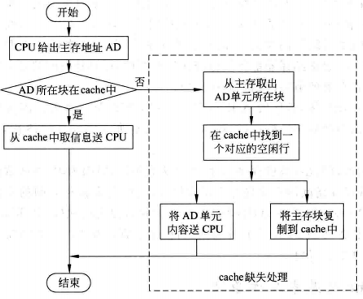
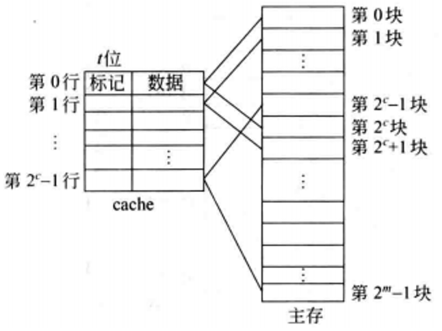
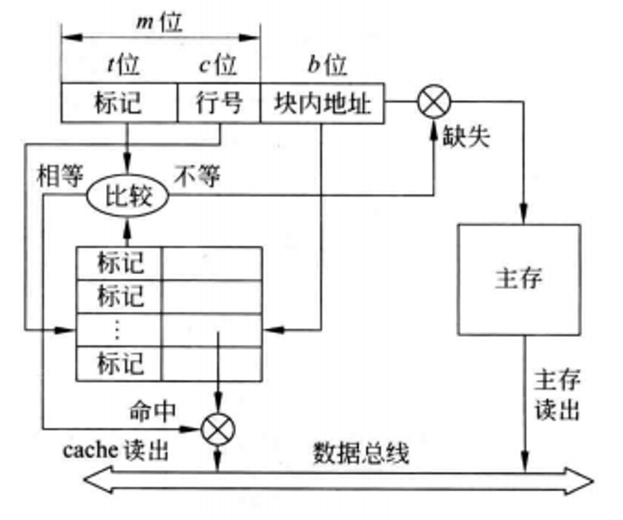
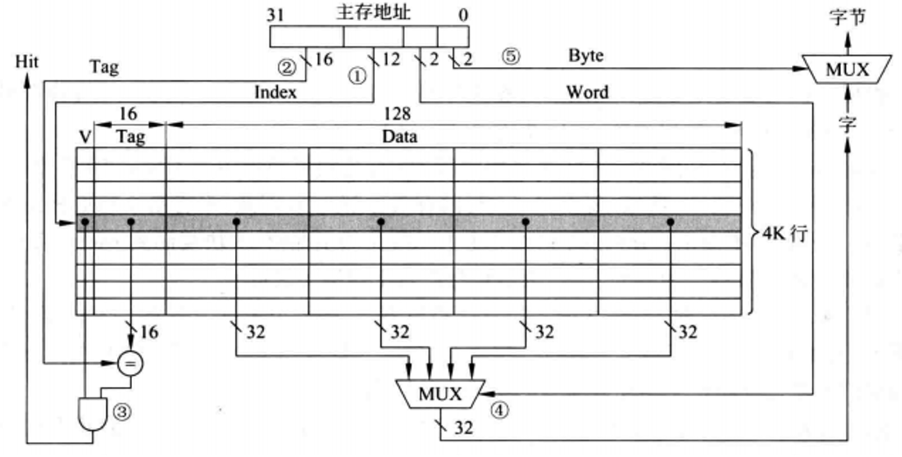
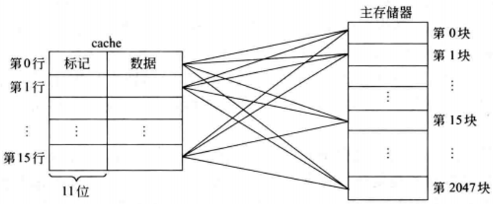
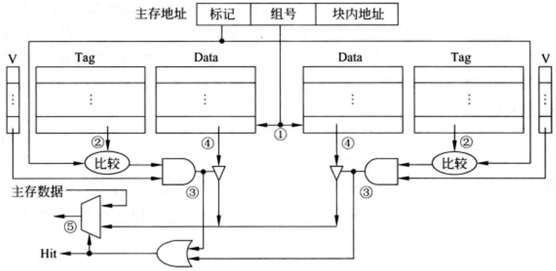
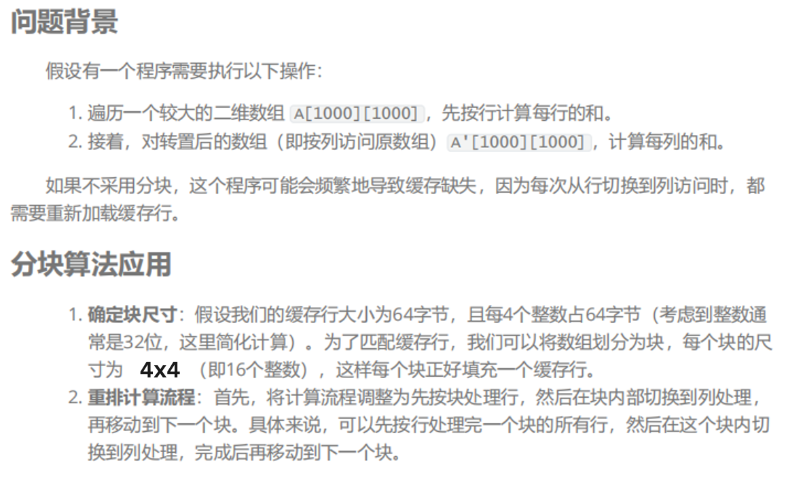

# Cache的基本原理

- 时间局部性:某个数据项在被访问之后可能很快被再次访问的特性, 即某个数据项在一个较短的时间间隔内很可能又被访问。

- 空间局部性:某个数据项在被访问之后, 与其地址相近的数据项可能很快被访问的特性。

无论数据如何分层, 数据的处理和交换过程都是两个层之间相互交换, 不可能跨层交换, 所以在描述的存储器层次结构中, "块"(Block)或"行"(Line)是数据传输的基本单位。

当数据从一个层次迁移到另一个层次时, 并不是以字节或者单个数据项为单位, 而是以固定大小的数据块进行。块大小的选择需要权衡多个因素, 包括程序访问模式、缓存大小、以及硬件设计的复杂性和成本。常见的块大小有32字节、64字节、128字节等, 具体大小根据不同的系统和应用需求而定。

## 高速缓冲技术

> 高速缓冲技术: 就是利用局部性原理, 把程序中正在使用的部分数据存放在一个高速的、容量较小的Cache中, 使CPU的访存操作大多数针对Cache进行, 从而提高程序的执行速度。

## Cache是什么

Cache是一种小容量高速缓冲存储器, 由快速的SRAM组成, 直接制作在CPU芯片内, 速度几乎与CPU一样快。

在CPU和主存之间设置Cache, 总是把主存中被频繁访问的活跃程序块和数据块复制到ache中。由于程序访问的局部性, 大多数情况下, CPU能直接从Cache中取得指令和数据, 而不必访问主存。

为便于Cache和主存间交换信息, Cache和主存空间都被划分为相等的区域。

主存中的区域称为<span style="color:red">块(block)</span>, 也称为主存块, 它是Cache和主存之间的信息交换单位;

Cache中存放一个主存块的区域称为<span style="color:red">行(line)</span>或槽(slot)。

因此, <span style="color:red">主存块大小等于Cache行中数据区大小</span>。

因为Cache的容量远小于主存的容量, 所以Cache中的块数要远少于主存中的块数, Cache 中仅保存主存中最活跃的若干块的副本。因此, 可按照某种策略预测CPU在未来一段时间内欲访存的数据, 将其装入Cache。

## Cache 取指过程

在计算机系统中, Cache是处理器(CPU)和主存(RAM)之间的一种特殊层次, 用于存储CPU最近访问过的数据或指令。当CPU需要访问某个数据项时, 它首先会在Cache中查找。如果数据在Cache中(称为“命中”), 则CPU可以直接从Cache中读取数据, 从而大大提高了访问速度。如果数据不在Cache中(称为“未命中”), 则CPU需要从主存中读取数据, 并将其存储到Cache中, 以备后续使用。

Cache由一系列的小容量、高速存储单元组成, 每个单元称为一个“块”(Block), 每个块通常包含一个或多个数据项(如一个字)。每个块都有一个与之关联的标签(Tag), 用来标识该块存储的是主存中哪个地址范围的数据。

当处理器请求数据时, 首先会在Cache中查找该数据的标签。如果找到(即缓存命中), 数据直接从Cache提供给处理器, 这是最理想的情况, 速度极快。但如果没找到(即缓存缺失或miss), 就需要从较慢的主存储器中读取数据, 并按照一定的替换策略(如最近最少使用LRU、先进先出FIFO等)将该数据块及其对应地址的标签存入Cache中, 同时将原本Cache中的某个块替换出去(如果Cache已满)。

所以, 处理器首次请求的数据不在Cache中, 这就触发了一次缓存缺失。此时, 不仅需要从主存加载数据到Cache中, 还要处理这次访问带来的额外延迟, 因为处理器必须等待数据到达。

| ##container## |
|:--:|
||
|高速缓冲存储器的工作原理|

根据Cache的读、写流程, 可知实现Cache时需解决以下关键问题:
1. **数据查找**: 如何快速判断数据是否在Cache中。
2. **地址映射**: 主存块如何存放在Cache中, 如何将主存地址转换为Cache地址。
3. **替换策略**: Cache 满后, 使用何种策略对Cache块进行替换或淘汰。
4. **写入策略**: 如何既保证主存块和Cache块的数据一致性,  又尽量提升效率。

## 一、数据查找
由于Cache行数比主存块数少得多, 因此主存中只有一部分块的信息可放在Cache中, 因此在Cache中要为每块加一个<span style="color:red">标记位</span>, 指明它是主存中哪一块的副本。该标记的内容相当于主存中块的编号。

在系统启动或复位时,每个Cache行都为空,其中的信息无效,只有装人了主存块后信息才有效。为了说明Cache行中的信息是否有效, 每个Cache行需要一个<b style="color:red">有效位</b>。

若主存地址中的标记和Cache行的标记位对上, 并且有效位置为有效, 则在Cache中找到了指定块。再根据块内地址找数据即可。

由此亦可知: 主存地址会被划分为不同的字段

比如直接映射:

```lua
----------------------
|标记|Cache行号|块内地址|
----------------------
```

有校位:
- 作用:
    1. 区分空闲与有效数据
    2. 初始化和动态管理

实现细节:
- **存储位置**: 有效位通常与缓存块的标记信息一起存储, 这样处理器在查询缓存时, 可以同时检查索引、比较标记, 并验证有效位, 以此来确定缓存命中与否。

- **命中判断流程**: 在缓存访问过程中, 即使索引和标记匹配, 也需要检查有效位。只有当索引、标记匹配且有效位为1时, 才算是真正的缓存命中。如果有效位为0, 则需要从主存中加载数据, 并将新数据块的有效位置1。

- **性能影响**: 虽然增加有效位的检查看似增加了缓存访问的复杂度, 但实际上这个操作非常迅速, 对整体性能的影响微乎其微。而且, 它对于维持缓存数据的一致性和正确性至关重要。

怎样知道一个数据项是否在Cache 中?
- 为了知道一个数据项是否在缓存中, 通常会使用一种称为"标签(tag)"的机制。标签存储了每个缓存块所对应的主存地址的高位部分(即除了用于直接映射的低位部分之外的部分)。当CPU想要访问一个数据项时, 它会计算数据项的主存地址的低位部分(这部分用于直接映射), 并检查缓存中对应位置的标签是否匹配数据项的主存地址的高位部分。如果匹配, 那么数据项就在缓存中；如果不匹配, 那么数据项不在缓存中, 这被称为"缓存缺失"

如果数据项在Cache 中, 如何找到它?
- 如果数据项在缓存中, 那么可以通过直接映射找到它。具体来说, CPU会计算数据项在主存中的地址的低位部分, 这个低位部分直接对应缓存中的一个位置(块)。然后, CPU会检查这个位置的标签是否匹配数据项的主存地址的高位部分。如果匹配, 那么数据项就在这个缓存块中。通常, 缓存块会包含多个字(例如, 一个块可能包含4、8或16个字), 所以一旦找到了正确的缓存块, CPU就可以在这个块中找到所需的数据项。

## 二、地址映射

地址映射: 主存块如何存放在Cache中, 如何将主存地址转换为Cache地址。

Cache行中的信息取自主存中的某个块。在将主存块复制到Cache 行时, 主存块和Cache行之间必须遵循一定的映射规则,这样,CPU要访问某个主存单元时,可以依据映射规则,到Cache对应的行中查找要访问的信息, 而不用在整个Cache中查找。

根据不同的映射规则,主存块和Cache行之间有以下3种映射方式。
1. **直接(direct)映射**: 每个主存块映射到Cache的固定行中。
2. **全相联(full associate)映射**: 每个主存块映射到Cache的任意行中。
3. **组相联(set associate)映射**: 每个主存块映射到Cache的固定组的任意行中。

### 直接映射

直接映射缓存的核心思想是为主存中的每个数据块在缓存中预设一个固定的位置。即把主存的每一块映射到固定的一一个Cache行中。这意味着, 任何给定的主存块只能映射到缓存中的一个唯一位置, 不会在缓存中有多个副本。

这种映射关系通过简单的数学运算实现, 最常见的方法是`取模运算`。所以也叫: 模映射。

$$Cache行号 = 主存块号 \text{ mod } Cache行数$$

> 例如, 假定Cache共有16行, 根据`100 mod 16=4`,可知: 主存第100块应映射到Cache的第4行中。`4 mod 16=4`, 主存第4块也应映射到Cache的第4行中, 因此“同余”内存块, 将被映射到同一个Cache行, 形成一个“多对一”的映射关系。

通常Cache 的行数是2的幂次,假定 Cache 有 $2^c$ 行,主存有 $2^m$ 块,这个映射函数的直观含义很简单,即以m位主存块号中后c位作为对应的Cache行号来进行Cache映射。

简言之,主存块以 $2^c$ 为模,被映射到 Cache 的固定行中。

由映射函数可看出, 主存块号的低 $c$ 位正好是它要装人的Cache行号。在Cache中,给每一个行设置一个 $t$ 位长的标记(tag),此处 $t=m-c$, 主存某块调人Cache后, 就将其块号的高 $t$ 位设置在对应Cache行的标记中。

根据以上分析可知, 在直接映射中, 主存地址被分成以下3个字段:

```lua
----------------------
|标记|Cache行号|块内地址|
----------------------
```

| ##container## |
|:--:|
||
|Cache和主存间的映射关系|

#### 地址结构与映射过程
在直接映射缓存中, 主存地址通常被划分为三个部分:

- **块地址(Block Offset)**: 指示在数据块内部的数据字的位置。这个字段对于缓存的映射决策是不相关的, 但在实际数据提取时需要用到。

- **索引(Index)**: 这部分地址用于确定数据块在缓存中的哪一行(或称组、槽)。通过将主存块地址的中间几位与缓存的行数进行取模运算( 块地址 mod 缓存的块数 ), 可以得到该数据块在缓存中的索引位置。

- **标记(Tag)**: 是主存地址的高位部分, 用于识别具体是哪一个主存块。在缓存中, 每个块都会配有一个标记存储区, 存储与之映射的主存块的标记。当处理器请求数据时, 会比较请求地址的标记与缓存中相应位置的标记, 以验证是否命中。

> [!TIP]
> 在直接映射的缓存设计中, 由于主存中的多个块可能会映射到缓存中的同一个位置(块), 因此我们需要一种机制来区分这些不同块中的数据。这就是为何我们会在缓存中为每个缓存块(或称为缓存行)设置一组“标记”(tag)的原因。

- **有效位**: 在缓存设计中, 除了标记外, 通常还会为每个缓存块(或称为缓存行)增加一个有效位来标识该块是否包含有效数据。这个有效位对于确保缓存的正确操作至关重要, 尤其是在系统启动时或缓存块被替换后。

有效位的作用:
1. 区分空闲与有效数据
2. 初始化和动态管理

#### 访问流程
- **缓存命中(Hit)**: 当处理器请求数据时, 首先计算该数据块的索引值, 然后检查对应索引位置的缓存块的有效位(Valid Bit), 以及标记是否与请求地址的标记匹配。如果匹配且有效位为1, 说明数据在缓存中, 直接读取该数据, 无需访问主存, 这就是缓存命中。

- **缓存缺失(Miss)**: 如果计算的索引位置的标记与请求地址不匹配, 或者有效位为0, 表示数据不在缓存中, 发生缓存缺失。这时, 需要从主存中读取整个数据块到缓存中指定的索引位置, 替换掉之前(如果有的话)的缓存块, 并更新相应的标记和有效位。同时, 处理器需要等待这次主存访问完成才能继续执行。

cache访问访存过程如下:

1. 根据访存地址中间的c位, 直接找到对应的cache行。

2. 将对应cache行中的标记和主存地址的高t位标记进行比较。

3. 若相等并有效位为1, 则访问cache"命中”, 此时,根据主存地址中低位的块内地址,在对应的cache行中存取信息。

4. 若不相等或有效位为0, 则“不命中”(缺失), 此时, CPU从主存中读出该地址所在的一块信息送到对应的cache行中, 将有效位置1, 并将标记设置为地址中的高t位, 同时将该地址中的内容送CPU。

| ##container## |
|:--:|
||

#### 直接映射缓存的设计和计算
主存地址的每个字段的位数:
- **32位主存地址**: 这意味着地址总共有32位, 可以被划分为几个部分来指导数据的访问。

- **直接映射缓存**: 每个主存地址只能映射到缓存的一个固定位置。

- **标记位(Tag Bits)**: 用于唯一标识主存中哪个块的内容当前存储在缓存的特定位置。标记位的计算是总地址位数减去索引位和块内偏移位的总和。

- **索引位(Index Bits)**: 用于确定`数据块`在缓存中的位置。如果缓存有 $2^n$ 个块, 那么需要 $n$ 位索引。

- **块内偏移位(Block Offset Bits)**: 用于确定块内特定字节的位置。如果块大小是 $2^m$ 个字节, 每个字节对应 $1$ 位, 那么块内偏移需要 $m$ 位。但通常我们考虑的是块内字的索引, 而不是字节, 如果块大小是 $2^m$ 个字(每个字4字节), 则块内字索引需要 $m$ 位。

- **有效位(Valid Bit)**: 每位数据块一个位, 用于标记该块是否有有效数据, 通常占 $1$ 位。

- **计算标记位大小**: 假设总地址位数是32位, $n$ 位用于索引, $m$ 位用于块内偏移, 则标记位的大小为: $32 - n - m$。

- **计算单个缓存块的位数**: 块大小为 $2^m$ 个字, 每个字是 $4$ 字节, 即块大小为 $2^(m+2)$ 位(因为 $2^m$ 个字 $× 4$ 字节/字 $= 2^{m+2}$ 字节 $= 2^{m+2}×8$ 位)。加上标记位和有效位, 单个块的总位数为: $2^{m+2}×8 + (32 - n - m) + 1$ 位。

- **计算整个缓存的总位数**: 缓存总共有 $2^n$ 个块, 所以总位数为单个块的位数乘以块数: $2^n × [2^{m+2}×8 + (32 - n - m) + 1]$ 位

注意, 对于这个的计算不是什么一成不变的。比如对于标记位的计算, 有的地方不算字节偏移。有的地方算字节偏移, 那么就是 $32-(n+ m+ 2(字节偏移量))$。所以, 这个东西, 知道就好。如果要考试, 以考试参考教材为主。

```lua
------------------------------------------------------
|标记(标记位) |  Cache行号(索引位)  | 块内地址(块内偏移位) |
|32 - n - m | log_2{Cache块数}   | log_2{块大小 (B)}  |
------------------------------------------------------
```

所以:
- 根据`块大小`和`编址方式`确定`块内地址`的位数。
- 根据Cache块的数量, 确定`行号`的位数。
- 剩下的就是`标记`位数。

注意: `标记`位数也可以用 $\cfrac{主存块数}{Cache块数}$ 来算。

Cache的容量: 一个Cache分为若干行, 即一个Cache包含若干Cache行。

先算一个Cache行的容量, 包含: 数据区域和标记项(标记位, 有效位)。
1. `数据区域`是存放的对应的一个主存块的数据, 所以数据区域大小就是一个主存块的容量
2. `标记位`, 等于主存地址的标记位。标记位位数即主存地址的标记位的位数
3. `有效位`: 1位。

| ##container## |
|:--:|
||

注: 有些替换策略可能还需要一位的脏位, 这个要灵活处理。

例题: 主存和cache之间采用直接映射方式, 块大小为16B。 cache 的数据区容量为64KB, 主存地址为32位, 按字节编址。问: 主存地址如何划分? 并计算cache总容量为多少。

```C++
// 划分
标记: 32 - n - m = 32 - 12 - 4 = 16
Cache行号: log_2{64 KB / 16 B = 10^{6 + 10 - 4} = 10^12} = 12
块内地址: log_2{16} = 4

// cache总容量
一行总容量
= 数据区大小(一块的大小) + 标记区(即 标记位 + 有效位)

cache总容量 = 一行总容量 * Cache行数
= (16 B + 1 bit + 16 bit) * 2^12 = 72.5KB
```

| ##container## |
|:--:|
||

#### cache块与缺失率

较大的cache块在理论上能够更好地利用空间局部性以降低缺失率。
- 增大块大小的优势: 提高空间局部性利用, 降低缺失率。

但是过犹不及, 当块大小在 cache 容量中所占比例增加到一定程度时, 缺失率也随之增加。

- **缺失成本增加**
    - **传输时间增加**: 随着块大小的增大, 从下一层存储(如主存)读取一个块到缓存所需的时间也会增加。这是因为更大的块意味着更多的数据需要传输, 这直接影响了缺失响应时间。首个字的访问延迟可能变化不大, 但后续数据的传输时间显著增长, 从而提高了整体的缺失成本。

    - **性能折衷**: 块大小的增加起初能有效减少由于空间局部性良好导致的缺失, 但当块大小达到一定程度, 缺失率的减少速度放缓, 而每次缺失的成本却在持续上升, 这会导致总体性能的倒退。这是因为尽管单次命中能提供更多有用数据, 但每次缺失的惩罚变得更加严重。

- **缺失率与块大小的关系**
    - **块间竞争**: 当缓存中块的数量因块大小增加而减少时, 每个块必须承载更广泛地址范围的数据, 增加了块间竞争, 导致数据块被频繁替换, 减少了数据在被有效利用前被替换出缓存的可能性, 从而间接增加了缺失率。

    - **空间局部性减弱**: 块过大还可能削弱块内数据间的空间局部性优势。程序中往往存在局部引用的聚集, 但并非所有数据都在一个超大的块内紧密排列。因此, 过大的块可能包含大量未被及时利用的数据, 降低了缓存的有效性。

- **缓解措施**
    - **改进存储系统设计**: 为了克服大块带来的传输时间增加, 存储系统可以优化数据传输机制, 如采用更宽的数据总线、提高数据传输速率, 或采用预取技术提前加载可能需要的数据, 从而在不显著增加缺失成本的同时, 享受大块带来的好处。

    - **动态块大小**: 某些高级缓存设计可能会采用动态块大小技术, 根据访问模式动态调整块的大小, 试图在块大小与缺失率、缺失成本之间找到最优平衡点, 以最大化缓存的整体效率。
 
总之, 缓存块大小的选择是一个微妙的平衡行为, 需要综合考虑多种因素, 包括程序的访问模式、存储层次的特性以及系统对性能、成本和能效的需求。
 
#### cache缺失处理
先来看一下控制单元是如何处理 cache 缺失的。
- 在真实的计算机系统中, 当控制单元(CPU的控制逻辑部分)遇到缓存缺失时, 它会执行一系列步骤来确保所需数据能够被正确地从主存或其他较低级缓存中获取并处理。

1. 检测缺失
2. 停止流水线
3. 生成缺失处理信号
4. 地址计算与请求发送
5. 数据传输
6. 数据处理与缓存更新
7. 恢复执行
8. 预取(可选)

cache应用于很多地方, 但是处理的方式只是略有不同, 基本大差不差。比如:
> 指令缓存缺失处理步骤: 
>
> 1. **地址计算与发送读请求**:
> 
>     将产生缺失的指令地址确定为当前程序计数器(PC)值减去4(因为大多数体系结构中指令预取发生在取指周期, 此时PC已经指向了下一条指令)。使用这个地址向主存发送读请求。
>
> 2. **等待主存响应**:
>
>     处理器在此阶段阻塞, 等待主存完成读取操作。这期间, 处理器的指令执行流
水线会被暂停, 寄存器状态基本保持不变。
>
> 3. **更新缓存并继续执行**:
> 
>     当数据从主存返回后, 将其写入缓存的适当位置, 同时设置相应的标记信息和
有效位。之后, 重启指令执行流程, 从缓存中重新获取刚刚填充进来的指令, 继续执行。
>
> **数据缓存缺失处理步骤**:
>
> 数据缓存缺失的处理流程与指令相似, 主要区别在于引发缺失的原因是数据访问而非指令取指: 
>
> 1. **地址计算与发送读请求**:
> 
>     计算实际需要的数据地址, 并向主存发送读请求。这通常是由数据加载或存储指令触发的。
>
> 2. **等待主存响应并阻塞**:
>
>     同样, 处理器在数据未返回前处于阻塞状态, 流水线暂停, 等待数据填充缓存。
>
> 3. **更新缓存与指令继续**:
>
>     数据从主存读取回来后, 更新缓存相应条目, 设置有效位。处理器恢复执行, 继续处理之前因缺失而暂停的指令或开始执行新的指令。

### 全相联映射
> 一个块可以被 放置在 cache 中的任何位置。
**全相联映射(Fully Associative Mapping)** 是一种缓存映射技术, 它为内存块提供最大的灵活性, 允许缓存中的任何位置存储任何内存块。相比于直接映射和, 全相联映射在减少冲突缺失方面表现更佳, 但伴随而来的是更高的硬件复杂度和成本。

在全相联缓存中, 每个缓存条目都可以存放来自主存中任何地址的数据块。这意味着<span style="color:red">**每个**缓存项都有一个对应的标记(Tag)、有效位(Valid Bit)以及数据存储区域</span>(<span style="color:yellow">即每一行都有一个`比较器`</span>)。有效位用来指示该缓存项是否有有效数据, 而标记则用于识别该缓存项存储的是主存中哪个地址的数据。

#### 工作原理

**分块与编号**: 主存和Cache都被分为固定大小的数据块。主存分块, Cache分行, 主存的块和Cache的行大小相同。

**地址结构**: 主存地址可以被细分为主存块地址(标记位)和块内偏移地址。

| ##container## |
|:--:|
||

**映射算法**: 主存的数据块可以映射到Cache的任意行, 即主存中的某一数据块可以放置在Cache中的任意块。

**查找机制**: 为了找到指定的块, Cache中的每个项都需要被检索, 因为该块可能被存放在Cache中的任何位置。这个过程是通过一个与Cache中每个项都相关的比较器并行完成的。

| ##container## |
|:--:|
||

#### 优缺点
- 优点:
    1. **高灵活性**: 主存中的任何一块都可以映射到Cache中的任何一块, 提供了高度的灵活性。
    2. **高命中率**: 由于映射的灵活性, Cache的命中率通常较高, 从而提高了数据访问的效率。
    3. **高存储空间利用率**: Cache的存储空间可以更有效地被利用, 因为没有固定的映射规则限制。
- 缺点:
    1. **高硬件成本**: 由于需要并行比较器来快速查找Cache中的匹配项, 这增加了硬件的复杂性和成本。
    2. **高访问时间**: 在每次访问时, 都需要与Cache中的所有项进行比较, 这可能导致访问时间增加。
    3. **实现复杂度高**: 相对于直接映射和组相联映射, 全相联映射的实现更为复杂。

全相联映射通常用于块数较少的Cache中, 因为它在硬件成本和数据访问效率之间提供了较好的平衡。然而, 随着Cache容量的增加, 全相联映射的硬件成本可能会迅速上升, 因此在实际应用中, **组相联映射(Set Associative Mapping)** 往往是一个更实际的选择。

### 组相联映射

**组相联(Set Associative)** 缓存设计是直接映射和全相联映射之间的一个折中方案, 它试图平衡二者的优势, 既减少冲突缺失, 又避免全相联映射的高硬件复杂度和成本。

在组相联缓存中, 缓存被划分为多个组, 每个组包含固定数量的缓存行(或称块)。每个内存块可以映射到与之关联的组内的任意一个缓存行, 但不能映射到其他组。这种设计结合了直接映射(通过索引确定唯一组)和全相联映射(组内任意缓存行)的特点。

在这种映射方式中, 主存储器和高速缓存被分成相同大小的组(Set), 每个组内再被分为相同大小的块(Block)。<span style="color:red">组间采用直接映射, 而组内的块之间则采用全相联映射</span>。

> [!TIP]
> <span style="color:yellow">若一组有 $r$ 个Cache行, 被称为`r路组相联`。</span>

#### 工作原理
**分组**: 主存储器和高速缓存被划分为大小相等的组。假设主存储器有M个块, 高速缓存有N个块, 每组有S个块, 则高速缓存有N/S个组。

**索引**: 当CPU需要访问主存储器中的某个块时, 首先根据主存地址的某一部分(索引域)来确定该块应映射到高速缓存的哪一个组。具体地, 假设主存地址由<Tag, Index, Offset>三部分组成, 其中Index用于确定组号。

**块匹配**: 在确定了组号后, CPU会在该组内的所有块中查找与主存块匹配的块。匹配是通过比较主存地址的Tag部分和高速缓存块中的Tag标记来实现的。

| ##container## |
|:--:|
||

组相联映射的主要思想是, 将cache所有行分成2个大小相等的组, 每组有2行。每个主存块被映射到cache固定组中的任意一行, 即组相联采用组间模映射、组内全映射的方式, 映射关系如下: $$cache组号=主存块号 \text{ mod } cache组数$$

> [!TIP]
> 注: 分组映射方式不唯一

| ##container## |
|:--:|
||

#### 命中与未命中
- 如果在高速缓存的某个组内找到了匹配的块, 则称为缓存命中(Cache Hit), CPU可以直接从该块中读取数据。

- 如果在高速缓存的某个组内没有找到匹配的块, 则称为缓存未命中(CacheMiss), CPU需要从主存储器中读取数据, 并可能将该数据块存入高速缓存中的一个空块中(根据替换策略)。

注: 
- 直接映射可以看作是`1路组相联`
- 全相联映射可以看作是只有1组的组相联, 即所以Cache行分为1组

比较器的个数: `r路组相联`需要`r个比较器`。 $比较器的位数 = 地址标记字段的位数$

#### 优缺点
- 优点:
    - **减少冲突缺失**: 相较于直接映射, 组相联映射通过允许块在组内多个位置存放, 显著降低了冲突缺失率。
    - **灵活性与效率平衡**: 相比全相联映射, 硬件复杂度和成本更低, 同时提供了较好的性能, 特别是在适度的组数和路数配置下。

- 缺点:
    - **硬件复杂性**: 相比直接映射, 需要更复杂的硬件来实现组内标记的比较, 增加了设计难度和成本。
    - **查找时间**: 虽然组内并行查找, 但相比直接映射, 查找时间还是要略长一些, 尤其是在高路数的组相联缓存中。

组相联映射广泛应用于现代处理器的多级缓存设计中, 尤其是在L1或L2缓存, 因为它在成本和性能之间达到了一个很好的平衡。

通过调整组数和路数, 设计者可以根据特定应用场景和性能目标来优化缓存性能, 比如对冲突缺失敏感的应用可能倾向于使用更高路数的组相联缓存。

#### 在cache中查找一个块: 组相联缓存查找过程
1. **地址解析**: 处理器请求的内存地址被解析为标记(Tag)、索引(Index)和偏移(Offset)。索引用于确定请求数据可能所在的组。

2. **组选择**: 根据索引值, 直接选择对应的组。这意味着索引位数决定了组的数量, 每增加一位索引, 组数翻倍而组的大小减半。

3. **并行比较**: 选定的组中所有缓存行的标记与请求地址的标记部分并行比较。增加相联度(每组的缓存行数)可以提高并行度, 从而可能减少查找时间, 但同时增加了硬件复杂性和成本。

4. **标记与偏移**: 相联度的增加会导致每组的块数增多, 因此索引位减少, 标记位相应增加, 以维持地址的唯一性。标记位的增多是为了能够唯一标识组内更多的块。

相联度与性能的关系
- **提高相联度**: 增加每组的缓存行数可以减少冲突缺失, 因为每个块有更多的机会被放置在缓存中。然而, 这也意味着每个组的检索需要比较更多的标记, 尽管这些比较是并行进行的, 但硬件开销和潜在的比较延迟可能会增加。

- **相联度与地址结构**: 相联度的提高导致索引位减少, 标记位增加, 这意味着对于同样的缓存容量, 全相联缓存(相联度最大)不使用索引, 整个地址(除了偏移部分)都作为标记进行比较。

硬件选择
- 在直接映射缓存中, 由于每个内存块只能映射到缓存的一个固定位置, 因此, 一旦通过索引确定了目标缓存行, 只需对这一行的标记进行比较即可。这简化了硬件设计, 仅需一个比较器来验证请求地址的标记是否与当前缓存行匹配。直接映射缓存的这种简单性降低了硬件成本和访问延迟, 但可能面临较高的冲突缺失率。

- 相比之下, 四路组相联缓存中, 每个组包含四个可能放置数据块的位置, 每个位置都需要独立的比较, 以确定请求的数据是否存在于组内的任一缓存行中。这意味着:

    - **比较器数量**: 每个组需要四个比较器, 每个比较器对应一个缓存行的标记, 用于与请求地址的标记部分进行并行比较。

    - **多路选择器**: 还需要一个4选1的多路选择器(Multiplexer), 用于在所有比较结果中选择匹配的缓存行(如果有多个匹配, 则根据替换策略决定)。这个选择器确保了在找到匹配项后, 能够正确读取或写入数据。
 
    - **开销增加**: 因此, 组相联缓存相比直接映射, 硬件开销主要体现在额外的比较器和多路选择器上, 同时, 由于需要在组内进行并行比较和选择, 可能会引入额外的延迟。尽管如此, 这种设计显著降低了冲突缺失率, 提高了缓存的整体效率。

## 地址映射之例题
假设某个计算机的主存地址空间大小为256MB, 按字节编址, 其数据Cache有8个Cache行, 行长为64B。
1. 若不考虑用于Cache的一致维护性位(脏位)和替换算法控制位, 并且采用直接映射方式, 则该数据Cache的总容量为多少?

2. 若该Cache采用直接映射方式, 则主存地址为3200 (十进制)的主存块对应的Cache行号是多少?采用二路组相联映射时又是多少?

```C++
1. 数据Cache的总容量, 即Cache的数据区总容量:
主存地址位数: 256MB -> 2^{20 + 8} B, 故 28 位(标记位)
块内地址: 6位 (2^6 B)
行号: 3位 (2^3行)
标记位: 28 - 6 - 3 = 19
Cache的数据区总容量 = 8 * [64 * 8 bit + 1bit(有效位) + 19bit]

2. Cache行号:
主存地址: 3200, 按字编址, 因为行长为64B, 即64字节一块 则 3200/64 = 50
50 % 8 = 2

二路组相联映射时, Cache行号:
8/2 = 4组
50 % 4 = 2, 在第二组:
0 1 | 2 3 | 4 5 | 6 7
那么是Cache行号`2或3`
```

## 三、替换策略
### 替换算法 (可以结合OS课程学)
在采用**全相联映射**或**组相联映射**方式时, 从主存向Cache传送一 个新块, 当Cache或Cache组中的空间已被占满时, 就需要使用替换算法置换Cache行。

而采用**直接映射**时, 一个给定的主存块只能放到唯一的固定Cache行中, 所以在对应Cache行已有一个主存块的情况下, 新的主存块毫无选择地把原先已有的那个主存块替换掉, 因而 **无须** 考虑替换算法。

常用的替换算法有随机(RAND)算法、先进先出(FIFO)算法、近期最少使用(LRU)算法等等。其中最常用的是`LRU算法`(重点)。

1. 随机算法: 随机地确定替换的Cache行。它的实现比较简单, 但未依据程序访问的局部性原理, 因此可能命中率较低。

2. 先进先出算法: 选择最早调入的Cache 行进行替换。它比较容易实现, 但也未依据程序访问的局部性原理, 因为最早进入的主存块也可能是目前经常要用的。

3. 近期最少使用算法(LRU): 依据程序访问的局部性原理, 选择近期内长久未访问过的Cache行进行替换, 是堆栈类算法。

#### LRU替换策略
LRU 是一种广泛使用的缓存替换策略, 它基于这样的假设: 最近最少使用的数据块在未来被再次使用的可能性最小。因此, 当需要替换一个块时, LRU 策略会选择最久没有被访问过的块进行替换。

其核心思想是:
- **记录使用情况**: 为缓存中的每个块维护一个"最近使用"的信息, 通常通过硬件或软件机制实现。

- **选择替换对象**: 当需要替换时, 选择最近最少使用的块。在硬件实现中, 这通常通过维护一个年龄队列或者使用计时器来记录访问顺序。

> [!TIP]
> 408需要清楚具体的实现, 这里就不多赘述了
>
> 为每一个Cache行增加一个标记项: `LRU控制位-计数器`(包含若干位。取决于路数 $2^n$ 路组相连映射, LRU控制位为 $n$ 位 (值: $[0, 2^n-1]$ ))
>
> |标志位|(有效位|脏位)(可能有, 需要看其写入策略等)|LRU控制位(计数位)|数据位|
> 
> 有一个: |计数|值(块)|
>
> - 如果查找的存在于缓存(命中), 则这个值对应的计数清零, 并且比它小的计数全部 + 1
> - 如果查找的不存在于缓存(未命中), 则去内存中查找,
>     - 如果块用完了, 则覆盖计数值最大的数, 并且计数置零, 其他计数 + 1
>   - 否则则写入没有用过的块, 其他计数 + 1
>
> (注: 上面的算法不会存在两个一样的计数(除了0))

#### 直接映射缓存的替换策略

在直接映射缓存中, 替换策略是预先确定的, 因为每个内存块只能映射到缓存的一个固定位置。当发生缺失时, 占据该位置的现有块会被新块替换, 而不涉及选择过程。

#### 组相联和全相联缓存的替换策略
**LRU (Least Recently Used)** 替换算法的实现涉及到跟踪每一块的相对使用情况。对于一个两路组相联的cache, 跟踪组中两个数据项的使用情况可以采用以下几种方法:

使用位标记:
- 在每组中单独保留两位(bit), 每位对应一个数据项。
- 当一个数据项被访问时, 将其对应的位设置为1, 表示该数据项最近被使用过。
- 当需要替换时, 检查两位的值, 选择值为0的数据项进行替换(即最久未使用的数据项)
- 如果两位都为1, 则需要额外的逻辑来确定替换哪一个数据项, 或者可以将两位都重置为0, 并更新为当前访问的数据项(这取决于LRU策略的具体实现)。

使用时间戳或计数器:
- 为每个数据项关联一个时间戳或计数器。
- 当数据项被访问时, 更新其时间戳或增加计数器的值。
- 需要替换时, 选择时间戳最早或计数器值最小的数据项进行替换。
- 这种方法需要更多的存储空间来保存时间戳或计数器, 但提供了更精确的使用情况跟踪。

使用栈或队列:
- 将最近访问的数据项推入栈(Stack)或队列(Queue)中。
- 当需要替换时, 从栈或队列的底部(或头部, 取决于栈/队列的类型和LRU策略的实现)选择数据项进行替换。
- 这种方法需要额外的数据结构来维护访问顺序, 但可以提供直观的LRU实现。

## 四、写入策略
因为cache中的内容是主存块副本, 当对cache中的内容进行更新时,就存在cache和主存如何保持一致的问题。解决cache一致性问题的关键是处理好写操作。通常有两种写操作方式。

### 写直达
当处理器执行写操作时, 为了提高效率, 数据可能先写入缓存, 而不是立即写回主存。数据在被替换出缓存之前不会更新到主存, 这就造成了缓存与主存数据的不一致(也会有其他行为导致)。而不一致可能会出现一些问题:

- 数据错误
- 复杂性增加
- 死锁与活锁

当处理器执行写操作时, 为了提高效率, 数据可能先写入缓存, 而不是立即写回主存。数据在被替换出缓存之前不会更新到主存, 这就造成了缓存与主存数据的不一致(也会有其他行为导致)。而不一致可能会出现一些问题:

- 数据错误, 性能下降, 复杂性增加, 死锁与活锁。

为了解决不一致的问题, 一个比较简单的思路就是每当处理器写cache时, 它也会立即将数据写入主存。这种方法确保了cache和主存之间的数据始终一致, 因为每次写操作都会同时更新两者。这就是我们的写直达策略。

当处理器执行一个写操作时, 数据不仅会被写入缓存中对应的位置, 同时也会直接写入到下一层存储器, 通常是主存中。这意味着每次写操作都会触发对主存的更新, 确保主存和缓存中的数据保持一致。

他的优点很明显:
- 简单性: 实现逻辑相对简单, 因为不需要复杂的缓存一致性维护机制。
- 可靠性: 减少了数据丢失的风险, 因为数据立即被写回到持久化存储(主存), 即使在断电或系统故障时, 数据完整性也得以保证。

缺点也同样明显:
- 性能影响: 每次写操作都需要访问主存, 这可能比仅写入缓存慢, 尤其是在主存访问延迟较高的情况下。
- 带宽消耗: 频繁的写操作会大量占用主存总线, 可能影响到其他数据传输操作的性能。

### 写缺失与写缓冲
当处理器执行一个写(store)操作并且数据不在cache中时(即写缺失), 处理器需要从主存中取出包含该数据的数据块, 并将其存入cache中。然后, 处理器可以将引起缺失的数据字写入cache中。如果使用写直达策略, 处理器还需要同时将数据写入主存, 这会导致性能下降, 因为写主存的操作通常比写cache要慢得多。(写分配法)

为了减少写操作的延迟, 现代处理器通常会使用写缓冲。写缓冲是一个在处理器和主存之间的小型存储器, 用于暂存等待写入主存的数据。当处理器执行一个写操作时, 它先将数据写入cache(如果是一个写命中)和写缓冲中, 然后继续执行下一条指令, 而不需要等待主存操作完成。这样, 处理器就可以避免由于等待写主存操作完成而产生的阻塞, 从而提高性能。

### 写回法(回写法)

- 写操作局部化: 当处理器执行写操作时, 数据只被更新到缓存中, 而不是立即写入主存。这意味着写操作的延迟被限制在缓存级别, 通常远低于主存访问延迟。

- 延迟更新主存: 只有当包含已修改数据的缓存块需要被替换出去, 以腾出空间给新数据时, 该块的内容才会被“回写”(write-back)到主存中。在这一过程中, 会检查数据是否被修改, 未修改的数据块无需写回操作。

性能优势:
1. 减少对外部存储的访问
2. 利用局部性原理
3. 减少带宽需求

然而, 写回机制的实现比写直达要复杂得多, 主要在于以下几点:
1. 脏位(Dirty Bit)管理: 每个缓存块需要一个脏位来记录该块是否被修改过。这是写回机制的关键, 因为只有脏块在被替换时才需要写回主存。

2. 一致性问题: 在多处理器系统中, 写回机制引入了缓存一致性问题, 需要复杂的协议(如MESI协议)来确保所有处理器看到的数据是一致的。这增加了硬件和软件的复杂性。

3. 写合并(Write Combining): 为了减少写回主存的次数, 处理器可能会将多个写操作合并成一个单独的写操作。这需要额外的逻辑来跟踪和合并这些写操作。

为了进一步优化性能和处理写操作的顺序, 写回策略通常会配合使用写缓冲, 这也增加了设计的复杂度。

## 五、cache性能的评估和改进
### 平均存储器访问时间(AMAT)
CPU 的时间可以被大致划分为两部分: 一部分是 CPU 实际执行指令所花费的时钟周期数, 另一部分是 CPU 等待存储系统(如 cache 或主存)响应所花费的时钟周期数。在评估系统性能时, 理解并量化这两部分时间是非常重要的。

在理想情况下, 我们假设 cache 访问命中的开销是 CPU 正常执行周期的一部分, 这意味着当 CPU从 cache 中读取或写入数据时, 其执行速度几乎与从寄存器中读写一样快。然而, 当 cache 缺失时, CPU 必须等待从下一级存储层次(如主存)中检索数据, 这通常会导致 CPU 阻塞(stall)或暂停执行, 直到所需的数据到达 cache。

在简化的存储系统模型中, 我们可以将 CPU 时间表示为: $$CPU时间 = (CPU执行时钟周期数 + 存储器阻塞的时钟周期数) \times 时钟周期时间$$

但在许多情况下, cache 缺失是存储器层次结构中导致 CPU 阻塞的主要因素。

存储器阻塞的时钟周期数是由读操作和写操作两部分组成, 而计算读操作阻塞时钟周期数的公式也很好地体现了性能分析中的关键参数。为了进一步完整理解, 我们可以将读写操作的阻塞时钟周期数也纳入进来, 形成一个全面的性能评估框架。

**读操作阻塞的时钟周期数计算**
- **读次数**: 这是指程序执行过程中总的内存读取请求次数, 可以通过程序分析或性能监控工具获得。

- **读缺失率**: 即发生读缓存缺失的概率, 可以通过统计分析或模拟得到, 反映程序访问模式与缓存配置的匹配程度。

- **读缺失代价**: 完成一次读缺失处理所需的时钟周期数, 包括从下一级存储(如主存)检索数据的时间、更新缓存标记和数据的时间等。

**写操作阻塞的时钟周期数计算**
- **写次数**: 程序执行期间的总内存写请求次数, 同样可通过监控或分析获得。

- **写缺失率**: 虽然写操作不直接导致传统的"缺失", 但写分配(Write Alocate)策略下, 写操作到未命中缓存块时需要先从主存读取数据到缓存, 这可以看作一种特殊形式的"缺失", 并计算相应的缺失率。

- **写缺失代价**: 这通常包括从主存读取数据到缓存的成本(如果采用写分配策略), 以及可能的缓存更新、写缓冲操作等开销。

综合计算存储器阻塞的时钟周期数

$存储器阻塞的时钟周期数 \\= 读操作阻塞的时钟周期数 + 写操作阻塞的时钟周期数 \\= [(读次数/程序数) × 读缺失率 × 读缺失代价] + [(写次数/程序数) × 写缺失相关成本]$

请注意, 这里的“写缺失相关成本”是一个更宽泛的概念, 包括了写操作引起的各种延迟, 比如在写回缓存中更新脏位、写缓冲的管理开销、以及实际写操作到主存的代价(尤其在写直达策略下)

那如果处理器速度很快, 而存储系统却不快, 又会发生什么？
- 通过`Amdahl定律`的视角来观察这一问题。当处理器速度提升, 而存储系统速度没有相应提升时, 存储器访问延迟(尤其是缓存缺失导致的延迟)对系统性能的影响会更加显著

> **原始系统**: CPl(每个指令的时钟周期数)为2, 其中cache缺失导致的额外CPI为3.44(假设这代表了每次缺失的额外开销), 则总CPI为5.44。
> 
> **改进后的系统**: 通过优化流水线, CPI从2降到了1。但cache缺失的额外开销仍然为3.44(这里假设存储系统性能没有提升), 因此新的总CPI为4.44。
> 
> **性能比较**: 理想cache(即无缺失)的系统的CPl为1, 而具有cache缺失的系统的cPl为4.44。因此, 理想cache系统的性能是cache缺失系统的4.44倍。
> 
> **存储器阻塞占比**:
> - 原始系统中, 存储器阻塞时间占总执行时间的比例为`3.44/5.44=63%`
> - 改进后的系统中, 这一比例上升到`3.44/4.44=77%`
> 
> 可以看到, 即使处理器速度提高了(CPI从2降到1), 但由于存储系统性能没有提升, 存储器阻塞所花费的时间在整个执行时间中的占比反而增加了。这是因为更快的处理器产生了更多的存储器访问请求, 而存储系统无法及时响应这些请求, 导致更多的cache缺失和更高的阻塞时间。

可以看到, 主要的原因为: 1、加速不均衡 2、性能提升受限 3、频率提升的局限性

前面的例子和等式是建立在命中时间不计入计算 cache 性能的假设之上。如果命中时间增加, 那么从存储系统中存取一个字的总时间也会增加, 继而导致处理器时钟周期的增加。

**命中时间对cache性能的影响**:
- 当数据在cache中命中时, 处理器可以直接从cache中读取数据, 这比从主存中读取要快得多。然而, 如果命中时间增加(即处理器从cache中读取数据所需的时间变长), 那么即使数据在cache中, 处理器也需要花费更多的时间来访问这些数据。这可能会导致处理器时钟周期的增加, 从而降低处理器的性能。

**大容量cache的影响**:
- 理论上, 一个更大容量的cache能够存储更多的数据, 从而提高数据的命中率。然而, 实际上, 大容量cache的访问时间通常会比小容量cache更长。这是因为大容量cache需要更多的时间和资源来搜索和定位数据。

- 如果大容量cache的命中时间增加得太多, 那么即使它提高了数据的命中率, 也可能因为访问时间的增加而导致处理器性能的下降。这是因为处理器需要花费更多的时间来从cache中读取数据, 从而降低了处理器的整体性能。

为了更准确地评估cache设计的性能, 设计人员会使用平均存储器访问时间(AMAT)这一指标。AMAT综合考虑了命中、缺失以及不同访问的频率, 能够更全面地反映cache设计的实际效果。

AMAT的计算公式为: $$AMAT = 命中时间 + 缺失率 × 缺失代价$$ 其中, `命中时间`是从cache中读取数据所需的时间, `缺失率`是数据在cache中未命中的概率, `缺失代价`是当数据在cache中未命中时从主存中读取数据所需的时间

### 多级cache
现代计算机系统中广泛使用多级缓存结构来减少处理器和主存(通常是DRAM)之间的性能差距。

随着处理器时钟频率的不断提高和DRAM访问延迟的相对增加, 这种差距变得越来越大。为了缓解这个问题, 大多数现代微处理器都采用了多级缓存架构

#### 一级缓存(L1Cache)
- 通常分为指令缓存(l-Cache)和数据缓存(D-Cache), 或者两者合并成一个统一的缓存(Unified Cache) 。
- 位于处理器核心内部, 具有非常短的访问延迟(通常是几个时钟周期)。
- 容量较小, 因为靠近处理器核心, 所以制造成本较高。

**设计目标**:
- **减少命中时间**: 一级缓存的主要目标是确保处理器在访问数据时能够迅速找到所需的数据, 从而最小化访问延迟。
- **适应处理器速度**: 随着处理器时钟频率的不断提高, 一级缓存需要能够提供足够快的数据访问速度, 以匹配处理器的处理能力。

**特性**: 
- **容量小**: 由于一级缓存靠近处理器核心, 因此其容量通常较小, 以限制制造成本和功耗。
- **块容量小**: 为了减小缓存的访问延迟, 一级缓存通常使用较小的数据块(block size)。
- **低缺失代价**: 由于一级缓存的访问延迟较短, 因此当发生缓存缺失时, 其缺失代价相对较低。

#### 二级缓存(L2Cache)
- 位于处理器芯片上, 但可能不在核心内部, 因此访问延迟比L1Cache稍长。
- 容量通常比L1Cache大, 用于存储更多的常用数据。
- 当L1 Cache发生缺失时, 处理器会检查L2 Cache。

**设计目标**: 
- **改善缺失率**: 二级缓存的主要目标是捕获那些在一级缓存中未命中的数据, 以减少对主存的访问次数, 从而降低访存延迟。
- **提供大容量**: 由于二级缓存的访问速度相对较慢, 因此它可以提供比一级缓存更大的容量, 以存储更多的常用数据。

**特性**: 
- **容量大**: 二级缓存的容量通常比一级缓存大得多, 以存储更多的数据, 并降低缺失率。
- **块容量大**: 为了更有效地利用缓存空间, 二级缓存通常使用比一级缓存更大的数据块。
- **高相联度**: 为了提高缓存的命中率, 二级缓存通常使用比一级缓存更高的相联度
(associativity), 即每个缓存组(set)中可以包含更多的缓存行(line)。

(当然还可能存在第三级)

#### 多级缓存的工作原理
1. 当处理器需要读取或写入数据时, 它首先会在L1 Cache中查找。
2. 如果L1 Cache中找到了所需的数据(缓存命中), 则处理器会立即使用该数据, 从而避免了访问主存的延迟。
3. 如果L1 Cache中没有找到所需的数据(缓存缺失), 处理器会检查L2 Cache。
4. 如果L2 Cache中找到了数据(二级缓存命中), 则处理器会使用该数据, 但访问延迟会比L1Cache稍长。
5. 如果L2 Cache中也没有找到数据(二级缓存缺失), 则处理器必须访问主存(DRAM), 这会产生更大的延迟。

缓存的替换策略:
- 当新的数据需要被缓存, 而缓存已满时, 就需要使用某种替换策略来决定哪些数据应该被替换出去。LRU(最近最少使用)替换策略是一种常用的方法。

缓存的影响:
- 多级缓存结构可以显著提高处理器的性能, 因为它减少了处理器等待数据从主存中加载的时间。
- 然而, 缓存的引入也增加了系统的复杂性和成本, 因为需要额外的硬件来存储和管理缓存数据。

多级缓存系统的优势:
- **分层优化**: 通过将快速但小容量的L1与慢速但大容量的L2相结合, 系统能够在保证快速响应的同时, 有效提升数据的存储量和访问效率。
- **成本与性能平衡**: L1的设计更注重速度, L2的设计更注重容量和缺失率, 这种分层设计在成本和性能之间找到了一个较好的平衡点。
- **互补作用**: 每一级缓存都针对性地解决不同类型的问题, L1减少直接的访问延迟, L2则通过减少访问主存的频率来间接提升整体性能。

#### 多级缓存与单级缓存的比较
**容量和块容量的差异**:
- 多级缓存中的一级缓存由于容量和块容量的限制, 其命中率可能相对较低。然而, 由于其访问速度快, 即使发生缺失, 缺失代价也相对较低。

- 二级缓存通过提供更大的容量和块容量, 能够存储更多的数据, 并提高命中率, 从而减少了访存次数和缺失代价。

**相联度的差异**:
- 一级缓存由于容量和硬件复杂性的限制, 通常使用较低的相联度。
- 二级缓存则可以使用更高的相联度, 以进一步提高命中率。

**优化目标**: 
- 单级缓存需要在容量、块容量、相联度等参数之间找到最佳的平衡点, 以最大化性能。
- 多级缓存则可以通过将不同层级的缓存优化为不同的目标(如一级缓存优化命中时间, 二级缓存优化缺失率), 来更好地利用有限的硬件资源, 实现更高的整体性能。

### 通过分块进行软件优化 (科普(了解即可))
分块算法(Blocking or Tiling)是一种有效的软件优化技术, 尤其适用于处理多维数组, 如在科学计算、图像处理和矩阵运算等领域。该技术通过改变数据访问模式, 提高了缓存的利用效率, 从而显著提升了程序性能。下面是分块算法的基本思想及其如何提升缓存性能的详细解释:

分块算法原理
1. **数据重组**: 将原本连续的大数组划分为多个较小的子矩阵或块(Blocks)。这些块的尺寸通常与缓存行大小或者缓存的容量相匹配, 以充分利用缓存的空间。

2. **访问模式调整**: 在处理这些子块时, 尽量在算法设计中安排数据访问顺序, 使得在处理一个块内的数据时, 能够连续访问, 减少缓存的冲突缺失。理想情况下, 一个块内的数据能够在一次或几次缓存装载中被完全访问, 之后才需要加载下一个块。

3. **循环展开**: 与分块算法结合使用, 通过循环展开技术增加每次迭代中处理的数据量, 进一步提高数据局部性, 减少循环控制和分支预测的开销。

#### 通过分块进行软件优化
应用于行列混合访问

对于那些既要按行访问又要按列访问的多数组操作, 传统的按行或按列存储方式往往不能充分利用缓存, 因为每次访问可能跨越多个缓存行, 导致频繁的缓存缺失。分块算法通过以下方式解决这一问题: 

**交错访问**: 通过将数据组织成块, 可以在一个循环迭代中集中访问一个块内的行数据, 下一个迭代则集中访问同一块内的列数据, 或者交错访问不同块的行/列数据, 从而在缓存中形成连续的访问模式。

**预取策略**: 结合预取技术, 可以在处理当前块的同时, 预取下一个即将访问的块到缓存中, 进一步减少等待时间。

性能提升:
- **提高缓存命中率**: 通过精心设计的块尺寸和访问顺序, 使得在处理一个块的过程中, 大多数数据都能从缓存中快速获取, 减少了对外部存储器的访问, 提升了命中率。
- **利用空间局部性**: 分块使得在处理一个任务时, 相关的数据块能够被连续访问, 充分利用了缓存的空间局部性.
- **减少冲突缺失**: 合理的块尺寸和布局可以减少多个块之间因争夺缓存空间而导致的冲突缺失。

通过这些策略, 分块算法显著提高了数据访问的时间局部性和空间局部性, 减少了缓存缺失率, 从而提升了程序的执行效率, 尤其是在处理大规模数据集时效果尤为明显。

| ##container## |
|:--:|
||
