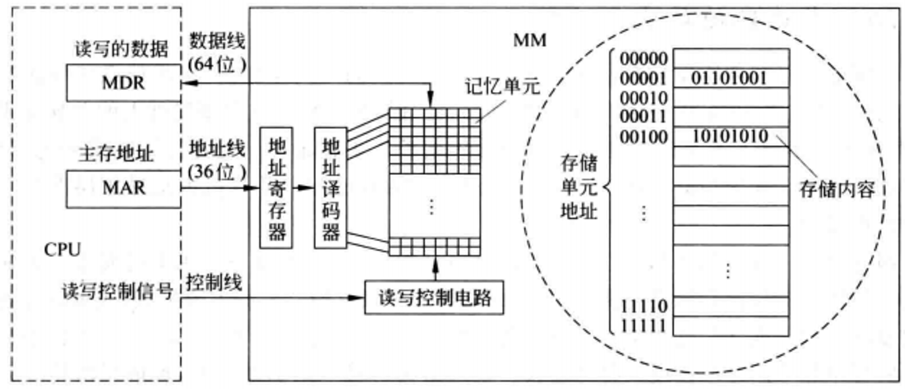
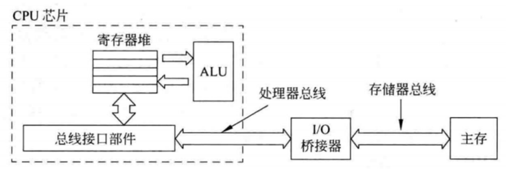
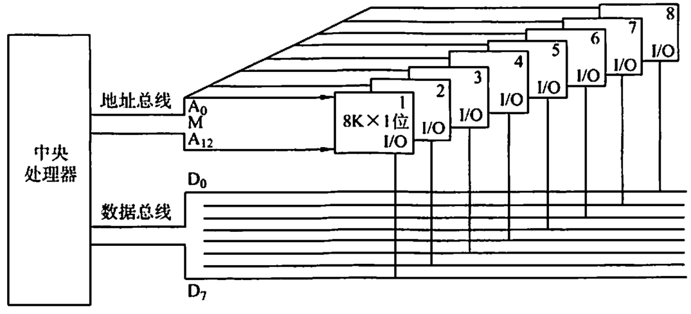
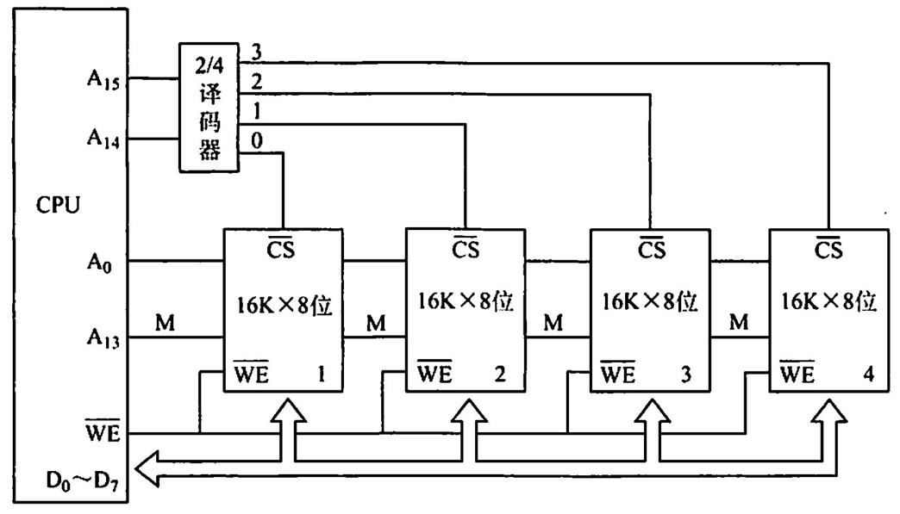
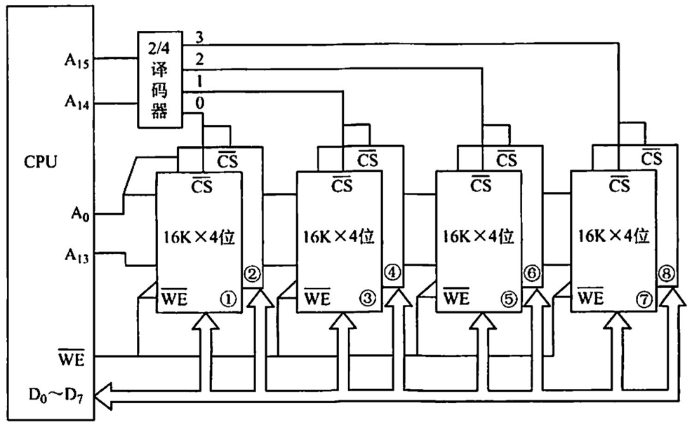

# 主存储器
## 一、主存储器的构成

| ##container## |
|:--:|
||
|主存储器(MainMemory, MM)的基本框图|

其中由一个个存储0或1的记忆单元(cell)构成的`存储阵列`是存储器的核心部分。这种记忆单元也称为`存储元`、`位元`, 它是具有两种稳态的能表示二进制0和1的物理器件。**存储阵列(bank)** 也被称为`存储体`、存储矩阵。为了存取存储体中的信息,必须对存储单元编号, **所编号码就是地址**。**编址单位(addressing unit)** 是指具有相同地址的那些位元构成的一个单位, 可以是一个字节或一个字。对各存储单元进行编号的方式称为编址方式(addressingmode), 可以按字节编址, 也可以按字编址。

1. **CPU**：中央处理器（Central Processing Unit），负责处理和控制整个计算机的操作。

2. **MDR (Memory Data Register)**：内存数据寄存器，用于临时存放从内存读取的数据或者准备写入内存的数据。

3. **MAR (Memory Address Register)**：内存地址寄存器，用来保存当前要访问的内存地址。

4. **地址寄存器**：位于主存储器内部，接收来自CPU的地址，并将其传递给地址译码器以确定正确的存储单元。

5. **地址译码器**：根据接收到的地址信号来选择并激活相应的存储单元。

6. **存储单元**：实际存储数据的地方，每个单元可以存储一位（bit）数据，通常以字节（byte）为基本单位组织起来。

7. **读写控制电路**：负责协调数据的读取和写入过程，包括控制数据线上的数据流动以及向存储单元发送适当的读/写命令。

8. **数据线**：连接CPU和主存储器的线路，用于传输数据。

9. **控制线**：连接CPU和主存储器的线路，用于传输各种控制信号，如读/写信号等。

- 在这个系统中，当CPU需要从主存储器中**读取数据**时，它会首先将所需数据的地址放入MAR，然后发出读请求。这个地址会被传送到主存储器的地址寄存器，接着经过地址译码器找到对应的存储单元。

    与此同时，CPU也会将数据线设置为输入模式，等待从主存储器接收数据。一旦数据准备好，它就会通过数据线传回给CPU，并被存储到MDR中。

- 相反，如果CPU需要将数据写入主存储器，它会先将数据放入MDR，然后将目标地址放入MAR，最后发出写请求。同样地，地址会被传送到主存储器，但这次是触发写操作，使得数据从MDR通过数据线写入到指定的存储单元。

## 二、存储器芯片与 CPU 的连接

| ##container## |
|:--:|
||
|主存与CPU之间的连接|

CPU通过其芯片内的总线接口部件(即总线控制逻辑)与系统总线相连, 然后再通过总线之间的I/O桥接器、存储器总线连接到主存。

注：为了支持不同类型的总线（如处理器总线、存储器总线、I/O总线等）之间的通信，通常会使用`桥接器（也称为桥芯片或北桥/南桥）`来连接这些总线。这些桥接器不仅负责总线之间的信号转换和传输，还可能提供额外的功能，如缓存、中断控制等。然而，需要注意的是，随着计算机技术的发展，许多现代计算机系统已经采用了更加集成化的设计，将许多原本分散在多个芯片上的功能集成到了一个或多个芯片中，从而减少了总线接口和桥接器的数量。

在计算机系统中，总线是连接各个部件（如CPU、主存、I/O设备等）的共享传输介质，它允许这些部件之间进行有效的通信和数据传输。总线通常由控制线、数据线和地址线构成:

- **控制线**：负责传输控制信号，如时钟信号、中断信号、读写信号等，这些信号用于协调总线上的数据传输过程，确保各个部件能够按照预定的顺序和规则进行通信。

- **数据线**：用于在CPU和主存之间传输实际的数据信息。每一根数据线可以传输一位数据，因此`数据线的条数（即位宽）`决定了总线一次能够传输的数据量。现代计算机系统的数据线位宽通常很高，如64位、128位甚至更高，以提高数据传输的效率。例如，如果数据线有32条，则数据传输的宽度为32位。

- **地址线**：用于指定主存中数据的存储位置（即地址）。CPU在需要读取或写入主存中的数据时，首先会通过地址线发送数据的地址信息，然后主存根据这个地址信息找到相应的存储单元，进行数据的读写操作。

在CPU和主存之间交换信息时，整个过程通常如下:

CPU首先通过总线接口部件（即总线控制逻辑）将需要访问的主存地址发送到`地址线`上。同时，CPU还会发送相应的总线控制信息到`控制线`上，以指示这是一次`读操作`还是`写操作`，并协调其他可能的总线活动。

一旦地址和控制信息被发送出去，CPU和主存之间就可以通过数据线开始传输数据了。
- 如果是`读操作`，主存会将指定地址中的数据发送到数据线上，供CPU读取；
- 如果是`写操作`，CPU会将数据发送到数据线上，由主存存储到指定地址中。

## 三、存储器芯片的扩展
受限于物理尺寸、功耗、散热和成本等因素，单个存储芯片的容量和性能都有其极限。

为了构建更大容量和更高性能的主存储器系统，就好像我们经常看见的内存条，**将多个芯片做在一个主存模块(即内存条)上**，然后由多个主存模块以及主板或扩充板上的RAM 芯片和 ROM 芯片组成一台计算机所需的主存空间，再通过系统总线和 CPU 相连。

内存条插槽就是存储器总线，内存条中的信息通过内存条的引脚，
再通过插槽内的引线连接到主板上,通过主板上的导线连接到北桥芯片或CPU芯片。

单个芯片的容量是有限的，因此通过存储器芯片扩展技术，将多个芯片集成在一个内存条上。

描述主存大小：128MB，这个是以字节为单位进描述的。

我们知道计算机一次能直接处理的二进制数据的位数 是一个字的大小（即字长）。所以我们可以基于字长来描述主存大小：例如字长为32位，则128MB=32M * 32b，即有32M个字，每个字为32位。

由于单个存储芯片在字数或字长方面与实际存储器的要求都有差距，因此需要在`字`和`位`两方面进行扩充才能满足实际存储器的容量要求。

### 3.1 位扩展
位扩展的目标是增加存储器的数据总线宽度，也就是说，增加每个存储单元能同时读写的数据位数。

例如，假设有一个8位的存储芯片，这意味着每个存储位置只能存储8位的数据。但是，如果系统需要的是32位的数据宽度，那么就需要使用位扩展技术。

位扩展是指在不改变存储单元数量（即存储容量--字数）的情况下，通过增加存储单元的位数来扩展存储器的字长。也就是说，当存储器的存储容量满足需求，但字长不足时，可以采用位扩展技术。

实现方式:

- `并联`多个相同规格的存储芯片，让它们共享相同的地址线和控制线，但各自拥有独立的数据线。

假设需要8位的宽度，你可以并联8个1位的芯片，每个芯片的数据线都连接到系统总线的不同部分，这样，当一个地址被激活时，8个芯片将同时读写数据，共同构成一个8位的数据字。

| ##container## |
|:--:|
||

- **地址线与控制线连接**：所有存储器芯片的地址线和控制线（如读写控制线R/W）都直接相连，因为它们需要共享相同的地址和控制信号。

- **数据线连接**：将多个芯片的数据线分为高位和低位（或其他分组方式），分别连接到系统的数据总线上。这样，当进行读写操作时，多个芯片会同时被选中，但各自负责传输数据的一部分。

- **片选信号**：由于所有芯片都共享相同的地址和控制信号，因此它们的片选信号（CS）通常也连接在一起，或者不需要单独的片选信号（取决于芯片设计）。

### 3.2 字扩展
字扩展的目标是增加存储器的地址空间，即增加存储器的深度，允许存储更多的数据字。在不改变存储单元位数（即字长）的情况下，通过增加存储单元的数量来扩展存储器的容量。也就是说，当存储器的字长满足需求，但存储容量不足时，可以采用字扩展技术。

- `串联`多个相同规格的存储芯片，让它们共享相同的数据线和控制线，但各自拥有独立的地址线。

假设你需要4K字节的存储空间，你可以串联4个1K字节的芯片，通过地址译码器来选择当前操作的是哪一个芯片。地址线的一部分用于选择芯片，另一部分用于在选定的芯片内定位具体的存储位置。

用4片`16K * 8位`的RAM芯片组成`64K * 8位`的存储器。4片RAM芯片的数据线 $D_0$ ~ $D_7$, 和 $WE$ 都分别连在一起。将 $A_{15}A_{14}$ 用作片选信号，$A_{15}A_{14} = 00$ 时，译码器输出端 $0$ 有效，选中最左边1号芯片; $A_{15}A_{14} = 01$ 时，译码器输出端 $1$ 有效，选中2号芯片，以此类推(同一时刻只能有一个芯片被选中)。

| ##container## |
|:--:|
||

- **地址线连接**：将所有存储器芯片的地址线分为高位地址线和低位地址线。低位地址线直接相连，用于选择芯片内的存储单元；高位地址线则通过译码器与各个芯片的片选信号（CS）相连，用于区分不同芯片的地址范围。

- **数据线与控制线连接**：所有芯片的数据线（ $D_0$ ～ $D_n$ ）和控制线（如读写控制线R/W）都直接相连，因为它们共享相同的数据传输和控制信号。

- **译码器与片选信号**：使用译码器对高位地址进行译码，产生各个芯片的片选信号。当某个芯片被选中时，其片选信号为低电平（或高电平，取决于电路设计），允许该芯片参与数据传输；其他芯片则处于未选中状态，不参与数据传输。

用4片`16K * 8位`的RAM芯片组成`64K * 8位`的存储器。各芯片的地址分配如下:
- 第一片，最低地址: `00`00 0000 0000 0000 最高地址: `00`11 1111 1111 1111 (16 位)
- 第二片，最低地址: `01`00 0000 0000 0000 最高地址: `01`11 1111 1111 1111
- 第三片，最低地址: `10`00 0000 0000 0000 最高地址: `10`11 1111 1111 1111
- 第四片，最低地址: `11`00 0000 0000 0000 最高地址: `11`11 1111 1111 1111

### 3.3 字位同时扩展
在实际应用中，位扩展和字扩展通常是结合使用的，以同时增加存储器的宽度和深度。就是指通过同时使用多个存储器芯片，在增加存储单元数量的同时，也增加每个存储单元的位数，从而扩展整个存储器的容量和字长。

当存储器的现有容量和字长均不满足系统需求时，可以采用字位扩展技术。

字位同时扩展的连接方式:
- 将进行位扩展的芯片作为一组，各组的连接方式与位扩展的相同；由系统地址线高位译码产生若干片选信号，分别接到各组芯片的片选信号。

例子: 用8片`16K * 4`位的RAM芯片组成`64K * 8位`的存储器。

每两片构成一组`16K * 8位`的存储器(位扩展)，4组便构成`64K * 8位`的存储器(字扩展)。

地址线 $A_{15}A_{14}$ 经译码器得到4个片选信号：

$A_{15}A_{14} = 00$ 时，输出端0有效，选中第一组的芯片(①和②);

$A_{15}A_{14} = 01$ 时，输出端1有效，选中第二组的芯片(③和④)，以此类推。

| ##container## |
|:--:|
||

## 四、组成一个主存
1. 合理选择存储芯片

    要组成一个主存系统，选择存储芯片是第一步， 主要指存储芯片的类型(RAM或ROM)和数量的选择。通常选用ROM存放系统程序、标准子程序和各类常数，RAM则是为用户编程而设置的。此外，在考虑芯片数量时，要尽量使连线简单、方便。`ROM-系统区`，`RAM-用户区`。

2. 地址线的连接

    存储芯片的容量不同，其地址线数也不同，而CPU的地址线数往往比存储芯片的地址线数要多。

    通常**将CPU地址线的低位与存储芯片的地址线相连**，以选择芯片中的某-一单元(字选),这部分的译码是由芯片的片内逻辑完成的。而**CPU地址线的高位则在扩充存储芯片时使用，用来选择存储芯片(片选)**，这部分译码由外接译码器逻辑完成。

    例如，设CPU地址线为16位，即 $A_{15}$ ~ $A_0$, 1K * 4 位的存储芯片仅有10根地址线，此时可将CPU的低位地址 $A_9$ ~ $A_0$ 与存储芯片的地址线 $A9$ ~ $A0$ 相连。

3. 数据线的连接

    CPU的数据线数与存储芯片的数据线数不一定相等，在相等时可直接相连;在不等时必须对存储芯片扩位，使其数据位数与CPU的数据线数相等。

4. 读/写命令线的连接

    读写控制线可以是两根，也可以是一根。

## 附、练习: 考研真题
[2009 统考真题]
- 某计算机主存容量为64KB，其中ROM区为4KB,其余为RAM区，按字节编址。现要用`2K * 8位`的ROM芯片和`4K * 4位`的RAM芯片来设计该存储器，需要上述规格的ROM芯片数和RAM芯片数分别是(~~c?~~D)。
A.1, 15     B. 2,15    C. 1,30    D.2, 30

> 显然`2K * 8位`的ROM芯片-> 4KB, 并且按字节编址, 为串联 2 片

[2010 统考真题]
- 假定用若干`2K * 4位`的芯片组成一个`8K * 8位`的存储器，则地址`0B1FH`所在芯片的最小地址是(~~A?~~D)。# 8 块, 四位
A.0000H     B.0600H     C.0700H     D.0800H

> 8K * 8 位 = 2^3 * 2^10 * 8bit  = 2^{3 + 10 + 3}
>
> 2K * 4位 = 2 * 2^10 * 2^2bit = 2^{1 + 10 + 2}
>
> 2^{3 + 10 + 3} / 2^{1 + 10 + 2} = 2^3 = 8块
>
> 2k = 2^11, 片内地址 11 位, 和 3 位区分芯片块
>
> - 第一组: 0000 0000 0000 0000 ~ 0000 0111 1111 1111
> - 第二组: 0000 1000 0000 0000 ~ 0000 1111 1111 1111
> - 第三组: 0001 0000 0000 0000 ~ 0001 0111 1111 1111
>
> 0B1F -> 0000 1011 1111 -> 第二组 最低位: 0000 1000 0000 0000 -> 0800H

[2021 统考真题]
- 某计算机的存储器总线中有24位地址线和32位数据线，按字编址，字长为32位。若`000000H~3FFFFFH`为RAM区，则需要`512K * 8位`的RAM芯片数为(C)。
A.8   B. 16   C. 32   D. 64

> 24位地址线和32位数据线 是没有的信息
>
> 主要注意`000000H~3FFFFFH`的内容大小是: (3FFFFFH - 000000H + 1) * 32 bit