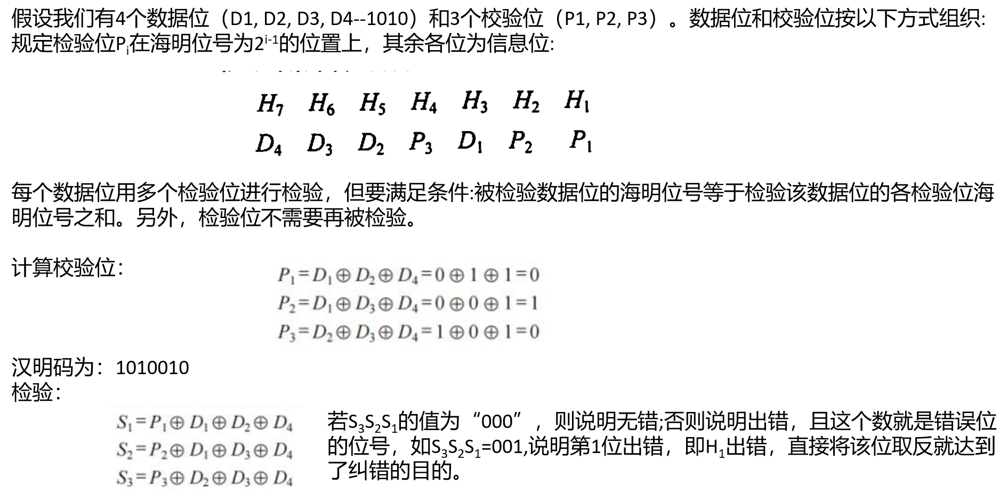

# 可信存储器层次
## 失效
服务状态:
- 假定有某类服务的需求, 针对该需求, 用户可以看到一个系统在两种服务状态之间做出
选择:
    1. 服务实现: 系统正常运作, 提供的服务与用户的需求相符。
    2. 服务中断: 系统出现故障, 提供的服务无法满足用户需求。

失效与恢复:
1. 失效: 系统从服务实现状态转换到服务中断状态的过程。失效可以是永久性的（系统无法自行恢复）或间歇性的（系统可能会自行恢复或需要外部干预来恢复）。
2. 恢复: 系统从服务中断状态转换回服务实现状态的过程。

## 可靠性和可用性

可靠性:

可靠性关注的是系统在特定时间内无故障执行其预期功能的能力。可靠性可以通过平均无故障时间（MTTF）来量化, 它表示系统从开始运行到发生首次故障的平均时间长度。MTTF越长, 表明系统在给定时间内保持不发生故障的能力越强。年失效率（AFR）是从另一个角度衡量可靠性, 它直接给出了系统或设备在一年内预期的失效概率, 便于业界比较和理解不同设备的可靠性水平, 尤其是在MTTF可能涉及非常大的数值时, AFR提供了更直观的视角。

可用性:

虽然可靠性是关于系统在不出故障的情况下持续工作的能力, 可用性则进一步考虑了系统在需要时实际可访问和使用的程度。它不仅涵盖了系统因内部故障而不可用的时间, 还考虑了计划内维护、升级以及其他可能导致服务中断的因素。可用性通常用百分比表示, 在一个时间段内, 系统处于可操作状态的时间占总时间的比例。

一个常用的公式是: $$可用性 = \frac{运行时间−停机时间}{运行时间}×100\%$$

## 服务中断与度量
服务中断的维修平均时间(MTTR)是衡量系统从发生故障到恢复正常服务状态所需时间的指标, 是评估和改善系统维护效率的关键参数。

而平均无故障时间(MTTF)专注于系统或组件在两次故障之间的正常运行时间, 两者结合可以得到平均故障间隔时间(MTBF), 即系统从一次故障中恢复到下一次故障发生之间的平均时间长度。

不过, 根据最新的可靠性工程实践, MTBF的概念已经逐渐被MTTF替代, 因为MTTF更准确地描述了单一组件或系统无故障运行的预期时间, 避免了MTBF可能引起的混淆, 尤其是在考虑维修和恢复时间的情况下。

**MTTR (Mean Time to Repair)**: 指的是系统从故障状态修复到正常工作状态所需的平均时间。这个时间越短, 表示系统恢复能力越强。

**MTBF (Mean Time Between Failure)**: 是系统连续两次故障之间的平均时间。虽然MTBF经常被提及, 但MTTF对于评估系统的无故障运行时间更为直接。

## 可用性的计算
可用性是指系统正常工作时间在连续两次服务中断间隔时间中所占的比例, 计算公式为: $$可用性 = \frac{MTTF}{MTTF+MTTR}$$

这个公式清晰地展示了提高系统可用性的两个途径:
- 一是增加MTTF, 即延长系统无故障运行的时间;
- 二是减少MTTR, 即加快故障检测与修复的速度。

## 可信性

可信性（或者称为系统信任性）虽然不如可靠性和可用性那样可以直接量化, 但它更多地涉及用户对系统能够始终如一地、正确地执行其预期功能的信任程度。它包含了安全性、隐私保护、数据完整性等多个维度, 这些往往通过设计原则、合规性验证、用户反馈等软性指标来评价, 而非简单的数学公式所能概括。增强系统的可信性通常涉及综合措施, 比如加强数据加密、实施严格的身份验证机制、透明的错误处理和通知策略等。

## 纠正一位错、检测两位错的汉明编码
汉明码是一种广泛应用的纠错编码方案, 特别适用于检测并纠正存储器中的 **单比特** 错误, 对于提高数据传输和存储的可靠性至关重要。

汉明距离（Hamming Distance）是衡量两个等长二进制序列差异的一种方法, 它简单地统计两个序列中不同的比特的数量。例如, 序列`1011`和`1101`的汉明距离为`2`, 因为它们在第二和第三位上不同。

在编码设计中, 如果码字间的最小汉明距离为2, 这意味着任何两个合法码字之间至少有两位不同。然而, 这样的编码只能区分完全相同的码字和恰好有一位差异的码字, 但无法明确区分是哪一位出错, 也无法区分是一位错误还是多位错误。因此, 如果要求能够检测并纠正单比特错误, 编码方案必须设计得更加巧妙, 确保码字间的最小汉明距离至少为3。

- 检错: 检查 $d$ 位错误, 编码的码距要 $d+1$ 位。
- 纠错: 纠正 $d$ 位错误, 编码的码距要 $2d+1$ 位 。

实际上, 汉明码就是一种能够实现单比特错误检测和纠正的编码方案。在汉明码中, 通过增加校验位（冗余位）到原始数据中, 并精心设计这些校验位的位置和计算方式, 使得任意两个合法码字间的最小汉明距离至少为`3`。这样, 即使有一个比特出错, 通过计算接收到的码字与所有合法码字之间的汉明距离, 可以确定出错的位置并进行纠正, 从而保证数据的完整性。

汉明码的设计巧妙地平衡了校验能力和额外开销, 是计算机科学和通信领域的一项基础且重要的技术。

## 奇偶校验
汉明使用奇偶校验码进行错误检测。

奇偶校验是一种简单而有效的错误检测方法, 尽管它只能检测出数据中有奇数个比特出错的情况, 而无法检测偶数个比特错误, 也不能确定错误的具体位置。

奇偶校验的工作原理如下:

1. 奇校验: 在数据位之外增加一个校验位, 使得整个码字（包括数据位和校验位）中1的个数为奇数。当存储或传输数据时, 先计算数据位中1的个数, 如果为偶数, 则校验位设为1, 使总和变为奇数；如果为奇数, 则校验位设为0。

2. 偶校验: 与奇校验相反, 偶校验确保整个码字中1的个数为偶数。数据位中1的个数如果是奇数, 则校验位设为1；如果是偶数, 则设为0。

在读取数据时, 再次计算包括校验位在内的码字中1的个数, 如果计算结果与预设的奇偶性（奇校验或偶校验）不符, 就说明至少有一个比特在存储或传输过程中发生了错误。但是, 奇偶校验无法指出是哪一位错了, 也无法处理多位同时出错的情况, 因此它的错误检测能力有限。

## 汉明码
汉明码的基本原理
1. **错误检测与纠正**: 汉明码的主要目的是检测并纠正数据传输或存储过程中的**单一比特错误**。
2. **校验位**: 通过在数据位中插入额外的校验位（也称为冗余位或纠错位）, 汉明码能够检测并纠正错误。
3. **汉明距离**: 汉明码的设计基于汉明距离的概念, 即两个等长二进制数之间不同位的数量。在汉明码中, 不同有效码字之间的最小汉明距离通常大于1, 以确保能够检测和纠正错误。

汉明码的构造
1. **分组**: 数据位和校验位被组织成不同的组, 每个组都与一个或多个校验位相关联。
2. **校验位计算**: 通过异或（XOR）运算计算每个校验位的值, 以确保每个数据位都被一个或多个校验位所覆盖。

汉明码的校验与纠错
1. **校验**: 在接收端, 通过重新计算校验位的值并与发送的校验位进行比较, 可以检测数据中是否存在错误。
2. **纠错**: 如果检测到错误, 通过比较不同校验位的状态, 可以确定哪个数据位发生了错误, 并进行纠正。

实例

| ##container## |
|:--:|
||

(不明白的话了解先, 计网会细讲的说)