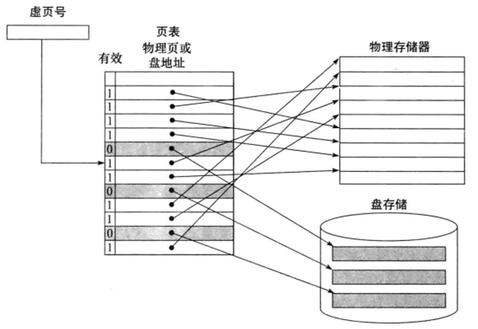

# 虚拟存储器
**虚拟存储器(Virtual Memory)** 是一个关键的计算机**技术**, 虚拟存储器将主存或辅存的地址空间统一编址, 形成一个庞大的地址空间, 在这个空间内, 用户可以自由编程, 而不必在乎实际的主存容量和程序在主存中实际的存放位置。虚拟存储器通过结合物理主存和磁盘存储(或其他形式的辅助存储器)来工作, 从而提供了一个统一的地址空间, 让程序认为它们拥有足够的内存来运行。

> [!TIP]
> 虚拟存储器 是 技术!
>
> > 简单地说就是虚拟内存嘛, 类比Linux的交换区. 内存放不下, 就把不常用的放到外存中嘛~, 完了之后嘞, 还有其他内容..

具体而言:

虚拟存储技术: 程序员在一个不受物理内存空间限制并且比物理内存空间大得多的虚拟的逻辑地址空间中编写程序, 就好像每个程序都独立拥有一个巨大的存储空间一样。程序执行过程中, 把当前执行到的一部分程序和相应的数据调人主存, 其他暂不用的部分暂时存放在磁盘上。这种借用外存为程序提供的很大的虚拟存储空间称为虚拟存储器。

---

虚拟存储器机制为程序员提供了一个极大的虚拟(逻辑)地址空间, 它是主存和磁盘I/O设备的抽象。虚存机制给每个进程带来了一个假象, 好像每个进程都独占使用主存, 并且主存空间极大。

1. 每个进程具有一致的虚拟地址空间, 从而可以简化存储管理。

2. 它把主存看成是磁盘存储器的一个缓存, 在主存中仅保存当前活动的程序段和数据区, 并根据需要在磁盘和主存之间进行信息交换, 通过这种方式, 使有限的主存空间得到了有效利用。

3. 每个进程的虚拟地址空间是私有的, 因此, 可以保护各自进程不被其他进程破坏。

虚拟存储器机制中, 每个源程序经编译、汇编、链接等处理生成可执行的二进制机器目标代码时, 每个程序的目标代码都被映射到同样的虛拟地址空间, 因此, 所有用户进程的虚拟地址空间是一致的。

## 发明动机
**消除物理内存限制对程序设计的影响**：这是虚拟存储器最早也是最核心的设计动机。在20世纪50年代末到60年代初, 计算机内存价格昂贵且容量有限, 这严重限制了程序员编写大型程序的能力。虚拟存储器技术通过将物理内存视为磁盘上更大地址空间(虚拟地址空间)的缓存, 使得程序可以使用超出物理内存大小的地址空间。操作系统通过页表管理和页面置换算法, 将当前活跃的部分数据和指令加载到物理内存中, 不活跃的部分则暂时移出到磁盘上, 从而实现了对大程序的支持, 极大地释放了程序员的创造力。

**提高内存使用效率和程序隔离**：虽然不是最初的设计动机, 但虚拟存储器也促进了内存资源的高效利用和进程间的隔离。通过为每个进程分配独立的虚拟地址空间, 操作系统能够保证进程间的内存独立, 防止一个进程意外或恶意地修改其他进程的数据, 增强了系统的安全性和稳定性。此外, 页面级别的内存分配和回收机制提高了内存的复用率, 减少了碎片化问题。

## 云计算时代的虚拟存储器
随着时间的推移, 云计算的兴起使得虚拟存储器的第一个设计动机相对减弱, 而第二个设计动机变得更加重要。

在云计算环境中, 虚拟存储器技术(特别是虚拟化技术)允许服务提供商在单个物理服务器上运行多个虚拟机(VM), 每个虚拟机都有自己的操作系统和应用程序。通过为每个虚拟机提供独立的虚拟地址空间, 服务提供商可以确保虚拟机之间的隔离性和安全性, 同时实现资源的高效共享和动态分配。

因此, 可以说在云计算时代, 虚拟存储器的主要设计动机已经转变为**允许多个虚拟机之间有效而安全地共享存储器**。然而, 消除物理内存大小对程序设计造成的限制仍然是虚拟存储器的一个重要功能, 特别是在处理大型数据集和运行复杂计算任务时。

## 虚拟地址空间
为了允许多个虚拟机共享同一个存储器, 我们必须在虚拟机之间进行保护, 确保每个程序只能对划分给它的那部分主存进行读写操作。

在虚拟存储器系统中, 每个进程(或虚拟机)都被分配了一个虚拟地址空间, 这个空间是连续的, 并且在逻辑上是私有的。这意味着进程只能访问分配给它自己的虚拟地址空间中的内存, 而不能直接访问其他进程的内存。这种隔离性是通过地址转换机制来实现的, 该机制将进程的虚拟地址转换为物理地址。

地址转换通常是由内存管理单元(MMU)或类似的硬件组件完成的, 它使用页表(Page Table)或其他数据结构来存储虚拟地址到物理地址的映射。页表是一个数据结构, 其中包含了虚拟页号到物理页框号的映射。当进程尝试访问内存时, MMU会查找页表, 找到对应的物理地址, 并将访问重定向到该物理地址。

| ##container## |
|:--:|
||

- 分页: 虚拟空间(可执行文件)和物理内存分页, 页大小不固定
- 虚拟地址: 虚拟页号 页内地址 --> 页面/页
- 物理地址: 主存页号 页内地址 --> 页框/实页

虚拟存储器技术: 把内存和外存统一编址

把内存当作外存的缓存

- cpu --> 虚拟地址 --> 虚拟页号 --> 页表

由于页表可能非常大, 并且频繁地访问页表会导致性能下降, 因此现代计算机通常使用缓存技术来加速地址转换。

这种技术被称为**快表(TLB, Translation Lookaside Buffer)**, 它存储了最近使用的虚拟地址到物理地址的映射。当MMU需要查找页表时, 它首先会检查TLB中是否有相应的条目。如果有, 则直接使用TLB中的映射, 从而避免了访问页表的高开销。

局部性原理在虚拟存储器中同样适用。由于程序在执行时通常只会频繁地访问其地址空间的一小部分(即活跃部分), 因此虚拟存储器系统可以利用这一原理来提高性能。具体来说, 虚拟存储器系统会将进程当前活跃的部分加载到物理内存中, 并将不活跃的部分交换到磁盘上的交换空间中。当进程需要访问不在物理内存中的内存页时, 会触发一个页面错误, 此时操作系统会将所需的页面从磁盘加载到物理内存中, 并替换出某个不活跃的页面。

## 虚拟存储器主要作用
- ### 虚拟地址空间与保护

    每个程序拥有自己独立的虚拟地址空间, 这是一个逻辑上的连续地址范围, 程序的所有指令和数据都映射到这个空间中。虚拟地址空间的隔离是通过硬件和操作系统协作实现的, 确保了一个程序不能直接访问到另一个程序的地址空间, 从而提供了内存保护。这种隔离机制是通过内存管理单元(MMU)和页表(Page Table)实现的, MMU负责将程序产生的虚拟地址转换为实际的物理地址, 同时检查访问权限, 防止非法访问。

- ### 动态内存共享与分配

    虚拟机之间的内存共享情况是动态变化的, 特别是在云计算环境中, 虚拟机的创建、销毁、迁移和资源调整都是常态。虚拟存储器的灵活性在于它能够动态地映射虚拟地址到物理地址, 使得即使物理内存资源在不同虚拟机之间动态分配, 也能确保每个虚拟机看到的是自己独立且连续的地址空间。这一特性允许高效的资源共享, 同时保持了程序间的隔离和安全性。

- ### 编译与地址空间无关性

    在编译时, 程序通常被编译为使用虚拟地址, 而不是物理地址, 这使得程序代码可以在任何拥有足够虚拟地址空间的环境中运行, 而无需预先知道物理内存布局或与其他程序的关系。这种编译时的地址空间无关性(Address Space Layout Randomization, ASLR)不仅增强了安全性, 还提升了程序的可移植性和灵活性。

- ### 地址转换与保护机制

    地址转换过程涉及到将虚拟地址转换为物理地址, 这一步骤通常伴随着权限检查, 确保进程只能访问其被允许的内存区域。例如, 操作系统会标记某些页面为只读或不允许访问, 当进程试图违反这些规则时, MMU会触发一个异常(如页面错误), 操作系统则可以根据异常类型采取相应措施, 如终止进程或调整内存布局。

## 第二动机：减轻负担
虚拟存储器技术引入的另一个重要动机, 它极大地减轻了程序员在处理大型程序时的负担, 提升了开发效率和程序的可管理性。

虚拟存储器允许程序使用比物理主存更大的地址空间, 并通过自动处理程序段(或称为页面)在主存和辅助存储器(如磁盘)之间的加载和卸载, 从而大大简化了内存管理。

在传统方法中, 程序员需要手动管理内存, 将程序划分为多个段, 不会访问未加载的段或超出存储器的总容量。这种做法既繁琐又容易出错, 对程序员来说是一个巨大的负担。

虚拟存储器的引入彻底改变了这种情况。

它通过将程序的地址空间划分为固定大小的页面(而不是由程序员定义的任意大小的段), 并使用页表来管理虚拟地址到物理地址的映射, 从而实现了自动的内存管理。当程序需要访问某页面时, 如果该页面已经在内存中, 则直接访问; 如果不在内存中, 则触发页面错误, 由操作系统负责将该页面从磁盘加载到内存中。同时, 操作系统还会根据需要选择某个页面进行换出, 以便为新页面腾出空间。

通过这种方式, 虚拟存储器不仅消除了程序员手动管理内存的需要, 还提高了内存的使用效率。它允许程序使用比物理主存更大的地址空间, 从而能够处理更大的数据集和更复杂的计算任务。同时, 由于页面错误和页面换出的存在, 虚拟存储器还能够有效地利用有限的物理内存资源, 避免内存不足的情况发生。

## 虚拟存储器自动管理内存
**自动分页/分段**：虚拟存储器系统通过自动的页面或段管理机制, 无需程序员干预, 就能将程序的不同部分(代码、数据)动态地映射到物理内存中。操作系统根据程序的运行时需求, 决定哪些部分需要加载到物理内存, 哪些可以从内存中移出到磁盘上, 从而实现了对大程序的透明支持。

**地址空间扩展**：虚拟地址空间允许程序认为自己拥有一个连续、庞大的地址空间, 远超实际物理内存的大小。这种“虚拟”的扩展让程序员在编写代码时不必考虑物理内存的实际限制, 可以更加专注于程序逻辑本身, 提高了编程的抽象层次和效率。

**内存保护**：除了自动管理内存外, 虚拟存储器技术还内置了内存保护机制, 确保了程序只能访问其自身地址空间内的数据和代码, 防止了不同程序间的非法访问或意外修改, 增强了系统的稳定性和安全性。

**模块化编程的促进**：虚拟存储器的引入使得程序可以自然地划分为模块或库, 每个模块可以独立编译和链接, 而不需要程序员直接管理模块之间的覆盖加载。这促进了软件工程中模块化设计的发展, 提高了代码的重用性和维护性。

## 虚拟存储器和缓存
**虚拟存储器和缓存虽然在工作原理上是相似的**, 但由于它们的历史根源和应用场景的不同, 使用了不同的术语。

- **页(Page)与块(Block)**：在虚拟存储器体系中, 数据被组织成固定大小的页, 这是虚拟地址空间和物理地址空间之间映射的基本单位。而在Cache中, 数据通常被分成块, 作为Cache与下一层存储(如主存)交换数据的单位。

- **缺页(Page Fault)与Cache Miss**：缺页是指处理器尝试访问一个尚未加载到物理内存中的虚拟页时发生的事件, 此时需要操作系统介入, 将所需页从二级存储(如磁盘)加载到主存中。Cache Miss则指的是处理器在Cache中未找到请求的数据块, 需从下一级存储(如主存)获取。

- **地址映射与转换**：虚拟存储器中的地址转换过程涉及将虚拟地址转换为物理地址, 这一过程通过页表(Page Table)或更高效的转换查找缓冲区(Translation Lookaside Buffer, TLB)来完成。操作系统维护页表, 记录了虚拟页到物理页的映射关系。当处理器生成一个虚拟地址时, 硬件(MMU)利用页表或TLB进行转换, 以确定实际的物理地址。

## 当今存储层次结构
**个人移动设备**：在现代移动设备中, 存储层次结构通常由快速但容量较小的DRAM(如LPDDR, 低功耗双倍速率SDRAM)作为主存, 以及更高容量但较慢的闪存(如NAND Flash)作为辅助存储。虚拟存储器技术确保了操作系统和应用程序可以高效地使用这两级存储。

**服务器环境**：在服务器和数据中心场景中, DRAM(动态随机存取存储器)仍然是作为高速主存的首选, 而磁盘(通常是SATA/SAS SSD或NVMe SSD)或更传统的HDD(机械硬盘)用于提供大量的非易失性存储。虚拟化技术使得服务器能够高效地在多个虚拟机之间共享这些物理资源, 同时保持每个虚拟机的独立地址空间。

虚拟存储器和缓存虽然在工作原理上有相似之处, 但由于它们的应用场景和历史根源的不同, 使用了不同的术语和配置。虚拟存储器通过页和缺页机制实现程序的地址空间与物理内存的映射, 从而允许程序使用比物理内存更大的地址空间。同时, 它也为操作系统提供了有效的内存管理机制, 可以自动处理内存不足和内存碎片化等问题。

对于虚拟存储器更详细的介绍, 我们会在**操作系统**当中具体的去描述。这里就不再做更详细的讲解了。大家清楚这个概念就好了。
