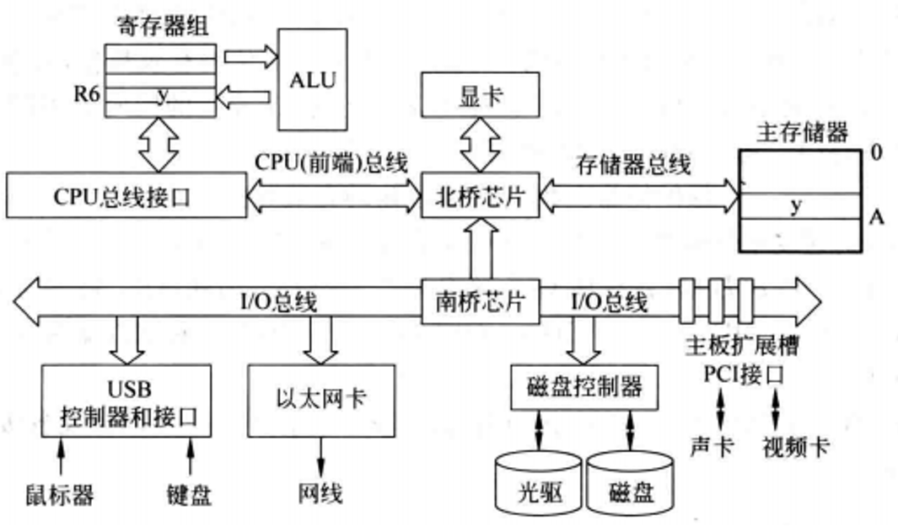

# 外部设备及总线
输入输出(I/O)系统是计算机系统中一个重要的软硬件结合的子系统, 是计算机架构中的核心组件, 它负责管理和优化CPU、内存与外围设备间的数据交流。

这个系统由硬件和软件两大部分构成：包括外部设备本身、它们的接口电路、I/O控制器以及驱动这些组件的软件。

其主要职责在于有效管理信息的输入与输出, 确保数据可以顺畅且高效地在不同系统组件之间流动。

实现这一目标的关键在于构建一条高效的数据传输通道, 连接主存储器与外部设备。同时, I/O系统必须能够理解并执行用户的I/O请求, 将其转化为具体的设备控制指令。此外, 为每个外部设备分配地址也至关重要, 这样CPU才能准确识别并访问所需的设备。I/O硬件与软件需要协同工作, 以保证数据在主机与外设间传输的正确性和效率。

接下来的内容将深入探讨常见的外部设备类型, 分析I/O接口的设计原理和架构, 解释外部设备的地址编码和寻址机制, 以及详细说明主机与外设数据交互的不同控制模式。

## 外部设备
`输入输出设备`, 通常简称为`外设`, 是计算机系统与用户或其他机器进行信息交互的重要桥梁。这些设备被设计用于接收来自外部环境的数据和指令, 并将它们转换成计算机内部可处理的二进制格式, 同时也负责将计算机处理后的结果以人类或其他系统可理解的形式呈现出来。

分类：外设按 **`信息的传输`** 方向来分,可分成输入设备、输出设备、输入输出设备

输入设备的主要任务是从外界获取信息, 例如:
- 键盘和鼠标允许用户向计算机输入文本和命令。
- 扫描仪和数码相机用于捕捉图像, 并将其转化为数字信号。
- 麦克风收集声音, 将其转换为数字音频数据。
- 传感器和测量仪器将物理量如温度、压力或位置变化转换为电信号, 再进一步转化为计算机可读的数字信息。

输出设备则负责将计算机处理过的数据以多种格式展示给用户或发送给其他系统, 例如:
- 显示器和投影仪用于显示文本、图形和视频。
- 打印机将文档或图像打印在纸张上。
- 扬声器和耳机将数字音频信号转换回声波。
- 控制器和驱动器可能将数字指令转化为物理动作, 比如机器人手臂的移动或机械系统的启动。

除了专门的输入和输出设备外, 还有一类既可以输入信息又可以输出信息的设备, 被称为输入输出设备 (I/O 设备), 这类设备具有双向功能, 既能作为输入设备也能作为输出设备。例如:

- 磁盘驱动器、磁带机、光盘驱动器可以读取数据(输入), 也可以写入数据(输出)。通信设备如网络适配器(网卡)用于在计算机之间传输数据, 既接收也发送数据。

---

分类：如果按照 **`功能`** 将外部设备分为：人机交互设备、存储设备、机-机通信设备

1. 人机交互设备: 这些设备设计用于使用户能够与计算机系统进行直接的交互, 如输入命令、数据或接收反馈。常见的例子包括键盘、鼠标、触摸屏、显示器和打印机。这些设备通常以字符或行为基础进行数据传输, 因此被称为字符型设备。

2. 存储设备: 存储设备用于长期保存数据和程序, 当计算机关闭后, 存储在这些设备上的信息不会丢失。典型的存储设备包括硬盘驱动器(HDD)、固态硬盘(SSD)、USB闪存盘、CD/DVD/蓝光光盘驱动器和磁带机。这些设备通常以块为单位传输数据, 即一次传输多个字节的数据。

3. 机机通信设备: 这类设备主要用于实现计算机之间的数据通信, 是构建网络的基础。包括网络接口卡(NIC, 即网卡)、调制解调器、路由器、交换机、以及用于信号转换的数模转换器(DAC)和模数转换器(ADC)。这些设备使得不同计算机系统之间能够共享资源和信息。

### 特点
**异步性**:
- 外部设备与CPU的运行节奏并不一致, 它们没有共享的时钟信号, 各自的工作速度差异极大。这种异步性意味着外设的操作独立于CPU的控制周期, 但又需要在适当的时间点响应CPU的控制指令。为了不影响CPU的高性能运行, 输入输出操作必须设计得能够与CPU并行执行, 从而实现CPU与外设、外设与外设之间的并行工作。

**实时性**:
- 在一个配备了多种外设的系统中, 这些设备既有低速的也有高速的。CPU必须能够适应这些设备的不同传输速率和方式, 即时接收或发送信息, 以免高速设备因等待而浪费时间, 或者低速设备因跟不上节奏而丢失数据。这就要求输入输出系统具备良好的实时响应能力。

**多样性**:
- 外设的种类繁多, 从简单的键盘到复杂的磁盘驱动器, 它们的物理特性和信息格式各不相同。这种多样性导致了主机与外设之间连接的复杂度增加。为了解决这个问题, 计算机系统通常会提供标准化的接口, 这样外设可以通过各自的设备控制器与这些标准接口连接。主机通过标准接口与外设通信, 无需关心特定外设的具体细节, 只需使用统一的控制命令即可。

为了应对这些特点, 计算机系统通常会采用多种策略, 如中断机制、直接内存访问(DMA)、缓冲技术、以及高级的输入输出控制方式, 如I/O通道和I/O处理器, 以实现高效、实时和灵活的外设管理。

### 外设和CPU、主存的连接
计算机系统主要由主存储器(内存)和各种输入输出(I/O)外部设备组成, 而所有的功能都是由中央处理器(CPU)通过执行存储在主存中的指令序列来实现的。

在指令执行的过程中, CPU会频繁地与主存和其他外部设备进行数据交换。例如, CPU从内存中读取指令和数据, 将数据处理结果写回到内存, 或者将数据传输给外部设备进行输入输出操作。此外, 外部设备也会产生中断信号, 通知CPU某些事件的发生, 如数据已准备好或操作已完成。这些信息的交换是计算机系统执行各种任务的基础。

为了支持这些信息的交换, 计算机系统内需要有通信线路将各个部件连接起来。这些通信线路和相关控制机制共同构成了互连结构。互连结构可以是简单的总线系统, 也可以是复杂的交叉开关矩阵或网格网络, 具体取决于系统的规模、性能需求和设计复杂度。

在互连结构中, 总线是最常见的一种形式, 它允许多个设备共享一条通信路径。

总线通常分为数据总线、地址总线和控制总线, 分别用于传输数据、指定数据的目标地址和控制数据的流向。

更复杂的互连结构, 如交叉开关和网格网络, 则在大规模并行处理系统或多处理器系统中更为常见, 它们提供了更高的带宽和更低的通信延迟, 以支持高效的数据交换和并行处理能力。

## 总线
### 部件之间互连的方式
计算机系统中部件之间互连的两种主要方式：分散连接(也称为点对点连接)和总线连接。这两种方式各有优缺点, 适用于不同的场景和需求。

分散连接:
- 分散连接指的是每个部件与其他部件之间都有单独的连接线路。这种方式在早期的计算机设计中较为常见, 尤其是在小规模系统中。分散连接的优点在于信号路径简单, 容易实现点对点的精确控制。然而, 随着系统规模的增大, 分散连接会导致布线复杂、成本高昂, 且扩展性差。

总线连接:
- 总线连接则是指多个部件共享一组公共的传输线路进行通信。总线可以分为地址总线、数据总线和控制总线, 分别用于传输地址信息、数据和控制信号。总线连接的优势在于其灵活性和经济性, 因为它允许系统轻松地添加新的部件, 且减少了连线数量, 降低了成本。总线结构还支持部件的互换性, 只要它们遵循相同的通信协议和标准。

然而, 总线连接的主要缺点是可能会出现通信瓶颈, 特别是在多个部件同时尝试访问总线时, 这可能导致数据传输延迟。为了解决这一问题, 现代计算机系统采用了诸如总线仲裁、优先级调度和多级总线架构等机制, 以优化总线的使用效率和减少冲突。

随着技术的进步和需求的变化, 一些系统也开始采用更高级的互连方式, 如交叉开关(Crossbar Switch)或网络式(Network-on-Chip, NoC)结构, 以克服总线连接的通信瓶颈和可靠性问题。这些新技术在提供更高带宽、更低延迟和更好可靠性的同时, 也带来了更高的设计复杂性和成本:

交叉开关(Crossbar Switch):
- 交叉开关是一种点对点的互连方式, 它允许任意输入端与任意输出端之间的直接连接而不必经过中间节点。这种结构可以显著降低延迟, 因为数据可以直接从源传送到目的地, 而不需要在总线上竞争。交叉开关特别适用于需要高带宽和低延迟的场合, 如高性能计算集群、数据中心内部的服务器互联, 以及多处理器系统中的通信。

网络芯片(Network-on-Chip, NoC):
- 随着片上系统(SoC)设计的复杂度增加, 传统的总线和交叉开关可能无法满足日益增长的内部通信需求。NoC是一种在单个芯片内部实现的网络架构, 它将芯片上的各个功能模块(如处理器核心、内存控制器、I/O接口等)通过类似于网络的结构连接起来。NoC通常采用包交换技术, 类似于互联网数据包的路由和转发, 可以有效地处理多点对多点的通信, 支持复杂的并行和分布式计算任务。

### 总线的类别
总线是计算机内数据传输的公共路径, 旨在实现两个或更多部件之间的信息交换。它就如同城市中的交通主干道, 让各个区域的信息能够顺畅流通。

计算机系统中有多种总线,它们在各个层次上提供部件之间的连接和信息交换通路:

1. 内部总线

    内部总线存在于芯片内部, 连接着芯片内的各个元件。例如在 CPU 芯片中, 内部总线将各个寄存器、指令部件等元件相互连接。可以想象成 CPU 芯片内部的“微循环通道”, 确保内部元件之间的快速沟通。比如, 当指令从存储器加载到 CPU 时, 内部总线迅速将指令传递到相应的执行部件。

2. 系统总线

    跨越了芯片之间的界限, 连接了计算机系统中的主要部件, 包括CPU、存储器(如RAM和ROM)、各种I/O模块(如显卡、声卡、网卡、硬盘控制器等)。系统总线是计算机系统中最为关键的总线之一, 它负责在CPU、存储器和I/O设备之间传输数据和指令。<b style="color:gold">通常所说的总线是指这类总线</b>。根据传输信息的不同, 系统总线通常被划分为数据总线、地址总线和控制总线。

### 系统总线
- **数据总线**：用于在CPU与存储器或I/O设备之间传输数据。数据总线是用于传输实际数据的线路集合。数据总线的宽度(即总线中数据线的数量)决定了每次可以传输的数据量。例如, 一个32位的数据总线可以一次性传输32位的数据, 而64位总线则可以传输64位的数据。数据总线的宽度直接影响了系统的数据传输速率。

- **地址总线**：用于指定CPU将要访问的存储器地址或I/O设备的地址。用于传输地址信息, 即数据的目的地或来源的地址。地址总线的宽度决定了系统可以寻址的内存空间大小。例如, 一个32位的地址总线理论上可以寻址2^32个地址, 即4GB的内存空间。

- **控制总线**：用于传输控制信号, 如读/写信号、中断信号等, 以协调CPU、存储器和I/O设备之间的操作。

在某些情况下, 特别是为了节省芯片引脚或线路资源, 数据线和地址线会被复用, 这种设计被称为`数据地址复用`(D/A Multiplexing)。在这种复用方案中, 同一组线路在不同的时间点用于传输数据或地址信息。通常, 复用的实现需要额外的电子元件, 如多路复用器和解复用器, 以及定时信号来控制何时传输数据, 何时传输地址。例如, Intel的早期处理器如8086就使用了地址/数据复用技术, 通过ALE(Address Latch Enable)信号来区分地址和数据的传输阶段。

复用虽然节省了物理线路资源, 但增加了设计的复杂性和潜在的信号干扰问题, 因此在现代高性能系统中, 通常倾向于使用独立的地址和数据总线, 以减少延时和提高系统性能。

### 同步总线
传统的总线大多是同步总线, 采用公共的时钟信号进行定时。挂接在总线上的所有设备都从时钟线上获得定时信号。同步总线的传输协议非常简单,只要在规定的第几个时钟周期内完成特定的操作即可。数据传输的开始和结束都严格遵循时钟脉冲的节奏, 使得数据和地址的传输、设备间的握手信号(如应答和确认)都能在预定义的时钟周期内发生。

例如, 在处理器通过总线访问存储器的操作中, 规定主控设备(处理器)在第一个时钟周期发送地址和存储器读命令(通过控制线表明请求类型), 从设备(存储器)在第 5 个时钟周期将数据放至总线作为响应, 处理器也在第 5 个时钟周期从数据线上取数据。

同步总线通常采用并行传输方式, 即在同一时刻, 通过多条数据线(如8位、16位、32位或64位等)同时传输多个数据位。这种方式可以显著提高数据传输的速率。但同时也带来了一些限制和缺点:

**时钟同步限制**:
- 同步总线的性能受到最慢设备速度的限制。这是因为总线的时钟频率必须适应所有设备中最低的速度, 以确保每个设备都有足够的时间来响应或处理信号。这在设备存取时间相差较大的情况下尤其明显, 导致总线效率低下。

**时钟偏移问题**：
- 由于信号传播需要时间, 当总线长度增加时, 时钟信号到达总线上不同位置的设备时会有时间上的偏移, 这被称为时钟偏移。过长的总线会导致时钟偏移问题加剧, 影响数据传输的同步性, 从而降低总线的传输效率。

**信号完整性和延迟**:
- 在并行总线中, 数据位是同时传输的, 但信号在总线上传播时会遇到衰减和反射, 导致波形变形。这在高速、长距离的总线上传输时尤为严重, 可能引引起数据位之间的时间偏差, 影响数据的完整性。

为了解决上述问题, 现代计算机系统中发展出了多种总线技术, 包括异步总线、局部总线、高速串行总线(如PCI Express)等, 这些技术在不同程度上克服了传统同步总线的局限性, 提供了更高的传输速率和更远的传输距离, 同时也改善了信号完整性和系统的可扩展性。例如, PCI Express采用点对点连接和串行传输方式, 不仅解决了时钟偏移和信号完整性问题, 还提高了带宽和减少了信号线数量, 成为现代计算机系统中广泛使用的高速总线标准之一。

### 异步串行总线
异步串行总线是一种数据通信方式, 它结合了串行通信和异步通信的特点。

基本概念
- **串行通信**：串行通信是指数据的各位依次逐位发送或接收, 即每一次(或每一时刻)只能传送一位二进制数位。这种通信方式节省硬件成本, 便于长距离数据传送, 但传送速度相对较慢。
- **异步通信**：异步通信是指没有统一的时钟信号来同步发送方和接收方的操作, 而是依靠起始位、停止位等信号来保持通信同步。在异步通信中, 字符数据以帧为单位进行传送, 每帧数据包含起始位、数据位、校验位(可选)和停止位等部分。

异步串行总线的特点：

- **没有全局时钟**：异步通信不需要一个共同的时钟信号来同步数据传输。每个数据帧的发送和接收完全由发送方和接收方的本地时钟控制。

- **数据封装**：异步串行通信通常使用起始位和停止位来标识一个数据帧的开始和结束。起始位是一个低电平信号, 表示数据帧的开始; 停止位是一个高电平信号, 表示数据帧的结束。

- **数据位**：数据位是数据帧中的有效数据部分。在异步通信中, 数据位的数量通常是固定的, 如8位或7位。数据位按照顺序一位接一位地发送。

- **奇偶校验位(可选)**：奇偶校验位用于简单的错误检测。发送方在数据位后面附加一个额外的位, 使整个数据帧中的1的总数为奇数或偶数。接收方检查收到的数据帧, 如果1的总数不符合预期的奇偶性, 那么就可能发生了一个错误。

- **空闲状态**：当没有数据传输时, 串行总线通常保持在高电平状态, 这是异步串行总线的空闲状态。

异步串行总线的通信流程:
**初始化**：
- 发送方在开始发送数据之前, 将信号线拉低一段时间, 即发送起始位, 表示一个数据帧的开始。

**数据传输**：
- 在起始位之后, 数据位按顺序一位接一位地发送。每个数据位的持续时间由发送方的本地时钟控制。

**奇偶校验位(如果使用)**：
- 在数据位之后, 发送方可能还会发送一个奇偶校验位, 用于错误检测。

**停止位**：
- 最后, 发送方发送一个或多个高电平信号作为停止位, 表示数据帧的结束。

**空闲状态**:
- 数据帧发送完成后, 信号线返回到高电平的空闲状态, 直到下一个数据帧开始。

### 总线性能指标
**总线宽度**:
- 总线宽度指的是总线一次能够传输的数据位数。总线宽度越大, 一次能传输的数据量就越多。例如, 32 位总线一次能传输 32 位的数据, 而 64 位总线则一次能传输 64 位的数据。就好比道路的车道数量, 车道越多, 一次能通过的车辆也就越多。

**总线工作频率**:
- 总线工作频率表示总线在单位时间内传输数据的次数, 通常以赫兹(Hz)为单位。较高的工作频率意味着总线能够更快速地传输数据。例如, 100 MHz 的总线工作频率比 50 MHz(次/s)的总线能在相同时间内完成更多次数的数据传输。可以想象成道路上车辆的通行速度, 速度越快, 单位时间内通过的车辆就越多。早期的总线通常-一个时钟周期传送一次数据, 因此总线工作频率等于总线时钟频率。现在有些总线一个时钟周期可以传送2次或4次数据, 因此, 总线工作频率是总线时钟频率的2倍或4倍。

**总线带宽**:
- 总线带宽指总线的最大数据传输率, 即总线在进行数据传输时单位时间内最多可传输的数据量,不考虑其他如总线裁决、地址传送等所花的时间。对于同步总线,其总线带宽的计算公式为: $$B= W \times \frac{F}{N} = 总线宽度 \times 总线工作频率$$

其中, $W$ 为总线宽度, 即总线能同时并行传送的数据位数, 通常以字节为单位; $F$ 为总线的时钟频率; $N$ 为完成一次数据传送所用的时钟周期数。

**总线寻址能力**:
- 总线寻址能力指的是总线能够访问的存储单元或 I/O 端口的数量。这取决于地址线的数量。例如, 若地址线有 32 条, 则寻址能力为 $2^{32}$ 个地址单元。寻址能力决定了系统能够支持的最大内存容量和I/O 端口数量, 类似于地图上能够标识的地点数量。

**总线定时方式**:
- 总线定时方式主要有同步定时和异步定时。同步定时依赖公共时钟信号来协调数据传输, 协议简单但灵活性较差。异步定时则通过特定的握手信号来协调传输, 灵活性高但协议相对复杂。同步定时就像整齐划一的团体操表演, 动作按照统一的节奏进行; 异步定时则像自由组合的舞蹈, 舞者根据彼此的信号来协调动作。

**总线传送方式**:
- 总线传送方式分为并行传送和串行传送。并行传送同时传输多位数据, 速度快但线路复杂; 串行传送逐位传输数据, 速度相对较慢但线路简单。并行传送犹如多车道同时通车, 而串行传送则像单车道依次通过车辆。

**总线负载能力**:
- 总线负载能力表示总线能够连接的设备数量和它们对总线电气特性的影响。负载能力强的总线可以连接更多的设备而不影响性能。好比一座桥梁能够承受的车辆重量和数量, 负载能力强的桥梁可以承受更多更重的车辆通过

### 基于总线的互连结构

| ##container## |
|:--:|
||
|基于总线互连的计算机系统结构示意图|

`北桥芯片(MCH)`作为内存控制器集线器, 本质上是DMA控制器, 负责连接CPU和主存储器(RAM), 以及处理CPU与高速图形设备(如显卡)之间的直接内存访问(DMA)请求。这种设计使得CPU可以高效地访问内存和显存, 对于需要处理大量图形数据或执行复杂计算的应用程序来说至关重要。在现代系统中, 北桥的功能大多已经集成到CPU内部。

`南桥芯片(ICH)`则作为I/O控制器集线器, 管理着低速外设与CPU之间的通信。它集成了多种外设控制器, 如USB控制器、磁盘控制器、以太网控制器等, 使得计算机可以连接和控制各种外部设备。此外, 南桥芯片还负责提供主板上的扩展槽, 以便用户可以根据需要安装额外的I/O控制卡。在现代系统中, 南桥的功能可能被集成到另一个芯片中, 如平台控制器中心(Platform Controller Hub, PCH)或系统芯
片组中。

北桥和南桥芯片通过特定的总线相互连接, 并与CPU和其他系统组件通信。这种设计不仅提高了系统的整体性能, 还增强了系统的可扩展性和灵活性。通过更换或升级芯片组中的某个芯片, 用户可以在不改变整个计算机系统的情况下, 提升系统的性能和功能。

在这个结构中, 北桥和南桥芯片起到了关键的作用, 它们连接了CPU、主存、显卡以及其他I/O设备, 形成了计算机系统内部的信息交换中心。北桥主要负责高速数据传输, 而南桥则负责管理较慢速的I/O设备。这种结构在过去的计算机系统中很常见, 但在现代系统中已经被更先进的互连技术取代, 如PCI Express和Direct Media Interface (DMI), 它们提供了更高的带宽和更好的扩展性。

CPU 与主存之间通过处理器总线(前端总线)和存储器总线相互连接。各类 I/O 设备则借助相应的设备控制器连接到 I/O 总线上, 而 I/O 总线又通过桥接器与主存和 CPU 实现连接。传统上,总线分为处理器存储器总线和I/O总线。

处理器 - 存储器总线：这种总线相对较短, 通常是高速总线。在某些系统中, 处理器总线和存储器总线被分开, 中间由北桥芯片(桥接器)衔接。CPU 芯片通过 CPU 插座安装在处理器总线上, 内存条则通过内存条插槽接入存储器总线。

这就好比在一个工厂中, CPU 是核心的指挥中心, 主存是存放原材料和成品的仓库, 处理器 - 存储器总线则是连接指挥中心和仓库的快速通道, 确保高效的原料运输和成品存储。

例如, 在进行复杂的图形处理任务时, CPU 需要快速从主存中获取大量的数据, 处理器 - 存储器总线的高速特性就能保障数据的及时传输, 使得图形处理能够流畅进行。

而将处理器总线和存储器总线分开, 并通过北桥芯片连接的方式, 类似于在快速通道中间设置了一个智能的中转站, 根据不同的需求更灵活地调配数据传输。

> 处理器总线(前端总线)和存储器总线：
> - **前端总线**(Front Side Bus,FSB)或现代系统中的处理器总线, 是CPU与主存之间的高速数据传输通道。它的速度对系统的整体性能有很大影响。然而, 在现代处理器架构中, 如Intel的LGA (Land Grid Array)封装和AMD的Socket AM系列, 前端总线的概念已经逐渐被更高效的内存接口所取代, 如lntel的DMl (Direct Media Interface)和AMD的Infinity Fabric。
> 
> - **存储器总线**是特指连接CPU和内存之间的总线, 但在现代系统中, 这个术语可能不再单独使用, 因为内存控制器(如北桥芯片的功能)通常已经集成到CPU内部(称为集成内存控制器或IMC)。
> 
> I/O设备和I/O总线:
> - **I/O设备**(如USB设备、显示适配器、磁盘驱动器等)通过各自的控制器与I/O总线相连。这些控制器负责将设备特定的信号转换为I/O总线可以理解的通用信号。
> 
> - **I/O总线**是连接CPU、内存和I/O设备之间的桥梁。传统上, I/O总线速度较慢, 但随着技术的发展, 如PCl-E(Peripheral Component Interconnect Express) 的出现, I/O总线的速度得到了显著提升。
> 
> CPU和内存的插槽:
> - CPU通过CPU插座安装在主板上, 并与处理器总线相连。内存则通过内存条插槽安装在
主板上, 并与存储器总线(或集成的内存控制器)相连。