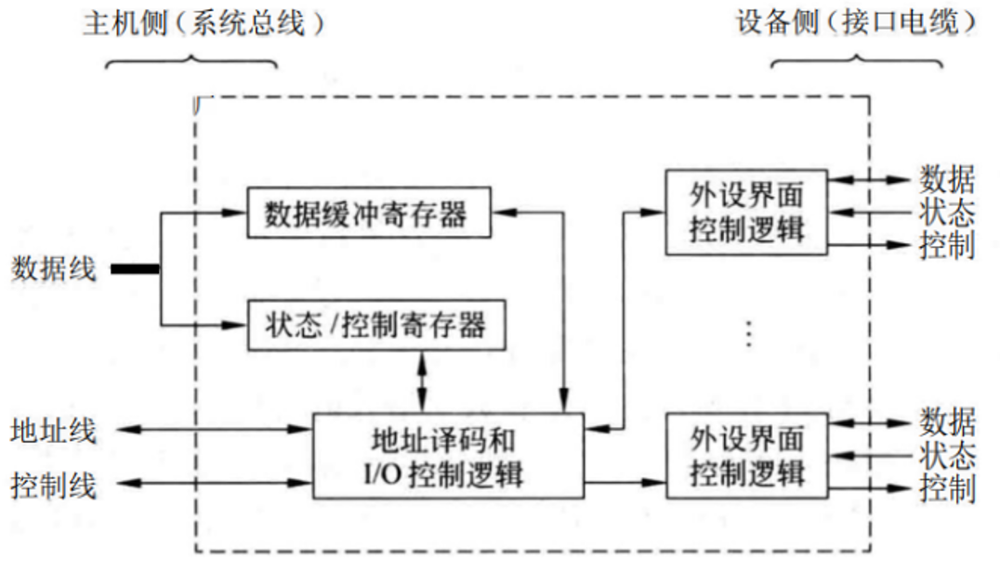

# IO接口
外部设备种类繁多, 且具有不同的工作特性, 因而它们在工作方式、数据格式和工作速度等方面存在很大差异。此外, 由于CPU、内存等计算机主机部件采用高速元器件, 使得它们和外设之间在技术特性上有很大的差异, 它们各有自己的时钟和独立的时序控制, 两者之间采用完全的异步工作方式。例如, 打印机的工作速度相对较慢, 数据格式通常是特定的打印指令, 而内存的工作速度极快, 数据格式以二进制形式存储。

为此, 为了解决外设与主机之间的同步与协调、工作速度匹配以及数据格式转换等问题, 需要相应的逻辑部件, 即外设的 I/O 接口或 I/O 模块。I/O 接口就像是翻译和协调员, 将主机发出的高速、复杂的指令和数据, 转换为外设能够理解和执行的形式, 同时也将外设的反馈和数据转换为主机能够处理的格式。比如, 当主机要向打印机发送打印任务时, I/O 接口会将主机的高速数据流转换为打印机能够逐步接收和处理的低速、特定格式的数据, 并协调两者的工作节奏, 确保打印任务顺利完成。

各种 I/O 控制器、设备控制器(包括适配器或适配卡)都属于 I/O 接口, 在一些大型机中, I/O 模块甚至承担着大量复杂的外设控制任务, 如同专门处理外设事务的“处理器”。

I/O 接口在计算机系统中起着至关重要的桥梁作用, 使得主机与各种不同特性的外设能够协同工作, 实现高效的数据交换和任务执行。

## 1. I/O接口的功能
I/O接口是连接外设和主机的一个“桥梁”, 因此它在外设侧和主机侧各有一个接口。

- 通常把它在`主机侧`的接口称为**内部接口**, 在`外设侧`的接口称为**外部接口**。

内部接口通过I/O总线和内存、CPU相连, 而外部接口则通过各种I/O接口电缆(如USB线、网线等)将其连到外设上。

因此, 通过I/O接口, 可以在CPU、主存和外设之间建立一个高效的信息传输“通路”。
这个通路就是`CPU和内存 - I/O总线 - I/O接口(I/O控制器) - I/O接口电缆 - 外设`。

I/O接口的职能可概括为以下几个方面:
- **数据缓冲**: 由于主存和 CPU 寄存器存取速度快, 外设速度慢, I/O 接口中引入数据缓冲寄存器来匹配主机和外设工作速度。比如, 内存可以瞬间处理大量数据, 而打印机打印一页纸可能需要数秒, 数据缓冲寄存器就像一个缓冲区, 暂存要打印的数据, 使内存和打印机能以各自的速度工作, 避免数据堵塞。

- **错误或状态检测**: I/O 接口提供状态寄存器保存各种状态信息供 CPU 查用。例如, 能知道设备是否完成打印、是否准备好输入、是否有缺纸等出错情况。设备出错分两类, 一是电路故障等异常, 二是数据传输错误(可通过字符校验码检测)。好比车辆行驶中, 仪表盘会显示车辆的各种状态, 如油量、水温、是否故障等, 让驾驶员(CPU)了解情况。

- **控制和定时**: 提供控制和定时逻辑, 接收系统总线的控制命令和定时信号。CPU 根据程序的 I/O 请求选择设备通信, 并协调内部资源参与 I/O 过程, I/O 接口需提供定时和控制功能, 控制数据通信过程中动作的先后关系。这类似于交通信号灯和交警的指挥, 确保车辆(数据)有序、按时通过路口(完成通信)。

- **数据格式转换**: 提供数据格式转换部件, 将外部接口数据转换为内部接口所需格式, 或反向转换。例如, 磁盘读出或写入的数据在磁盘控制器中进行串/并转换。如同不同国家的语言翻译, 将一种语言(格式)转换为另一种语言(格式), 以便交流(通信)

## 2. I/O 接口的通用结构

| ##container## |
|:--:|
||

不同的I/O接口在设计和功能上各不相同, 这主要体现在它们控制外设的数量、数据传输的速度、数据格式的处理能力, 以及它们与主机交互的复杂性上。由于这些差异, 我们无法一一列举所有类型的I/O接口。

上图展示了一个**I/O接口的通用结构**, 这个结构在大多数计算机系统中都是相似的。这个接口在主机侧通过I/O总线与内存和CPU相连, 使得CPU能够控制外设并与它们交换数据。

状态寄存器与控制寄存器的关系:
- **传送方向**: 从功能上来说, 状态寄存器主要用于接收来自外设或接口的状态信息, 并将其传递给CPU; 而控制寄存器则用于接收来自CPU的控制命令, 并将其传递给外设或接口。因此, 在数据传送方向上, 状态寄存器和控制寄存器是相反的。

- **访问时间**: 由于CPU需要交替地读取状态信息和写入控制命令, 因此它对状态寄存器和控制寄存器的访问在时间上通常是错开的。这种错开访问的机制有助于确保数据传输的顺畅和系统的稳定性。

- **合并设计**: 在一些设计中, 为了简化接口结构和节省资源, 状态寄存器和控制寄存器可能会被合并为一个寄存器。这种设计需要一种机制来区分寄存器中的状态信息和控制命令部分。

### 2.1 I/O总线
早期的I/O总线采用并行方式, 通过一组共享的地址线、数据线和控制线来实现主机与I/O设备之间的通信。这种设计允许CPU通过总线访问I/O接口中的多个寄存器, 每个寄存器都有其独特的地址。当CPU需要与特定的I/O接口通信时, 它会将该接口寄存器的地址发送到地址线上, 同时将读/写控制信号发送到控制线上。

地址信息如同一个精确的“导航坐标”, 用于选定与主机进行数据交换的特定寄存器。而读/写控制信号可能参与地址译码, 比如用写信号确定是接收寄存器, 用读信号确定是发送寄存器。

这就好比在一个仓库中, 地址线指明了要存取货物的具体位置, 读/写信号决定是存放货物还是取出货物。

此外, 控制线中还包含一些仲裁信号和握手信号等, 可供 I/O 接口使用。这些信号就像是交通规则中的优先通行权和确认信号, 确保数据传输的有序和稳定。

### 2.2 I/O总线与I/O接口交互
- **地址译码**: 地址信息通过地址线发送到I/O接口, 接口中的控制逻辑会解码这些地址信息, 确定要访问的寄存器。例如, 控制逻辑会判断地址是否指向数据寄存器、状态寄存器或控制寄存器。

- **读/写控制**: 读/写控制信号用于指示数据传输的方向。如果控制信号是写信号, 那么数据将从主机传输到I/O接口的数据寄存器; 如果是读信号, 则数据将从I/O接口的数据寄存器传输到主机。

- **命令字译码**: 当CPU向I/O接口发送命令时, 这些命令通常被编码在命令字中, 通过控制线发送到控制寄存器。I/O接口的控制逻辑会对命令字进行译码, 以确定需要执行的具体操作。

- **数据传输**: 数据缓冲寄存器在数据传输过程中起到关键作用。当数据需要从主机传输到外设时, 数据首先被写入数据缓冲寄存器, 然后通过外设接口逻辑传输到外设。相反, 当数据从外设传输到主机时, 数据首先被读入数据缓冲寄存器, 然后再通过数据线传输到主机。

- **状态收集**: 状态寄存器用于收集和存储外设的状态信息, 如设备是否准备好、是否有数据等待读取、是否发生错误等。这些状态信息可以通过读取状态寄存器的方式被主机查询。

- **握手信号和仲裁**: 在并行总线中, 握手信号(如应答信号ACK)用于协调数据传输, 确保数据的正确接收。仲裁信号则用于在多个设备尝试访问总线时确定哪个设备将被允许访问。

### 2.3 具有主控能力的 I/O 接口
当一个I/O接口具备主控能力, 如 **DMA(Direct Memory Access)** 控制器, 它能够自主发起总线事务并控制数据的传输, 而不需要CPU的直接干预。这种能力极大地提高了数据传输的效率, 尤其是在处理大量数据时, 因为CPU可以在此期间执行其他任务, 从而实现并行处理。在这种情况下, 控制线上的信号由DMA控制器生成, 而地址线用于指定数据传输的目标或源地址, 此时地址线的方向是从DMA控制器输出至总线。

程序员通常不需要深入了解外设的机械或物理特性, 如磁盘的旋转速度、磁头的移动方式、网络信号的物理传输介质等。这是因为这些细节被封装在硬件和I/O接口的内部, 程序员只需要按照接口定义的规则进行操作, 就可以实现对外设的有效控制。这种抽象层次的划分有助于简化软件开发, 提高系统的可维护性和可扩展性。

编写底层I/O软件的程序员在使用这类设备控制器时, 主要需要了解以下几个方面:

- **用户可访问的寄存器**: 设备控制器通常会提供一系列寄存器供CPU访问, 这些寄存器用于控制设备的操作、查询设备的状态以及传输数据。程序员需要知道这些寄存器的地址、功能以及如何通过编程来访问它们。

- **控制/状态寄存器中每一位的含义**: 控制寄存器用于向设备发送控制命令, 而状态寄存器则用于反映设备的当前状态。程序员需要详细了解这些寄存器中每一位的具体含义, 以便能够正确地控制设备和读取设备状态。

- **I/O接口与外设之间的通信协议**: 虽然程序员不需要了解外设的机械特性, 但他们需要了解I/O接口与外设之间通信的电气特性和通信协议。这包括信号的时序、数据的格式以及错误处理机制等。

在底层 I/O 软件中, 能够通过将控制命令置入控制寄存器来启动外设工作。还能读取状态寄存器, 以掌握外设和设备控制器的状态。此外, 直接访问数据缓冲寄存器可实现数据的输入与输出。

这就像操控一个复杂的机器, 通过向特定的控制部件发送指令来启动机器(启动外设), 查看仪表的显示来了解机器的状况(读取状态), 以及在特定的存储区域存取物品来完成生产流程(数据的输入输出)。

### 2.4 底层 I/O 软件的操作方式
在底层I/O软件中, 与外设的交互主要通过**控制寄存器、状态寄存器和数据缓冲寄存器**来完成。这些操作通过特定的I/O指令实现, 这些指令在操作系统内核的底层I/O软件中被广泛使用, 并且通常被视为特权指令。

底层I/O软件(通常是设备驱动程序)与硬件交互的方式有:
1. **控制寄存器**: 当需要启动或控制外部设备时, 底层I/O软件会向控制寄存器写入特定的值。这些值代表了不同的控制命令, 比如开始读取数据、停止设备、设置传输速率等。通过这种方式, 软件可以告诉设备应该做什么。

2. **状态寄存器**: 状态寄存器提供了设备当前状态的信息, 包括是否准备好接收或发送数据、是否有错误发生、是否正在进行操作等。底层I/O软件会定期检查状态寄存器, 以确定何时可以安全地读取或写入数据, 或者是否需要处理错误。

3. **数据缓冲寄存器**: 数据缓冲寄存器用于临时存储数据, 以便于在CPU和设备之间进行数据交换。底层I/O软件可以直接读写这些寄存器, 以实现数据的输入和输出。

为了访问这些寄存器, 操作系统提供了专门的I/O指令, 如 IN 和 OUT 指令(在x86架构中)。这些指令允许CPU从设备读取数据( IN )或将数据写入设备( OUT )。由于这些操作可能会影响系统的稳定性和安全性, 因此I/O指令通常只允许在内核模式下运行, 即操作系统内核或具有最高权限的代码才能执行。这也就是为什么它们被称为“特权指令”。只有操作系统内核或经过授权的程序才能执行特权指令, 而普通的应用程序则无法直接执行这些指令。这种机制有助于防止恶意程序对硬件进行非法访问或破坏。

## 3. I/O 端口及其编址
I/O 端口实际上就是 I/O 接口中的寄存器, 比如数据缓存寄存器是数据端口, 控制/状态寄存器是控制/状态端口。

每个外设都对应一组寄存器, 操作不同的寄存器就是在操作不同的设备。

这就好比一个办公室中的不同文件柜(寄存器), 分别存放着不同类型的文件(数据、控制/状态信息), 而这些文件柜都有各自的标识(端口地址)。

为了方便 CPU 能够快速选择 I/O 设备以及对 I/O 端口进行寻址, 给所有 I/O 接口中可访问的寄存器编址是必不可少的。想象一下, 如果没有明确的编址, CPU 就像在一个混乱的仓库中盲目寻找特定的物品, 效率会极其低下。

目前, I/O端口的编址主要有两种方式: **独立编址**和**统一编址**。

### 3.1 独立编址(I/O映象方式、专用I/O指令方式)
在独立编址方案中, I/O端口拥有独立于主存储器地址空间的地址范围。这意味着I/O端口和主存储器使用不同的地址空间, CPU通过专用的I/O指令(如x86架构中的 IN 和 OUT 指令)来访问I/O端口。每个I/O端口都被分配了一个唯一的地址, 这个地址用于识别特定的I/O设备及其内部的寄存器。例如, 数据端口和控制/状态端口会有各自的地址。

特点: I/O地址与存储地址分开独立编址, I/O端口地址不占用存储空间的地址范围。在系统中存在另一种与存储地址无关的I/O地址空间, CPU必须具有专用于输入输出操作的指令(如IN、OUT等)和控制逻辑。

**优点**:
1. **不占用内存空间**: I/O端口地址与存储地址完全分开, 不会减少存储器的有效容量。
2. **I/O指令短、执行速度快**: 由于I/O指令专门设计用于I/O操作, 因此通常较短且执行速度快。
3. **指令清晰、可读性强**: I/O指令的使用使得程序中的I/O操作更加清晰明了。

**缺点**:
1. I/O指令相对较少, 一般只能对端口进行基本的传送操作。
2. 需要CPU提供存储器读/写、I/O设备读/写两套控制信号, 增加了控制的复杂性。

示例:
- Intel 处理器采用此方式, I/O 地址空间由 $2^{16}$ (64K)个地址编号组成, 每个编号对应一个 8 位I/O 端口, 两个连续 8 位端口可视为一个 16 位端口, 并提供 IN 和 OUT 指令。

- 例如, 在一个独立编址的系统中, 如果要从一个特定的 I/O 端口读取数据, CPU 会执行专门的 IN 指令, 并在指令中指定该端口的地址。

### 3.2 统一编址(存储器映象方式)
统一编址方案中, I/O端口的地址被包含在主存储器的地址空间内。这意味着I/O端口被视为内存的一部分, 可以像访问内存一样通过读写指令来访问。这种方式下, I/O设备的寄存器映射到特定的内存地址上, 使得I/O操作看起来就像普通的内存访问操作一样。

特点: 从整个寻址空间中划出一部分给I/O设备, 其余的给存储器, 通过地址码区分操作对象是存储器还是I/O。

I/O端口和存储单元按照存储单元的编址方法统一编排地址, 共同构成一个统一的地址空间。

**优点**:
1. **I/O端口的编址空间大且易于扩展**: 由于I/O端口和存储器共享地址空间, 因此I/O端口的编址空间相对较大。
2. **I/O指令丰富、功能齐全**: CPU可以使用统一的访存指令来访问I/O端口, 使得I/O操作更加灵活和方便。

**缺点**:
1. **占用存储器地址**: 1/O端口地址占用了存储器的一部分地址空间, 导致存储器的有效容量减少。
2. **访问速度较慢**: 由于访问内存指令一般比专门的I/O指令需要更多的字节, 因此访问I/O端口的速度可能相对较慢。

示例:
- 可使用访存指令实现 CPU 寄存器与 I/O 端口的数据传送, 用 AND、OR 等指令操作 I/O 接口中的控制或状态寄存器。

- 比如, 在统一编址的系统中, 若要访问某个 I/O 端口, 就像访问主存中的某个存储单元一样, 使用普通的访存指令, 并根据地址判断是对主存还是 I/O 端口进行操作。

在选择I/O端口的编址方式时, 需要根据系统的具体需求和硬件环境进行综合考虑。独立编址方式适用于对I/O操作速度和指令清晰度有较高要求的场景; 而统一编址方式则适用于需要较大I/O编址空间且对I/O操作灵活性有较高要求的场景。无论采用哪种方式, 都需要确保CPU能够准确、快速地选择并访问I/O接口中的各个寄存器。

在实际应用中, 许多现代系统采用了混合方案, 即某些I/O设备使用独立编址, 而另一些则使用统一编址。这样的设计可以结合两者的优点, 提供最佳的性能和灵活性。

无论采用哪种编址方式, I/O端口的地址都必须在系统初始化时正确配置, 以确保CPU能够准确地找到并访问所需的I/O设备和寄存器。这通常是在BIOS/UEFI固件或操作系统加载时完成的。

## 符: 小练习

一、磁盘驱动器属不属于IO接口?

> 不属于,  磁盘驱动器 就是 磁盘本身!

---

二、如果我们有I/O指令,  那么I/O指令是发生在什么之间呢?

A. I/O设备和I/O端口

B. 通用寄存器和I/O设备

C. 通用寄存器和I/O端口

请选择: 

> C

