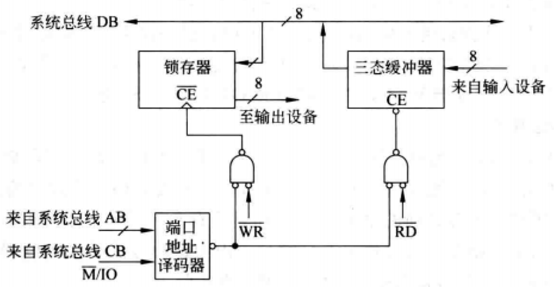
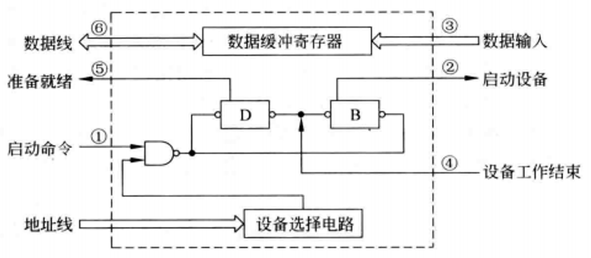
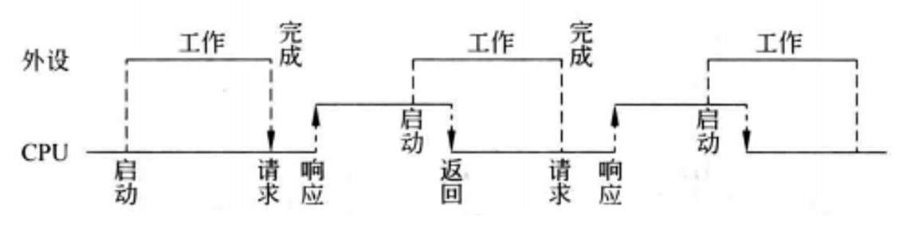
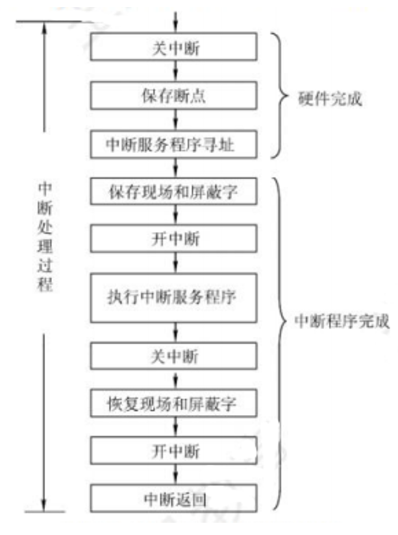

# IO数据传送控制方式
I/O数据传送主要有3种不同的控制方式:
- 程序直接控制、中断控制、DMA控制

## 1. 程序直接控制
程序直接控制方式直接通过查询程序来控制主机和外设之间的数据交换, 通常有以下两种类型: 无条件传送、条件传送

### 1.1 无条件传送
无条件传送方式, 也被称为同步传送或轮询方式, 适用于一些简单外设, 如开关、继电器或机械式传感器等, 在这种方式下, CPU会在固定的周期内查询或访问I/O设备, 以检查或更新设备状态。通过在规定时间使用相应 I/O 指令对接口中的寄存器进行信息输入或输出, 其实质是利用程序定时来同步传送数据, 常用于各类巡回采样检测或过程控制。

这种方式下的接口相对简单, 无需定时信号和状态查询, 仅需进行读写控制和地址译码。

| ##container## |
|:--:|
||
|无条件传送接口|

---

实现细节:

- **数据锁存器和缓冲器**: 数据锁存器用于暂存数据, 确保数据在传输过程中的稳定性。三态缓冲器则允许数据双向流动, 根据读写信号控制数据流向。

- **读写控制**: 通过读写信号控制数据的输入和输出。当写信号激活时, 数据从CPU传送到设备; 当读信号激活时, 数据从设备返回到CPU。

- **地址译码**: 尽管无条件传送方式下的接口可能只有一个数据寄存器, 地址译码仍然重要, 因为它确保了正确的读写控制信号被应用于目标寄存器。

---

无条件传送方式的特点:

- **定时访问**: CPU根据预设的时间间隔, 定期访问I/O端口, 无需等待任何外部事件或信号。这种方式确保了数据传输的周期性, 但可能造成CPU资源的浪费, 尤其是在设备不经常更新的情况下。

- **简单接口**: 由于没有复杂的同步机制, 无条件传送方式下的接口设计较为简单, 通常只需要基本的数据锁存器和缓冲器, 以及必要的读写控制信号。

- **效率问题**: 对于慢速设备, CPU访问的频率可能远高于设备的实际更新速率, 导致CPU等待时间较长, 但这对整体性能影响较小。然而, 对于高速设备, CPU需要频繁访问, 这将显著占用CPU资源, 降低处理器的效率。

---

无条件传送方式最适合那些变化缓慢或更新周期可预测的设备, 如开关、继电器、简单的显示设备或传感器。这种方式在工业控制、环境监控等领域常见, 这些领域的设备往往不需要实时响应, 数据更新频率较低。例如, 一个温度传感器每分钟更新一次数据, 处理器每隔一分钟读取一次数据, 这期间处理器有大量时间处理其他任务。

然而, 对于高速设备, 如高速网络接口、高速磁盘驱动器等, 无条件传送方式效率低下, 因为频繁的CPU访问会导致性能瓶颈。在这些情况下, 通常会采用中断驱动方式、直接内存访问(DMA)或更先进的I/O虚拟化技术, 以减少CPU的直接参与, 提高数据传输速度和系统整体效率。

### 1.2 条件传送
条件传送方式(也称为异步传送方式或程序查询方式)适用于较复杂的 I/O 接口, 这类接口通常具有多个控制、状态和数据寄存器。对设备的控制必须在**一定的状态条件**下才能进行。

条件传送方式是一种在程序控制下, 通过查询外设或接口的状态来决定是否进行数据传输的I/O操作方式。这种方式特别适用于那些需要基于外设当前状态来决定下一步操作的复杂I/O接口。

在条件传送方式中, CPU会周期性地执行一段查询程序, 该程序通过执行I/O指令来读取外设或接口的状态寄存器中的状态信息, 如“就绪(Ready)”、“忙(Busy)”、“完成(Done)”等。根据这些状态信息, CPU可以判断外设是否准备好进行数据传输, 从而决定是继续查询还是启动数据传输。

例如, 当打印机处于“就绪”状态时, 主机才向其发送打印数据; 若打印机处于“忙”状态, 则主机等待其变为“就绪”。

CPU采用条件传送方式通过该I/O接口读取外设数据的过程如下:

| ##container## |
|:--:|
||
|条件传送方式接口|

这个过程中, CPU 需要不断查询状态, 直到外设准备好数据, 虽然保证了数据传输的准确性, 但在等待过程中可能会浪费一定的 CPU 资源。

---

条件传送方式的特点:

- **状态查询**: 在条件传送方式中, CPU会查询设备的状态寄存器, 以获取设备的当前状态。这通常涉及到“就绪”、“忙”、“完成”等状态标志位。只有当设备处于适当的准备状态时, CPU才会执行数据传输操作。

- **异步操作**: 与无条件传送方式不同, 条件传送方式不需要固定的轮询周期。CPU可以在任何时候查询设备状态, 一旦设备准备就绪, 立即进行数据传输。这种机制使得数据传输更加灵活, 减少了不必要的CPU等待时间。

- **效率提升**: 对于那些状态变化不可预测或更新频率较高的设备, 条件传送方式可以显著提高CPU的效率, 因为它避免了在设备未准备好时的无效轮询。

---

条件传送方式特别适用于那些状态变化不可预测或需要即时响应的设备, 如打印机、扫描仪、网络适配器等。这些设备可能需要在任意时刻响应外部请求或完成内部操作, 因此依赖于实时的状态反馈来决定数据传输的时机。

然而, 条件传送方式的一个缺点是, 如果设备的准备状态变化非常快, CPU可能需要频繁查询状态, 这仍然可能导致CPU资源的浪费。在某些情况下, 如设备的响应时间非常短或CPU需要处理大量I/O请求时, 可能需要更高效的机制, 如中断驱动方式或直接内存访问(DMA)来进一步减少CPU的直接参与, 提高数据传输的效率。

条件传送方式在一定程度上平衡了数据传输的准确性和系统资源的利用效率, 但在对系统响应速度要求较高的场景中, 可能不是最优选择。

---

设备与条件传送方式的适配性: 设备是否适合采用条件传送方式(程序查询方式)很大程度上取决于设备本身的特性和操作需求。

**随机启动的低速 I/O 设备(如键盘、鼠标)**: 更适合采用中断驱动方式

- 这类设备由用户随机启动, 当用户进行操作时(如按键或移动鼠标), 设备会发送输入信号。由于启动是随机的, 如果采用定时查询方式, CPU可能会在设备未启动时浪费大量时间进行无效查询, 导致效率低下。因此, 这类设备更适合采用中断驱动方式, 这样CPU仅在设备有输入时被通知, 从而高效地处理输入事件。

- 例如, 用户在使用电脑时, 可能有一段时间没有操作键盘或鼠标, 若此时处理器一直进行查询等待, 会浪费大量资源。

**由操作系统启动的设备**: 更适合使用DMA(直接内存访问)或中断驱动方式

- 磁盘、磁带和光盘存储器: 这类设备通常在操作系统或应用程序的控制下启动, 一旦启动, 可以连续传输大量数据。由于数据传输速率高, 且数据块较大, 若采用定时查询方式, CPU需要频繁查询设备状态, 这将极大消耗CPU资源, 降低系统效率。因此, 这类设备更适合使用DMA(直接内存访问)或中断驱动方式, 这两种方式都可以在不占用CPU时间的情况下高效传输数据。

**字符类设备(如针式打印机)**: 更适合使用条件传送方式

- 针式打印机: 字符类设备, 如针式打印机, 每次打印一个字符就需要启动一次, 字符间的传输时间较长。在这种情况下, 采用条件传送方式(程序查询方式)是比较合适的, 因为CPU只需在每个字符传输前后进行状态查询, 不会造成过多的CPU负担。

---

条件式程序查询方式的分类:
- 根据查询被启动的方式不同, 条件式程序查询方式分为`定时查询`和`独占查询`, 可依据外设特点选择。

---

**定时查询方式**: 定时查询方式是最简单的查询策略之一, 它基于固定的周期性查询来检查I/O设备的状态。在每一个查询周期内, CPU都会执行一系列的I/O指令来读取设备的状态寄存器, 判断设备是否准备好进行数据交换。如果设备准备好, CPU将进行数据的读取或写入; 如果没有准备好, CPU将在下一个查询周期再次尝试。

特点:
- **固定周期**: CPU按预定的时间间隔进行查询, 无论设备是否准备就绪。
- **效率问题**: 对于低频使用的设备, CPU可能会在大部分时间内进行无效查询, 浪费处理时间。

优缺点:
- **优点**: 具有一定的规律性和可预测性, 便于系统进行资源规划和调度。对于一些状态变化不是特别频繁, 但又需要及时响应的设备, 能够在一定程度上平衡资源利用和响应及时性。
- **缺点**: 如果设备的状态变化不遵循这个固定的时间间隔, 可能会出现查询时设备还未准备好, 或者设备已经准备好但还未被查询到的情况, 导致一定的延迟。

无论设备是否处于准备好的状态, 都会按照固定间隔进行查询, 可能会造成处理器资源在设备未准备好时的不必要浪费。

应用场景: 低速I/O设备, 非独立启动的设备, 系统负载较低的情况。

---

**独占查询方式**: 一旦操作系统发出一个对设备的启动命令, 它就必须接连不断地查询, 因为操作系统不知道什么时候设备会响应并准备好一次传送。这种一旦设备被启动, CPU就一直持续对设备进行查询的方式, 称为独占查询方式。独占查询方式下, CPU被独占用于某设备的I/O, 完全控制I/O整个过程, 即CPU花费100%的时间在I/O操作上, 此时, 外设和CPU完全串行工作。

应用场景: 高速I/O设备, 独立启动的设备, 实时性要求高的系统。

## 2. 程序中断I/O方式
中断控制I/O方式是为了解决程序查询I/O方式中CPU过度等待外设的问题而提出的。在程序查询方式中, CPU必须定期查询I/O设备的状态, 直到设备准备好进行数据传输, 这导致了CPU效率的严重浪费, 尤其是在处理慢速设备时。为解决这一问题, 提出了`中断`控制 I/O 方式。

基本概念: 程序中断是指在计算机执行程序的过程中, 出现某些急需处理的异常情况或特殊请求, CPU暂时中止现行程序, 而转去对这些异常情况或特殊请求进行处理, 处理完毕后再返回到原程序的断点处, 继续执行原程序。早期的中断技术是为了处理数据传送。

程序中断方式的思想: CPU在程序中安排好在某个时机启动某台外设, 然后CPU继续执行当前的程序, 不需要像查询方式那样一直等待外设准备就绪一旦外设完成数据传送的准备工作, 就主动向CPU发出中断请求。在可以响应中断的条件下, CPU暂时中止正在执行的程序, 转去执行中断服务程序为外设服务, 在中断服务程序中完成一次主机与外设之间的数据传送, 传送完成后, CPU返回原来的程序。此时, 外设和CPU又开始并行工作。

| ##container## |
|:--:|
||

### 2.1 中断控制I/O方式的基本流程
1. 进程发起I/O请求:
    - 当一个进程(如进程R)需要执行I/O操作时, 它会通过系统调用向操作系统请求I/O服务。
    - 操作系统响应请求, 启动相应的外设进行I/O操作(如从磁盘读取数据)。

2. 挂起进程并调度其他进程:
    - 操作系统会将发起I/O操作的进程(如进程P)挂起, 并将其状态改为阻塞态。
    - 然后, 操作系统会从就绪队列中选择另一个进程(如进程P2)执行, 以充分利用CPU时间。

3. 外设完成I/O操作并发出中断:
    - 当外设完成I/O操作后(如数据已经准备好或写入完成), 它会向CPU发出中断请求。
    - CPU在接收到中断请求后, 会暂停当前正在执行的进程(如进程P2), 并保存其上下文(包括程序计数器、寄存器等状态信息), 以便之后恢复执行。

4. 执行中断服务程序:
    - CPU响应中断后, 会跳转到中断服务程序(Interrupt Service Routine, ISR)执行。
    - 在中断服务程序中, 操作系统会处理I/O操作的结果(如将数据从外设缓冲区传输到进程的缓冲区), 并可能启动后续的I/O操作。

5. 恢复被中断的进程:
    - 中断服务程序执行完毕后, 操作系统会恢复被中断的进程(如进程P2)的上下文, 并使其继续执行。
    - 此时, 如果之前的I/O操作是进程P所请求的, 操作系统会唤醒进程P, 并可能将其重新放入就绪队列中等待执行。

### 2.2 中断和异常
在现代计算机系统中, 异常和中断处理是一个完善的体系, 包括 CPU 数据通路中的检测和响应逻辑、外设接口中的中断请求和控制逻辑, 以及操作系统中的中断服务程序。

这就如同一个紧密协作的团队, CPU 中的逻辑负责察觉异常和中断的发生, 外设接口的逻辑负责发出请求, 而操作系统中的服务程序则负责具体的处处理工作。

**中断和异常的分类**
- **硬件中断**: 由外部设备或硬件故障引起的中断, 如I/O操作完成、定时器溢出等。
- **软件中断**: 由软件指令引起的中断, 如系统调用、异常(如除零错误)等。
- **内部中断(也称异常)**: 由CPU内部事件引起的中断, 如程序计数器溢出、指令错误等。

**异常和中断的检测与响应逻辑**
- **CPU的异常和中断检测逻辑**: CPU内部有专门的电路来检测异常情况, 如除法错误、非法指令、地址越界等。同样, 中断请求也是通过特定的硬件线路被CPU检测到的。一旦检测到异常或中断请求, CPU会自动保存当前的上下文(包括程序计数器PC和其他寄存器状态), 并将控制转移到预设的异常或中断处理程序入口点。

- **外设接口的中断请求和控制逻辑**: I/O设备通过外设接口与CPU通信。当设备完成操作或检测到特定事件时, 它会通过中断请求线向CPU发出中断信号。接口中的控制逻辑负责管理和控制这些中断请求, 包括中断屏蔽、优先级处理和中断确认等。

**操作系统的中断服务程序的概念**
- **中断服务程序(ISR**): 操作系统为每种类型的异常和中断定义了相应的中断服务程序。这些程序通常驻留在内存的特定位置, 当CPU响应中断时, 会跳转到这些程序执行。ISR负责处理中断事件, 可能包括数据的读写、设备状态的更新、错误处理以及唤醒等待的进程等。

- **中断服务程序的执行流程**: ISR执行时, 通常会保存当前程序的上下文(如寄存器值、程序计数器等), 以便在中断处理完毕后能够恢复执行。处理完中断事件后, ISR会执行一条特殊的指令(如IRET指令在x86架构中)来退出中断, 并恢复之前被中断的程序的执行。

**异常和中断处理过程**
1. **中断请求**: 外设或系统检测到需要处理的事件, 通过硬件线路向CPU发出中断请求。
2. **中断响应**: CPU检测到中断请求, 保存当前的上下文, 然后跳转到相应的中断服务程序入口点。
3. **中断服务**: 在中断服务程序中, 操作系统执行必要的处理动作, 如读取或写入数据、更新设备状态、记录错误信息等。
4. **中断返回**: 中断服务程序执行完毕后, CPU恢复先前保存的上下文, 返回到被中断的程序点继续执行。

**外部中断和内部异常的区别**

异步性质
- **外部中断**: 外部中断是由外部设备或系统环境引起的, 与CPU正在执行的指令流无关。这意味着中断可以发生在任何时间, 无论CPU当前正在执行什么指令。CPU需要在执行每条新指令前检查是否有中断请求, 以确保能够及时响应外部事件。
- **内部异常**: 内部异常通常是由CPU在执行特定指令时检测到的错误条件引I发的, 如地址越界除以零、非法指令等。这些异常与正在执行的指令直接相关, 因此它们的发生是同步的, 即在指令执行的过程中被检测到。

触发与识别机制
- **外部中断**: 中断请求通常通过专用的中断请求线(IRQ)传递给CPU。当外部设备完成任务或遇到问题时, 它会激活这条线路, 向CPU发送中断信号。CPU需要通过读取中断向量表或通过总线获取中断源的标识信息, 来确定是哪个设备产生了中断以及中断的类型。
- **内部异常**: 异常的发生和类型是由CPU自身在执行指令时自动检测和识别的。一旦检测到异常, CPU会自动保存现场, 并跳转到预设的异常处理程序入口点, 而无需外部信号的触发。

处理方式
- **外部中断**: CPU响应中断请求后, 会执行相应的中断服务程序(ISR), 这些程序通常用于处理特定的外部事件, 如完成数据传输、记录错误、唤醒等待的进程等。
- **内部异常**: CPU在检测到内部异常后, 会跳转到预设的异常处理程序, 这些程序用于处理如地址错误、算术异常等情况, 通常涉及修改程序状态或重新调度进程。

### 2.3 中断系统的基本职能和结构
及时记录各种中断请求信号: 
- 计算机系统通常配备一个或多个中断请求寄存器(IRR, Interrupt Request Register)来保存来自不同设备或软件的中断请求信号。这些寄存器能够捕捉并保存中断请求的状态, 以便CPU在适当的时候进行响应。

自动响应中断请求:
- CPU在执行指令的过程中, 会周期性地检查中断请求引脚(如INTR引I脚)以检测是否有中断请求。一旦检测到中断请求, CPU会根据当前的状态(如是否允许中断、中断优先级等)来决定是否响应以及响应哪个中断。这通常涉及到对中断请求寄存器(IRR)和中断屏蔽寄存器(IMR, Interrupt MaskRegister)的查询。

自动判优:
- 当多个中断请求同时发生时, 计算机系统需要一种机制来确定哪个中断应该被优先处理。这通常通过中断优先级寄存器(IPR,Interrupt Priority Register)或中断优先级编码器来实现。优先级高的中断会被首先响应, 以确保关键任务或紧急事件能够得到及时处理。

保护被中断程序的断点和现场:
- 在响应中断之前, CPU需要保存当前程序的执行状态, 包括程序计数器(PC)的值(即断点)、程序状态字(PSW)以及各寄存器的内容。这些信息被称为现场或上下文, 它们在中断服务程序执行完毕后将被恢复, 以确保程序能够从中断发生前的状态继续执行。

中断屏蔽:
- 中断屏蔽是一种允许或禁止CPU响应特定中断请求的机制。通过修改中断屏蔽寄存器(IMR)的值, 可以控制哪些中断请求被允许通过, 哪些被忽略。这对于实现多重中断的嵌套执行非常关键, 因为它允许更高优先级的中断在较低优先级的中断服务程序执行过程中被响应和处理。

### 2.4 中断嵌套
现代计算机大多采用中断嵌套技术。中断嵌套技术是现代计算机系统中用于提高响应性和效率的重要机制。它允许CPU在处理一个中断时被另一个更高优先级的中断请求打断, 从而能够迅速响应更紧急的事件。然而, 为了保证某些关键中断处理过程的完整性和系统稳定性, 需要能够控制中断的可被打断性, 这就引入了**中断屏蔽**的概念。

**中断嵌套**是指当一个中断服务程序(ISR)正在执行时, 如果CPU接收到一个新的中断请求, 并且这个新的中断请求的优先级高于当前正在处理的中断, 那么CPU可以暂停当前中断的处理, 转而处理这个新的更高优先级的中断。当新的中断处理完成后, CPU会返回到之前被暂停的中断服务程序中继续执行。这种机制确保了系统能够优先处理更为紧急的任务。

**中断屏蔽**允许系统管理员或软件通过设置特定的中断屏蔽字来控制哪些中断请求可以被CPU响应, 哪些应该被暂时忽略。屏蔽字是一个二进制位模式, 其中的每一位对应于一个具体的中断源。如果该位被设置为`1`, 则表示对应的中断源被屏蔽, 即使有中断请求也不会被CPU响应; 如果设置为`0`, 则表示该中断源未被屏蔽, 可以触发中断, 会被CPU响应。

- 例如, 系统中有三个中断源 A、B、C, 对应的屏蔽字某位为 1 时, 如 A 位为 1, 表示在处理 A 中断时, `不允许`其他中断打断; 若为 0, 则在处理 A 中断时, `允许`其他中断打断。

中断屏蔽字的作用:
1. **优先级管理**: 通过设置不同的中断屏蔽位, 可以动态调整中断处理的优先级。例如, 在处理一个高优先级中断时, 可以暂时屏蔽低优先级中断, 确保高优先级中断的及时处理。
2. **避免中断风暴**: 在某些情况下, 频繁的中断请求可能会导致"中断风暴", 严重影响CPU的正常工作。通过合理设置中断屏蔽位, 可以避免这种情况, 确保CPU有足够的时间执行关键任务。
3. **保护临界区**: 在多任务或并发环境中, 某些操作需要在不受中断干扰的情况下执行, 以保证数据的一致性和程序的正确性。中断屏蔽可以创建所谓的"临界区", 在这些区域内, 中断被屏蔽, 确保操作的原子性。

**动态改变屏蔽字:**

CPU 还能在程序中执行相应指令来修改屏蔽字内容, 动态调整中断处理的先后次序。比如, 在某个特定阶段, 希望优先处理某些不太紧急但数量较多的中断, 就可以通过修改屏蔽字来实现。

这就像交通管制中的信号灯设置, 根据不同的路况和需求, 灵活调整哪些方向的车辆可以通行, 哪些需要等待。

在计算机系统中, 中断机制允许外部设备或内部硬件在需要处理器注意时向处理器发送信号, 这可以提高系统的效率和响应能力。中断的处理涉及到两个关键概念: `中断响应优先级(Interrupt Request Priority)`和`中断处理优先级(Interrupt Handling Priority)`, 它们分别影响着中断的接收和处理流程。

`中断响应优先级`是指在多个中断源同时发出中断请求时, 系统根据某种规则(如中断判优电路或查询程序)来决定首先响应哪个中断的优先级。这种优先级是在中断请求被系统接收并准备响应时确定的, 它决定了哪个中断请求将首先得到处理。

**固定优先级**: 在某些系统中, 中断优先级是固定的, 根据中断源的重要性或紧急程度预先设定。

**动态优先级**: 在某些高级系统中, 中断优先级可以根据系统状态或当前任务的紧急程度动态调整。

---

`中断处理优先级`是在中断服务程序(ISR)执行过程中, 通过中断屏蔽字(Interrupt MaskRegister)来动态设定的。中断屏蔽字允许或禁止特定中断的响应, 从而控制中断处理的优先级。

**中断屏蔽字**: 每个中断源通常都有一个对应的中断屏蔽位, 在中断屏蔽字中。当该位被设置(通常设为1)时, 相应的中断被屏蔽, 即不会被响应; 当该位被清除(设为0)时, 中断源的中断请求可以被系统响应。

**动态调整**: 在中断服务程序中, 可以通过修改中断屏蔽字来暂时禁止或允许其他中断的响应, 从而实现中断处理优先级的动态调整。这种机制对于避免中断嵌套中的优先级反转或确保关键中断的及时处理非常有用。

---

在多重中断系统中的应用: 

- 在多重中断系统中, 同时处理多个中断请求是常态。为了高效且有序地处理这些中断, 系统通常会结合使用中断响应优先级和中断处理优先级。中断响应阶段: 系统根据中断响应优先级决定首先响应哪个中断。这通常是通过中断判优电路或查询程序实现的。中断处理阶段: 在中断服务程序中, 根据需要通过修改中断屏蔽字来动态调整中断处理优先级。这可以确保在处理一个中断时, 其他关键中断能够得到及时响应, 而非关键中断则被暂时屏蔽。

中断嵌套的例子: 

比如在一个智能交通控制系统中, 系统正在处理路口红绿灯的定时切换任务(主任务)。

中断响应优先级设定为: 交通事故中断的响应优先级最高, 其次是车辆拥堵中断, 然后是信号灯故障中断。

中断处理优先级通过中断屏蔽字设定: 交通事故中断的处理优先级最高, 信号灯故障中断的处理优先级最低。

当系统正在处理信号灯故障中断时, 发生了车辆拥堵中断。由于车辆拥堵中断的响应优先级高于信号灯故障中断, 系统中断信号灯故障中断的处理, 响应车辆拥堵中断。

在处理车辆拥堵中断过程中, 发生了交通事故中断。交通事故中断的响应优先级最高, 系统暂停车辆拥堵中断的处理, 先处理交通事故中断。

处理完交通事故中断后, 回到车辆拥堵中断的处理, 最后再处理信号灯故障中断。

### 2.5 中断过程

$$中断请求 \to 中断响应_{_{[硬件]}} \to 中断处理_{_{[软件]}}$$

在中断处理过程中, 确保断点(也称为现场)的保存和中断服务程序的正确执行是非常重要的。中断过程包括两个阶段: `中断响应`和`中断处理`。中断响应阶段由硬件实现, 而中断处 理阶段则由 CPU 执行中断服务程序来完成, 所以中断处理是由软件实现的。

中断响应: 中断响应是指当处理器(或称为CPU)检测到中断请求时, 暂时中止当前正在执行的程序(通常称为当前进程或主程序), 并转而执行中断服务程序(ISR)的过程。这个过程实际上可以看作是处理器从一个执行上下文(或进程)切换到另一个的过程。在中断响应过程中, 处理器需要完成以下三个主要任务: 

1. 保存好被中断的程序的断点处的关键性信息

    在中断发生时, 为了确保被中断的程序(主程序)在中断服务程序(ISR)执行完毕后能够准确地恢复到中断发生前的状态并继续执行, 必须保存两类关键信息:

    - **现场信息(也称为上下文)**: 这包括用户可见的工作寄存器(如通用寄存器)的内容, 这些寄存器中存储了程序执行到断点时的当前值。由于这些寄存器的内容可以通过软件指令直接访问和修改, 因此中断服务程序通常会在开始时将这些寄存器的值压入栈中(称为"保存现场"或"压栈")。这样, 当中断服务程序执行完毕后, 就可以通过出栈操作恢复这些寄存器的值, 从而恢复程序的执行上下文。
    
    - **断点信息**: 这包括程序计数器(PC)和程序状态字寄存器(PSW/PSWR)的内容。PC指向了程序下一条将要执行的指令的地址, 而PSW包含了程序的状态信息(如条件码、中断屏蔽位等)。由于这些寄存器的内容在中断发生时会被自动更新以指向中断服务程序的入口点, 并且不能通过普通软件指令直接读取中断发生时的值, 因此它们的内容通常由硬件在中断响应的早期阶段自动保存到某个安全的地方(如特定的寄存器或栈中)。在中断服务程序执行完毕后, 硬件会将这些值恢复回PC和PSW, 从而使程序能够从中断点继续执行。
  
2. 识别中断源并根据中断响应优先级进行判优

    在中断响应过程中, 处理器需要能够识别出是哪个设备或事件触发了中断, 并在存在多个中断请求时, 根据中断响应优先级规则选择响应优先级最高的中断。这通常通过以下步骤实现:
    - **中断请求识别**: 处理器会检查中断请求线(IRQ)或中断控制器中的状态寄存器, 以确定哪些中断源正在请求服务。
    
    - **中断优先级判优**: 如果同时有多个中断请求, 处理器会根据预设的优先级规则(可能是固定的, 也可能是可配置的)来确定哪个中断应该首先得到响应。这通常涉及到一个中断优先级判优电路或软件算法, 它会根据中断源的重要性和紧急程度来排序中断请求。
  
3. 调出中断服务程序

    一旦确定了要响应的中断源和相应的中断服务程序, 处理器就会执行一系列操作来调出中断服务程序:
    - **获取中断服务程序的首地址**: 处理器会从中断向量表或类似的数据结构中获取与所选中断源相对应的中断服务程序的首地址。中断向量表是一个将中断源标识符映射到中断服务程序入口地址的表。
    
    - **准备执行中断服务程序**: 处理器会将中断服务程序的首地址加载到程序计数器(PC)中, 并将中断发生时的程序状态(如中断屏蔽位)保存到程序状态字寄存器(PSW)中或相应的位置。如果需要, 处理器还可能修改PSW以反映中断的发生和当前的中断环境。

    - **执行中断服务程序**: 在下一个时钟周期, 处理器将开始执行中断服务程序。在中断服务程序执行完毕后, 它会通过特定的返回指令(如IRET)来恢复被中断程序的执行上下文, 并继续执行中断点之后的指令。
  
#### 2.5.1 中断响应
处理器响应中断的速度至关重要。中断响应时间越短, 意味着计算机系统能更迅速地应对突发情况, 展现出更高的灵敏度。

中断响应时间受到多个因素的影响。比如在一个实时监控系统中, 如果断点保存花费的时间过长, 可能会导致关键数据的丢失或延迟处理; 中断源识别和判优速度慢, 可能会错过及时处理紧急情况的最佳时机; 获取中断服务程序首地址和初始状态的时间长, 也会影响整个响应的及时性。

不同的处理器有着不同的中断响应处理机制, 从而导致中断响应时间各异。就像 MIPS 处理器, 通过将断点信息 PC 存放在特殊寄存器 EPC 中, 避免了访问内存存取栈的时间消耗。在一个高速数据采集系统中, MIPS 处理器这种快速的中断响应机制可以确保在采集数据出现异常时, 能够迅速做出反应, 及时调整采集策略, 保证数据的准确性和完整性。

在保护断点和现场的过程中, 需要防止新中断的干扰。例如, 在一个自动化生产线上的控制系统中, 如果在保存当前生产状态(断点和现场)时又有新中断到来, 可能会导致之前保存的数据混乱。为了确保中断响应过程的完整性和系统的稳定性, 必须有机制防止在处理一个中断时被另一个中断打断, 尤其是当系统正在进行断点和现场的保护时。这就引出了`“中断允许”`触发器的概念, 它是一个关键的控制信号, 用于管理处理器对中断请求的响应。

中断响应的三个必要条件如下:
1. **CPU处于“开中断”状态**: “中断允许”触发器必须设置为允许状态, 这意味着处理器准备好接受新的中断请求。如果处理器处于“关中断”状态, 即使有中断请求, 也不会被响应, 直到“中断允许”状态被重新激活。

2. **至少有一个未被屏蔽的中断请求**: 每个中断源都可能有一个与其关联的中断屏蔽位, 用于临时禁用特定中断。只有当至少有一个中断源未被屏蔽时, 处理器才会响应中断。

3. **当前指令执行完成**: 对于非流水线处理器, 这意味着当前指令已经完全执行, PC中存放的是下一条指令的地址。这是因为处理器在执行指令时, 通常不会检查是否有中断请求, 直到当前指令周期结束。

当这三个条件都满足时, 处理器进入**中断响应周期**, 执行以下操作(由硬件完成):

**关中断**:
- 将"中断允许"标志置为禁止状态, 以阻止在中断服务程序执行期间新的中断请求被响应。这样可以确保当前的中断服务程序不受其他中断的干扰。

**保护断点**:
- 将程序计数器(PC)和程序状态字寄存器(PSW)的值保存到栈或专用寄存器中。这是为了在中断处理完成后, 能够恢复到中断发生前的正确位置继续执行。

**识别中断源并转中断服务程序**:
- 根据中断优先级识别出最高优先级的中断源, 然后从中断向量表或其他机制中获取对应的中断服务程序地址和初始状态信息, 将这些信息分别加载到PC和PSWR中, 使处理器能够跳转到正确的中断服务程序执行。

##### 2.5.2.1 中断源的识别和判优方法: 软件查询
**原理**: 
- 当处理器检测到中断请求后, 它会转向一个固定的中断服务程序入口点, 该程序包含了一系列的查询指令, 用于逐个检查各个设备的中断请求状态。
- 查询顺序通常反映了中断的优先级, 最先被查询的设备具有最高的响应优先级

**优点**: 
- 灵活性高, 可以通过软件重新定义查询顺序, 从而改变中断响应的优先级。
- 硬件结构简单, 只需要基本的中断请求线和寄存器。

**缺点**: 
- 软件查询速度较慢, 对于实时性要求高的系统, 可能会导致中断响应延迟。
- 查询过程消耗处理器时间, 尤其是在多设备系统中, 可能会影响系统的整体性能。

##### 2.5.2.2 中断源的识别和判优方法: 硬件判优方法
**原理**: 
- 硬件判优通过专用的中断控制器(如 PIC, Programmable Interrupt Controller)实现, 它内部包含中断判优逻辑和编码器。
- 当多个中断请求同时发生时, 中断控制器能够根据预设的优先级自动识别最高优先级的中断源, 并生成一个中断类型号(IRQ)。

**优点**: 
- 响应速度快, 中断请求可以得到实时响应。
- 减少了处理器的负担, 中断源的识别和优先级判断由硬件完成。

**实现**: 
- 中断控制器将中断类型号输出给处理器, 处理器根据类型号在中断向量表中查找相应的中断服务程序入口点。
- 中断向量表是一个预先定义好的表格, 每个表项包含了中断服务程序的段基址(CS)和偏移地址(IP), 处理器通过中断类型号乘以固定倍数(通常是4)来定位到正确的表项。

#### 2.5.2 中断处理
中断处理的过程就是CPU执行相应的中断服务程序(或称中断处理程序)的过程,不同的中断源其对应的中断服务程序不同。

中断处理允许CPU在执行程序的过程中, 暂时中断当前正在执行的程序, 转而执行一段特殊的代码(即中断服务程序或中断处理程序), 以处理某个外部或内部事件, 比如硬件设备的请求、系统定时器的溢出、软件异常等。处理完这个事件后, CPU再返回到原来被中断的程序中继续执行。

不同的中断源对应着不同的中断服务程序, 这是因为每个中断源产生的中断请求都有其特定的原因和处理方式。例如:

1. **硬件中断**: 如键盘中断、磁盘读写中断等, 这些中断通常由硬件设备生成, 请求CPU执行特定的操作。每个硬件设备或设备类型都会有对应的中断服务程序, 用于处理来自该设备的请求。

2. **软件中断**: 也称为异常或陷阱(trap), 是程序执行过程中由于某些特定的条件(如除数为零、访问非法内存地址等)触发的中断。这类中断的服务程序通常负责处理错误情况, 恢复程序状态, 或者终止程序执行

3. **系统调用**: 在操作系统中, 用户程序通过系统调用来请求操作系统内核提供的服务。系统调用本质上也是一种中断, 它使得用户程序能够访问由操作系统提供的资源或执行某些受限的操作。每种系统调用都对应着一个特定的中断服务程序。

#### 2.5.3 小结

中断的过程大致可以分为以下几个步骤:
1. **中断请求**: 中断源向CPU发出中断请求。

2. **中断响应**: CPU在接收到中断请求后, 如果满足一定的条件(如中断允许、优先级判断等), 就会暂停当前程序的执行, 保存当前的程序计数器(PC)值、状态寄存器等现场信息, 然后跳转到中断向量表指定的中断服务程序的入口地址。

3. **中断服务**: CPU执行中断服务程序, 处理中断请求。

4. **中断返回**: 中断服务程序执行完毕后, 恢复之前保存的现场信息, 包括程序计数器(PC)的值和状态寄存器的值, 然后返回到被中断的程序中继续执行。

| ##container## |
|:--:|
||

对于硬盘这种高速外设的数据传送, 如果采用中断I/O方式, 会存在CPU开销无法忽视的问题。主要原因如下: 

- **频繁的中断请求**: 高速外设的数据传输速率远高于CPU处理中断的能力, 这导致中断请求非常频繁。每次中断都会迫使CPU停止当前的任务, 保存上下文, 响应中断, 处理数据, 然后再恢复上下文, 这会大大增加CPU的负载和延迟。

- **上下文切换的开销**: 保存和恢复断点(即程序计数器和寄存器状态)需要时间, 每次中断都会产生这样的开销。频繁的中断意味着频繁的上下文切换, 这会显著降低CPU的有效利用率。

- **中断处理的额外开销**: 开中断/关中断、设置中断屏蔽字等操作都需要额外的CPU周期, 特别是在高中断频率下, 这些开销会累积起来, 严重影响性能。

因此, 在处理高速数据流时, **直接内存访问(DMA)** 成为了一种更高效的解决方案。DMA允许数据直接在设备和内存之间传输, 而无需CPU的介入, 除了在传输开始和结束时通知CPU之外。

## 3. DMA方式
**DMA(直接存储器存取)** 是一种允许外围设备与系统内存之间直接进行数据交换的技术, 而无需CPU直接参与数据传输过程。这种技术极大地提高了数据传输的效率, 尤其是在处理大量数据或高速数据流时, 可以显著减轻CPU的负担, 提高系统的整体性能。

比如说, 在一个视频编辑系统中, 当从外部存储设备读取大量的视频数据到内存时, 如果使用传统方式, 数据需要先经过 CPU 处理再存入内存, 这会耗费大量的 CPU 资源和时间。而采用 DMA 方式, DMA 控制器接管总线控制权, 直接将数据从外部存储设备传输到内存, CPU 可以在此期间处理其他任务。

**DMA控制器**是专门用来控制总线进行DMA传送的接口硬件。它负责协调外设与主存之间的数据传输, 包括确定传输的方向(从外设到主存或从主存到外设)、传输的数据量、传输的起始地址等。在进行DMA传送时, CPU会暂时让出总线控制权, 由DMA控制器接管总线, 并通过“挪用”一个或多个主存周期来完成与主存之间的数据交换。

### 3.1 DMA的步骤
DMA传送的过程大致可以分为以下几个步骤:

1. **初始化**: 在DMA传送开始前, CPU需要对DMA控制器进行初始化设置, 包括指定源地址(外设或主存的地址)、目标地址(通常是主存的另一个地址)、传输的数据量以及传输的方向等。

2. **DMA请求**: 当外设准备好数据或需要接收数据时, 它会向DMA控制器发出DMA请求。

3. **DMA响应**: DMA控制器在接收到DMA请求后, 会检查当前的总线状态。如果总线空闲, DMA控制器会向CPU发出总线请求信号, 请求CPU让出总线控制权。

4. **CPU响应**: CPU在接收到DMA控制器的总线请求信号后, 会暂停当前正在执行的程序, 保存当前的程序计数器(PC)值和状态寄存器值, 并允许DMA控制器接管总线。

5. **数据传输**: DMA控制器接管总线后, 会根据初始化时设置的参数, 控制外设与主存之间的数据传输。它可以通过“挪用”一个主存周期来完成一次数据交换, 也可以独占若干个主存周期来完成一批数据的交换。

6. **DMA结束**: 当数据传输完成后, DMA控制器会向CPU发出中断信号, 通知CPU数据传输已经结束。CPU在接收到中断信号后, 会恢复之前保存的现场信息, 并继续执行被中断的程序。

### 3.2 三种DMA方式
由于DMA控制器和CPU共享主存,所以可能出现两者争用主存的现象,为使两者协调使用主存,DMA通常采用以下3种方式之一进行数据传送。

1. **CPU停止法**
    - 在这种方式下, 当DMA控制器请求访问主存时, 它会向CPU发送一个停止信号, 使CPU暂停执行, 释放总线控制权。
    - DMA控制器利用这段时间独占总线和主存, 完成数据的传输。
    - 一旦DMA数据传输完成, DMA控制器会释放总线控制权, CPU恢复执行。
    - 这种方法简单, 但当DMA操作频繁时, CPU的等待时间较长, 可能影响CPU的执行效率。

2. **周期挪用法**
    - 周期挪用法允许DMA控制器在CPU的总线空闲周期中抢占总线, 进行数据传输。
    - 在这种模式下, CPU和DMA控制器共享总线, 但DMA控制器只能在CPU不使用总线的间隙进行数据传输
    - 一旦DMA控制器完成了单个数据单元的传输, 它就会立即释放总线, 让CPU继续执行。
    - 这种方式在一定程度上平衡了CPU和DMA操作的需求, 适合于数据传输量较小的情况。

3. **交替分时访问法**
    - 这种方式将每个存储周期分成两个时间片, 一部分时间片分配给CPU, 另一部分时间片分配给DMA控制器。
    - 在这种模式下, CPU和DMA控制器可以在同一存储周期内轮流访问主存, 从而实现了真正的并行操作。
    - 交替分时访问法在高带宽需求的应用中特别有效, 因为它最大限度地利用了主存带宽, 同时保证了CPU和DMA操作的并行执行

---

每种DMA数据传送方式都有其适用场景和优缺点, 选择哪种方式取决于具体的应用需求和系统设计。例如, 在实时系统或对CPU性能要求很高的环境中, 周期挪用法可能是更好的选择, 因为它对CPU的影响最小。而在数据传输量大且要求高吞吐量的情况下, 交替分时访问法则可能更加合适。

在没有 DMA 控制器时, CPU 是唯一通过 MMU(内存管理单元)中的地址转换和 cache 访问来存取存储器的主体。例如, 在一个简单的个人电脑系统中, 当运行一个应用程序时, CPU 会根据程序指令, 通过 MMU 将虚拟地址转换为物理地址, 并利用 cache 来加速数据访问, 从而完成对存储器的操作。

然而, 当引入 DMA 控制器后, 情况变得复杂。比如在一个具有网络功能的嵌入式系统中, 当网络接口接收到大量数据包需要快速存储到存储器时, DMA 控制器会直接进行存储器访问, 而不经过地址转换机制和 cache 层次。

这可能导致一些问题。例如, 在虚拟存储器系统中, 由于 DMA 不进行地址转换, 可能会将数据存储到错误的虚拟地址对应的物理位置; 在 cache 系统中, DMA 写入的数据可能不会及时更新到 cache 中, 导致 CPU 读取的数据过时。

在虚拟存储器系统中, DMA如何处理虚拟地址和物理地址的问题确实是一个挑战。DMA操作通常基于`物理地址`进行, 这是**因为DMA控制器需要直接与物理内存交互, 而绕过CPU及其相关的虚拟地址转换机制**。

### 3.3 直接与物理内存交互的原因和相关挑战
DMA使用物理地址的原因
- **直接性**: DMA控制器直接与物理内存交互, 不经过CPU的地址转换过程, 因此必须使用物理地址。
- **效率**: 使用物理地址可以减少CPU的介入, 提高数据传输的效率。

跨页问题
- **限制**: 由于DMA使用物理地址, 它通常被限制在单个物理页面内进行数据传输。如果I/O请求跨越多个物理页面, DMA可能需要被配置为多次传输, 每次传输仅限于一个物理页面内。

- 解决方案:
    - **操作系统支持**: 操作系统可以在DMA初始化时分解跨页请求, 为每个物理页面分别设置DMA传输。
    - **硬件支持**: 某些高级的DMA控制器可能具备跨页传输的能力, 但这通常会增加硬件的复杂性和成本。

#### 3.3.1 缓存一致性问题
在采用缓存(cache)的系统中, DMA操作可能会引发缓存一致性问题, 因为DMA和CPU可能同时访问同一内存区域, 但看到的数据可能不同。

在一个带有 cache 的计算机系统中, 比如说一个图像处理的工作站, 正在处理一张高分辨率的图片。数据在 cache 和存储器中都有副本。

当进行数据读取时, 如果 DMA 控制器直接从磁盘读取数据到主存, 而不经过 cache。假设 CPU 之前已经从主存读取了一些数据到 cache 并进行了修改, 此时 DMA 读取到主存中的数据就是未更新的老数据。这就可能导致后续处理出现错误。

再比如, 当 cache 采用写回策略时, 就像在一个视频编辑软件中, 新编辑的视频帧数据被写入 cache 但还没写回主存。此时, 如果 DMA 直接从主存读取, 得到的就是未更新的老数据, 从而影响视频的输出效果。

这种由于 DMA 与 cache 工作方式不同导致的数据不一致问题, 给系统的稳定性和准确性带来了挑战。

问题描述: 
- 当DMA向主存写入数据时, 如果这些数据在CPU的缓存中也有副本, 那么CPU后续读取这些数据时可能会得到旧值(即缓存中的值)。反之, 如果CPU修改了缓存中的数据但尚未写回主存, DMA从主存读取这些数据时也会得到旧值。

解决方案: 
- 缓存一致性协议, DMA与缓存的协作, 软件管理, 硬件支持, 分区策略

解决具有DMA的缓存系统中的过时数据问题或I/O一致性问题需要综合考虑硬件设计、缓存一致性协议、软件管理和内存分配策略。在实际应用中, 通常会根据系统的具体需求和性能要求来选择最合适的解决方案

#### 3.3.2 DMA接口中的地址映射
虽然DMA通常使用物理地址, 但在某些情况下, DMA接口中可能会包含一个小型的地址映射表, 用于将虚拟地址转换为物理地址。然而, 这种做法并不常见, 因为它增加了DMA接口的复杂性和成本。
